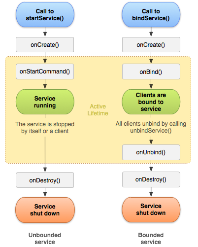
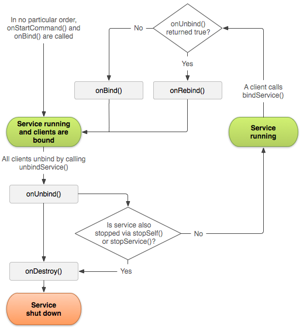

参考：[23 个重难点突破，带你吃透 Service 知识点「长达 1W+ 字」](https://hornhuang.blog.csdn.net/article/details/102880036)

## 1. `Service` 概述

`Service`（服务）是一种不提供用户界面，可以在后台长时间运行的组件。

可以在其它组件（如 `Activity`）中启动 `Service` 组件，`Service` 组件启动后就运行在后台，即使启动 `Service` 的其它组件（如 `Activity`）被销毁，也不会对在后台运行的 `Service` 造成影响。

此外，`Service` 组件可以通过与其它组件（如 `Activity`）进行绑定，从而实现组件之间的数据交互。

通过 `Service` 组件，甚至还可以实现进程间通信（`IPC`）。

特别注意：`Service` 组件虽然是在后台运行的，但仍然运行在主线程中。

## 2. `Service` 的两种工作状态

### 2.1 启动状态：`startService`

启动状态下的 `Service` 组件，主要用于执行后台计算，不可以与其他组件进行数据交互。

```java:no-line-numbers
/* Context.java */
public abstract ComponentName startService(Intent service);

public abstract boolean stopService(Intent service);
```

#### 2.1.1 多次启动 `Service` & 停止启动状态下的 `Service`

调用 `stopService`、`stopSelf`、`stopSelfResult` 方法都可以让启动状态下的 `Service` 停止。

特别注意多次启动 `Service` 的情况（即多次调用 `startService`）：

1. 多次调用 `startService` 方法启动同一个 `Service` 时，只会在首次启动时创建 `Service` 实例，且 `Service` 的 `onCreate` 方法只会在首次启动时回调一次。但 `Service` 的 `onStartCommand(intent, flags, startId)` 方法每次启动时都会回调，且参数 `startId` 每次回调时都不一样。

2. 如果要停止多次启动的 `Service`，可以调用 `stopService(service)`、`stopSelf(startId)`、`stopSelfResult(startId)`，其中传入的参数 `startId` 必须是 `-1`，或者是最后一次回调 `onStartCommand` 方法时接收到的 `startId`，传入其他的 `startId` 值无法停止服务。

```java:no-line-numbers
/* Context.java */
public abstract boolean stopService(Intent service);
```

```java:no-line-numbers
/* Service.java */
public final void stopSelf() // stopSelf(-1)

public final void stopSelf(int startId)

/*
    与 stopSelf 的区别仅在于提供了返回值
*/
public final boolean stopSelfResult(int startId)
```

### 2.2 绑定状态：`bindService`

绑定状态下的 `Service` 组件，才可以与其他组件进行数据交互。

```java:no-line-numbers
public abstract boolean bindService(Intent service, ServiceConnection conn, int flags);

public abstract void unbindService(ServiceConnection conn);
```

### 2.3 启动状态下的生命周期 & 绑定状态下的生命周期



### 2.4 两种工作状态可以共存

`Service` 组件的启动状态和绑定状态是可以同时存在的，即：可以先调用 `startService` 方法启动 `Service` 组件，然后再调用 `bindService` 方法将启动了的 `Service` 组件与当前组件进行绑定。

两种工作状态共存的场景下对 `Service` 的启动、绑定建议按如下流程执行：

```:no-line-numbers
startService -> bindService -> unbindService -> stopService
```

> 注意：绑定状态下先执行 `stopService`，不会回调 `onDestroy` 销毁 `Service`，只有当所有绑定都解绑后才会回调 `onDestroy`。

#### 2.4.1 两种工作状态共存时的生命周期 & `onRebind` 方法的回调时机

> 参考：[管理绑定服务的生命周期](https://developer.android.google.cn/guide/components/bound-services#Lifecycle)



如上图的启动并绑定 `Service` 的生命周期所示，只有当所有组件都与 `Service` 解绑，且解绑后 `Service` 仍然在运行中，那么当后面再有组件与该 `Service` 绑定时，并且重写的 `onUnbind` 方法返回 `true`，则此时才会回调 `onRebind` 方法。

> 如果只是绑定服务（`bindService`），而没有启动服务（`startService`），那么服务解绑后就直接调用 `onDestroy` 销毁了。于是就算再次绑定，也是与新创建 `Service` 实例绑定，不存在重新绑定的说法，即不会回调 `onRebind`。

```java:no-line-numbers
/* Service.java */
public void onRebind(Intent intent) {}

public boolean onUnbind(Intent intent) {
    return false; // 默认返回 false
}
```
## 3. `startForeground` & `stopForeground`

通过 `startService` 启动的 `Service` 组件默认是运行在后台的。此时，如果 `App` 中没有其它可见的组件，那么 `App` 进程就只是一个服务进程。

当内存不足时，系统可能就会通过杀死服务进程来为前台进程空出更多可用的内存空间。但是，如果不想让一个服务进程被系统杀死（如正在后台播放音乐的 `App` 进程），同时也不想通过让 `App` 界面显示出来的方式将 `App` 进程提升为前台进程以避免被杀死，那么我们可以考虑将后台运行的 `Service` 组件切换到前台来运行，此时，`App` 进程也可以提升为前台进程，从而避免被系统杀死。

调用 `Service` 组件的 `startForeground(id, notification)` 方法可以将在后台运行的 `Service` 切换到前台运行。其中，必须通过参数 `notification` 为在前台运行的 `Service` 提供一个持续显示的通知。

调用 `Service` 组件的 `stopForeground` 方法将前台运行的 `Service` 再切回到后台运行，于是 `App` 进程也降至为服务进程。

```java:no-line-numbers
/* Service.java */
public final void startForeground(int id, Notification notification)

public final void stopForeground(boolean removeNotification)
```

## 3. `onStartCommand` 的四种返回值

### 3.1 `START_STICKY_COMPATIBILITY`

`START_STICKY` 的兼容版本。

但不保证 `Service` 所在进程被 `kill` 后 `Service` 能够重启。

### 3.2 `START_STICKY`

`Service` 所在进程被 `kill` 后，系统会尝试重新创建 `Service`，并调用 `onStartCommand(intent, flags, startId)` 方法。

重新创建 `Service` 后，不会保留之前的 `Intent`，所以在调用 `onStartCommand` 方法之前，如果没有再次启动过 `Service`，那么  `onStartCommand` 方法传入的参数 `Intent` 为 `null`。

### 3.3 `START_NOT_STICKY`

`Service` 所在进程被 `kill` 后，系统不会尝试重新创建 `Service`。

### 3.4 `START_REDELIVER_INTENT`

`Service` 所在进程被 `kill` 后，系统会尝试重新创建 `Service`，并调用 `onStartCommand(intent, flags, startId)` 方法。

重新创建 `Service` 后，会保留之前的 `Intent`，所以在调用 `onStartCommand` 方法时，如果没有再次启动过 `Service`，那么  `onStartCommand` 方法传入的参数 `Intent` 为之前保存的 `Intent` 实例。

## 4. 提高 `Service` 所在进程的优先级 & 进程保活

1. 重写 `onStartCommand` 方法，其中调用 `startForeground` 方法将 `Service` 所在进程提升为前台进程级别。

    > 注意：在 `onDestroy` 中要记得调用 `stopForeground` 方法。

2. 重写 `onStartCommand` 方法，其中设置返回值为 `START_STICKY`，使得 `Service` 所在进程被杀死后，还有重启的可能。

3. 在 `Service` 的 `onDestroy` 方法中重启 `Service`。（缺陷在于 `App` 进程被杀死时，`onDestroy` 可能不会回调）

4. 通过监听系统广播重启 `Service`。如循环发送闹钟广播，在接收到此广播时调用 `startService` 方法启动 `Service`

    ```java:no-line-numbers
    Intent intent = new Intent(MainActivity.this ,MyAlarmReciver.class);
    PendingIntent sender = PendingIntent.getBroadcast( MainActivity.this, 0, intent, 0);

    // 让闹钟在 10s 后响起
    Calendar calendar = Calendar.getInstance();
    calendar.setTimeInMillis(System.currentTimeMillis());
    calendar.add(Calendar.SECOND, 10);
    AlarmManager am = (AlarmManager) getSystemService(ALARM_SERVICE);
    /**
     * 重复闹钟
     * 
     * @param type
     * @param triggerAtMillis 闹钟的第一次执行时间，以毫秒为单位
     * @param intervalMillis 表示两次闹钟执行的间隔时间，以毫秒为单位
     * @param operation 绑定了闹钟的执行动作，比如发送一个广播、给出提示等等
     */
    am.setRepeating(AlarmManager.RTC_WAKEUP, calendar.getTimeInMillis(), 2 * 1000, sender);
    ```

5. 通过第三方的消息推送 `SDK` 唤醒 `App`，如：极光推送（`JPush`）。

6. 以上方法都是在 `App` 进程被杀死后，再通过重新创建 `Service` 来重启 `App` 进程的，即避免不了 `App` 被杀死的情况，不可能达到让 `App` 进程一直存活下去的需求。只有通过让手机厂商把 `App` 放入到白名单中，才能真正的保证进程不被杀死，一直存活下去（如微信、`QQ` 、陌陌都在小米的白名单中）。