## 1. `Navigation` 的作用

单个 `Activity` 嵌套多个 `Fragment` 的 `UI` 架构模式，已经被大多数 `Android` 工程师所接受和采用。

但是，对 `Fragment` 的管理一直是一件比较麻烦的事情，比如：

1. 工程师需要通过 `FragmentManager` 和 `FragmentTransaction` 来管理 `Fragment` 之间的切换；

2. 页面的切换通常还包括：对应用程序 `App bar` 的管理、`Fragment` 间的切换动画，以及 `Fragment` 间的参数传递，纯代码的方式使用起来不是特别友好。并且 `Fragment` 和 `App bar` 在管理和使用的过程中显得很混乱。

    > `App bar` 指的是应用程序页面上方的 `ActionBar`、`ToolBar` 或 `CollapsingToolbarLayout`。

为此，`Jetpack` 提供了一个名为 `Navigation` 的组件，旨在方便我们管理页面和 `App bar`。

> 这里所说的 “页面” 包含：`Fragment` 和 `Activity`。但主要是指 `Fragment`。
> 
> 因为开发 `Navigation` 组件的主要目的就是：**方便我们在一个 `Activity` 中对多个 `Fragment` 进行管理**。

`Navigation` 组件具有以下优势：

1. 可视化的页面导航图，类似于 `Apple Xcode` 中的 `StoryBoard`，便于我们理清页面间的关系。

2. 通过 `destination` 和 `action` 完成页面间的导航。

3. 方便添加页面切换动画。

4. 页面间类型安全的参数传递。

5. 通过 `NavigationUI` 类，对菜单、底部导航、抽屉菜单导航进行统一的管理。

6. 支持深层链接 `DeepLink`。

## 2. `Navigation` 的主要元素

### 2.1 `Navigation Graph`

这是一种新的 `XML` 资源文件，其中 **包含应用程序所有的页面（特指 `Fragment`），以及页面间的关系**。

### 2.2 `NavHostFragment`

`NavHostFragment` 是一个特殊的 `Fragment`，你可以认为它是其他 `Fragment` 的 “容器”，**`Navigation Graph` 中的 `Fragment` 正是通过 `NavHostFragment` 进行展示的**。

### 2.3 `NavController`

用于在代码中完成 `Navigation Graph` 中**具体的页面切换工作**。

### 2.4 三种元素之间的关系

当你想切换 `Fragment` 时，使用 `NavController` 对象，告诉它你想要去 `Navigation Graph` 中的哪个 `Fragment`。

**`NavController` 会将你想去的 `Navigation Graph` 中的 `Fragment` 展示在 `NavHostFragment` 中**。

## 3. `Navigation` 的使用

### 3.1 添加依赖

Navigation 的使用需要依赖于相关支持库：

```groovy:no-line-numbers
dependencies {
    implementation 'androidx.navigation:navigation-fragment:2.3.0-alpha05'
    implementation 'androidx.navigation:navigation-ui:2.3.0-alpha05'
}
```

### 3.2 创建 `Navigation Graph`

新建一个 `nav_graph.xml` 文件：

```:no-line-numbers
选中 res 文件夹 -> New -> Android Resource File
```

> 注意：`Resource Type` 设置为 `Navigation`。

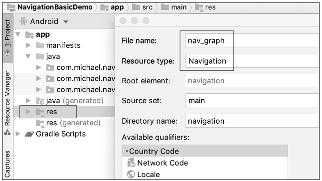

```xml:no-line-numbers
<!-- nav_graph.xml -->
<?xml version="1.0" encoding="utf-8"?>
<navigation xmlns:android="http://schemas.android.com/apk/res/android"
    xmlns:app="http://schemas.android.com/apk/res-auto"
    xmlns:tools="http://schemas.android.com/tools"
    android:id="@+id/nav_graph">

</navigation>
```

与其他布局文件类似，`Navigation` 类型的 `nav_graph.xml` 文件中也有 `Design` 和 `Text` 面板。

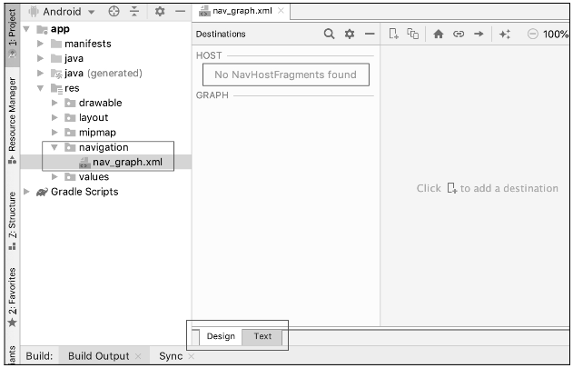

> 当 `nav_graph.xml` 还未与 `NavHostFragment` 绑定时，在 `nav_graph.xml` 的 `Design` 面板中会提示：`No NavHostFragments found`。

### 3.3 添加 `NavHostFragment` & 绑定 `Navigation Graph` 

`NavHostFragment` 作为其他 `Fragment` 的容器，本身是一个特殊的 `Fragment`，我们需要将其添加到 `Activity` 的布局文件中：

```xml:no-line-numbers
<!-- MainActivity 的布局文件 -->
<?xml version="1.0" encoding="utf-8"?>
<RelativeLayout xmlns:android="http://schemas.android.com/apk/res/android"
    xmlns:app="http://schemas.android.com/apk/res-auto"
    xmlns:tools="http://schemas.android.com/tools"
    android:layout_width="match_parent"
    android:layout_height="match_parent"
    tools:context=".MainActivity">

    <fragment
        android:id="@+id/nav_host_fragment"
        android:name="androidx.navigation.fragment.NavHostFragment"
        app:navGraph="@navigation/nav_graph" 
        app:defaultNavHost="true"
        android:layout_width="match_parent"
        android:layout_height="match_parent"/>

</RelativeLayout>
```

对于 `MainActivity` 布局文件中添加的 `fragment` 标签：

1. 通过 `android:name="androidx.navigation.fragment.NavHostFragment"` 声明添加的是 `NavHostFragment`；

2. 通过 `app:navGraph="@navigation/nav_graph"` 声明将 `NavHostFragment` 与 `nav_graph.xml` 绑定起来；

    > 其中，`"@navigation/nav_graph"` 中的 `nav_graph` 是 `nav_graph.xml` 中 `navigation` 标签的 `id`。
    >
    > 于是，`nav_graph.xml` 中包含的 `fragment` 才可以通过绑定的 `NavHostFragment` 展示出来。
    > 
    > 绑定后，`nav_graph.xml` 的 `Design` 面板中可以看到所绑定的 `NavHostFragment` 的 `resId` 以及所在的 `Activity` 的布局文件。

    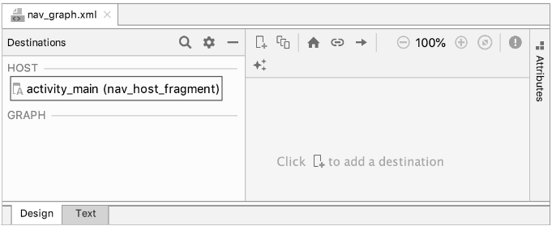

3. `app:defaultNavHost="true"` 表示 `NavHostFragment` 会自动处理系统返回键。即：返回时自动退出当前展示的 `Fragment`。

### 3.4 在 `Navigation Graph` 中添加 `Fragment`（即：创建 `destination`）

#### 3.4.1 代码实现

```xml:no-line-numbers
<!-- nav_graph.xml -->
<?xml version="1.0" encoding="utf-8"?>
<navigation xmlns:android="http://schemas.android.com/apk/res/android"
    xmlns:app="http://schemas.android.com/apk/res-auto"
    xmlns:tools="http://schemas.android.com/tools"
    android:id="@+id/nav_graph"
    app:startDestination="@id/mainFragment">

    <fragment
        android:id="@+id/mainFragment"
        android:name="com.xxx.MainFragment"
        android:label="fragment_main"
        tools:layout="@layout/fragment_main"/>

</navigation>
```

其中：

1. `<navigation>` 标签中的 `startDestination` 属性指定起始 `Fragment` 为 `MainFragment`。

    > 起始 `Fragment` 就是 `NavHostFragment` 容器首先展示的 `Fragment`。

#### 3.4.1 `Design` 面板中通过向导实现

`step1`：依次单击加号按钮、"`Create new destination`" 按钮，创建一个 `destination`

> `destination` 代表着你想去的页面。可以是 `Fragment` 或 `Activity`。
> 
> 但最常见的是 `Fragment`，因为 `Navigation` 组件的作用是方便开发者在一个 `Activity` 中管理多个 `Fragment`。

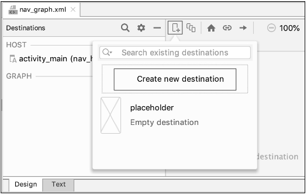

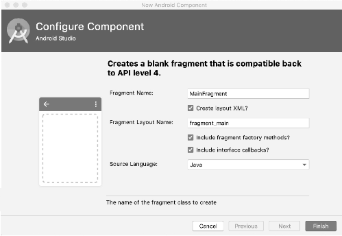

> 如上图所示，点击 "`Create new destination`" 按钮后，新建一个名为 `MainFragment` 的 `Fragment`。
> 
> 如果 `MainFragment` 已经存在，则不需要点击 "`Create new destination`" 按钮，而是在 "`Search existing destinations`" 搜索框中查找已存在的 `MainFragment`。

`step2`：再次单击加号按钮，此时出现了我们刚才创建的 `MainFragment` 对应的布局文件 `fragment_main.xml`，单击该文件，面板中出现了一个 `mainFragment`。其中，"`Start`" 表示 `MainFragment` 是起始 `Fragment`。

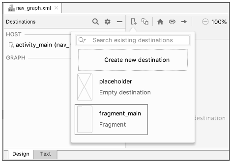

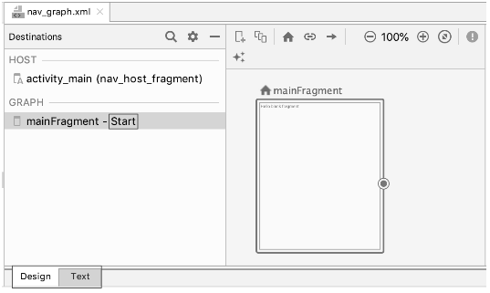

### 3.5 在 `Navigation Graph` 中声明 `Fragment` 之间的切换关系

#### 3.5.1 代码实现

```xml:no-line-numbers
<!-- nav_graph.xml -->
<?xml version="1.0" encoding="utf-8"?>
<navigation xmlns:android="http://schemas.android.com/apk/res/android"
    xmlns:app="http://schemas.android.com/apk/res-auto"
    xmlns:tools="http://schemas.android.com/tools"
    android:id="@+id/nav_graph"
    app:startDestination="@id/mainFragment">

    <fragment
        android:id="@+id/mainFragment"
        android:name="com.xxx.MainFragment"
        android:label="fragment_main"
        tools:layout="@layout/fragment_main">

        <action
            android:id="@+id/action_mainFragment_to_secondFragment"
            app:destination="@id/secondFragment"/>
        
    </fragment>

    <fragment
        android:id="@+id/secondFragment"
        android:name="com.xxx.SecondFragment"
        android:label="fragment_second"
        tools:layout="@layout/fragment_second"/>

</navigation>
```

其中：

1. `<action>` 标签中的 `app:destination` 属性表示 `mainFragment` 的目的地是 `secondFragment`。

    > 即指定 `Fragment` 的切换关系为：从 `mainFragment` 切换到 `secondFragment`。

#### 3.5.2 `Design` 面板中通过向导实现

`step1`：与创建 `MainFragment` 的方式类似，先创建一个 `SecondFragment`。

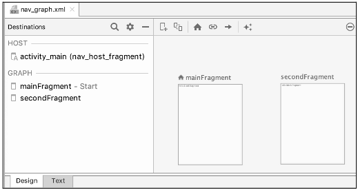

`step2`：单击 `mainFragment`，用鼠标选中其右侧的圆圈，并拖拽至右边的 `secondFragment`，松开鼠标。此时出现一个从 `mainFragment` 指向 `secondFragment` 的箭头。

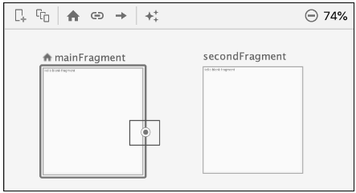

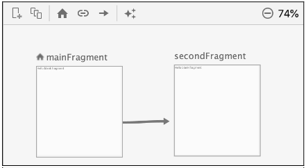

### 3.6 使用 `NavController` 完成导航

在 `nav_graph.xml` 文件中声明了 `NavHostFragment` 所包含的 `Fragment`，以及 `Fragment` 之间的切换关系后，就可以在代码中通过 `NavController` 实现 `Fragment` 的切换。

通过 `NavController` 实现 `Fragment` 切换的步骤如下：

1. 通过 `Navigation` 提供的静态方法 `findNavController()` 获取 `NavController` 实例。

    ```java:no-line-numbers
    /* Navigation.java */
    public static NavController findNavController(@NonNull View view)
    public static NavController findNavController(@NonNull Activity activity, @IdRes int viewId) 
    ```

    > `findNavController()` 方法中获取的 `NavController` 实例，是通过遍历 `View` 树查询到的，源码如下：
    >
    > ```java:no-line-numbers
    > /* Navigation.java */
    > /*
    >     两个 findNavController 重载方法最终都会调用 findViewNavController 方法来获取 NavController 实例
    > */
    > private static NavController findViewNavController(@NonNull View view) {
    >     while (view != null) {
    >         NavController controller = getViewNavController(view);
    >         if (controller != null) {
    >             return controller;
    >         }
    >         ViewParent parent = view.getParent();
    >         view = parent instanceof View ? (View) parent : null;
    >     }
    >     return null;
    > }
    > ```

2. 调用 `NavController` 实例的 `navigate()` 方法实现 `Fragment` 的切换。

    ```java:no-line-numbers
    /* NavController.java */
    public final void navigate(int resId) // navigate(resId, null);

    public final void navigate(int resId, Bundle args) // navigate(resId, args, null);

    /*
        参数 resId 可以是：
            1. <action> 标签的 id；
            2. 目标 Fragment 的 id（即 <action> 标签中 app:destination 属性表示的 id 值）
        参数 args 可以在 Fragment 切换时传入数据
        参数 navOptions 可以用来设置切换动画（通过 NavOptions.Builder 进行设置）
    */
    public void navigate(int resId, Bundle args, NavOptions navOptions)
    ```

示例：

```java:no-line-numbers
/* MainFragment.java */
@Override
public View onCreateView(LayoutInflater inflater, ViewGroup container, Bundle savedInstanceState) {
    View view = inflater.inflate(R.layout.fragment_main, container, false);

    view.findViewById(R.id.btn).setOnClickListener(v -> {
        // 这里传入 <action> 标签的 id
        Navigation.findNavController(v).navigate(R.id.action_mainFragment_to_secondFragment);
    });

    return view;
}
```

另外，`Navigation` 还提供了更便捷的静态方法 `createNavigateOnClickListener()` 方法实现 `Fragment` 的切换

```java:no-line-numbers
/* Navigation.java */
public static View.OnClickListener createNavigateOnClickListener(
            @IdRes final int resId) // createNavigateOnClickListener(resId, null);

public static View.OnClickListener createNavigateOnClickListener(
            @IdRes final int resId,
            @Nullable final Bundle args)
```

> 查看源码可知，`createNavigateOnClickListener` 方法其实就是对上面所介绍的方式的封装：
> 
> ```java:no-line-numbers
> /* Navigation.java */
> public static View.OnClickListener createNavigateOnClickListener(
>             @IdRes final int resId,
>             @Nullable final Bundle args) {
> 
>     return new View.OnClickListener() {
>         @Override
>         public void onClick(View view) {
>             findNavController(view).navigate(resId, args);
>         }
>     };
> }
> ```

示例：

```java:no-line-numbers
/* MainFragment.java */
@Override
public View onCreateView(LayoutInflater inflater, ViewGroup container, Bundle savedInstanceState) {
    View view = inflater.inflate(R.layout.fragment_main, container, false);

    view.findViewById(R.id.btn).setOnClickListener(
        Navigation.createNavigateOnClickListener(R.id.action_mainFragment_to_secondFragment));

    return view;
}
```

### 3.7 添加页面切换动画效果

#### 3.7.1 代码实现

```xml:no-line-numbers
<!-- nav_graph.xml -->
<?xml version="1.0" encoding="utf-8"?>
<navigation xmlns:android="http://schemas.android.com/apk/res/android"
    xmlns:app="http://schemas.android.com/apk/res-auto"
    xmlns:tools="http://schemas.android.com/tools"
    android:id="@+id/nav_graph"
    app:startDestination="@id/mainFragment">

    <fragment
        android:id="@+id/mainFragment"
        android:name="com.xxx.MainFragment"
        android:label="fragment_main"
        tools:layout="@layout/fragment_main">

        <action
            android:id="@+id/action_mainFragment_to_secondFragment"
            app:destination="@id/secondFragment"
            app:popEnterAnim="@anim/slide_in_left"
            app:popExitAnim="@anim/slide_out_right"
            app:enterAnim="@anim/slide_in_right"
            app:exitAnim="@anim/slide_out_left"/>
        
    </fragment>

    <fragment
        android:id="@+id/secondFragment"
        android:name="com.xxx.SecondFragment"
        android:label="fragment_second"
        tools:layout="@layout/fragment_second"/>

</navigation>
```

既可以在 `nav_graph.xml` 中通过 `<action>` 标签配置切换动画，也可以通过 `NavOptions` 来配置切换动画，然后将 `NavOptions` 传入重载的 `navigate` 方法：

```java:no-line-numbers
/* NavOptions.java */
public class NavOptions {
    ...
    public static class Builder {
        ...
        public Builder setEnterAnim(@AnimRes @AnimatorRes int enterAnim)
        public Builder setExitAnim(@AnimRes @AnimatorRes int exitAnim)
        public Builder setPopEnterAnim(@AnimRes @AnimatorRes int popEnterAnim)
        public Builder setPopExitAnim(@AnimRes @AnimatorRes int popExitAnim)
        ...
    }
}
```

```java:no-line-numbers
/* NavController.java */
public void navigate(int resId, Bundle args, NavOptions navOptions)
```

#### 3.7.2 `Design` 面板中通过向导实现

`step1`：首先，在 `res/anim` 文件夹下加入常见的动画文件

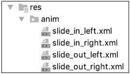

`step2`：接着，打开 `nav_graph.xml` 导航文件的 `Design` 面板，选中箭头，并在右边的 `Animations` 面板中为其设置动画文件

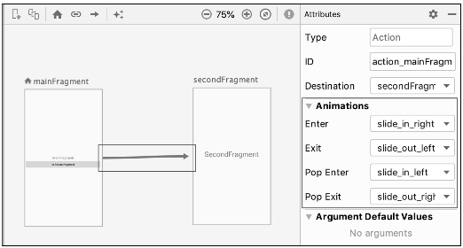

### 3.8 在切换时传递参数

#### 3.8.1 传递参数的常见方式

#### 3.8.2 使用 `safe args` 传递参数

## 4. `NavigationUI` 的使用

## 5. `DeepLink` 深层链接

