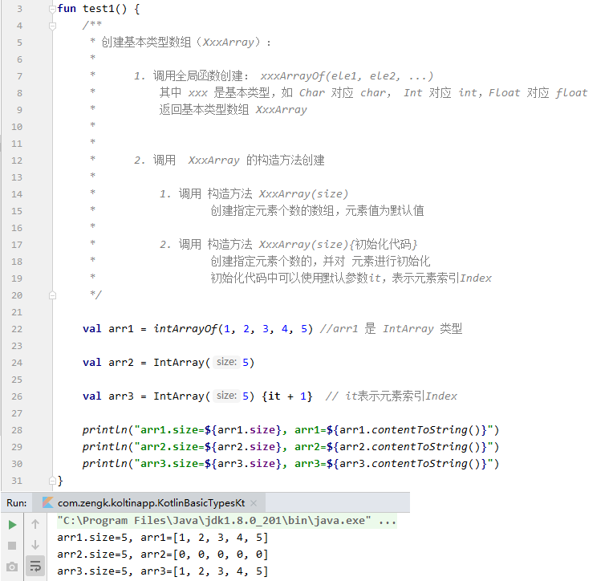
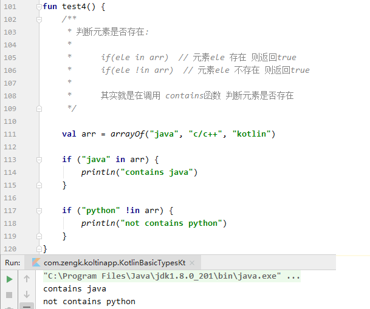
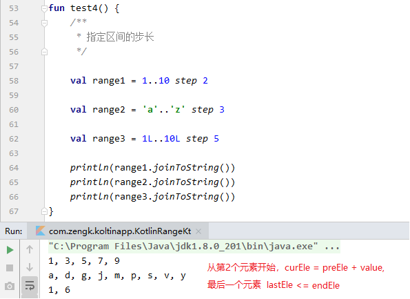
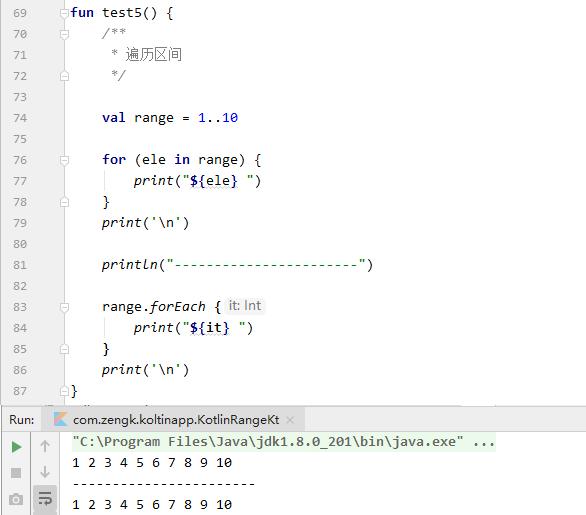
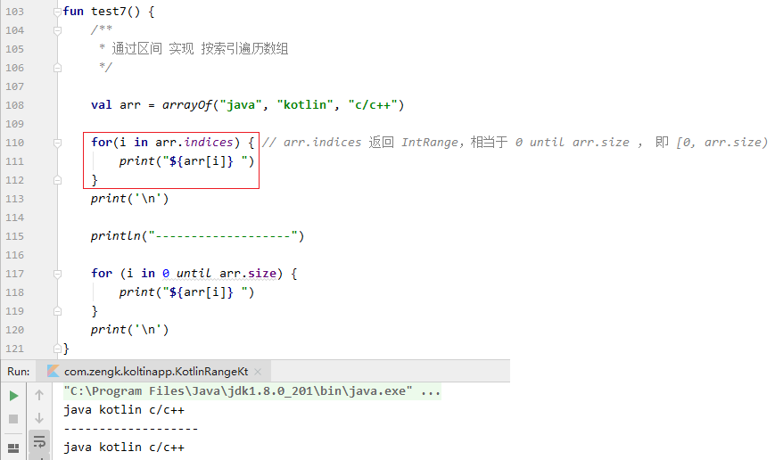

## 1. 基本类型

### 1.1 `Kotlin` 和 `Java` 的基本类型对比

||`Kotlin`|`Java`|
|:-|:-|:-|
|字节|`Byte`|`byte`/`Byte`|
|整型|`Int` & `Long`|`int`/`Integer` & `long`/`Long`|
|浮点型|`Float` & `Double`|`float`/`Float` & `double`/`Double`|
|字符|`Char`|`char`/`Chararcter`|
|字符串|`String`|`String`|

### 1.2 定义变量

#### 1.2.1 `val` 变量 & `var` 变量的定义

定义 `val` 变量：

```kotlin:no-line-numbers
val foo: Type = initValue
```

定义 `var` 变量：

```kotlin:no-line-numbers
var foo: Type = initValue
```

其中：

```:no-line-numbers
关键字 val 表示变量 foo 为只读变量（相当于 Java 中被 final 修饰的变量）
关键字 var 表示变量 foo 为可读写变量
Type 表示变量类型
initValue 表示定义变量时的初始化赋值
```

举例：

```kotlin:no-line-numbers
// 相当于 Java 的 final String str = "Hello Kotlin";
val str: String = "Hello Kotlin"  

// 相当于 Java 的  int a = 10;
var a: Int = 10  
```

#### 1.2.2 使用类型推导的方式定义变量（推荐）

```kotlin:no-line-numbers
val foo = initValue
var foo = initValue
```

如上代码所示，在编译时期，`Kotlin` 可以根据初始化赋值自动推导变量的类型，所以定义变量时可以省略变量名后的 "`: Type`"。

举例：

```kotlin:no-line-numbers
// 省略了 ": String"，但是会根据初始值 "Hello Kotlin" 自动推导为 String 类型
var str = "Hello Kotlin"  

// 省略了 ": Int" ，但是会根据初始值 5 自动推导为 Int 类型
var a = 10  
```

> 注意：在 `IntelliJ IEAD` 中，使用快捷键 `Ctrl + Q` 可以看到采用类型推导定义的变量的实际类型。


#### 1.2.3 `Kotlin` 定义 `Long` 类型的变量：

Java 中定义 long 类型变量：

```java:no-line-numbers
long a1 = 12345678910l;
long a2 = 12345678910L;
```

> 如上所示，`Java` 中可以在数值后面使用字母 `L` 将该数值标记为 `long` 类型（**字母不区分大小写**）

Kotlin 中定义 Long 类型变量：

```kotlin:no-line-numbers
val a = 12345678910L
```

> 如上所示，`Kotlin` 中也可以在数值后面使用字母 `L` 将该数值标记为 `long` 类型（**但是只能使用大写的字母 `L`**）

#### 1.2.3 `Kotlin` 定义浮点型的变量：

```kotlin:no-line-numbers
val a = 1.0   // 变量a的类型会自动推导为 Double 类型
val b = 1.0f  // 变量b的类型会自动推导为 Float 类型
```

### 1.3 数值类型转换

#### 1.3.1 `Kotlin` 中不支持 `Int` 类型到 `Long` 类型的隐式转换

`Java` 代码：

```java:no-line-numbers
int i = 10;
long l = i; // 隐式转换，编译通过
```

`Kotlin` 代码：

```kotlin:no-line-numbers
val i: Int = 10
val l: Long = i.toLong() // 不支持隐式转换，只能调用 toXxx 方法显示转换为指定类型
```

#### 1.3.2 `Kotlin` 中不支持 `Float` 类型到 `Double` 类型的隐式转换

```kotlin:no-line-numbers
val a: Double = 1.0f  // 编译报错，应该改为 val c: Double = 1.0f.toDouble()
```

### 1.4 `Kotlin` 特有的无符号类型

和 `Java` 不同的是，`Kotlin` 中存在无符号类型（这应该是为了 `Kotlin-native` 考虑的）

||有符号类型|无符号类型|
|:-|:-|:-|
|字节|`Byte`|`UByte`|
|短整型|`Short`|`UShort`|
|整型|`Int`|`UInt`|
|长整型|`Long`|`ULong`|
|字符串|`String`|`String`|

### 1.5 `Kotlin` 中的字符串

#### 1.5.1 字符串模板（`${xxx}`）

双引号字符串中可以使用 `${变量}` 和 `${表达式}` ， `Kotlin` 中称之为 **字符串模板**。

```kotlin:no-line-numbers
val hello = "Hello Kotlin"
val log = "---> ${hello}"
println(log) // ---> Hello Kotlin
```

```kotlin:no-line-numbers
val a = 2
val b = 3
val ret = "a + b = ${a + b}"
println(ret) // a + b = 5
```

#### 1.5.2 字符串比较（`==` & `===`）

1. 运算符 "`==`" 比较 **字符串内容** 是否相同
   
2. 运算符 "`===`" 比较 **字符串对象** 是否是同一个（内存地址比较）


#### 1.5.3 行字符串（`Raw String`）

`Kotlin` 中可以使用 `"""..."""` 包裹多行字符串


> 注意：调用 `trimIndent()` 函数 可以去掉定义多行字符串时的统一缩进

## 2. 数组

1. 基本类型数组：`Java` 中的基本类型数组 `t[]` 对应 `Kotlin` 中的 `TArray`


2. 类类型数组：`Java` 中的类类型数组 `T[]` 对应 `Kotlin` 中的 `Array<T>`

### 2.1 `Kotlin` 和 `Java` 的数组对比

||`Kotlin`|`Java`|
|:-|:-|:-|
|整型|`IntArray`|`int[]`|
|整型装箱|`Array<Int>`|`Integer[]`|
|字符|`CharArray`|`char[]`|
|字符装箱|`Array<Char>`|`Character[]`|
|字符串|`Array<String>`|`String[]`|

### 2.2 创建基本类型数组（`XxxArray`）

#### 2.2.1 全局函数创建：`xxxArrayOf(e1, e2, ...)`

调用全局函数创建：`xxxArrayOf(e1, e2, ...)`

> 其中 `xxx` 是基本类型，如 `Char` 对应 `char`， `Int` 对应 `int`，`Float` 对应 `float`。

> 返回基本类型数组 `XxxArray`

#### 2.2.2 构造方法创建：`XxxArray(size){...}`

1. 调用构造方法 `XxxArray(size)` 创建指定元素个数的数组，元素值为默认值。

2. 调用构造方法 `XxxArray(size){初始化代码}` 创建指定元素个数的，并对元素进行初始化。

    > 初始化代码中可以使用默认参数 `it`，表示元素索引 `Index`。

#### 2.2.3 示例



### 2.3 创建类类型数组（`Array<Xxx>`）

#### 2.3.1 全局函数创建：`arrayOf(e1, e2, ...)` & `arrayOfNulls<Xxx>(size)`

1. `arrayOf(ele1, ele2, ...)`，其中 `Xxx` 是类类型，返回类类型数组 `Array<Xxx>`

2. `arrayOfNulls<Xxx>(size)`，创建指定元素个数的数组，对象元素值为默认值 `null`

#### 2.3.2 构造方法创建：`Array<Xxx>(size){...}`

调用构造方法 `Array<Xxx>(size){初始化代码}` 创建指定元素个数的，并对元素进行初始化。

> 初始化代码中可以使用默认参数 `it`，表示元素索引 `Index`

#### 2.3.3 示例


> 注意：
> 
> 1. `Kotlin` 中使用 `size` 属性表示数组长度（`Java` 中使用 `length`）
> 
> 2. `Kotlin` 中调用 `contentToString()` 函数打印数组
> 
> 3. 和 `Java` 一样，`Kotlin` 中也使用下标运算符 `[]` 访问数组元素

### 2.4 遍历数组（`for-in` 循环 & `forEach` 函数）

`Java` 中可以使用 `foreach` 循环遍历数组

```java:no-line-numbers
for(T ele : arr) {}
```

`Kotlin` 中：

1. 可以使用 `for-in` 循环遍历数组

    ```kotlin:no-line-numbers
    for(ele in arr) {}  // 不需要显示指定元素类型
    ```

2. 还可以使用 `forEach` 函数遍历数组


### 2.5 判断元素是否存在（`in` & `!in`）

判断元素是否存在:

1. `if(ele in arr)`：元素 `ele` 存在则返回 `true`

2. `if(ele !in arr)`：元素 `ele` 不存在则返回 `true`

> 其实就是在调用 `contains` 函数判断元素是否存在。



## 3. 区间

### 3.1 创建闭区间（`beginEle..endEle`）

```kotlin:no-line-numbers
val range = beginEle..endEle  // [beginEle, endEle]
```

> 注意：调用 `joinToString()` 函数可以打印区间


### 3.2 创建前闭后开区间（`beginEle until endEle`）

```kotlin:no-line-numbers
val range = beginEle until endEle  // [beginEle, endEle)
```


### 3.3 创建倒序闭区间（`endEle downTo beginEle`）

```kotlin:no-line-numbers
val range = endEle downTo beginEle
```


### 3.4 指定区间步长（`step`）

```kotlin:no-line-numbers
val range = beginEle..endEle step value  // 步长为value
```



### 3.5 遍历区间（`for-in` 循环 & `forEach` 函数）

语法：

```kotlin:no-line-numbers
val range = beginEle..endEle

// 1. for-in 循环遍历
for(ele in range) {} 

// 2. forEach 函数遍历
range.forEach {
    // 默认参数 it 表示当前遍历到的元素
}
```



### 3.6 判断元素是否存在（`in` & `!in`）

语法：

```kotlin:no-line-numbers
if(ele in range) {} // 元素 ele 存在，则为 true

if(ele !in range) {} // 元素 ele 不存在，则为 true
```


### 3.7 通过区间实现按索引遍历数组（`arr.indices` & `0 until arr.size`）

语法：

```kotlin:no-line-numbers
for(i in arr.indices) {}  // arr.indices 返回 IntRange 类型的区间， arr.indices 相当于 0 until arr.size
```



### 3.8 离散区间 & 连续区间

1. 若 `beginEle` 和 `endEle` 是整型，则称为 **离散区间**。

2. 若 `beginEle` 和 `endEle` 是浮点型，则称为 **连续区间**。

> 注意：
> 
> 1. 不能指定连续区间的步长 `step`。
> 
> 2. 不能遍历连续区间。

## 4. 集合框架

### 4.1 概述

### 4.2 `Kotlin` 和 `Java` 的集合框架接口对比

### 4.3 `List` 集合

#### 4.3.1 创建 `List` 集合

#### 4.3.2 `List` 集合元素的增删

#### 4.3.3 访问 `List` 集合元素

### 4.4 `Map` 集合

#### 4.4.1 创建 `Map` 集合

#### 4.4.2 操作 `Map` 集合

### 4.5 二元对组 `Pair`

### 4.6 三元对组 `Triple`

## 5. 函数（函数也是一种类型）

### 5.1 函数的定义

### 5.2 函数类型

### 5.3 函数引用

#### 5.3.1 将函数引用赋给函数类型的变量

### 5.4 通过函数类型的变量调用函数

### 5.5 带可变参数的函数定义

### 5.6 结合对组类型定义多返回值的函数

### 5.7 带默认参数值的函数定义

### 5.8 案例：四则运算计算器