## 1. 类 & 接口

### 1.1 类的定义

#### 1.1.1 空类的定义

`Java` 的定义：

```java:no-line-numbers
public class Foo {}
```

`Kotlin` 的定义：

```kotlin:no-line-numbers
class Foo
```

> 注意：
> 
> 1. 类的访问权限修饰符默认为 `public`。
> 
> 2. 若类的 `{}` 为空，可以省略不写。

#### 1.1.2 带成员的类的定义

`Java` 中定义类：

```java:no-line-numbers
public class Foo {
    public int x;
    public void methodName() {}
}
```

`Kotlin` 中定义类：

```kotlin:no-line-numbers
class Foo {
    val x: Int = 0  // 需要显示初始化
    fun methodName() {}
}
```

> 注意：
> 
> `Java` 中定义类中的成员属性时，不需要显示初始化，会有一个默认值。
> 
> 但是，`Kotlin` 中定义成员属性时，需要显示初始化。

#### 1.1.3 带有参构造器的类的定义（最终版本：在主构造器上声明成员变量）

`Java` 中定义类：

```java:no-line-numbers
public class Foo {
    public int x;

    public Foo(int x) {
        this.x = x;
    }
}
```

`Kotlin` 中定义类：

```kotlin:no-line-numbers
class Foo {
    val x: Int

    constructor(x: Int) { // 副构造器（secondary constructor）
        this.x = x
    }
}
```

还可以写成：

```kotlin:no-line-numbers
class Foo constructor(x: Int) { // 主构造器（primary constructor）
    val x: Int = x
}
```

还可以简化成：

```kotlin:no-line-numbers
class Foo(x: Int) { // 主构造器（primary constructor）
    val x: Int = x
}
```

最终版本：

```kotlin:no-line-numbers
class Foo(var x: Int) { // 主构造器（primary constructor）

}
```

> 注意：
> 
> 1. 如最终版本所示，可以将成员属性定义在主构造器中。此时，在调用主构造器时，会为成员属性初始化。
> 
> 2. `var` 定义的变量是可读写变量；`val` 定义的变量是只读变量。

举例：

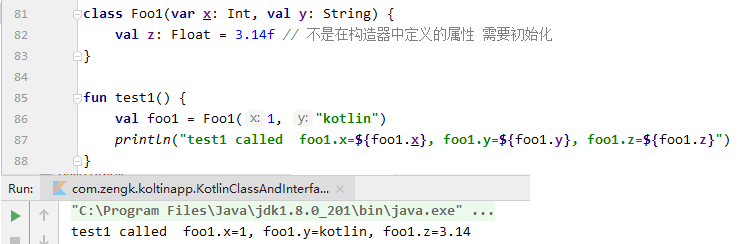

### 1.2 类的实例化（省略 `new` 关键字）

`Java` 中实例化对象：

```java:no-line-numbers
public class Foo {}
Foo foo = new Foo();
```

`Kotlin` 中实例对象：

```kotlin:no-line-numbers
class Foo
val foo = Foo()
```

> 注意：`Kotlin` 中实例化对象时不需要使用 `new` 关键字。

### 1.3 接口的定义

`Java` 中的接口定义：

```java:no-line-numbers
public interface IFoo {
    void methodName();
}
```

`Kotlin` 中的接口定义：

```kotlin:no-line-numbers
interface IFoo {
    fun methodName()  // 无返回值时 ": Unit" 可省略
}
```

> 注意：`Kotlin` 中的分号 "`;`" 可省略。

### 1.4 接口的实现（关键字 `override` 不可以省略）

`Java` 中的接口实现：

```java:no-line-numbers
public interface IFoo {
    void methodName();
}

public class implements IFoo {
    @Override
    public void methodName() {}
}
```

`Kotlin` 中的接口实现：

```kotlin:no-line-numbers
interface IFoo {
    fun methodName()
}

class Foo: IFoo {
    override fun methodName() {} // 关键字 override 不可以省略
}
```

> 注意：
> 
> 1. `Kotlin` 中大量使用了冒号 "`:`"
> 
> 2. 重写方法时，`Java` 中的注解 `@Override` 是可以省略的。但是，`Kotlin` 中的关键字 `override` 不可以省略。

### 1.5 抽象类的定义

`Java` 中抽象类的定义：

```java:no-line-numbers
public abstract class AbsFoo {
    public abstract void absMethodName();
    protected void methodName1() {}
    public final void methodName2 {}
}
```

> 注意：
> 
> `Java` 的抽象类中，除抽象方法外的普通方法，默认是可以被子类重写的。
> 
> 如果不想被子类重写，需要用关键字 `final` 修饰。


`Kotlin` 中抽象类的定义：

```kotlin:no-line-numbers
abstract class AbsFoo {
    abstract void absMethodName()
    open fun methodName1() {}
    fun methodName2() {}
}
```

> 注意：
> 
> `Kotlin` 的抽象类中，除抽象方法外的普通方法，默认是不可以被子类重写的。
> 
> 如果想被子类重写，需要用关键字 `open` 修饰。

### 1.6 类的继承

`Java` 中的类继承：

```java:no-line-numbers
public interface IFoo {
    ...
}

public abstract class AbsFoo {
    ...
}

public class FooImpl extends AbsFoo implements IFoo {
    ...
}
```

`Kotlin` 中的类继承：

```kotlin:no-line-numbers
interface IFoo {
    ...
}

abstract class AbsFoo {
    ...
}

class FooImpl(var x: Int): AbsFoo(), IFoo { // 继承类 AbsFoo 时，指定调用 AbsFoo 的无参构造方法
    ...
}
```

> 注意：
> 
> 1. `Kotlin` 中定义类时，成员属性可以在主构造器中定义。
> 
> 2. `Kotlin` 中继承父类时，需要指定调用父类的哪个构造器。

### 1.7 关键字 `open` 

#### 1.7.1 非抽象方法不加 `open` 无法重写 & 非抽象类不加 `open` 无法继承

对于父类中的非抽象方法那样，如果不加关键字 `open`，子类无法重写。

类似地，对于非抽象类，如果不加关键字 `open`，也是无法被继承的。

#### 1.7.2 关键字 `open` 可以被继承

关键字 `open` 是可以被继承的。

即：子类重写了父类的被 `open` 修饰的非抽象方法后，子类中的这个非抽象方法也默认被 `open` 修饰。

> 此时，如果子类不想再让下一级子类重写这个非抽象方法，则需要使用关键字 `final` 修饰。

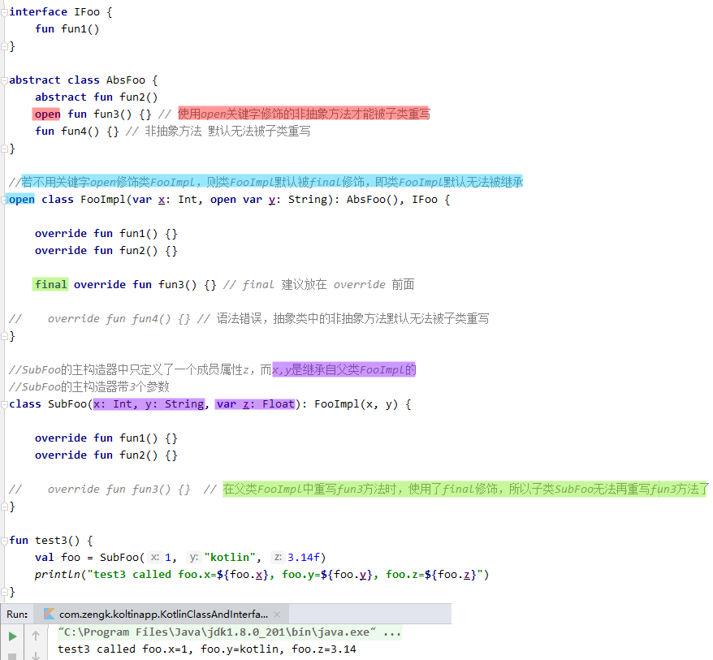

### 1.8 `Kotlin` 中的成员属性：`Property = Field + setter/getter`

类中的成员包括：成员方法和成员变量。其中，成员变量又可以称为成员属性（简称 **属性**）。

在 `Java` 中，定义一个成员属性，就仅仅是定义了一个字段（`Field`）而已，并且标准的做法是：
1. 将该字段设置为 `private`，
2. 并提供 `setter`/`getter` 方法。

在 `Kotlin` 中，定义一个成员属性，就相当于 `Java` 中的 `Field + setter/getter`，即：

```kotlin:no-line-numbers
Kotlin 中的成员属性 Property = Field + setter/getter
``` 

#### 1.8.1 成员属性的定义

`Java` 中：

```java:no-line-numbers
public class Person {
    private String name;
    private int age;

    public void setName(String name) {
        this.name = name
    }

    public String getName() {
        return name
    }
    ...
}
```

`Kotlin` 中：

```kotlin:no-line-numbers
class Person(name: String, age: Int) {

    var name: String = name
    get() {
        return field
    }
    set(value) {
        field = value
    }
}
```

`Kotlin` 中定义一个成员属性后，会默认提供 `setter`/`getter` 方法。当然，也可以像上面这样重写成员属性的 `setter`/`getter` 方法。

需要注意的是：

1. 重写的 `setter`/`getter` 方法必须紧跟在成员属性定义之后。所以，此时不能在主构造器中定义成员属性。

2. `setter`/`getter` 方法中的 `field` 是固定写法，表示成员属性本身。

#### 1.8.2 属性引用（属性也是一种类型）

`Kotlin` 中的属性（`Property`）= 字段（`Field`）+ `setter`/`getter`

`Kotlin` 中的 **属性也是一种类型**。同将函数引用赋给函数类型的变量一样，可以将属性引用赋给属性类型的变量。

于是，我们 **可以通过属性类型的变量调用属性的 `setter`/`getter` 方法**：

```kotlin:no-line-numbers
class Foo(name: String) {
    var name: String = name
    get() {
        return field
    }
    set(value) {
        field = value
    }
}

val foo = Foo("xiaoming")

// 通过类名进行的属性引用
val nameRef1 = Foo::name  
nameRef1.get(foo)
nameRef1.set(foo, "zhangsan") // 需要指定具体对象

// 通过对象名进行的属性引用
val nameRef2 = foo::name  
nameRef2.get()
nameRef2.set("zhangsan")
```

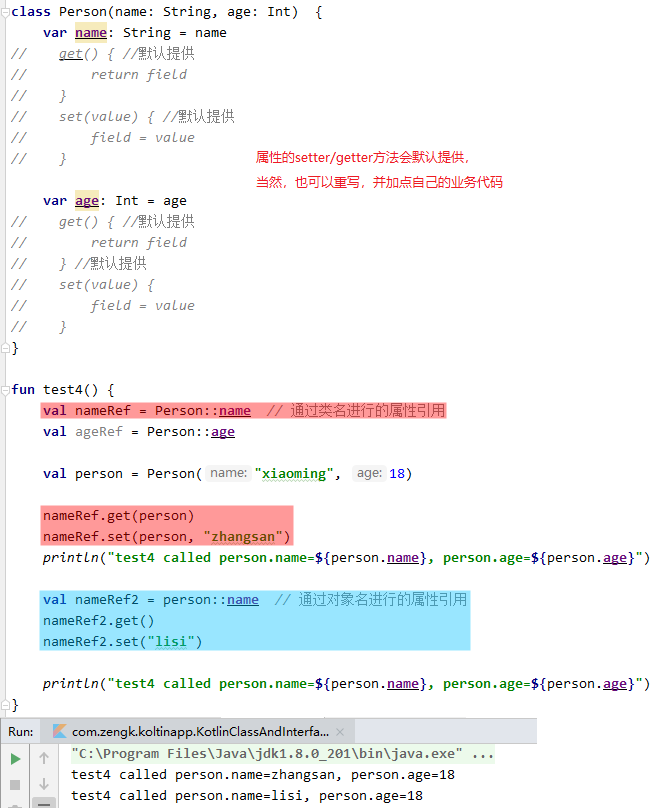

#### 1.8.3 `Koltin` 接口中定义成员属性（接口中定义的属性，子类必须重写）

`Kotlin` 的接口中可以定义成员属性。且 **接口中定义的属性，子类必须重写**。

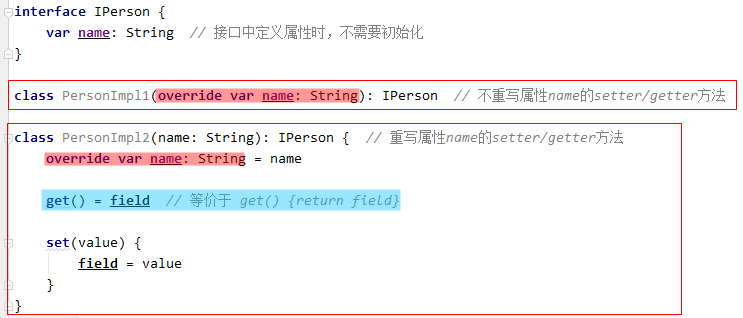

### 1.9 类的扩展成员

`Kotlin` 中，在定义了一个类之后，还可以在类外为该类添加 **扩展方法** 和 **扩展属性**。

#### 1.9.1 扩展方法

##### 1.9.1.1 扩展方法的定义

```kotlin:no-line-numbers
//定义类
class Foo 

//定义扩展方法
fun Foo.extFunName(p1: T1, p2: T2, ...): ReturnType {}
```

##### 1.9.1.2 扩展方法的类型

扩展方法的类型跟成员方法是一样的：

```kotlin:no-line-numbers
1. 对于 Foo::extFunName，函数类型为 (Foo, T1, T2, ...) -> ReturnType
2. 对于 foo::extFunName，函数类型为 (T1, T2, ...) -> ReturnType
```

#### 1.9.2 扩展属性

##### 1.9.2.1 扩展属性的定义：

```kotlin:no-line-numbers
//定义类
clas Foo {
    var attr: String = ""
}

//定义扩展属性
var Foo.extAttr: String
get() = attr  // 相当于 get() {return attr}
set(value) {attr = value}
```

##### 1.9.2.2 扩展属性没有 `backing field`（接口中定义的属性也没有）

扩展属性没有 `field`（即 `backing field`），所以无法保存状态。只能绑定其他的成员属性来实现状态的保存。

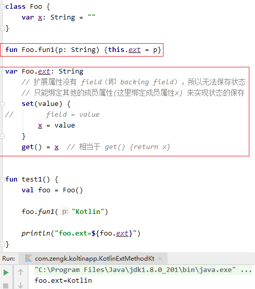


注意：除了类的扩展属性没有 `backing field`，无法保存状态之外。接口中定义的成员属性也没有 `backing field`，也无法保存状态。

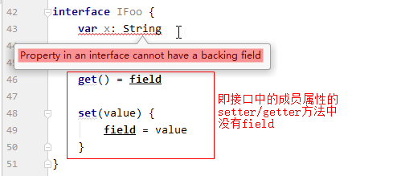

## 2. 空类型安全

### 2.1 可空类型（`Type?`）& 不可空类型（`Type`）

`Kotlin` 中的引用类型 **默认都是不可空类型**。

不可空类型的变量永远不可能为 `null`。

如果想使引用类型变成可空类型，则需要在引用类型后面加问号 "`?`"

不可空类型：

```kotlin:no-line-numbers
var x: Type = initValue // initValue 不可以是 null
```

可空类型：

```kotlin:no-line-numbers
var x: Type? = null // 可空类型的变量可以是 null
```

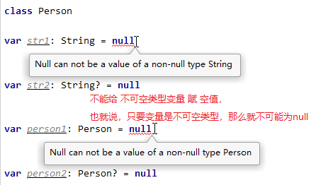

### 2.2 可空类型强转为不可空类型（`obj!!`）

对于可空类型 `Type?` 的对象 `obj`：

1. 可以通过 "`obj!!`" 强转为不可空类型 `Type`

2. 可以通过 "`obj!!.member`" 强转为不可空类型后再访问成员

注意：**只有当我们能够确定可空类型的变量不为 `null`，才能将其强转为不可空类型**。

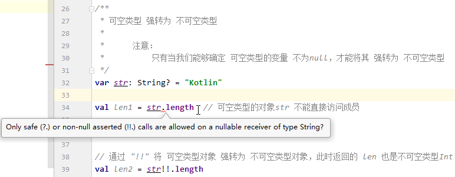

### 2.3 可空类型的对象访问成员

#### 2.3.1 通过 "?." 返回可空类型的结果

可空类型 `Type?` 的对象 `obj` 访问成员时，需要加 "`?`" ，此时返回的结果也是可空类型 `Type?`
    
```kotlin:no-line-numbers
val ret = obj?.member  // ret 是可空类型 Type?
```

#### 2.3.2 结合使用 `elvis` 运算符 "`?:`" 得到不可空类型的结果

若想得到一个不可空类型 `Type` 的结果，需要结合使用 `elvis` 运算符 "`?:`"
    
`elvis` 运算符的语法： 

```kotlin:no-line-numbers
leftExpress ?: rightExpress

说明：
1. 当 leftExpress 的结果不为空时，运算符 "?:" 的结果为 leftExpress 的结果
2. 当 leftExpress 的结果为空时，运算符 "?:" 的结果为 rightExpress 的结果
```

举例：

```kotlin:no-line-numbers
// obj 为空时，返回 defValue；若 defValue 不为空，则结果 ret 是不可空类型 Type
val ret = obj?.member?:defValue  
```

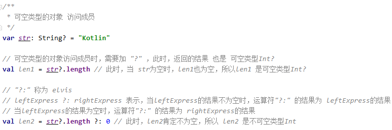

### 2.4 不可空类型（`Type`）是可空类型（`Type?`）的子类

通过里式替换原则进行验证可知：不可空类型 `Type` 是可空类型 `Type?` 的子类。

> 里式替换原则的定义：所有引用过基类的地方必须能透明地使用其子类的对象。

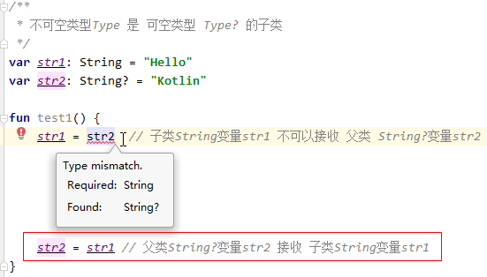

### 2.5 平台类型（`Type!`）

#### 2.5.1 什么是平台类型

`Kotlin` 代码不仅可以编译成 `Java` 代码，还可以编译成 `JavaScript` 代码，或 `Native` 代码（`c/c++`）

以编译成 `Java` 为例：

1. `Kotlin` 代码可以兼容 `Java` 代码。

2. 在 `Kotlin` 中访问 `Java` 类时，**`Java` 中的类类型 `Type` 就是一个 `Java` 平台类型（`Kotlin` 中表示为 `Type!`）**。

#### 2.5.2 `@NonNull`/`Type` & `@Nullable`/`Type?` & `Type!`

```java:no-line-numbers
import androidx.annotation.Nullable;
public class Person {
    private String name;

    public String getName1() {
        return name;
    }

    @NonNull
    public String getName2() {
        return name;
    }

    @Nullable
    public String getName3() {
        return name;
    }
}
```

如上代码所示，在 `Kotlin` 代码中访问 `Java` 类 `Person` 时：

1. 当访问用 `@NonNull` 修饰的方法时，方法的返回值类型是不可空类型 `Type`

2. 当访问用 `@Nullable` 修饰的方法时，方法的返回值类型是可空类型 `Type?`

3. 当访问无注解修饰的方法时，方法的返回值类型是平台类型 `Type!`

#### 2.5.3 无法主动声明变量为平台类型

平台类型 `Type!` 仅 `Kotlin` 内部使用，程序员无法手动将变量声明为平台类型 `Type!`

#### 2.5.4 平台类型的对象访问成员（无法确定平台类型的变量是否为 `null`）

当对象为平台类型 `Type!` 时，无法确定该对象是否为空

##### 2.5.4.1 通过 "`?.`" 返回可空类型的结果

可以使用运算符 "`?.`" 来访问平台类型的对象的成员，得到的结果是可空类型 `Type?`

##### 2.5.4.2 结合 `elvis` 运算符 "`?:`" 得到不可空类型的结果

也可以结合运算符 "`?.`" 和 `elvis` 运算符 "`?:`" 来访问成员。当对象为空时，赋以默认结果值，从而得到一个不可空类型 `Type` 的结果。

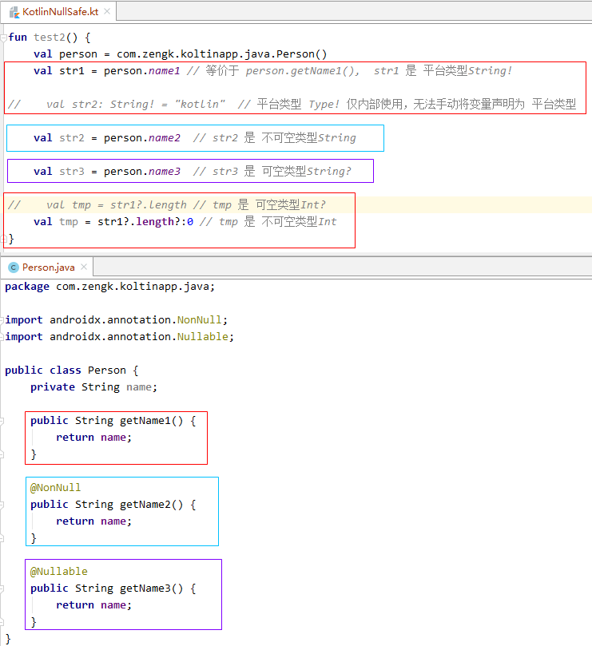

### 2.6 运算符 "`!!.`"、"`?.`"、"`?:`" 使用总结

1. 若对象 `obj` 是可空类型 `Type`，且能肯定 `obj` 非空，则可以使用 "`!!.`" 访问成员，得到的结果是不可空类型 `Type`

    ```kotlin:no-line-numbers
    val ret = obj!!.member  // ret 是不可空类型 Type
    ```

2. 若对象 `obj` 是可空类型 `Type?`，且无法确定 `obj` 是否为空，则可以使用 "`?.`" 访问成员，得到的结果是可空类型 `Type?`

    ```kotlin:no-line-numbers
    val ret = obj?.member  // ret 是可空类型 Type?
    ```

3. 若对象 `obj` 是可空类型 `Type?`，且无法确定 `obj` 是否为空，但是想访问成员得到一个非空的结果，则可以结合使用 "`?.`" 和 "`?:`"，使得 `obj` 为空时返回一个默认的非空结果值，此时得到的结果是不可空类型 `Type`

    ```kotlin:no-line-numbers
    val ret = obj?.member?:defValue  // defValue 非空，ret 是不可空类型 Type
    ```

4. 特别地，当对象 `obj` 是平台类型 `Type!` 时， 也可以结合使用 "`?.`" 和 "`?:`" 得到一个不可空类型的结果。

## 3. 智能类型转换

### 3.1 父类引用转子类引用：`if(obj is Foo)`

`Java` 中的类型转换如下：

```kotlin:no-line-numbers
/* 接口定义 */
public interface IPerson {}

/* 类定义 */
public class Person implements IPerson {
    private String name;
    public Person(String name) { this.name = name; }
        
    public String getName() {return name;}
}

/* 转换 */
IPerson p = new Person("xiaoming");
if(p instanceof Person) {
    String name = ((Person)p).getName()
}
```

`Kotlin` 中的类型转换如下：

```kotlin:no-line-numbers
/* 接口定义 */
interface IPerson

/* 类定义 */
class Person(var name: String): IPerson

/* 转换 */

val p: IPerson = Person("xiaoming")

// is 表示判断变量 p 是否是 Person类型（相当于 Java 中的 instanceof）
if(p is Person) { 
    /*
        as 表示将变量 p 转为 Person 类型
        根据 if 判断语句，为 true 时说明变量 p 就是 Person 类型了，
        所以这里可以省略 as 转换，Kotlin 内部会进行智能类型转换。
    */
    // val name = (p as Person).name

    val name = p.name // 智能类型转换为 Person 类型
}
```

### 3.2 可空类型转不可空类型：`if(obj != null)`（只适用于局部变量）

对于局部变量 `obj`，若其类型为可空类型 `Type`，则可以通过 `if` 语句进行非空判断，此时在 `if` 语句的代码块中可空类型变量 `obj` 会被 `Kotlin` 智能转换为不可空类型变量。

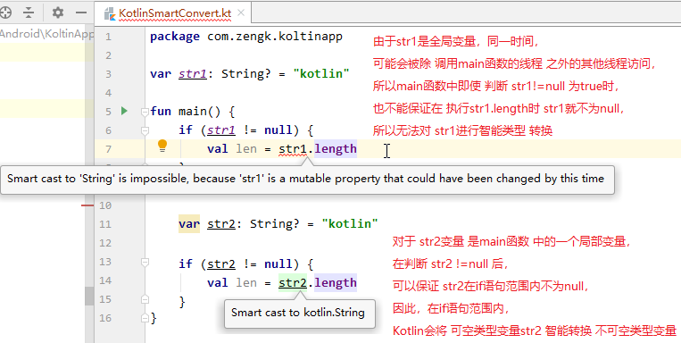

## 4. 类型的安全转换：`obj as? Foo`

当可以保证变量 `obj` 能够转换为 `Type` 时，可以使用 `as` 将变量 `obj` 转为不可空类型 `Type`

当无法保证变量 `obj` 能够转换为 `Type` 时，应该使用 `as?` 进行转换，转换后的结果是可空类型 `Type?`

如果转换失败，那么 `as?` 返回 `null`（`as?` 称为 **类型的安全转换**）

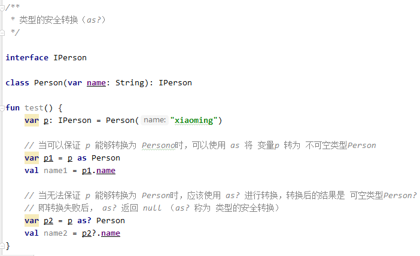

## 5. 编程建议

### 5.1 尽量使用 `val` 声明不可变引用

尽可能使用 `val` 声明不可变引用，使程序代码的含义更加清晰明确。

### 5.2 尽量减少函数对全局变量的直接访问（可以通过局部变量访问）

尽可能减少函数对全局变量的访问（多线程访问全局变量时容易产生线程同步的问题），这也为函数式编程提供了基础。

必要时创建局部变量来指向全局变量，避免因对全部变量的多线程访问而造成的问题。

## 5. 案例：使用 `Retrofit` 发送网络请求

### 5.1 添加依赖：

```groovy:no-line-numbers
dependencies {
    ...
    implementation 'com.squareup.retrofit2:retrofit:2.6.2'
    implementation 'com.squareup.retrofit2:converter-gson:2.6.2'
    implementation 'com.google.code.gson:gson:2.8.1'
}
```

### 5.2 注意事项

1. "`data class`" 声明一个数据类（后面课程会有介绍）。

2. `obj::class` 返回 `Kotlin` 的字节码对象。

3. `obj::class.java` 返回 `Java` 的字节码对象。

    > 其中 `java` 是 `Kotlin` 的字节码类型 `KClass` 的一个扩展属性。

4. `Kotlin` 中，为 `Java` 类 `java.io.File` 提供了大量的扩展方法，从而使得在 `Kotlin` 中可以方便地进行 `IO` 操作，并且不需要考虑 `IO` 流的释放关闭。

### 5.3 代码示例（`File.writeText` & `data class` & `obj::class.java`）

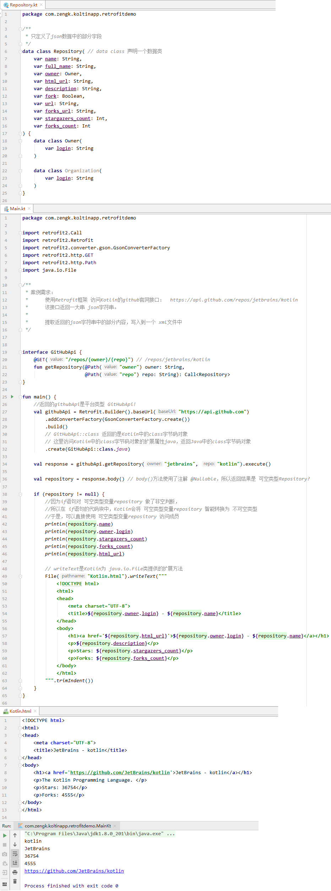