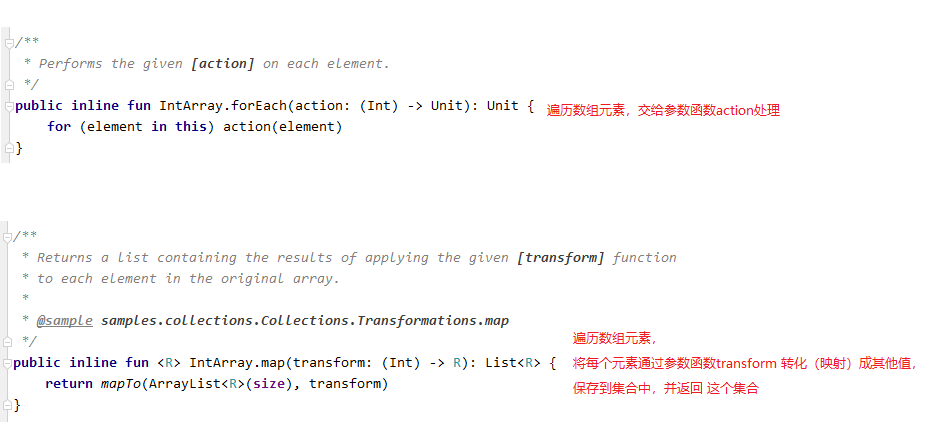
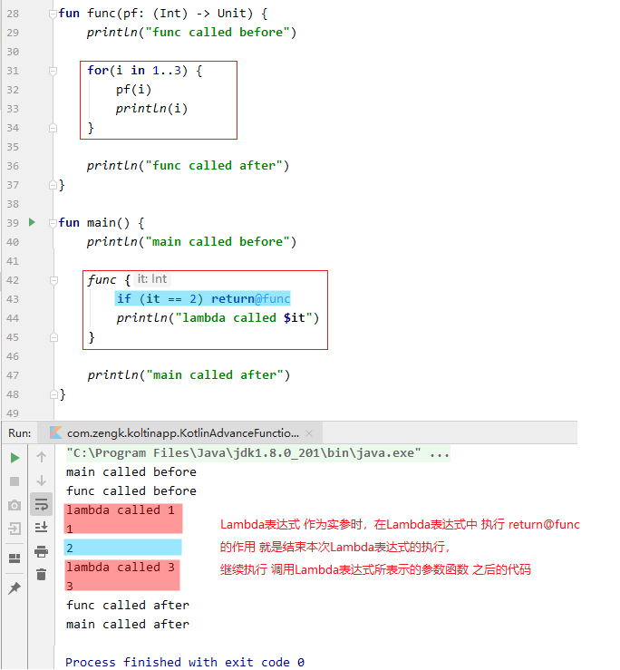
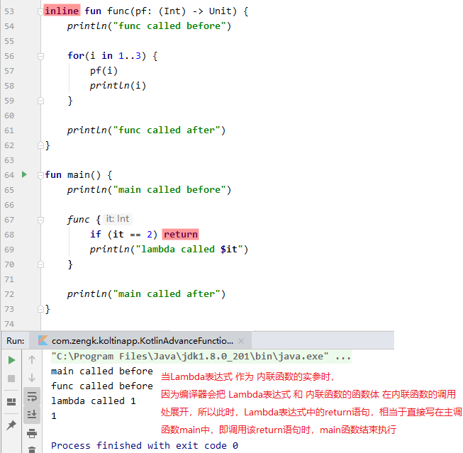
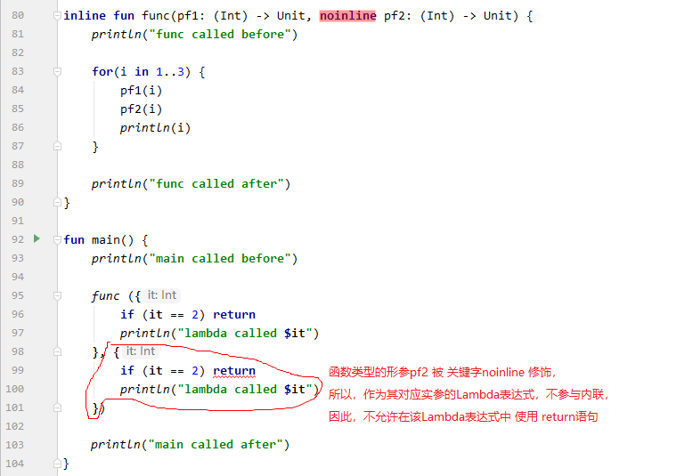
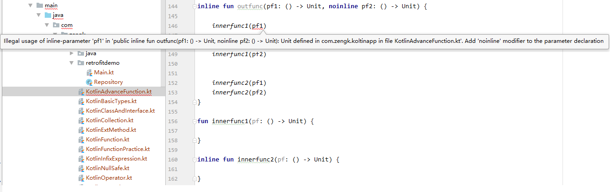
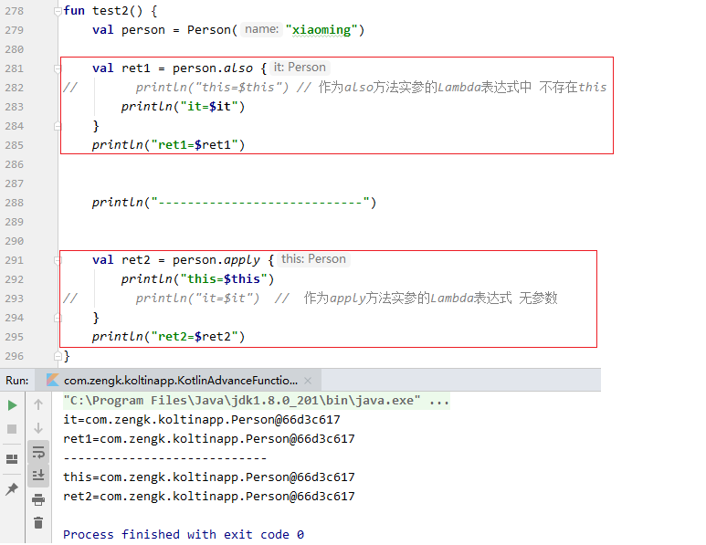

## 1. 高阶函数

### 1.1 什么是高阶函数

以下 `2` 点至少满足其一的函数称为高阶函数：

1. 形参列表中包含函数类型的参数

    ```kotlin:no-line-numbers
    //参数 paramN 可以是：函数引用、函数类型变量、或 Lambda 表达式。
    fun funName(param1: Type1, param2: Type2, ... , paramN: (p1: T1, p2: T2, ...) -> RT): ReturnType {
        ...
    }
    ```

2. 返回值类型是函数类型

    ```kotlin:no-line-numbers
    fun funName(param1: Type1, param2: Type2, ...): (p1: T1, p2: T2, ...) -> RT {
        ...
        //可以返回：函数引用、函数类型变量、或 Lambda 表达式。
    }
    ```

### 1.2 高阶函数举例



## 2. 内联函数

### 2.1 通过关键字 `inline` 声明内联函数

`Kotlin` 中的内联函数类似于 `C++` 中的内联函数，都是在函数原型前面加 `inline` 关键字声明一个内联函数。

### 2.2 内联函数举例

内联函数的定义：

```kotlin:no-line-numbers
inline fun cost(block: () -> Unit) {
    val start = System.currentTimeMills()
    block()
    println(System.currentTimeMills() - start)
}
```

内联函数的调用：

```kotlin:no-line-numbers
cost {
    println("Hello")
}
```

编译后的内联函数调用处的代码：

```kotlin:no-line-numbers
val start = System.currentTimeMills()
println("Hello")
println(System.currentTimeMills() - start)
```

### 2.3 高阶函数内联

内联函数常与高阶函数搭配使用，即：高阶函数内联。

高阶函数内联包含两个方面的内容：

1. 高阶函数被调用时，函数类型的实参内联到高阶函数内部的调用处；
   
2. 高阶函数被调用时，高阶函数本身内联到主调函数的调用处。

## 3. `Lambda` 表达式中的 `return` 语句

### 3.1 一般情况下 `Lambda` 表达式中不允许使用 `return` 语句

一般情况下，`Lambda` 表达式中不允许使用 `return` 语句。

`Lambda` 表达式的函数体的返回值由最后一条执行语句的结果值确定。


### 3.2 高阶函数中 `Lambda` 表达式作实参时 `return@funName` 语句的作用

当 `Lambda` 表达式作为高阶函数 `funName` 的函数类型参数 `pfun` 的实参时，可以在 `Lambda` 表达式中执行 `return@funName`。

表示结束执行 `Lambda` 表达式中` return@funName` 之后的语句，继续执行函数 `funName` 中调用参数函数 `pfun` 之后的语句。



### 3.3 高阶函数内联时 `Lambda` 表达式作实参时 `return` 语句的作用

当 `Lambda` 表达式作为内联的高阶函数 `funName` 的函数类型参数 `pfun` 的实参时，可以在 `Lambda` 表达式中使用 `return` 语句。

此时，因为内联的高阶函数 `funName` 作为被调函数时，编译后会把 `Lambda` 表达式的代码和高阶函数 `funName` 的函数体代码直接放到主调函数中，所以 `Lambda` 表达式中的 `return` 语句相当于直接写在主调函数中。也就是说，此时执行 `Lambda` 表达式中的 `return` 语句相当于直接结束主调函数的执行。



## 4. 关键字 `noinline`

对于包含函数类型参数的内联高阶函数 `funName`，当调用内联高阶函数时，如果 `Lambda` 表达式作为实参，那么 `Lambda` 表达式默认也会参与内联，即默认会把 `Lambda` 表达式的代码在内联函数中的调用处展开。

但是，有时候我们 **不想让作为实参的 `Lambda` 表达式参与内联**，那么此时需要使用关键字 `noinline` 修饰对应的函数类型参数。

> **注意**：不参与内联的 `Lambda` 表达式，是不允许使用 `return` 语句的。也就是说，当 `Lambda` 表达式作为被 `noinline` 修饰的函数类型参数的实参时，该 `Lambda` 表达式中不允许使用 `return` 语句。



## 5. 关键字 `crossinline`

对于参与内联的 `Lambda` 表达式，可以使用 `return` 语句。并且执行该 `return` 语句就是结束调用内联函数的主调函数的执行。

但是，有时候我们并不想让参与内联的 `Lambda` 表达式拥有这么大的权限，于是可以使用关键字 `crossinline` 声明一个函数类型的参数，这就意味着作为该函数类型参数的实参的 **`Lambda` 表达式虽然可以参与内联，但不允许使用 `return` 语句**。


## 6. 内联属性

若属性的 `setter`/`getter` 方法被关键字 `inline` 修饰，则称该属性称为 **内联属性**。

注意：内联属性不可以有 `backing field`

也就说是：

1. 成员属性不可以作为内联属性，即成员属性的 `setter`/`getter` 方法不能被 `inline` 修饰
   
2. 扩展属性可以作为内联属性，即扩展属性的 `setter`/`getter` 方法可以被 `inline` 修饰

## 7. 内联函数的限制

1. 访问权限为 `public`/`protected` 的内联成员方法中，不能访问 `private` 修饰的私有成员。

    > 这是因为在类外调用 `public`/`protected` 修饰的内联成员方法时，会将内联成员方法的函数体展开在类外的调用处这就相当于直接在类外调用类中的私有成员了。

    

2. 参与内联的函数类型参数不能被存储（即不能将参与内联的函数类型参数赋给变量）。

    

3. 当函数嵌套调用时，外层函数中参与内联的函数类型参数只能传递给内层函数中参与内联的函数类型参数。

    

## 8. 常用的扩展方法

### 8.1 `let`

#### 8.1.1 函数定义（`Standard.kt`）

```kotlin:no-line-numbers
// 函数定义（在 Standard.kt 文件中定义）
@kotlin.internal.InlineOnly
public inline fun <T, R> T.let(block: (T) -> R): R {
    contract {
        callsInPlace(block, InvocationKind.EXACTLY_ONCE)
    }
    return block(this)
}
```

#### 8.1.2 作用

```kotlin:no-line-numbers
扩展方法 let 的 Receiver 是泛型 T，这表示所有类型的变量，甚至是字面量都可以作为调用者来调用 let 方法。

let 方法的只有一个函数类型为 (T) -> R 的参数 block，在 let 方法中执行了 return block(this)，由此可知：
1. 当 Lambda 表达式作为 let 方法的实参时，Lambda 表达式的默认参数 it 就是 let 方法的调用者（即 receiver）；
2. let 方法的返回值就是 Lambda 表达式的返回值。
```

### 8.2 `run`

#### 8.2.1 函数定义（`Standard.kt`）

```kotlin:no-line-numbers
@kotlin.internal.InlineOnly
public inline fun <T, R> T.run(block: T.() -> R): R {
    contract {
        callsInPlace(block, InvocationKind.EXACTLY_ONCE)
    }
    return block()
}
```

#### 8.2.2 作用

```kotlin:no-line-numbers
扩展方法 run 的 Receiver 是泛型 T，这表示所有类型的变量，甚至是字面量都可以作为调用者来调用 run 方法。

run 方法的只有一个函数类型为 T.() -> R 的参数 block，在 run 方法中执行了 return block()，由此可知：
1. 当 Lambda 表达式作为 run 方法的实参时，Lambda 表达式是无参数的。
   但是从函数类型 T.() -> R 可以看出，Lambda 表达式中存在 this，this 指向 run 方法的调用者（即 receiver）。
2. run 方法的返回值就是 Lambda 表达式的返回值。
```

#### 8.2.3 `let` & `run` 的区别

`let` 和 `run` 的相同点：

```kotlin:no-line-numbers
1. 所有类型的变量，甚至是字面量都可以作为调用者；
2. 都只有一个函数类型的参数；
3. 返回值都是作为实参的 Lambda 表达式的返回值。
```

`let` 和 `run` 的不同点：

```kotlin:no-line-numbers
1. let 方法中，作为实参的 Lambda 表达式带一个参数，传入的参数值就是 let 方法的调用者；
   run 方法中，作为实参的 Lambda 表达式无参数；

2. let 方法中，作为实参的 Lambda 表达式中不存在 this；
   run 方法中，作为实参的 Lambda 表达式中存在 this，this 指向 run 方法的调用者。
```

#### 8.2.4 `let` & `run` 的示例


### 8.3 `also`

#### 8.3.1 函数定义（`Standard.kt`）

```kotlin:no-line-numbers
//函数定义（在Standard.kt文件中定义）
@kotlin.internal.InlineOnly
@SinceKotlin("1.1")
public inline fun <T> T.also(block: (T) -> Unit): T {
    contract {
        callsInPlace(block, InvocationKind.EXACTLY_ONCE)
    }
    block(this)
    return this
}
```

#### 8.3.2 作用

```kotlin:no-line-numbers
扩展方法 also 的 Receiver 是泛型 T，这表示所有类型的变量，甚至是字面量都可以作为调用者来调用 also 方法。

also 方法的只有一个函数类型为 (T) -> Unit 的参数 block，在 also 方法中先后执行了 block(this) 和 return this，由此可知：
1. 当 Lambda 表达式作为 also 方法的实参时，Lambda 表达式的默认参数 it 就是 also 方法的调用者（即 receiver）
2. also 方法的返回值就是 also 方法的调用者。
```

### 8.4 `apply`

#### 8.4.1 函数定义（`Standard.kt`）

```kotlin:no-line-numbers
//函数定义（在Standard.kt文件中定义）
@kotlin.internal.InlineOnly
public inline fun <T> T.apply(block: T.() -> Unit): T {
    contract {
        callsInPlace(block, InvocationKind.EXACTLY_ONCE)
    }
    block()
    return this
}
```

#### 8.4.2 作用

```kotlin:no-line-numbers
扩展方法 apply 的 Receiver 是泛型 T，这表示所有类型的变量，甚至是字面量都可以作为调用者来调用 apply 方法。

apply 方法的只有一个函数类型为 T.() -> Unit 的参数 block，在 apply 方法中先后执行了 block() 和 return this，由此可知：
1. 当 Lambda 表达式作为 apply 方法的实参时，Lambda 表达式是无参数的。
   但是从函数类型 T.() -> Unit 可以看出，Lambda 表达式中存在 this，this 指向 apply 方法的调用者（即 receiver）。
2. apply 方法的返回值就是 apply 方法的调用者。
```

#### 8.4.3 `also` & `apply` 的区别

`also` 和 `apply` 的相同点：

```kotlin:no-line-numbers
1. 所有类型的变量，甚至是字面量都可以作为调用者；
2. 都只有一个函数类型的参数；
3. 返回值都是方法的调用者。
```

`also` 和 `apply` 的不同点：

```kotlin:no-line-numbers
1. also 方法中，作为实参的 Lambda 表达式带一个参数，传入的参数值就是 also 方法的调用者；
   apply 方法中，作为实参的 Lambda 表达式无参数；

2. also 方法中，作为实参的 Lambda 表达式中不存在 this；
   apply 方法中，作为实参的 Lambda 表达式中存在 this，this 指向 apply 方法的调用者。
```

#### 8.4.4 `also` & `apply` 的示例



### 8.5 `use`

#### 8.5.1 函数定义（`Closeable.kt`）

```kotlin:no-line-numbers
//函数定义（在Closeable.kt文件中定义）
@InlineOnly
@RequireKotlin("1.2", versionKind = RequireKotlinVersionKind.COMPILER_VERSION, 
                message = "Requiresnewer compiler version to be inlined correctly.")
public inline fun <T : Closeable?, R> T.use(block: (T) -> R): R {
    var exception: Throwable? = null
    try {
        return block(this)
    } catch (e: Throwable) {
        exception = e
        throw e
    } finally {
        when {
            apiVersionIsAtLeast(1, 1, 0) -> this.closeFinally(exception)
            this == null -> {}
            exception == null -> close()
            else ->
                try {
                    close()
                } catch (closeException: Throwable) {
                    // cause.addSuppressed(closeException) // ignored here
                }
        }
    }
}
```

#### 8.5.2 作用

```kotlin:no-line-numbers
扩展方法 use 的 Receiver 是泛型 T，且要求泛型 T 实现了 Closeable 接口，
这表示所有 Closeable 接口的子类对象都可以作为调用者来调用 use 方法。

use 方法的只有一个函数类型为 (T) -> R 的参数 block，在 use 方法中执行了 return block(this)，由此可知：
1. 当 Lambda 表达式作为 use 方法的实参时，Lambda 表达式的默认参数 it 就是 use 方法的调用者（即 receiver）
2. use 方法的返回值就是 Lambda 表达式的返回值

查看 use 方法的源码可知，try-catch 代码块 会捕获 Lambda 表达式中的异常，
并且在 finally 代码块中会调用 Closeable 接口的子类对象（即 Receiver）的 close 方法（this.closeFinally(exception)）
```

#### 8.5.3 示例


## 9. 常用的集合操作及相关的扩展方法

## 10. `Kotlin` 中的匿名内部类

## 11. `SAM` 转换

## 12. 案例