## 1. 高阶函数

### 1.1 什么是高阶函数

以下 `2` 点至少满足其一的函数称为高阶函数：

1. 形参列表中包含函数类型的参数

    ```kotlin:no-line-numbers
    //参数 paramN 可以是：函数引用、函数类型变量、或 Lambda 表达式。
    fun funName(param1: Type1, param2: Type2, ... , paramN: (p1: T1, p2: T2, ...) -> RT): ReturnType {
        ...
    }
    ```

2. 返回值类型是函数类型

    ```kotlin:no-line-numbers
    fun funName(param1: Type1, param2: Type2, ...): (p1: T1, p2: T2, ...) -> RT {
        ...
        //可以返回：函数引用、函数类型变量、或 Lambda 表达式。
    }
    ```

### 1.2 高阶函数举例


## 2. 内联函数

### 2.1 通过关键字 `inline` 声明内联函数

`Kotlin` 中的内联函数类似于 `C++` 中的内联函数，都是在函数原型前面加 `inline` 关键字声明一个内联函数。

### 2.2 内联函数举例

内联函数的定义：

```kotlin:no-line-numbers
inline fun cost(block: () -> Unit) {
    val start = System.currentTimeMills()
    block()
    println(System.currentTimeMills() - start)
}
```

内联函数的调用：

```kotlin:no-line-numbers
cost {
    println("Hello")
}
```

编译后的内联函数调用处的代码：

```kotlin:no-line-numbers
val start = System.currentTimeMills()
println("Hello")
println(System.currentTimeMills() - start)
```

### 2.3 高阶函数内联

内联函数常与高阶函数搭配使用，即：高阶函数内联。

高阶函数内联包含两个方面的内容：

1. 高阶函数被调用时，函数类型的实参内联到高阶函数内部的调用处；
   
2. 高阶函数被调用时，高阶函数本身内联到主调函数的调用处。

## 3. `Lambda` 表达式中的 `return` 语句

### 3.1 一般情况下 `Lambda` 表达式中不允许使用 `return` 语句

一般情况下，`Lambda` 表达式中不允许使用 `return` 语句。

`Lambda` 表达式的函数体的返回值由最后一条执行语句的结果值确定。

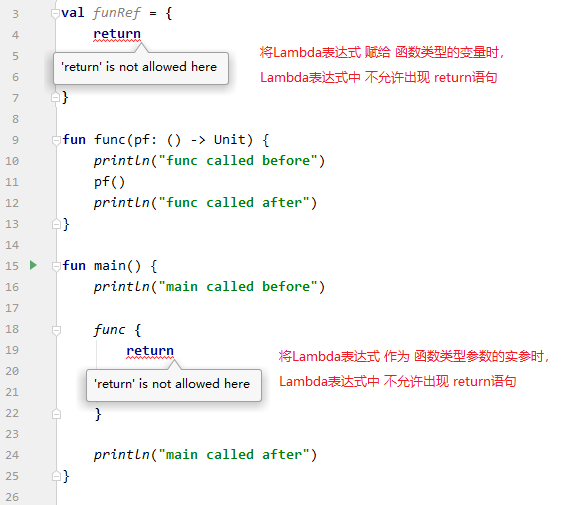

### 3.2 高阶函数中 `Lambda` 表达式作实参时 `return@funName` 语句的作用

当 `Lambda` 表达式作为高阶函数 `funName` 的函数类型参数 `pfun` 的实参时，可以在 `Lambda` 表达式中执行 `return@funName`。

表示结束执行 `Lambda` 表达式中` return@funName` 之后的语句，继续执行函数 `funName` 中调用参数函数 `pfun` 之后的语句。


### 3.3 高阶函数内联时 `Lambda` 表达式作实参时 `return` 语句的作用

当 `Lambda` 表达式作为内联的高阶函数 `funName` 的函数类型参数 `pfun` 的实参时，可以在 `Lambda` 表达式中使用 `return` 语句。

此时，因为内联的高阶函数 `funName` 作为被调函数时，编译后会把 `Lambda` 表达式的代码和高阶函数 `funName` 的函数体代码直接放到主调函数中，所以 `Lambda` 表达式中的 `return` 语句相当于直接写在主调函数中。也就是说，此时执行 `Lambda` 表达式中的 `return` 语句相当于直接结束主调函数的执行。


## 4. 关键字 `noinline`

对于包含函数类型参数的内联高阶函数 `funName`，当调用内联高阶函数时，如果 `Lambda` 表达式作为实参，那么 `Lambda` 表达式默认也会参与内联，即默认会把 `Lambda` 表达式的代码在内联函数中的调用处展开。

但是，有时候我们 **不想让作为实参的 `Lambda` 表达式参与内联**，那么此时需要使用关键字 `noinline` 修饰对应的函数类型参数。

> **注意**：不参与内联的 `Lambda` 表达式，是不允许使用 `return` 语句的。也就是说，当 `Lambda` 表达式作为被 `noinline` 修饰的函数类型参数的实参时，该 `Lambda` 表达式中不允许使用 `return` 语句。


## 5. 关键字 `crossinline`

对于参与内联的 `Lambda` 表达式，可以使用 `return` 语句。并且执行该 `return` 语句就是结束调用内联函数的主调函数的执行。

但是，有时候我们并不想让参与内联的 `Lambda` 表达式拥有这么大的权限，于是可以使用关键字 `crossinline` 声明一个函数类型的参数，这就意味着作为该函数类型参数的实参的 **`Lambda` 表达式虽然可以参与内联，但不允许使用 `return` 语句**。

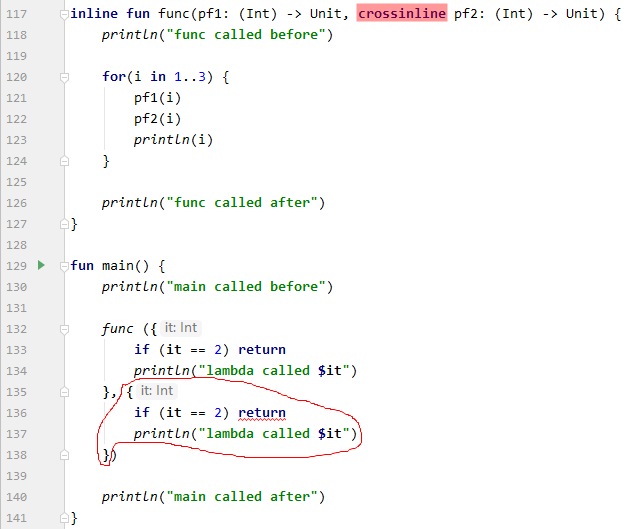

## 6. 内联属性

若属性的 `setter`/`getter` 方法被关键字 `inline` 修饰，则称该属性称为 **内联属性**。

注意：内联属性不可以有 `backing field`

也就说是：

1. 成员属性不可以作为内联属性，即成员属性的 `setter`/`getter` 方法不能被 `inline` 修饰
   
2. 扩展属性可以作为内联属性，即扩展属性的 `setter`/`getter` 方法可以被 `inline` 修饰

## 7. 内联函数的限制

1. 访问权限为 `public`/`protected` 的内联成员方法中，不能访问 `private` 修饰的私有成员。

    > 这是因为在类外调用 `public`/`protected` 修饰的内联成员方法时，会将内联成员方法的函数体展开在类外的调用处这就相当于直接在类外调用类中的私有成员了。

    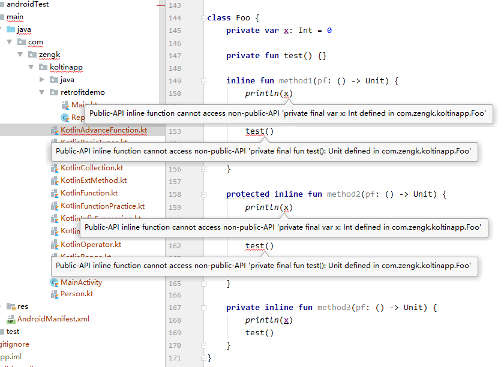

2. 参与内联的函数类型参数不能被存储（即不能将参与内联的函数类型参数赋给变量）。

    

3. 当函数嵌套调用时，外层函数中参与内联的函数类型参数只能传递给内层函数中参与内联的函数类型参数。

    

## 8. 常用的扩展方法：`let`/`run`/`also`/`apply`/`use`

### 8.1 `let`

#### 8.1.1 函数定义（`Standard.kt`）

```kotlin:no-line-numbers
// 函数定义（在 Standard.kt 文件中定义）
@kotlin.internal.InlineOnly
public inline fun <T, R> T.let(block: (T) -> R): R {
    contract {
        callsInPlace(block, InvocationKind.EXACTLY_ONCE)
    }
    return block(this)
}
```

#### 8.1.2 作用

```kotlin:no-line-numbers
扩展方法 let 的 Receiver 是泛型 T，这表示所有类型的变量，甚至是字面量都可以作为调用者来调用 let 方法。

let 方法的只有一个函数类型为 (T) -> R 的参数 block，在 let 方法中执行了 return block(this)，由此可知：
1. 当 Lambda 表达式作为 let 方法的实参时，Lambda 表达式的默认参数 it 就是 let 方法的调用者（即 receiver）；
2. let 方法的返回值就是 Lambda 表达式的返回值。
```

### 8.2 `run`

#### 8.2.1 函数定义（`Standard.kt`）

```kotlin:no-line-numbers
@kotlin.internal.InlineOnly
public inline fun <T, R> T.run(block: T.() -> R): R {
    contract {
        callsInPlace(block, InvocationKind.EXACTLY_ONCE)
    }
    return block()
}
```

#### 8.2.2 作用

```kotlin:no-line-numbers
扩展方法 run 的 Receiver 是泛型 T，这表示所有类型的变量，甚至是字面量都可以作为调用者来调用 run 方法。

run 方法的只有一个函数类型为 T.() -> R 的参数 block，在 run 方法中执行了 return block()，由此可知：
1. 当 Lambda 表达式作为 run 方法的实参时，Lambda 表达式是无参数的。
   但是从函数类型 T.() -> R 可以看出，Lambda 表达式中存在 this，this 指向 run 方法的调用者（即 receiver）。
2. run 方法的返回值就是 Lambda 表达式的返回值。
```

#### 8.2.3 `let` & `run` 的区别

`let` 和 `run` 的相同点：

```kotlin:no-line-numbers
1. 所有类型的变量，甚至是字面量都可以作为调用者；
2. 都只有一个函数类型的参数；
3. 返回值都是作为实参的 Lambda 表达式的返回值。
```

`let` 和 `run` 的不同点：

```kotlin:no-line-numbers
1. let 方法中，作为实参的 Lambda 表达式带一个参数，传入的参数值就是 let 方法的调用者；
   run 方法中，作为实参的 Lambda 表达式无参数；

2. let 方法中，作为实参的 Lambda 表达式中不存在 this；
   run 方法中，作为实参的 Lambda 表达式中存在 this，this 指向 run 方法的调用者。
```

#### 8.2.4 `let` & `run` 的示例

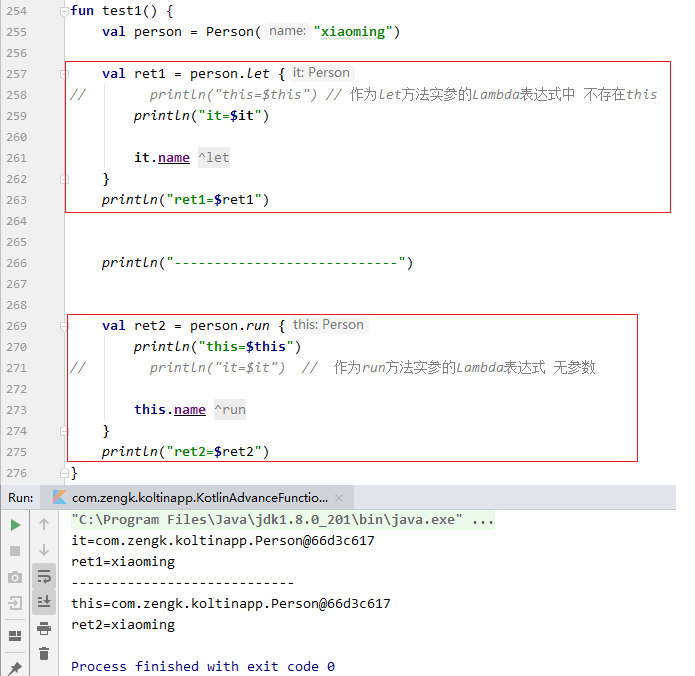

### 8.3 `also`

#### 8.3.1 函数定义（`Standard.kt`）

```kotlin:no-line-numbers
//函数定义（在Standard.kt文件中定义）
@kotlin.internal.InlineOnly
@SinceKotlin("1.1")
public inline fun <T> T.also(block: (T) -> Unit): T {
    contract {
        callsInPlace(block, InvocationKind.EXACTLY_ONCE)
    }
    block(this)
    return this
}
```

#### 8.3.2 作用

```kotlin:no-line-numbers
扩展方法 also 的 Receiver 是泛型 T，这表示所有类型的变量，甚至是字面量都可以作为调用者来调用 also 方法。

also 方法的只有一个函数类型为 (T) -> Unit 的参数 block，在 also 方法中先后执行了 block(this) 和 return this，由此可知：
1. 当 Lambda 表达式作为 also 方法的实参时，Lambda 表达式的默认参数 it 就是 also 方法的调用者（即 receiver）
2. also 方法的返回值就是 also 方法的调用者。
```

### 8.4 `apply`

#### 8.4.1 函数定义（`Standard.kt`）

```kotlin:no-line-numbers
//函数定义（在Standard.kt文件中定义）
@kotlin.internal.InlineOnly
public inline fun <T> T.apply(block: T.() -> Unit): T {
    contract {
        callsInPlace(block, InvocationKind.EXACTLY_ONCE)
    }
    block()
    return this
}
```

#### 8.4.2 作用

```kotlin:no-line-numbers
扩展方法 apply 的 Receiver 是泛型 T，这表示所有类型的变量，甚至是字面量都可以作为调用者来调用 apply 方法。

apply 方法的只有一个函数类型为 T.() -> Unit 的参数 block，在 apply 方法中先后执行了 block() 和 return this，由此可知：
1. 当 Lambda 表达式作为 apply 方法的实参时，Lambda 表达式是无参数的。
   但是从函数类型 T.() -> Unit 可以看出，Lambda 表达式中存在 this，this 指向 apply 方法的调用者（即 receiver）。
2. apply 方法的返回值就是 apply 方法的调用者。
```

#### 8.4.3 `also` & `apply` 的区别

`also` 和 `apply` 的相同点：

```kotlin:no-line-numbers
1. 所有类型的变量，甚至是字面量都可以作为调用者；
2. 都只有一个函数类型的参数；
3. 返回值都是方法的调用者。
```

`also` 和 `apply` 的不同点：

```kotlin:no-line-numbers
1. also 方法中，作为实参的 Lambda 表达式带一个参数，传入的参数值就是 also 方法的调用者；
   apply 方法中，作为实参的 Lambda 表达式无参数；

2. also 方法中，作为实参的 Lambda 表达式中不存在 this；
   apply 方法中，作为实参的 Lambda 表达式中存在 this，this 指向 apply 方法的调用者。
```

#### 8.4.4 `also` & `apply` 的示例


### 8.5 `use`

#### 8.5.1 函数定义（`Closeable.kt`）

```kotlin:no-line-numbers
//函数定义（在Closeable.kt文件中定义）
@InlineOnly
@RequireKotlin("1.2", versionKind = RequireKotlinVersionKind.COMPILER_VERSION, 
                message = "Requiresnewer compiler version to be inlined correctly.")
public inline fun <T : Closeable?, R> T.use(block: (T) -> R): R {
    var exception: Throwable? = null
    try {
        return block(this)
    } catch (e: Throwable) {
        exception = e
        throw e
    } finally {
        when {
            apiVersionIsAtLeast(1, 1, 0) -> this.closeFinally(exception)
            this == null -> {}
            exception == null -> close()
            else ->
                try {
                    close()
                } catch (closeException: Throwable) {
                    // cause.addSuppressed(closeException) // ignored here
                }
        }
    }
}
```

#### 8.5.2 作用

```kotlin:no-line-numbers
扩展方法 use 的 Receiver 是泛型 T，且要求泛型 T 实现了 Closeable 接口，
这表示所有 Closeable 接口的子类对象都可以作为调用者来调用 use 方法。

use 方法的只有一个函数类型为 (T) -> R 的参数 block，在 use 方法中执行了 return block(this)，由此可知：
1. 当 Lambda 表达式作为 use 方法的实参时，Lambda 表达式的默认参数 it 就是 use 方法的调用者（即 receiver）
2. use 方法的返回值就是 Lambda 表达式的返回值

查看 use 方法的源码可知，try-catch 代码块 会捕获 Lambda 表达式中的异常，
并且在 finally 代码块中会调用 Closeable 接口的子类对象（即 Receiver）的 close 方法（this.closeFinally(exception)）
```

#### 8.5.3 示例


## 9. 常用的集合操作及相关的扩展方法

### 9.1 概述

1. `Kotlin` 中的 `List`、`Set`、`Map` 三大集合接口都定义在 `Kotlin` 文件 `Collections.kt` 中。

2. 在 `Kotlin` 文件 `_Collections.kt` 中，为集合提供了大量的扩展方法，包括 `forEach`、`filter`、`map`、`flatMap`、...

3. `Kotlin` 中，`List` 和 `Set` 集合都继承了 `Iterable` 接口；
   
4. `Map` 集合没有继承 `Iterable` 接口，但是 `Map` 提供了 `entries` 属性，表示由键值对构成的 `Set` 集合；

5. `_Collections.kt` 中定义的扩展方法基本上是 `Iterable` 接口的扩展方法，即 `List` 和 `Set` 集合都可以使用 `Iterable` 接口的扩展方法。

### 9.2 集合的遍历 & 扩展方法 `forEach`

#### 9.2.1 按索引遍历

`Java` 中：

```java:no-line-numbers
for(int i = 0; i < list.size(); i++) {
    T ele = list.get(i);
}
```

`Kotlin` 中：

```kotlin:no-line-numbers
for(i in 0 until list.indices) {
    var ele = list[i]
}
```

#### 9.2.2 按元素遍历

`Java` 中使用 `for-each` 循环：

```java:no-line-numbers
for(T ele : list) {
    ...
}
```

`Kotlin` 中使用 `for-in` 循环：

```kotlin:no-line-numbers
for(ele in list) {
    ...
}
```

#### 9.2.3 使用扩展方法 `forEach` 遍历

`Java 1.8` 开始提供了 `forEach` 方法结合 `Lambda` 表达式实现集合的遍历：

```java:no-line-numbers
list.forEach((ele) -> {
    ...
});
```

`Kotlin` 中提供扩展方法 `forEach` 实现集合的遍历：

```kotlin:no-line-numbers
// 函数定义（在 _Collections.kt 文件中定义的）
@kotlin.internal.HidesMembers
public inline fun <T> Iterable<T>.forEach(action: (T) -> Unit): Unit {
    for (element in this) action(element)
}

// 函数调用
list.forEach {
    // 默认参数 it 表示当前遍历到的元素
}
```

### 9.3 集合过滤 & 扩展方法 `filter`

扩展方法 `filter` 的相关源码（在 `_Collections.kt` 中定义）：

```kotlin:no-line-numbers
public inline fun <T> Iterable<T>.filter(predicate: (T) -> Boolean): List<T> {
    return filterTo(ArrayList<T>(), predicate)
}

public inline fun <T, C : MutableCollection<in T>> Iterable<T>.filterTo(destination: C, predicate: (T) -> Boolean): C {
    for (element in this) if (predicate(element)) destination.add(element)
    return destination
}
```

作用：

```kotlin:no-line-numbers
扩展方法 filter 接收一个函数引用作为参数谓词 predicate，返回过滤后的 List 集合，

扩展方法 filter 内部又调用了扩展方法 filterTo，在 filterTo 方法中，遍历作为 Receiver 的集合，
根据谓词条件 predicate 将过滤得到的元素添加到新创建的 List 集合中，并返回该 List 集合。
```

示例：

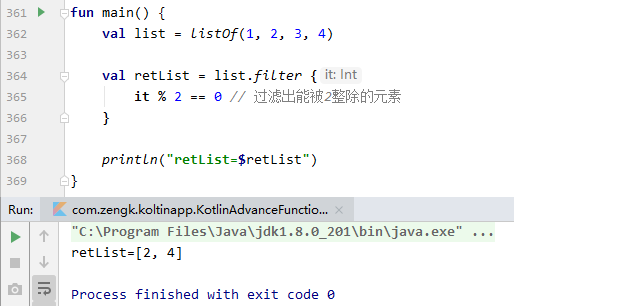

### 9.4 集合变换 & 扩展方法 `map`

扩展方法 `map` 的相关源码（在 `_Collections.kt` 中定义）：

```kotlin:no-line-numbers
public inline fun <T, R> Iterable<T>.map(transform: (T) -> R): List<R> {
    return mapTo(ArrayList<R>(collectionSizeOrDefault(10)), transform)
}

internal fun <T> Iterable<T>.collectionSizeOrDefault(default: Int): Int = if (this is Collection<*>) 
this.size else default

public inline fun <T, R, C : MutableCollection<in R>> Iterable<T>.mapTo(destination: C, transform: (T) -> R): C {
    for (item in this)
        destination.add(transform(item))
    return destination
}
```

作用：

```kotlin:no-line-numbers
扩展方法 map 接收一个函数引用作为回调函数 transform，且扩展方法 map 内部又调用了扩展方法 mapTo，

在扩展方法 mapTo  中遍历作为 Receiver 的集合，并将当前遍历到的元素传入回调函数 transform 中，
返回一个变换后的元素，再将变换后的元素存入新创建的 List 集合中，最后返回这个 List 集合
```

示例：

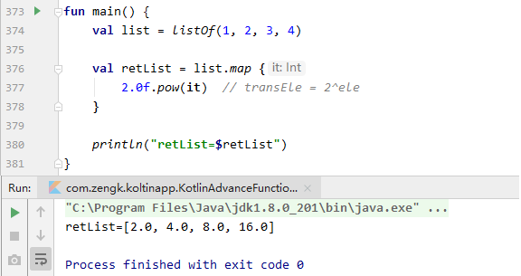

### 9.5 集合变换 & 扩展方法 `flatMap`

扩展方法 flatMap 的相关源码（在 _Collections.kt 中定义）：

```kotlin:no-line-numbers
public inline fun <T, R> Iterable<T>.flatMap(transform: (T) -> Iterable<R>): List<R> {
    return flatMapTo(ArrayList<R>(), transform)
}

public inline fun <T, R, C : MutableCollection<in R>> Iterable<T>.flatMapTo(destination: C, transform: (T) -> Iterable<R>): C {
    for (element in this) {
        val list = transform(element)
        destination.addAll(list)
    }
    return destination
}
```

作用：

```kotlin:no-line-numbers
扩展方法 flatMap 接收一个函数引用作为回调函数 transform，且扩展方法 flatMap 内部又调用了扩展方法 flatMapTo，

在扩展方法 flatMapTo 中遍历作为 Receiver 的集合，并将当前遍历到的元素传入回调函数 transform 中，
将一个元素变换成个集合，并返回这个变换得到的集合，再将变换得到的集合全部添加到新创建的 List 集合中，最后返回这个 List 集合。
```

示例：

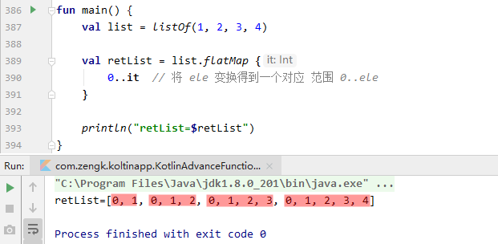

### 9.6 `Iterable` 集合 & `Sequence` 序列

#### 9.6.1 `Iterable` 集合的扩展方法 `filter`、`map`、`flatMap` 的特点

`Iterable` 集合的扩展方法 `filter`、`map`、`flatMap` 都返回一个新创建的 `List` 集合，所以可以采用链式编程的方式，依次调用 `filter`、`map`、`flatMap`，最后再调用 `forEach` 遍历最终得到的集合。

**注意**：每次调用其中某个扩展方法时，会马上对作为 `Receiver` 的集合进行遍历，并返回一个新的集合。链式编程中，是将每次调用扩展方法后返回的新集合作为 `Receiver` 来调用下一个扩展方法。

#### 9.6.2 `Iterable` 集合转 `Sequence` 序列：`asSequence`

在 `_Collections.kt` 文件中提供了 `asSequence` 方法，用于将一个集合转成一个序列：

```kotlin:no-line-numbers
public fun <T> Iterable<T>.asSequence(): Sequence<T> {
    return Sequence { this.iterator() }
}

@kotlin.internal.InlineOnly
public inline fun <T> Sequence(crossinline iterator: () -> Iterator<T>): Sequence<T> = object : Sequence<T> {
    override fun iterator(): Iterator<T> = iterator()
}
```

```kotlin:no-line-numbers
// 在 Sequence.kt 中定义的 Sequence 序列接口
public interface Sequence<out T> {
    public operator fun iterator(): Iterator<T>
}
```

#### 9.6.3 `Sequence` 序列的扩展方法 `filter`、`map`、`flatMap` 的定义

在 `_Sequences.kt` 文件中，为序列接口 `Sequence` 提供了一系列的扩展方法：

> 这些扩展方法和在 `_Collections.kt` 文件中为 `Iterable` 接口提供的扩展方法基本上是一样的。

```kotlin:no-line-numbers
public fun <T> Sequence<T>.filter(predicate: (T) -> Boolean): Sequence<T> {
    return FilteringSequence(this, true, predicate)
}

public fun <T, R> Sequence<T>.map(transform: (T) -> R): Sequence<R> {
    return TransformingSequence(this, transform)
}

public fun <T, R> Sequence<T>.flatMap(transform: (T) -> Sequence<R>): Sequence<R> {
    return FlatteningSequence(this, transform, { it.iterator() })
}

public inline fun <T> Sequence<T>.forEach(action: (T) -> Unit): Unit {
    for (element in this) action(element)
}
```

#### 9.6.4 `Sequence` 序列的扩展方法 `filter`、`map`、`flatMap` 的特点（懒序列机制）

每次调用其中某个扩展方法时，并不会马上对作为 `Receiver` 的集合进行遍历，而是返回一个新的 `Sequence` 实例化对象。

不同的扩展方法返回的 `Sequence` 接口子类不同，但是在实例化新的 `Sequence` 实现类对象时会把作为 `Receiver` 的当前 `Sequence` 传给新的 `Sequence`，并且 `Sequence` 实例类在重写 `iterator` 方法时，传入的 `Sequence` 的特性会作用在新的 `Sequence` 上。

于是在链式编程中，最后返回的 `Sequence` 实例类对象包含了之前所有的扩展方法所返回的 `Sequence` 的特性，从而当调用 `forEach` 对最终的 `Sequence` 进行遍历时，相当于每次遍历都依次调用了 `filter`、`map`、`flatMap` 的回调函数。`Sequence` 的这个特点称为 **懒序列机制**。

#### 9.6.5 示例：`asSequence` & 懒序列机制

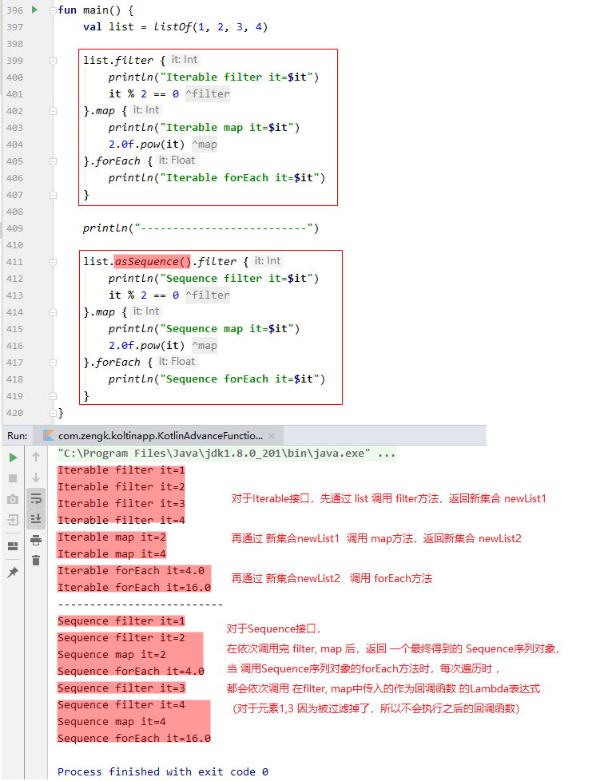

### 9.7 集合元素求和 & 扩展方法 `sum`

扩展方法 `sum` 的相关源码（在 `_Collections.kt` 中定义）：

```kotlin:no-line-numbers
@kotlin.jvm.JvmName("sumOfInt")
public fun Iterable<Int>.sum(): Int {
    var sum: Int = 0
    for (element in this) {
        sum += element
    }
    return sum
}
```

作用：

```kotlin:no-line-numbers
1. 要求集合元素是数值类型：Byte、Short、Int、Long、Float、Double

2. 结果 ret = ele1 + ele2 + ...
```

示例：

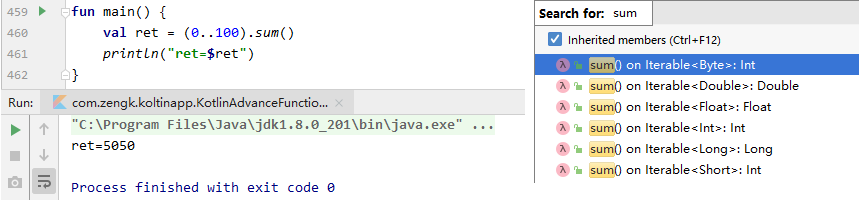

### 9.8 集合元素聚合 & 扩展方法 `reduce`

扩展方法 `reduce` 的相关源码（在 `_Collections.kt` 中定义）:

```kotlin:no-line-numbers
public inline fun <S, T : S> Iterable<T>.reduce(operation: (acc: S, T) -> S): S {
    val iterator = this.iterator()
    if (!iterator.hasNext()) throw UnsupportedOperationException("Empty collection can't be reduced.")
    var accumulator: S = iterator.next()
    while (iterator.hasNext()) {
        accumulator = operation(accumulator, iterator.next())
    }
    return accumulator
}
```

作用：

```kotlin:no-line-numbers
以首元素作为累加器的初始值，以回调函数 operation 作为累加运算算法，
从第二个元素开始遍历集合元素，进行自定义的累加运算，
返回最终得到的累加值

即：ret = ele1 □ ele2 □ ele3 ...  // 其中 "□" 表示通过回调函数 operation 自定义的累加运算符
```

### 9.9 集合元素聚合 & 扩展方法 `fold`

扩展方法 `fold` 的相关源码（在 `_Collections.kt` 中定义）：

```kotlin:no-line-numbers
public inline fun <T, R> Iterable<T>.fold(initial: R, operation: (acc: R, T) -> R): R {
    var accumulator = initial
    for (element in this) accumulator = operation(accumulator, element)
    return accumulator
}
```

作用：

```kotlin:no-line-numbers
以参数 initial 作为累加器的初始值，以回调函数 operation 作为累加运算算法，
从第一个元素开始遍历集合元素，进行自定义的累加运算，
返回最终得到的累加值

即：ret = initial □ ele1 □ ele2 □ ele3 ...  // 其中 "□" 表示通过回调函数 operation 自定义的累加运算符
```

示例：

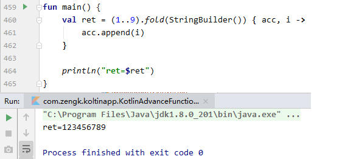

## 10. `Kotlin` 中的匿名内部类

### 10.1 `Kotlin` 中匿名内部类的一般写法

```kotlin:no-line-numbers
val foo = object : IFoo {

    override fun funName1(p1: T1, p2: T2, ...): ReturnType {...}

    override fun funName2(p1: T1, p2: T2, ...): ReturnType {...}

    ...
}
```

其中：

```kotlin:no-line-numbers
1. 接口 IFoo 可以是 Kotlin 接口或 Java 接口或 Java 函数式接口；
2. funName1、funName2、... 表示接口提供的方法。
```

### 10.2 `Java` 函数式接口的匿名内部类的 `Lambda` 表达式简化写法

特别地，对于 `Java` 函数式接口的匿名内部类：

```java:no-line-numbers
// IFunction.java
public interface IFunction {
    ReturnType func(T1 p1, T2 p2, ...);
}
```

在 `Kotlin` 中可以使用 `Lambda` 表达式简化写成：

```kotlin:no-line-numbers
// Kotlin中使用 Lambda 表达式创建Java 函数式接口的匿名内部类
val iFunction = IFunction { p1, p2, ... ->
    ...
    statementN // 最后一条语句的结果值应该是 ReturnType 类型
}
```

这就相当于 `Kotlin` 编译器自动生成了一个名为 `IFunction` 的函数：

> 该函数返回一个 `IFunction` 接口的匿名内部类对象

```kotlin:no-line-numbers
fun IFunction(block: (p1: T1, p2: T2, ...) -> ReturnType): IFunction {
    return object : IFunction {
        override fun func(p1: T1, p2: T2, ...): ReturnType {
            return block(p1, p2, ...)
        }
    }
}
```

### 10.3 示例

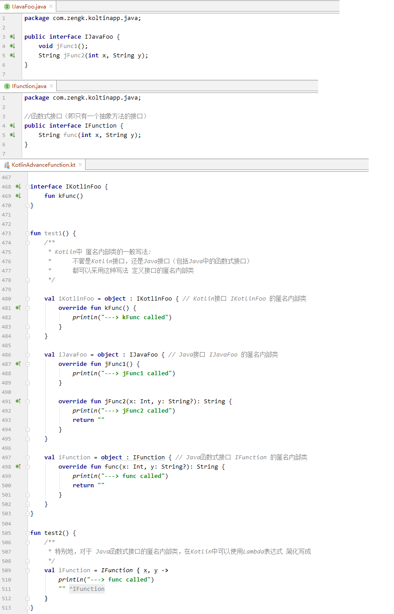

## 11. `SAM` 转换

### 11.1 什么是 `SAM` 转换

在 `Java` 中，若某个方法的参数类型是函数式接口类型，那么可以传入一个 `Java` 的 `Lambda` 表达式作为实参。此时，虽然 `Java` 的 `Lambda` 表达式只是在重写函数式接口中的抽象方法，但是最终还会把这个 `Java` 的 `Lambda` 表达式转换为函数式接口的匿名内部类。这种现象称之为 `SAM` 转换（即 `Single Abstract Method` 转换）。

> `SAM` 转换就是将用于重写单一抽象方法的 `Lambda` 表达式转换为函数式接口的匿名内部类对象。

### 11.2 `Kotlin` 中的 `SAM` 转换

在 `Kotlin` 中，当调用 `Java` 方法时，若 `Java` 方法的参数类型是 `Java` 的函数式接口类型，那么可以传入一个 `Kotlin` 的 `Lambda` 表达式作为实参。此时也会发生 `SAM` 转换，即：把用于重写单一抽象方法的 `Kotlin` 的 `Lambda` 表达式转换为 `Java` 的函数式接口的匿名内部类。

> `SAM` 转换就是将 `Lambda` 表达式转换为函数式接口的匿名内部类对象。
>
> 特别需要指出：每次进行 `SAM` 转换时，都会由 `Lambda` 表达式创建出一个新的匿名内部类对象。

### 11.3 实现 `Kotlin` 中的 `SAM` 转换需满足的条件

`Kotlin` 中调用 `Java` 方法，且 `Java` 方法的参数类型是 `Java` 的函数式接口类型。

> 调用 `Kotlin` 方法，或参数类型是 `Kotlin` 的函数式接口类型都不行，会出现语法错误。

### 11.4 示例 1：`Kotlin` 中的 `SAM` 转换的基本用法

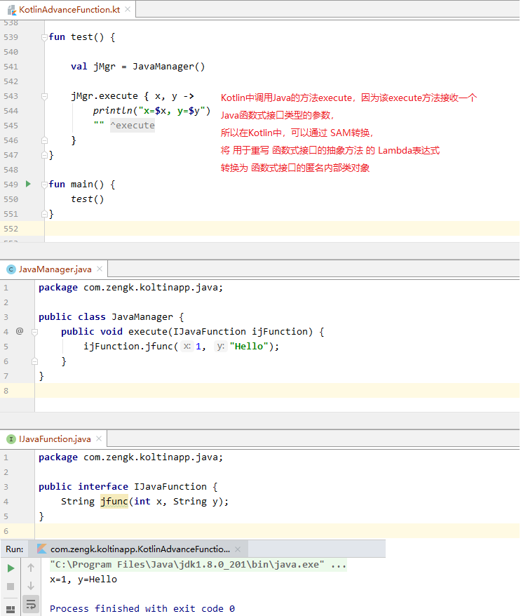

### 11.5 示例 2：每次 `SAM` 转换 `Lambda` 表达式会新创建匿名内部类对象

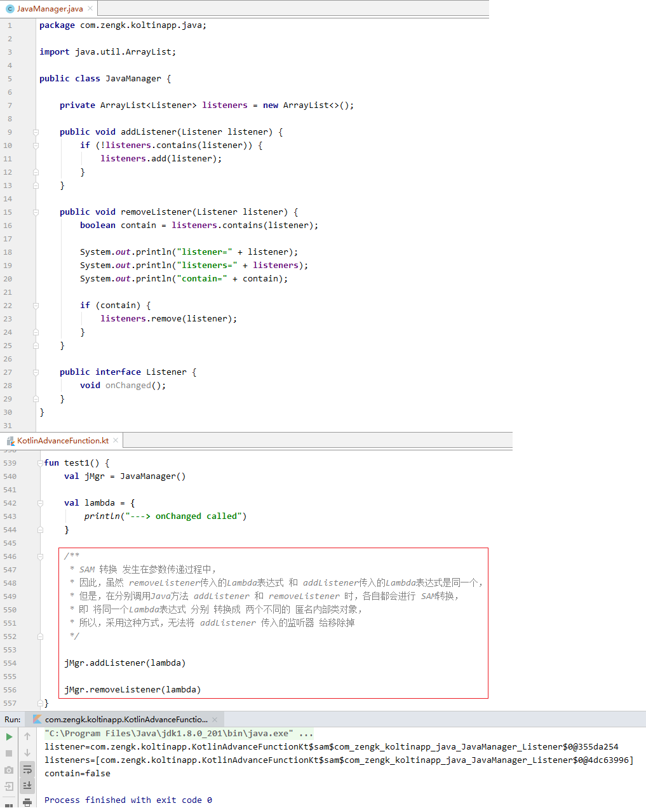

### 11.6 示例 3：避免 `SAM` 转换时 `Lambda` 表达式新创建匿名内部类对象

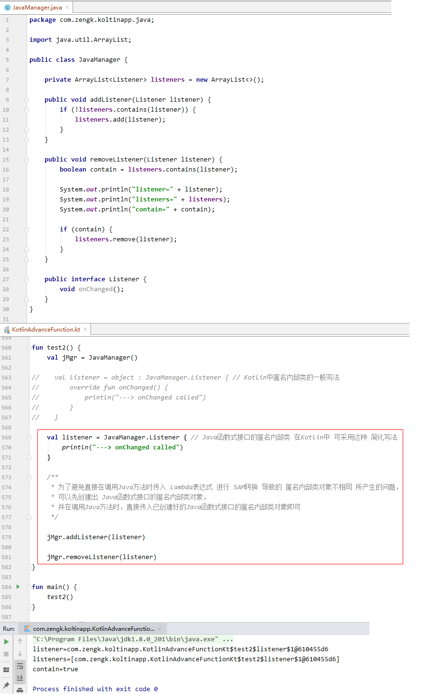

## 12. 案例

### 12.1 案例 1：统计文件中每个字符的出现次数

#### 12.1.1 相关知识点

##### 12.1.1.1 `File` 的扩展方法 `readText`

扩展方法 `readText`（定义在 `FileReadWrite.kt` 文件中）：

```kotlin:no-line-numbers
public fun File.readText(charset: Charset = Charsets.UTF_8): String = readBytes().toString(charset)
```

作用：将 `File` 对象表示的文件内容转成字符串。

注意：内部调用的扩展方法 `readBytes()` 要求文件大小不超过 `2G`。

##### 12.1.1.2 数组的扩展方法 `filterNot`

扩展方法 `filterNot`（定义在 `_Arrays.kt` 文件中）：

```kotlin:no-line-numbers
public inline fun IntArray.filterNot(predicate: (Int) -> Boolean): List<Int> {
    return filterNotTo(ArrayList<Int>(), predicate)
}

public inline fun <T> Array<out T>.filterNot(predicate: (T) -> Boolean): List<T> {
    return filterNotTo(ArrayList<T>(), predicate)
}
```

作用：

```kotlin:no-line-numbers
将满足谓词 `predicate` 条件的元素过滤排除掉，返回由排除后剩下的元素构成的新的 `List` 集合。
```

注意：

```kotlin:no-line-numbers
1. 类似于 IntArray.filterNot，对于数值类型 Byte、Char、Short、Float、Double 都有对应的扩展方法 filterNot。

2. 对于扩展方法 filter，是将满足谓词 predicate 条件的元素过滤保存下来，返回由满足谓词条件的元素构成的新的 List 集合。
```

##### 12.1.1.3 `Iterable` 集合的扩展方法 `groupBy`

扩展方法 `groupBy`（定义在 `_Collections.kt` 文件中）：

```kotlin:no-line-numbers
public inline fun <T, K> Iterable<T>.groupBy(keySelector: (T) -> K): Map<K, List<T>> {
    return groupByTo(LinkedHashMap<K, MutableList<T>>(), keySelector)
}

public inline fun <T, K, M : MutableMap<in K, MutableList<T>>> Iterable<T>.groupByTo(destination: M, 
keySelector: (T) -> K): M {
    for (element in this) {
        val key = keySelector(element)
        val list = destination.getOrPut(key) { ArrayList<T>() }
        list.add(element)
    }
    return destination
}
```

作用：

```kotlin:no-line-numbers
将 List 集合转换成一个 Map 集合。Map 集合中键值对的 key 通过回调函数 keySelector 返回。
回调函数 keySelector 的作用就是将遍历到的 List 集合元素转换成一个对应的 key 值，
于是在 groupByTo 方法中，将对应相同 key 的 List 集合元素存放在一个新的 List 集合中，
并将该新的 List 集合作为 key 值对应的 value 值。
```

##### 12.1.1.4 `Map` 映射的扩展方法 `map`

扩展方法 `map`（定义在 `_Collections.kt` 文件中）：

```kotlin:no-line-numbers
public inline fun <K, V, R> Map<out K, V>.map(transform: (Map.Entry<K, V>) -> R): List<R> {
    return mapTo(ArrayList<R>(size), transform)
}

public inline fun <K, V, R, C : MutableCollection<in R>> Map<out K, V>.mapTo(destination: C, transform:(Map.Entry<K,V>) -> R): C {
    for (item in this)
        destination.add(transform(item))
    return destination
}
```

作用：

```kotlin:no-line-numbers
遍历 Map 集合，遍历到的元素类型为 Map.Entry，将遍历的元素传给回调函数 transform，
回调函数会返回一个变换后的新元素，存入到新的 List 集合中，map 方法返回由变换后的新元素构成的新的 List 集合。
```
        
> 注意：
> 
> `Kotlin` 为 `Map` 集合专门创建了一个文件 `_Maps.kt`，用来定义 `Map` 集合的扩展方法。
> 
> （`List` 集合和 `Set` 集合的扩展方法定义在 `_Collections.kt` 文件中）

#### 12.1.2 代码实现

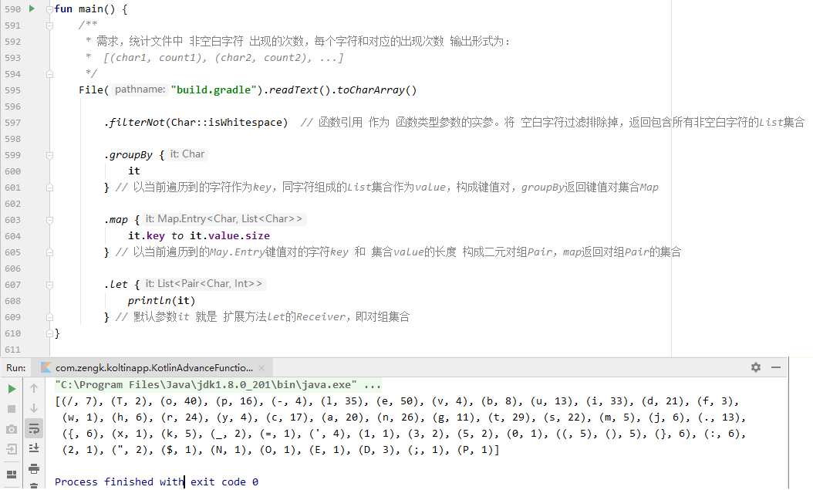

### 12.2 案例 2：`Kotlin` 实现 `Html`

#### 12.2.1 相关知识点

##### 12.2.1.1 `this@OutClass` 的作用

在类 `A` 的定义中，可以定义其他类 `B` 的扩展方法。此时，在其他类 `B` 的扩展方法中，`this` 仍然指向类 `B` 的实例化对象，如果想在其他类 `B` 的扩展方法中访问类 `A`，则需要使用 `this@A`（即 `this@OutClass`）。
    
**注意**：因为类 `B` 的扩展方法是在类 `A` 中定义的，所以类 `B` 的扩展方法只能在类 `A` 中访问（如在类 `A` 的其他成员方法中访问）。

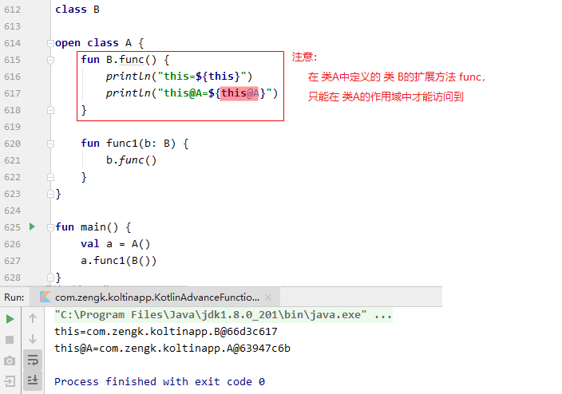

##### 12.2.1.2 `".."{...}` & `String` 的运算符 "`()`" 的重载函数

对于形如 `".."{...}` 的代码，其实是在调用 `String` 的运算符 "`()`" 的重载函数：

```kotlin:no-line-numbers
operator fun String.invoke(block: ()-> Unit) {...}
```

##### 12.2.1.3 `".."(...)` & `String` 的运算符 "`()`" 的重载函数

对于形如 `".."(...)` 的代码，其实是在调用 `String` 的运算符 "`()`" 的重载函数：

```kotlin:no-line-numbers
operator fun String.invoke(value: Any) {...}
```

##### 12.2.1.4 `+"..."` & `String` 的运算符 "`()`" 的重载函数

对于形如 `+"..."` 的代码，其实是在调用 `String` 的运算符 "`()`" 的重载函数：

```kotlin:no-line-numbers
operator fun String.unaryPlus(){...}
```

#### 12.2.2 代码实现

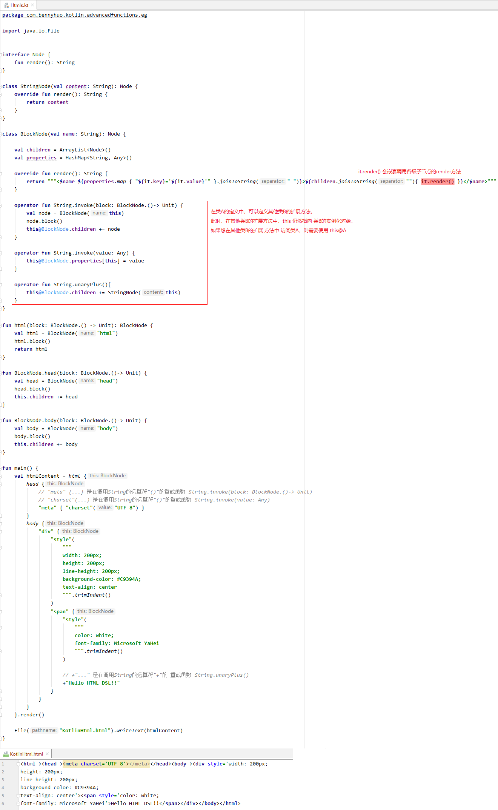