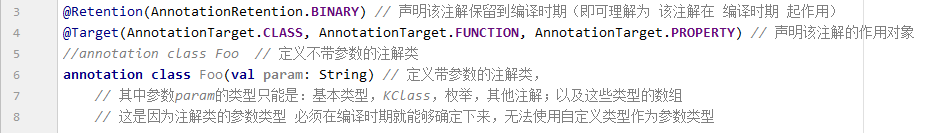
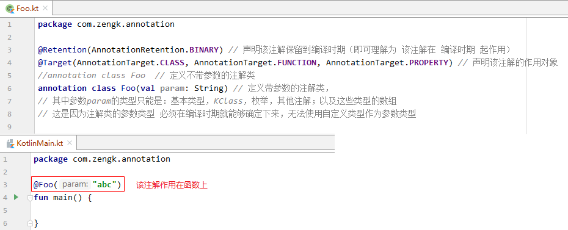
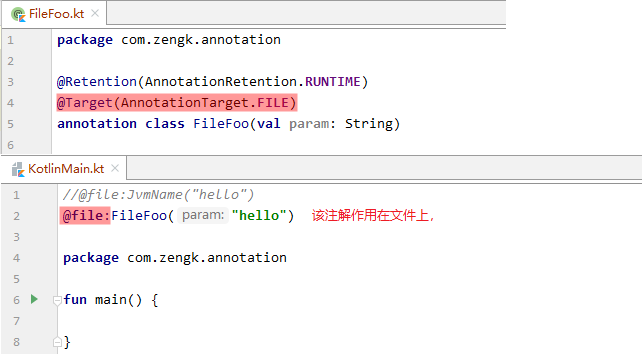
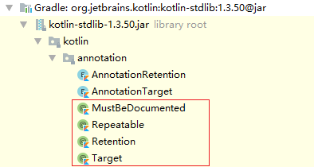
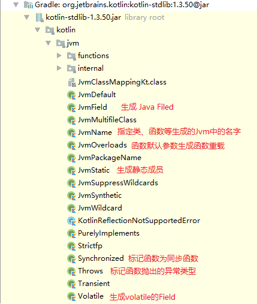

## 1. 什么是注解

注解是对程序的附件信息说明。

注解可以作用在类、函数、函数参数、属性等上面。

注解的信息可用于源码级、编译期、运行时。

## 2. 注解类的定义

使用元注解 `@Retention` 声明注解类的作用时期。

使用元注解 `@Target` 声明注解类的作用对象。

定义注解类时可以声明带参数的主构造器。其中：

1. 要求参数类型必须在编译时期就能够确定下来，所以参数类型只能是基本类型、`KClass`、枚举、其他注解、以及这些类型的数组；

2. 不可以使用自定义类型作为参数类型。

示例：

## 3. 注解类的使用

## 4. 注解和注释的区别

注解（`Annotation`）：特定语法现象，参与编译。

注释（`Comment`）：只存在于源码中，用于提升代码的可读性。

## 5. 常见的内置注解

1. 包路径 `kotlin.annotation.*` 下的注解：主要是一些元注解，用于修饰其他注解

    

2. 包路径 `kotlin.*` 下的注解：是标准库中的一些具有通用用途的注解

    

3. `kotlin.jvm.*` 下的注解：是与JVM虚拟机进行交互时使用到的一些注解

    