## 1. 软件工具

### 1.1 朗国办公软件

#### 1.1.1 企业微信 & 企业邮箱

**企业微信下载地址：** [https://work.weixin.qq.com/#indexDownload](https://work.weixin.qq.com/#indexDownload)

> 入职时 `HR` 会将你加入到企业微信。

**企业邮箱：** 在企业微信中联系运维工程师（谭俊英）申请企业邮箱账号和密码。

申请到企业邮箱的账号密码后，在企业微信的【邮件】中进行添加。

#### 1.1.2 朗国电子安全助手

> 双击软件工具包中的 `lva_setupnet_20231101173114.exe` 进行安装。

界面如下所示，账号会在加入企业微信后自动创建，用户名为首字母大写的姓名拼音。初始密码 `123456`，首次登录需要修改密码。

> 如果没有自动创建，可以联系运维工程师（肖平）

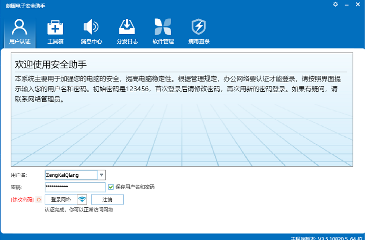

输入用户名和密码后，点击登录网络，成功后会自动连接名为 `LANGO-5G` 的 `WIFI`。

#### 1.2.3 代码加密软件

> 双击软件工具包中的 `Client_Setup23.exe` 进行安装。

> 参考：[加密软件常用问题以及故障](https://drive.weixin.qq.com/s?k=ABUAPgfAABADCLO5ju)

**注意：** ：

1. 在访问 `Gerrit` 代码仓库时（如 `clone`/`pull`/`push` 等操作），需要切换业务模式为 **工作模式**；
2. 在登录 `SVN` 服务器时，需要切换业务模式为 **个人模式**；
3. 如果 `AndroidStudio` 中的项目代码乱码，请先确认当前是否处于工作模式，如果不是，关闭 `AndroidStudio`，切到工作模式成功后，再重新打开 `AndroidStudio`。

### 1.3 `JDK`

> 双击 `jdk-8u201-windows-x64.exe` 安装 `JDK 1.8`
> 
> 解压 `openjdk-11.0.2_windows-x64_bin.zip` 即可得到 `JDK 11`
> 
> 解压 `openjdk-17.0.2_windows-x64_bin.zip` 即可得到 `JDK 17`

**环境变量配置：**

1. 新增 `JAVA_HOME` 环境变量，变量值是 `JDK 1.8` 的安装目录，或 `JDK 11/17` 的解压目录。（当前想在命令行中使用哪个版本的，就是配置哪个版本的）
2. 将 `%JAVA_HOME%\bin` 添加到环境变量 `Path` 中。
3. 重新打开命令行生效。
  
**注意：**

目前的项目代码中，使用的 `Gradle` 版本和 `JDK` 版本的对应关系大致如下：

|`Gradle` 版本|`JDK` 版本|
|:-|:-|
|Gradle 4+|JDK 1.8|
|Gradle 6+、7+|JDK 11|
|Gradle 8+| JDK 17|

如果 `JDK` 版本与 `Gradle` 版本不兼容，`AndroidStudio` 中执行 `Gradle Sync` 时会报错，此时根据错误提示，选择正确的 `JDK` 版本即可。

`AndroidStudio` 中切换 `JDK` 版本的方式如下所示：

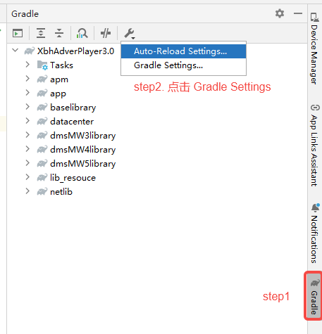

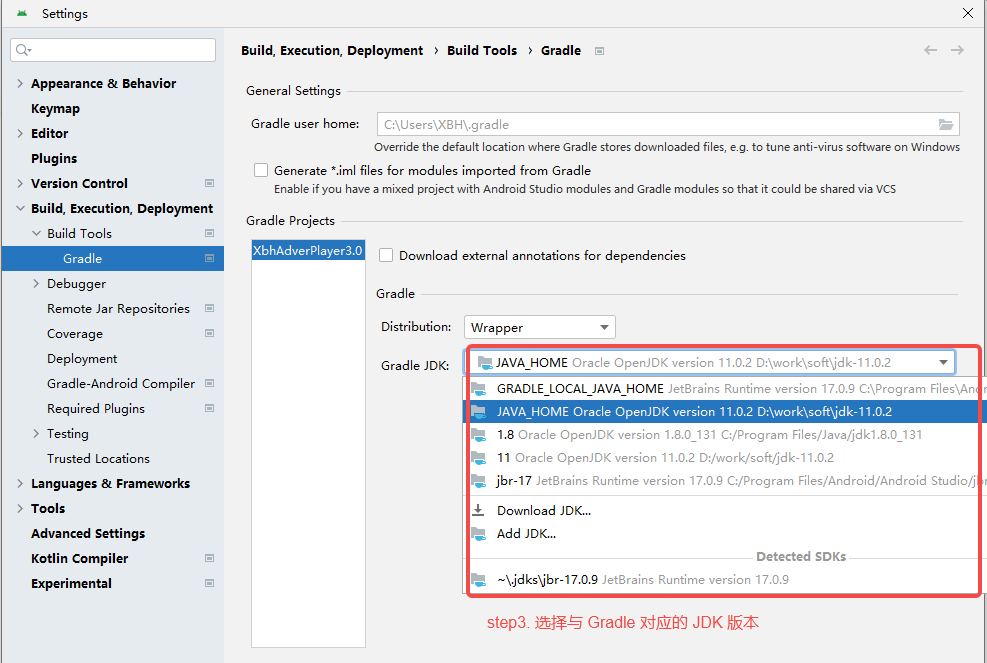

### 1.4 `AndroidStudio`

> 最新版本的 `AndroidStudio` 下载地址：https://developer.android.com/studio?hl=zh-cn
> 
> 也可以直接使用软件工具包中已下载的 `AndroidStudio`，双击 `android-studio-2023.2.1.24-windows.exe` 安装即可。

**注意：**

下载过程中会自动安装 `sdk manager`，记住 `sdk manager` 的安装目录，并将其安装目录下的 `platform-tools` 文件夹添加到环境变量 `Path` 中，以便在命令行中使用 `adb` 命令。

#### 1.4.1 `adb` 常用命令

```shell:no-line-numbers
# 设备的 连接/断开连接。（也可以不指定端口号，即省略 ":5555"）
adb connect 192.168.120.89:5555
adb disconnect 192.168.120.89:5555

# 查看已连接的设备
adb devices
```

```shell:no-line-numbers
# 安装 app
adb install -r <apk 文件路径>
# 卸载指定包名的 app
adb uninstall <包名>
# 查看指定包名的 app 所对应的 apk 的安装路径
adb shell pm path "<包名>"
```

```shell:no-line-numbers
# 将电脑上的文件推送到设备的已存在目录中，如果是指定的设备目录是一个文件路径，那么还会进行重命名
adb push <电脑上的文件路径> <设备上的文件路径/目录路径>
# 将设备中的指定文件/目录 保存到电脑的当前目录中
adb pull <设备上的文件路径/目录路径> ./
```

```shell:no-line-numbers
# 获取指定包名的 app 进程的 PID
adb shell ps -ef | grep "com.xbh.systemui"
# 杀掉指定的 app 进程
adb shell kill <PID> 
```

```shell:no-line-numbers
##################
# 系统应用的安装（方式一）
##################
# 以安装 XbhSystemUI 为例

# step1. 找到 XbhSystemUI.apk 的所在目录
adb shell pm path "<包名>"
# step2. 将电脑中预安装的 apk 推送到设备中 XbhSystemUI.apk 的所在目录，并重命名为 XbhSystemUI.apk
adb push D:\work\lang\project\tmp\XbhSystemUI\out\release\XbhSystemUI_xbh_1.0.257.145_e1891f1a.apk /system/app/XbhSystemUI/XbhSystemUI.apk
# step3. 获取 XbhSystemUI 的进程 PID
adb shell ps -ef | grep "com.xbh.systemui"
# step4. 杀掉当前的 XbhSystemUI 进程
adb shell kill <PID> 

# 当再次启动 XbhSystemUI 时，就是新安装的 apk
```

```shell:no-line-numbers
# 打印 tag 为 AndroidRuntime 和 System.err 的日志
# 如果想添加 tag，在 -s 后添加即可，空格分开
adb logcat -s AndroidRuntime System.err -v color

# 打印所有日志
adb logcat -v color

# 将打印日志保存到当前目录的 log.txt 文件中
adb logcat -v color > log.txt
```

```shell:no-line-numbers
# adb 启动 Activity
# 如下命令启动一个包名为 com.xbh.langofct 中的类全路径名为 com.xbh.langofct.ui.MainActivity 的 MainActivity
# 注意：MainActivity 在清单文件中要配置 export=true，全路径名中的包名部分可省略不写。
adb shell am start -n com.xbh.langofct/.ui.MainActivity

# adb 启动 Service
# 如下命令启动一个包名为 com.xbh.systemui 中的类全路径名为 com.xbh.systemui.SysUIService 的 SysUIService，并携带 Action 参数为 ACTION_REGION_SCREENSHOT
adb shell am startservice -n com.xbh.systemui/.SysUIService -a ACTION_REGION_SCREENSHOT
```

```shell:no-line-numbers
# 通过 adb 查看系统属性 persist.wm.debug.caption_on_shell
adb shell getprop persist.wm.debug.caption_on_shell
# 通过 adb 设置系统属性 persist.wm.debug.caption_on_shell 为 false
adb shell setprop persist.wm.debug.caption_on_shell false
```

```shell:no-line-numbers
##################
# 获取 root 权限（方式一）
##################
adb root
adb remount

##################
# 获取 root 权限（方式二）
##################
adb shell # 进入设备的命令终端
su        # 如果找不到 su 命令，执行 xbhsu
remount
```

```shell:no-line-numbers
# 重启设备
adb reboot
```

```shell:no-line-numbers
# 发送返回按键
adb shell input keyevent 4
# 发送 HOME 按键
adb shell input keyevent 3
```

```shell:no-line-numbers
# 显示布局边界（当前 app 需要重新打开才能生效）
adb shell setprop debug.layout true
```

```shell:no-line-numbers
# 查看屏幕分辨率
adb shell wm size

# 查看屏幕密度（DPI）
adb shell wm density
```

```shell:no-line-numbers
# 清除指定包名的数据和缓存
adb shell pm clear  <包名>
```


### 1.5 `Git` 与 `Gerrit`

`Git` 是代码版本管理工具；

而 `Gerrit` 是一个 `Web` 的代码评审工具，在多人协作开发时，用来相互 `review` 代码的。可以理解为：

```:no-line-numbers
代码首先提交到 Gerrit，经过 Reviewer 审阅通过后，才能 submit 到 Git 远程仓库中。
```

#### 1.5.1 `Gerrit` 概述 & 项目代码仓库

应用开发的所有项目仓库，都可以在 `Gerrit` 上看到，`Gerrit` 的地址为：[http://192.168.1.194:8092/](http://192.168.1.194:8092/)

##### 1.5.1.1 配置 `Gerrit`

配置步骤如下：

1. 找管理员（邓嘉俊）申请 `Gerrit` 的账号/密码；
   
2. 登录 Gerrit 网页端：[http://192.168.1.194:8092/](http://192.168.1.194:8092/)
   
3. 在 `Gerrit` 网页端中进行邮箱验证：

    ```:no-line-numbers
    邮箱就是 1.1.1 小节中介绍的企业邮箱。验证步骤如下图所示：
    ```

    > 点击 `Gerrit` 网页右上角的设置按钮进入以下界面。

    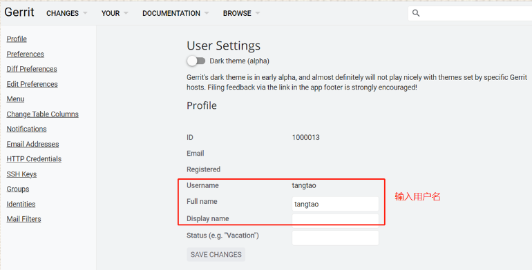

    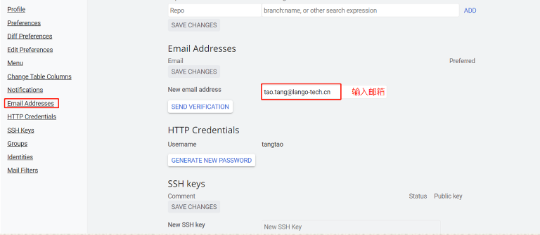

    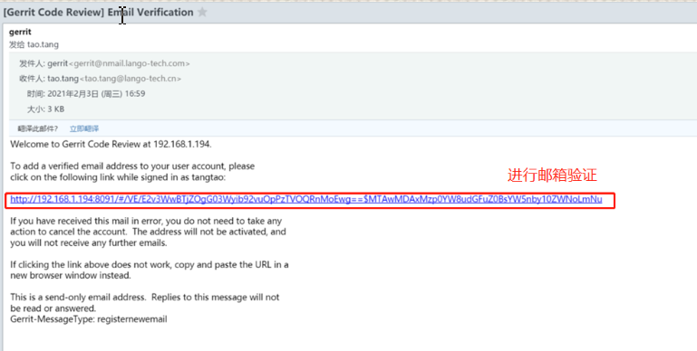

    > 注意：不要直接点击邮箱验证链接，如果链接中的端口号为 `8091`，那么需要手动改成 `8092` 后再进行验证

    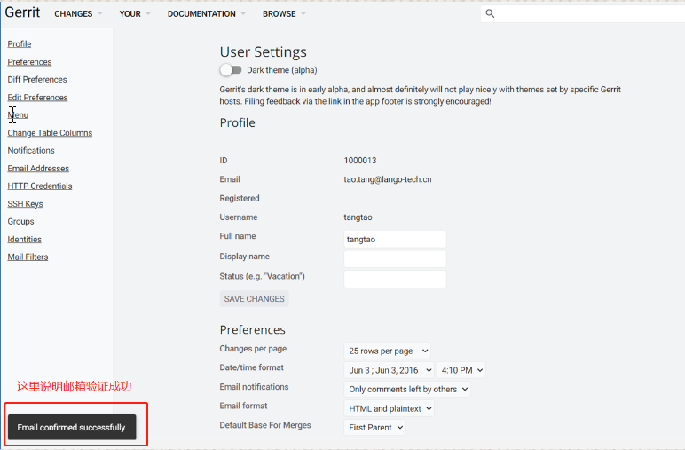    

4. 在 `Gerrit` 网页端中生成 `Token`

    ```:no-line-numbers
    当我们在本地访问 Gerrit 仓库时（如 clone 仓库），会用到这个 Token（相当于密码）。
    Token 的生成方式如下图所示：
    ```

    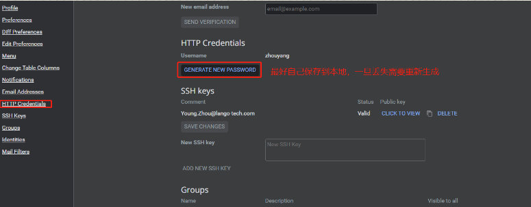

##### 1.5.1.2 `Gerrit` 界面介绍

`Gerrit` 上的仓库列表如下图所示：

> 新账号可能只有 `All-Users` 和 `testing` 这两个测试仓库。其他项目仓库需要申请仓库权限才能访问。

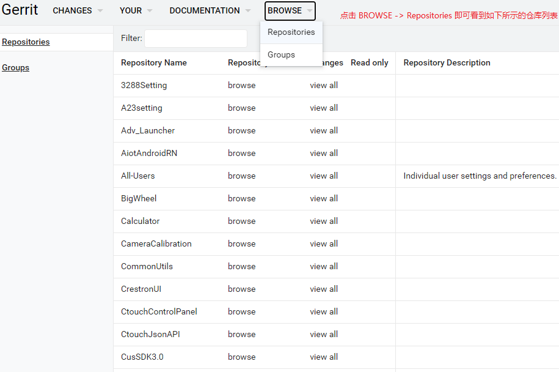

上图中，点击仓库列表中的某个仓库名称，可进入该仓库的详情页，如下图所示：

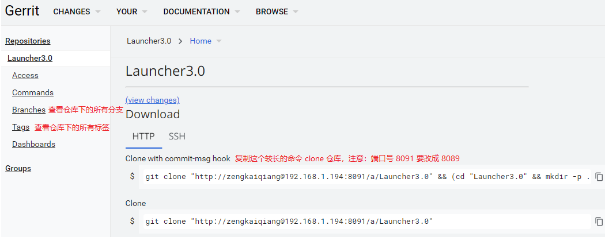

> **注意：** 较长的 `clone` 命令中有两个 `8091` 端口值，都要改成 `8089`。

本地 `Git` 仓库中执行 `git push origin HEAD:refs/for/远端分支名` 命令，会将代码推送到 `Gerrit` 中，在 `Dashboard` 界面中可以看到推送的提交记录，如下图所示：

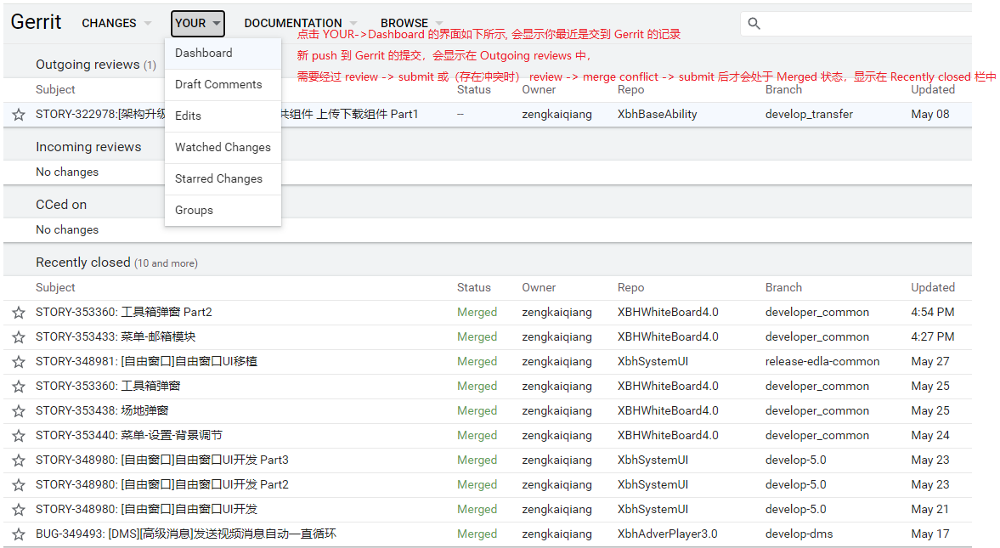

另外，在 `Gerrit` 的 `CHANGES` 栏下可以看到所有仓库（获取了权限的仓库）的各个协同开发人员的提交信息：

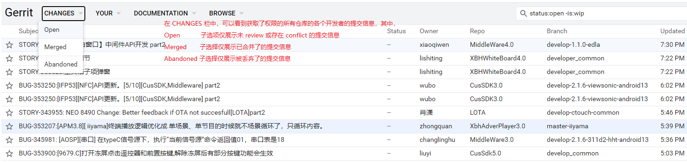

在 `YOUR -> Dashboard` 下，点击某次提交，会进入该次提交的详情页面，如下所示：

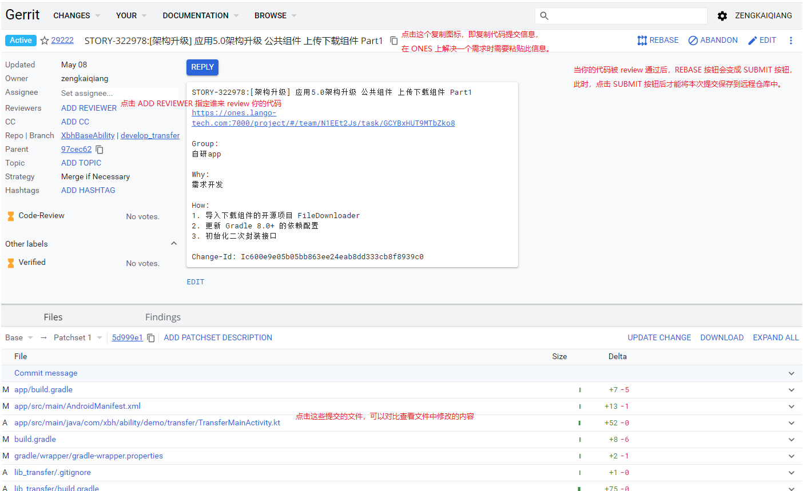

#### 1.5.2 `Git` 概述 & 常用的 `Git` 命令

> 双击软件工具包中的 `Git-2.16.1.2-64-bit.exe` 安装 `Git` 客户端。
> 
> 注意：必须使用此版本的 `Git`。

安装成功后，将 `Git` 安装目录下 `bin` 目录配置到环境变量中。

可以在 `AndroidStudio` 中通过图形化界面使用 `Git`，也可以在 `Git Bash` 终端中通过 `Git` 命令使用 `Git`。以下介绍 `Git Bash` 中常用的 `Git` 命令。

##### 1.5.2.1 常用的 `Git` 命令

```shell:no-line-numbers
# 配置用户名和邮箱
git config --global user.name "用户名"
git config --global user.email "邮箱"

# 配置 git 的默认编辑器为 vim
git config --global core.editor vim

# clone 远程仓库，clone 时直接复制 1.5.1.2 小节中介绍的仓库详情页中的较长的 clone 命令，并修改端口号即可。
git clone

# 查看本地和远程仓库的所有分支列表
git branch -a
# 仅查看本地的分支列表
git branch

# 切换分支
git checkout 分支名

# 拉取远程仓库的最新代码，并以 rebase 的方式进行合并
# 注意：
# 在执行 git pull --rebase 前本地仓库中不能有未提交的修改
# 如果存在未提交的修改，需要先 git stash 暂存起来，
# 当执行完 git pull --rebase 后，
# 再 执行 git stash pop 还原。（还原后，如果修改与拉取的代码存在冲突，需要解决冲突）
git pull --rebase

# 查看本地仓库的状态（会显示工作区、暂存区的修改信息；存在冲突时的冲突信息；未加入到版本管理的文件信息等）
git status

# 查看工作区中的修改内容
git diff
# 查看暂存区中的修改内容
git diff --cached

# 将工作区的所有修改都 add 到暂存区
git add .
# 将工作区中指定目录下的所有修改都 add 到暂存区
git add xx/yy/*
# 将工作区中指定的文件 add 到暂存区
git add 1.txt 2.txt 3.txt

# 将工作区中的所有修改都还原
git checkout -- .
# 将工作区中指定文件的修改还原
git checkout -- 1.txt 2.txt 3.txt

# 将暂存区中的所有修改都放回到工作区
git reset HEAD .
# 将暂存区中指定文件的修改放回到工作区
git reset HEAD 1.txt 2.txt 3.txt

# 将暂存区中的修改提交到本地版本库中
# 该命令执行后会唤起 vim 编辑器，需要在编辑器中根据 1.5.2.2 小节的格式规范编写 message 信息
# 编写完成后，输入 :wq 保存信息并退出编辑器后，暂存区中的修改就会提交到本地版本库中
git commit

# 将未推送到 Gerrit 仓库中的本地 commit 提交推送到 Gerrit 仓库的指定分支上。
# 执行该命令成功后，就可以在 Gerrit 网页端的 YOUR -> Dashboard 界面中看到推送的提交记录
git push origin HEAD:refs/for/远端分支名

# 查看当前分支的提交记录
git log
# 查看当前分支的提交记录，并显示每次提交的修改内容
git log -p
# 查看当前分支的提交记录，并显示每次提交的修改文件
git log --stat
```

##### 1.5.2.2 提交信息的格式规范

根据 `ones` 工作管理平台上的工作项类型，提交信息 `Message` 的格式规范分两种：**需求类型的格式** 和 **`BUG` 类型的格式**：

1. 需求类型的格式

    ```:no-line-numbers
    STORY-339583:<ones 上的需求标题>  // 339583 是需求编号；需求标题中如果有中文的 "【】"，要改成 "[]"

    https://ones.lango-tech.com:7000/project/#/team/N1EEt2Js/task/3FxjUwmFNBvp3AZx  // ones 需求链接

    Group:
    自研app

    Why:
    需求开发

    How:
    <需求内容>
    ```

2. `BUG` 类型的格式

    ```:no-line-numbers
    BUG-339583:<ones 上的BUG标题>  // 339583 是BUG编号；BUG标题中如果有中文的 "【】"，要改成 "[]"

    https://ones.lango-tech.com:7000/project/#/team/N1EEt2Js/task/3FxjUwmFNBvp3AZx  // ones BUG链接

    Group:
    自研app

    Why:
    BUG 原因

    How:
    BUG 解决方案
    ```

> 注意：
> 
> 1. 标题、链接、`Group`、`Why`、`How` 之间都要空一行；
> 
> 2. `BUG/STORY` 和编号之间用 "-" 连接；
> 
> 3. 编号和标题之间用 ":" 分隔；
> 
> 4. 标题中存在 "【】" 时要改成 "[]"。
> 
> 5. 当针对同一个工作项进行多次提交时，从第 2 次提交开始，在标题后面加 `Part<N>`，如第 2 次提交加 `Part2`，第 3 次提交加 `Part3`。
> 
> 6. `ones` 标题和链接可以在 `ones` 管理平台上复制获取，如下所示：
> 
>       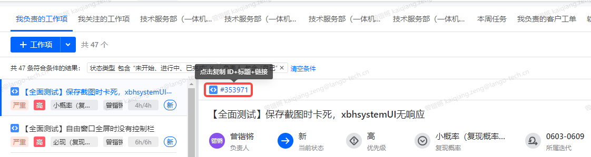

##### 1.5.2.3 示例：记一次代码提交流程

```shell:no-line-numbers
# clone 仓库 XBHWhiteBoard4.0
# 第一次 clone 仓库可能会要求输入 username 和 password
# username 就是你的 Gerrit 登录账号
# password 就是在 1.5.1.1 小节中生成的 token（注意：不是 Gerrit 的登录密码）
git clone "http://zengkaiqiang@192.168.1.194:8089/a/XBHWhiteBoard4.0" && (cd "XBHWhiteBoard4.0" && mkdir -p .git/hooks && curl -Lo `git rev-parse --git-dir`/hooks/commit-msg http://zengkaiqiang@192.168.1.194:8089/tools/hooks/commit-msg; chmod +x `git rev-parse --git-dir`/hooks/commit-msg)
```

```shell:no-line-numbers
# 查看该仓库下的所有分支
git branch -a

# 切换到 developer_common 分支
git checkout developer_common
```

```shell:no-line-numbers
# 经过一段时间后，你对该仓库进行了大量修改
# 查看仓库状态，可以看到修改的文件信息
git status
```

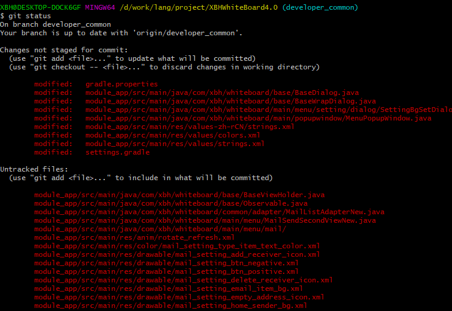

```shell:no-line-numbers
# 此时，你需要提交代码了，但是远程仓库的最新代码可能已经更新了，所以你需要先拉取远程仓库的代码
# 在拉取远程代码前，要临时保存下你修改的内容，执行如下命令进行临时保存
git stash
```

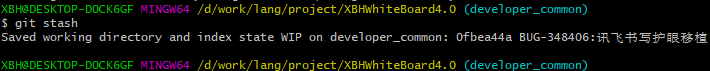

```shell:no-line-numbers
# 修改的内容临时保存成功后，再执行如下命令拉取远程仓库的代码
git pull --rebase
```

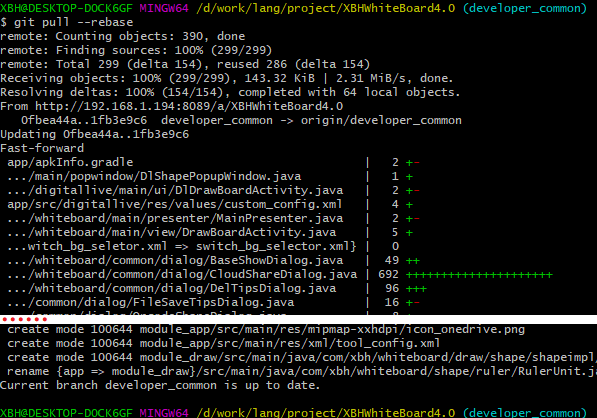

```shell:no-line-numbers
# 代码拉取完成后，执行如下命令将临时保存的修改内容还原
git stash pop

# 还原后，如果你修改的内容与拉取的代码存在冲突，那么需要先解决冲突
```

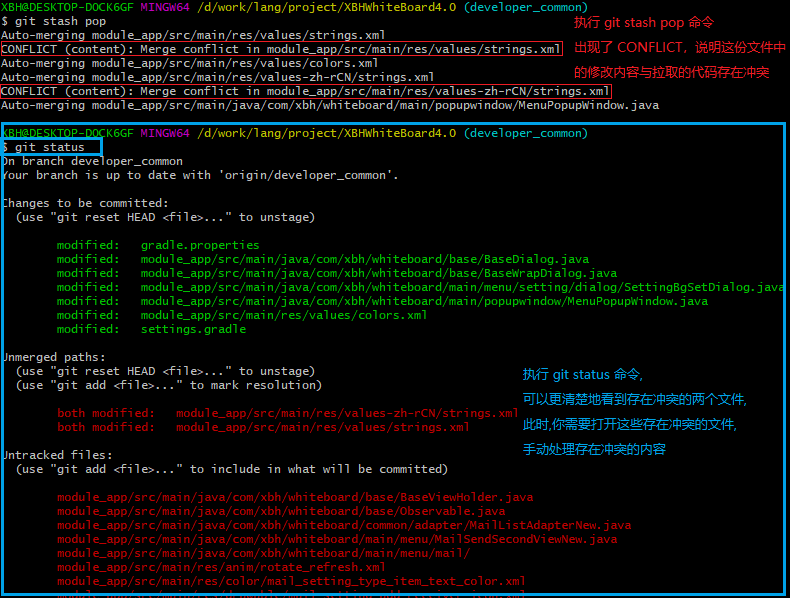

```shell:no-line-numbers
# 现在，你可以开始提交代码了
git add .  # 将工作区的所有修改都添加到暂存区（注意：如果有不需求提交的文件，那么应该指定目录或指定文件进行添加）
git commit # 将暂存区的所有修改提交到本地版本库中（注意：这里会打开 vim 编辑器编写提交信息）
git push origin HEAD:refs/for/developer_common
```

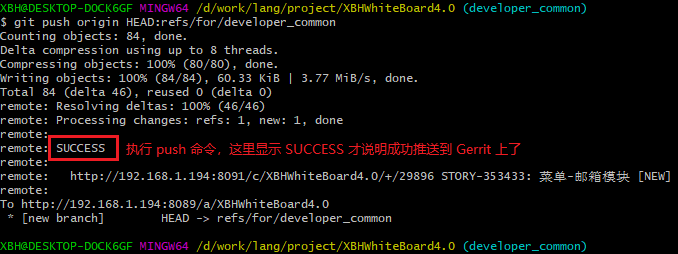


##### 1.5.2.4 示例：创建新分支

```:no-line-numbers
step1. 先在 Gerrit 网页端创建新分支
```

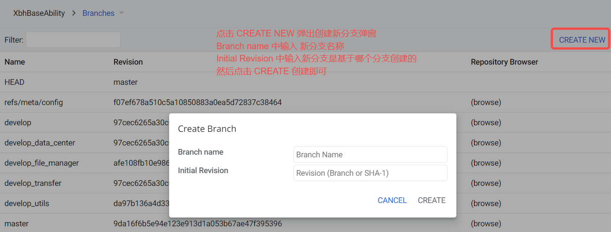

> 点击仓库详情页左侧的 `Branches` 分支栏进入上图所示界面。


```shell:no-line-numbers
# step2. 然后在本地仓库中执行如下命令拉取线上创建的新分支
git pull --rebase

# step3. 本地仓库中执行如下命令创建本地新分支。
git checkout -b <newBranch>

# step4. 执行如下命令关联本地和远程的新分支
git branch --set-upstream-to=origin/<newBranch> <newBranch>

# step5. 
# 跟之前一样编写代码，并 git add 和 git commit 后，
# 也是一样的执行 git push origin HEAD:refs/for/<newBranch> 就可以把代码推送到远程新分支了
```

##### 1.5.2.5 示例：合并 `Gerrit` 上的冲突

当看到 `Gerrit` 上的某次提交记录中出现 `Merged Conflict` 时表示代码有冲突，此时：

```shell:no-line-numbers
# step1. 执行如下命令拉取线上的冲突代码
git pull --rebase

# step2. 执行如下命令查看冲突文件，并合并冲突
git status

# step3. 执行如下命令提交合并冲突的代码
git add .
git rebase --continue

# step4. 执行如下命令推送到远程仓库
git push origin HEAD:refs/for/<远程分支>
```

##### 1.5.2.6 示例：未拉取最新代码前进行 `push` 操作后的纠正处理

```:no-line-numbers
问题场景：
远程仓库中已新增了一次提交，但本地未先执行 "git pull --rebase" 拉取最新代码，
此时，本地在未拉取代码的情况下，修改了代码并提交，然后执行 "git push origin HEAD:refs/for/远端分支名" 推送到了远程仓库。
接着，又想起来远程可能有未拉取的新代码，于是在将本地的修改提交并 push 后，才执行 "git pull --rebase" 拉取远程的最新代码，于是报错如下：
```

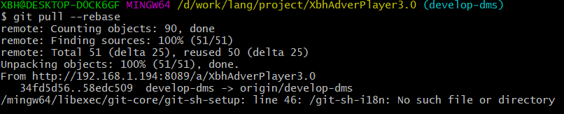

```:no-line-numbers
执行 git status 查看报错情况下的本地仓库状态如下：
```

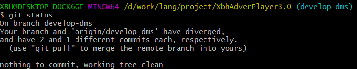

```:no-line-numbers
此时，如果按提示执行 "git pull" 命令，就会进行 merge 合并，而不是 rebase 合并。
如下所示 执行 "git pull" 命令，自动进行 merge 合并，因为不想这么做，所有没有写 merge 提交信息，于是 merge 提交失败，如下所示：
```

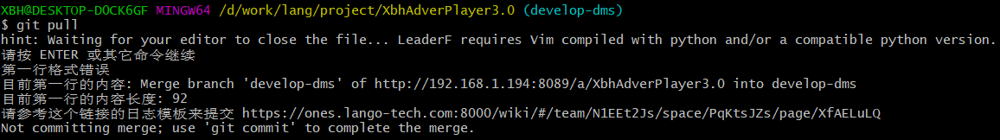

```:no-line-numbers
此时，虽然没有提交 merge，但是已经进行了 merge，于是 git status 查看本地仓库的状态如下：
```

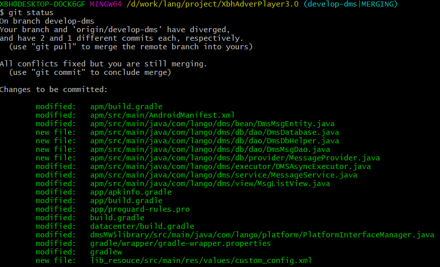

```:no-line-numbers
因为我们想执行的是 rebase 合并，而现在又处于 merge 合并中，
所以现在得先取消并回退到 merge 合并前的状态，即执行命令： git reset --merge，
然后 git status 查看本地仓库的状态如下：
```

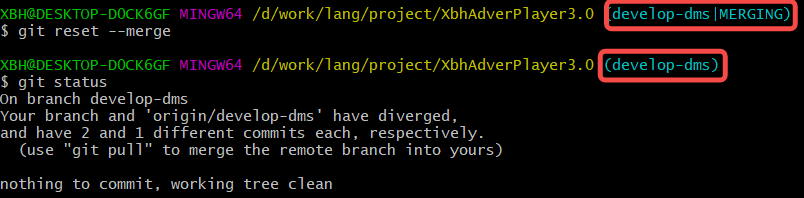

```:no-line-numbers
此时，回到了 执行 git pull 之前的状态，也就是执行 git pull --rebase 后的状态。
这个时候，需要执行 git rebase 命令，手动进行 rebase 合并。如下所示
（git rebase 表示手动变基远程分支到本地分支，如果执行后有冲突，再进行解决）
```

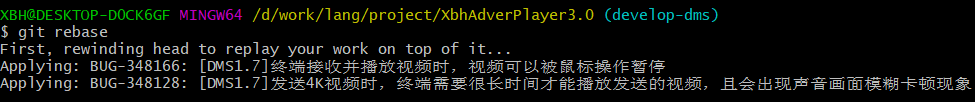

```:no-line-numbers
由于没有冲突，也就相当于成功完成了 rebase 合并。执行 git status 查看状态如下：
```

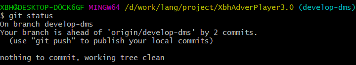

```:no-line-numbers
此时，这里的 2 次提交，就是本地在未拉取远程最新代码前 push 到 Gerrit 上的提交，
等 Gerrit 上进行了 review 和 submit 操作后，再执行 git pull --rebase 就可以了。

执行 git log 也可以看到，之前未拉取的远程的最新提交也成功 rebase 到本地仓库了，如下所示：
```

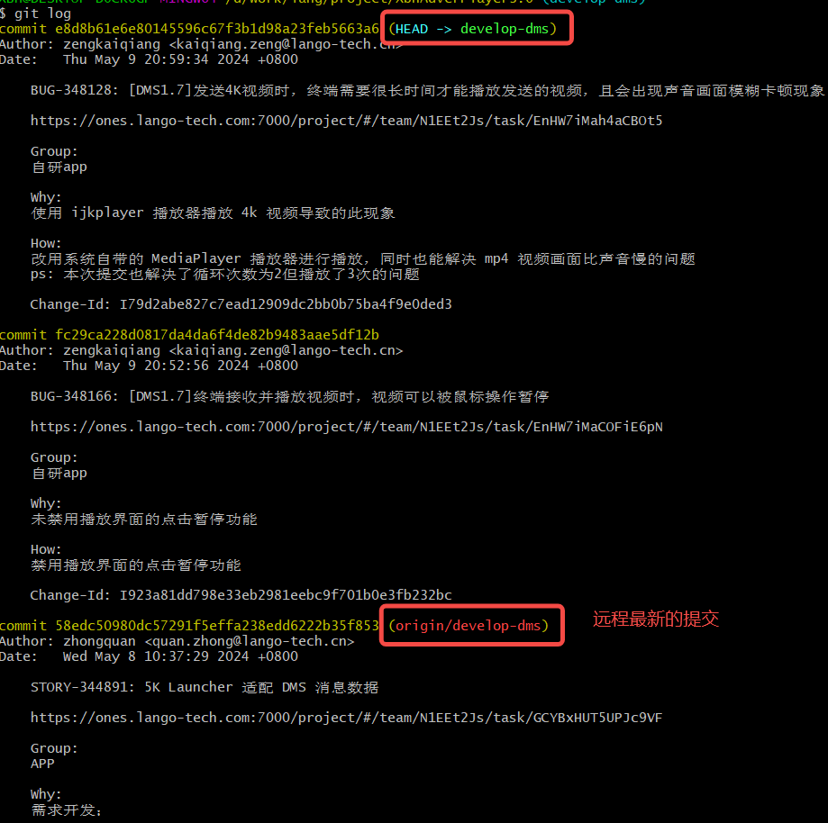

##### 1.5.2.7 在 `Windows` 凭据管理器中查看和编辑 `Gerrit` 账号和 `Token`

如果你所使用的电脑，之前已经登录过其他人的 `Gerrit` 账号，那么你可能需要将 `Windows` 中保存的其他人的 `Gerrit` 账号信息修改成你自己的，如下图所示，在 `Windows` 的凭据管理器中进行修改即可：

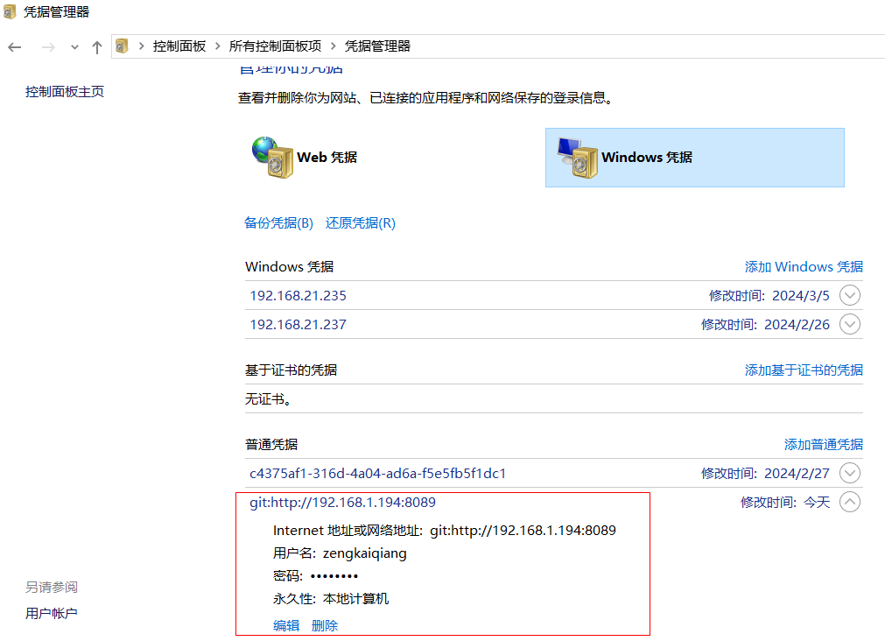

### 1.6 `SVN` & `Apk` 管理 

> 双击软件工具包中的 `TortoiseSVN-1.9.6.27867-x64-svn-1.9.6.msi` 安装 `SVN`。

安装后打开 `TortoiseSVN Repository Browser`，如下图所示：

> 注意：
> 
> 1. 按 `win` 键，搜索 `TortoiseSVN Repository Browser` 即可打开；
> 
> 2. 打开前需要将加密软件中的业务模式切换到个人模式。
> 
> 3. `SVN` 的登录账号和密码和 `Gerrit` 的一样。

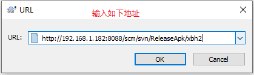

如上所示，在个人模式下输入地址 [http://192.168.1.182:8088/scm/svn/ReleaseApk/xbh2](http://192.168.1.182:8088/scm/svn/ReleaseApk/xbh2)，点击 `OK` 按钮，即可打开 `SVN` 上保存的所有项目的 `Apk` 文件：

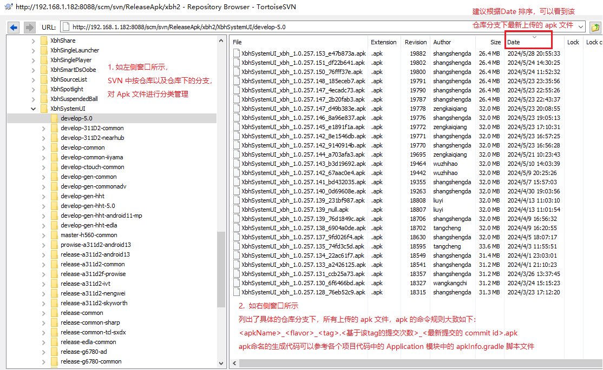

上传 `apk` 文件到 `SVN` 的方式如下图所示：

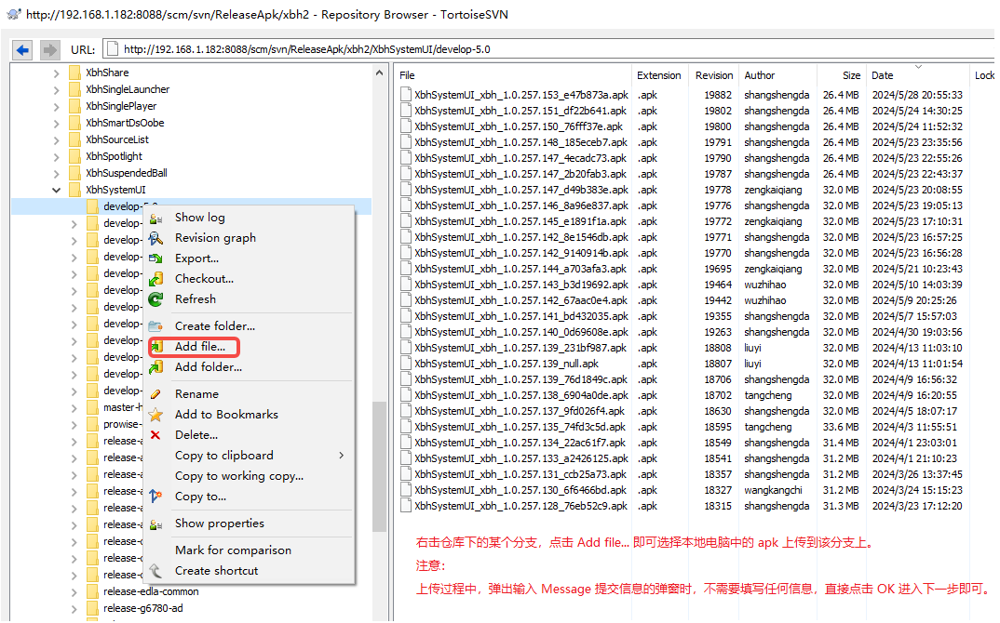

> 右击某个 `apk` 文件，依次点击 `Copy to clipboard` -> `Urls` 即可复制该 `apk` 文件在 `SVN` 上的链接地址。


### 1.7 串口调试

#### 1.7.1 `Xshell` & 串口日志打印

除了通过 `adb` 无线连接设备打印日志外，我们还可以通过 `Xshell` 串口连接设备来打印日志。另外，当设备无法启动 `Android` 系统时，也可以通过 `Xshell` 串口连接设备来查看是否有错误日志。并且，在设备刷固件的过程中，也会通过 `Xshell` 串口连接设备来输入某些指令。

通过 `Xshell` 串口连接设备的步骤如下：

1. 首先需要申请一根串口线（`USB` 转 `RS232` 的接口线），并连接电脑（`USB`）和设备（`RS232`）。

2. 查看串口线连接时所占用的端口号

    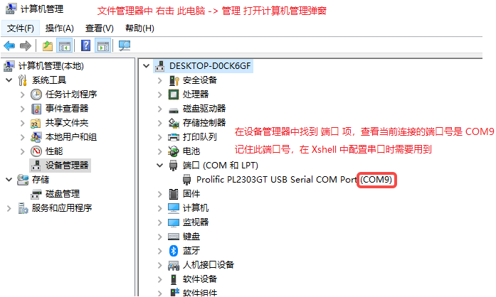

3. 解压软件工具包中的 `XshellPlus 6.0.0026.7z` 压缩文件，双击 `Xshell.exe` 打开 `Xshell` 程序。

4. 在 `Xshell` 中配置串口的方式如下图所示：

    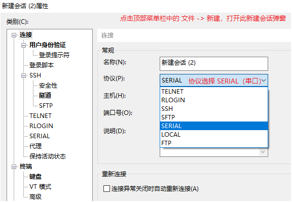

    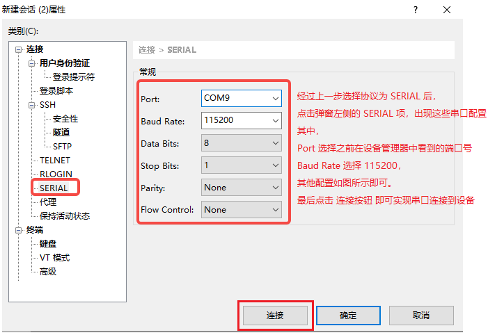


当串口连接设备成功后，`Xshell` 中的会话就处于设备的终端上了，如下图所示：

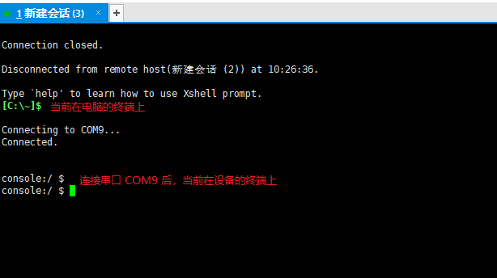

此时，1.4.1 小节介绍的 `adb` 命令中：

```:no-line-numbers
1. 以 "adb shell" 开头的命令，去掉开头的 "adb shell"，就是可以在设备终端上执行的命令；
2. 以 "adb logcat" 开头的日志打印命令，去掉开头的 "adb"，就是可以在设备终端上执行的日志打印命令。
3. 设备终端上获取 root 权限的命令如下：
    su # 找不到此命令，执行 xbhsu
    remount
```

> 注意：
> 
> 1. 可以通过快捷键 `Crtl+Shift+R` 连接设备的串口；
> 
> 2. 可以通过快捷键 `Alt+C` 断开设备的串口连接。

#### 1.7.2 多功能串行口调试助手 & 串口指令下发

> 双击软件工具包中的 `多功能串行口调试助手.exe` 即可打开使用。
> 
> **注意：** 在多功能串行口调试助手中连接串口前，要先断开 `Xshell` 中的串口连接。

多功能串行口调试助手的界面如下图所示：

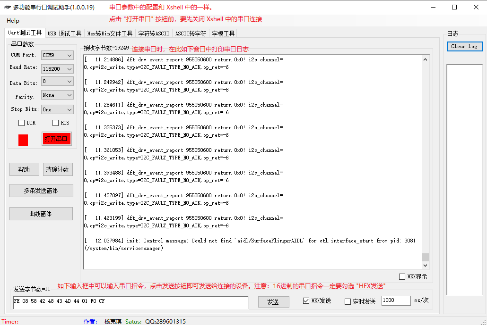

常用的串口指令可以参考文档：[《V100-RS232指令》](https://doc.weixin.qq.com/sheet/e3_AToAmAYMAE8dPMux4W8Ta6EWnv3Xw?scode=ABUAPgfAABA4CFZrLk)

如当系统的电源状态中的上电状态设置为上电待机时，断电重启不会进入 `Android` 系统，而是屏幕白屏，此时在没有按键板的条件下，可以通过多功能串行口调试助手连接串口，下发开机的串口指令即可进入 `Android` 系统。

> 开机的串口指令见文档 《`V100-RS232`指令》，即：
> 
>   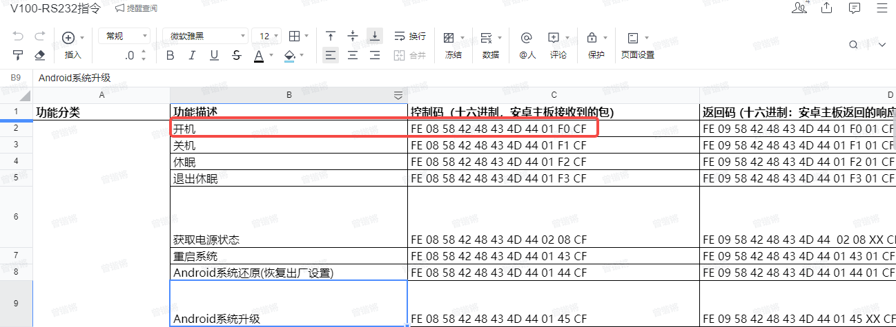
> 
> 设备的上电状态可以在系统设置中查看，如下所示：
> 
>   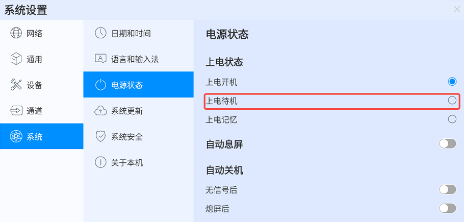

### 1.8 投屏工具 `scrcpy`

> 解压软件工具包中的 `scrcpy-win64-v2.4.zip`，并将解压目录添加到环境变量 `Path` 中即可。
> 
> 注意：解压目录中包含 `adb.exe`，为了优先使用 `sdk manager` 中的 `adb`，在环境变量 `Path` 中，解压目录应该添加到 `sdk\platform-tools` 后面。

将解压目录添加到环境变量中后，打开 `windows` 命令行终端，输入 `scrcpy` 按回车即可打开投屏工具。

**注意：** 打开投屏工具前，确保 `adb` 已经成功连接了设备。

**投屏工具的使用场景：**

1. 多人共用一台设备时，因为设备可能不在自己工位旁，此时如果需要与设备进行交互，使用投屏工具在电脑上访问设备进行交互即可。
2. 当要在设备中输入文本时，如输入邮箱，使用投屏工具在电脑上访问设备，用键盘输入会更快些。

### 1.9 工作管理平台 `ones`

在企业微信的【邮件】中添加了企业邮箱后，访问 `ones` 激活链接：[https://ones.lango-tech.com:7000/project/#/auth/login/email](https://ones.lango-tech.com:7000/project/#/auth/login/email)

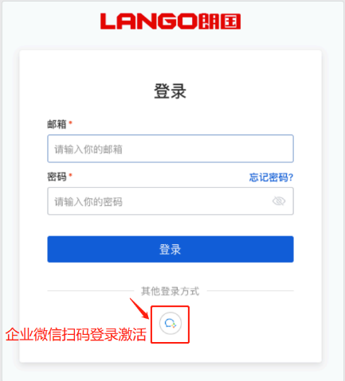

`ones` 工作管理平台的相关介绍如下图所示：

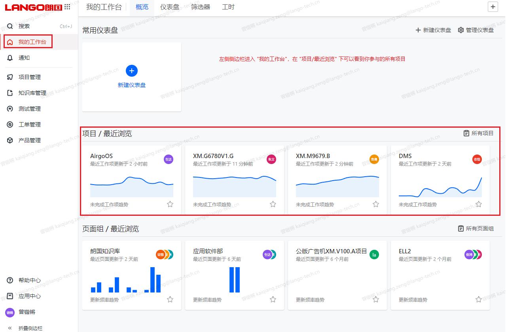

----

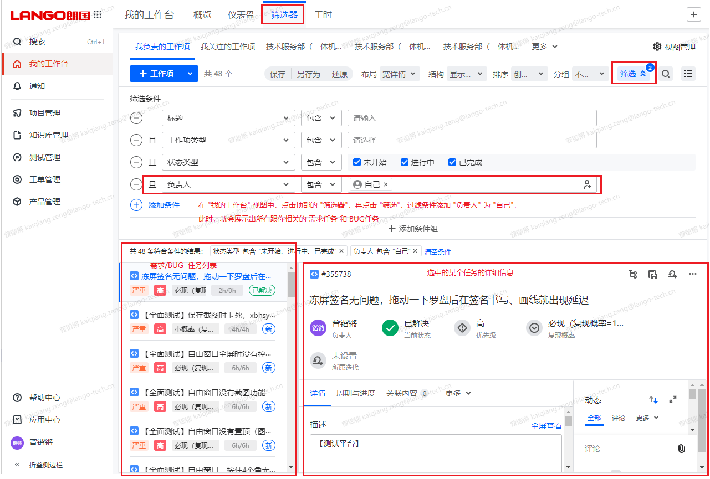

我们在处理某个需求或 `BUG` 任务时，在 `ones` 上的大致操作流程描述如下：

```:no-line-numbers
1. 当前状态：
    新 -> 待处理 -> 处理中 -> 已解决
                          -> 继续跟踪
                          -> Backlog

    一个 BUG 指派给你时，状态为 "新"，如果你要处理，但还未开始处理，状态改为 "待处理"；
    一个 "待处理" 的 BUG 在开始处理时，状态改为 "处理中"；（注意：此时如果该 BUG 还未预估工时，请联系尚生达帮你预估工时）
    一个 "处理中" 的 BUG 处理完成后，状态改为 "已解决"；（注意：此时需要登录工时，一般填写预估的工时即可）
    一个 "处理中" 的 BUG 无法复现时，状态改为 "继续跟踪"；
    "Backlog" 状态表示将 BUG 打回，不进行处理。使用场景较少，设置此状态时先跟你的上级沟通下。

    对于需求任务来说，不存在 "继续跟踪" 的状态。其他跟处理 BUG 任务类似。

2. 关联内容：
    当 BUG 任务与其他 BUG 描述的问题重复时，应该将其他重复了的 BUG 添加到关联内容中来。

3. 文件：
    测试在提 BUG 时，会将 BUG 相关的日志、视频、图片等相关文件上传到此处。

4. 工时：
    查看该需求或 BUG 任务下的预估工时、已登记工时、剩余工时。

5. 评论：
    编写与该需求或 BUG 任务相关的评论。
    如你在解决了 BUG 后，可以将上传到 SVN 上的 apk 链接地址复制到评论中。
    又如，当 BUG 需要转给其他人处理时，你需要在评论中写下转出的原因。
```

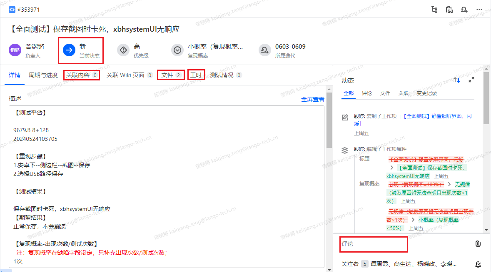

## 2. 项目介绍

### 2.1 平台介绍 & 刷固件

所谓的平台其实就是设备的板卡型号，目前，本人所接触到的板卡型号大概有如下几种：

```:no-line-numbers
1. G6780
2. 311D2
3. 8195
4. 9679
```

> 其中，`G6780` 平台和 `G6760` 平台又统称为 `V100` 平台。

刷固件简单理解就是更新 `Android` 系统。目前，本人仅了解 `6780` 平台和 `311D2` 平台上刷固件的方式，介绍如下。

#### 2.1.1 在 `G6780` 平台上刷固件

当需要你在 `G6780` 平台上刷固件时，会提供一份 `bin` 文件给你。接下来的步骤如下：

1. 将 `bin` 文件下载并拷贝到 U 盘，插入 U 盘到设备的板卡上。

2. 在设备上依次操作：进入系统设置 -> 关于本机 -> 点击 10 下

    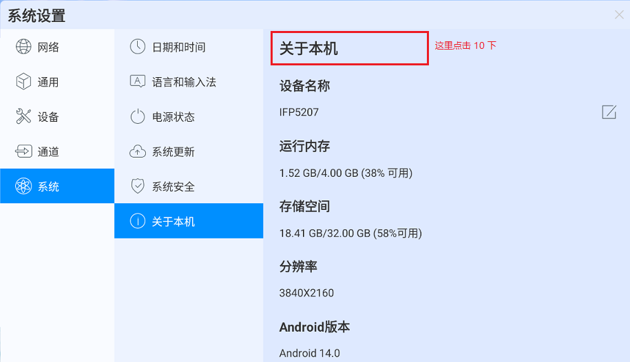

3. 在弹窗中依次点击 `UPGRADE AND BURN` -> `FW Local Upgrade` 即可：

    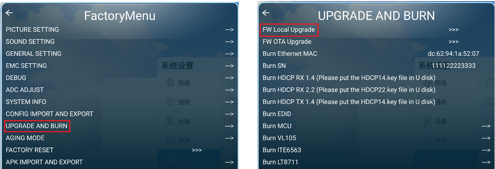


以上 3 步骤操作后，设备会自动读取 U 盘中的 `bin` 文件，并重启升级。当升级完成后，会自动重启并进入升级后的 `Android` 系统。

**注意：**

升级后的屏幕可能会出现重影，需要再次进入系统设置 -> 关于本机 -> 点击 10 下，在 `FactoryMenu` 弹窗中点击 `DEBUG` 进入 `DEBUG` 弹窗，将 `Panel Index` 由 1 改为 0 即可。

#### 2.1.2 在 `311D2` 平台上刷固件

`311D2` 平台刷固件时，要确认下固件是几 `G` 内存的，应该不能混刷，比如固件是 `8G` 内存的,板子也要找 `8G` 内存的板子。

查看板子的版本信息： 

```:no-line-numbers
进入系统设置 -> 关于本机 -> 点击 10 下，在 Factory Menu 弹窗中的 SW Model Name 就是版本信息。
其中， xxx_xxx_xxx_A311D2_8192M_128G_xxx_xxx_xxx 表示 8G 内存，128G 硬盘
```

`311D2` 平台提供的固件文件是 `zip` 压缩文件。刷固件步骤如下：

1. 解压 `zip` 包，得到 `img` 文件，拷贝到 U 盘，插入板子；
2. 断开电源，然后插入电源的同时，在 `Xshell` 的串口终端上不断按 `enter` 键，直到从 `log` 日志输出进入命令输入模式，然后执行命令 `run custar` 即可。

### 2.2 `App` 项目的仓库 & 分支 & 渠道介绍

**常见的 `App` 名称和仓库名称的对照表如下所示：**

|App 名称|仓库名称|
|:-|:-|
|Launcher3.0|Launcher3.0|
|Launcher5.0|Launcher5.0|
|XbhSystemUI（SUI）|XbhSystemUI|
|侧边栏|NavigationEdu2.0|
|罗盘|XbhFloatMenu|
|系统设置|SystemSetting_Edu2.0|
|快捷设置|XbhQuickSettings|
|文件管理器|XBHFM|
|白板|XBHWhiteBoard4.0|
|白板浏览器|XbhBrowser|
|中间件3.0|MiddleWare3.0、CusSdk3.0|
|中间件4.0|MiddleWare4.0、CusSdk4.0|
|中间件5.0|MiddleWare5.0、CusSdk5.0|
|DMS|XbhAdverPlayer3.0|
|欢迎页面|XbhWelcome2.0|
|日历|XbhCalendar|
|工厂测试|LangoFCT_Edison|
|工具类组件|XbhBaseAbility|
|快速开发框架|XbhBase|

> 注意：
>
> 1. 如上所示，根据仓库名称在 `Gerrit` 上的 `BROWSE -> Repositories` 界面中搜索仓库即可。如果未搜索到，那么就是你没有访问权限，联系负责人开通权限即可。
> 
> 2. 中间件有 3.0、4.0、5.0 这几个版本，每个版本对应两个仓库，其中 `CusSdk` 可以理解为将中间件封装成 SDK 给外部使用，而 `MiddleWare3` 则可以理解为中间件内部的具体实现。
> 
> 3. `DMS` 具体地是对应 `XbhAdverPlayer3.0` 仓库的 `develop-dms` 分支。
> 
> 4. 工具类组件和快速开发框架的介绍，参考文档 [组件规范](https://ones.lango-tech.com:7000/wiki/#/team/N1EEt2Js/space/2cDdkWBW/page/W3otPXok)、[工具类组件](https://ones.lango-tech.com:7000/wiki/#/team/N1EEt2Js/space/2cDdkWBW/page/Tb7L2roY)、[快速开发框架](https://ones.lango-tech.com:7000/wiki/#/team/N1EEt2Js/space/2cDdkWBW/page/63u6SwNZ)
> 
> 5. 还有部分未列举的 `App` 项目，可以在文档 [APP项目提测版本号统计表](https://doc.weixin.qq.com/sheet/e3_m_IQuvijjMwcfR?scode=ABUAPgfAABANzMo2x2AU8A5gaLAP8&tab=vsk2t3) 中看到。

**下面简单地介绍下仓库的分支。**

如下图所示，列举了部分仓库的所有分支，可以看到，有的仓库下存在大量的不同分支。

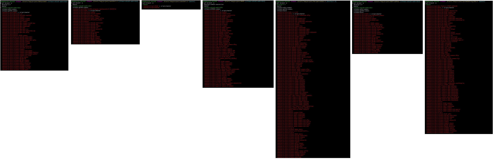

一开始，不需要你一个一个去理清每个分支的使用场景，只需要大概知道以下几点：

1. 仓库分支，原则上是根据板卡型号（平台）来创建的，比如：

    ```:no-line-numbers
    release-g6780-common 分支对应 G6780 平台的公版
    release-a311d2-android13 分支对应 311D2 平台的公版
    release-edla-common 分支对应 8195 平台的公版
    ```

2. 第 1 点中提到了公版的概念，这是因为在同一个平台上，面对不同的客户可能需要做定制（即客制化）。原则上，客制化不应该新建分支，而是在分支中以渠道的形式来区分。但是，有的客制化改动较大，项目代码很难以渠道的形式兼容，所以才新建了分支。

    > 也就是说，不同分支，可能是对应不同平台，也可能是对应同一平台下的不同客制化。当然，也可能还存在其他的情况。

3. 因此，当你需要修改某个项目的代码时，首先要跟负责人确认清楚是在哪个分支上开发。


**下面再简单地介绍下渠道**

在上面介绍分支时，已经说明了渠道的作用是兼容同一平台（板卡型号）下不同的客制化需求。渠道一般配置在 `Application` 模块的 `build.gradle` 文件中，如下图所示：

> 有的项目可能会配置在 `Application` 模块的 `apkInfo.gradle` 文件中，如 `XbhAdverPlayer3.0` 仓库下 `develop` 分支 。

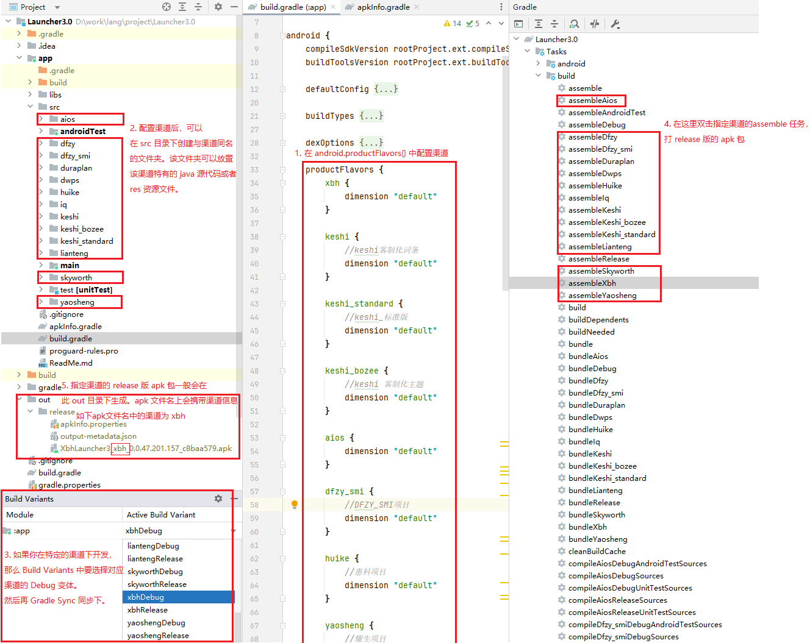

**注意：**

如果在 `AndroidStudio` 右侧的 `Gradle` 面板中没有显示 `build/assembleXxx` 任务，那么需要在设置中勾选如下：

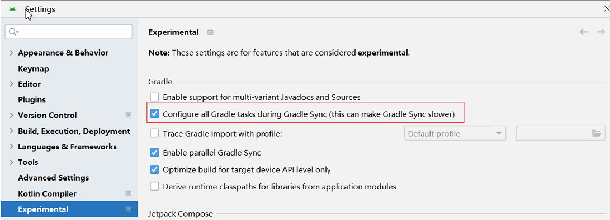

## 3. 常见问题

### 3.1 `Apk` 文件的命名规则

`apk` 的命名规则大致如下：

```:no-line-numbers
<apkName>_<flavor>_<tag>.<基于该 tag 的提交次数>_<最新提交的 commit id>.apk
```

> `apk` 命名的生成代码可以参考各个项目代码中的 `Application` 模块中的 `apkInfo.gradle` 脚本文件。

### 3.2 如何查看设备中 `App` 的版本信息

```:no-line-numbers
通过查看设备中 /system/apkInfos.properties 文件可以知道该设备的固件中所安装的 apk 文件名，
通过 apk 文件名可以知道对应的仓库，分支，和哪次提交时打的包（因为 apk 文件名最后一串字符串表示提交的 commit id）。
如：
    apkVersion=develop-common/XbhScreenRecorder_xbh_1.0.121.33_4d6bb23.apk
    其中，分支为 develop-common，渠道 flavor 为 xbh，最后提交记录 commit id 为 4d6bb23
```

> 如果仓库分支下找不到 `commit id` 对应的提交记录，那么应该是在 `rebase` 合并代码时对 `commit id` 进行了自动修改。

### 3.3 `adb install` 安装 `Launcher 5.0` 提示 `Persistent apps are not updateable`

```:no-line-numbers
原因：
之前 push 到 /system/app/XbhLauncher/ 下的是 apk，
是清单文件中设置了 android:persistent="true" 的 apk，该属性决定了不允许 apk 通过 install 的方式进行更新。

解决方式：
在清单文件中将 android:persistent 改为 false，重新打个 apk 包 push 到 /system/app/XbhLauncher/ 中，
之后就可以通过 adb install 安装了。

注意：
将 android:persistent 改为 false 只是为了 push 一个非 persistent 的 app 到 system/app 下，
方面通过 adb install 安装或者在 AndroidStudio 中直接运行 app，简化调试步骤。
但是 android:persistent 一定要还原成 true 后才能提交代码，不能将 false 提交到远程仓库中。
```

### 3.4 `app` 模块 和 `lib` 模块的命名空间相同时，`R` 资源文件访问异常

```:no-line-numbers
首先，需要明确一点，不同模块的命名空间不应该相同。如果相同，需要进行修改。

如果要已当前模块的命名空间中的 R 来访问依赖模块中的资源，
需要在 gradle.properties 文件中设置 android.nonTransitiveRClass = false，
表示当前模块的 R 可以引用依赖模块中的资源。
```

### 3.5 `adb` 无法连接，提示 `could not read ok from ADB Server`

执行 `adb devices` 提示：

```:no-line-numbers
List of devices attached
* daemon not running; starting now at tcp:5037
could not read ok from ADB Server
* failed to start daemon
```

此时，需要查看 5037 端口是否被占用，并杀掉占用的进程。

```shell:no-line-numbers
netstat -aon|findstr "5037"  # 查找 5037 端口是否被占用
tasklist|findstr "28576"     # 列出占用 5037 端口的进程 id 的应用程序
taskkill -f -im xxx.exe      # 杀掉占用 5037 端口的应用程序
```


### 3.6 使用 `WebView` 报异常：`For security reasons, WebView is not allowed in privileged`

```:no-line-numbers
这是因为使用 WebView 的 App 是系统级别的，即在 AndroidManifest.xml 中添加了 android:sharedUserId="android.uid.system"。
此时，Google 基于安全问题考虑，限制了 webview 控件在系统级别的 App 中使用。

解决方式是在将 WebView 相关的功能模块抽离出来，放到其他非系统级别的 App 中，这也是白板浏览器 XbhBrowser 项目存在的原因 ~
```
