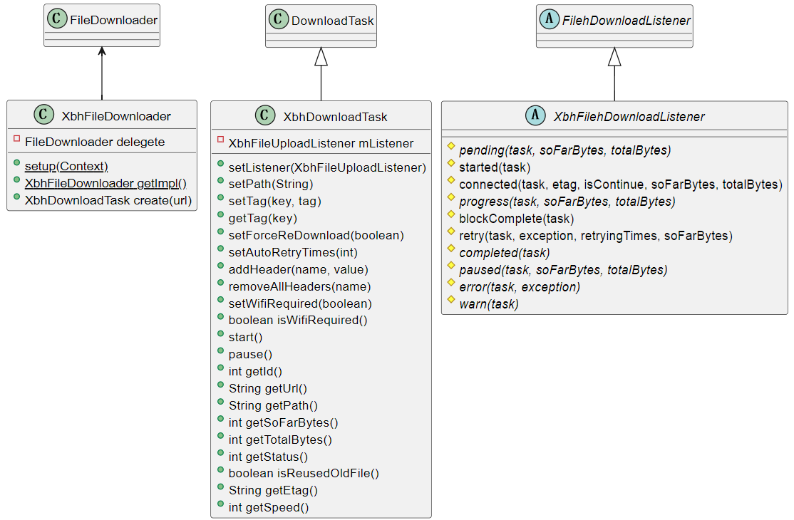
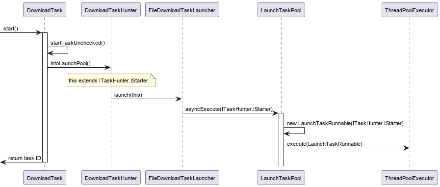
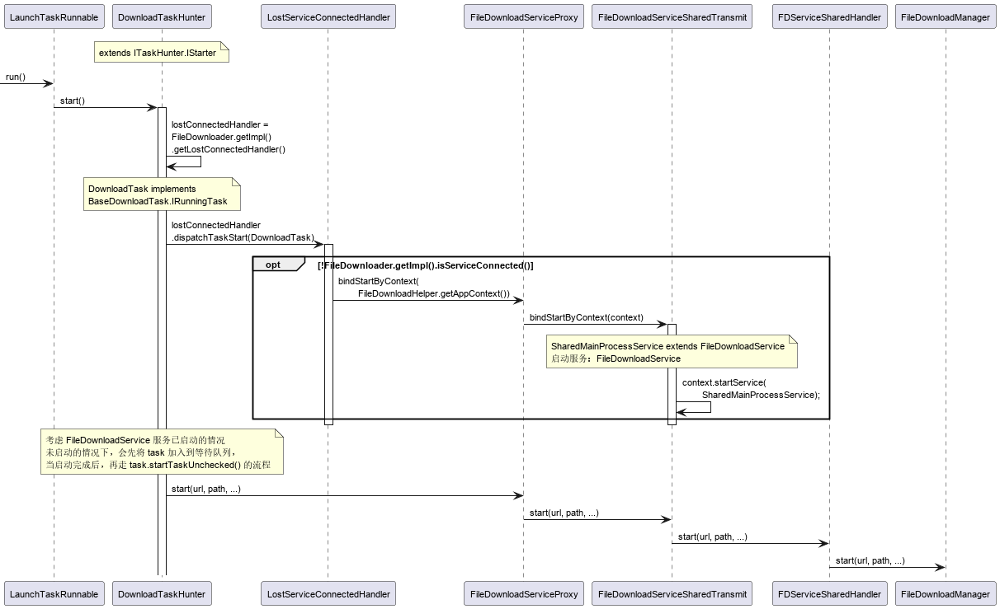
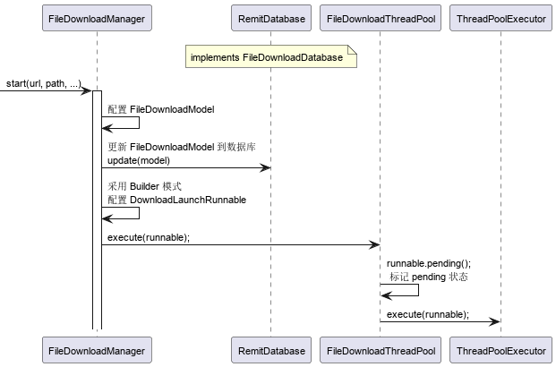
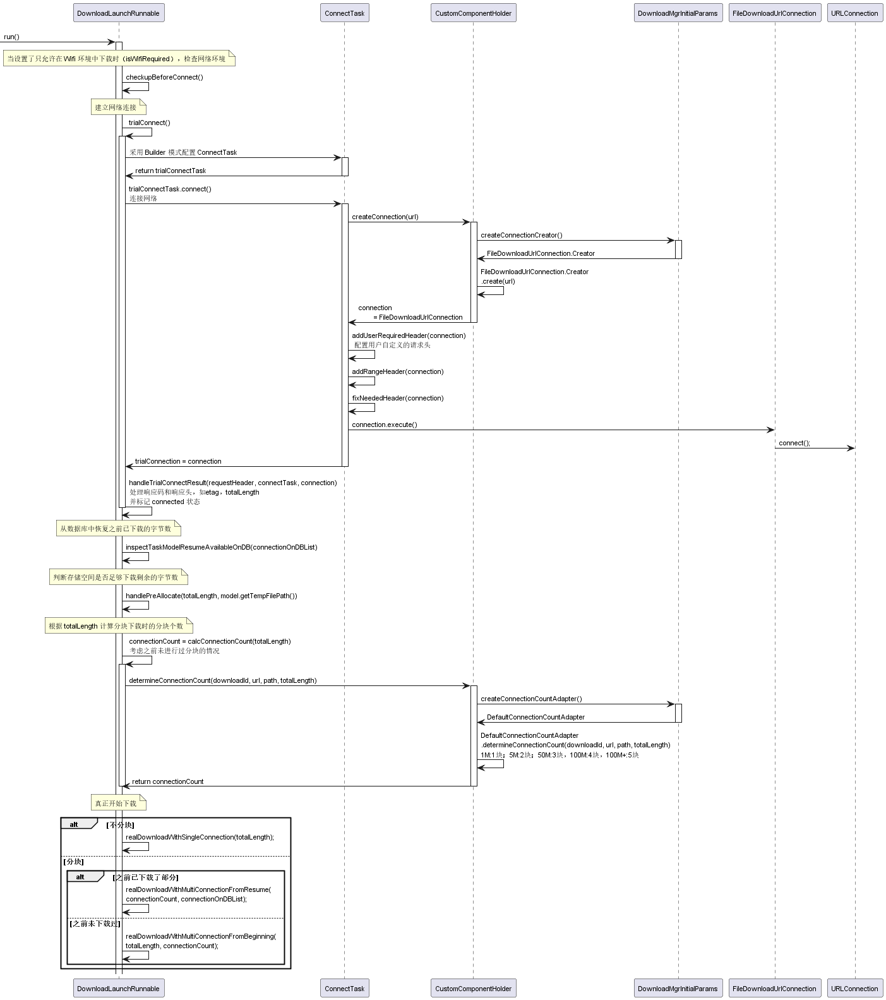

上传下载组件作为 `Android Library` 模块写在仓库 `XbhBaseAbility` 的分支 `develop_transfer` 中，模块名为 `lib_transfer`。

提供文件上传和文件下载的功能。

## 1. 下载模块

基于开源项目 [FileDownloader](https://github.com/lingochamp/FileDownloader) 进行封装。

对于需求：

```:no-line-numbers
1、支持断点续传
2、支持进度回调
3、支持暂停和继续
4、支持多线程下载
```

`FileDownloader` 都能满足。


`FileDownloader` 大致可分为如下几个模块：

### 1.1 下载任务的构建模块

构建模块是面向用户的，用户只需关心如何构建下载任务，最后调用 `start` 方法即可进行下载。

构建模块涉及到的类主要有如下三个：
   


`Xbh` 为前缀的接口是对开源项目 `FileDownloader` 进行了二次封装，对外屏蔽了不必要的 API。

> API 方法的功能描述参考：[FileDownloader 的说明文档](https://github.com/lingochamp/FileDownloader/blob/master/README-zh.md)

使用示例：

```java
XbhFileDownloader.setup(cotext);
XbhFileDownloader fileDownloader = FileDownloader.getImpl();

XbhDownloadTask downloadTask = fileDownloader.create(url);
downloadTask.setPath(path); // 下载文件的存储绝对路径
downloadTask.setCallbackProgressMinInterval(1000); // 设置每个 FileDownloadListener#progress 之间回调间隔(ms)
downloadTask.setAutoRetryTimes(3); // 下载失败时自动重连 3 次
downloadTask.setTag(KEY_1, obj1); // 用于存储任意的变量方便回调中使用，以 key 作为索引
downloadTask.setTag(KEY_2, obj2);

downloadTask.setListener(new XbhFileDownloadListener() {
    @Override
    protected void pending(BaseDownloadTask task, int soFarBytes, int totalBytes) {}

    @Override
    protected void connected(BaseDownloadTask task, String etag, boolean isContinue, int soFarBytes, int totalBytes) {}

    @Override
    protected void progress(BaseDownloadTask task, int soFarBytes, int totalBytes) {

    @Override
    protected void blockComplete(BaseDownloadTask task) {}

    @Override
    protected void retry(final BaseDownloadTask task, final Throwable ex, final int retryingTimes, final int soFarBytes) {}

    @Override
    protected void completed(BaseDownloadTask task) {}

    @Override
    protected void paused(BaseDownloadTask task, int soFarBytes, int totalBytes) {}

    @Override
    protected void error(BaseDownloadTask task, Throwable e) {}

    @Override
    protected void warn(BaseDownloadTask task) {}
});

downloadTask.start();
```


### 1.2 下载任务的分发模块

构建好的下载任务，在执行 `start()` 方法后，就会通过 `FileDownloadTaskLauncher` 分发到线程池中等待处理。线程池中最多允许三个线程并行执行，未立即执行的下载任务保存到工作队列中等待执行。线程池代码如下：

```java
/* com.liulishuo.filedownloader.FileDownloadTaskLauncher.LaunchTaskPool */
private void init() {
    mWorkQueue = new LinkedBlockingQueue<>();
    mPool = FileDownloadExecutors.newDefaultThreadPool(3, mWorkQueue, "LauncherTask");
}
```

分发模块的时序图如下：




### 1.3 下载服务模块

`FileDownloader` 会启动一个服务组件 `FileDownloadService`， 并在 `App` 退到后台时，设置为前台服务，以保证下载任务所在的 `App` 界面退到后台时进程也不容易被杀掉。
在 `FileDownloadService` 服务启动前，下载任务会被再次保存到 `LostServiceConnectedHandler` 的 `mWaitingList` 队列中。当服务启动后，再执行下载任务。

基于 `FileDownloadService` 服务的下载任务处理时序图如下：



> `FileDownloader` 支持在单独的进程中执行下载任务，但会增加 `IPC` 回调带来的 `IO` 负担。实际使用场景中很少有在单独进程中执行下载任务的需求，因此暂不考虑在单独进程中进行下载在场景。

> 在 `FileDownloadManager` 中会开始准备下载数据模型 `FileDownloadModel`，并更新到 `SQLite` 数据库 `RemitDatabase` 中。然后根据下载任务中配置的参数构建 `DownloadLaunchRunnable`，并提交到线程池中等待处理，相关时序图如下：




### 1.4 下载核心模块

该模块是真正处理下载过程的核心，下载过程可大致分为如下几个步骤：

```
step1. 检查网络环境，
当设置了只允许在 Wifi 环境中下载时（isWifiRequired），检查到非 wifi 环境就取消下载。

step2. 建立网络连接
配置用户自定义的请求头，以及断点下载所需要的请求头信息，然后通过 URLConnection 建立网络连接。
获取响应状态吗，etag 信息，以及文件大小的字节数据

step3. 
从数据库中恢复之前已下载的字节数。
对于断点下载的情况，若之前已有部分字节数据下载过了，则要从数据库中进行恢复，以便后面计算剩余的未下载字节数。

step4. 
判断存储空间是否足够下载剩余的字节数。
如果本地存储空间不够保存剩余未下载的字节数，则会抛出异常，取消下载。

step5. 根据 totalLength 计算分块下载时的分块个数
FileDownloadManager 不但支持断点下载，还支持分块下载，以提高大文件的下载速度。

step6. 
真正开始下载文件。
```

下载核心过程的时序图如下：




## 2. 上传模块

基于开源项目 [android-upload-service](https://github.com/gotev/android-upload-service) 进行封装。

## 3. 二次封装

### 3.1 下载模块的封装

1. `FileDownloader` 开源项目对外暴露了一些基本上用不到的 `API` 接口，二次封装时，会将这些 `API` 接口都先隐藏掉，后续再根据实际需要开放出来，或进行自定义扩展。减少用户初次使用时的学习成本。

2. 尽量减少对外暴露的接口。第一版计划只对外暴露三个接口：

    |二次封装接口|对应的开源项目中的接口|
    |:-|:-|
    |XbhFileDownloader|FileDownloader|
    |XbhFileDownloadTask|FileDownloadTask|
    |XbhFileDownloadListener|FileDownloadListener|

    > 考虑到之前有同事可能使用过 `FileDownloader` 开源项目。二次封装的接口只是加前缀 "`Xbh`"，并隐藏原来的一些基本上用不到的 `API`。

3. `FileDownloader` 开源项目中对大文件（>=1.99GB）要求使用 `FileDownloadLargeFileListener` 进行监听，并提供专门的 `getLargeFileSofarBytes/getLargeFileTotalBytes` 方法获取字节数据。二次封装时，计划对监听器和获取字节数据的方法进行统一，另外提供配置方法对是否是大文件进行标识。
   
### 3.2 上传模块的封装

上传模块使用的开源项目不同于下载模块，但二次封装时，计划基于下载模块的封装风格进行处理，即提供二次封装接口：

|二次封装接口|
|:-|
|XbhFileUploader|
|XbhFileUploadTask|
|XbhFileUploadListener|

用于实现上传功能。

封装原则也是基于接口隔离原则，第一版只提供必要的 API 接口，开源项目的中非必要接口后续再根据实际情况进行更新。