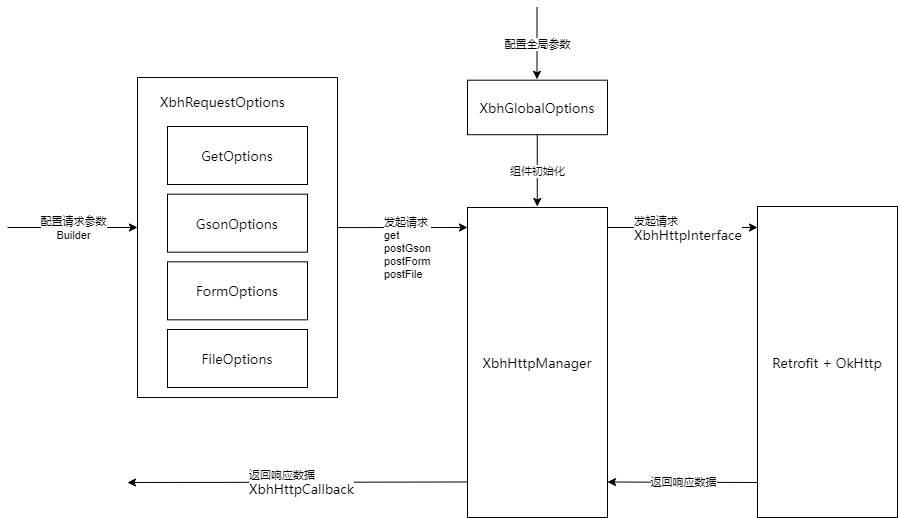

## 1. 快速上手

### 1.1 添加依赖

**配置依赖模块的仓库地址**

> `AGP 8.0` 以下版本在根项目的 `build.gradle` 中配置仓库地址

```groovy:no-line-numbers
/* settings.gradle */
pluginManagement {
    repositories {
        maven{
            allowInsecureProtocol(true)
            credentials{
                username'mobile'
                password'mobile'
            }
            url'http://192.168.21.214:8082/repository/maven-releases/'
        }
    }
}

dependencyResolutionManagement {
    repositoriesMode.set(RepositoriesMode.FAIL_ON_PROJECT_REPOS)
    repositories {
        maven{
            allowInsecureProtocol(true)
            credentials{
                username'mobile'
                password'mobile'
            }
            url'http://192.168.21.214:8082/repository/maven-releases/'
        }
    }
}
```

**配置依赖模块**

```groovy:no-line-numbers
/* Module 的 build.gradle */
dependencies {
	implementation 'com.xbh.ability:http:1.0.1'
}
```

### 1.2 全局配置

全局配置示例：

```kotlin:no-line-numbers
// 在 Application#onCreate() 中调用此方法初始化
fun init(context : Context) {

	val options = XbhGlobalOptions.Builder()
		.setConnectTimeout(30) // 连接超时时间(s)，不设置默认 10s
		.setReadTimeout(30)    // IO 流读取操作的超时时间(s)，不设置默认 15s
		.setWriteTimeout(30)   // IO 流写入操作的超时时间(s)，不设置默认 15s
		.setEnableCookie(true)                                 // 是否保存 cookie。不设置默认 false
		.setCookieJar(CookieJarCreator.createDefault(context)) // 保存 cookie 的策略（enableCookie 为 true 时才起作用）
		.setEnableCache(true)                          // 是否使用本地缓存。不设置默认 false
		.setCache(CacheCreator.createDefault(context)) // 本地缓存策略（enableCache 为 true 时才起作用）
		.setRetryOnConnectionFailure(true) // 连接失败时是否重试，不设置默认 true，表示重试
		.setAllowRedirects(true)           // 是否允许重定向，不设置默认 true，表示允许
		.setTrustAllCertificate(true)      // 是否信任所有证书，不设置默认 false，表示不信任所有证书
		.setPassAllHost(true)              // 是否允许所有的主机名都通过服务器的认证，不设置默认 false 不允许
		.addInterceptor(TestInterceptor()) // 添加拦截器
		.setLogLevel(HttpLog.Level.DEBUG)  // 日志打印级别，不设置默认 HttpLog.Level#ERROR
		.build(context);

	XbhHttpManager.getInstance().setup(options);
}
```

### 1.3 示例：`GET` 请求

`GET` 请求的示例代码如下所示：

```kotlin:no-line-numbers
fun getRequest(mac: String?, id: String?, callback: XbhHttpCallback<ResponBean>?) {
	val getOptions = XbhRequestOptions.GetOptions.Builder()
		.setBaseUrl("scheme://host:port")
		.setExtUrl("path")
		.addHeader("Accept-Encoding: gzip")
		.addQuery("mac", mac)
		.addQuery("id", id)
		.build()

	XbhHttpManager.getInstance().get(getOptions, ResponBean::class.java, callback)
}

class ResponBean {
	var attr1 :String? = null
	var attr2 :Int? = null
	var attr3 :Boolean? = null
}
```

### 1.4 示例：`POST` 请求

`POST` 请求携带 `json` 请求参数的示例代码如下所示：

```kotlin:no-line-numbers
fun postRequest(requestBean: RequestBean, callback: XbhHttpCallback<ResponBean>?) {
	val gsonOptions = XbhRequestOptions.GsonOptions.Builder<RequestBean>()
		.setBaseUrl("scheme://host:port")
		.setExtUrl("path")
		.addHeader("Accept-Encoding: gzip")
		.setBody(requestBean)
		.build()

	XbhHttpManager.getInstance().postGson(gsonOptions, RequestBean::class.java, ResponBean::class.java, callback)
}

class RequestBean {
	var attr1 :String? = null
	var attr2 :Int? = null
	var attr3 :Boolean? = null
}

class ResponBean {
	var attr1 :String? = null
	var attr2 :Int? = null
	var attr3 :Boolean? = null
}
```

### 1.5 通过 `Builder` 设计模式构造请求参数

如 `GET` 请求的参数封装在 `GetOptions` 一样，组件一共提供了如下 4 种请求参数的封装类：

```java:no-line-numbers
/* GetOptions: 用于封装 GET 请求参数 */ 

// 设置 baseUrl，只能包含 "scheme://host:port"，如 "https://www.baidu.com:443"
setBaseUrl(String baseUrl) 
// 可以是 url 中的 path 部分，也可以是一个完整的 url。当是一个完整的 url 时，baseUrl 可以省略不设置
setExtUrl(String extUrl)
// 请求头信息，如请求头 "Accept: */*" 可写成 addHeader("Accept", "*/*")
addHeader(String name, String value)
// 请求头信息，如请求头 "Accept: */*" 可写成 addHeader("Accept: */*")
addHeader(@NonNull String line)
// 请求头信息，用于一次添加多个请求头
addHeaders(Map<String, String> headers) 

// GET 请求的查询参数
addQuery(String name, String value)
// GET 请求的查询参数，用于一次添加多个查询参数
addQueries(Map<String, String> queries)
```     

```java:no-line-numbers
/* GsonOptions: 用于封装 POST 请求中的 json 参数（即适用于 json 数据上传） */

setBaseUrl(String baseUrl) 
setExtUrl(String extUrl)
addHeader(String name, String value)
addHeader(@NonNull String line)
addHeaders(Map<String, String> headers) 

// POST 请求的请求体 json 参数对应的封装实体类（其中 Body 是泛型）
setBody(Body body)
``` 

```java:no-line-numbers
/* FormOptions: 用于封装 POST 请求中的表单参数（即适用于表单数据上传） */

setBaseUrl(String baseUrl) 
setExtUrl(String extUrl)
addHeader(String name, String value)
addHeader(@NonNull String line)
addHeaders(Map<String, String> headers) 

// POST 请求上传的一个表单数据，其中 value 只能是基本数据类型和字符串类型
addField(String name, Object value)
// POST 请求上传的多个表单数据，其中 Map 中值只能是基本数据类型和字符串类型
addFields(Map<String, Object> fields)
``` 

```java:no-line-numbers
/* FileOptions: 用于封装 POST 请求中的表单参数以及文件（即适用于文件上传） */

setBaseUrl(String baseUrl) 
setExtUrl(String extUrl)
addHeader(String name, String value)
addHeader(@NonNull String line)
addHeaders(Map<String, String> headers) 

// 上传文件的同时也可以携带表单数据，其中 value 只能是基本数据类型和字符串类型
addField(String name, Object value)
// 上传文件的同时也可以携带表单数据，其中 Map 中值只能是基本数据类型和字符串类型
addFields(Map<String, Object> fields)

// 需要上传的文件，相当于调用 addFile(file, null, null)
addFile(@NonNull File file)
// 需要上传的文件，并告诉服务器所上传文件的文件名和文件类型。
// 若不指定文件名，则用 file.getName 代替；若不指定文件类型，则根据文件名后缀判断
addFile(@NonNull File file, @Nullable String fileName, @Nullable FileType fileType)
```

### 1.6 通过 `XbhHttpManager` 发起网络请求

`XbhHttpManager` 目前提供如下 4 种请求 `API`：

```java:no-line-numbers
/* 发起 GET 请求的接口 */

/**
 * @param options 封装 GET 请求参数
 * @param responseType 响应体数据封装类的字节码，不关心响应数据时，传入 Object.class
 * @param callback 请求成功或失败的回调，不关心请求失败时使用 XbhSuccessCallback；都不关心时传入 null
 */
<Out> void get(GetOptions options, Class<Out> responseType, XbhHttpCallback<Out> callback)
```

```java:no-line-numbers
/* 发起 POST 请求并上传 json 数据的接口 */

/**
 * @param options 封装 POST 请求参数，以及要上传的 json 数据
 * @param requestType 要上传的 json 数据封装类的字节码
 * @param responseType 响应体数据封装类的字节码，不关心响应数据时，传入 Object.class
 * @param callback 请求成功或失败的回调，不关心请求失败时使用 XbhSuccessCallback；都不关心时传入 null
 */
<In, Out> void postGson(GsonOptions<In> options, Class<In> requestType, Class<Out> responseType, XbhHttpCallback<Out> callback)
```

```java:no-line-numbers
/* 发起 POST 请求并上传表单数据的接口 */

/**
 * @param options 封装 POST 请求参数，以及要上传的表单数据
 * @param responseType 响应体数据封装类的字节码，不关心响应数据时，传入 Object.class
 * @param callback 请求成功或失败的回调，不关心请求失败时使用 XbhSuccessCallback；都不关心时传入 null
 */
<Out> void postForm(FormOptions options, Class<Out> responseType, XbhHttpCallback<Out> callback)
```

```java:no-line-numbers
/* 发起 POST 请求并上传文件的接口 */

/**
 * @param options 封装 POST 请求参数，以及要上传的文件（上传文件的同时也可以上传表单数据）
 * @param responseType 响应体数据封装类的字节码，不关心响应数据时，传入 Object.class
 * @param callback 请求成功或失败的回调，不关心请求失败时使用 XbhSuccessCallback；都不关心时传入 null
 */
<Out> void postFile(FileOptions options, Class<Out> responseType, XbhHttpCallback<Out> callback)
```

## 2. 组件架构



组件架构如上图所示。

`http` 组件内部是通过 `Retrofit + Okhttp` 实现的，从示例代码可以看出，在接口的调用上，并没有比直接使用 `Retrofit` 更简洁。
对于使用者来说，只不过是将请求参数的封装从 `Retrofit` 的接口定义，改成了 `Builder` 模式进行封装。

甚至在发起请求时，还要求传入 `Json` 数据类型的字节码和返回数据类型的字节码对象（这是因为 `Retrofit` 不支持二次泛型的形式 ），较直接使用 `Retrofit` 还稍微麻烦了些。

> 参考 [参数怎么传递到 retrofit 层的](https://segmentfault.com/a/1190000007688720#item-2-3)

**那么，为什么要封装 `http` 组件呢？原因如下：**

**1、统一日志管理**

简单地封装了 `HttpLog` 日志打印类，过滤 `TAG=:"XbhHttp"` 即可打印 `http` 组件中的日志。

在配置参数、发起请求、返回响应数据、或请求失败时，均有日志打印。方便调试问题。

缺少关键的配置项时还会抛出 `XbhHttpException` 异常。根据异常信息更新配置即可。

默认日志级别为 `ERROR`，只打印发生异常时的日志，设置为 `DEBUG` 级别，则打印全部的 `TAG=:"XbhHttp"` 的日志。示例代码如下：

```kotlin:no-line-numbers
val options = XbhGlobalOptions.Builder()
	......
	.setLogLevel(HttpLog.Level.DEBUG)  // 日志打印级别，不设置默认 HttpLog.Level#ERROR
	.build(context);

XbhHttpManager.getInstance().setup(options);
```

**2、提供文件上传和表单数据上传的接口**

直接使用 `Retrofit`，需要配置特定的注解才能上传文件和表单数据，且上传文件时还需要自己封装 `MultipartBody.Part`。

对于需要上传文件或表单数据的场景，`http` 组件还是比较友好的，只需要通过 `Builder` 模式添加需要上传的文件 `File` 对象，以及表单的键值对数据即可。

**3、提供了一些默认的配置项**

包括默认的本地缓存策略，默认的 `Cookie` 保存策略，以及信任所有证书的 `SSLSocketFactory` 配置。

```kotlin:no-line-numbers
val options = XbhGlobalOptions.Builder()
	......
	.setEnableCache(true)                          // 是否使用本地缓存。不设置默认 false
	.setCache(CacheCreator.createDefault(context)) // 本地缓存策略（enableCache 为 true 时才起作用）
	......


public static Cache createDefault(@NonNull Context context) {
	String directory = context.getCacheDir() + File.separator + "XbhHttpCache";
	/*
		缓存目录为 /data/data/<包名>/cache/XbhHttpCache
		缓存大小为 50M
	*/
	return create(directory, 1024 * 1024 * 50);
}
```

```kotlin:no-line-numbers
val options = XbhGlobalOptions.Builder()
	......
	.setEnableCookie(true)                                 // 是否保存 cookie。不设置默认 false
	.setCookieJar(CookieJarCreator.createDefault(context)) // 保存 cookie 的策略（enableCookie 为 true 时才起作用）
	......


/**
 * @return 返回一个通过 SharedPreference 保存 cookie 数据的 CookieJar 实例
 */
public static CookieJar createDefault(Context context) {
	return create(new SetCookieCache(), new SharedPrefsCookiePersistor(context));
}
```

```kotlin:no-line-numbers
val options = XbhGlobalOptions.Builder()
	......
	.setTrustAllCertificate(true)      // 是否信任所有证书，不设置默认 false，表示不信任所有证书
	.setPassAllHost(true)              // 是否允许所有的主机名都通过服务器的认证，不设置默认 false 不允许
	......

/**
 * @return 返回信任所有证书的 SSLSocketFactory
 */
public static SSLSocketFactory createForTrustAll() {
	try {
		final TrustManager[] trustAllCerts = new TrustManager[] {new AllTrustManager()};
		final SSLContext sslContext = SSLContext.getInstance("TLS");
		sslContext.init(null, trustAllCerts, new SecureRandom());
		return sslContext.getSocketFactory();
	} catch (Exception e) {
		e.printStackTrace();
		HttpLog.e("SSLSocketFactoryCreator --> create()  Exception=" + e);
		return null;
	}
}

/**
 * @return 返回一个主机名的检验器，该检验器总是允许主机名通过服务器的认证
 */
public static HostnameVerifier createForAlwaysPass() {
	return new HostnameVerifier() {
		@Override
		public boolean verify(String hostname, SSLSession session) {
			return true;
		}
	};
}
```


**4、统一管理 `Call`，方便取消请求**

对于已发起的，但还未返回响应数据或执行失败回调的请求，可以通过 `XbhHttpManager` 提供的 `cancelXxx` 方法来取消请求。

```java:no-line-numbers
/* 取消匹配完整 url 的请求，对该 url 的 GET/POST 等方式的请求都会取消 */
cancelCallWithUrl(@NonNull String url)

/* 取消匹配完整 url，且匹配请求方式 httpMethod 的请求 */
cancelCallWithUrl(@NonNull String url, String httpMethod)

/* 取消对某个主机的所有请求 */
cancelCallWithBaseUrl(@NonNull String baseUrl)

/* 取消已发起的所有请求 */
cancelAllCall()
```