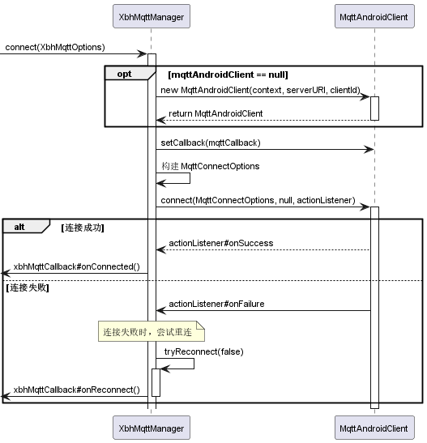
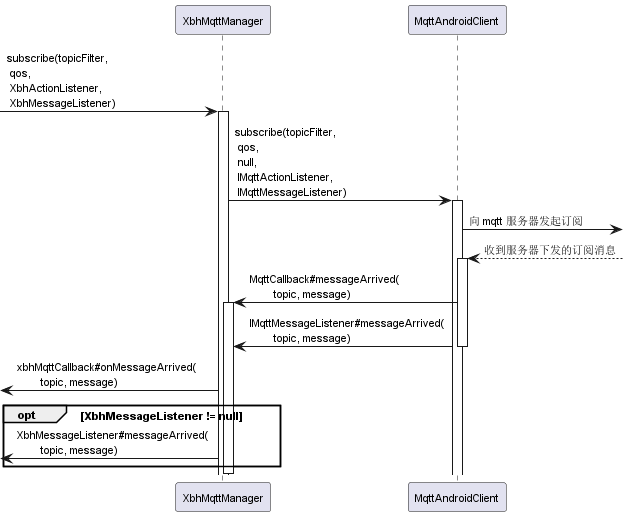

## 1. 快速上手

### 1.1 添加依赖

> `AGP 8.0` 以下版本在根项目的 `build.gradle` 中配置仓库地址

```groovy:no-line-numbers
/* settings.gradle */
pluginManagement {
    repositories {
        maven{
            allowInsecureProtocol(true)
            credentials{
                username'mobile'
                password'mobile'
            }
            url'http://192.168.21.214:8082/repository/maven-releases/'
        }
    }
}

dependencyResolutionManagement {
    repositoriesMode.set(RepositoriesMode.FAIL_ON_PROJECT_REPOS)
    repositories {
        maven{
            allowInsecureProtocol(true)
            credentials{
                username'mobile'
                password'mobile'
            }
            url'http://192.168.21.214:8082/repository/maven-releases/'
        }
    }
}
```

**配置依赖模块**

```groovy:no-line-numbers
/* Module 的 build.gradle */
dependencies {
    implementation 'com.xbh.ability:mqtt:1.0.0-beta-4'
}
```

### 1.2 建立连接

```kotlin:no-line-numbers
private fun startConnect() {
    val options = XbhMqttOptions.Builder()
        // 包含 协议、主机名、端口号 的 URI 地址，用于连接 mqtt 服务器
        .setServerURI("serverURI") 
        // clientId 客户端的 ID，服务端通过此 ID 唯一标识与之连接的客户端
        .setClientId("clientId") 
        // 用于连接服务器的用户名
        .setUserName("userName")
        // 用于连接服务器的密码
        .setPassword("password".toCharArray())
        // 设置连接 mqtt 服务器的超时时间（s）。如果设置为 0，表示客户端会一直等待下去，直到连接成功或失败
        .setConnectionTimeout(10)
        // 设置心跳包发送间隔（s）。
        // 在此间隔时间内，如果客户端和服务端之间没有消息的发送或接收，那么客户端就会发送一个 ping 消息（心跳消息），以保持连接。
        // 如果间隔设置为 0，就不会发送心跳消息。
        .setKeepAliveInterval(20)
        // true 表示清楚缓存，此时，当与服务端重连后，重连前未完成发布的消息可能无法按照消息发布的服务质量（QOS）继续发布
        .setCleanSession(true) 
        // 是否允许重连，默认 true 允许
        .setAllowReconnect(true)
        // 丢失连接或连接失败后，延迟 reconnectDelay 秒进行第一次重连
        .setReconnectInitDelay(3)
        // 从第 2 次重连开始，相较于前一次重连所额外增加的延迟时间（s），即：
        // 第 1 次重连的延迟时间 reconnectTime = reconnectDelay
        // 第 2 次重连的延迟时间 reconnectTime += reconnectInterval
        // 第 3 次重连的延迟时间 reconnectTime += reconnectInterval
        // ...
        // 直到重连延迟时间 reconnectTime > reconnectMaxDelay 时，后续重连的延迟时间都为 reconnectMaxDelay。
        .setReconnectExtraDelay(3)
        // 最大允许的重连延迟时间（s），即从上一次重连完成，到下一次重连开始，中间的间距时间不超过 reconnectMaxDelay 秒
        .setReconnectMaxDelay(30)
        // 监听如下事件：
        // 1. 客户端收到的新消息
        // 2. 失去与服务端的连接
        // 3. 完成了一个消息的发布
        // 4. 连接成功
        // 5. 正在重连
        .setMqttCallback(xbhMqttCallback)
        .build()

    XbhMqttManager.getInstance().connect(options)
}
```

### 1.3 订阅消息

```java:no-line-numbers
String topicFilter = "/mqtt-lango/clientId/requests/#";
int qos = 2;
/* 当连接建立成功后（回调了 XbhMqttCallback#onConnected），才可以订阅事件 */
XbhMqttManager.getInstance().subscribe(topicFilter, qos, actionListener, messageListener);
```

通过该接口，客户端可以订阅匹配主题 `topicFilter` 的消息。

```:no-line-numbers
成功订阅时回调 actionListener#onSuccess
订阅失败时回调 actionListener#onFailure

当前订阅的主题所对应的消息，
可以通过 XbhMqttCallback#onMessageArrived 方法接收到
也可以通过 messageListener#messageArrived 方法接收到
```

当 `XbhMqttOptions#cleanSession` 为 `true` 时：

```:no-line-numbers
订阅的消息将在 
    1. 断开服务器连接
    2. 调用 XbhMqttManager#unsubscribe(String, XbhActionListener)
后取消订阅
```

当 `XbhMqttOptions#cleanSession` 为 `false` 时：

```:no-line-numbers
订阅的消息只会在 XbhMqttManager#unsubscribe(String, XbhActionListener) 后取消订阅。
此时，即使服务器断开了，当重连服务器后，只要客户端 ID (XbhMqttOptions#clientId) 相同，未接收到的消息也还是会下发给客户端。
除非重连接时，cleanSession 又设置为 true 了。
```

`topicFilter` 需要订阅的主题，可以使用通配符 "`#`" 和 "`+`"。主题可以用 "`/`" 进行分层

```:no-line-numbers
a/b/c 唯一匹配主题 a/b/c
a/b/# 匹配以 a/b/开头的主题，如 a/b, a/b/c, a/b/d, a/b/c/d，即 “#” 匹配 0层 或 多层 任意主题
a/b/+ 匹配以 a/b/ 开头的三层主题，如 a/b/c, a/b/d，即 "+" 匹配任意一层主题
"#" 必须放在最后，"+" 则可以放在中间位置，匹配中间任意一层主题，如 a/+/c 匹配 a/b/c, a/bb/c
```

`QoS` 表示消息发布时的服务质量（`Quality of Service`）

```:no-line-numbers
MQTT 设计了 3 个 QoS 等级。
    QoS 0：消息最多传递一次，如果当时客户端不可用，则会丢失该消息。
           即：发布者发送一条消息之后，就不再关心它有没有发送到对方，也不设置任何重发机制。
    QoS 1：消息传递至少 1 次。发布者发送消息之后等待接收者的 ACK，如果没收到 ACK 则重新发送消息。
           这种模式能保证消息至少能到达一次，但无法保证消息重复。
    QoS 2：消息仅传送一次。保证消息到达对方并且严格只到达一次

MQTT 发布与订阅操作中的 QoS 代表了不同的含义，
发布时的 QoS 表示消息发送到服务端时使用的 QoS，
订阅时的 QoS 表示服务端向自己转发消息时可以使用的最大 QoS。
    - 当客户端 A 的发布 QoS 大于客户端 B 的订阅 QoS 时，服务端向客户端 B 转发消息时使用的 QoS 为客户端 B 的订阅 QoS。
    - 当客户端 A 的发布 QoS 小于客户端 B 的订阅 QoS 时，服务端向客户端 B 转发消息时使用的 QoS 为客户端 A 的发布 QoS。
```


### 1.4 关闭连接

```java:no-line-numbers
XbhMqttManager.getInstance().close()
```

## 2. 组件架构

**连接 `mqtt` 服务器的时序图如下所示：**



> 执行 `tryReconnect` 方法进行重连的场景如下：
> 1. 主动发起连接请求时，收到了连接失败的回调；
> 2. 已连接的情况下，收到了丢失与服务器连接的回调；
> 3. 网络断开后，再次连接上网络时。
>
> 如果不想继续进行重连，可以调用 `XbhMqttManager#stopReconnect` 停止重连。

----

**发起消息订阅的时序图如下所示：**



> 可以通过 `XbhMqttCallback#onMessageArrived(topic, message)` 回调接收到所有订阅的消息；
> 
> 也可以在调用 `subscribe(topicFilter, qos, XbhActionListener, XbhMessageListener)` 方法时，通过 `XbhMessageListener#onMessageArrived(topic, message)` 回调接收到当前订阅的消息。