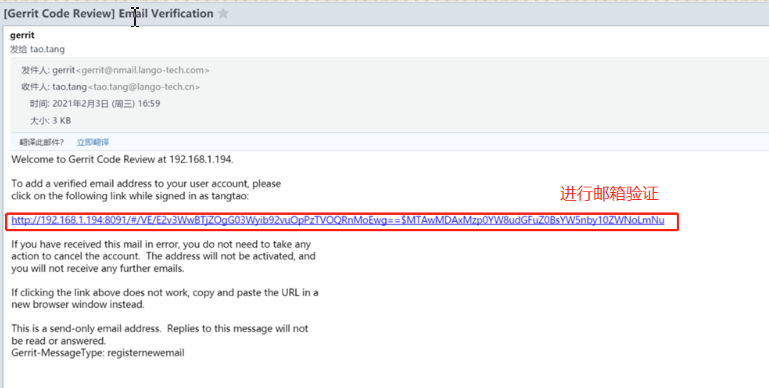
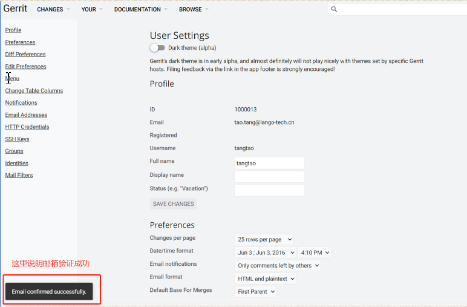
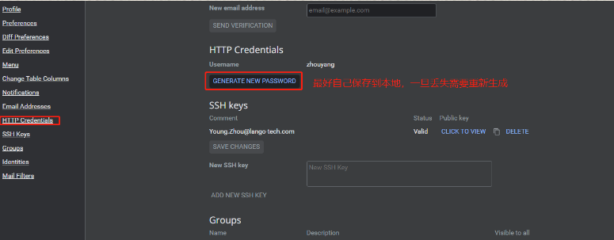

## 1. 软件介绍

### 1.1 代码管理 —— `Gerrit`

**准备工作**

1. 安装 `Git-2.16.1.2-64-bit` 版本的 `Git` 客户端
2. 找管理员（邓嘉俊）申请 `Gerrit` 的账号/密码
3. 登录 [`Gerrit` 网页端](http://192.168.1.194:8092/)
4. 在 `Gerrit` 网页端中进行邮箱验证

    ```:no-line-numbers
    邮箱的账号/密码找谭俊英申请。验证步骤如下图所示：
    ```

    

    

    

    > 注意：不要直接点击邮箱验证链接，如果链接中的端口号为 `8091`，那么需要手动改成 `8092` 后再进行验证

    

5. 在 `Gerrit` 网页端中生成 `Token`

    ```:no-line-numbers
    当我们在本地访问 Gerrit 仓库时（如 clone 仓库），会用到这个 Token（相当于密码）。
    Token 的生成方式如下图所示：
    ```

    


**克隆仓库代码**

依次点击 `Gerrit` 网页端顶部导航栏：`BROWSE -> Respositories` 进入仓库列表。

> 如果仓库列表中除了 `testing` 和 `AllUser` 外无其他仓库，找何仲春申请代码仓库权限。

下面以 Launcher3.0 为例介绍仓库的克隆步骤

```:no-line-numbers

```

    
### 1.2 Apk 管理 —— `SVN`

### 1.3 串口调试终端 —— `Xshell`

### 1.4 需求 / `BUG` 管理 —— `ones`

### 1.5 网络环境 —— 朗国电子助手 & 讯软 `DES` 客户端

### 1.6 ADB 调试终端 —— `Cmder`

## 2. 项目介绍

### 2.1 板卡型号 & 项目分支

### 2.2 客制化 & 项目渠道

### 2.3 如何刷固件

### 2.4 `Apk` 的编译安装

## 3. 注意事项