```:no-line-numbers
Android 的 GUI 系统是基于 OpenGL/EGL 来实现的
```

## 1 `OpenGL ES` 与 `EGL`

如下图所示，描述了 `SurfaceFlinger` 与 `OpenGL ES` 等模块的关系。

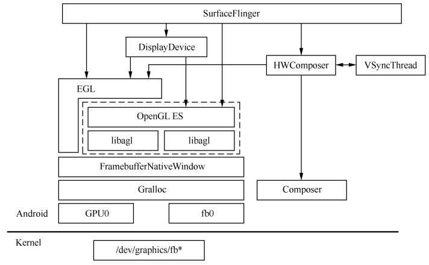

现在由 “底层到上层” 的顺序来逐步分析图中阐述的架构：

```:no-line-numbers
（1）Linux 内核提供了统一的 framebuffer 显示驱动。
	设备节点 /dev/graphics/fb* 或者 /dev/fb*，其中 fb0 表示第一个 Monitor，当前系统实现中只用到了一个显示屏。

（2）Android 的 HAL 层提供了 Gralloc，包括 fb 和 gralloc 两个设备。
    前者负责打开内核中的 framebuffer、初始化配置，并提供了 post、setSwapInterval 等操作接口；
    后者则管理帧缓冲区的分配和释放。
    这就意味着上层元素只能通过 Gralloc 来间接访问帧缓冲区，从而保证了系统对 framebuffer 的有序使用和统一管理。

    另外，HAL层的另一重要模块是 “Composer” —— 如其名所示，它为厂商自定制“UI合成”提供了接口。
    Composer 的直接使用者是 SurfaceFlinger 中的 HWComposer（有两个 HWComposer，后面我们会详细讲解），
    后者除了管理 Composer 的 HAL 模块外，还负责 VSync 信号的产生和控制。
    VSync则是 “Project Butter” 工程中加入的一种同步机制，它既可以由硬件产生，也可以通过软件来模拟（VsyncThread），
    后续有专门的小节进行介绍。

（3）由于 OpenGL ES 是一个通用的函数库，在不同的平台系统上需要被 “本地化”，
    即把它与具体平台中的窗口系统建立起关联，这样才能保证正常工作。
    从 FramebufferNativeWindow 这个名称就能判断出来，它就是负责 OpenGL ES 在 Android 平台上本地化的中介之一。
    后面我们还会看到 Android 应用程序中所使用的另一个“本地窗口”。

    为 OpenGL ES 配置本地窗口的是 EGL。

（4）OpenG L或者 OpenGL ES 更多的只是一个接口协议，具体实现既可以采用软件，也可以依托于硬件。
    既然有多种实现的可能，那么 OpenGL ES 在动态运行时是如何取舍的呢？这也是 EGL 的作用之一。
    EGL 会去读取 egl.cfg 这个配置文件，然后根据用户的设定来动态加载 libagl（软件实现）或者 libhgl（硬件实现）。

（5）SurfaceFlinger 中持有一个成员数组 mDisplays 来描述系统中支持的各种 “显示设备”。
    具体有哪些 Display 是由 SurfaceFlinger 在 readyToRun 中判断并赋值的；
    并且 DisplayDevice 在初始化时还将调用 eglGetDisplay、eglCreateWindowSurface 等接口，
    并利用 EGL来 完成对 OpenGL ES 环境的搭建。

（6）很多模块都可以调用 OpenGL ES 提供的 API，包括 SurfaceFlinger、DisplayDevice 等模块。
  （这些 API 接口以 “gl” 为前缀，如 glViewport、glClear、glMatrixMode、glLoadIdentity 等），

（7）与 OpenGL ES 相关的模块可以分为如下几类。
    配置类：即帮助 OpenGL ES 完成配置的，包括 EGL、DisplayHardware 都可以归为这一类。
    依赖类：也就是 OpenGL ES 要正常运行起来所依赖的 “本地化” 的东西，上图中是指 FramebufferNativeWindow。
    使用类：使用者也可能是配置者，如 DisplayDevice 既扮演了构建 OpenGL ES 环境的角色，同时也是它的用户。
    
```

## 2 `Android` 的硬件接口 —— `HAL`

对于 `Android` 中很多子系统来说（如显示系统、音频系统等），`HAL` 都是必不可少的组成部分 —— `HAL` 是这些子系统与 `Linux Kernel` 驱动之间通信的统一接口。

对于 `Gralloc` 来说，它的硬件接口定义如下：

```cpp:no-line-numbers
/* hardware/libhardware/include/hardware/gralloc.h */
/* 
 * Every hardware module must have a data structure named HAL_MODULE_INFO_SYM
 * and the fields of this data structure must begin with hw_module_t
 * followed by module specific information.
 */
typedef struct gralloc_module_t {
    struct hw_module_t common;  
    int (*registerBuffer)(struct gralloc_module_t const* module, buffer_handle_t handle);
    int (*unregisterBuffer)(struct gralloc_module_t const* module, buffer_handle_t handle);   

    int (*lock)(struct gralloc_module_t const* module, buffer_handle_t handle, 
                  int usage, int l, int t, int w, int h,void** vaddr);

    int (*unlock)(struct gralloc_module_t const* module,buffer_handle_t handle);
    int (*perform)(struct gralloc_module_t const* module,int operation, ... );

    int (*lock_ycbcr)(struct gralloc_module_t const* module,buffer_handle_t handle,
					int usage, int l, int t, int w, int h,struct android_ycbcr *ycbcr);

    /* reserved for future use */
    void* reserved_proc[6];

} gralloc_module_t;
```

> 从注释中可以看出：
> 1. 首先，每一个硬件模块都必须有一个名称为 `HAL_MODULE_INFO_SYM` 的变量。
> 2. 其次，此变量的数据结构要以 `hw_module_t` 开头。

## 3 `Gralloc` 与 `Framebuffer`

`Framebuffer` 是内核系统提供的图形硬件的抽象描述。之所以称为 `buffer`，是因为它也占用了系统存储空间的一部分，是一块包含屏幕显示信息的缓冲区。
由此可见，在 “一切都是文件” 的 `Linux` 系统中，`Framebuffer` 被看成了终端显示设备的 “化身”。

在 `Android` 系统中，`Framebuffer` 提供的设备文件节点是 `/dev/graphics/fb*`。
因为理论上支持多个屏幕显示，所以 `fb` 按数字序号进行排列，即 `fb0`、`fb1` 等。其中第一个 `fb0` 是主显示屏幕，必须存在。

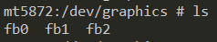

`Android` 的各子系统通常不会直接使用内核驱动，而是由 `HAL` 层来间接引用底层架构。显示系统中也同样如此 —— 它借助于 `HAL` 层来操作帧缓冲区，而完成这一中介任务的就是 `Gralloc`。

### 3.1 `Gralloc` 模块的加载

`Gralloc` 对应的模块是由 `FramebufferNativeWindow` 在构造函数中加载的。即：

```cpp:no-line-numbers
hw_get_module(GRALLOC_HARDWARE_MODULE_ID, &module);
```

> 函数 `hw_get_module` 是上层使用者加载 `HAL` 库的入口，这意味着不论是哪个硬件厂商提供的 `HAL` 库（比如 `Gralloc` 库），我们都只需要通过这个函数来加载它们。

可以看到，针对 `Gralloc` 传入的硬件模块 `ID` 名为：

```cpp:no-line-numbers
#define GRALLOC_HARDWARE_MODULE_ID "gralloc"
```

按照 `hw_get_module` 的做法，它会在如下路径中查找与 `ID` 值匹配的库。

```cpp:no-line-numbers
#define HAL_LIBRARY_PATH1 "/system/lib/hw"
#define HAL_LIBRARY_PATH2 "/vendor/lib/hw"
```

`lib` 库名有如下几种形式：

```:no-line-numbers
gralloc.[ro.hardware].so 
gralloc.[ro.product.board].so 
gralloc.[ro.board.platform].so 
gralloc.[ro.arch].so
```

或者当上述系统属性组成的文件名都不存在时，就使用默认的：

```:no-line-numbers
gralloc.default.so
```

> 这个 `default` 库是 `Android` 原生态的实现，源码位置在 `hardware/libhardware/modules/gralloc/` 中，它由 `gralloc.cpp`、`framebuffer.cpp` 和 `mapper.cpp` 三个主要源文件编译生成。

### 3.2 `Gralloc` 提供的接口

```cpp:no-line-numbers
/* hardware/libhardware/include/hardware/gralloc.h */
/* 
 * Every hardware module must have a data structure named HAL_MODULE_INFO_SYM
 * and the fields of this data structure must begin with hw_module_t
 * followed by module specific information.
 */
typedef struct gralloc_module_t {
    struct hw_module_t common;  
    int (*registerBuffer)(struct gralloc_module_t const* module, buffer_handle_t handle);
    int (*unregisterBuffer)(struct gralloc_module_t const* module, buffer_handle_t handle);   

    int (*lock)(struct gralloc_module_t const* module, buffer_handle_t handle, 
                  int usage, int l, int t, int w, int h,void** vaddr);

    int (*unlock)(struct gralloc_module_t const* module,buffer_handle_t handle);
    int (*perform)(struct gralloc_module_t const* module,int operation, ... );

    int (*lock_ycbcr)(struct gralloc_module_t const* module,buffer_handle_t handle,
					int usage, int l, int t, int w, int h,struct android_ycbcr *ycbcr);

    /* reserved for future use */
    void* reserved_proc[6];

} gralloc_module_t;
```

```cpp:no-line-numbers
/*hardware/libhardware/include/hardware/Hardware.h*/
typedef struct hw_module_t {
    …
    struct hw_module_methods_t* methods; //一个 HAL 库必须提供的方法
    …
} hw_module_t;


typedef struct hw_module_methods_t {
    int (*open)(const struct hw_module_t* module, const char* id, struct hw_device_t** device);
} hw_module_methods_t;
```

以上给出了三个结构体的定义：`gralloc_module_t`、`hw_module_t`、`hw_module_methods_t`。注意：

```:no-line-numbers
硬件接口的抽象涉及了继承关系 —— “抽象的硬件” 是父类，而 “具体的硬件” 则是子类。
这在 C++ 中很容易实现，但是 HAL 多数是由 C 语言实现的，怎么办呢？
其实很简单，只要让子类数据结构的第一个成员变量是父类结构即可。

类似于 Gralloc 的硬件接口定义（gralloc_module_t），
任何硬件设备的 HAL 库都必须实现 hw_module_methods_t。目前 hw_module_methods_t 结构体中只有一个函数指针变量，即 open。
当上层使用者调用 hw_get_module 时，系统首先在指定目录中查找并加载正确的 HAL 库，然后通过 open 方法来打开指定的设备。
```

在 `Gralloc` 中，`open` 接口可以帮助上层使用者打开两种设备。分别是：

```cpp:no-line-numbers
#define GRALLOC_HARDWARE_FB0 "fb0"   // fb0  就是我们前面所说的 “主屏幕”
#define GRALLOC_HARDWARE_GPU0 "gpu0" // gpu0 负责图形缓冲区的分配和释放
```

这两个设备分别由 `FramebufferNativeWindow` 中的 `fbDev` 和 `grDev` 成员变量来管理：

```cpp:no-line-numbers
/*frameworks/native/libs/ui/FramebufferNativeWindow.cpp*/
FramebufferNativeWindow::FramebufferNativeWindow(): BASE(), fbDev(0), grDev(0), mUpdateOnDemand(false)
{
    ...
    err = framebuffer_open(module, &fbDev); // 打开 fb 设备（即 framebuffer 设备）
    err = gralloc_open(module, &grDev); // 打开 gralloc 设备
```

> 上述代码段中的两个 `xxx_open` 函数由 `hardware/libhardware/include/hardware` 目录下的 `fb.h` 和` gralloc.h` 头文件提供，用于打开 `fb` 及 `gralloc` 设备。
>
> 注意：
> 1. `FramebufferNativeWindow.cpp` 在高版本的源代码中已经不存在了，但打开 `fb` 和 `gralloc` 设备还是会调用 `framebuffer_open` 和 `gralloc_open` 这两个函数。
> 2. `framebuffer_open` 和 `gralloc_open` 最终调用的肯定还是 `hw_module_methods_t` 中的 `open` 方法，只是函数参数有所差异：
>	```:no-line-numbers
>	fb      对应的设备名为 GRALLOC_HARDWARE_FB0；
>	gralloc 对应的设备名为 GRALLOC_HARDWARE_GPU0。
>	```
    
`Android` 原生态的 `Gralloc` 实现在 hardware/libhardware/modules/gralloc 中，由 `gralloc.cpp`、`framebuffer.cpp` 和 `mapper.cpp` 三个主要源文件编译生成。

原生态的 `Gralloc` 实现中，`open` 方法接口对应的是 `gralloc_device_open@Gralloc.cpp`。这个函数会根据设备名来判断是打开 `fb` 还是 `gralloc` 设备。
    
```cpp:no-line-numbers
/*hardware/libhardware/modules/gralloc/gralloc.cpp*/
int gralloc_device_open(const hw_module_t* module, const char* name, hw_device_t** device)
{
    int status = -EINVAL;
    if (!strcmp(name, GRALLOC_HARDWARE_GPU0)) { // 打开 gralloc 设备
        ...
    } else {
        status = fb_device_open(module, name, device); // 否则就是 fb 设备
    }
    return status;
}
```

#### 3.2.1 `fb` 设备的打开过程

**先来大概看看 `fb` 设备（即 `framebuffer` 设备）的打开过程：**

```cpp:no-line-numbers
/*hardware/libhardware/modules/gralloc/framebuffer.cpp*/
int fb_device_open(hw_module_t const* module, const char* name, hw_device_t** device)
{
    int status = -EINVAL;
    if (!strcmp(name, GRALLOC_HARDWARE_FB0)) { // 设备名是否正确
       fb_context_t *dev = (fb_context_t*)malloc(sizeof(*dev)); /* 分配 hw_device_t 空间，这是一个“壳” */
       memset(dev, 0, sizeof(*dev)); // 初始化
       ...
       dev->device.common.close = fb_close; // 这几个接口是fb设备的核心
       dev->device.setSwapInterval = fb_setSwapInterval;
       dev->device.post = fb_post;
       ...
       private_module_t* m = (private_module_t*)module;
       status = mapFrameBuffer(m); // 内存映射，以及参数配置
       if (status >= 0) {
           ...
           *device = &dev->device.common; // “壳” 和 “核心” 的关系
       }
    }
    return status;
}
```

```cpp:no-line-numbers
/* hardware/libhardware/modules/gralloc/framebuffer.cpp */
struct fb_context_t {
    framebuffer_device_t  device;
};
```

```cpp:no-line-numbers
/* hardware/libhardware/include/hardware/fb.h */
typedef struct framebuffer_device_t {
    struct hw_device_t common;

    const uint32_t  flags;

    const uint32_t  width;
    const uint32_t  height;

    const int       stride;

    const int       format;

    const float     xdpi;
    const float     ydpi;

    const float     fps;

    const int       minSwapInterval;

    const int       maxSwapInterval;

    const int       numFramebuffers;

    int reserved[7];
    int (*setSwapInterval)(struct framebuffer_device_t* window, int interval);

    int (*setUpdateRect)(struct framebuffer_device_t* window, int left, int top, int width, int height);

    int (*post)(struct framebuffer_device_t* dev, buffer_handle_t buffer);

    int (*compositionComplete)(struct framebuffer_device_t* dev);

    void (*dump)(struct framebuffer_device_t* dev, char *buff, int buff_len);

    int (*enableScreen)(struct framebuffer_device_t* dev, int enable);

    void* reserved_proc[6];

} framebuffer_device_t;
```

数据类型 `fb_context_t` 里的唯一成员就是 `framebuffer_device_t`，这是对 `fb` 设备的统一描述。

一个标准的 `fb` 设备通常要提供如下接口实现：

```cpp:no-line-numbers
/* 将 buffer 数据 post 到显示屏上。要求 buffer 必须与屏幕尺寸一致，
	并且没有被locked。这样 buffer 内容将在下一次 VSYNC 中被显示出来。*/
int (*post)(struct framebuffer_device_t* dev, buffer_handle_t buffer);

// 设置两个缓冲区交换的时间间隔。
int (*setSwapInterval)(struct framebuffer_device_t* window, int interval);

// 设置刷新区域，需要 framebuffer 驱动支持 “update-on-demand”。也就是说，在这个区域外的数据很可能被认为无效。
int (*setUpdateRect)(struct framebuffer_device_t* window, int left, int top, int width, int height);
```

我们再来解释下 `framebuffer_device_t` 中一些重要的成员变量，如下表所示。


<table>
  <tr align="left">
    <th>变量</th>
    <th>描述</th>
  </tr>
  <tr>
    <td>flags</td>
    <td>标志位，指示 framebuffer 的属性配置</td>
  </tr>
  <tr>
    <td>width、height</td>
    <td>framebuffer 的宽和高,以像素为单位</td>
  </tr>
  <tr>
    <td>format</td>
    <td>
		framebuffer 的像素格式，比如：
		<ul>
		<li>HAL_PIXEL_FORMAT_RGBA_88888</li>
		<li>HAL_PIXEL_FORMAT_RGIBX_8888</li>
		<li>HAL_PIXEL_FORMAT_RGB_888</li>
		<li>HAL_PIXEL_FORMAT_RGB_565 等</li>
		</ul>
	</td>
  </tr>
  <tr>
    <td>xdpi、ydpi</td>
    <td>x 和 y 轴的密度（dot per inch）</td>
  </tr>
  <tr>
    <td>xdpi、ydpi</td>
    <td>x 和 y 轴的密度（dot per inch）</td>
  </tr>
  <tr>
    <td>fps</td>
    <td>屏幕的每秒刷新频率。假如无法从设备获取这个值，Android 系统会默认设置为 60Hz</td>
  </tr>
  <tr>
    <td>minSwapInterval、maxSwapInterval</td>
    <td>该 framebuffer 支持的最小和最大的缓冲交换时间</td>
  </tr>
</table>

系统打开 `Kernel` 层的 `fb` 设备以及对 `fb` 进行配置的操作是在 `mapFrameBuffer()` 中完成的。这个函数首先尝试打开如下路径中的 `fb` 设备：
> `mapFrameBuffer` 函数内部调用 `open` 接口打开 `fb` 设备，权限为 `O_RDWR`。

```:no-line-numbers
"/dev/graphics/fb%u" 或者 "/dev/fb%u"
```

> 其中 `%u` 表示不同的数字，代表不同的屏幕。

```:no-line-numbers
成功打开 fb 设备后，我们可以通过：

	ioctl(fd, FBIOGET_FSCREENINFO, &finfo); 
	ioctl(fd, FBIOGET_VSCREENINFO, &info)

来得到显示屏的一系列参数，同时通过：

	ioctl(fd, FBIOPUT_VSCREENINFO, &info)

来对底层 fb 设备进行配置。
```

另外，函数 `mapFrameBuffer` 的另一重要任务就是为 `fb` 设备做内存映射。主要源码语句如下：

```cpp:no-line-numbers
/* hardware/libhardware/modules/gralloc/framebuffer.cpp */
/* mapFrameBufferLocked 函数中 */
/*
映射地址保存在 module->framebuffer->base。
变量 module 对应的是前面 hw_get_module(GRALLOC_HARDWARE_MODULE_ID, &module) 得到的 hw_module_t
（hw_module_t 被强制类型转化为 private_module_t）。
*/
void* vaddr = mmap(0, fbSize, PROT_READ|PROT_WRITE, MAP_SHARED, fd, 0);    
module->framebuffer->base = intptr_t(vaddr);
memset(vaddr, 0, fbSize);
```

#### 3.2.2 `gralloc` 设备的打开过程

**接下来再看看系统打开 `gralloc` 设备的过程，它相对于 `fb` 设备简单些。如下所示：**

```cpp:no-line-numbers
 /*hardware/libhardware/modules/gralloc/gralloc.cpp*/
int gralloc_device_open(const hw_module_t* module, const char* name, hw_device_t** device)
{
    int status = -EINVAL;
    if (!strcmp(name, GRALLOC_HARDWARE_GPU0)) {
        gralloc_context_t *dev; // 做法和 fb 类似
        dev = (gralloc_context_t*)malloc(sizeof(*dev)); // 分配空间
        /* initialize our state here */
        memset(dev, 0, sizeof(*dev));
        ...
        dev->device.alloc = gralloc_alloc; // 从提供的接口来看，gralloc 主要负责 “分配和释放” 操作
        dev->device.free = gralloc_free;
        ...
}
```

> 上述代码段中与 `fb` 相似的部分我们就不多做介绍了。

因为 `gralloc` 担负着图形缓冲区的分配与释放，所以它提供的两个最重要的接口是 `alloc` 和 `free`。这里暂时先不深入分析，后续会有讲解。

## 4 `Android` 中的本地窗口

在 [`OpenGL ES` 与 `EGL`](#_9-1-opengl-es-与-egl) 小节中提到了 “本地窗口”（`Native Window`）这一概念。

本地窗口是 `OpenGL` 能否兼容多种系统（如 `Windows`，`Android`）的关键。

那么对于 `Android` 系统来说，它是如何将 `OpenGL ES` 本地化的呢？或者说，它提供了什么样的本地窗口？

根据整个 `Android` 系统的 `GUI` 设计理念，我们不难猜想到至少需要两种本地窗口。

```:no-line-numbers
面向管理者（SurfaceFlinger）
	既然 SurfaceFlinger 扮演了系统中所有 UI 界面的管理者，那么它无可厚非需要直接或间接地持有 “本地窗口”。
	我们知道，这个窗口就是 FramebufferNativeWindow。

面向应用程序
	这类本地窗口是 Surface。
```

为什么需要两种本地窗口呢？

```:no-line-numbers
因为一个系统设备中显然只会有一个帧缓冲区 framebuffer，但一个系统设备中可以同时运行多个 UI 程序。

为了能够让多个 UI 程序有序地进行显示，我们需要为每个 UI 程序单独地分配本地窗口，
为 UI 程序单独分配本地窗口其实就是单独分配一个内存缓存区来保存显示数据。

而 SurfaceFlinger 所持有的本地窗口就是能直接显示在屏幕上的帧缓冲区 framebuffer。
SurfaceFlinger 作为管理者，会收集所有 UI 程序的内存缓冲区中的显示数据，
并进行统一的图像混合操作，然后输出到帧缓冲区 framebuffer 中。
```

### 4.1 `FramebufferNativeWindow`

EGL 需要通过本地窗口来为` OpenGL/OpenGL ES` 创造环境。其函数原型如下：

```cpp:no-line-numbers
EGLSurface eglCreateWindowSurface(EGLDisplay dpy, EGLConfig config, NativeWindowType window, const EGLint *attrib_list);
```

从函数原型来看，不论是哪一类本地窗口，都必须要与 NativeWindowType 保持一致，否则就无法正常使用 EGL 了。

先从数据类型的定义来看看这个 window 参数有什么特别之处：

```cpp:no-line-numbers
/*frameworks/native/opengl/include/egl/Eglplatform.h*/
typedef EGLNativeWindowType NativeWindowType; // NativeWindowType 其实就是 EGLNativeWindowType
...

#if defined(_WIN32) || defined(__VC32__) && !defined(__CYGWIN__) && !defined(__SCITECH_SNAP__)
...
typedef HWND  EGLNativeWindowType; /* Win32 和 WinCE系统下的定义 */

#elif defined(__WINSCW__) || defined(__SYMBIAN32__)  
...
typedef void *EGLNativeWindowType; /* Symbian系统 */

#elif defined(__ANDROID__) || defined(ANDROID)
struct ANativeWindow;
...
typedef struct ANativeWindow* EGLNativeWindowType; /* Android系统 */
...

#elif defined(__unix__)
...
typedef Window   EGLNativeWindowType; /* UNIX系统 */
#else
#error "Platform not recognized"
#endif
```

以上代码中，不同的操作系统平台下 `EGLNativeWindowType` 所对应的具体数据类型如下表所示：

|**操作系统**|**数据类型**|
|:-|:-|
|Win32、WinCE|HWND，即句柄|
|Symbian|Void*|
|Android`|ANativeWindow*|
|UNIX|Window|
|其他|暂时不支持|

`ANativeWindow` 的定义在 `window.h` 头文件中：

```cpp:no-line-numbers
/*system/core/include/system/window.h*/
struct ANativeWindow
{
    ...
    const uint32_t flags; // 与 Surface 或 updater 有关的属性
    const int minSwapInterval; // 所支持的最小交换间隔时间
    const int maxSwapInterval; // 所支持的最大交换间隔时间
    const float xdpi; // 水平方向的密度，以 dpi 为单位
    const float ydpi; // 垂直方向的密度，以 dpi 为单位
    intptr_t oem[4];//为OEM定制驱动所保留的空间
    int (*setSwapInterval)(struct ANativeWindow* window, int interval);
    int (*dequeueBuffer)(struct ANativeWindow* window, struct ANativeWindowBuffer** buffer, int* fenceFd);
    int (*queueBuffer)(struct ANativeWindow* window, struct ANativeWindowBuffer* buffer, int fenceFd);
    int (*cancelBuffer)(struct ANativeWindow* window, struct ANativeWindowBuffer* buffer, int fenceFd);
    int (*query)(const struct ANativeWindow* window,int what, int* value);
    int (*perform)(struct ANativeWindow* window,int operation, ... );
    void* reserved_proc[2];
};
```

`ANativeWindow` 结构体中几个重要成员函数如下表所示：

<table>
  <tr align="left">
    <th>Member Function</th>
    <th>Description</th>
  </tr>
  <tr>
    <td>setSwapInterval</td>
    <td>设置交换间隔时间</td>
  </tr>
  <tr>
    <td>dequeueBuffer</td>
    <td>EGL 通过这个接口来申请一个 buffer。从前面我们所举的例子来说，两个本地窗口所提供的 buffer 分别来自于帧缓冲区和内存空间。<br/>
	单词 dequeue 的字面意思是出队列。这从侧面告诉我们，一个 Window 所包含的 buffer 很可能不止一份</td>
  </tr>
  <tr>
    <td>queueBuffer</td>
    <td>当 EGL 对一块 buffer 渲染完成后，它调用这个接口来 unlock 和 post buffer</td>
  </tr>
  <tr>
    <td>cancelBuffer</td>
    <td>这个接口可以用来取消一个已经 dequeued 的 buffer，但要特别注意同步的问题</td>
  </tr>
  <tr>
    <td>query</td>
    <td>用于向本地窗口咨询相关信息</td>
  </tr>
  <tr>
    <td>perform</td>
    <td>
		用于执行本地窗口支持的各种操作，比如:
		<ul>
			<li>NATIVE_WINDOW_SET_USAGE</li>
			<li>NATIVE_WINDOW_SET_CROP</li>
			<li>NATIVE_WINDOW_SET_BUFFER_COUNT</li>
			<li>NATIVE_WINDOW_SET_BUFFERS_TRANSFORM</li>
			<li>NATIVE_WINDOW_SET_BUFFERS_TIMESTAMP 等</li>
		</ul>
	</td>
  </tr>
</table>


从上面对 `ANativeWindow` 的描述可以看出，它更像一份 “协议”，规定了一个本地窗口的形态和功能。这对于支持多种本地窗口的系统是必需的，因为只有这样我们才能针对某种特定的平台窗口来填充具体的实现。

这个小节中我们需要分析 `FramebufferNativeWindow` 是如何履行这份 “协议” 的。

`FramebufferNativeWindow` 本身代码并不多，下面分别选取其构造函数及 `dequeue` 函数来分析。其他部分的实现都类似，大家可以参考阅读。

> 注意：
> 
> 高版本中，`FramebufferNativeWindow` 已被移除，实现了 ANativeWindow 接口的子类只发现如下两个：
> 
> ```cpp:no-line-numbers
> frameworks/native/services/surfaceflinger/CompositionEngine/include/compositionengine/mock/NativeWindow.h
> frameworks/native/libs/gui/include/gui/Surface.h
> ```
> 高版本的差异再后续更新文档时再补充。

#### 4.1.1 构造函数中的初始化操作

根据 FramebufferNativeWindow 所完成的功能，可以大概推测出它的构造函数里应该至少完成如下初始化操作。

```:no-line-numbers
1. 加载 GRALLOC_HARDWARE_MODULE_ID 模块（即 Gralloc 模块），详细流程在 Gralloc 小节已经解释过了。
2. 分别打开 fb 和 gralloc 设备。我们在 Gralloc 小节也已经分析过，打开后的设备由全局变量 fbDev 和 grDev 管理。
3. 根据设备的属性来给 FramebufferNativeWindow 赋初值。
4. 根据 FramebufferNativeWindow 的实现来填充 ANativeWindow 中的 “协议”。
5. 其他一些必要的初始化。
```

下面从源码的角度来分析上述每个步骤具体是怎么实现的：

```cpp:no-line-numbers
/* frameworks/native/libs/ui/FramebufferNativeWindow.cpp */
FramebufferNativeWindow::FramebufferNativeWindow() : BASE(), fbDev(0), grDev(0), mUpdateOnDemand(false)
{
    hw_module_t const* module;
    if (hw_get_module(GRALLOC_HARDWARE_MODULE_ID, &module) == 0) { // 加载模块
		...
        int stride;
        int err;
        int i;
        err = framebuffer_open(module, &fbDev);
        err = gralloc_open(module, &grDev) ;// 分别打开 fb 和 gralloc
        /*上面这部分内容我们在前几个小节已经分析过了，不清楚的可以回头看一下*/
        ...
        if(fbDev->numFramebuffers >= MIN_NUM_FRAME_BUFFERS &&
            fbDev->numFramebuffers <= MAX_NUM_FRAME_BUFFERS){ // 根据fb设备属性获得buffer数
            mNumBuffers = fbDev->numFramebuffers;
        } else {
            mNumBuffers = MIN_NUM_FRAME_BUFFERS; // 否则就采用最少的 buffer 数值，即 2
        }
        mNumFreeBuffers = mNumBuffers; // 可用的 buffer 个数，初始时是所有 buffer 可用
        mBufferHead = mNumBuffers-1;
        ...
        for (i = 0; i < mNumBuffers; i++) // 给每个 buffer 初始化
        {
            buffers[i] = new NativeBuffer(fbDev->width, fbDev->height, fbDev->format, GRALLOC_USAGE _HW_FB);
        } / /NativeBuffer是什么？

        for (i = 0; i < mNumBuffers; i++) // 给每个 buffer 分配空间
        {
            err = grDev->alloc(grDev, fbDev->width, fbDev->height, fbDev->format, GRALLOC_USAGE_HW_FB, 
								&buffers[i]->handle, &buffers[i]->stride);
            ...
        }

        /* 为本地窗口赋属性值 */
        const_cast<uint32_t&>(ANativeWindow::flags) = fbDev->flags;
        const_cast<float&>(ANativeWindow::xdpi) = fbDev->xdpi;
        const_cast<float&>(ANativeWindow::ydpi) = fbDev->ydpi;
        const_cast<int&>(ANativeWindow::minSwapInterval) =fbDev->minSwapInterval;
        const_cast<int&>(ANativeWindow::maxSwapInterval) = fbDev->maxSwapInterval;
    } else {
        ALOGE("Couldn't get gralloc module");
    }

    /* 以下代码段开始履行窗口 “协议” */
    ANativeWindow::setSwapInterval = setSwapInterval;
    ANativeWindow::dequeueBuffer = dequeueBuffer;
    ANativeWindow::queueBuffer = queueBuffer;
    ANativeWindow::query = query;
    ANativeWindow::perform = perform;

    /* 下面这几个接口已经被废弃了，不过为了保持兼容性，暂时还是保留的 */
    ANativeWindow::dequeueBuffer_DEPRECATED = dequeueBuffer_DEPRECATED;
    ANativeWindow::lockBuffer_DEPRECATED = lockBuffer_DEPRECATED;
    ANativeWindow::queueBuffer_DEPRECATED = queueBuffer_DEPRECATED;
}
```

如上初始化代码中，我们重点关注 `FramebufferNativeWindow` 是如何分配 `buffer` 的。换句话说，其 `dequeue` 方法所获得的缓冲区是从何而来的。

```:no-line-numbers
成员变量 mNumBuffers 代表了 FramebufferNativeWindow 所管理的 buffer 总数。它取决于两个方面：
1. 首先从 fb 设备中取值，即 numFramebuffers；
2. 否则就默认定义为 MIN_NUM_FRAME_BUFFERS。

如下所示：
    #define MIN_NUM_FRAME_BUFFERS 2 
    #define MAX_NUM_FRAME_BUFFERS 3

可见 Android 系统认为最少的 buffer 数为 2，最大为 3。
```

有人可能会觉得奇怪，既然 `FramebufferNativeWindow` 对应的是真实的物理屏幕，那么为什么还需要两个 `buffer` 呢？

考虑只有一个 `buffer` 的情况：

```:no-line-numbers
这意味着绘制什么，屏幕上就要显示什么。
对于用户来说，将看到一个不断刷新的画面。通俗地讲，就是画面很 “卡”。
特别是对于图像刷新很频繁的场景（比如大型游戏），用户的体验就会更差。
```

那么，有什么解决的办法呢？

```:no-line-numbers
我们知道，出现这种现象的原因就是程序直接以屏幕为绘图板，把还没有准备就绪的图像直接呈现给了用户。换句话说，
如果可以等到整幅图像绘制完成以后再刷新到屏幕上，那么用户在任何时候看到的都是正确而完整的画面，问题也就解决了。
```

也就是说，一个 `buffer` 用来保存绘制数据，一个 `buffer` 用来将保存的绘制数据刷新到屏幕上，如下图所示。

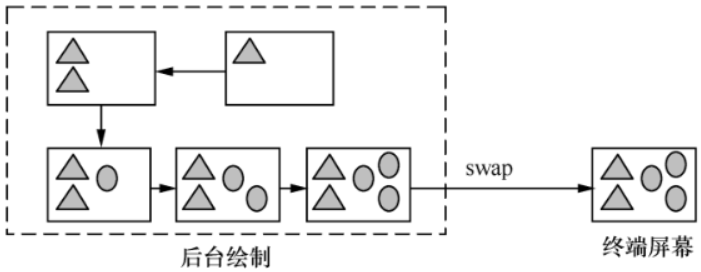

> 上图表示的就是通常所称的 “双缓冲”（`Double-Buffering`）技术。
> 除此之外，其实还有三缓冲（`Triple Buffering`）、四缓冲（`Quad Buffering`）等，
> 我们将它们统称为 “多缓冲”（`Multiple Buffering`）机制。

理解了为什么需要双缓冲以后，我们再回过头来看 `FramebufferNativeWindow` 的构造函数。

接下来要解决的另一个问题是：多个缓冲区空间是从哪里分配的？

通过前几个小节的知识可知，应该是要向 `HAL` 层的 `Gralloc` 申请。

```:no-line-numbers
FramebufferNativeWindow 构造函数中的第一个 for 循环里先给各 buffer 创建相应的实例（new NativeBuffer），
其中的属性值都来源于 fbDev，如宽、高、格式等。

紧随其后的就是调用 Gralloc 设备的 alloc() 方法：

	/*
	函数原型：
	int (*alloc)(struct alloc_device_t* dev, int w, int h, int format, int usage, buffer_handle_t* handle, int* stride);
	*/
	err = grDev->alloc(grDev, fbDev->width, fbDev->height, fbDev->format, GRALLOC_USAGE_HW_FB, 
						&buffers[i]->handle, &buffers[i]->stride);

注意第 5 个参数，它代表所要申请的缓冲区的用途，
定义在 hardware/libhardware/include/hardware/gralloc.h 中，目前已经支持几十种。比如：

	GRALLOC_USAGE_HW_TEXTURE       // 缓冲区将用于OpenGL ES Texture。
	GRALLOC_USAGE_HW_RENDER        // 缓冲区将用于OpenGL ES的渲染。
	GRALLOC_USAGE_HW_2D            // 缓冲区会提供给2D 硬件图形设备。
	GRALLOC_USAGE_HW_COMPOSER      // 缓冲区用于HWComposer HAL模块。
	GRALLOC_USAGE_HW_FB            // 缓冲区用于framebuffer设备。
	GRALLOC_USAGE_HW_VIDEO_ENCODER // 缓冲区用于硬件视频编码器。

这里申请的缓冲区是要在终端屏幕上显示的，所以申请的 usage 类 型是 GRALLOC_USAGE_HW_FB，
对应的 Gralloc 中的实现是 gralloc_alloc_framebuffer@gralloc.cpp；

假如是其他用途的缓冲区申请，则对应 gralloc_alloc_buffer@gralloc.cpp。
不过，如果底层只允许一个 buffer（不支持 page-flipping 的情况），
那么 gralloc_alloc_framebuffer 也同样可能只返回一个 ashmem 中申请的 “内存空间”，真正的 “帧缓冲区” 则要在 post 时才会被用到。
```

所有申请到的缓冲区都需要由 `FramebufferNativeWindow` 中的全局变量 `buffers[MAX_NUM_FRAME_BUFFERS]` 来记录，

每个数据元素是一个 `NativeBuffer`。这个类的定义如下：

```cpp:no-line-numbers
class NativeBuffer : public ANativeObjectBase<ANativeWindowBuffer, NativeBuffer, LightRefBase<NativeBuffer>>
{
	...
```

可见这个 “本地缓冲区” 继承了 `ANativeWindowBuffer` 的特性，后者的定义在 `/system/core/include/system/window.h` 中：

> 高版本系统定义在了 `frameworks/native/libs/nativebase/include/nativebase/nativebase.h` 中。

```cpp:no-line-numbers
typedef struct ANativeWindowBuffer
{
	...
    int width; // 宽
    int height; / /高
	...
    buffer_handle_t handle; /* 代表内存块的句柄，比如 ashmem 机制 */
	...
} ANativeWindowBuffer_t;
```

另外，当前可用（`free`）的 `buffer` 数量由 `mNumFreeBuffers` 管理，这个变量的初始值也是 `mNumBuffers`，即总共有 `2` 或 `3` 个可用缓冲区。

在程序后续的运行过程中，始终由 `mBufferHead` 来指向下一个将被申请的 `buffer`（注意：不是下一个可用 `buffer`）。

```:no-line-numbers
也就是说，每当用户向 FramebufferNativeWindow 申请一个 buffer 时（dequeueBuffer），这个 mBufferHead 就会增加 1；
一旦它的值超过最大值，则还会变成 0，如此就实现了循环管理。后面在讲解 dequeueBuffer 时再详细解释。
```

一个本地窗口包含了很多属性值，如各种标志（`flags`）、横纵坐标的密度值等。这些数值都可以从 `fb` 设备中查询到，`我们需要将它们赋予刚生成的FramebufferNativeWindow` 实例的属性。

最后，就应该履行 `ANativeWindow` 的接口协议了。`FramebufferNativeWindow` 会将其对应的成员函数逐个填充到 `ANativeWindow` 的函数指针中，比如：

```cpp:no-line-numbers
ANativeWindow::setSwapInterval = setSwapInterval; 
ANativeWindow::dequeueBuffer = dequeueBuffer;
```

这样子 `OpenGL ES` 才能通过一个 `ANativeWindow` 来与本地窗口系统建立正确的连接。

下面我们详细分析其中 `dequeueBuffer` 的实现。

#### 4.1.2 `dequeueBuffer`

这个函数虽然很短（只有二十几行），却是 `FramebufferNativeWindow` 中的核心。`OpenGL ES` 就是通过它来分配一个可用于渲染的缓冲区的：

```cpp:no-line-numbers
/*
	dequeueBuffer 在 ANativeWindow 中的函数原型：
	int (*dequeueBuffer)(struct ANativeWindow* window, struct ANativeWindowBuffer** buffer, int* fenceFd);
*/
int FramebufferNativeWindow::dequeueBuffer(ANativeWindow* window, ANativeWindowBuffer** buffer, int* fenceFd)
{
	/* Step1 */
    FramebufferNativeWindow* self = getSelf(window); 

	/* Step2 */
    Mutex::Autolock _l(self->mutex); 
    ...
	/* Step3. 计算 mBufferHead */
    int index = self->mBufferHead++;
    if (self->mBufferHead >= self->mNumBuffers)
        self->mBufferHead = 0; // 循环

    /* Step4. 如果当前没有可用缓冲区 */
    while (!self->mNumFreeBuffers) {
        self->mCondition.wait(self->mutex);
    }

    /* Step5. 如果有人释放了缓冲区 */
    self->mNumFreeBuffers--;
    self->mCurrentBufferIndex = index;
    *buffer = self->buffers[index].get();
    *fenceFd = -1;
    return 0;
}
```

```:no-line-numbers
Step1@FramebufferNativeWindow::dequeueBuffer

这里先将入参中 ANativeWindow 类型的变量 window 强制转化为 FramebufferNativeWindow。
因为前者是后者的父类，所以这样的转化当然是有效的。

不过细心的读者可能会发现，为什么函数入参中还要特别传入一个 ANativeWindow 对象的内存地址，
直接使用FramebufferNativeWindow的this指针不行吗？
这么做很可能是为了兼容各种平台。

大家应该注意到 ANativeWindow 是一个 Struct 数据类型，而在 C 语言中 Struct 是没有成员函数的，
所以我们通常是用函数指针的形式来模拟一个成员函数，如这个 dequeueBuffer 在 ANativeWindow 的定义就是一个函数指针，

而且系统并没有办法预先知道最终填充到 ANativeWindow 中的函数指针实现里是否可以使用 this 指针，
所以在参数中带入一个 window 变量就是必要的。
```

```:no-line-numbers
Step2@FramebufferNativeWindow::dequeueBuffer

获得一个 Mutex 锁。
因为接下来的操作涉及资源互斥区，自然需要有一个保护措施。
这里采用的是 Autolock，意味着 dequeueBuffer 函数结束后会自动释放 Mutex。
```

```:no-line-numbers
Step3@FramebufferNativeWindow::dequeueBuffer

前面我们介绍过 mBufferHead 变量，这里来看看它的实际使用。
首先 index 得到的是 mBufferHead 所代表的当前位置，然后 mBufferHead 增加 1。
由于我们是循环利用多个缓冲区的，所以如果这个变量的值大于或等于 mNumBuffers，那么就需要把它置为 0。
也就是说，mBufferHead 的值永远只能是 [0-2] 中的一个。
```

```:no-line-numbers
Step4@FramebufferNativeWindow::dequeueBuffer

mBufferHead 并不代表它所指向的缓冲区是可用的。
假如当前的 mNumFreeBuffers 表明已经没有多余的缓冲区空间，那么我们就需要等待有人释放 buffer 后才能继续操作。
(这里使用到 Condition 这一同步机制。)
可以肯定的是，这里调用了 mCondition.wait，那么必然有其他地方要唤醒它 —— 具体的就是在 queueBuffer()中。
```

```:no-line-numbers
Step5@FramebufferNativeWindow::dequeueBuffer

一旦成功获取到一个 buffer 后，程序要把可用的 buffer 计数值减 1（mNumFreeBuffers--）。
另外 mBufferHead 前面已经做过自增（++）处理，这里就不用再做特别工作。
```

这样我们就完成了 `Android` 系统中 `FramebufferNativeWindow` 本地窗口的分析。

接下来讲解另一个重要的本地窗口。

### 4.2 `Surface`

`Surface` 是针对应用程序端的本地窗口，和 `FramebufferNativeWindow` 一样，它必须继承 `AnativeWindow`：

```cpp:no-line-numbers
/* frameworks/native/libs/gui/include/gui/Surface.h */
class Surface : public ANativeObjectBase<ANativeWindow, Surface, RefBase>
```

这个本地窗口当然也需要实现 `ANativeWindow` 所制定的 “协议”，我们关注的重点是它与前面的 `FramebufferNativeWindow` 有什么不同。

`Surface` 的构造函数只是简单地给 `ANativeWindow::dequeueBuffer` 等函数指针及内部变量赋了初值。

由于整个函数的功能很简单，我们只摘录部分核心内容：

```cpp:no-line-numbers
/* frameworks/native/libs/gui/Surface.cpp */
Surface::Surface(const sp<IGraphicBufferProducer>& bufferProducer): mGraphicBufferProducer(bufferProducer)
{
    /* 给 ANativeWindow 中的函数指针赋值 */
    ANativeWindow::setSwapInterval  = hook_setSwapInterval;
    ANativeWindow::dequeueBuffer    = hook_dequeueBuffer;
    ...
    /* 为各内部变量赋值，因为此时用户还没有发起申请，所以大部分变量的初始值是 0 */
    mReqWidth = 0;
    mReqHeight = 0;
    ...
    mDefaultWidth = 0;
    mDefaultHeight = 0;
    mUserWidth = 0;
    mUserHeight = 0;
    ...
}
```

`Surface` 是面向 `Android` 系统中所有 `UI` 应用程序的，即它承担着应用进程中的 `UI` 显示需求。

基于这点，可以推测出其内部实现至少要考虑以下几点：

```:no-line-numbers
1. 面向上层实现（主要是 Java 层）提供绘制图像的 “画板”
    前面说过，这个本地窗口分配的内存空间不属于帧缓冲区，那么具体是由谁来分配的，又是如何管理的呢？

2. 它与 SurfaceFlinger 间是如何分工的
	显然 SurfaceFlinger 需要收集系统中所有应用程序绘制的图像数据，然后集中显示到物理屏幕上。
	在这个过程中，Surface 扮演了什么样的角色呢？
```

先来解释下 `Surface` 类中一些重要的成员变量，如下表所示。

<table>
	<tr>
		<th>成员变量</th>
		<th>说明</th>
	</tr>
	<tr>
		<td>sp&lt;IGraphicBufferProducer&gt;mGraphicBufferProducer</td>
		<td>
			这个变量是 Surface 的核心，很多 “协议” 就是通过它实现的，后面会有详细讲解。
			值得一提的是，它已经多次改名，4.1 的版本中叫作 mSurfaceTexture，后更名为 mBufferProducer，
			而目前则是叫 mGraphicBufferProducer。
		</td>
	</tr>
	<tr>
		<td>BufferSlot mSlots[NUM_BUFFER_SLOTS]</td>
		<td>
			从名称上不难看出，这是 Surface 内部用于存储 buffer 的地方，容量 NUM_BUFFER_SLOTS 最多可达 32 个。
			BufferSlot 类的内部又由一个 GraphicBuffer 和一个 dirtyRegion 组成，当用户 dequeueBuffer 时才会分配真正的空间
		</td>
	</tr>
	<tr>
		<td>uint32_t mReqWidth</td>
		<td>
			Surface 中有多组相似的宽/高变量，它们之间是有区别的。
			这里的宽和高是指下一次 dequeue 时将会申请的尺寸，初始值都是 1
		</td>
	</tr>
	<tr>
		<td>uint32_t mReqHeight</td>
		<td></td>
	</tr>
	<tr>
		<td>uint32_t mReqFormat</td>
		<td>
			和上面两个变量类似，这是指下次 dequeue 时将会申请的 buffer 的像素格式，
			初始值是 PIXEL_FORMAT_RGBA_8888
		</td>
	</tr>
	<tr>
		<td>uint32_t mReqUsage</td>
		<td>指下次 dequeue 时将会指定的 usage 类型</td>
	</tr>
	<tr>
		<td>Rect mCrop</td>
		<td>
			Crop 表示 “修剪”，这个变量将在下次 queue 时用于修剪缓冲区，
			可以调用 setCrop 来设置具体的值
		</td>
	</tr>
	<tr>
		<td>int mScalingMode</td>
		<td>
			同样，这个变量将用于下次 queue 时对缓冲区进行 scale，
			可以调用 setScalingMode 来设置具体的值
		</td>
	</tr>
	<tr>
		<td>uint32_t mTransform</td>
		<td>用于下次 queue 时的图形翻转等操作（Transform）</td>
	</tr>
	<tr>
		<td>uint32_t mDefaultWidth</td>
		<td>默认情况下的缓冲区宽高值</td>
	</tr>
	<tr>
		<td>uint32_t mDefaultHeight</td>
		<td></td>
	</tr>
	<tr>
		<td>uint32_t mUserWidth</td>
		<td>如果不为零的话，就是应用层指定的值，而且会覆盖前面的 mDefaultWidth/mDefaultHeight</td>
	</tr>
	<tr>
		<td>uint32_t mUserHeight</td>
		<td></td>
	</tr>
	<tr>
		<td>sp&lt;GraphicBuffer&gt;  mLockedBuffer</td>
		<td>访问这 3 个变量需要资源锁的保护，接下来还会有分析</td>
	</tr>
	<tr>
		<td>sp&lt;GraphicBuffer&gt;  mPostedBuffer</td>
		<td></td>
	</tr>
	<tr>
		<td>Region mDirtyRegion</td>
		<td></td>
	</tr>
</table>

从上表中 `Surface` 类的内部变量的描述中，可以了解到两点：

```:no-line-numbers
1. Surface 将通过 mGraphicBufferProducer 来获取 buffer，
2. 而且这些 buffer 缓冲区会被记录在 mSlots 数组中。
```
    
接下来我们分析其中的实现细节。

前面 `Surface` 构造函数中看到 `ANativeWindow` 中的函数指针赋予的是各种以 `hook` 开头的函数，而这些 `hook_XX` 内部又直接 “钩住” 了 `Surface` 中真正的实现。

> 比如 `Surface::hook_dequeueBuffer` 对应的是 `Surface::dequeueBuffer`，这就好像 “钩子” 的功能一样，所以得名为 `hook`。

```cpp:no-line-numbers
/* frameworks/native/libs/gui/Surface.cpp */
int Surface::dequeueBuffer(android_native_buffer_t** buffer,int *fenceFd) {
	...
    Mutex::Autolock lock(mMutex);
    int buf = -1;

    /* Step1. 宽高计算 */
    int reqW = mReqWidth ? mReqWidth : mUserWidth;
    int reqH = mReqHeight ? mReqHeight : mUserHeight;

    /* Step2. dequeueBuffer 得到一个缓冲区 */
    sp<Fence> fence;
	/* 生产者发挥作用了 */
    status_t result = mGraphicBufferProducer->dequeueBuffer(&buf, &fence, reqW, reqH, mReqFormat, mReqUsage);
    ...
    sp<GraphicBuffer>&gbuf(mSlots[buf].buffer); /* 注意 buf 是一个 int 值，代表的是 mSlots 数组序号 */
    ...
    if ((result & IGraphicBufferProducer::BUFFER_NEEDS_REALLOCATION) || gbuf == 0) {
        result = mGraphicBufferProducer->requestBuffer(buf, &gbuf); // 申请空间
        ...
    }
    ...
    *buffer = gbuf.get();
}
```

```:no-line-numbers
Step1@Surface::dequeueBuffer

图形缓冲区一定有宽高属性，具体的值由 mReqWidth/mReqHeight 或者 mUserWidth/mUserHeight 决定，
其中前者的优先级比后者高。
```

```:no-line-numbers
Step2@Surface::dequeueBuffer

如前面所述，真正执行 dequeueBuffer 操作的确实是 mGraphicBufferProducer(IGraphicBufferProducer)。
Surface 中的这个核心成员变量的来源可以有两个：
	1. 作为 Surface 的构造函数参数传入；
	2. 或者 Surface 的子类通过直接调用 setIGraphicBufferProducer 来生成。
在应用进程环境中，属于后者。
```

#### 4.2.1 `Surface` 的创建流程

大致流程是：

```:no-line-numbers
ViewRootImpl 持有一个 Java 层的 Surface 对象（即 mSurface），初始时是空的。
后续 ViewRootImpl 将向 WindowManagerService 发起 relayout 请求，此时 mSurface 才被赋予真正有效的值。

WindowManagerService 会先让 WindowStateAnimator 生成一个 SurfaceControl，
然后通过 Surface.copyFrom() 函数将其复制到 mSurface 中。

这个复制函数会通过 native 接口 nativeCreateFromSurfaceControl 来生成本地 Surface对象（C++ 对象），
具体是在 android_view_Surface.cpp 文件中。

JNI 函数 nativeCreateFromSurfaceControl 将从 SurfaceControl 中提取出 Surface（C++ ），
最终记录到 Surface（Java） 的成员变量中。

这样，后期我们就可以从 Surface（Java） 的成员变量中还原出底层的 Surface（C++ ） 对象了。
```

`Surface` 的创建流程图大致如下：

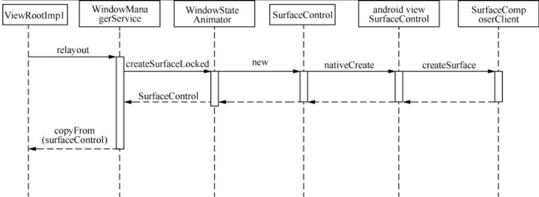

从上图中可以看到，`Surface` 由 `SurfaceControl` 管理，而后者又由 `SurfaceComposerClient` 创建：

```cpp:no-line-numbers
/* frameworks/native/libs/gui/SurfaceComposerClient.cpp */
sp<SurfaceControl> SurfaceComposerClient::createSurface(const String8& name, uint32_t w, uint32_t h, 
															PixelFormat format, uint32_t flags)
{
    sp<SurfaceControl> sur;
    if (mStatus == NO_ERROR) {
        sp<IBinder> handle;
        sp<IGraphicBufferProducer> gbp;

        // 生成一个 Surface
        status_t err = mClient->createSurface(name, w, h, format, flags, &handle, &gbp);  
        ...
        if (err == NO_ERROR) {
            sur = new SurfaceControl(this, handle, gbp); // SurfaceControl 是 “本地” 的对象
        }
    }
    return sur;
}
```

```:no-line-numbers
上述代码段中，mClient 是一个 ISurfaceComposerClient 的 sp 指针，程序通过它来生成一个 Surface。
值得注意的是，SurfaceControl 对象并不是由 ISurfaceComposerClient 的 createSurface 直接生成的，
ISurfaceComposerClient::createSurface 函数的参数中包括了 gbp（IGraphicBufferProducer），即前面所说的 “buffer生产者”。
从中我们可以了解到，真正与 SurfaceFlinger 间有联系的应该就是 gbp（IGraphicBufferProducer）。
```

那么 `ISurfaceComposerClient` 的服务器端实现是谁？

```cpp:no-line-numbers
/* frameworks/native/libs/gui/SurfaceComposerClient.cpp */
void SurfaceComposerClient::onFirstRef() {
    sp<ISurfaceComposer> sm(ComposerService::getComposerService());
    if (sm != 0) {
        sp<ISurfaceComposerClient> conn = sm->createConnection();
        if (conn != 0) {
            mClient = conn;
            mStatus = NO_ERROR;
        }
    }
}
```

由此可见，`ISurfaceComposerClient` 是由 `ISurfaceComposer::createConnection` 生成的。在这一过程中，总共涉及了 3 个匿名的 `Binder Server`，它们所提供的接口如下表所示。

<table>
	<tr>
		<th>匿名 Binder</th>
		<th>提供的接口</th>
	</tr>
	<tr>
		<td>ISurfaceComposer</td>
		<td>createConnection</td>
	</tr>
	<tr>
		<td>ISurfaceComposerClient</td>
		<td>
			virtual status_t createSurface(..., sp&lt;IGraphicBufferProducer&gt;* gbp)=0;<br/>
			virtual status_t destroySurface(const sp&lt;IBinder&gt;& handle) = 0;
		</td>
	</tr>
	<tr>
		<td>IGraphicBufferProducer</td>
		<td>
			status_t requestBuffer(int slot, sp&lt;GraphicBuffer&gt;* buf);<br/>
			status_t setBufferCount(int bufferCount);<br/>
			status_t dequeueBuffer(...);<br/>
			status_t queueBuffer(...);<br/>
			void cancelBuffer(int slot);<br/>
			int query(int what, int* value);<br/>
			status_t setSynchronousMode(bool enabled);<br/>
			status_t connect(int api, QueueBufferOutput* output);<br/>
			status_t disconnect(int api);
		</td>
	</tr>
</table>

```:no-line-numbers
匿名 Binder 一定是需要由一个实名 Binder 来提供的，它就是 SurfaceFlinger，
这个 SurfaceFlinger 系统服务是在 ServiceManager 中 “注册在案” 的。

具体是在 SurfaceComposerClient::onFirstRef() 这个函数中，
通过向 ServiceManager 查询名称为 “SurfaceFlinger” 的 Binder Server 来获得的。

不过和其他常见 Binder Server 不同的是，
SurfaceFlinger 虽然在 ServiceManager 中注册的名称为 “SurfaceFlinger”，
但它在服务器端实现的 Binder 接口却是 ISurfaceComposer，
因而 SurfaceComposerClient 得到的其实是 ISurfaceComposer。大家要特别注意这点，否则可能会引起混乱。

我们可以从 SurfaceFlinger 的继承关系中看出这一区别，如下代码片断：
```

```cpp:no-line-numbers
/* frameworks/native/services/surfaceflinger/SurfaceFlinger.h */
class SurfaceFlinger :
	public BinderService<SurfaceFlinger>, // 在ServiceManager 中注册为 “SurfaceFlinger”
	public BnSurfaceComposer, // 实现的接口却叫 ISurfaceComposer，不知道为什么要这么设计
```

```cpp:no-line-numbers
/* frameworks/native/services/surfaceflinger/SurfaceFlinger.h */
/* 高版本中的声明 */
class SurfaceFlinger : public BnSurfaceComposer,
	public PriorityDumper,
	private IBinder::DeathRecipient,
	private HWC2::ComposerCallback,
	private ICompositor,
	private scheduler::ISchedulerCallback,
	private compositionengine::ICEPowerCallback,
	private scheduler::IVsyncTrackerCallback

public:
	...
	static char const* getServiceName() ANDROID_API { return "SurfaceFlinger"; }


/* frameworks/native/libs/gui/include/gui/ISurfaceComposer.h */
class BnSurfaceComposer: public BnInterface<ISurfaceComposer>
```

绕了一大圈，我们接着分析前面 `Surface::dequeueBuffer` 函数的实现。

```:no-line-numbers
目前我们已经清楚 mGraphicBufferProducer 的由来了。接下来程序利用这个变量来 dequeueBuffer。

那么，IGraphicBufferProducer 在服务器端又是由谁来实现的呢？
因为这里面牵扯到很多新的类，我们先不做过多解释，到后面 BufferQueue 小节再详细分析其中的依赖关系。

当 mGraphicBufferProducer->dequeueBuffer 返回后，buf 变量就是 mSlots[] 数组中可用的成员序号。
接下来就要通过这个序号来获取真正的 buffer 地址，即 mSlots[buf].buffer。
```

```:no-line-numbers
Step3@Surface::dequeueBuffer

假如返回值 result 中的标志包含了 BUFFER_NEEDS_REALLOCATION，
说明 BufferQueue 需要为这个 Slot 重新分配空间，具体细节请参见下一个小节。
此时还需要另外调用 requestBuffer 来确定 gbuf 的值，其中又牵涉到很多东西，也放在下一小节统一解释。
```

### 4.2 本地窗口小结

目前，已经介绍了显示系统中两个重要的本地窗口：`FramebufferNativewindow` 和 `Surface`。

```:no-line-numbers
FramebufferNativewindow 是专门为 SurfaceFlinger 服务的，它由 Gralloc 提供支持；

Surface 虽然是为应用程序服务的，但本质上还是由 SurfaceFlinger 服务统一管理的，因而涉及很多跨进程的通信细节。
```

这个小节我们只是简单地勾勒出其中的框架，接下来就要分几个方面来做完整的分析了：

```:no-line-numbers
1. BufferQueue
为应用程序服务的本地窗口 Surface，其依赖的 IGraphicBufferProducer 对象在 Server 端的实现是 BufferQueue。
我们将详细解析 BufferQueue 的内部实现，并结合应用程序端的使用流程来理解它们之间的关系。

2. Buffer，Consumer，Producer 是 “生产者-消费者” 模型中的 3 个参与对象，
如何协调好它们的工作是应用程序能否正常显示 UI 的关键。

接下来，我们先讲解 Buffer（BufferQueue）与 Producer（应用程序）间的交互，
然后转而切入 Consumer（SurfaceFlinger）做详细分析。
```

## 5 `BufferQueue` 详解

`BufferQueue` 是 `Surface` 实现本地窗口的关键。从逻辑上来推断，`BufferQueue` 应该是驻留在 `SurfaceFlinger` 这边的进程中。

我们需要进一步解决的疑惑是：

```:no-line-numbers
1. 每个应用程序可以有几个 BufferQueue，即它们的关系是一对一、多对一，还是一对多？
2. 应用程序绘制 UI 所需的内存空间是由谁来分配的？
3. 应用程序与 SurfaceFlinger 如何互斥共享数据区？
4. 我们这里面临的是经典的 “生产者-消费者” 模型。Android 显示系统是如何协调好这两者对缓冲区的互斥访问的呢？
```

### 5.1 `BufferQueue` 的内部原理

先来解析下 `BufferQueue` 的内部构造，如下图所示。

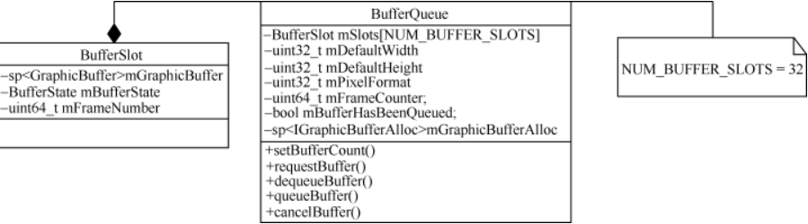

因为 BufferQueue 是 IGraphicBufferProducer 服务器端的实现，所以它必须重载接口中的各种虚函数：

```:no-line-numbers
如 queueBuffer、requestBuffer、dequeueBuffer 等。
```

> 注意：
> 
> 高版本中，`IGraphicBufferProducer` 被抽取到 `BufferQueueProducer` 中实现了，
> `BufferQueue` 提供了 `BufferQueue::createBufferQueue` 方法，创建了 `BufferQueueProducer` 对象，
> 同时还创建了 `BufferQueueConsumer` 对象。
>
> ```cpp:no-line-numbers
> /* frameworks/native/libs/gui/include/gui/BufferQueue.h */
> static void createBufferQueue(sp<IGraphicBufferProducer>* outProducer,
>            sp<IGraphicBufferConsumer>* outConsumer,
>            bool consumerIsSurfaceFlinger = false);
> ```
> 
> ```cpp:no-line-numbers
> /* frameworks/native/libs/gui/include/gui/BufferQueueProducer.h */
> class BufferQueueProducer : public BnGraphicBufferProducer,
>                             private IBinder::DeathRecipient {
> 
> /* frameworks/native/libs/gui/include/gui/IGraphicBufferProducer.h */
> class BnGraphicBufferProducer : public BnInterface<IGraphicBufferProducer>
> {
> ```

另外，这个 `BufferQueue` 的内部有一个非常重要的成员数组，即 `mSlots[NUM_BUFFER_SLOTS]`。

在前面讲解的 `Surface` 类中也有一个一模一样的数组：

```cpp:no-line-numbers
/* frameworks/native/libs/gui/include/gui/Surface.h */
class Surface: public ANativeObjectBase<ANativeWindow, Surface, RefBase>
{
	...
	BufferSlot mSlots[NUM_BUFFER_SLOTS];
```

虽然两个数组从形式上看一模一样，但要特别注意其中的 `BufferSlot` 定义并不相同：

```cpp:no-line-numbers
/* frameworks/native/libs/gui/include/gui/Surface.h */
struct BufferSlot {
	sp<GraphicBuffer> buffer;
	Region dirtyRegion;
};


/* frameworks/native/libs/gui/include/gui/BufferSlot.h */
struct BufferSlot {
	...
	sp<GraphicBuffer> mGraphicBuffer;
	BufferState mBufferState;
	...
}
```

```:no-line-numbers
后面一个 BufferSlot 中的 GraphicBuffer 变量（mGraphicBuffer）用于记录这个 Slot 所涉及的缓冲区；
另一个 BufferState 变量（mBufferState`）用于跟踪每个缓冲区的状态。比如：
```

```cpp:no-line-numbers
enum BufferState {

    /* Buffer 当前可用，也就是说可以被dequeued。此时 Buffer 的 owner 可认为是 BufferQueue */
	FREE = 0, 

    /*
        Buffer 已经被 dequeued，还未被 queued 或 canceled。此时Buffer的owner可认为是producer（应用程序），
        这意味着 BufferQueue 和 SurfaceFlinger(consumer) 此时都不可以操作这块缓冲区
    */
	DEQUEUED = 1, 

    /*Buffe r已经被客户端 queued，不过还不能对它进行 dequeue，但可以 acquired。此时的 owner 是 BufferQueue*/
	QUEUED = 2, 

    /* Buffer 的 owner 改为 consumer，可以被 released，然后状态又返回 FREE*/
	ACQUIRED = 3 
};

/* 高版本中，BufferState 作为一个结构体定义在 frameworks/native/libs/gui/include/gui/BufferSlot.h 中 */
```

从上面的状态描述可以看出，一块 `Buffer` 在处理过程中经历的生命周期依次是 `FREE -> DEQUEUED -> QUEUED -> ACQUIRED -> FREE`。

从 `Owner` 的角度给出的 `Buffer` 状态迁移图如下所示：

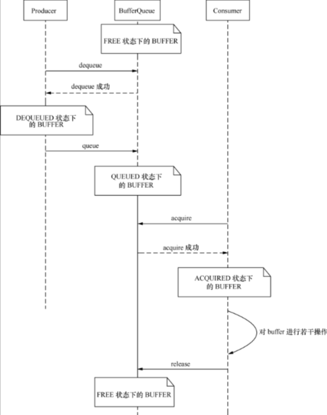

从 `Buffer` 状态迁移图中可以清楚地了解 `Buffer` 的各个状态、引起状态迁移的条件以及各状态下的 `Owner`。

参与 `Buffer` 管理的 `Owner` 对象有 3 个：

```:no-line-numbers
BufferQueue
    我们可以认为 BufferQueue 是一个服务中心，其他两个 Owner 必须要通过它来管理 Buffer。
    比如当 Producer 想要获取一个 Buffer 时，它不能越过 BufferQueue 直接与 Consumer 进行联系，反之亦然。

Producer
    生产者就是 “填充” Buffer 数据的人，通常情况下当然就是应用程序。
    因为应用程序不断地刷新 UI，从而将产生的显示数据源源不绝地写到 Buffer 中。
    当 Producer 需要使用一块 Buffer 时，它首先会向 BufferQueue 发起 dequeue 申请，然后才能对指定的缓冲区进行操作。
    经过 dequeue 后 Buffer 就属于 producer 的了，它可以对 Buffer 进行任何必要的操作，而其他 Owner 此刻绝不能擅自插手。

    当生产者认为一块 Buffer 已经写入完成后，将进一步调用 BufferQueue 的 queue 接口。
    从字面上看这个函数是 “入列” 的意思，形象地表达了 Buffer 此时的操作 —— 把 Buffer 归还到 BufferQueue 的队列中。
    一旦 queue 成功，Owner 也就随之改变为 BufferQueue 了。

Consumer
    消费者是与生产者相对应的，它的操作同样受到 BufferQueue 的管控。
    当一块 Buffer 已经就绪后，Consumer 就可以开始工作了，细节我们会在后续 SurfaceFlinger 中描述。
```

这里需要特别留意的是，从各个对象所扮演的角色来看：

```:no-line-numbers
BufferQueue 是中介机构，属于服务提供方；
Producer 属于 Buffer 内容的产出方，它对缓冲区的操作是一个 “主动” 的过程；
而 Consumer 对 Buffer 的处理则是 “被动” 的、“等待式” 的，即：它必须要等到一块 Buffer 填充完成后才能工作。
```

在这样的模型下，我们怎么保证 `Consumer` 可以及时处理 `Buffer` 呢？换句话说，当一块 `Buffer` 数据 `ready` 后，应该怎么告知 `Consumer` 来操作呢？

仔细观察，可以看到 `BufferQueue` 里同时还提供了一个特别的类，名称为 `ConsumerListener`。其中的函数接口包括：

```cpp:no-line-numbers
struct ConsumerListener : public virtual RefBase {      

    /* 当一块 buffer 可以被消费时，这个函数会被调用，特别注意此时没有共享锁的保护 */  
    virtual void onFrameAvailable() = 0; 

    /* BufferQueue 通知 consumer 它已经释放其 slot 中的一个或多个 GraphicBuffer 引用 */
    virtual void onBuffersReleased() = 0; 
};

/* 
    高版本系统定义在 frameworks/native/libs/gui/include/gui/IConsumerListener.h 中
    声明略有不同，但函数名称都一样
 */
```

这样就很清楚了，当有一帧数据准备就绪后，`BufferQueue` 就会调用 `onFrameAvailable()` 来通知 `Consumer` 进行消费。


### 5.2 `BufferQueue` 的缓冲区分配

我们知道，`BufferQueue` 中有一个 `mSlots` 数组用于管理其内的各缓冲区，最大容量为 32。

从 `mSlots` 数组的声明方式来看，这个 `mSlots` 在程序一开始就静态分配了 32 个 `BufferSlot` 大小的空间。不过这并不代表其中的数据缓冲区也是一次性静态分配的，恰恰相反，从 `BufferSlot` 的内部变量指针 `mGraphicBuffer` 可以看出，缓冲区的空间分配应当是动态的（从下面的注释也能看出一些端倪）：

```cpp:no-line-numbers
/* frameworks/native/libs/gui/include/gui/BufferSlot.h */
// mGraphicBuffer points to the buffer allocated for this slot or is NULL
// if no buffer has been allocated.
sp<GraphicBuffer> mGraphicBuffer;
```

> 注意：
> 
> 高版本中，`mSlots` 数据定义在了 `BufferQueueProducer.h` 中，具体如下：
> 
> ```cpp:no-line-numbers
> /* frameworks/native/libs/gui/include/gui/BufferQueueProducer.h */
> BufferQueueDefs::SlotsType& mSlots;
> 
> // 在创建 BufferQueueProducer 对象时，在 BufferQueueProducer 的构造函数中初始化
> /* frameworks/native/libs/gui/BufferQueueProducer.cpp */
> BufferQueueProducer::BufferQueueProducer(const sp<BufferQueueCore>& core,
>        bool consumerIsSurfaceFlinger) :
>    mCore(core),
>    mSlots(core->mSlots), // 将 BufferQueueCore::mSlots 赋值给了 BufferQueueProducer::mSlots
> 
> /* frameworks/native/libs/gui/include/gui/BufferQueueCore.h */
> BufferQueueDefs::SlotsType mSlots;
> 
> // BufferQueueDefs::SlotsType 类型的声明如下
> /* frameworks/native/libs/gui/include/gui/BufferQueueDefs.h */
> // BufferQueueDefs::SlotsType 是一个 BufferSlot 数组，数组长度是 NUM_BUFFER_SLOTS
> typedef BufferSlot SlotsType[NUM_BUFFER_SLOTS];
> 
> // NUM_BUFFER_SLOTS 定义如下
> /* frameworks/native/libs/ui/include/ui/BufferQueueDefs.h */
> static constexpr int NUM_BUFFER_SLOTS = 64; // 也就是说，高版本中，mSlots 数组的容量扩充到了 64
> ```

现在的问题就转化为：在什么情况下会给一个 `Slot` 分配实际的空间呢？

首先能想到的就是 `dequeueBuffer` 。理由如下：

```:no-line-numbers
1. 缓冲区的空间分配应该既要满足使用者的需求，又要防止浪费。
后面这一点 mSlots 已经满足了，因为它并没有采取一开始就静态预分配的方式。

2. 既然 Producer 对 buffer 的操作是 “主动” 的，那么就意味着它是整个需求的发起者。
换句话说，只要它没有 dequeueBuffer，或者 dequeueBuffer 时能获取到可用的缓冲区，那当然就没有必要再重新分配空间了。
```

下面详细分析 `dequeueBuffer` 函数，并验证我们上面的猜测：

> 注意：
> 
> 高版本中，`BufferQueue::dequeueBuffer` 函数对应 `BufferQueueProducer::dequeueBuffer` 函数。
> 
> 目前任然以低版本的代码进行分析，后续再更新到高版本。

```cpp:no-line-numbers
/*frameworks/native/libs/gui/BufferQueue.cpp*/
status_t BufferQueue::dequeueBuffer(int *outBuf, sp<Fence>* outFence,uint32_t w, uint32_t h,
        uint32_t format, uint32_t usage) {
    ...
    status_t  returnFlags(OK);
    ...
    { // Scope for the lock
        /* 
            这里采用了自动锁，所以上面需要加个 “{”，这样当 lock 变量生命周期结束后锁也就自动释放了。
            这种写法在 Android 中很常见 
        */
        Mutex::Autolock lock(mMutex);
        ...
        int found = -1;
        int dequeuedCount = 0;
        bool tryAgain = true;

        /* Step1. 循环查找符合要求的 Slot */
        while (tryAgain) { 
            ...                       
            found = INVALID_BUFFER_SLOT; // 初始值
            foundSync = INVALID_BUFFER_SLOT;
            dequeuedCount = 0;            
            for (int i = 0; i < maxBufferCount; i++) {
                const int state = mSlots[i].mBufferState;

                /* Step2. 统计 dequeued buffer 数量，后面会用到 */
                if (state == BufferSlot::DEQUEUED) {
                    dequeuedCount++;
                }               

                /* Step3. 寻找符合要求的 Slot */
                if (state == BufferSlot::FREE) { 
                    if (found < 0 || mSlots[i].mFrameNumber < mSlots[found].mFrameNumber) {
                          found = i; // 找到符合要求的 Slot
                    }
                }
            } // for 循环结束

            /* Step4. 如果 Client 没有设置 buffer count 的话，就不允许 dequeue 一个以上的  */
            if (!mOverrideMaxBufferCount&& dequeuedCount) {
                ST_LOGE("dequeueBuffer: can't dequeue multiple buffers without setting the buffer count");
                return -EINVAL;
            }
            ...
            /* Step5. 判断是否要重试 */
            tryAgain = found == INVALID_BUFFER_SLOT;
            if (tryAgain) {
                mDequeueCondition.wait(mMutex);
            }
        } // while 循环结束

        if (found == INVALID_BUFFER_SLOT) {
            /* 因为前面 while 循环如果没找到的话是不会退出的，所以理论上不会出现这种情况 */
            ST_LOGE("dequeueBuffer: no available buffer slots");
            return -EBUSY;
        }

        const int buf = found;
        *outBuf = found; // 返回值
        /* 成功找到可用的 Slot 序号，接下来就开始对这个指定的 Slot 进行初始操作，及状态变迁等 */
        ...
        /* Step6. Buffer 状态改变 */
        mSlots[buf].mBufferState = BufferSlot::DEQUEUED;
        const sp<GraphicBuffer>& buffer(mSlots[buf].mGraphicBuffer);
        if ((buffer == NULL) || (uint32_t(buffer->width)  != w) ||   
            (uint32_t(buffer->height) != h) || (uint32_t(buffer->format) != format)
                 || ((uint32_t(buffer->usage) & usage) != usage))
        {   
            /* Step7. 为 BufferSlot 对象做初始化 */
            mSlots[buf].mAcquireCalled = false;
            mSlots[buf].mGraphicBuffer = NULL;
            mSlots[buf].mRequestBufferCalled = false;
            mSlots[buf].mEglFence = EGL_NO_SYNC_KHR;
            mSlots[buf].mFence = Fence::NO_FENCE;
            mSlots[buf].mEglDisplay = EGL_NO_DISPLAY;

            returnFlags |= IGraphicBufferProducer::BUFFER_NEEDS_REALLOCATION; /* 需要重新分配 */
        }
    }  // 自动锁 lock 结束的地方

    /* Step8. 如果上述判断结果是需要重新分配空间的话 */
    if (returnFlags & IGraphicBufferProducer::BUFFER_NEEDS_REALLOCATION) {
        status_t error;
        /* 终于分配空间了 */
        sp<GraphicBuffer> graphicBuffer(mGraphicBufferAlloc->createGraphicBuffer(w, h, format, usage, &error));
        ...
        { // Scope for the lock
            Mutex::Autolock lock(mMutex);
               ...
            mSlots[*outBuf].mGraphicBuffer = graphicBuffer;
        }
    }
    ...
    return returnFlags;
}
```

因为这个函数很长，我们只保留最核心的部分。从整体框架来看，`Step1～Step5` 是在查找一个可用的 `Slot` 序号。从 `Step6` 开始，就针对这一特定的 `Slot` 进行操作了。下面我们分步进行解析：

```:no-line-numbers
Step1@ BufferQueue::dequeueBuffer

进入 while 循环，退出的条件是 tryAgain 为 false。
这个变量默认值是 true，如果一轮循环结束后 found 不再是 INVALID_BUFFER_SLOT，就会变成 false，从而结束整个 while 循环。

循环的主要功能就是查找符合要求的 Slot，其中 found 变量是一个 int 值，指的是这个 BufferSlot 在 mSlots 数组中的序号。
```

```:no-line-numbers
Step2@ BufferQueue::dequeueBuffer

统计当前已经被 dequeued 的 buffer 数量，这将用于后面的判断，
即假如 Client 没有设置 buffer count，那么它会被禁止 dequeue 一个以上的 buffer。
```

```:no-line-numbers
Step3@ BufferQueue::dequeueBuffer

假如当前的 buffer 状态是 FREE，那么这个 Slot 就可以进入备选了。
为什么只是备选而不是直接返回这一结果呢？
因为 mSlots 中很可能有多个符合条件的 Slot，当然需要挑选其中最匹配的。
判断的依据是当前符合要求的 Slot 的 mFrameNumber 是否比上一次选中的最优 Slot 的 mFrameNumber 小。具体代码如下：

    mSlots[i].mFrameNumber < mSlots[found].mFrameNumber;
```

```:no-line-numbers
Step4@ BufferQueue::dequeueBuffer

这里的判断来源于第二步的计算结果，一旦发现 dequeue 的数量“超标”，就直接出错返回。
```

```:no-line-numbers
Step5@ BufferQueue::dequeueBuffer

经过上述几个步骤，我们已经扫描了一遍 mSlots 中的所有成员，这时就要判断是否可以退出循环。
前面已经说过，如果成功找到有效的 Slot 就可以不用再循环查找了，否则 tryAgain 仍然是 true。
假如是后一种情况，证明当前已经没有 FREE 的 Slot。这时如果直接进入下一轮循环，结果通常也是一样的，反而浪费了 CPU 资源。
所以，就需要使用条件锁来等待。代码如下：

    mDequeueCondition.wait(mMutex);

当有 Buffer 被释放时，这个锁的条件就会满足，然后程序才继续查找可用的 Slot。
```

```:no-line-numbers
Step6@ BufferQueue::dequeueBuffer

根据前面的 Buffer 状态迁移图，当处于 FREE 状态的 Buffer 被 dequeue 成功后，
它将进入 DEQUEUED，所以这里我们需要改变其 mBufferState。
```

```:no-line-numbers
Step7@ BufferQueue::dequeueBuffer

通过上述几个步骤的努力，现在我们已经成功地寻找到有效的 Slot 序号了。
但是这并不代表这个 Slot 可以直接使用，为什么？最直接的一个原因就是这个 Slot 可能还没有分配空间。

因为 BufferSlot::mGraphicBuffer 初始值是 NULL，假如我们是第一次使用它，必然是需要为它分配空间的。
另外，即便 mGraphicBuffer 不为空，
但如果用户所需要的 Buffer 属性（比如 width，height，format 等）和当前这个不符，那么还是要进行重新分配。
```

```:no-line-numbers
Step8@ BufferQueue::dequeueBuffer

如果上一步的判断结果是 BUFFER_NEEDS_REALLOCATION，说明此 Slot 还未分配到有效的 buffer 空间，
具体分配操作使用的是 mGraphicBufferAlloc 这个 Allocator，
这里暂不深究其中的实现了，后续还会有详细分析。
```

如果重新分配了空间，那么最后的返回值中会加上 `BUFFER_NEEDS_REALLOCATION` 标志。

客户端在发现这个标志后，还应调用 `requestBuffer()` 来取得最新的 `buffer` 地址。

[9.4.2 Surface](#_9-4-2-surface) 小节中的 `Surface::dequeueBuffer()` 的 `Step3` 就是一个例子，这里结合起来分析。为了方便阅读，再把这部分代码简单地列出来：

```cpp:no-line-numbers
frameworks/native/libs/gui/Surface.cpp
/* frameworks/native/libs/gui/Surface.cpp */
int Surface::dequeueBuffer(android_native_buffer_t** buffer,int *fenceFd) {…
    Mutex::Autolock lock(mMutex);
    int buf = -1;
    /* Step1. 宽高计算 */
    int reqW = mReqWidth ? mReqWidth : mUserWidth;
    int reqH = mReqHeight ? mReqHeight : mUserHeight;

    /* Step2. dequeueBuffer 得到一个缓冲区 */
    sp<Fence> fence;
    /* 这一小节讲解的就是这个接口的实现 */
    status_t result = mGraphicBufferProducer->dequeueBuffer(&buf, &fence, reqW, reqH, mReqFormat, mReqUsage); 
    ...
    sp<GraphicBuffer>&gbuf(mSlots[buf].buffer); /* 注意 buf 是一个 int 值， 代表的是 mSlots 数组序号 */
    ...
    if ((result & IGraphicBufferProducer::BUFFER_NEEDS_REALLOCATION) || gbuf == 0) {
        /* 因为这个 buffer 是需要重新分配得到的，所以还需要进一步调用 requestBuffer，后面有详细讲解 */
        result = mGraphicBufferProducer->requestBuffer(buf, &gbuf);
        ...
    }
    ...
    *buffer = gbuf.get();
}
```

当 `mGraphicBufferProducer->dequeueBuffer` 成功返回后，`buf` 得到了 `mSlots` 中可用数组成员的序号（对应这一小节的 `found` 变量）。

但一个很明显的问题是：

```:no-line-numbers
既然客户端和 BufferQueue 运行于两个不同的进程中，那么它们的 mSlots[buf] 会指向同一块物理内存吗？
```

这就是 `requestBuffer` 存在的意义。

先来看看 `BpGraphicBufferProducer` 中是如何发起 `Binder` 申请的：

```cpp:no-line-numbers
/* frameworks/native/libs/gui/IGraphicBufferProducer.cpp */
class BpGraphicBufferProducer: public BpInterface<IGraphicBufferProducer>
{ 
    ...
    virtual status_t requestBuffer(int bufferIdx, sp<GraphicBuffer>* buf) { // 函数参数有两个
    Parcel data, reply;
    data.writeInterfaceToken(IGraphicBufferProducer::getInterfaceDescriptor());

    /* 只写入了 bufferIdx 值，也就是说 BnGraphicBufferProducer 中实际上是看不到 buf 变量的 */
    data.writeInt32(bufferIdx);

    status_t result =remote()->transact(REQUEST_BUFFER, data, &reply); // 执行跨进程操作
    ...
    /* 这里读取的是什么？我们稍后可以去 BnGraphicBufferProducer 中确认下 */
    bool nonNull = reply.readInt32();
    if (nonNull) {
        *buf = new GraphicBuffer(); // 生成一个 GraphicBuffer，看到没，这是一个本地实例
        /* buf 是一个 sp 指针,那么 **sp 实际上得到的就是这个智能指针所指向的对象。在这个例子中指的是 mSlots[buf].buffer */
        reply.read(**buf); 
    }
    result = reply.readInt32(); /* 读取结果 */
    return result;
}
```

`Native` 层的 `BpXXX/BnXXX` 与 `Java` 层的不同之处在于：

```:no-line-numbers
Java 层的通常都是依赖于 aidl来 自动生成这两个类，而 Native 层 的则是手工完成的。
```

也正因为是手工书写的，使用起来才更具灵活性。比如在 `IGraphicBufferProducer` 这个例子中：

```:no-line-numbers
开发者 “耍” 了点技巧 —— Surface 中调用了

    IgraphicBuffer Producer::requestBuffer(int slot, sp<GraphicBuffer>* buf)

这个函数虽然形式上有两个参数，但只有第一个是入参，后一个则是出参。
在实际的 Binder 通信中，只有 Slot 序号这个 int 值（即 bufferIdx）传递给了对方进程，
而 buf 则自始至终都是 Surface 所在的本地进程在处理。
不过从调用者的角度来讲，好像是由 IGraphicBufferProducer 的 Server 端完成了对 buf 的赋值。
```

从 `BpGraphicBufferProducer::requestBuffer` 这个函数实现中可以看到，`Client` 端向 `Server` 端请求了一个 `REQUEST_BUFFER` 服务，然后通过读取返回值来获得缓冲区信息。

为了能看清楚这其中的细节，有必要再分析一下 `BnGraphicBufferProducer` 具体是如何响应这个服务请求的。如下所示：

```cpp:no-line-numbers
/* frameworks/native/libs/gui/IGraphicBufferProducer.cpp */
status_t BnGraphicBufferProducer::onTransact(uint32_t code, const Parcel& data, Parcel* reply, uint32_t flags)
{
    switch(code) {
        case REQUEST_BUFFER: {
            CHECK_INTERFACE(IGraphicBufferProducer, data, reply);
            int bufferIdx   = data.readInt32(); // 首先读取要处理的 Slot 序号
            sp<GraphicBuffer> buffer; // 生成一个 GraphicBuffer 智能指针
            int result = requestBuffer(bufferIdx, &buffer); // 调用本地端的实现
            reply->writeInt32(buffer != 0); // 注意，第一个写入的值是判断 buffer 不为空，也就是一个 bool 值
            if (buffer != 0) {
                reply->write(*buffer); // 好，真正的内容在这里，后面我们详细解释
            }
            reply->writeInt32(result); // 写入结果值
            return NO_ERROR;
        } break;
```

```:no-line-numbers
BnGraphicBufferProducer 首先读取 Slot 序号，即 bufferIdx；
然后通过 BufferQueue 的接口 requestBuffer 来获取与之对应的正确的 GraphicBuffer，这里是指 mSlots[slot].mGraphicBuffer。

要特别注意的是，BnGraphicBufferProducer 在 reply 中第一个写入的是 bool 值（buffer!=0），
紧随其后的才是 GraphicBuffer，最后写入结果值，大功告成。
```

显然 `BpGraphicBufferProducer` 必须要按照与 `BnGraphicBufferProducer` 同样的写入顺序来读取数据，即：

```:no-line-numbers
1. 因而 BpGraphicBufferProducer::requestBuffer 首先获取一个 int32 值，赋予 nonNull 变量。
这个 nonNull 值对应的是 BnGraphicBufferProducer::onTransact 中的 buffer != 0 的逻辑判断。
假如确实不为空，那说明我们可以接着读取 GraphicBuffer 了。

2. 客户端与服务器端对 GraphicBuffer 变量的 “写入和读取” 操作分别是：
    reply->write(*buffer); // BnGraphicBufferProducer::onTransact 写入 
    reply.read(**buf); // BpGraphicBufferProducer::requestBuffer 读取

3. 读取 result 结果值。
```

第 2 点中，`Server` 端写入的 `GraphicBuffer` 对象需要在 `Client` 中完整地复现出来。这就需要作为 `Binder` 对象的 `GraphicBuffer` 继承 `Flattenable`：

```cpp:no-line-numbers
/* frameworks/native/libs/ui/include/ui/GraphicBuffer.h */
class GraphicBuffer
    : public ANativeObjectBase<ANativeWindowBuffer, GraphicBuffer, LightRefBase<GraphicBuffer>>, 
      public Flattenable

/* 高版本中的声明类似，如下： */
class GraphicBuffer
    : public ANativeObjectBase<ANativeWindowBuffer, GraphicBuffer, RefBase>,
      public Flattenable<GraphicBuffer>
```

接下来只需要看下 `GraphicBuffer` 是如何实现 `flatten` 和 `unflatten` 接口的，相信就能揭晓谜底了：

>  谜题是：既然客户端和 `BufferQueue` 运行于两个不同的进程中，那么它们的 `mSlots[buf]` 会指向同一块物理内存吗？

```cpp:no-line-numbers
/* frameworks/native/libs/ui/GraphicBuffer.cpp */
status_t GraphicBuffer::flatten(void* buffer, size_t size, int fds[], size_t count) const
{
    ...
    int* buf = static_cast<int*>(buffer);
    ...
    if (handle) {
        buf[6] = handle->numFds;
        buf[7] = handle->numInts;
        native_handle_t const* const h = handle;
        memcpy(fds, h->data, h->numFds*sizeof(int));
        memcpy(&buf[8], h->data + h->numFds, h->numInts*sizeof(int));
    }
    return NO_ERROR;
}
```

`GraphicBuffer::flatten` 函数中，我们最关心的是 `handle` 这个变量的 `flatten`，它实际上是 `GraphicBuffer` 中打开的一个 `ashmem` 句柄，这是两边进程实现共享缓冲区的关键。与 `handle` 相关的变量分别是 `buf[6]-buf[8]` 以及 `fds`，大家可以深入理解下它们的作用。

再来看看 `Client` 端是如何还原出一个 `GraphicBuffer` 的：

```cpp:no-line-numbers
/* frameworks/native/libs/ui/GraphicBuffer.cpp */
status_t GraphicBuffer::unflatten(void const* buffer, size_t size, int fds[], size_t count)
{
    ...
    int const* buf = static_cast<int const*>(buffer);
    ...   
    const size_t numFds  = buf[6];
    const size_t numInts = buf[7];
    ...
    if (numFds || numInts) {
        ...
        native_handle* h = native_handle_create(numFds, numInts);
        memcpy(h->data, fds, numFds*sizeof(int));
        memcpy(h->data + numFds, &buf[8], numInts*sizeof(int));        
        handle = h;
    } else {
        ...
    }
    ...
    if (handle != 0) {
        mBufferMapper.registerBuffer(handle);
    }
    return NO_ERROR;
}
```

同样，`unflatten` 中的操作也是依据 `flatten` 时写入的格式。

其中最重要的两个函数是 `native_handle_create()` 和 `registerBuffer()`。

```:no-line-numbers
native_handle_create() 函数生成 native_handle 实例，并将相关数据复制到其内部。

registerBuffer() 函数则属于 GraphicBufferMapper 类中的实现，
成员变量 mBufferMapper 是在 GraphicBuffer 构造函数中生成的，它所承担的任务是和 Gralloc 打交道。
```

`GraphicBufferMapper` 构造函数的核心代码如下：

```cpp:no-line-numbers
GraphicBufferMapper::GraphicBufferMapper()
{
    hw_module_t const* module;
    int err = hw_get_module(GRALLOC_HARDWARE_MODULE_ID, &module);
```

这里出现了 `Gralloc` 的 `module id`，在 [9.3.1 Gralloc 模块的加载](#_9-3-1-gralloc-模块的加载) 小节中有介绍过。

`GraphicBufferMapper::registerBuffer()` 只是起到了中介作用，它会直接调用 `gralloc_module_t::registerBuffer()`。

那么后者究竟完成了什么功能呢？因为这个函数的实现与具体平台有关，我们以 `msm7k` 为例来大概分析下：

```cpp:no-line-numbers
/* hardware/msm7k/libgralloc/Mapper.cpp */
int gralloc_register_buffer(gralloc_module_t const* module, buffer_handle_t handle)
{
    ...
    private_handle_t* hnd = (private_handle_t*)handle;
    ...    
    err = gralloc_map(module, handle, &vaddr);
    return err;
}
```

可以看到，通过 `handle` 句柄 `Client` 端可以将指定的内存区域映射到自己的进程空间中，而这块区域与 `BufferQueue` 中所指向的物理空间是一致的，从而成功地实现了两者的缓冲区共享。

这样在 `Surface::dequeueBuffer()` 函数的处理过程中，一旦遇到 `mGraphicBufferProducer->requestBuffer` 结果中包含有 `BUFFER_NEEDS_REALLOCATION` 的情况，就需要通过 `requestBuffer()` 得到的结果来 “刷新” `Client` 这端 `mSlots[]` 所管辖的缓冲区信息，以保证 `Surface` 与 `BufferQueue` 在任何情况下都能在 32 个 `BufferSlot` 中保持数据缓冲区上的高度一致。这也是后面它们能正确实施 “生产者-消费者” 模型的基础。


> 注意：
> 
> 高版本中将调用 `mBufferMapper.registerBuffer` 改成了调用 `mBufferMapper.importBuffer`
> 
> ```cpp:no-line-numbers
> /* frameworks/native/libs/ui/GraphicBufferMapper.cpp */
> status_t GraphicBufferMapper::importBuffer(const native_handle_t* rawHandle, uint32_t width,
>                                            uint32_t height, uint32_t layerCount, PixelFormat format,
>                                            uint64_t usage, uint32_t stride,
>                                            buffer_handle_t* outHandle) {
>     ...
> 
>     buffer_handle_t bufferHandle;
>     status_t error = mMapper->importBuffer(rawHandle, &bufferHandle);
>     if (error != NO_ERROR) {
>         ALOGW("importBuffer(%p) failed: %d", rawHandle, error);
>         return error;
>     }
> 
>     error = mMapper->validateBufferSize(bufferHandle, width, height, format, layerCount, usage,
>                                         stride);
>     if (error != NO_ERROR) {
>         ALOGE("validateBufferSize(%p) failed: %d", rawHandle, error);
>         freeBuffer(bufferHandle);
>         return static_cast<status_t>(error);
>     }
> 
>     *outHandle = bufferHandle;
> 
>     return NO_ERROR;
> }
> 
> /* frameworks/native/libs/ui/include/ui/Gralloc.h */
> class GrallocMapper 
> {
>     virtual status_t importBuffer(const native_handle_t* rawHandle,
>                                   buffer_handle_t* outBufferHandle) const = 0;
> 
> /* 
>     GrallocMapper 的子类实现有多个：Gralloc5Mapper、Gralloc4Mapper、Gralloc3Mapper、Gralloc2Mapper，
>     分别声明在 Grallo5.h、 Grallo4.h、 Grallo3.h、 Grallo2.h
>     分别定义在 Grallo5.cpp、 Grallo4.cpp、 Grallo3.cpp、 Grallo2.cpp
> */
> 
> /* frameworks/native/libs/ui/GraphicBufferMapper.cpp */
> GraphicBufferMapper::GraphicBufferMapper() {
>     mMapper = std::make_unique<const Gralloc5Mapper>();
>     if (mMapper->isLoaded()) {
>         mMapperVersion = Version::GRALLOC_5;
>         return;
>     }
>     mMapper = std::make_unique<const Gralloc4Mapper>();
>     if (mMapper->isLoaded()) {
>         mMapperVersion = Version::GRALLOC_4;
>         return;
>     }
>     mMapper = std::make_unique<const Gralloc3Mapper>();
>     if (mMapper->isLoaded()) {
>         mMapperVersion = Version::GRALLOC_3;
>         return;
>     }
>     mMapper = std::make_unique<const Gralloc2Mapper>();
>     if (mMapper->isLoaded()) {
>         mMapperVersion = Version::GRALLOC_2;
>         return;
>     }
> 
>     LOG_ALWAYS_FATAL("gralloc-mapper is missing");
> }
>
> // 以 Gralloc5Mapper 为例
> /* frameworks/native/libs/ui/Gralloc5.cpp */
> status_t Gralloc5Mapper::importBuffer(const native_handle_t *rawHandle,
>                                       buffer_handle_t *outBufferHandle) const {
>     return mMapper->v5.importBuffer(rawHandle, outBufferHandle);
> }
> 
> Gralloc5Mapper::Gralloc5Mapper() {
>     mMapper = getInstance().mapper;
> }
> 
> static const Gralloc5 &getInstance() {
>     static Gralloc5 instance = []() {
>         auto allocator = waitForAllocator();
>         if (!allocator) {
>             return Gralloc5{};
>         }
>         void *so = loadIMapperLibrary();
>         if (!so) {
>             return Gralloc5{};
>         }
>         // 在动态链接库 so 中查找名为 AIMapper_loadIMapper 的符号
>         auto loadIMapper = (AIMapper_loadIMapperFn)dlsym(so, "AIMapper_loadIMapper"); 
>         AIMapper *mapper = nullptr;
>         AIMapper_Error error = loadIMapper(&mapper);
>         if (error != AIMAPPER_ERROR_NONE) {
>             ALOGE("AIMapper_loadIMapper failed %d", error);
>             return Gralloc5{};
>         }
>         return Gralloc5{std::move(allocator), mapper};
>     }();
>     return instance;
> }
> 
> static void *loadIMapperLibrary() {
>     static void *imapperLibrary = []() -> void * {
>         auto allocator = waitForAllocator();
>         std::string mapperSuffix;
>         auto status = allocator->getIMapperLibrarySuffix(&mapperSuffix);
>         if (!status.isOk()) {
>             ALOGE("Failed to get IMapper library suffix");
>             return nullptr;
>         }
> 
>         void* so = nullptr;
>         // TODO(b/322384429) switch this to __ANDROID_API_V__ when V is finalized
>         if API_LEVEL_AT_LEAST(__ANDROID_API_FUTURE__, 202404) {
>             so = AServiceManager_openDeclaredPassthroughHal("mapper", mapperSuffix.c_str(),
>                                                             RTLD_LOCAL | RTLD_NOW);
>         } else {
>             std::string lib_name = "mapper." + mapperSuffix + ".so";
>             so = android_load_sphal_library(lib_name.c_str(), RTLD_LOCAL | RTLD_NOW);
>         }
>         if (!so) {
>             ALOGE("Failed to load mapper.%s.so", mapperSuffix.c_str());
>         }
>         return so;
>     }();
>     return imapperLibrary;
> }
> 
> /* hardware/interfaces/graphics/mapper/stable-c/include/android/hardware/graphics/mapper/IMapper.h */
> typedef struct AIMapperV5 {
>     AIMapper_Error (*_Nonnull importBuffer)(const native_handle_t* _Nonnull handle,
>                                             buffer_handle_t _Nullable* _Nonnull outBufferHandle);
> ```

### 5.3 应用程序的典型绘图流程

`BufferQueue` 可以有多达 32 个的 `BufferSlot`，为什么这样设计？

```:no-line-numbers
一个可能的原因就是提高图形渲染速度。因为假如只有两个 buffer，可以想象一下，
当应用程序这个生产者的产出效率大于消费者的处理速度时，
很快就会 dequeue 完所有缓冲区而处于等待状态，从而导致不必要的麻烦。
当然，实际上 32 只是最大的容量，具体值是可以设置的，大家可以结合后面的 Project Butter 来进一步理解。
```

根据前面介绍的 `BufferQueue` 的内部原理，应用程序该如何与之配合的呢？

```:no-line-numbers
解决这个疑惑的关键就是了解应用程序是如何执行绘图流程的，这也是本节内容的重点。

不过大家应该有个心理准备，即：应用程序并不会直接使用 BufferQueue（或者 Surface）。
和 Android 系统中很多其他地方一样，“层层封装” 在这里同样是存在的。
因而我们一方面要尽量抓住核心，另一方面也要辅以有效的分析手段，才能更快更好地从诸多错综复杂的类关系中找出问题的答案。
```

本小节选取 “系统开机动画” 这一应用程序为例，来分析应用程序图形绘制的流程。

> 开机动画应用程序与 `SurfaceFlinger` 都是使用 `OpenGL ES` 来完成 `UI` 显示的。
> 
> 不过因为开机动画是一个 `C++` 程序，所以不需要上层 `GLSurfaceView` 的支持。

当一个 `Android` 设备上电后，正常情况下它会先后显示最多 4 个不同的开机画面。分别是：

```:no-line-numbers
BootLoader
    这是第一个出现的画面。
    因为 boot-loader 只是负责系统后续模块的加载与启动，所以一般我们只让它显示一张静态的图片。

Kernel
    内核也有自己的显示画面。
    和 boot-loader 一样，默认情况下它也只是一张静态图片。

Android（最多 2 个）
    Android 是系统启动的最后一个阶段，也是最耗时间的一个。
    它的开机画面既可以是静态的文字、图片，也可以是动态的画面。
    另外，这一阶段可以包含最多两个开机画面：
        1. 通常前一个是文字或者静态图片（注意：默认是图片，但如果图片不存在的话，就显示文字）；
        2. 另外一个则是动画，如下图所示。
```


这个开机动画的实现类是 `BootAnimation`，它的内部就是借助于 SurfaceFlinger 来完成的。

另外，由于它并不是传统意义上的 `Java` 层应用程序，从而使得我们可以抛离很多上层的牵绊（比如一大堆 `JNI` 调用），进而以最直观的方式来审视 `BufferQueue` 的使用细节，这是分析本节问题的最佳选择。

`BootAnimation` 是一个 `C++` 程序，其工程源码路径是：


和很多 `native` 应用一样，它也是在 `init` 脚本中被启动的。如下：

```cpp:no-line-numbers
service bootanim /system/bin/bootanimation
    class main
    user graphics
    group graphics
    disabled
    oneshot
```

> 注意：
> 
> 高版本中，略有不同，参考：
> 
> [Android 开机动画启动流程](https://cloud.tencent.com/developer/article/2358064)
> 
> [安卓 12 开机动画 Bootanimation 源码分析-启动流程](https://blog.csdn.net/m0_46857231/article/details/123066642)

当 `bootanimation` 被启动后，它首先会进入 `main` 函数（即 `main@bootanimation_main.cpp`）生成一个 `BootAnimation` 对象，并开启线程池（因为它需要与 `SurfaceFlinger` 等系统服务进行跨进程的通信）。在 `BootAnimation` 的构造函数中，同时会生成一个 `SurfaceComposerClient`：

```cpp:no-line-numbers
/* frameworks/base/cmds/bootanimation/BootAnimation.cpp */
BootAnimation::BootAnimation(sp<Callbacks> callbacks)
        : Thread(false), mLooper(new Looper(false)), ... {
    ...
    mSession = new SurfaceComposerClient();
    ...
}
```

`SurfaceComposerClient` 是每个 UI 应用程序与 `SurfaceFlinger` 间的独立纽带，后续很多操作都是通过它来完成的。

不过 `SurfaceComposerClient` 更多的只是一个封装，真正起作用的还是其内部的 `ISurfaceComposerClient`。

前面小节中我们已经讲解了 `IGraphicBufferProducer` 与 `ISurfaceComposerClient` 在应用程序中的获取顺序，那么两者有什么区别呢？

```:no-line-numbers
简单来说，
ISurfaceComposerClient 是应用程序与 SurfaceFlinger 间的桥梁，
IgraphicBufferProducer 则是应用程序与 BufferQueue 间的传输通道。

这样的设计是合理的，体现了模块化的思想：
    SurfaceFlinger 的职责是 “Flinger”，即把系统中所有应用程序最终的 “绘图结果” 进行 “混合”，然后统一显示到物理屏幕上。
    它不应该也没有办法分出太多的精力去逐一关注各个应用程序的 “绘画过程”。
    这个任务自然而然地落在了 BufferQueue 的肩膀上，
    它是 SurfaceFlinger 派出的代表，也是每个应用程序 “一对一” 的辅导老师，
    指导着 UI 程序的 “画板申请”、“作画流程” 等一系列烦琐细节。
```

所以 BootAnimation 在其构造函数中就建立了与 SurfaceFlinger 的连接通道。

那么，它在什么时候会再去建立与 BufferQueue 的连接呢？

因为 BootAnimation 继承自 RefBase，当 main 函数中通过 sp 指针引用它时，会触发如下函数：

```cpp:no-line-numbers
void BootAnimation::onFirstRef() { // 第一次被引用时
    status_t err = mSession->linkToComposerDeath(this); // 监听死亡事件
    if (err == NO_ERROR) {        
        run("BootAnimation", PRIORITY_DISPLAY); // 开启线程
    }
}
```

> 注意：
> 
> 高版本中，`BootAnimation::run` 方法在 `main@bootanimation_main.cpp` 函数中执行：
> 
> ```cpp:no-line-numbers
> int main()
> {
>     ...
>     bool noBootAnimation = bootAnimationDisabled();
>     ...
>     if (!noBootAnimation) {
>         sp<ProcessState> proc(ProcessState::self());
>         ProcessState::self()->startThreadPool();
> 
>         // create the boot animation object (may take up to 200ms for 2MB zip)
>         sp<BootAnimation> boot = new BootAnimation(audioplay::createAnimationCallbacks());
>         ...
>         boot->run("BootAnimation", PRIORITY_DISPLAY); // 执行 BootAnimation::run 函数
>         ...
>         IPCThreadState::self()->joinThreadPool();
>     }
>     return 0;
> }
> ```

当一个 `Client` 与远程 `Server` 建立了 `Binder` 通信后，它就可以使用这个 `Server` 的服务了，但前提是服务器运行正常。

换句话说，假如出现了 `Server` 异常的情况，`Client` 又如何知道呢？

```:no-line-numbers
这就是 linkToComposerDeath 要解决的问题，
linkToComposerDeath 的第一个参数指明了接收 Binder Server 死亡事件的人，在本例中就是 BootAnimation 自身。
所以 BootAnimation 继承了I Binder::DeathRecipient，并实现了其中的 binderDied 接口。
```

如果 `BootAnimation::onFirstRef` 中 `err == NO_ERROR` 成立的话，那么接下来就要启动一个新线程来承载业务了。

为什么需要独立创建一个新的线程呢？

```:no-line-numbers
前面 main 函数中，大家应该发现了 BootAnimation 启动了 Binder 线程池。
可以想象在只有一个线程的情况下，它是不可能既监听 Binder 请求，又去做开机动画绘制的。
```

当一个新的线程被 `run` 起来后，又触发了下列函数的调用：

```cpp:no-line-numbers
/* frameworks/base/cmds/bootanimation/BootAnimation.cpp */
status_t BootAnimation::readyToRun() {…   
    /* 第一部分，向server端获取buffer空间，从而得到EGL需要的本地窗口 */
    sp<SurfaceControl> control = 
        session()->createSurface(String8("BootAnimation"), dinfo.w, dinfo.h, PIXEL_FORMAT_RGB_565);

    SurfaceComposerClient::openGlobalTransaction();
    control->setLayer(0x40000000);
    SurfaceComposerClient::closeGlobalTransaction();
    sp<Surface> s = control->getSurface();

    /* 以下为第二部分，即 EGL 的配置流程 */
    const EGLint attribs[] = {...}; /* 属性值较多，为了节约篇幅，我们省略具体内容 */
    EGLint w, h, dummy;
    EGLint numConfigs; //总共有多少个 config
    EGLConfig config;
    EGLSurface surface;
    EGLContext context;
    // 第一步，得到默认的物理屏幕
    EGLDisplay display = eglGetDisplay(EGL_DEFAULT_DISPLAY); 
    // 第二步，初始化
    eglInitialize(display, 0, 0); 
    // 第三步，选取最佳的 config
    eglChooseConfig(display, attribs, &config, 1, &numConfigs); 
    // 第四步，通过本地窗口创建 Surface
    surface = eglCreateWindowSurface(display, config, s.get(), NULL); 
    // 第五步，创建 context 环境
    context = eglCreateContext(display, config, NULL, NULL);
    ...
    // 第六步，设置当前环境
    if (eglMakeCurrent(display, surface, surface, context) == EGL_FALSE)
        return NO_INIT;
    ...
    return NO_ERROR;
}
```

> 这个函数不但向我们展示了应用程序与 `BufferQueue` 的通信过程，
> 
> 而且还有另外一个重要的学习点，即 `Opengl ES` 与 `EGL` 的使用流程。

```:no-line-numbers
函数 readyToRun 首先通过 session()->createSurface() 来获取一个 SurfaceControl。
其中 session() 得到的是 mSession 变量，也就是前面构造函数中生成的 SurfaceComposerClient 对象，
所以 SurfaceComposerClient::createSurface() 最终就是由 SurfaceFlinger 相关联的服务来实现的。
```

具体而言，`SurfaceComposerClient` 对应的 `Server` 端的实现是 `Client(C++)`：

```cpp:no-line-numbers
/* frameworks/native/libs/gui/SurfaceComposerClient.cpp */
sp<SurfaceControl> SurfaceComposerClient::createSurface(...) 
{
    createSurfaceChecked(...);

status_t SurfaceComposerClient::createSurfaceChecked(...) 
{
    binder::Status status = mClient->createSurface(...);
        
/* frameworks/native/libs/gui/include/gui/SurfaceComposerClient.h */
class SurfaceComposerClient : public RefBase
{
    sp<ISurfaceComposerClient>  mClient;

/* frameworks/native/services/surfaceflinger/Client.h */
class Client : public gui::BnSurfaceComposerClient 
{

/*frameworks/native/services/surfaceflinger/Client.cpp*/
status_t Client::createSurface (...)
{
    ...
    sp<MessageBase> msg = new MessageCreateLayer(mFlinger.get(), name, this, w, h, format, flags, handle, gbp);
    mFlinger->postMessageSync(msg); // 发送给 SurfaceFlinger 进行处理
    return static_cast<MessageCreateLayer*>( msg.get() )->getResult();
}
```

`Client::createSurface` 函数将用户的请求通过消息推送到前者的处理队列中，等到有结果后才返回。

> 从 `postMessageSync` 名称可以看出，这是一个同步函数，
> 
> 关于 `Client` 与 `SurfaceFlinger` 间的这种工作方式，我们会放在后续 `SurfaceFlinger` 小节作详细解释。

因而最终还是要由 `SurfaceFlinger` 来执行操作，只不过 “操作的内容” 又是由 `Message` 本身提供的。

```cpp:no-line-numbers
class MessageCreateLayer : public MessageBase {
...
public:
    ...
    virtual bool handler() {
        result = flinger->createLayer(name, client, w, h, format, flags,handle, gbp);
        return true;
    }
};
```

> 注意：
> 
> 高版本中，`Client::createSurface` 函数中不再调用 `mFlinger->postMessageSync` 发消息，
> 
> 而是直接调用 `mFlinger->createLayer`。

现在的问题就转换为：**`createLayer` 生成了什么对象呢？**

没错，就是 `IGraphicBufferProducer`。

如下代码省略了中间一大段过程，只保留与问题相关的部分，更详细的分析可以参见后续小节：

```cpp:no-line-numbers
status_t SurfaceFlinger::createLayer(..., sp<IBinder>* handle, sp<IGraphicBufferProducer>* gbp)
{
    ...
    status_t result = NO_ERROR;

    sp<Layer> layer;
    switch (flags & ISurfaceComposerClient::eFXSurfaceMask) {
        case ISurfaceComposerClient::eFXSurfaceNormal: // 普通 Surface
            result = createNormalLayer(client,name, w, h, flags, format,handle, gbp, &layer);
            break;
        case ISurfaceComposerClient::eFXSurfaceDim:
            result = createDimLayer(client,name, w, h, flags,handle, gbp, &layer);
            break;
        default:
            result = BAD_VALUE;
            break;
    }
    ...
    return result;
}
```

通过上面的代码段可以清楚地看到，`SurfaceFlinger` 不但生成了 `IGraphicBufferProducer` 对象，而且引入了新的概念：**`Layer`**。

```:no-line-numbers
Layer 类在 SurfaceFlinger 中表示 “层”，通俗地讲就是代表了一个 “画面”，
最终物理屏幕上的显示结果就是通过对系统中同时存在的所有 “画面” 进行处理而得到的。

这就好比一排人（列队）各举着一张绘画作品，那么观察者从最前面往后看时，他首先看到的就是第一张画；
而假如第一张画恰好比第二张小，又或者第一张是透明/半透明的（这并非不可能，如作者是在玻璃上创作的），那么他就能看到第二张画。
依此类推，最终看到的就是这些 “画”（Layer）的混合（Flinger）结果。
```

以上类比告诉我们，`layer` 是有层级的，越靠近用户的那个 “层” 就越有优势。

了解了 `layer` 的层级概念后，函数 `BootAnimation::readyToRun` 接下来调用 `setLayer` 就不难理解了。

不过参数中传入了一个数值 `0x40000000`，这又是什么意思？

```:no-line-numbers
其实这个值就是 layer 的层级，在显示系统中通常被称为 Z-Order，而且数字越大就越靠近用户。

BootAnimation 显示时因为整个系统中还只有开机画面一个应用程序，所以并不需要担心 Z-Order 的问题。
换句话说，0x40000000 这个值足矣。
```

设置完层级后，`BootAnimation::readyToRun` 接着调用 `control->getSurface()` 来得到一个 `Surface` 对象。

> `Surface` 对象就是 “`Android` 中的本地窗口” 小节中介绍的其中一个本地窗口
> 
> 详见： [9.4.2.1 Surface 的创建流程](#_9-4-2-1-surface-的创建流程)


> 涉及的相关类越来越多，为了避免混淆，我们先来整理下目前已经出现的各个类的关系：


```:no-line-numbers
ISurfaceComposerClient：
    应用程序与 SurfaceFlinger 间的通道，在应用进程中则被封装在 SurfaceComposerClient 这个类中。
    这是一个匿名的 Binder Server，
    由应用程序调用 SurfaceFlinger 这个实名 Binder 的 createConnection 方法来获取到，
    （具体位置在 SurfaceComposerClient::onFirstRef 中）
    服务端的实现是 frameworks/native/services/surfaceflinger/Client.h。

IGraphicBufferProducer：
    由应用程序调用 ISurfaceComposerClient::createSurface() 得到，
    同时在 SurfaceFlinger 这一进程中将会有一个 Layer 被创建，代表了一个 “画面”。
    ISurface 就是控制这一画面的 handle，它将保存在应用程序端的 SurfaceControl 中。

Surface：
    从逻辑关系上看，它是上述 ISurface 的使用者。
    从继承关系上看，它是一个本地窗口。
    Surface 内部持有 IGraphicBufferProducer，即 BufferQueue 的实现接口。
    换个角度来思考，当 EGL 想通过 Surface 这个本地窗口完成某些功能时，
    Surface 实际上又利用 ISurface 和 IGraphicBufferProducer 来取得远程服务端的对应服务，以完成 EGL 的请求。
```

回到 `BootAnimation::readyToRun()` 中。

```:no-line-numbers
因为本地窗口 Surface 已经成功创建，接下来就该 EGL 上场了。
具体流程我们在代码中都加了注释，这里就不再赘述。
```

当 `EGL` 准备好环境后，意味着程序可以正常使用 `OpenGL ES` 提供的各种 `API` 函数进行绘图了。

> 这部分实现就集中在随后的 `BootAnimation::threadLoop()` 
> 
> 以及 `BootAnimation::android()/BootAnimation::movie()` 中。

最后，对一个典型的应用程序使用 SurfaceFlinger 进行绘图的流程总结如下图所示：

> 其中涉及 `IgraphicBufferProducer`、`Surface`、`SurfaceControl`、`Layer` 等太多元素，只选取部分重点类进行展示

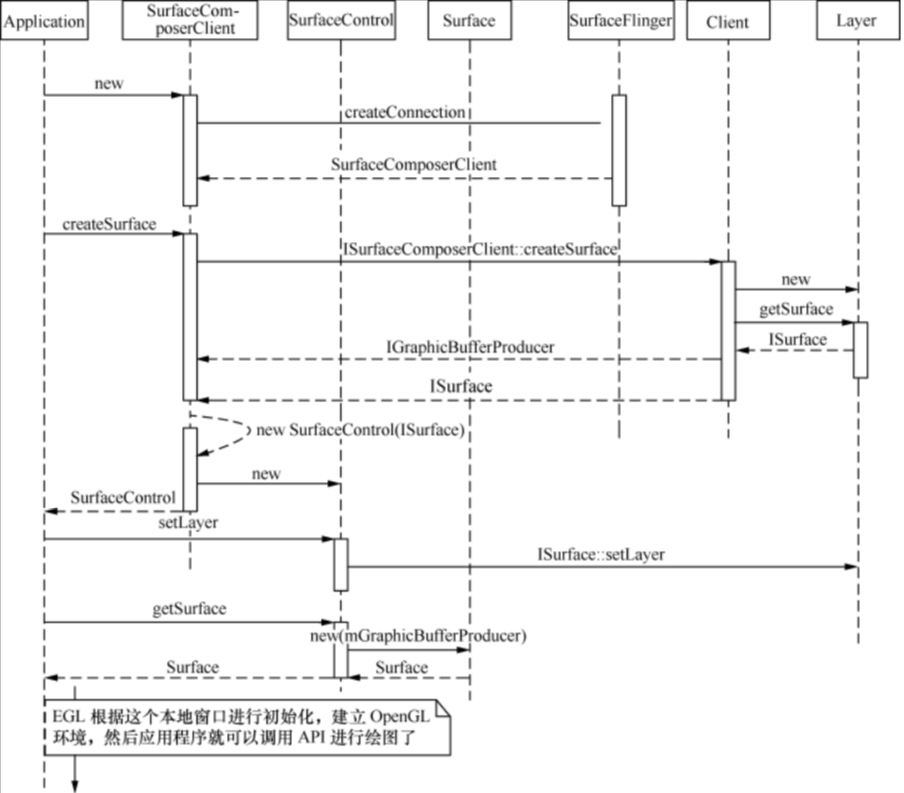

### 5.4 应用程序与 `BufferQueue` 的关系

现在我们已经明白了应用程序利用 `SurfaceFlinger` 进行绘制工作的大致流程，只不过在这个过程中直到最后才出现了 `BufferQueue`。

**那么，应用程序具体是如何借助 `BufferQueue` 来完成工作的呢？**

仔细观察不难发现，当应用程序端通过 `ISurfaceComposerClient::createSurface()` 来发起创建 `Surface` 的请求时，`SurfaceFlinger` 服务进程这边会创建一个 `Layer`。既然 `Layer` 代表了一个画面图层，那么它肯定需要存储 “图层数据” 的地方，因而我们选择以这里作为入口：

```cpp:no-line-numbers
/*frameworks/native/services/surfaceflinger/SurfaceFlinger.cpp*/
status_t SurfaceFlinger::createLayer(const String8& name, const sp<Client>& client,
        uint32_t w, uint32_t h, PixelFormat format, uint32_t flags,
        sp<IBinder>* handle, sp<IGraphicBufferProducer>* gbp)
{
    ..
    status_t result = NO_ERROR;
    sp<Layer> layer;

    switch (flags & ISurfaceComposerClient::eFXSurfaceMask) { // Layer类型，目前只有两种
        case ISurfaceComposerClient::eFXSurfaceNormal: // 普通 Layer
            result = createNormalLayer(client, name, w, h, flags, format, handle, gbp, &layer);
            break;
        case ISurfaceComposerClient::eFXSurfaceDim: // Dim 效果的 Layer
            result = createDimLayer(client, name, w, h, flags, handle, gbp, &layer);
            break;
        default:
            result = BAD_VALUE;
            break;
    }

    if (result == NO_ERROR) {
        addClientLayer(client, *handle, *gbp, layer); // 添加到全局的管理中
        setTransactionFlags(eTransactionNeeded); // 设置业务标志
    }
    return result;
}
```

这个函数用于生成一个 `Layer`。

```:no-line-numbers
从 enum 值定义来看，当前系统中有多达十几种 Layer 类型，只不过多数还没有真正实现。
目前能用的只有两个，即 eFXSurfaceNormal 和 eFXSurfaceDim。
1. 正常情况下的图层；
2. 带有 Dim 效果的图层。
更早前版本中还有一种 Blur 效果的 Layer。可能出于效率的考虑，当前系统中已经统一将它用 Dim 替代了。
相信在后续的 Android 版本中还会把它们再区分开来。
```

> 注意：
> 
> 高版本中 `SurfaceFlinger::createLayer` 的实现已有所不同。
> 
> 不管哪种类型的 `Layer`，都统一调用  `SurfaceFlinger::createBufferStateLayer`


最终返回给调用者的有两个：即 `handle` 和 `gbp`。前者是一个 `IBinder` 对象，后者则是大家熟悉的 `IGraphicBufferProducer`。

> 注意：
> 
> 高版本中 返回数据的封装形式也不太一样了。

`Layer` 和 `handle` 及 `gbp` 有什么联系呢？我们选取 `eFXSurfaceNormal` 类型的图层来深入分析：

```cpp:no-line-numbers
status_t SurfaceFlinger::createNormalLayer(const sp<Client>& client,
        const String8& name, uint32_t w, uint32_t h, uint32_t flags, PixelFormat& format,
        sp<IBinder>* handle, sp<IGraphicBufferProducer>* gbp, sp<Layer>* outLayer)
{
    // format 的赋值过程省略
    ...
    // 生成 Layer 对象
    *outLayer = new Layer(this, client, name, w, h, flags); 
    // 为 Layer 设置缓冲区
    status_t err = (*outLayer)->setBuffers(w, h, format, flags);
    if (err == NO_ERROR) {
        *handle = (*outLayer)->getHandle(); // handle 是通过这个函数获取的，后面我们再分析
        *gbp = (*outLayer)->getBufferQueue(); // gbp 是从 Layer 中取出来的
    }
    ALOGE_IF(err, "createNormalLayer() failed (%s)", strerror(-err));
    return err;
}
```

> 注意：
> 
> 高版本中，创建 `Layer` 对象的过程有所不同：
> 
> ```cpp:no-line-numbers
> /* frameworks/native/services/surfaceflinger/SurfaceFlinger.cpp */
> status_t SurfaceFlinger::createBufferStateLayer(
>                 LayerCreationArgs& args, sp<IBinder>* handle, sp<Layer>* outLayer) {
>     *outLayer = getFactory().createBufferStateLayer(args);
>     *handle = (*outLayer)->getHandle();
>     return NO_ERROR;
> }
> 
> /* frameworks/native/services/surfaceflinger/SurfaceFlingerDefaultFactory.cpp */
> sp<Layer> DefaultFactory::createBufferStateLayer(const LayerCreationArgs& args) {
>     // 调用构造函数 Layer::Layer(const surfaceflinger::LayerCreationArgs& args) 创建 Layer 对象
>     return sp<Layer>::make(args); 
> }
> 
> /* frameworks/native/services/surfaceflinger/Layer.cpp */
> void Layer::onFirstRef() {
>     mFlinger->onLayerFirstRef(this);
> }
> 
> /* frameworks/native/services/surfaceflinger/SurfaceFlinger.cpp */
> void SurfaceFlinger::onLayerFirstRef(Layer* layer) {
>     mNumLayers++;
>     if (!layer->isRemovedFromCurrentState()) {
>         mScheduler->registerLayer(layer); // 注意：高版本中，会把 Layer 注册到 Scheduler 中
>     }
> }
> ```
> 
> 并且，高版本中的 `Layer` 也没有提供 `Layer::getBufferQueue()` 函数了，只提供了 `Layer::getBuffer()` 函数
> 
> ```cpp:no-line-numbers
> /* frameworks/native/services/surfaceflinger/Layer.h */
> class Layer : public virtual RefBase 
> {
>     sp<GraphicBuffer> getBuffer() const;
> ```

`SurfaceFlinger::createNormalLayer` 这个函数的逻辑很简单：

```:no-line-numbers
新建 Layer 对象，
设置 Buffers 的属性（setBuffers），
然后分别通过 getHandle 和 getBufferQueue 获得 handle 及 gbp。
```

先来看看 `handle` 到底是何方 “神圣”：

```cpp:no-line-numbers
/* frameworks/native/services/surfaceflinger/Layer.cpp */
sp<IBinder> Layer::getHandle() {
    Mutex::Autolock _l(mLock);
    ..
    class Handle : public BBinder, public LayerCleaner { // Handle “真身” 在这里
    wp<const Layer> mOwner;
    public:
        Handle(const sp<SurfaceFlinger>& flinger, const sp<Layer>& layer)
            : LayerCleaner(flinger, layer), mOwner(layer) { // 空的，什么都没有
        }
    };
    return new Handle(mFlinger, this); // 新建一个 Handle 对象
}
```

由这段代码可以看出，`Handle` 几乎没有任何有用的内容。那么，其设计初衷是什么？

仔细观察可以发现，`Handle` 继承了 `LayerCleaner`。从字面意思来看，它是 “图层清理者”，清理时机如下所示：

```cpp:no-line-numbers
Layer::LayerCleaner::～LayerCleaner() {
    // destroy client resources
    mFlinger->onLayerDestroyed(mLayer);
}
```

也就是说，当 LayerCleaner（或者 Handle）进行析构操作时，会去主动调用 SurfaceFlinger 的 onLayerDestroyed 来收拾 “图层残局”。换句话说，一旦没有人引用此Handle对象，系统就会开始清理工作。

了解了 Handle 后，我们再来分析 Layer 中的另一个重要元素，即 BufferQueue：

```cpp:no-line-numbers
/* frameworks/native/services/surfaceflinger/Layer.cpp */
sp<BufferQueue> Layer::getBufferQueue() const {
    return mSurfaceFlingerConsumer->getBufferQueue();
}
```

`SurfaceFlinger` 自认为是 “`Consumer`” 还是比较贴切的。而这个消费者的另一个职责居然是提供 `Buffer` 空间，真是 “一条龙服务”。

我们可以来看看 `SurfaceFlinger` 是如何提供的 `BufferQueue`，其中又涉及多个类的继承，如下图所示。

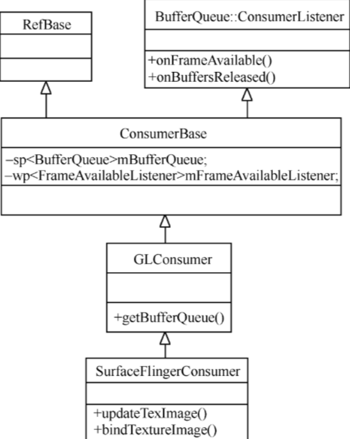

从图中可以看到，`SurfaceFlingerConsumer` 中真正持有 `BufferQueue` 对象的是成员变量 `ConsumerBase::mBufferQueu`e，那么这个变量又是怎么赋值的呢？其实还是在 `Layer` 中，即当有人第一次引用 `Layer` 时触发了它的 `onFirstRef`。此时：

```cpp:no-line-numbers
void Layer::onFirstRef()
{
    sp<BufferQueue> bq = new SurfaceTextureLayer(mFlinger);
    mSurfaceFlingerConsumer = new SurfaceFlingerConsumer(mTextureName, true, GL_TEXTURE_EXTERNAL_OES, false, bq);
```

这样就基本清楚了：

```:no-line-numbers
Layer 中直接或者间接地提供了 Handle 和 BufferQueue，而且两者都是匿名的 Binder Server。
当客户端应用程序调用 createSurface 时，它可以同时获取到这两个重要对象。
大家一定要记住，IGraphicBufferProducer 的 Server 端的实现是 BufferQueue。由于命名上的差异，这点很容易搞错。

因而应用程序与 BufferQueue 的关系就比较明朗了。
虽然中间经历了多次跨进程通信，但对于应用程序来说最终只使用到了 BufferQueue（通过 IGraphicBufferProducer）。
```

本小节可以从侧面证明如下几个关键点：

1. 应用程序可以调用 `createSurface` 来建立多个 `Layer`，它们是一对多的关系。

    ```:no-line-numbers
    理由就是 createSurface 中没有任何机制来限制应用程序的多次调用；
    相反，它会对一个应用程序多次申请而产生的 Layer 进行统一管理。如下所示：
    ```

    ```cpp:no-line-numbers
    status_t SurfaceFlinger::createLayer(...)
    {
        ...
        if (result == NO_ERROR) {    
            addClientLayer(client, *handle, *gbp, layer); // 添加新增的 Layer 到全局管理中
            setTransactionFlags(eTransactionNeeded);
        }
    ```

    ```:no-line-numbers
    为应用程序申请的 Layer，一方面需要告知 SurfaceFlinger，另一方面要记录到各 Client 内部中。
    这两个步骤是由 addClientLayer() 分别调用 Client::attachLayer() 和 SurfaceFlinger::addLayer_l() 来完成的：
    ```

    ```cpp:no-line-numbers
    void SurfaceFlinger::addClientLayer(const sp<Client>& client,const sp<IBinder>& handle,
            const sp<IGraphicBufferProducer>& gbc,const sp<Layer>& lbc)
    {
        // attach this layer to the client
        client->attachLayer(handle, lbc); // 让此 Layer 与 Client 相关联

        // add this layer to the current state list
        Mutex::Autolock _l(mStateLock);
        mCurrentState.layersSortedByZ.add(lbc); // 将 Layer 按顺序添加到全局变量中
        mGraphicBufferProducerList.add(gbc->asBinder()); // 将 gbc 也添加到全局变量中
    }
    ```

    ```:no-line-numbers
    对于 SurfaceFlinger，它需要对系统中当前所有的 Layer 进行 Z-Order 排序，以决定用户所能看到的 “画面” 是什么样的；
    对于 Client，它则利用内部的 mLayers 成员变量来逐一记录新增（attachLayer）和移除（detachLayer）的图层。
    从中不难看出，一个 Client 是可以包含多个 Layer 的。
    ```

2. 每个 `Layer` 对应一个 `BufferQueue`。换句话说，一个应用程序可能对应多个 `BufferQueue`。另外，`Layer` 没有直接持有 `BufferQueue` 对象，而是由其内部的 `mSurfaceFlingerConsumer` 来管理。
   
## 6 `SurfaceFlinger`

从本小节开始，我们正式切入 `SurfaceFlinger` 的分析。

为了保持讲解的连贯性，部分内容可能在前面的章节中已经有所涉及，接下来将会对其中的细节做更多的扩展讲解。

内容组织如下：

```:no-line-numbers
1. 首先介绍从 Android 4.1 版本起引入的一个新特性（Project Butter）。
    理解这个项目是必要的，可以说 SurfaceFlinger 有很大一部分内容就是围绕它展开的。
2. SurfaceFlinger 的启动过程及工作方式。
3. SurfaceFlinger 与 BufferQueue 及应用程序间的关系。
4. SurfaceFlinger 对 VSYNC 信号的处理过程（重点）。
```

### 6.1 “黄油计划”（`Project Butter`）

为什么会叫这个名字呢？

```:no-line-numbers
一个可能的原因就是这个 Project 的目的是改善用户抱怨最多的 Android 几大缺陷之一，即 UI 响应速度。
Google 希望这一新计划可以让 Android 系统摆脱 “UI交互” 上的 “滞后” 感，而能像加了黄油一般 “顺滑”。
```

`Google` 在 2012 年的 `I/O` 大会上宣布了这一计划，并在 `Android 4.1` 中正式搭载了具体的实现机制。

“黄油计划” 中有两个重要的组成部分，即 **`VSync` 和 `Triple Buffering`**。下面先分别介绍引入它们的原因。

当我们玩游戏或者看电影时，可能经常遇到以下情形。

```:no-line-numbers
某些游戏场面好像由几个场景 “拼凑” 而成。
电影画面不连贯，好像被 “割裂” 了。
```

这样描述有点抽象，我们引用 `wikipedia` 上的一张图来看下实际效果，如下图所示。


以时间为横坐标来描述接下来会发生的事情，如下图所示。

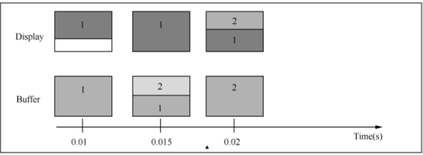

上半部分的方框表示在不同的时间点时显示屏的内容（加深的部分），下半部分则是同一时间点时 `Frame Buffer` 中的数据状态，编号表示第几个 `frame` 帧，不考虑清屏。

```:no-line-numbers
0.01秒
    由于两者速率相差不少，此时buffer中已经准备好了第 1 帧数据，而显示器只显示了第 1 帧画面的 2/3。

0.015秒
    第 1 帧画面在显示屏上终于完整地显示了出来，而此时 buffer 中有 1/3 的部分已经被填充上第 2 帧数据了。

0.02秒
    Buffer 中已经准备好了第 2 帧数据，而显示屏出现了 Screen Tearing，
    即：有三分之一的内容属于第 2 帧，其余的则来源于第 1 帧画面。
```

在单缓冲区的情况下，这个问题是很难规避的。所以之前我们介绍的双缓冲技术（[9.4.1.1 小节](#_9-4-1-1-构造函数中的初始化操作)），其基本原理就是采用了两块 `buffer`：

```:no-line-numbers
一块 Back Buffer 用于 CPU/GPU 后台绘制，
一块 Frame Buffer 用于屏幕显示；
```

当 `Back Buffer` 准备就绪后，它们才进行交换。

不可否认，双缓冲技术（`Double Buffering`）可以在很大程度上降低 `Screen Tearing` 类型的错误，但它是万能的吗？

**一个需要考虑的问题是：我们应该每隔多少时间点进行两个缓冲区的交换呢？**

```:no-line-numbers
假如是 Back Buffer 准备完成一帧数据以后就进行，那么如果此时屏幕还没有完整显示上一帧内容，肯定是会出问题的。
看来只能等到屏幕处理完一帧数据后，才可以执行这一操作。
```

一个典型的显示器有两个重要特性，即 “行频和场频”。

```:no-line-numbers
行频（Horizontal Scanning Frequency）又称为 “水平扫描频率”，是屏幕每秒钟从左至右扫描的次数；
场频（Vertical Scanning Frequency）也称为 “垂直扫描频率”，是每秒钟整个屏幕刷新的次数。

由此也可以得出它们的关系：行频 = 场频 * 纵坐标分辨率
```

当扫描完一个屏幕后，设备需要重新回到第一行以进入下一轮的循环，此时有一段时间空隙，称为 `Vertical Blanking Interval`（`VBI`）。

这个时间点就是我们进行缓冲区交换的最佳时间。因为此时屏幕没有在刷新，也就避免了交换过程中出现 `Screen Tearing` 的状况。

`Vsync`（垂直同步）是 `Vertical Synchronization` 的简写，它利用 `VBI` 时期出现的 `Vertical Sync Pulse` 来保证双缓冲能在最佳时间点进行交换。

> 所以说 `VSync` 这个概念并不是 `Google` 首创的，而是在早些年前的 `PC` 领域就已经出现了。不过 `Android 4.1` 赋予了它新的功用，稍后就可以看到。

上面我们讨论的情况其实是基于一个假设，即 “绘图速度大于显示速度”，那么当 “绘图速度小于显示速度” 呢？

先来分析绘图过程中当 “绘图速度小于显示速度”，且没有采用 `VSync` 同步时的情况，如下图所示。

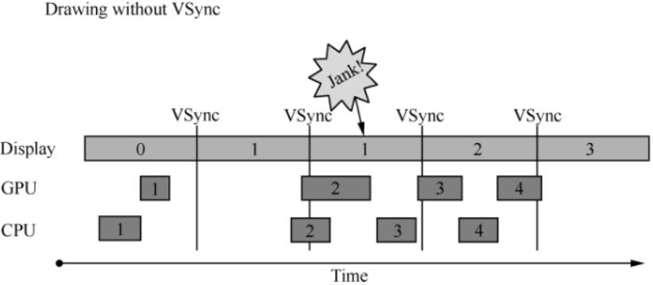

上图中有 3 个元素：

```:no-line-numbers
Display 表示显示屏幕，
GPU 和 CPU 负责渲染帧数据。每一帧以方框表示并以数字进行编号，如 0、1、2 等。
VSync 用于指导双缓冲区的交换。
```

以时间的顺序来看看当不采用 `VSync` 同步时将会发生什么异常。

```:no-line-numbers
Step1. 
    Display 显示第 0 帧数据，此时 CPU 和 GPU 渲染第 1 帧画面，而且赶在 Display 显示下一帧（帧1）前完成。
Step2. 
    因为渲染及时，Display 在第 0 帧显示完成后，也就是第 1 个 VSync 后，正常显示第 1 帧。
Step3. 
    由于某些原因（比如 CPU 资源被占用），系统没能及时地处理第 2 帧，而是等到第 2 个 VSync 到来前才开始处理。
Step4. 
    第 2 个 VSync 来临时，由于第 2 帧数据还没有准备就绪，实际显示的还是第 1 帧的内容。
    这种情况被 Android 开发组命名为 “Jank”。
Step5. 
    当第 2 帧数据准备完成后，它并不会立即被显示，而是要等待下一个 VSync。
```

所以总的来说，就是屏幕 “平白无故” 地重复显示了一次第 1 帧。

原因大家应该都看到了，就是 `CPU` 没有及时地着手处理第 2 帧的渲染工作，以致 “延误军机”。

`Android` 系统中一直存在着这个问题，直到 “黄油计划” 的引入。

从 `Android 4.1 Jelly Bean` 开始，`VSync` 得到了进一步的应用，即：系统在收到 `VSync Pulse` 后，将立即开始下一帧的渲染，如下图所示。

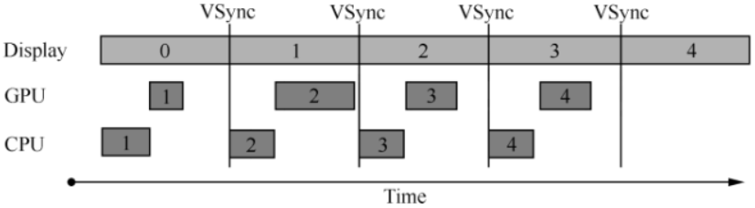

上图中展示的是采用 `VSync` 进行显示同步的情况。

```:no-line-numbers
一旦 VSync 信号出现，CPU 便不再犹豫，即刻开始执行 Buffer 的准备工作。
大部分的 Android 显示设备刷新频率是 60Hz，这也就意味着每一帧最多只能留给系统 1/60=16ms 左右的准备时间。
假如 CPU/GPU 的 FPS（Frames Per Second）高于这个值，那么这个方案是完美的，显示效果将很好。
```

可是我们没有办法保证所有设备的硬件配置都能达到要求。假如 `CPU/GPU` 的性能无法满足上图条件（即：`FPS` 低于屏幕刷新率），又会是什么情况呢？

在分析这一问题之前，我们先来看看采用 `VSync` 和双缓冲机制的情况，如下图所示。

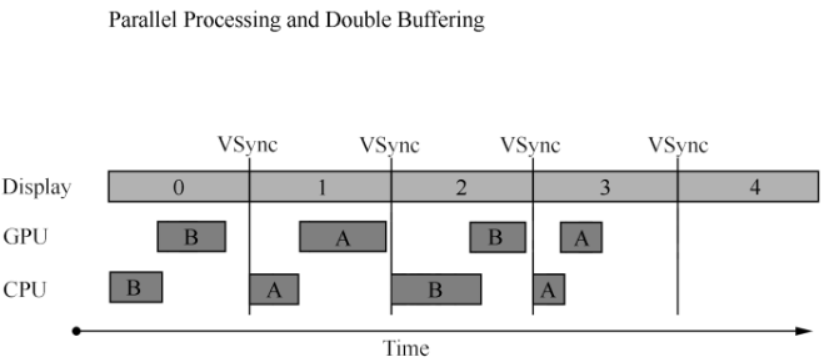

图中采用了双缓冲技术以及前面介绍的 `VSync` 同步机制，可以看到整个显示过程还是相当不错的。虽然 `CPU/GPU` 处理所用的时间时短时长，但总的来说都在 `16ms` 以内，因而不影响显示效果。

> `A` 和 `B` 分别代表两个缓冲区，它们不断地互相交换以保证画面的正确显示。

现在我们可以继续分析 `FPS` 低于屏幕刷新率的情况了，如下图所示。

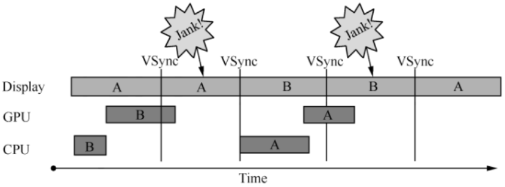

```:no-line-numbers
如果 CPU/GPU 的处理时间超过 16ms，那么第一个 VSync 到来时，缓冲区 B 中的数据还没有准备好，就只能继续显示之前 A 缓冲区中的内容。
而 B 完成后，又因为缺乏 VSync Pulse 信号，也只能等到下一轮才有机会交换了。
于是在这一过程中，有一大段时间是被浪费的。
当下一个 VSync 出现时，CPU/GPU 马上执行操作，此时它可操作的 Buffer 是 A，相应的显示屏对应的就是 B。这时看起来就是正常的。
只不过由于执行时间仍然超过 16ms，导致下一次应该执行的缓冲区交换又被推迟。
如此循环反复，便出现了越来越多的 “Jank”。
```

那么，有没有规避的办法呢？

```:no-line-numbers
很显然，第一次的 Jank 看起来是没有办法的，除非升级硬件配置来加快 FPS。
我们关注的重点是被 CPU/GPU 浪费的时间段怎么才能充分利用起来。
分析上述过程，造成 CPU/GPU 无事可做的假象是因为当前已经没有可用的 buffer 了。
```

换句话说，如果增加一个 `Buffer`，情况会不会好转呢？如下图所示。

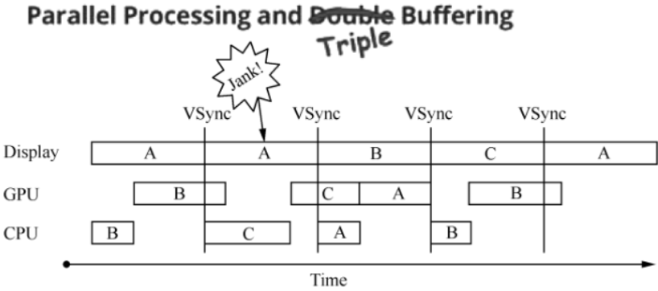

`Triple Buffering` 是 `Multiple Buffering` 的一种，指的是系统使用 3 个缓冲区用于显示工作。

我们逐步分析下这个新机制是否有效。

```:no-line-numbers
首先和预料中的一致，第一次 “Jank” 无可厚非。
不过当第一次 VSync 发生后，CPU 不用再等待了，它会使用第三个 Buffer C 来进行下一帧数据的准备工作。
虽然对缓冲区 C 的处理所需时间同样超过了 16ms，但这并不影响最终的显示，因为第二次 VSync 到来后，它选择 Buffer B 进行显示；
而到了第三次 VSync 时，它会接着采用 C，而不是像 Double Buffering 中所看到的只能再显示一遍 B。
这样就有效地降低了系统显示错误的概率。
```

> 前面小节我们看到 `BufferQueue` 中最多有 32 个 `BufferSlot`，不过在实际使用时的具体值是可以设置的。

`TARGET_DISABLE_TRIPLE_BUFFERING` 这个宏用于` Disable Triple Buffering`。如果宏打开的话，`Layer.cpp` 在 `onFirstRef` 有如下操作。

```cpp:no-line-numbers
#ifdef TARGET_DISABLE_TRIPLE_BUFFERING
#warning "disabling triple buffering"
    mSurfaceFlingerConsumer->setDefaultMaxBufferCount(2);
#else
    mSurfaceFlingerConsumer->setDefaultMaxBufferCount(3);
#endif
```

`mSurfaceFlingerConsumer::setDefaultMaxBufferCount` 将进一步调用 `BufferQueue::setDefaultMaxBufferCount`，然后把 `Buffer` 数（2 或者 3）保存到 `BufferQueue` 内部的 `mDefaultMaxBufferCount` 成员变量中。

对于应用程序来说，它也可以通过 `IGraphicBufferProducer::setBufferCount` 来告诉 `BufferQueue` 它所希望的 `Slot` 值，这个操作最终影响的是 `BufferQueue` 中的另一个成员变量 `mOverrideMaxBufferCount`（而不是 `mDefaultMaxBufferCount`）。默认情况下这个变量是 0，表示应用端不关心到底有多少 `Buffer` 可用。

在具体的实现中，以上两个变量都是要考虑到的，`BufferQueue` 会通过权衡各个值来选择最佳的解决方案。

### 6.2 `SurfaceFlinger` 的启动

`SurfaceFlinger` 的启动和 `ServiceManager` 有点类似，它们都属于系统的底层支撑服务，因而必须在设备开机的早期就运行起来：

```cpp:no-line-numbers
/*frameworks/base/cmds/system_server/library/System_init.cpp*/
extern "C" status_t system_init()
{
    ...    
    property_get("system_init.startsurfaceflinger", propBuf, "1");
    if (strcmp(propBuf, "1") == 0) {
        SurfaceFlinger::instantiate();
}
...
```

这个 `System_init.cpp` 会被编译到 `libsystem_server` 库中，然后由 `SystemServer` 在 `JNI` 层进行加载调用，从而启动包括 `SurfaceFlinger`，`SensorService` 等在内的系统服务。

> 高版本中的启动入口已所有不同，后续再更新。

`system_init` 调用 `instantiate` 来创建一个 `Binder Server`，名称为 `"SurfaceFlinger"`；而且强指针的特性让它在第一次被引用时触发了 `onFirstRef`：

```cpp:no-line-numbers
void SurfaceFlinger::onFirstRef()
{
    mEventQueue.init(this);//初始化事件队列
    run("SurfaceFlinger", PRIORITY_URGENT_DISPLAY);//启动一个新的业务线程
    mReadyToRunBarrier.wait();//等待新线程启动完毕
}
```

成员变量 `mEventQueue` 是一个 `MessageQueue` 类型的对象。既然有消息队列，那就一定会有配套的事件处理器 `Handler` 以及循环体 `Looper`，这些是在 `MessageQueue::init` 函数中创建的。即：

> 虽然 `Java` 层的消息循环机制与 `SurfaceFlinger` 中用到的有一定差异，但其本质原理是一样的。

```cpp:no-line-numbers
/*frameworks/native/services/surfaceflinger/MessageQueue.cpp*/
void MessageQueue::init(const sp<SurfaceFlinger>& flinger)
{
    mFlinger = flinger;
    mLooper = new Looper(true);
    mHandler = new Handler(*this);//此Handler类是SurfaceFlinger自己定义的，后面有讲解
}
```

> 高版本中的差异：
> 
> ```cpp:no-line-numbers
> /* frameworks/native/services/surfaceflinger/Scheduler/MessageQueue.cpp */
> MessageQueue::MessageQueue(ICompositor& compositor, sp<Handler> handler)
>       : mCompositor(compositor),
>         mLooper(sp<Looper>::make(kAllowNonCallbacks)),
>         mHandler(std::move(handler)) {}
> ```

也就是说，这个 `MessageQueue` 类不但提供了消息队列，其内部还囊括了消息的处理机制。

那么，这个 `Looper` 会在什么时候运行起来呢？
显然 `SurfaceFlinger` 需要先自行创建一个新的线程来承载这一 “业务”，否则就会阻塞 `SystemServer` 的主线程。

`SurfaceFlinger::onFirstRef` 函数最后的 `mReadyToRunBarrier.wait()` 也可以证明这一点，即：`mReadyToRunBarrier` 在等待一个事件，在事件没有发生前其所在的线程就会处于等待状态。

> 这是 `Android` 系统里两个线程间的一种典型交互方式。

由此可见，`SurfaceFlinger` 新启动的这个线程中一定还会调用 `mReadyToRunBarrier.open` 来为等待它的线程解禁。

这样我们也能推断出 `SurfaceFlinger` 一定是继承自 `Thread` 线程类的。如下所示：

```cpp:no-line-numbers
class SurfaceFlinger :public BinderService<SurfaceFlinger>,
    ...
    private Thread,
```

> 高版本中 `SurfaceFlinger` 不在继承 `Thread` 了，后续会更新对高版本的分析。

所以上面 `SurfaceFlinger::onFirstRef` 函数中可以调用 `Thread::run()` 方法来启动一个名为 `"SurfaceFlinger"` 的线程，并为其设置 `PRIORITY_URGENT_DISPLAY` 的优先级。这个优先级是在 `ThreadDefs.h` 中定义的，如下表所示。

|**Priority**|**Value**|**Description**|
|:-|:-|:-|
|`ANDROID_PRIORITY_LOWEST`|19|最低优先级|
|`ANDROID_PRIORITY_BACKGROUND`|10|用于 `Background Tasks`|
|`ANDROID_PRIORITY_NORMAL`|0|大部分线程都以这个优先级运行|
|`ANDROID_PRIORITY_FOREGROUND`|-2|用户正在交互线程的优先级|
|`ANDROID_PRIORITY_DISPLAY`|-4|UI 主线程优先级|
|`ANDROID_PRIORITY_URGENT_DISPLAY`|-8|这个值由 `HAL_PRIORITY_URGENT_DISPLAY` 来指定，当前版本中是 -8。只在部分紧急状态下使用|
|`ANDROID_PRIORITY_AUDIO`|-16|正常情况下的声音线程优先级|
|`ANDROID_PRIORITY_URGENT_AUDIO`|-19|紧急声音线程优先级（通常情况下不使用）|
|`ANDROID_PRIORITY_HIGHEST`|-20|最高优先级，禁止使用|
|`ANDROID_PRIORITY_DEFAULT`|0|默认情况下就是 ANDROID_PRIORITY_NORMAL|
|`ANDROID_PRIORITY_MORE_FAVORABLE`|-1|在上述各优先级定义的基础上，用于适当微调（加大）优先级|
|`ANDROID_PRIORITY_LESS_FAVORABLE`|+1|在上述各优先级定义的基础上，用于适当微调（减小）优先级|

> 数值越大的，优先级越小。
>
> 因为各等级间的数值并不是连续的，
> 
> 所以我们还可以通过表中最后的 `ANDROID_PRIORITY_MORE_FAVORABLE`(-1) 来适当地提高优先级；
> 
> 或者利用 `ANDROID_PRIORITY_LESS_FAVORABLE`(+1) 来降低优先级。

```:no-line-numbers
由此可见，SurfaceFlinger 工作线程所采用的优先级相对较高。
因为屏幕 UI 显示无疑是人机交互中与用户体验关联最直接的，任何滞后的响应速度都将大大降低产品的吸引力。
```

在执行了 `Thread::run()` 以后，`Thread` 会自动调用 `Thread::threadLoop()` 接口。即：

```cpp:no-line-numbers
bool SurfaceFlinger::threadLoop()
{
    waitForEvent();
    return true;
}
```

其中` waitForEvent()` 是 `SurfaceFlinger` 中的成员函数，它会进一步调用 `mEventQueue.waitMessage()`：

```cpp:no-line-numbers
/* 
    此函数在高版本中未发生变化，只是 MessageQueue 文件的路径发生了变化：
    frameworks/native/services/surfaceflinger/Scheduler/MessageQueue.cpp
*/
void MessageQueue::waitMessage() {
    do {
        IPCThreadState::self()->flushCommands();
        int32_t ret = mLooper->pollOnce(-1);
        switch (ret) {
            case ALOOPER_POLL_WAKE:
            case ALOOPER_POLL_CALLBACK:
                continue;
            case ALOOPER_POLL_ERROR:
                ALOGE("ALOOPER_POLL_ERROR");
            case ALOOPER_POLL_TIMEOUT:
                // timeout (should not happen)
                continue;
            default:
                // should not happen
                ALOGE("Looper::pollOnce() returned unknown status %d", ret);
                continue;
        }
    } while (true);
}
```

> 可以看到程序在这里进入了一个死循环，而且即便 `pollOnce` 的执行结果是 `ALOOPER_POLL_TIMEOUT`，也同样不会跳出循环。
> 
> 这是 `Android` 在对待严重错误时的一种普遍态度，即：如果不幸发生致命错误，就听天由命吧。

**`mLooper->pollOnce(-1)`** 在内部调用 `MessageQueue::mHandler` 来处理消息：

> 注意：`pollOnce` 函数同样使用了一个死循环，它不断地读取消息进行处理。

`MessageQueue` 是消息循环处理机制的管理者，其下包含了一个 `Looper` 和一个 `Handler`。`Looper` 中的 `mMessageEnvelope` 才是真正存储消息的地方。

> 高版本中，`Looper` 的文件位置如下：
> 
> ```:no-line-numbers
> system/core/libutils/include/utils/Looper.h
> system/core/libutils/Looper.cpp
> ```

这样就构建了一个完整的循环消息处理框架，`SurfaceFlinger` 就是基于这个框架来完成各个应用程序的显示请求的。

`MessageQueue::mHandler` 并非我们在消息机制中认识的那个 `Handler`，而是 `MessageQueue` 中自定义的一个事件处理器，即它是专门为 `SurfaceFlinger` 设计的：

```cpp:no-line-numbers
/*frameworks/native/services/surfaceflinger/MessageQueue.cpp*/
void MessageQueue::Handler::handleMessage(const Message& message) {
    switch (message.what) {
      case INVALIDATE:
           android_atomic_and(～eventMaskInvalidate, &mEventMask);
           mQueue.mFlinger->onMessageReceived(message.what);
           break;
      case REFRESH:
           android_atomic_and(～eventMaskRefresh, &mEventMask);
           mQueue.mFlinger->onMessageReceived(message.what);
           break;
      case TRANSACTION:
           android_atomic_and(～eventMaskTransaction, &mEventMask);
           mQueue.mFlinger->onMessageReceived(message.what);
           break;
    }
}
```

如上述代码段所示，当 `mHandler` 收到 `INVALIDATE`，`REFRESH` 及 `TRANSACTION` 的请求时，将进一步回调 `SurfaceFlinger` 中的 `onMessageReceived`。等于绕了一个大圈，又回到 `SurfaceFlinger` 中了。

> 高版中的差异：`SurfaceFlinger::onMessageReceived` 被 `Scheduler::onFrameSignal` 替代。
> 
> ```cpp:no-line-numbers
> /* frameworks/native/services/surfaceflinger/Scheduler/MessageQueue.cpp */
> void MessageQueue::Handler::handleMessage(const Message&) {
>     mFramePending.store(false);
>     /*
>         mQueue 是 MessageQueue 的实现类 Scheduler
>         [class Scheduler : public IEventThreadCallback, android::impl::MessageQueue]
>         头文件路径：frameworks/native/services/surfaceflinger/Scheduler/Scheduler.h
>         
>     */
>     mQueue.onFrameSignal(mQueue.mCompositor, mVsyncId, mExpectedVsyncTime);
> }
> ```

### 6.3 接口的服务端 —— `Client`

`SurfaceFlinger` 运行于 `SystemServer` 这一系统进程中，需要显示 `UI` 界面的应用程序则通过 `Binder` 服务与它进行跨进程通信。每个应用程序在 `SurfaceFlinger` 中都有 `Client` 为其提供服务。

`Client` 这个类名并没有完全表达出它的真正含义，因为在 `Android` 系统的很多其他地方都可以找到同名的类。

应用程序与 `Client` 间的 `Binder` 接口是 `ISurfaceComposerClient`，所以作为接口的服务端实现，`Client` 继承自 `BnSurfaceComposerClient`：

```cpp:no-line-numbers
/*frameworks/native/include/gui/ISurfaceComposerClient.h*/
class ISurfaceComposerClient : public IInterface
{   
    ...
    virtual status_t createSurface(const String8& name, uint32_t w, uint32_t h, PixelFormat format,
                        uint32_t flags, sp<IBinder>* handle, sp<IGraphicBufferProducer>* gbp) = 0;

    virtual status_t destroySurface(const sp<IBinder>& handle) = 0;
};
```

上述接口方法中最重要的两个是 `createSurface()` 和 `destroySurface()`，分别用于向 `SurfaceFlinger` 申请和销毁一个 `Surface`。

> 更早期版本的系统中 `createSurface` 返回的是一个叫作 `ISurface` 的 `Binder` 接口，目前已经不复存在。
> 
> 但 `createSurface` 这个函数名称还没有变。**我们可以认为 `Surface` 在服务器端对应的是 `Layer`**。

值得一提的是，`SurfaceFlinger` 的客户端程序拥有的 `Surface` 数量很可能不止一个。

```:no-line-numbers
通常情况下，同一个 Activity 中的 UI 布局共用系统分配的 Surface 进行绘图，
但像 SurfaceView 这种 UI 组件却是特例 —— 它独占一个 Surface 进行绘制。
```

换句话说，如果我们制作一个带 `SurfaceView` 的视频播放器，其所在的应用程序最终就会有不止一个的 `Surface` 存在。

> 这样的设计是必需的，因为播放视频对刷新频率要求很高，采用单独的 `Surface` 既可以保证视频的流畅度，同时也可以让用户的交互动作（比如触摸事件）得到及时的响应。

下面我们从源码角度来分析客户端与 `SurfaceFlinger` 连接并创建 `Layer` 的两个重要接口。

#### 6.3.1 `SurfaceFlinger::createConnection`

`Client` 属于匿名 `Binder` 服务，外界的进程不可能直接获取到，因而它首先需要借助于 `SurfaceFlinger` 这一实名 `Binder Server`。源码实现如下：

```cpp:no-line-numbers
sp<ISurfaceComposerClient> SurfaceFlinger::createConnection()
{
    sp<ISurfaceComposerClient> bclient;
    sp<Client> client(new Client(this));
    status_t err = client->initCheck();
    if (err == NO_ERROR) {
        bclient = client;
    }
    return bclient;
}
```

首先生成一个 `Client` 本地对象，然后调用 `initCheck` 进行必要的有效性检查（当前实现中直接返回 `NO_ERROR`）。

如果 `initCheck` 没有错误，程序就会把新生成的 `Client` 对象以 `ISurfaceComposerClient` 强指针的形式返回。

这样应用程序内部就拥有一个 `Client` 服务了。

> 高版本的差异：
> 
> ```cpp:no-line-numbers
> /* frameworks/native/services/surfaceflinger/SurfaceFlinger.cpp */
> binder::Status SurfaceComposerAIDL::createConnection(sp<gui::ISurfaceComposerClient>* outClient) {
>     const sp<Client> client = sp<Client>::make(mFlinger); // 创建 Client 对象
>     if (client->initCheck() == NO_ERROR) {
>         *outClient = client; // 将 Client 对象以 ISurfaceComposerClient 强指针的形式返回
>         ...
>         return binder::Status::ok();
>     } else {
>         *outClient = nullptr;
>         return binderStatusFromStatusT(BAD_VALUE);
>     }
> }
> ```

#### 6.3.2 `Client::createSurface`

`Client` 只是 `SurfaceFlinger` 分派给应用程序的一个 “代表”，真正的图形层（`Layer`）创建需要另外申请，即调用 `Client` 提供的 `createSurface` 接口。这个接口的实现在前几个小节已经有过粗略的分析，下面再从 `SurfaceFlinger` 的角度来审视下：

```cpp:no-line-numbers
/* frameworks/native/services/surfaceflinger/Client.cpp */
status_t Client::createSurface(const String8& name, uint32_t w, uint32_t h, 
            PixelFormat format, uint32_t flags,sp<IBinder>* handle, sp<IGraphicBufferProducer>* gbp)
{
    class MessageCreateLayer : public MessageBase {
        SurfaceFlinger* flinger; // SurfaceFlinger 服务
        Client* client; // 表明此消息来源于哪个 Client
        sp<IBinder>* handle; // 与 Layer 相对应的 Handle
        sp<IGraphicBufferProducer>* gbp; // 与 Layer 相对应的 gbp
        status_t result;
        const String8& name;
        uint32_t w, h;
        PixelFormat format;
        uint32_t flags;
    public:
        MessageCreateLayer(SurfaceFlinger* flinger, const String8& name, Client* client, uint32_tw,
                           uint32_t h, PixelFormat format, uint32_t flags,
                           sp<IBinder>* handle, sp<IGraphicBufferProducer>* gbp)
            : flinger(flinger), client(client), handle(handle), gbp(gbp),
              name(name), w(w), h(h), format(format), flags(flags) {
        }
        status_t getResult() const { return result; }
        virtual bool handler() { // SurfaceFlinger 将回调这个 handler 来执行具体的事务
            result = flinger->createLayer(name, client, w, h, format, flags, handle, gbp);
            return true;
        }
    };

    sp<MessageBase> msg = new MessageCreateLayer(mFlinger.get(),
            name, this, w, h, format, flags, handle, gbp); // 生成一个消息
    mFlinger->postMessageSync(msg); // 将这一 Message 推送到 SurfaceFlinger 线程中
    return static_cast<MessageCreateLayer*>(msg.get() )->getResult(); // 返回结果
}
```

> 值得注意的是，`createSurface` 这个函数需要从 `OpenGL ES` 的环境线程中被调用，这样它才能访问到后者提供的服务。

这个函数比较特别的地方，是它先在内部创建了一个 `MessageCreateLayer` 类，剩余部分代码就是围绕这个类来展开的。

`MessageCreateLayer` 继承自 `MessageBase`，所以 `MessageCreateLayer` 是一个 `Message` 的承载体，并且内部提供了处理这条 `Message` 的 `handler()` 函数。

在 `Client::createSurface` 函数最后调用 `SurfaceFlinger::postMessageSync` 将一个 `MessageCreateLayer` 对象 `msg` 发送到了 `SurfaceFlinger` 中。

函数 `SurfaceFlinger::postMessageSync` 通过 `mEventQueue` 将 `msg` 压入其消息队列中，并且会进入等待状态。代码如下：

```cpp:no-line-numbers
status_t SurfaceFlinger::postMessageSync(const sp<MessageBase>& msg,nsecs_t reltime, uint 32_t flags) {
    status_t res = mEventQueue.postMessage(msg, reltime);
    if (res == NO_ERROR) {
        msg->wait();
    }
    return res;
}
```

`MessageBase::wait()` 调用内部的 `Barrier::wait` 来实现等待，这意味着发送消息的线程将暂时停止执行，那么什么时候才能继续呢？显然得先唤醒它才行。这个唤醒的地方隐藏在 `MessageBase::handleMessage()` 中。即：

```cpp:no-line-numbers
/* frameworks/native/services/surfaceflinger/MessageQueue.cpp */
void MessageBase::handleMessage(const Message&) {
    this->handler();
    barrier.open();
};
```

总的来说，就是 `Client` 一旦收到来自客户端的请求，并不会马上让 `SurfaceFlinger` 执行，而是间接地把请求先投递到后者的消息队列中，这样一方面保证这个请求不会丢失，另一方面也使 `SurfaceFlinger` 不至于中断当前的操作。

绕了一圈，其实 `Client::createSurface` 函数的作用就是通过执行 `SurfaceFlinger::createLayer` 函数来创建 `Layer`。

> `SurfaceFlinger::createLayer` 创建图层的过程分析见 [9.5.4 应用程序与 BufferQueue 的关系](#_9-5-4-应用程序与-bufferqueue-的关系) 小节。

## 7 `VSync` 的产生和处理

`VSync` 同步是从 `Android 4.1` 开始引入的显示系统新特性，也是 “黄油计划” 的一个重要核心。

在 [9.6.1 “黄油计划”](#_9-6-1-黄油计划-project-butter) 小节中，我们从理论的角度分析了采用这一机制的必要性和运作机理，那么 `SurfaceFlinger` 具体是如何实施的呢？

先来思考一下 `SurfaceFlinger` 实现 `VSync` 同步有哪些要点：

```:no-line-numbers
VSync 信号的产生和分发
    如果有硬件主动发出这一信号，那是最好的；
    否则就得通过软件模拟产生。

VSync 信号的处理
    当信号产生后，SurfaceFlinger 如何在最短的时间内做出响应。
    另外，具体的处理流程是怎样的。
```

### 7.1 `VSync` 信号的产生和分发

`Android` 源码工程的 `surfaceflinger` 目录下有一个 `displayhardware` 文件夹，其中 `HWComposer` 的主要职责之一，就是用于产生 `VSync` 信号：

```cpp:no-line-numbers
/* frameworks/native/services/surfaceflinger/displayhardware/HWComposer.cpp */
HWComposer::HWComposer(const sp<SurfaceFlinger>& flinger, EventHandler& handler)
      : mFlinger(flinger), mFbDev(0), mHwc(0), mNumDisplays(1), mCBContext(new cb_context),
      mEventHandler(handler), mVSyncCount(0), mDebugForceFakeVSync(false)
{
    ...
    char value[PROPERTY_VALUE_MAX];
    property_get("debug.sf.no_hw_vsync", value, "0"); // 获取系统属性
    mDebugForceFakeVSync = atoi(value);
    bool needVSyncThread = true; // 是否需要软件模拟产生 VSync 信号，默认是 true
    ...    
    loadHwcModule();// 打开 HWC 的 HAL 模块
    ...  
    if (mHwc) {
        ...
        if (mHwc->registerProcs) {// 注册硬件回调事件
            mCBContext->hwc = this;
            mCBContext->procs.invalidate = &hook_invalidate;
            mCBContext->procs.vsync = &hook_vsync;
            if (hwcHasApiVersion(mHwc, HWC_DEVICE_API_VERSION_1_1))
                mCBContext->procs.hotplug = &hook_hotplug;
            else
                mCBContext->procs.hotplug = NULL;
            memset(mCBContext->procs.zero, 0, sizeof(mCBContext->procs.zero));
            mHwc->registerProcs(mHwc, &mCBContext->procs);
        }


        // don't need a vsync thread if we have a hardware composer
        needVSyncThread = false;//不需要软件模拟
        ...
    }
    ...
    if (needVSyncThread) { // 如果需要软件模拟 VSync 信号的话，启动一个 VSyncThread 线程
        // we don't have VSYNC support, we need to fake it
        mVSyncThread = new VSyncThread(*this);
    }
}
```

这个函数的核心就是决定 `VSync` 的 “信号发生源” —— 硬件实现或者软件模拟。

```:no-line-numbers
假如当前系统可以成功地加载名称为 HWC_HARDWARE_MODULE_ID="hwcomposer" 的 HAL 模块，
并且通过这个库模块能顺利打开设备（hwc_composer_device_t），其版本号又大于 HWC_DEVICE_API_VERSION_1_1，
我们就采用 “硬件源”（此时 needVSyncThread 为 false）；
否则需要创建一个新的 VSync 线程来模拟产生信号。
```

> 高版本的差异：`HWComposer` 中产生信号发生源的代码存在差异：
> 
> ```cpp:no-line-numbers
> /* frameworks/native/services/surfaceflinger/DisplayHardware/HWComposer.cpp */
> HWComposer::HWComposer(const std::string& composerServiceName)
>       : HWComposer(Hwc2::Composer::create(composerServiceName)) {}
> 
> /* frameworks/native/services/surfaceflinger/DisplayHardware/ComposerHal.cpp */
> std::unique_ptr<Composer> Composer::create(const std::string& serviceName) {
>     if (AidlComposer::isDeclared(serviceName)) {
>         return std::make_unique<AidlComposer>(serviceName);
>     }
>     return std::make_unique<HidlComposer>(serviceName);
> }
> ```

#### 7.1.1 硬件源

> 高版本存在差异，后续再更新。

如果 `mHwc->registerProcs` 不为空，我们注册硬件回调 `mCBContext.procs`。定义如下：

```cpp:no-line-numbers
/* frameworks/native/services/surfaceflinger/SurfaceFlinger.cpp */
status_t SurfaceFlinger::readyToRun()
{
    ...
    mHwc = new HWComposer(this,*static_cast<HWComposer::EventHandler *>(this));
```

从中可以看出，`HWComposer` 中的 `mEventHandler` 就是 `SurfaceFlinger` 对象，
所以 `SurfaceFlinger` 必须要继承自 `HWComposer::EventHandler`，这样才能处理 `callback` 函数 `onVSyncReceived`：

```cpp:no-line-numbers
class SurfaceFlinger : public BinderService<SurfaceFlinger>, ..., private HWComposer::EventHandler
```

#### 7.1.2 软件源

软件源和硬件源相比最大区别是它需要启动一个新线程 `VSyncThread`，其运行优先级与 `SurfaceFlinger` 的工作线程是一样的。

> 从理论的角度来讲，任何通过软件定时来实现的机制都不可能是 100% 可靠的，即使优先级再高也可能出现延迟和意外。
> 
> 不过如果 “不可靠” 的概率很小，而且就算出现意外时也不至于是致命错误，那么还是可以接受的。
> 
> 所以说 `VSyncThread` 从实践的角度来讲，的确起到了很好的作用。

来看看 `VSyncThread` 都做了些什么工作：

```cpp:no-line-numbers
bool HWComposer::VSyncThread::threadLoop() {
   /* Step1. 判断系统是否使能了 VSync 信号发生机制 */
    { // 自动锁控制范围
        Mutex::Autolock _l(mLock);
        while (!mEnabled) {//VSync信号开关
            mCondition.wait(mLock);
        }
    }
    /* Step2. 计算需要产生 VSync 信号的时间点 */
    const nsecs_t period = mRefreshPeriod; // 信号的产生间隔
    const nsecs_t now = systemTime(CLOCK_MONOTONIC);
    nsecs_t next_vsync = mNextFakeVSync; // 产生信号的时间
    nsecs_t sleep = next_vsync - now; // 需要休眠的时长
    if (sleep < 0) {//已经过了时间点
        sleep = (period - ((now - next_vsync) % period));
        next_vsync = now + sleep;
    }
    mNextFakeVSync = next_vsync + period; // 下一次的 VSync 时间
    struct timespec spec;
    spec.tv_sec  = next_vsync / 1000000000;
    spec.tv_nsec = next_vsync % 1000000000;


    int err;
    do {
        err = clock_nanosleep(CLOCK_MONOTONIC, TIMER_ABSTIME, &spec, NULL); // 进入休眠
    } while (err<0 && errno == EINTR);


    if (err == 0) {
        mHwc.mEventHandler.onVSyncReceived(0, next_vsync); // 和硬件源是一样的回调
    }
    return true;
}
```

```:no-line-numbers
Step1@VSyncThread::threadLoop

mEnabled 是用于控制是否产生 VSync 信号的一个使能变量。
当系统希望关闭 VSync 信号发生源时，可以调用 VSyncThread::setEnabled(false)；否则调用 setEnabled (true)。
假如 mEnabled 为 false，VSyncThread 就处于等待状态，直到有人再次使能这个线程。
```

```:no-line-numbers
Step2@VSyncThread::threadLoop

接下来的代码用于真正产生一个 VSync 信号。可以思考一下，无非就是以下步骤：
1. 计算下一次产生 VSync 信号的时间；
2. 进入休眠；
3. 休眠时间到了后，发出 VSync 信号，通知感兴趣的人；
4. 循环往复。
```

变量 `mRefreshPeriod` 指定了产生 `VSync` 信号的间隔。它的计算过程分为几种情况：

```:no-line-numbers
1. 首选是从硬件设备获得真实的值；
2. 否则就采用如下办法：
    if (disp.refresh == 0) {
        disp.refresh = nsecs_t(1e9 / mFbDev->fps);
    }
    if (disp.refresh == 0) {
        disp.refresh = nsecs_t(1e9 / 60.0);
    }

也就是说从硬件设备获取不到后，取值先由 nsecs_t(1e9 / mFbDev->fps) 计算得到的
如果还不行，那就只能采用默认值了，即：nsecs_t(1e9 / 60.0)，此时，mRefreshPeriod 差不多是 16ms
```

因为 `mNextFakeVSync` 代表的是 “下一次” 产生信号的时间点，所以首先通过 `next_vsync = mNextFakeVSync` 来确定 `next_vsync` 的值。

接着计算 `sleep`，也就是距离产生信号的时间点还有多长（同时也是需要休眠的时间）。

那么，如果 `sleep` 的结果小于 0 呢？代表我们已经错过了这一次产生信号的最佳时间点（这是有可能发生的）。

在这种情况下，就只能计算下一个最近的 `VSync` 离现在还剩多少时间。公式如下：

```:no-line-numbers
sleep = (period - ((now - next_vsync) % period));
```

我们采用这个公式的依据如下图所示。

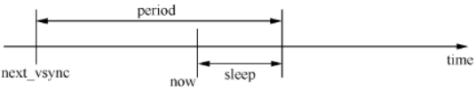

> 上图的前提是 `now` 超时时间不能超过一个 `period`，因而 `sleep` 公式中还要加上 `%period`。

计算完成 `sleep` 后，`mNextFakeVSync = next_vsync + period`。

```:no-line-numbers
这是因为 mNextFakeVSync 代表的是下一次 threadLoop 需要用到的时间点，
而 next_vsync 是指下一次（最近一次）产生 VSync 的时间点。
```

这样我们就计算出来下一次产生信号的时间点了，那么如何在指定的时间点产生信号呢？有两种方法：

```:no-line-numbers
其一是采用定时器回调；
其二就是采用休眠的形式主动等待
```

> `HWCompose` 采用休眠的形式主动等待。

可想而知这里对时间精度的要求比较高，所以采用的单位是 `nanosecond`，即纳秒级。

> 函数 `clock_nanosleep` 的第一个入参是 `CLOCK_MONOTONIC`，这种类型的时钟更加稳定，且不受系统时间的影响。

休眠时间一到，表示产生信号的时刻到了。根据前面的分析，就是通过 `mEventHandler.onVSyncReceived()` 回调来通知对消息感兴趣的人，无论软件还是硬件发生源，其回调方式都是一样的。

> 高版本中通过 `IComposerCallback::onVsync` 回调来通知 `Vsync` 信号的产生。
    
当产生完一次信号后，`VSyncThread::threadLoop` 这个函数就直接返回 `true` 了。

> 怎么没有看到循环的地方？这是因为当 `threadLoop` 返回值 `true` 时，它将被系统再一次调用，如此循环往复。

**接下来我们分析下 `SurfaceFlinger` 是如何处理这个 `VSync` 信号的。**

在 `SurfaceFlinger::onVSyncReceived` 中：

```cpp:no-line-numbers
void SurfaceFlinger::onVSyncReceived(int type, nsecs_t timestamp) {
    ...
    if (uint32_t(type) < DisplayDevice::NUM_DISPLAY_TYPES) {
        // we should only receive DisplayDevice::DisplayType from the vsync callback        
        mEventThread->onVSyncReceived(type, timestamp); // EventThread 是什么？
    }
}
```

`SurfaceFlinger` 直接调用了 `EventThread` 的 `onVSyncReceived` 实现。

从名称上可以猜测到，`EventThread` 是 `SurfaceFilnger` 中专门用于处理事件的线程。这个 `EventThread` 线程对象是在 `SurfaceFlinger::readyToRun` 生成的：

```cpp:no-line-numbers
status_t SurfaceFlinger::readyToRun()
{
    ...
    mEventThread = new EventThread(this);
    mEventQueue.setEventThread(mEventThread); // EventQueue 与 EventThread 进行了绑定
```

`EventThread` 的启动并不是由 `SurfaceFlinger` 决定的，而是取决于引用它的人，因为 `EventThread` 继承自 `Thread`，后者又是 `RefBase` 的子类，所以当第一次有人用智能指针引用它时，会自动调用 `onFirstRef` 函数，继而把这个线程 `run` 起来。

> `EventThread` 线程优先级为 `PRIORITY_URGENT_DISPLAY + PRIORITY_MORE_FAVORABLE`。

> 高版本的差异：
> 
> ```:no-line-numbers
> SurfaceFlinger 不再直接引用 EventThread， 而是把 EventThread 保存在了 Scheduler::mConnections 中，
> Scheduler::mConnects 是一个 Map 集合，存放 <ConnectionHandle, Connection> 键值对，
> 键值对中，Connection 持有 EventThread 对象的引用。外界通过 ConnectionHandle 从 Scheduler 中获取 Connection。
> 
> 涉及到的函数：
>     Scheduler::createEventThread
>     Scheduler::createConnection
>     EventThread::createEventConnection
> ```

介绍了 `EventThread` 的创建和启动过程后，再来看看它是如何处理消息的：

```cpp:no-line-numbers
/* frameworks/native/services/surfaceflinger/EventThread.cpp*/
void EventThread::onVSyncReceived(int type, nsecs_t timestamp) {…    
    Mutex::Autolock _l(mLock);
    if (type < HWC_NUM_DISPLAY_TYPES) { // 显示类型目前有两种
        mVSyncEvent[type].header.type = DisplayEventReceiver::DISPLAY_EVENT_VSYNC;
        mVSyncEvent[type].header.id = type;
        mVSyncEvent[type].header.timestamp = timestamp;
        mVSyncEvent[type].vsync.count++;
        mCondition.broadcast(); // 条件满足，唤醒谁？
    }
}
```

`EventThread::onVSyncReceived` 函数对 `mVSyncEvent[type]` 数组中的 `DisplayEventReceiver::Event` 对象的成员进行数据填充（包括：`Event` 类型、时间戳、信号计数等）。

最重要的是，`EventThread::onVSyncReceived` 函数最后通过 `mCondition.broadcast()` 来通知等待 `Event` 的人 —— 会是谁呢？没错，是 `EventThread` 所在的线程。

可能有人会觉得奇怪，`onVSyncReceived` 不就是属于 `EventThread` 吗，怎么还能处于等待中？

```:no-line-numbers
由上面的分析可以看出，
EventThread::onVSyncReceived 其实是由 SurfaceFlinger 所在线程调用的，所以它的执行也是由 SurfaceFlinger 所在线程完成的。
不过 onVSyncReceived 并没有对信号做具体的处理。打个比方：
    SurfaceFlinger 线程只是到了 EventThread 家的厨房（onVSyncReceived）里，
    然后把 “食材” 通过 DisplayEventReceiver::Event 准备好，放在 mVSyncEvent 中，
    然后唤醒正在等待的 EventThread —— 东西都准备好了，开动吧！
    于是接下来的处理工作就正式移交到 EventThread 线程了。
```

这点我们从下面这个代码段中也能得到验证：

```cpp:no-line-numbers
bool EventThread::threadLoop() {
    DisplayEventReceiver::Event event;
    Vector< sp<EventThread::Connection>> signalConnections;
    signalConnections = waitForEvent(&event); // EventThread 就是在这里面开始等待的
    const size_t count = signalConnections.size();
    for (size_t i=0 ; i<count ; i++) { // 开始 dispatch 消息给所有感兴趣的人
        const sp<Connection>& conn(signalConnections[i]);
        status_t err = conn->postEvent(event); // 通过 Connection “通道” 通知对方
        ...
    }
    return true; // 返回 true 后系统将再次调用 threadLoop
}
```

> 高版本的代码存在差异，但流程类似：
> 
> ```cpp:no-line-numbers
> /* frameworks/native/services/surfaceflinger/Scheduler/EventThread.cpp */
> void EventThread::threadMain(std::unique_lock<std::mutex>& lock) {
>     DisplayEventConsumers consumers;
> 
>     while (mState != State::Quit) {
>         std::optional<DisplayEventReceiver::Event> event;
> 
>         // Determine next event to dispatch.
>         if (!mPendingEvents.empty()) {
>             event = mPendingEvents.front();
>             mPendingEvents.pop_front();
>             ...
>         }
>         ...
>         if (!consumers.empty()) {
>             dispatchEvent(*event, consumers); // dispatch 消息给所有感兴趣的人
>             consumers.clear();
>         }
>         ...
>         if (!mPendingEvents.empty()) { // mPendingEvents 中还有未处理完的 DisplayEventReceiver::Event
>             continue;
>         }
>         if (mState == State::Idle) {
>             mCondition.wait(lock); // 等待 VSync 信号的到来
>         } 
>         ...
>     }
>     // cancel any pending vsync event before exiting
>     mVsyncRegistration.cancel();
> }
> ```

`EventThread` 线程在 `mCondition.broadcast()` 得到唤醒。接着 `EventThread` 会统计所有对 `Event` 感兴趣的人，即记录在 `signalConnections` 中的元素。然后它通过与这些元素间的纽带（`Connection`）来通知它们有事件发生了。

变量 `signalConnections` 是在 `waitForEvent` 中准备的，根据 `Event` 的实际情况从 `EventThread` 的全局变量 `mDisplayEventConnections` 中挑选出来的。换句话说，所有对 `Event` 感兴趣的人都需要被记录到 `mDisplayEventConnections` 中。具体而言，有两种类型的 “忠实听众”：

```:no-line-numbers
1. SurfaceFlinger
毋庸置疑，SurfaceFlinger 一定会收听 VSync 信号的产生。
这一工作由它内部的 EventQueue，即 “事件队列管家” 来完成。
当 SurfaceFlinger::readyToRun 中生成 EventThread 对象后，
会马上调用 MessageQueue::setEventThread 来把它设置到内部的 mEventThread 变量中；
同时，MessageQueue 还会通过接口 EventThread::createEventConnection 来创建一个 Connection 连接。

2. 需要刷新 UI 的各进程
SurfaceFlinger 只是负责最后的 UI 数据合成，而各应用程序才是真正的数据生产者，所以它们也必定是要监听 VSync 信号的。
SurfaceFlinger 提供了 createDisplayEventConnection 接口来满足各应用程序的需求，
这个接口同样调用了 EventThread::createEventConnection 来创建一个 Connection 连接。
```

那么，什么情况下这些创建的 `Connection` 会添加到 `EventThread` 的 `mDisplayEventConnections` 中呢？

```:no-line-numbers
当这些 Connection 被第一次引用的时候，它会自动调用 registerDisplayEventConnection 来注册到 EventThread 中。
```

### 7.2 `VSync` 信号的处理

经过上一小节的分析，现在我们已经明白了系统是如何通过硬件设备或者软件模拟来产生 `VSync` 信号了，也明白了它的流转过程。

`VSync` 最终会被 `EventThread::threadLoop()` 分发给各监听者，如 `SurfaceFlinger` 进程中就是 `MessageQueue`。`MessageQueue` 通过与 `EventThread` 建立一个 `Connection` 来监听事件。

```:no-line-numbers
对 VSYNC 等事件感兴趣的对象（如 MessageQueue），
首先要通过调用接口 EventThread::createEventConnection() 来建立一个连接（应用进程是间接由 SurfaceFlinger 完成的），
实际上就是生成了一个 EventThread::Connection 对象。这个对象将对双方产生如下影响：

影响1：
当 Connection::onFirstRef() 时，即 “连接” 第一次被引用时，
它会主动调用 EventThread::registerDisplayEventConnection() 来把自己添加到 EventThread 的 mDisplayEventConnections 中，
这是保证事件发生后 EventThread 能找到符合要求的 “连接” 的关键一步。

影响2：
当 MessageQueue 得到 Connection 后，它会马上调用 getDataChannel 来获得一个 BitTube。
从逻辑关系上看，Connection 只是双方业务上的连接，而 BitTube 则是数据传输通道，各种 Event 信息就是通过这里传输的。
```

下面以 `MessageQueue` 为例来分析各个进程是如何与 `MessageThread` 进行交互的：

```cpp:no-line-numbers
void MessageQueue::setEventThread(const sp<EventThread>& eventThread)
{
    mEventThread = eventThread;
    mEvents = eventThread->createEventConnection(); // 建立一个 Connection
    mEventTube = mEvents->getDataChannel(); // 立即获取 BitTube
    mLooper->addFd(mEventTube->getFd(),0,
                    ALOOPER_EVENT_INPUT,MessageQueue::cb_eventReceiver, this);
}
```

从扮演的角色来看，`EventThread` 是 `Server`，不断地往 `Tube` 中写入数据；而 `MessageQueue` 是 `Client`，负责读取数据。

> `MessageQueue` 如何得知有 `Event` 到来，然后去读取它呢？答案就是它们之间的数据读写模式采用的是 `Socket`（`AF_UNIX` 域）。

上面这个函数的末尾通过 `Looper` 添加了一个 `fd`，这实际上就是 `Socket Pair` 中的一端。
然后 `Looper` 将这个 `fd` 与其 `callback` 函数（即 `MessageQueue::cb_eventReceiver`）加入全局的 `mRequests` 进行管理：

```cpp:no-line-numbers
KeyedVector<int, Request> mRequests;
```

这个 `mRequests` 集合中会持有所有需要监测的 `fd`。这样当 `Looper` 进行 `pollInner` 时，只要有事件需要处理，它就可以通过 `callback` 函数通知 “接收者”。这里面的实现细节主要包括 `BitTube.cpp` 和 `Looper.cpp` 两个源文件。


当 `Event` 发生后，`MessageQueue::cb_eventReceiver` 开始执行，进而调用 `eventReceiver`。如果 `event` 的类型是 `DisplayEventReceiver::DISPLAY_EVENT_VSYNC`，则正是我们想要监听的事件。这时会有两种情况：

```cpp:no-line-numbers
if (buffer[i].header.type == DisplayEventReceiver::DISPLAY_EVENT_VSYNC)
{
#if INVALIDATE_ON_VSYNC
    mHandler->dispatchInvalidate();
#else
    mHandler->dispatchRefresh();
#endif
```

宏 `INVALIDATE_ON_VSYNC` 默认情况下被 `define` 为 1，什么意思呢？

```:no-line-numbers
我们知道在把 UI 刷新到屏幕上（refresh）之前，各 UI 进程需要先准备好数据（invalidate）。分两种情况：
1. SurfaceFlinger 在 VSYNC 来临时再做数据的准备工作，然后立即刷新到屏幕上；
2. 平常就开始准备，而当 VSYNC 来临时把数据刷新到屏幕上。

当 INVALIDATE_ON_VSYNC 为 1 时，程序执行情况 1 的操作；否则就是情况 2。
```

函数 `dispatchInvalidate` 和 `dispatchRefresh` 在 `SurfaceFlinger` 中的处理过程是有一定差异的，对比如下表所示。

<table>
    <tr>
        <th>dispatchInvalidate</th>
        <th>dispatchRefresh</th>
    </tr>
    <tr>
        <td>
            case MessageQueue::INVALIDATE:<br/>
            &nbsp;&nbsp;&nbsp;&nbsp;handleMessageTransaction();<br/>
            &nbsp;&nbsp;&nbsp;&nbsp;handleMessageInvalidate();<br/>
            &nbsp;&nbsp;&nbsp;&nbsp;signalRefresh();
        </td>
        <td>
            case MessageQueue::REFRESH:<br/>
            &nbsp;&nbsp;&nbsp;&nbsp;handleMessageRefresh();
        </td>
    </tr>
</table>

先来看看 `handleMessageRefresh` 所要做的工作（这也是我们后续几个小节的阐述重点）：

```cpp:no-line-numbers
void SurfaceFlinger::handleMessageRefresh() {
    ATRACE_CALL();    
    preComposition(); // 合成前的准备
    rebuildLayerStacks(); // 重新建立 Layer 堆栈
    setUpHWComposer(); // HWComposer 的设定
    doDebugFlashRegions();
    doComposition(); // 正式的合成工作
    postComposition(); //合成后期工作
}
```

整个 `UI` 合成过程包括了如上几个函数，再加上 `handleMessageTransaction`、`handleMessageInvalidate`，基本涵盖了 `SurfaceFlinger` 的所有功能。
    
> 从分发 `VSync` 信号，到进行 `UI` 合成过程，高版本中的差异较大，后续再更新。
