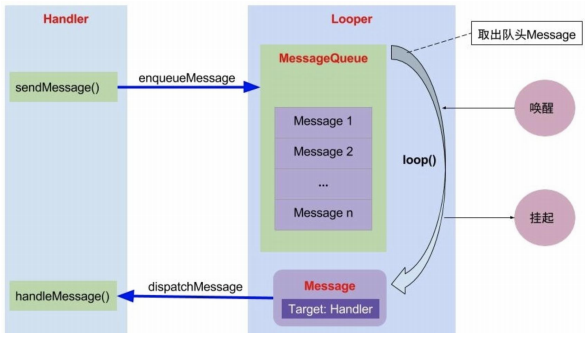
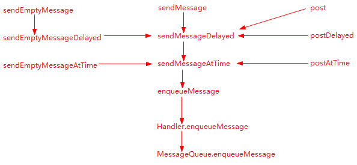
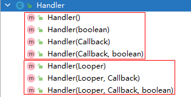
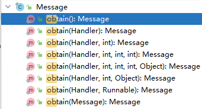
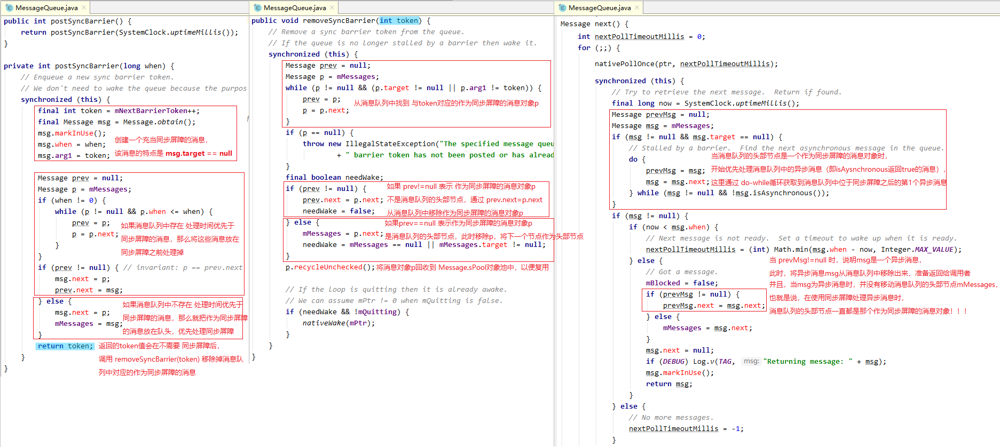
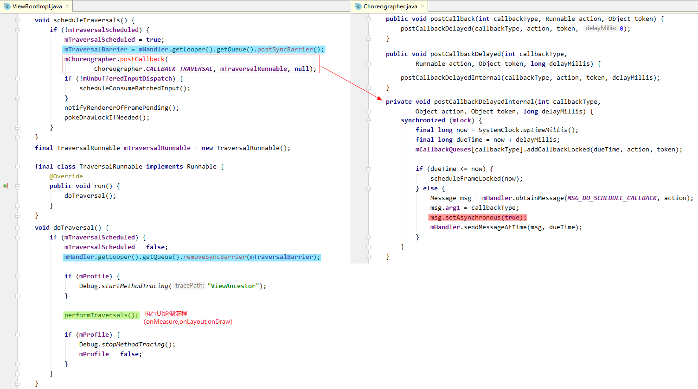
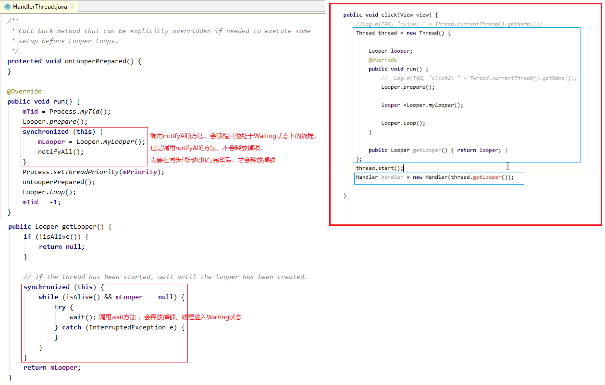
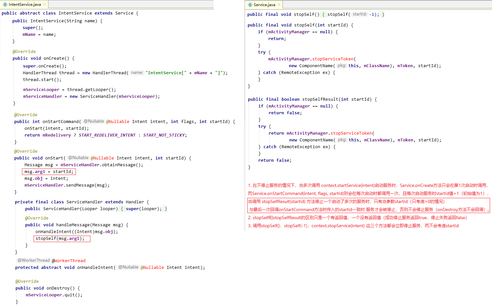
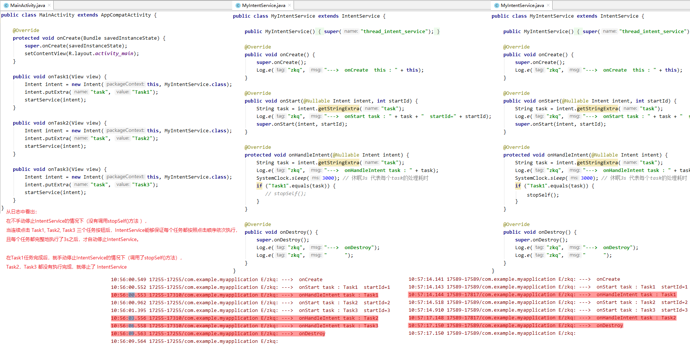

## 1. 概述

`Android` 的消息机制主要是指 `Handler` 的运行机制，以及 `Handler` 所附带的 `MessageQueue` 和 `Looper` 的工作过程。

> `Handler`、`MessageQueue`、`Looper` 这三者实际上是一个整体，只不过在开发过程中比较多地接触 `Handler` 而已。

`Handler` 的主要作用是将一个任务切换到某个指定的线程中去执行。


## 2. `Handler` 消息机制的工作过程

`Handler` 机制的工作过程如下：



### 2.1 `Handler` 发送消息



> 如上图所示，`Handler.sendXxx` 和 `Handler.postXxx` 方法最终都是调用了 `Handler.enqueueMessage` 方法。

### 2.2 从生产者消费者模式的角度理解 `Handler` 机制

`Handler` 机制符合生产者消费值模式，其中：
1. `Handler` 作为生产者，用来生产 `Message`；
2. `MessageQueue` 作为存储容器，用来存放生产的 `Message`；
3. `Looper` 作为消费值，用来从 `MessageQueue` 取出 `Message` 进行消费。

从生产者消费者模式的角度理解 `Handler` 的线程切换：

1. `Handler` 生产 `Message` 是通过调用 Handler.enqueueMessage 方法实现的：

2. `Looper` 消费 `Message` 的实现过程是通过 “死循环 + 等待唤醒机制” 从 `MessageQueue` 中取出 `Message`，然后调用 `Handler.dispatchMessage` 方法处理消息的。

也就是说，`Handler.enqueueMessage` 方法是在生产线程中执行的；`Handler.dispatchMessage` 方法是在消费线程中执行的。
`Handler` 机制的线程切换其实就是 `Handler.enqueueMessage` 方法和 `Handler.dispatchMessage` 方法的执行线程的切换。

## 3. `MessageQueue` 消息队列是由单链表实现的优先级队列

`MessageQueue` 消息队列的说明：
1. 头节点是 `MessageQueue.mMessages`，
2. 队列中节点的类型是 `Message`，
3. `Message` 节点中维护一个 `Message.next` 指针，指向队列中的下一个节点。（并没有指向上一个节点的指针）
4. 队列中的节点在插入时会按照 `Message.when` （消息被处理的时间）的先后顺序进行排序。

```java:no-line-numbers
/* MessageQueue.java */

// 消息入队
boolean enqueueMessage(Message msg, long when) {
    ...
    synchronized (this) {
        ...
        msg.when = when;
        Message p = mMessages; // mMessages 是消息队列的队头
        ...
        /*
            消息在入队时，按照消息被处理的时间 msg.when 从小到大排列，
            msg.when 越小，则越先被处理。
            队头节点 mMessages 指向最先被处理的消息。
        */
        if (p == null || when == 0 || when < p.when) { // 当前插入的消息 msg 最先被处理，所以放在队头
            msg.next = p;
            mMessages = msg;
            ...
        } else {
            ...
            Message prev;
            for (;;) {
                prev = p;
                p = p.next;
                if (p == null || when < p.when) { // 插入时，按照 msg.when 从小（先）到大（后）顺序进行排列。
                    break;
                }
                ...
            }
            msg.next = p;
            prev.next = msg;
        }

        if (needWake) {
            nativeWake(mPtr); // 唤醒消费 Message 的线程
        }
    }
    return true;
}
```

```java:no-line-numbers
/* MessageQueue.java */

// 消息出队
Message next() {
    /*
        在消费 Message 的线程中执行 next 方法，
        通过 “死循环 + 等待唤醒机制” 取出队列中的消息，返回给 Looper。
    */
    ...
    for (;;) {
        ...
        nativePollOnce(ptr, nextPollTimeoutMillis); // 休眠 nextPollTimeoutMillis 时间
        synchronized (this) {
            final long now = SystemClock.uptimeMillis();
            Message prevMsg = null;
            Message msg = mMessages; // 从队头取消息，取到的消息就应该是最先被处理的消息（不考虑异步消息）
            ...
            if (msg != null) {
                if (now < msg.when) { // 
                    // Next message is not ready.  Set a timeout to wake up when it is ready.
                    /*
                        如果最先被处理的消息 msg 在当前时间 now 都还没到被处理的时候，
                        那么就休眠到消息 msg 应该被处理的时间 msg.when 到来为止，即休眠 (msg.when - now) 时间
                    */
                    nextPollTimeoutMillis = (int) Math.min(msg.when - now, Integer.MAX_VALUE);
                } else {
                    ...
                    /*
                        如果最先被处理的消息 msg 在当前时间 now 可以被处理了，
                        那么就将消息 msg 返回给 Looper，并从消息队列中移除。
                    */
                    if (prevMsg != null) {
                        prevMsg.next = msg.next;
                    } else {
                        mMessages = msg.next;
                    }
                    msg.next = null;
                    ...
                    return msg;
                }
            }
            ...
        }
        ...
    }
}
```

## 4. 保证一个线程中只有一个 `Looper` 对象（构造方法私有化 + `ThreadLocal`）

通过以下 `2` 点保证一个线程中只有一个 `Looper` 对象：

1. `Looper` 的构造方法私有化，只能通过静态方法 `static void prepare(boolean quitAllowed)` 来创建 `Looper` 对象；

    ```java:no-line-numbers
    /* Looper.java */

    /*
        Looper 类只提供了这一个私有的构造方法。
        参数 quitAllowed 表示是否允许退出消息循环机制。true 允许；false 不允许。
    */
    private Looper(boolean quitAllowed) {
        mQueue = new MessageQueue(quitAllowed);
        mThread = Thread.currentThread();
    }

    /*
        prepare(quitAllowed) 方法是私有的，对外只提供了如下两个方法来创建 Looper 对象：
            1. prepare()：在子线程中通过该方法来创建 Looper 对象。消息循环机制是允许退出的。
            2. prepareMainLooper()：在主线程中通过该方法来创建 Looper 对象。消息循环机制是不允许退出的。
    */

    public static void prepare() {
        prepare(true);
    }

    public static void prepareMainLooper() {
        prepare(false);
        ...
    }
    ```

    > `Android` 系统已经在 `ActivityThread.main` 方法中调用了 `prepareMainLooper()` 方法，为 `App` 进程的主线程创建了一个 `Looper` 对象。

2. 在 `prepare(quitAllowed)` 方法中通过静态的 `ThreadLocal<Looper>` 类型的对象 `sThreadLocal` 保证一个线程中只能有一个 `Looper` 对象。

    ```java:no-line-numbers
    /* Looper.java */
    static final ThreadLocal<Looper> sThreadLocal = new ThreadLocal<Looper>();

    /*
        prepare(quitAllowed) 方法只能在一个线程中调用一次，否则就会抛出异常。
        （也就是说，对外提供的 prepare() 或 prepareMainLooper() 只能在线程中调用一次）

        因为一个线程中只能调用一次 prepare(quitAllowed) 方法，
        而在该方法中，会创建一个 Looper 对象，并通过 ThreadLocal 与当前线程绑定起来。
        所以就保证了一个线程中只有一个 Looper 对象。
    */
    private static void prepare(boolean quitAllowed) {
        if (sThreadLocal.get() != null) {
            throw new RuntimeException("Only one Looper may be created per thread");
        }
        sThreadLocal.set(new Looper(quitAllowed));
    }
    ```

### 4.1 `ThreadLocal` 如何将 `Looper` 对象与线程绑定？

1. `Thread` 线程对象中维护了一个以 `ThreadLocal` 对象为键，`Object` 对象为值的键值对数组。

    ```:no-line-numbers
    Thread 对象通过 threadLocals 属性引用了 ThreadLocal.ThreadLocalMap 对象。
    ThreadLocalMap 对象中保存了 ThreadLocalMap.Entry[] 类型的数组 table。
    Entry 表示以 ThreadLocal<T> 为键，以 T 为值的键值对。
    ```

2. 调用 `sThreadLocal.set(looper)` 方法，就是将以 `sThreadLocal` 为键，以 `looper` 为值的键值对保存到当前线程对象维护的键值对数组中。

    ```java:no-line-numbers
    /* ThreadLocal.java */
    public void set(T value) {
        Thread t = Thread.currentThread();
        ThreadLocalMap map = getMap(t); // map = t.threadLocals
        if (map != null)
            map.set(this, value); // t.threadLocals.table[index] = new Entry(this, value)
        else
            createMap(t, value); // t.threadLocals = new ThreadLocalMap(this, value);
    }
    ```

    ```:no-line-numbers
    调用 ThreadLocal<Looper> 对象的 set(Looper) 方法，
    就是将以 ThreadLocal<Looper> 对象为键，以 Looper 参数为值的键值对 Entry 对象，
    保存到 set 方法的执行线程对象所维护的 threadLocals.table 数组中。
    ```

3. 调用 `sThreadLocal.get()` 方法，就是从当前线程对象维护的键值对数组中取出以 `sThreadLocal` 为键的值。

    ```java:no-line-numbers
    /* ThreadLocal.java */
    public T get() {
        Thread t = Thread.currentThread();
        ThreadLocalMap map = getMap(t); // map = t.threadLocals
        if (map != null) {
            ThreadLocalMap.Entry e = map.getEntry(this);
            if (e != null) {
                T result = (T)e.value;
                return result;
            }
        }
        ...
    }
    ```

    ```:no-line-numbers
    调用 ThreadLocal<Looper> 对象的 get() 方法，
    就是在 get 方法的执行线程对象所维护的 threadLocals.table 数组中，
    获取到以 ThreadLocal<Looper> 对象为键的键值对 Entry 对象，并将作为值的 Looper 对象取出来。
    ```

因为 `sThreadLocal` 作为 `Looper` 类的静态属性，是唯一存在的，且 `prepare(quitAllowed)` 方法只能在一个线程中调用一次，所以在一个线程中，以 `sThreadLocal` 为键获得的 `Looper` 对象在这个线程中也是唯一的。

注意：

1. 一个线程中可以保存多个 `ThreadLocal<T>` 和 `T` 构成的键值对。
   
2. **一个 `ThreadLocal<T>` 可以在不同的线程中对应有不同的 `T` 值**。
   
3. 通过 `ThreadLocal<T>` 保存在线程中的 `T` 值是线程私有的。

    > 即：在线程 `A` 中调用 `sThreadLocal.set(looper)` 保存在线程 `A` 中的 `looper` 对象，是无法在线程 `B` 中通过调用 `sThreadLocal.get()` 方法获取到的。

4. `T` 值是被线程对象持有的，而不是被 `ThreadLocal<T>` 对象持有的。`ThreadLocal<T>` 对象只是作为键，对线程相关的 `T` 值进行存取。

## 5. `MessageQueue` 的创建时机

```java:no-line-numbers
/* Looper.java */
private Looper(boolean quitAllowed) {
    mQueue = new MessageQueue(quitAllowed);
    mThread = Thread.currentThread();
}
```

`MessageQueue` 对象 是在 `Looper` 的构造方法中创建的。即在线程中调用 `Looper` 的静态方法 `prepare` 后就创建好了 `Looper` 和 `MessageQueue` 对象。

因为 `Looper` 对象是线程唯一的，所以在 `Looper` 的构造方法中创建的 `MessageQueue` 对象也是线程唯一的。

## 6. `Handler` & `MessageQueue` & `Looper` 三者之间的引用关系

1. 一个线程中最多只有一个 `Looper` 对象，和一个 `MessageQueue` 对象。（但在一个线程中可以创建多个 `Handler` 对象）

2. `Handler` 对象中通过属性 `mLooper` 持有 `Looper` 对象的引用，通过属性 `mQueue` 持有 `MessageQueue` 对象的引用。其中，`Handler.mQueue` 就是引用了 `mLooper.mQueue`，即 `Handler` 对象中引用的 `MessageQueue` 就是在 `mLooper` 对象中创建的。（即：`Handler` 对象绑定了 `Looper` 对象，同时也就绑定了 `MessageQueue` 对象）

    

    > 如上图所示，创建 `Handler` 对象时：
    >
    > 1. 如果没有传入 `Looper` 对象，那么 `Handler` 对象绑定的 `Looper` 对象就是当前线程中的 `Looper` 对象。（注意：如果当前线程中还没有调用 `Looper.prepare` 方法创建 `Looper` 对象，就会报错）
    >
    > 2. 在子线程中使用 `Handler` 机制时，则需要传入一个与该子线程相关的 `Looper` 对象。

3. 多个 `Handler` 对象可以绑定同一个 `Looper` 对象。此时，通过这些 `Handler` 对象发送的消息都会按照消息的被处理时间 `msg.when` 插入到同一个 `MessageQueue` 消息队列中。

## 7. `Handler` 消息机制中的等待唤醒机制

```java:no-line-numbers
/* MessageQueue.java */

// 消息出队（在消费消息的线程中执行）
Message next() {
    /*
        调用 nativePollOnce(ptr, nextPollTimeoutMillis) 会让 next 方法的执行线程（即消费消息的线程）进入等待状态，其中：
            1. nextPollTimeoutMillis = 0 时，不会进入等待状态
            2. nextPollTimeoutMillis > 0 时，进入计时等待状态，
                当调用 nativeWake(mPtr) 方法 或经过 nextPollTimeoutMillis 时间后才会唤醒
            3. nextPollTimeoutMillis = -1 时，进入无限等待状态，只有调用 nativeWake(mPtr) 才会唤醒
    */
    final long ptr = mPtr;
    ...
    int nextPollTimeoutMillis = 0; // 1. 默认不进入等待状态
    for (;;) {
        ...
        nativePollOnce(ptr, nextPollTimeoutMillis);
        synchronized (this) {
            
            final long now = SystemClock.uptimeMillis();
            Message prevMsg = null;
            Message msg = mMessages;
            ...
            if (msg != null) {
                if (now < msg.when) {
                    // 2. 当前时间还没有可处理的消息，等待 nextPollTimeoutMillis = msg.when - now 时间后才能取出最先被处理的消息
                    nextPollTimeoutMillis = (int) Math.min(msg.when - now, Integer.MAX_VALUE);
                } else {
                    mBlocked = false;
                    if (prevMsg != null) {
                        prevMsg.next = msg.next;
                    } else {
                        mMessages = msg.next;
                    }
                    msg.next = null;
                    ...
                    return msg;
                }
            } else {
                // 3. 消息队列中没有消息了，进入无限等待状态
                nextPollTimeoutMillis = -1;
            }
            ...
            /*
                执行到这里，nextPollTimeoutMillis 一定不为 0，
                不考虑添加了 IdleHandler 的情况，pendingIdleHandlerCount <= 0 总是成立
                即当消费消息的线程进入等待状态时，mBlocked 置为 true
            */ 
            if (pendingIdleHandlerCount <= 0) {
                mBlocked = true;
                continue;
            }
            ...
        }
        ...
    }
}
```

```java:no-line-numbers
/* MessageQueue.java */

// 消息入队（在生产消息的线程中执行）
boolean enqueueMessage(Message msg, long when) {
    /*
        在消息入队时，以下情况中需要唤醒消费消息的线程：
        1. 当前插入的消息 msg 最先被处理时，若消费消息的线程处于等待状态，则需要唤醒；
        2. 在开启了同步屏障，且处于优先遍历异步消息的条件下，即：队头消息是屏障消息（mMessages.target == null），
            如果当前插入的消息 msg 是异步消息，且是最先被处理的异步消息，那么，若消费消息的线程处于等待状态，则需要唤醒；
        3. 如果当前插入的消息 msg 不是应该被最先处理的，那么就算消费消息的线程处于等待状态，也不需要唤醒。
            因为此时，若消费消息的线程处于等待状态，说明先于 msg 被处理的上一个消息还在等待处理，不应该提前唤醒。
    */
    ...
    synchronized (this) {
        ...
        msg.when = when;
        Message p = mMessages;
        boolean needWake;
        if (p == null || when == 0 || when < p.when) {
            // 情况 1
            msg.next = p;
            mMessages = msg;
            needWake = mBlocked; 
        } else {
            // 情况 2 和 3
            needWake = mBlocked && p.target == null && msg.isAsynchronous();
            Message prev;
            for (;;) {
                prev = p;
                p = p.next;
                if (p == null || when < p.when) {
                    break;
                }
                if (needWake && p.isAsynchronous()) {
                    needWake = false;
                }
            }
            msg.next = p; 
            prev.next = msg;
        }
        
        if (needWake) {
            nativeWake(mPtr); // 唤醒消费消息的线程
        }
    }
    return true;
}
```

## 8. 消息入队和消息出队时的加锁原因

如上所示的消息出队（`MessageQueue.next`）和消息入队（`MessageQueue.enqueueMessage`）的代码中，都使用了同一个锁对象（`synchronized(this)`）进行了加锁。这是因为：

```:no-line-numbers
1. 生产消息的线程可以有多个，即 MessageQueue.enqueueMessage 方法可以在多个线程中调用。
    （也就是 Handler.sendXxx 和 Handler.postXxx 方法可以在多个不同的线程中调用）
2. 消费消息的线程只有一个，即调用 Looper.preapre 方法的那个线程。
于是：
    消息入队时加锁 this，保证同一时间只有一个消息入队；
    消息出队时加锁 this，保证入队和出队不会在同一时间发生。从而使得：
        即使最优先消息后入队，也能在接下来的出队操作中及时取出来。（即保证插入消息能得到及时处理）
```

## 9. `Handler` 消息机制的退出流程

```java:no-line-numbers
/* MessageQueue.java */

// 退出消息循环
void quit(boolean safe) {
    if (!mQuitAllowed) {
        throw new IllegalStateException("Main thread not allowed to quit.");
    }

    synchronized (this) {
        if (mQuitting) {
            return;
        }

        /*
            mQuitting 置为 true 表示退出消息循环机制。
            在 next 方法中根据该变量判断是否退出消息循环。
        */
        mQuitting = true; 

        /*
            如果 safe 为 true，则只会清空队列中 msg.when > now 的消息（removeAllFutureMessagesLocked），
                即当队列中 msg.when <= now 的消息处理完之后，才会退出消息循环。
            如果 safe 为 false，则会清空队列中的所有消息（removeAllMessagesLocked），
                即立即退出消息循环。
        */
        if (safe) {
            removeAllFutureMessagesLocked();
        } else {
            removeAllMessagesLocked();
        }
        
        /*
            为了避免消费消息的线程处于等待状态而无法退出消息循环，
            所以不管消费消息的线程是否处于等待状态，都调用下 nativeWake(mPtr) 方法唤醒下
        */ 
        nativeWake(mPtr);
    }
}
```

```java:no-line-numbers
/* MessageQueue.java */

// 消息出队（在消费消息的线程中执行）
Message next() {
    final long ptr = mPtr;
    ...
    int nextPollTimeoutMillis = 0;
    for (;;) {
        ...
        nativePollOnce(ptr, nextPollTimeoutMillis);
        synchronized (this) {
            
            final long now = SystemClock.uptimeMillis();
            Message prevMsg = null;
            Message msg = mMessages;
            ...
            if (msg != null) {
                if (now < msg.when) {
                    nextPollTimeoutMillis = (int) Math.min(msg.when - now, Integer.MAX_VALUE);
                } else {
                    mBlocked = false;
                    ...
                    // 从队列中移除 msg
                    ...
                    return msg;
                }
            } else {
                nextPollTimeoutMillis = -1;
            }

            if (mQuitting) { //  只有当退出消息循环机制时，才会返回 null。否则没消息处理时只会进入等待状态
                dispose();
                return null;
            }
            ...
            if (pendingIdleHandlerCount <= 0) {
                mBlocked = true;
                continue;
            }
            ...
        }
        ...
    }
}
```

```java:no-line-numbers
/* Looper.java */

public static void loop() {
    final Looper me = myLooper();
    if (me == null) { // 先调用 Looper.prepare 后，才能调用 Looper.loop()
        throw new RuntimeException("No Looper; Looper.prepare() wasn't called on this thread.");
    }
    final MessageQueue queue = me.mQueue;
    ...
    for (;;) {
        /*
            当队列中没有消息，或者消息的处理时间还没到，则 queue.next() 方法会阻塞
            只有当退出消息循环机制时，queue.next() 才会返回 null，结束消息循环。
        */
        Message msg = queue.next(); 
        if (msg == null) {
            return;
        }
        ...
        msg.target.dispatchMessage(msg); // 处理消息
        ...
        msg.recycleUnchecked(); // 回收消息
    }
}
```

## 10. `MessageQueue` 消息队列的容量没有限制

在调用 `MessageQueue.enqueueMessage(msg, when)` 方法，将消息 `msg` 入队时，没有限制消息队列的容量。即可以无限制地将消息插入到队列中。

于是，当消息队列中存放了过多的消息对象时，就有可能导致内存溢出。

因此，尽量不要使用 `Handler` 来做定时任务。

## 11. 消息池 & 享元设计模式

在设计 `Message` 的时候采用了 **享元设计模式**（享元设计模式就是通过 **对象池** 来实现对象共享，避免创建多对象）。

因为 `App` 在运行过程中，会频繁地使用 `Handler` 消息机制来处理任务，也就是说会造成 `Message` 对象的频繁创建和销毁，从而出现 **内存抖动**，并产生大量的 **内存碎片**，使得堆中可能没有足够大的连续内存空间来存放占用内存较大的对象（如 `Bitmap`），导致内存溢出（`OOM`）的发生。

所以，为了避免这种问题，应该调用 `Message.obtain` 方法尝试从对象池 `sPool` 中获取一个可复用的 `Message` 对象，而不是直接 `new` 一个 `Message` 对象。并且在 `Message` 对象使用完毕后，调用 `Message.recycleUnchecked()` 方法清除掉 `Message` 对象的消息数据，再将其回收到对象池 `sPool` 中，以便下一次能够继续复用。



> 优先通过重载的 `obtain` 静态方法获取 `Message` 对象。

```java:no-line-numbers
/* Message.java */

public static final Object sPoolSync = new Object(); // 同步锁
private static Message sPool; // 消息池采用单链表结构，sPool 是链表的头节点
private static int sPoolSize = 0;
private static final int MAX_POOL_SIZE = 50; // 消息池的容量为 50。（即最多缓存 50 个 Message 对象）

public static Message obtain() {
    synchronized (sPoolSync) {
        if (sPool != null) { // 优先复用消息池中缓存的 Message 对象
            Message m = sPool;
            sPool = m.next;
            m.next = null;
            m.flags = 0; 
            sPoolSize--;
            return m;
        }
    }
    return new Message();
}

void recycleUnchecked() {
    flags = FLAG_IN_USE;
    what = 0;
    arg1 = 0;
    arg2 = 0;
    obj = null;
    replyTo = null;
    sendingUid = -1;
    when = 0;
    target = null;
    callback = null;
    data = null;
    synchronized (sPoolSync) {
        if (sPoolSize < MAX_POOL_SIZE) { // 将回收的当前 Message 对象插入到消息池链表的头部
            next = sPool;
            sPool = this;
            sPoolSize++;
        }
    }
}
```

```java:no-line-numbers
/* Looper.java */

public static void loop() {
    final Looper me = myLooper();
    if (me == null) {
        throw new RuntimeException("No Looper; Looper.prepare() wasn't called on this thread.");
    }
    final MessageQueue queue = me.mQueue;
    ...
    for (;;) {
        Message msg = queue.next(); 
        if (msg == null) {
            return;
        }
        ...
        msg.target.dispatchMessage(msg);
        ...
        msg.recycleUnchecked(); // 回收消息
    }
}
```

## 12. 同步屏障

### 12.1 同步屏障的含义及作用：

```:no-line-numbers
屏蔽同步消息（isAsynchronous() 返回 false的消息），
优先处理异步消息（isAsynchronous() 返回 true 的消息）
```

### 12.2 同步屏障的实现方式：

```:no-line-numbers
在通过 Handler 发送异步消息之前，调用 MessageQueue 的 postSyncBarrier() 方法，向消息队列中插入一个作为同步屏障的消息，
在通过 Handler 发送异步消息之后，当循环到消息队列中作为同步屏障的消息时，就只会从消息队列中取出位于同步屏障之后的异步消息，
直到调用 removeSyncBarrier 方法将作为同步屏障的消息从消息队列中移除后，
才会从消息队列的头部节点开始，依次挨个地取出每个消息，而不考虑取出的是同步消息还是异步消息。
```



### 12.3 同步屏障的应用：刷新 `UI`

为了保证 `UI` 界面的流畅，在刷新频率为 `60Hz` 的安卓屏幕中，应该保证每 `16ms` 刷新一帧屏幕图像。（`60hz => 1000s/60f = 16.666ms/s`）。

也就是说，当使用 `Handler` 消息机制来刷新屏幕时，必须保证每 `16ms` 能够处理一次 `UI` 刷新的消息，而不能受到其它同步消息的影响。

因此，通过同步屏障，将 `UI` 刷新的消息设置为异步消息，就能够避免同步消息产生的干扰。从而在同步屏障的保证下，每 `16ms` 处理一次 `UI` 刷新的异步消息。

`UI` 绘制中使用同步屏障的相关源码分析如下：

```:no-line-numbers
在刷新界面时（如调用 View.requestLayout 方法），会执行 ViewRootImpl.scheduleTraversals() 方法来请求一次 UI 绘制流程，
在 scheduleTraversals() 方法中，会先调用 MessageQueue.postSyncBarrier 方法开启同步屏障，
然后调用 Choreographer.postCallback 方法发送一系列的异步消息，
在同步屏障的作用下，会从消息队列中取出绘制 UI 的异步消息进行处理，
处理过程中就会执行 TraversalRunnable.run() 方法，进而调用 doTraversal() 方法，
因此，可以在 doTraversal() 方法中调用 MessageQueue.removeSyncBarrier 方法停止同步屏障。
```



## 13. `HandlerThread`

`HandlerThread` 是 `Thread` 的子类。也就是说，`HandlerThread` 表示一个线程。

`HandlerThread` 作为一个线程，其特殊之处就在于：它会在线程中创建并绑定一个 `Looper`。

`HandlerThread` 的作用就是：

1. 方便使用：包括方便初始化、方便获取线程绑定的 `Looper`。

2. 保证了线程安全。

`HandlerThread` 的内部实现主要如下：

```:no-line-numbers
HandlerThread 内部通过同步锁，保证在其它线程中能够安全地调用 getLooper() 方法获取到一个不为 null 的 Looper 对象。
如果不使用 HandlerThread，而是 new 一个 Thread，重写 Thread.run() 方法，在 run 方法中调用 Looper.prepare 和 Looper.loop 方法，
那么在其它线程中获取这个新创建线程中的 Looper 对象时，可能获取到的是一个 null，
这是因为，新创建线程中的 run 方法，在其它线程调用 getLooper 时可能还未执行，从而新创建线程中的 Looper 对象还未创建。
```



## 14. `IntentService`

`Service` 一般用于处理后台耗时任务。

对于如下需求：

```:no-line-numbers
一项任务分成几个子任务，子任务按顺序先后执行，子任务全部执行完后，这项任务才算成功。
```

这个需求可以用多个线程来处理，一个线程处理 -> 下一个线程 -> 下一个线程

`IntentService` 可以完成这个需求，而且能够很好的管理线程，保证只有一个子线程处理工作，而且是一个一个地完成任务，有条不紊地进行。

`IntentService` 的实现如下：

```:no-line-numbers
IntentService 内部维护了一个在子线程中运行的 Handler 消息机制。
在不停止 IntentService 的情况下，
每次启动 IntentService 时，都会将一个持有最新 startId 的消息（msg.arg1 = startId）放到消息队列中，
在从消息队列中取出消息并进行处理的过程中，每个消息被处理完成后，都会尝试调用 stopSelf(msg.arg1) 停止 IntentService，
但是，只有最后一个消息才会持有最新的 startId。
也就是说，当消息队列中还存在消息时，正在被处理的消息是无法通过 stopSelf(msg.arg1) 将 IntentService 给停下来的。
除非在重写的 onHandleIntent 中调用 stopSelf()、stopSelf(-1)、stopService(intent) 才会立即将 IntentService 停下来。
```



### 14.1 示例：`IntentService` 的使用



## 15. `Handler` 面试题

### 15.1 一个线程有几个 `Handler`？

```:no-line-numbers
一个线程中可以 new 无数个 Handler 对象，
但一个线程只能有一个 Handler 消息机制，即只能绑定一个 Looper 对象和 一个 MessageQueue 对象。
```

### 15.2 一个线程有几个 `Looper`？如何保证？

```:no-line-numbers
一个线程中只有一个 Looper 对象。保证措施：
1. Looper 的构造方法私有化
2. 通过静态方法 Looper.prepare 创建 Looper 对象时，使用 ThreadLocal 保证一个线程对象中只绑定一个 Looper 对象
```

### 15.3 `Handler` 内存泄漏原因？为什么其他的内部类没有说过这个问题？

```:no-line-numbers
以 Activity 为例，通常我们会将 Handler 作为 Activity 的内部类。
由于内部类持有外部类的引用，因此，Handler 对象引用了 Activity 对象。
并且，在发送消息并将消息入队时，会通过 msg.target = this; 使得消息对象引用 Handler 对象，
于是，消息对象间接引用了 Activity 对象。
如果在消息队列中的消息对象在 Activity 对象的生命周期结束后仍然没有出队，那么依据垃圾回收时的根搜索算法，
Activity 对象可达，不被认为是垃圾，无法回收。从而导致了由于 Activity 对象无法被回收而引用的内存泄漏。
```

### 15.4 为何主线程可以 `new Handler`？

```:no-line-numbers
在 ActivityThread.main 方法中，已经依次调用过 Looper 的 prepare 和 loop 方法了，所以主线程中可以直接 new Handler。
```

### 15.5 如果想要在子线程中 `new Handler` 要做些什么准备？

```:no-line-numbers
而如果在子线程中 new Handler，那么需要先依次调用 Looper 的 prepare 和 loop 方法。
```

### 15.6 消息队列无消息时的处理方案是什么？有什么用？

```:no-line-numbers
消息队列中无消息时，会调用 nativePollOnce(ptr, -1) 方法，使消费消息的线程进入无限等待状态。
从而交出 CPU 的执行权给其他线程使用。
```

### 15.7 多个 `Handler` 在不同线程中发消息时，如何保证线程安全？

```:no-line-numbers
通过对 MessageQueue 的 enqueueMessage 方法中的消息入队过程和 MessageQueue 的 next 方法中的消息出队过程，
分别加上相同的同步锁，从而保证线程安全。
```

### 15.8 使用 `Message` 时应该如何创建它？

```:no-line-numbers
Message 类在设计时采用来了享元设计模式，通过静态变量 sPool 来维护一个消息对象池，使得可以复用已存在的 Message 对象，
Message 类提供静态方法 obtain 返回一个 Message 对象：
    1. 当 sPool 中存在消息对象时，返回 sPool 中的消息对象；
    2. 当 sPool 中不存在消息对象时，返回一个新创建的对象。
也就是说，为了避免频繁地创建和销毁 Message 对象所造成的内存抖动，应该使用 Message.obtain 方法来创建 Message。
```

### 15.9 `Looper` 死循环为什么不会导致应用卡死？

```:no-line-numbers
Looper 死循环的目的只是为了将消息队列中存在的消息出队，当消息队列中没有消息时，Looper 循环所在的线程进入阻塞状态，
此时，调度器就会将 CPU 资源分配给其它线程使用，执行其它线程中的代码。
应用卡死就是说出现了 ANR，ANR 出现的场景可分为：
    1. Input 事件（如点击，触摸）的处理时间超过 5s；
    2. Broadcast 广播的处理时间超过 10s
    3. Service 前台服务的处理时间超过 20s
也就是说，导致 ANR 出现的原因是对某个任务的处理为按时完成。
而在 App 中，一切任务都是通过发送 Message 消息来处理的。
换句话说，导致 ANR 出现的原因是 Message 消息出队后的处理过程未按时完成！
这就意味着，只有当存在 Message 消息的情况下，才有可能出现 ANR，即出现应用卡死的现象。
而由于不存在 Message 消息，导致的 Looper 所在线程进入阻塞状态，跟应该卡死没有任何关系。
而 Looper 死循环的目的只是不停地将消息出队，跟消息出队后的处理过程无关，也就是说跟 ANR 无关，因此也跟应该卡死无关。
```