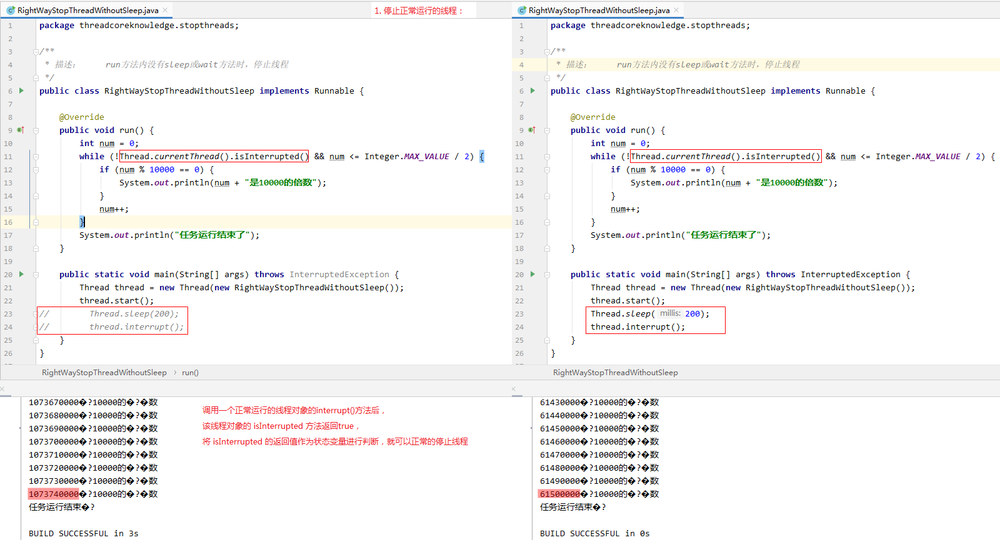
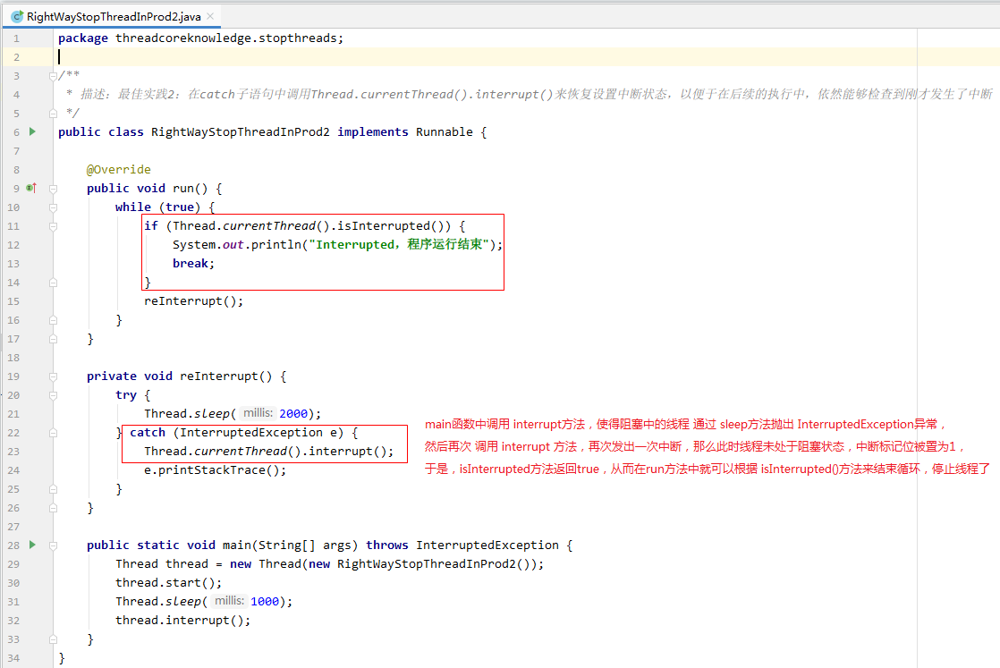

## 一、实现多线程的 `2` 种方式

`Oracle` 官网的文档中给出了 `2` 种实现多线程的方式：
1. 实现 `Runnable` 接口；
2. 继承 `Thread` 类。

以上两种方式都会调用 `Thread.run()` 方法，区别是：
1. 实现 `Runnable` 接口，只是执行 `Thread.run()` 方法中的 `target.run()` 方法。
    > `target` 就是 `Runnable` 对象
2. 继承 `Thread` 类，就是重写 `Thread.run()` 方法，将 `Thread.run()` 方法中的内容都覆盖掉。

```java
/* Thread.java */
@Override
public void run() {
    if (target != null) {
        target.run();
    }
}
```

推荐采用实现 `Runnable` 接口的方式，理由：
1. 实现 `Runnable` 接口，使得线程的创建以及运行机制，与线程任务代码解耦。更符合面向对象的思想；
2. 实现 `Runnable` 接口，不需要每次执行线程任务时，都 `new` 一个新的线程。可以通过重用线程池中已有的线程来执行线程任务，提高资源利用率；
3. 实现 `Runnable` 接口的类还可以继承其他类，而继承 `Thread` 则无法再继承其他类了。因此，实现 `Runnable` 接口的方式，扩展性更好。

### 典型错误观点分析

#### 错误观点1、线程池创建线程是一种新建线程的方式


如上图，线程池是通过 `ThreadFactory` 接口的 `newThread(Runnable)` 方法来获取线程的。而每个 `ThreadFactory` 接口的实现类重写 `newThread(Runnable)` 方法时，都是通过传入一个 `Runnable` 接口的实现类对象来创建线程的。
> 也就是说，线程池创建线程的本质还是通过 **实现 `Runnable` 接口** 完成的。

#### 错误观点2、通过 `Callable` 和 `FutureTask` 创建线程是一种新建线程的方式


本质还是 **实现 `Runnable` 接口**。

其中还有一种错误观点：无返回值是实现 `Runnable` 接口，有返回值是实现 `Callable`，所以 `Callable` 是一种新建线程的方式。
> `Callable` 本质还是 **实现 `Runnable` 接口**。

#### 错误观点3、定时器，匿名内部类，`Lambda` 表达式是一种新建线程的方式

定时器本质上是实现 `Runnable` 接口。

匿名内部类和 `Lambda` 表达式只是语法形式上的改变，实际上也还是实现 `Runnable` 接口。

## 二、启动线程的正确方式

### 错误方式：直接调用 run() 方法

直接调用 `Thread.run()` 方法，或者直接调用 `Runnable.run()` 方法都不会启动新线程。只是在调用 `run` 方法的当前线程中执行 `run` 方法。

### 正确方式：调用 `Thread.start()` 方法

调用 `Thread.start()` 方法启动新线程，并不是说调用 `start` 方法之后，新线程就立即启动了。

`start` 方法只是申请让 `JVM` 去启动一个新线程，而这个新线程什么时候被启动是不确定的。
> 有可能后调用 `start` 方法申请启动的另一个新线程先启动也不一定。

**注意：** `start` 方法的执行仍然还是在调用 `start` 方法的当前线程中，并不是在 `start` 方法所申请的新线程中。

从调用 `start` 方法向 `JVM` 申请启动一个新线程，到这个新线程真正运行起来之间，还需要为新线程做一些准备工作，使得新线程拥有除使用 `CPU` 之外的其他资源。
> 准备工作完成后，新线程就处于就绪状态，等待线程调度器分配 `CPU` 资源来启动运行。

### `start` 方法源码分析（`start` 方法的主要作用）


`start` 方法的主要作用是：
1. 检查线程状态
    > 通过 `threadStatus` 状态变量可知，`start` 方法只能调用一次，否则会抛出异常。
2. 加入线程组
3. 调用本地方法 `start0()` 向 `JVM` 申请启动一个新线程。

## 三、停止线程的正确方式：`interrupt`

### 1、线程停止的两种情况

1. `run` 方法中的代码全部指向完毕；
2. `run` 方法中代码执行时出现异常。

### 2、正确地停止线程
停止线程的正确方式为：使用 `interrupt` 来通知，而不是强制。
> 调用线程对象的 `interrupt()` 方法，只是向这个线程发出一个中断信号：
> 
>   1. 当线程正常运行时，线程对象的 `isInterrupted()` 方法返回 `true`；
>   2. 当线程阻塞时，会通过阻塞方法（如 `sleep`，`wait`）抛出 `InterruptedException` 异常。
> 
> 也就是说，调用 `interrupt()` 方法，并不会强制地将线程停止，而是使线程收到中断信号（`isInterrupted()` 方法返回 `true`，或发生 `InterruptedException` 异常都可以理解为收到中断信号）。
>
> 于是，在 `run` 方法中编写线程代码时，可以根据中断信号来判断要不要结束 `run` 方法，停止线程。

### 3、使用 `interrupt` 停止线程的三种场景

#### 3.1、停止正常运行的线程



#### 3.2、停止正处于阻塞状态下的线程


#### 3.3、停止每次循环时都会短暂阻塞的线程


### 4、无法停止线程的情况（及解决方式）


### 5、停止线程的最佳实践

#### 优先选择：传递中断

传递中断就是说 `run` 方法中的被调函数中发生阻塞的时候，中断了线程，此时，在被调用函数中的阻塞方法（如 `sleep`，`wait`）抛出了 `InterruptedException` 异常时，不能直接在被调函数中对 `InterruptedException` 异常进行 `try/catch`，而是应该将该异常向上抛给 `run` 方法处理。
> 即：不要在`run` 方法中的被调函数内处理中断，而是将中断传递给 `run` 方法处理。


#### 不想或无法传递时：恢复中断

恢复中断就是说`run` 方法中的被调函数中发生阻塞的时候，中断了线程，此时，在被调用函数中的阻塞方法（如 `sleep`，`wait`）抛出了 `InterruptedException` 异常时，如果被调函数不想将异常向上抛给 `run` 方法，或者是其他无法将异常抛出给 `run` 方法的情况，那么被调函数中可以对异常进行 `try/catch`，然后再调用当前线程的 `interrupt()` 方法，再发出一次中断，使得中断标记位为 `1`，于是，在 `run` 方法中就可以判断 `isInterrupted()` 是否返回 `true` 来结束循环，从而停止线程。
> 即：如果 `run` 方法中的被调函数内无法将中断传递给 `run` 方法，那么就在被调函数中重新发起一个中断。



#### 不应屏蔽中断

也就是说，当有中断发生时，`run` 方法中必须要能通过 `isInterrupted()` 方法或者接收到 `InterruptedException` 异常来响应这个中断，做出相关动作（如结束循环，停止线程）。

### 6、响应中断的方法总结

以下这些方法都会在线程调用 `interrupt()` 方法发出中断时，抛出 `InterruptedException` 异常。


### 7、停止线程的错误方式

#### 7.1、`stop` 方法停止线程（弃用）

调用线程的 `stop()` 方法会强制地停止线程。
> 也就是说，不管线程是否处于阻塞状态；不管线程执行到哪条指令，都会强制地结束线程指令的执行，停止线程。

这样做是不安全的，因为我们无法通过代码来感知线程的停止动作。也就是说，**无法保证线程中被处理数据的完整性**。
> 即可能数据处理到一半，线程就因为 `stop()` 方法的调用被强制停止了，从而产生脏数据。而由于这种脏数据所引用的问题是很难排查的，并且 **调用 `stop` 方法强制停止线程时，会释放掉线程持有的锁**，于是，当被强制停止的线程正在同步代码中处理共享数据时，就会使得还没处理完的共享数据对其他线程可见了，从而使得这份 “脏乱” 的共享数据对多个线程产生影响。

#### 7.2、`suspend` + `resume` 方法停止线程（弃用）

`suspend()` 方法和 `resume()` 方法是搭配使用的：
1. 调用 `suspend()` 方法使得线程被挂起（但线程并没有终止）；
2. 调用 `resume()` 方法，可以唤醒被 `suspend()` 方法挂起的线程。

**注意：**
**被挂起的线程是不会释放掉它所持有的锁的**，这就很可能会导致死锁的产生。
> 当在线程 `A` 中调用线程 `B` 的 `suspend()` 方法将线程 `B` 挂起时，线程 `B` 持有锁 `lock`，于是线程 `B` 在挂起时也会一直持有锁 `lock`。
>
> 之后，当在线程 `A` 或其他线程中调用线程 `B` 的 `resume()` 方法唤醒线程 `B` 之前，线程 `A` 或其他线程需要先请求锁 `lock` 时，由于锁 `lock` 一直被线程 `B` 持有，而线程 `B` 被挂起了无法将锁释放掉，从而导致了死锁的产生。

#### 7.3、用 `volatile` 设置 `boolean` 标记位

## 四、线程的 `6` 个状态

## 五、`Thread` 和 `Object` 类中与线程相关的重要方法

## 六、线程的各个属性

## 七、线程的未捕获异常 `UncaughtException` 的处理

## 八、多线程导致的性能问题（线程引入的开销、上下文切换）