## 1. 垃圾回收基础

### 1.1 什么是垃圾

简单说就是：内存中已经不再被使用到的内存空间就是垃圾。

### 1.2 如何判定是垃圾

#### 1.2.1 引用计数法

引用计数法：给对象添加一个引用计数器，有访问就 `+1`，引用失效就 `-1`

引用计数法的优缺点：

1. 优点：实现简单，效率高；

2. 缺点：不能解决对象之间的循环引用问题。

    

#### 1.2.2 根搜索算法

从根（`GC Roots`）节点向下搜索对象节点，搜素走过的路径称为 **引用链**。当一个对象到根之间没有连通时，则该对象不可用，不可用的对象会被判定为垃圾，对其进行回收。

> 一个对象可能存在于多条引用链中，即可能不止一个根节点能连通到该对象，所以根节点用复数形式表示：`GC Roots`。


> 很多商用虚拟机都是采用根搜索算法来判定一个对象是不是垃圾。

##### 1.2.2.1 可作为 `GC Roots` 的对象

可作为 `GC Roots` 的对象包括：

1. 虚拟机栈中（方法参数和局部变量）引用的对象；
2. 方法区中的类静态成员变量引用的对象；
3. 方法区中常量引用的对象；
4. 本地方法栈中 `JNI` 引用的对象；
5. 作为同步锁的对象；
6. ......

##### 1.2.2.2 `HotSpot` 虚拟机对根搜索算法的优化（`OopMap` 数据结构）

按照根搜索算法，为了判定一个对象是否为垃圾，需要从每一个 `GC Roots` 开始遍历每一条引用链，从而查询某个对象是否在这些引用链中。

这样做的话，对于代码量很大，引用链很多的项目，判定对象是否为垃圾的效率是很低的。

为了解决这个问题，`HotSpot` 虚拟机采用 `OopMap` 这种数据结构来优化判定对象是否为垃圾的效率：

`OopMap` 数据结构中，存储了对象之间的引用关系，通过 `OopMap` 可以加快定位对象的引用位置，而不用从 `GC Roots` 开始遍历引用链，从而大大提高判定对象是否为垃圾的效率。

###### 1.2.2.2.1 安全点 & 安全区域

在 `OopMap` 的协助下，`JVM` 可以很快地完成对 `GC Roots` 的枚举。但是 `JVM` 并没有对每一条指令都记录并生成一个 `OopMap`。

记录并生成 `OopMap` 的这些 “特定位置” 被称为 **安全点**。

> 当用户线程执行到安全点后，才允许暂停用户线程，执行 `GC` 线程进行 `GC`。

如果一段代码中，对象引用关系不会发生变化，这段代码区域中任何地方开始 `GC` 都是安全的，那么这个区域称为 **安全区域**。

#### 1.2.3 引用分类

##### 1.2.3.1 强引用

类似于 `Foo foo = new Foo()` 这样的，称 `new` 出来的对象被强引用了。

被强引用的对象，在每次 `GC` 时都不会被回收。

##### 1.2.3.2 软引用

类似于 `SoftReference<Foo> sRef = new SoftReference<>(new Foo())` 这样的，称 `new` 出来的对象被软引用了。

被软引用的对象，当 `GC` 时，在内存不够用的情况下才会被回收。

##### 1.2.3.3 弱引用

类似于 `WeakReference<Foo> wRef = new WeakReference<>(new Foo())` 这样的，称 `new` 出来的对象被弱引用了。

被弱引用的对象，在每次 `GC` 时都会被回收。

##### 1.2.3.4 虚引用（幽灵引用）

类似于 `PhantomReference<Foo> wRef = new PhantomReference<>(new Foo(), referenceQueue)` 这样的，称 `new` 出来的对象被虚引用了。

虚引用也称为幽灵引用或幻影引用，是最弱的引用。

被虚引用的对象，在每次 `GC` 时都会被回收。

##### 1.2.3.5 示例：`GC` 对软引用和弱引用的影响（`finalize()` & `ReferenceQueue`）

1. `GC` 对软引用的影响

    

    > 1. 当垃圾收集器准备回收某个对象时 ，会调用该对象的 `finalize()` 方法。但是，调用该方法，也并不代表着垃圾收集器一定会回收该对象。
    > 
    > 2. 当垃圾收集器回收了被软引用的对象后，相关的软引用会放到 `ReferenceQueue` 队列中。注意：`ReferenceQueue` 中保存的是 `Reference` 本身，而不是 `Reference` 中引用的对象。

2. `GC` 对弱引用的影响

    

#### 1.2.4 跨代引用

跨代引用：就是一个代中的对象引用了另一个代中的对象。如：
1. 新生代中的对象引用了老年代中的对象；
2. 老年代中的对象引用了新生代中的对象。

跨代引用假说：跨代引用相对于同代引用来说只是极少数的。

> 隐含推论 ：存在互相引用关系的两个对象，应该是倾向于同时生存或同时消亡的。具体为：
> 
> 1. 当两个对象处于同一代中时，它们之间的引用就是同代引用，互相同代引用的两个对象，它们之间倾向于同时生存或同时消亡。
> 
> 2. 当两个对象不处于同一代中时，它们之间的引用就是跨代引用。此时，当老年代中的对象引用了新生代中的对象时，新生代中的对象不会被回收，而是会被转存到老年代中。也就是说，互相跨带引用的两个对象，经过多次 `GC` 后，最终会转为互相同代引用。

##### 1.2.4.1 跨代引用造成的问题

当进行垃圾回收时，为了查询跨代引用，不仅要扫描新生代中的对象，还要扫描老年代中的对象，这样才能判断存在着多少个新生代中的对象和老年代中的对象之间的跨代引用。

但是，这样做的话就会极大地影响垃圾回收的性能。为了解决这个问题，引入了新的数据结构：**记忆集**。

##### 1.2.4.2 记忆集（解决跨代引用造成的问题）

记忆集（`Remembered Set`）：一种用于记录从非收集区域指向收集区域的指针集合的抽象数据结构。

> 可以理解为，记忆集中记录了存在跨代引用的新生代对象和老年代对象的内存地址，当进行垃圾回收时，只需要判断记忆集中记录的存在跨代引用的对象是否为垃圾即可。

###### 1.2.4.2.1 实现记忆集的三种方式

实现记忆集这种数据结构所采用的三种方式：

1. 字长精度：每个记录精确到一个机器字长，该字包含跨代指针。

2. 对象精度：每个记录精确到一个对象，该对象里有字段含有跨代指针。

3. 卡精度：每个记录精确到一块内存区域，该区域内有对象含有跨代指针。

###### 1.2.4.2.2 卡表（`Card Table`，记忆集的具体实现）

卡表是记忆集的一种具体实现，定义了记忆集的记录精度与堆内存的映射关系。

> 卡表采用了卡精度实现记忆集这种数据结构。

###### 1.2.4.2.2 卡页（`Card Page`，卡表的组成元素）

卡表的每个元素都对应着其标识的内存区域中的一块特定大小的内存块。这个内存块称为卡页。

> 也就是说，卡表由卡页组成，每个卡页中保存了多个对象。

当某个卡页中的对象存在跨代引用时，就会记录下来。当进行垃圾回收时，会将这些记录了的对象筛选出来，通过根搜索算法来判定它们是否为垃圾。

###### 1.2.4.2.3 写屏障

卡表中记录了对象间的引用关系，那么当对象间的引用关系发生变化时，卡表中的数据记录状态也应该随着改变。那么由谁来维护卡表的数据记录状态？什么时候来改变卡表中的数据记录状态？答：在 `HotSpot` 虚拟机中，是通过 **写屏障** 这种技术来维护卡表中的数据记录状态的。

写屏障可以看成是 `JVM` 对 “引用类型字段赋值” 这个动作的 `AOP`。

> 所谓的对 “引用类型字段赋值” 这个动作的 `AOP`，就是说，`JVM` 会在 “引用类型字段赋值” 前后额外地添加一些程序，达到维护卡表的目的。其中：
> 
> 1. `JVM` 在 “引用类型字段赋值” 这个动作之前添加程序，称为 **写前屏障**。
> 
> 2. `JVM` 在 “引用类型字段赋值” 这个动作之后添加程序，称为 **写后屏障**。

#### 1.2.5 判定是否为垃圾的步骤

判定是否为垃圾的步骤为：

1. 先通过根搜索算法判定对象是否可用；

2. 对于不可用的对象，再看是否有必要执行 `finalize()` 方法；

3. 以上两步执行完后，如果对象仍然没有被使用，那么该对象就属于垃圾。

    > 通过第 `1`、`2` 步判定对象是否为垃圾时，存在两种情况：
    >
    > 1. 通过根搜索算法判定对象不在任何一条引用链上；且没必要执行 `finalize()` 方法；
    >
    > 2. 通过根搜索方法判定对象不在任何一条引用链上；且执行 `finalize()` 方法时，没有进行对象的自救。
    >
    > 如果执行完第 `1`、`2` 步，且满足以上两种情况，同时对象仍然没有被使用，那么该对象就是垃圾。

##### 1.2.5.1  `finalize()` 方法

`finalize()` 方法会在对象 **第一次** 进行垃圾回收时调用。

> 但是，如果对象没有重写 `finalize()` 方法，或者 `JVM` 已经调用过 `finalize()` 方法了，那么就没必要在第一次回收时再调用 `finalize()` 方法了。

如果 `finalize()` 方法在第一次回收时调用了，那么我们可以在对象的 `finalize()` 方法中进行 **对象的自救**。

> 注意：`finalize()` 方法并不靠谱，`Java` 中不建议使用 `finalize()` 方法。

##### 1.2.5.2  示例：通过 `finalize()` 方法实现对象的自救


### 1.3 如何回收垃圾

#### 1.3.1 `GC` 类型

##### 1.3.1.1 `MinorGC`（`YoungGC`）

发生在新生代的收集动作（`GC`）。

##### 1.3.1.2 `MajorGC`（`OldGC`）

发生在老年代的 `GC`。

> 目前只有 `CMS` 收集器会有单独收集老年代的行为。

##### 1.3.1.3 `MixedGC`

收集整个新生代以及部分老年代。

> 目前只有 `G1` 收集器会有这种行为。

##### 1.3.1.4 `FullGC`

收集整个 `Java` 堆和方法区的 `GC`。

> 注意：方法区中也可以进行垃圾回收。

#### 1.3.2 `STW`（`Stop-The-World`）

`STW` 是 `Java` 中的一种全局暂停的现象，多半是由 `GC` 引起的。

> 所谓全局暂停就是 `Java` 代码停止运行。不过 `native` 代码可以执行，但不能和 `JVM` 交互。

`STW` 的危害是长时间服务停止，没有响应。对于 `HA` 系统，可能引起主备切换，严重危害生产环境。

> 对虚拟机的优化，应该要尽量避免 `STW`，或者尽量缩减 `STW` 的耗时时长。

#### 1.3.3 判定类无用的条件

判定类无用的条件有：

1. `JVM` 中该类的所有实例都已经被回收；
2. 加载该类的 `ClassLoader` 已经被回收；
3. 没有任何地方引用该类的 `Class` 对象；
4. 无法在任何地方通过反射访问这个类。

#### 1.3.4 垃圾收集类型

##### 1.3.4.1 串行收集

单个 `GC` 线程进行内存回收，会暂停所有的用户线程。

> 如：`Serial`。

##### 1.3.4.2 并行收集

多个 `GC` 线程进行内存回收，会暂停所有的用户线程。

> 如：`Parallel`

##### 1.3.4.3 并发收集

`GC` 线程和用户线程同时执行（不一定是并行，可以是交替执行），不需要暂停用户线程。

> 如：`CMS`。

#### 1.3.5 垃圾回收算法

##### 1.3.5.1 标记清除算法（`Mark-Sweep`）

标记清除算法分为标记和清除两个阶段：
1. 先标记出要回收的对象；
2. 然后统一回收这些对象。


标记清除算法的优缺点：

1. 优点：简单。

2. 缺点：
   
    1. 效率不高，标记和清除的效率都不高；

    2. 标记清除后会产生大量不连续的内存碎片，从而导致在分配大对象时触发 `GC`。

        > 被标记的对象可能存放在各个不连续的内存空间中，那么清除这些内存空间后，就会产生多个不连续的未使用的内存空间（即 **内存碎片**）。由于未使用的内存空间是不连续的，因此无法存放下需要连续内存空间的大对象，从而导致在分配大对象时仍然会触发 `GC`。

##### 1.3.5.2 复制算法（`Copying`，一般在新生代中使用）

复制算法：把内存分成两块完全相同的区域，每次使用其中一块。当一块使用完了，就把这块上还存活的对象拷贝到另一块中，然后把这块清除掉。

> 新生代中，存活区内的 `from space` 和 `to space` 就是采用了复制算法。


复制算法的优缺点：

1. 优点：实现简单，运行高效，避免了内存碎片的产生。

2. 缺点：由于复制算法中，有一半的内存区域是保留的，所以造成了内存浪费。

`JVM` 实际实现中，是将内存分为一块较大的 `Eden` 区，和两块较小的 `Survivor` 区（`from` 和 `to`）。每次使用 `Eden` 和一块 `Survivor`。在回收时，把存活的对象复制到另一块 `Survivor` 中。

> `HotSpot` 虚拟机默认的 `Eden` 和 `Survivor` 的比值是 `8:1`，也就是每次能用 `90%` 的新生代空间。
> 
> ```:no-line-numbers
> Eden:Survivor = 8:1，即 Eden:from:to = 8:1:1，
> 于是，可使用的新生代空间为：(Eden+from)/(Eden+from+to) = 9/10 = 90%
> ```

在回收时，把存活的对象复制到另一块 `Survivor` 时，如果发现另一块 `Survivor` 空间不够，就要依赖老年代进行 **分配担保**，让放不下的对象直接进入老年代。

###### 1.3.5.2.1 分配担保

分配担保就是指：当新生代进行垃圾回收后，新生代的存活区放置不下，那么需要把这些对象放置到老年代中，此时，就需要担保老年代中有足够的内存空间来放置这些对象。

> “新生代的存活区放置不下这些对象” 有两种情况：
> 
> 1. `eden` 区 + 一个 `Survivor` 区（`from space`），对这两个区进行回收后，其中存活下来的对象过多，无法全部放到另一个 `Survivor` 区（`to space`）中；
> 
> 2. `eden` 区 + 一个 `Survivor` 区（`from space`），对这两个区进行回收后，当新生代为新的对象分配内存空间时，无法在新生代中找到足够大的空间来存放这个较大的新对象。
> 
> 以上两种情况中，无法放置到新生代中的这些对象，都需要将它们放置到老年代中去。

分配担保是一种策略，其过程如下：

1. 在发生 `MinorGC` 前，`JVM` 会检查老年代的最大可用连续空间是否大于新生代中所有对象的总空间：

    1. 如果大于，那么可以确保 `MinorGC` 是安全的；

    2. 如果小于，那么 `JVM` 会继续检查是否设置了允许担保失败：

        1. 如果允许担保失败，那么继续检查老年代的最大可用连续空间是否大于历次放置到老年代中的对象的平均大小：

            1. 如果大于，那么尝试进行一次 `MinorGC`；

            2. 如果不大于，那么改做一次 `Full GC`。

##### 1.3.5.3 标记整理算法（`Mark-Compact`，一般在老年代中使用）

由于复制算法在存活对象比较多的时候，效率较低、且有空间浪费，因此老年代一般不会选用复制算法，而是多选用标记整理算法。

标记整理算法的标记过程跟标记清除算法的标记过程一样，但标记整理算法的后续不是直接清除可回收的对象，而是让所有存活的对象都向一端移动，于是，端边界以外的内存中只留下了可回收的对象，此时直接清除端边界以外的内存即可。


## 2. 垃圾收集器

### 2.1 概述

垃圾收集算法是内存回收所采用的方法。而垃圾收集器则是垃圾收集算法的具体实现，通过垃圾收集器实现对内存的回收。

不同厂商、不同虚拟机版本中，垃圾收集器的实现有很大差别。

`HotSpot` 虚拟机中包含的垃圾收集器如下图所示：

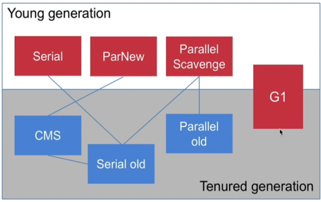

其中：

1. `Serial` 和 `Serial old` 都是串行收集器；

2. `ParNew` 和 `Parallel old` 都是并行收集器；

3. `G1` 是新生代和老年代都可以使用的收集器；

4. 新生代中的 `Serial` 收集器可以和老年代中的 `Serial old` 收集器组合使用；

5. 新生代中的 `ParNew` 收集器可以和老年代中的 `CMS` 收集器组合使用；

6. 新生代中的 `Parallel Scavenge` 收集器可以和老年代中的 `Serial old` 或 `Parallel old` 收集器组合使用；

7. 老年代中的 `CMS` 收集器可以和 `Serial old` 收集器配合使用。

    > 如：当 `CMS` 收集器无法正常使用时，使用 `Serial old` 收集器接替工作。

8. `G1` 收集器既可以处理新生代的垃圾回收，又可以处理老年代的垃圾回收。

    > 所以 `G1` 收集器不需要和其他收集器组合使用。

### 2.2 串行收集器（`Serial`（新生代）/ `Serial old`（老年代））

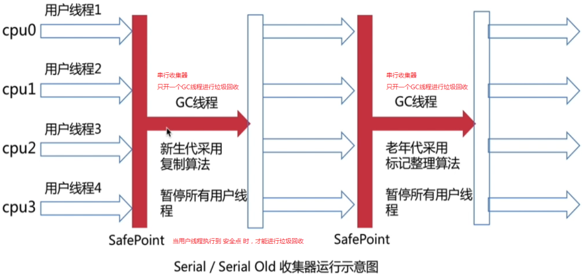

串行收集器的说明：

1. 新生代中的 `Serial` 收集器和老年代中的 `Serial old` 收集器都是串行收集器，串行收集器就是单线程的收集器；

2. 在垃圾回收时，串行收集器会 `STW`（`Stop-the-World`）。

3. 串行收集器的优点是简单，对于单 `CPU` 来说，由于没有多线程的交互开销，可能更高效。

4. `Serial` 收集器是默认的 `Client` 模式下的新生代收集器。

5. 通过设置参数 `-XX:+UseSerialGC` 开启串行收集器，此时，会采用 `Serial` + `Serial old` 的收集器组合。

6. 新生代中的串行收集器 `Serial` 采用复制算法；老年代中的串行收集器 `Serial old` 采用标记整理算法。

#### 2.2.1 示例：`Serial` + `Serial old` 组合的配置（`-XX:+UseSerialGC`）

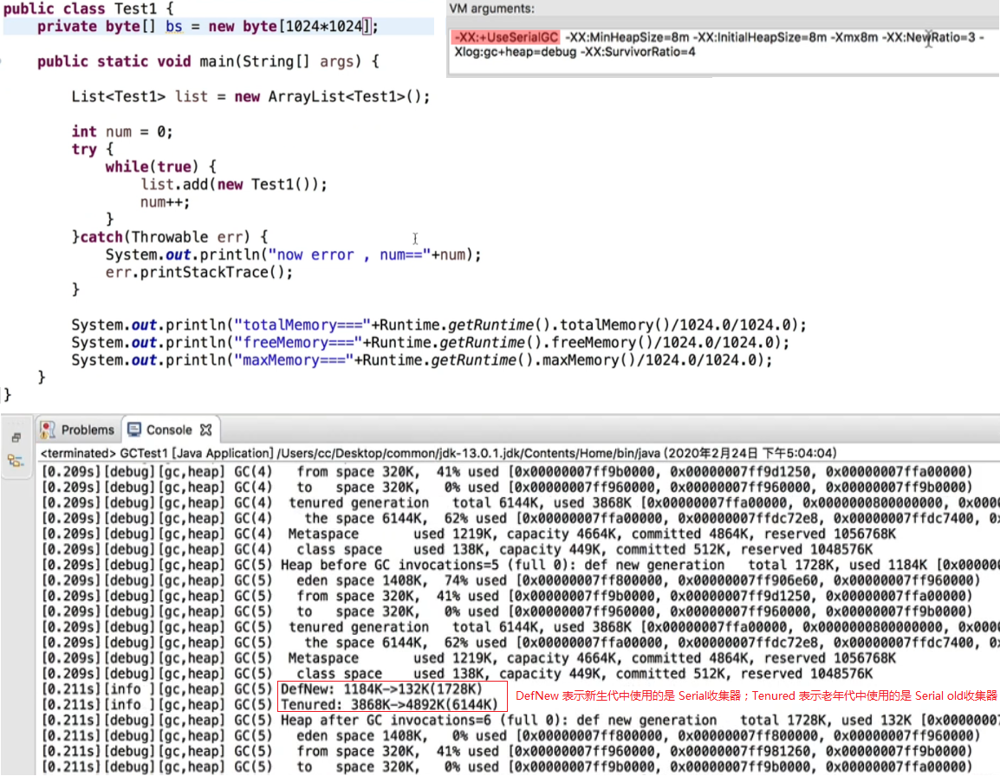

### 2.3 并行收集器（`ParNew`（新生代））

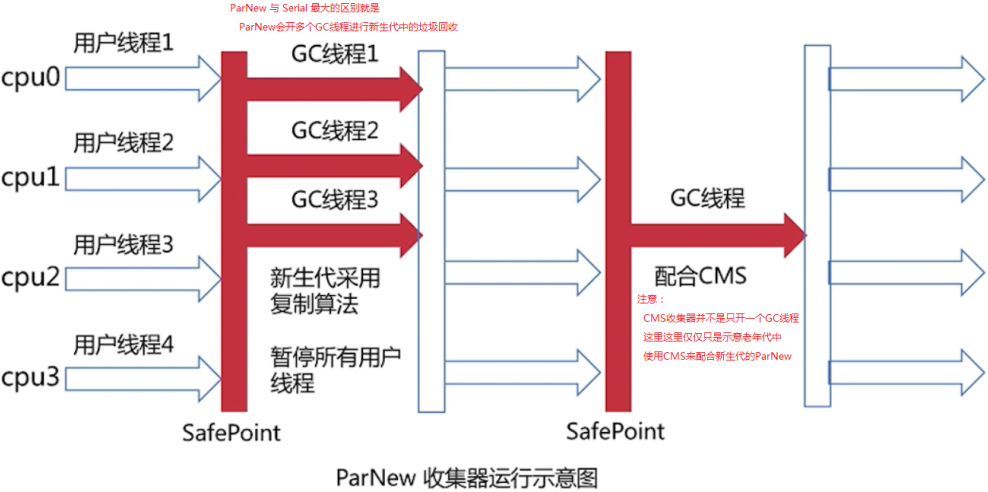

并行收集器 `ParNew` 的说明：

1. `ParNew` 收集器是新生代中的并行收集器，与 `Serial` 收集器的最大区别是：`ParNew` 收集器会使用多个 `GC` 线程进行新生代中的垃圾回收；

2. `ParNew` 收集器在垃圾回收时会 `STW`（`Stop-the-World`）。

3. 在并发能力好的 `CPU` 环境中，`ParNew` 并行收集器的停顿时间要比 `Serial` 串行收集器短；但对于单 `CPU` 或并发能力较弱的 `CPU`，由于多线程的交互开销，`ParNew` 并行收集器可能比 `Serial` 串行收集器更差。

4. 并行收集器 `ParNew` 是 `Server` 模式下首选的新生代收集器；

5. **新生代中的并行收集器 `ParNew` 通常与老年代中的 `CMS` 收集器组合使用**。

    > 当设置参数 `-XX:+UseConcMarkSweepGC`，指定老年代使用 `CMS` 收集器时，新生代就会使用 `ParNew` 收集器。
    > 
    > （不再使用参数 `-XX:+UseParNewGC` 来单独开启 `ParNew` 收集器） 

6. 通过设置参数 `-XX:ParallelGCThreads`，指定并行收集器 `ParNew` 的 `GC` 线程数。（最好与 `CPU` 数量一致）

7. 并行收集器 `ParNew` 只在新生代中使用，采用复制算法。

#### 2.3.1 示例：`ParNew` + `CMS` 组合的配置（`-XX:+UseConcMarkSweepGC`）

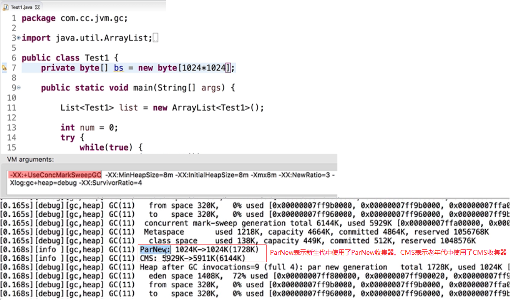

### 2.4 并行收集器（`Parallel Scavenge`（新生代）/ `Parallel old`（老年代））

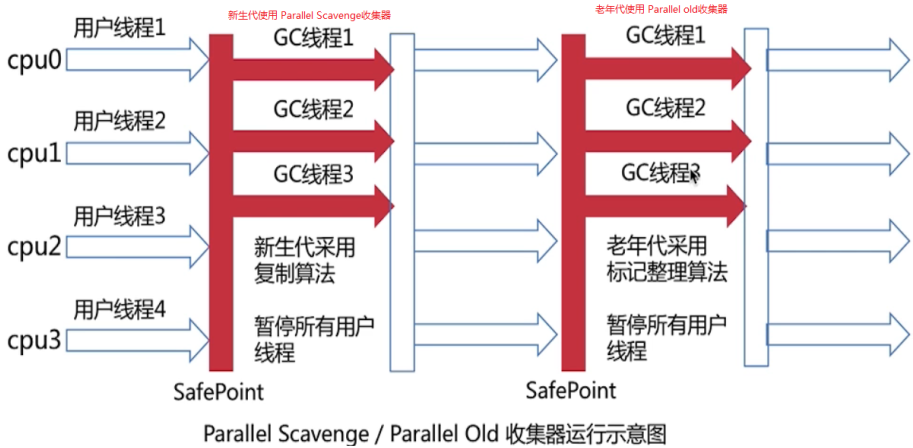

说明：

1. 并行收集器 `Parallel Scavenge` 只在新生代中使用，采用复制算法；并行收集器 `Parallel old` 只在老年代中使用，采用标记整理算法。

2. 新生代中的 `Parallel Scavenge` 并行收集器跟 `ParNew` 很类型，但 `Parallel Scavenge` 更关注吞吐量，能最高效率的利用 `CPU`，适合运行后台应用。

3. 通过设置参数 `-XX:+UseParallelGC`，或者设置参数 `-XX:+UseParallelOldGC`，都会使用 `Parallel Scavenge` + `Parallel old` 的收集器组合。

4. 通过设置参数 `-XX:MaxGCPauseMillis`，配置 `GC` 的最大停顿时间。

#### 2.4.1 示例：`Parallel Scavenge` + `Parallel old` 组合的配置（`-XX:+UseParallelGC` 或 `-XX:+UseParallelOldGC`）

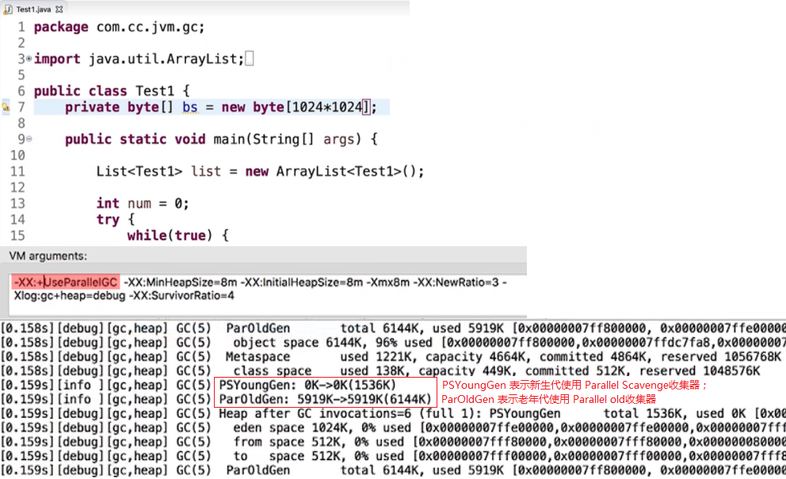

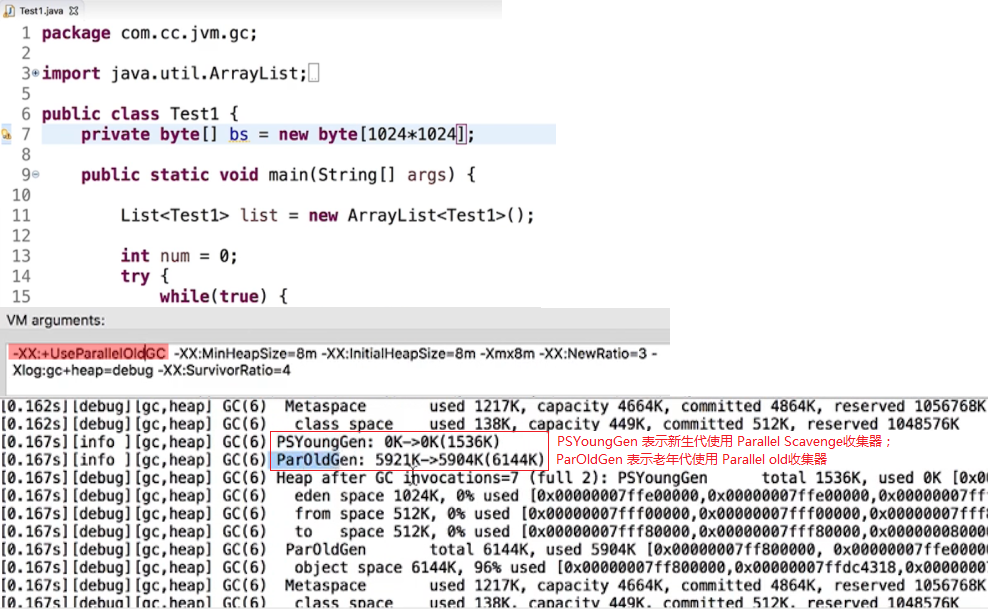

### 2.5 并发收集器（`CMS`，`Concurrent Mark and Sweep` 并发标记清除）

前面介绍的收集器（`Serial`、`Serial old`、`ParNew`、`Parallel Scavenge`、`Parallel old`）都是串行收集器或并行收集器，而这里介绍的老年代中的 `CMS` 收集器则是 **并发** 收集器。其中：

1. 所谓串行，就是指垃圾回收时，暂停用户线程，只开启一个 `GC` 线程进行垃圾回收；

2. 所谓并行，就是指垃圾回收时，暂停用户线程，开启多个 `GC` 线程进行垃圾回收。

3. 所谓并发，就是指垃圾回收时，不暂停 用户线程，可以开启多个 `GC` 线程进行垃圾回收。

    > 也就是说，“并发” 就意味着用户线程和 `GC` 线程可以同时运行。

另外，前面介绍的老年代中的 `Serial old` 和 `Parallel old` 收集器都是采用标记整理算法，而老年代中的 `CMS` 收集器则是采用 **标记清除算法**。

`CMS` 收集器的工作过程可划分为四个阶段：

1. 初始标记阶段：只标记 `GC Roots` 能直接关联到的对象。

2. 并发标记阶段：进行 `GC Roots Tracing` 的过程。

3. 重新标记阶段：修正并发标记期间，因程序运行导致标记发生变化的那一部分对象。

4. 并发清除阶段：并发回收垃圾对象。

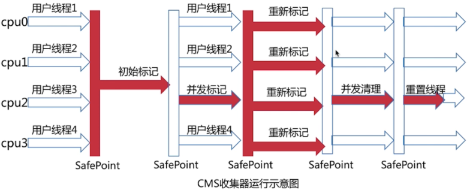

注意：

1. 在 `CMS` 的工作过程中，只有并发标记阶段和并发清除阶段中的线程是与用户线程同时运行的。在初始标记阶段和重新标记阶段中还是会暂停用户线程，即这两个阶段中可能会发生 `STW`（`Stop-the-World`）。

2. 运行示意图中，最后的重置线程，指的是清空跟收集相关的数据并重置，为下一次收集做准备。

`CMS` 收集器的优缺点：

1. 优点：低停顿、并发执行。

2. 缺点：

    1. 并发执行，对 `CPU` 资源压力大；
    2. 无法处理在处理过程中产生的垃圾，可能导致 `FullGC`；
    3. 采用的标记清除算法会导致大量的内存碎片，从而在分配大对象时可能触发 `FullGC`。

`CMS` 收集器的相关参数配置：

1. `-XX:+UseConcMarkSweepGC`：使用 `ParNew` + `CMS` + `Serial old` 的收集器组合。

    > 其中，`Serial old` 收集器将作为 `CMS` 出错时的后备收集器。

2. `-XX:CMSInitiatingOccupancyFraction`：设置在老年代的内存空间被使用多少后触发 `CMS` 收集器进行垃圾回收。

    > 默认是 `80%`。

### 2.6 `G1` 收集器（`Garbage-First`）

#### 2.6.1 `G1` 收集器的特点

`G1` 收集器是一款面向服务端应用的收集器，与其他收集器相比，具有如下特点：

1. `G1` 收集器把内存划分为多个独立的区域（`Region`）。

2. `G1`  收集器仍采用分代思想，保留了新生代和老年代，但它们不再是物理隔离的，而是一部分 `Region` 的集合。且不需要 `Region` 是连续的。

    > 前面介绍的垃圾收集器都是采用分代思想，且在内存的物理结构上，将内存 划分为新生代和老年代。

3. `G1` 收集器能充分利用多 `CPU`、多核环境硬件优势，尽量缩短 `STW`。

4. `G1` 收集器整体上采用标记整理算法，局部采用复制算法，不会产生内存碎片。

5. `GC` 收集器的停顿可预测，能明确地指定：在一个时间段内，消耗在垃圾收集上的时间不能超过多长时间。

6. `G1` 收集器跟踪各个 `Region` 里面垃圾堆的价值大小，在后台维护一个优先列表，每次根据允许的时间来回收价值最大的区域，从而保证在有限时间内的高效收集。

    > 所谓 “回收价值最大” 的区域，就是指垃圾对象存放最多的区域。因为回收这样的区域中的垃圾对象，释放后得到的可用内存空间最多。

7. `G1` 收集器一般不会进行 `FullGC`。通常是进行整个新生代区域的回收，以及部分回收价值最大的老年代区域的回收。也就是进行 `Mixed GC`。

#### 2.6.2 `G1` 收集器定义的五种类型的区域（`Region`）

`G1` 收集器把内存划分为多个独立的区域（`Region`），并定义了五种不同类型的 `Region`：

1. `Eden regions`：新生代的 `Eden` 区。

2. `Survivor regions`：新生代的 `Survivor` 区。

3. `Old regions`：老年代。

4. `Humongous regions`：巨型对象区域，专门用来存储大对象。通常也被认为是老年代的一部分。

    > `G1` 收集器认为只要对象的大小超过了一个 `Region` 容量的 `1/2`，即可判定为大对象。

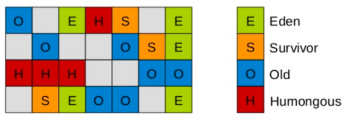

#### 2.6.3 `G1` 收集器的工作过程（四个阶段）

跟 `CMS` 类似，`G1` 收集器的工作过程可划分为四个阶段：

1. 初始标记阶段：只标记 `GC Roots` 能直接关联到的对象。

2. 并发标记阶段：进行 `GC Roots Tracing` 的过程。

3. 最终标记阶段：修正并发标记期间，因程序运行导致标记发生变化的那一部分对象。

4. 筛选回收阶段：根据时间来进行价值最大化的回收。

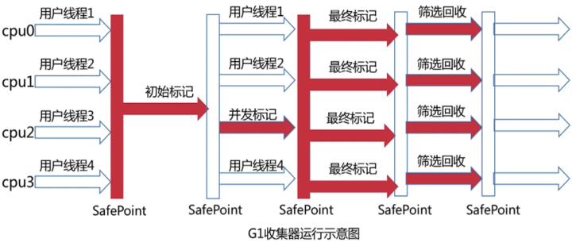

#### 2.6.4 `G1` 收集器的相关参数配置

##### 2.6.4.1 `-XX:+UseG1GC`（使用 `G1` 收集器）

开启并使用 `G1` 收集器。

> `JDK 13` 中默认使用 `G1` 收集器。

##### 2.6.4.2 `-XX:MaxGCPauseMillis=<n>`（最大 `GC` 停顿时间）

这里设置的最大 `GC` 停顿时间只是软件的目标，`JVM` 将尽可能让（但不保证）停顿小于这个时间。

##### 2.6.4.3 `-XX:InitiatingHeapOccupancyPercent=<n>`

占用了多少 `Java` 堆内存时触发 `GC`，默认为 `45`。

##### 2.6.4.4 `-XX:NewRatio=<n>`

默认为 `2`。

##### 2.6.4.5 `-XX:SurvivorRatio=<n>`

默认为 `8`。

##### 2.6.4.6 `-XX:MaxTenuringThreshold=<n>`

新生代到老年代的岁数。默认是 `15`。

> `15` 表示新生代中的某个对象在经历了 `15` 次 `GC` 后，仍然保留在新生代的存活区中，那么就会将该对象放到老年代中保存。

##### 2.6.4.7 `-XX:ParallelGCThreads=<n>`

并行 `GC` 的线程数。默认值会根据平台不同而不同。

##### 2.6.4.8 `-XX:ConcGCThreads=<n>`

并发 `GC` 使用的线程数。

##### 2.6.4.9 `-XX:G1ReservePercent=<n>`

设置作为空闲空间的预留内存百分比，以降低目标空间溢出的风险。默认值是 `10%`。

##### 2.6.4.10 `-XX:G1HeapRegionSize=<n>`

设置 `G1` 区域的大小。值是 `2` 的幂，范围是 `1MB` 到 `32MB`。

目标是根据最小的 `Java` 堆大小划分出约 `2048` 个区域。

### 2.7 `ZGC` 收集器

`ZGC` 收集器是 `JDK 11` 加入的低延迟收集器（处于试验阶段）。

`ZGC` 收集器的设计目标是：
1. 支持 `TB` 级内存容量；
2. 暂停时间低（`<10ms`）；
3. 对整个程序吞吐量的影响小于 `15%`。

`ZGC` 收集器中的新技术：
1. 着色技术：
2. 读屏障。

## 3. `GC` 性能指标

一款优秀的 `GC` 收集器，应该使得：
1. 吞吐量很大；
2. `GC` 负荷很小；
3. 暂停时间几乎没有。

> 交互式应用通常希望暂停时间越少越好。

### 3.1 吞吐量

吞吐量 = 应用代码执行的时间 / 运行的总时间

> 其中，运行的总时间 = 应用代码执行时间 + `GC` 时间。

### 3.2 `GC` 负荷

与吞吐量相反，`GC` 负荷 = `GC` 时间 / 运行的总时间

### 3.3 暂停时间

暂停时间就是发生 `STW`（`Stop-the-World`）的总时间。

### 3.4 `GC` 频率

`GC` 频率就是 `GC` 在一个时间段内发生的次数。

### 3.5 反应速度

反应速度就是从对象成为垃圾到被回收的时间。

> 并不是说反应速度越快越好。有时，反应速度快，可能意味着频繁的 `GC`。

## 4. `JVM` 内存分配原则

`JVM` 内存分配原则如下：

1. 新生代尽可能设置得大点，如果太小会导致：

    1. `YGC`（新生代的垃圾回收）次数更加频繁；
    2. 可能导致 `YGC` 后的对象进入老年代，如果此时老年代满了，会触发 `FGC`（即 `FullGC`）。

2. 对老年代，针对响应时间优先的应用：由于老年代通常采用并发收集器，因此老年代的大小要综合考虑并发量和并发持续时间等参数：

    1. 如果老年代的大小设置小了，可能会造成内存碎片，高回收频率会导致应用暂停；
    2. 如果老年代的大小设置大了，会需要较长的回收时间。

3. 对老年代，针对吞吐量优先的应用：通常设置较大的新生代和较小的老年代。

    > 这样可以尽可能回收大部分短期对象，减少中期对象，而老年代尽量存放长期存活的对象。

4. 依据对象的存活周期进行分类，对象优先分配在新生代中，长时间存活的对象则分配在老年代中。

5. 根据不同代的特点，选取合适的收集算法：

    1. 少量对象存活，适合复制算法；
    2. 大量对象存活，适合标记清除算法，或标记整理算法。