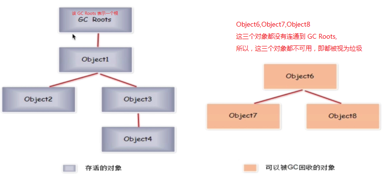
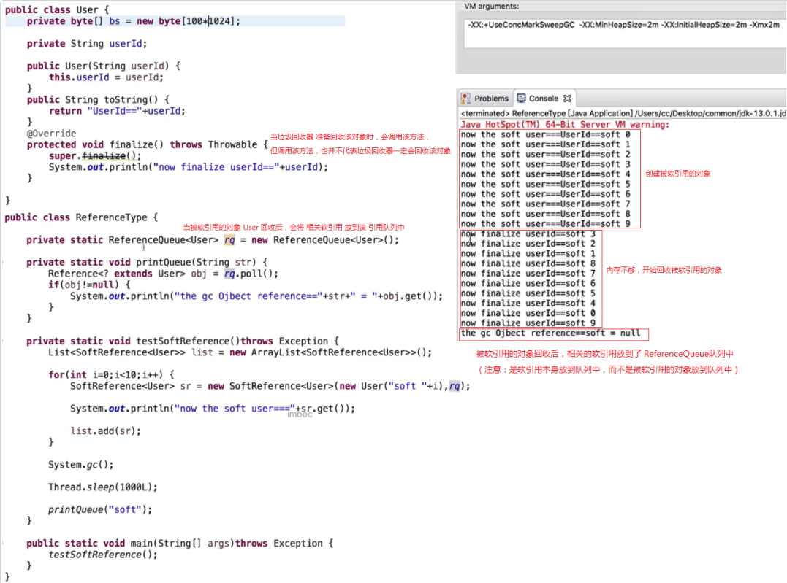
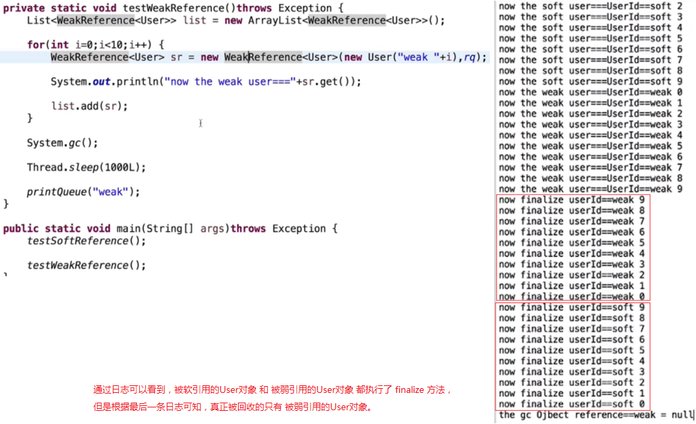
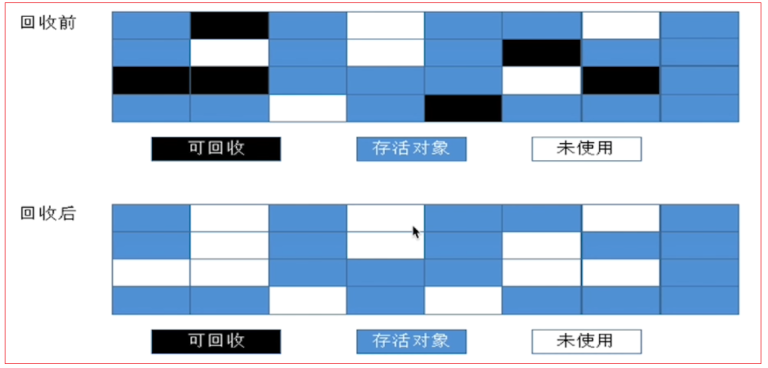

## 1. 垃圾回收基础

### 1.1 什么是垃圾

简单说就是：内存中已经不再被使用到的内存空间就是垃圾。

### 1.2 如何判定是垃圾

#### 1.2.1 引用计数法

引用计数法：给对象添加一个引用计数器，有访问就 `+1`，引用失效就 `-1`

引用计数法的优缺点：

1. 优点：实现简单，效率高；

2. 缺点：不能解决对象之间的循环引用问题。

    

#### 1.2.2 根搜索算法

从根（`GC Roots`）节点向下搜索对象节点，搜素走过的路径称为 **引用链**。当一个对象到根之间没有连通时，则该对象不可用，不可用的对象会被判定为垃圾，对其进行回收。

> 一个对象可能存在于多条引用链中，即可能不止一个根节点能连通到该对象，所以根节点用复数形式表示：`GC Roots`。



> 很多商用虚拟机都是采用根搜索算法来判定一个对象是不是垃圾。

##### 1.2.2.1 可作为 `GC Roots` 的对象

可作为 `GC Roots` 的对象包括：

1. 虚拟机栈中（方法参数和局部变量）引用的对象；
2. 方法区中的类静态成员变量引用的对象；
3. 方法区中常量引用的对象；
4. 本地方法栈中 `JNI` 引用的对象；
5. 作为同步锁的对象；
6. ......

##### 1.2.2.2 `HotSpot` 虚拟机对根搜索算法的优化（`OopMap` 数据结构）

按照根搜索算法，为了判定一个对象是否为垃圾，需要从每一个 `GC Roots` 开始遍历每一条引用链，从而查询某个对象是否在这些引用链中。

这样做的话，对于代码量很大，引用链很多的项目，判定对象是否为垃圾的效率是很低的。

为了解决这个问题，`HotSpot` 虚拟机采用 `OopMap` 这种数据结构来优化判定对象是否为垃圾的效率：

`OopMap` 数据结构中，存储了对象之间的引用关系，通过 `OopMap` 可以加快定位对象的引用位置，而不用从 `GC Roots` 开始遍历引用链，从而大大提高判定对象是否为垃圾的效率。

###### 1.2.2.2.1 安全点 & 安全区域

在 `OopMap` 的协助下，`JVM` 可以很快地完成对 `GC Roots` 的枚举。但是 `JVM` 并没有对每一条指令都记录并生成一个 `OopMap`。

记录并生成 `OopMap` 的这些 “特定位置” 被称为 **安全点**。

> 当用户线程执行到安全点后，才允许暂停用户线程，执行 `GC` 线程进行 `GC`。

如果一段代码中，对象引用关系不会发生变化，这段代码区域中任何地方开始 `GC` 都是安全的，那么这个区域称为 **安全区域**。

#### 1.2.3 引用分类

##### 1.2.3.1 强引用

类似于 `Foo foo = new Foo()` 这样的，称 `new` 出来的对象被强引用了。

被强引用的对象，在每次 `GC` 时都不会被回收。

##### 1.2.3.2 软引用

类似于 `SoftReference<Foo> sRef = new SoftReference<>(new Foo())` 这样的，称 `new` 出来的对象被软引用了。

被软引用的对象，当 `GC` 时，在内存不够用的情况下才会被回收。

##### 1.2.3.3 弱引用

类似于 `WeakReference<Foo> wRef = new WeakReference<>(new Foo())` 这样的，称 `new` 出来的对象被弱引用了。

被弱引用的对象，在每次 `GC` 时都会被回收。

##### 1.2.3.4 虚引用（幽灵引用）

类似于 `PhantomReference<Foo> wRef = new PhantomReference<>(new Foo(), referenceQueue)` 这样的，称 `new` 出来的对象被虚引用了。

虚引用也称为幽灵引用或幻影引用，是最弱的引用。

被虚引用的对象，在每次 `GC` 时都会被回收。

##### 1.2.3.5 示例：`GC` 对软引用和弱引用的影响（`finalize()` & `ReferenceQueue`）

1. `GC` 对软引用的影响

    

    > 1. 当垃圾收集器准备回收某个对象时 ，会调用该对象的 `finalize()` 方法。但是，调用该方法，也并不代表着垃圾收集器一定会回收该对象。
    > 
    > 2. 当垃圾收集器回收了被软引用的对象后，相关的软引用会放到 `ReferenceQueue` 队列中。注意：`ReferenceQueue` 中保存的是 `Reference` 本身，而不是 `Reference` 中引用的对象。

2. `GC` 对弱引用的影响

    

#### 1.2.4 跨代引用

跨代引用：就是一个代中的对象引用了另一个代中的对象。如：
1. 新生代中的对象引用了老年代中的对象；
2. 老年代中的对象引用了新生代中的对象。

跨代引用假说：跨代引用相对于同代引用来说只是极少数的。

> 隐含推论 ：存在互相引用关系的两个对象，应该是倾向于同时生存或同时消亡的。具体为：
> 
> 1. 当两个对象处于同一代中时，它们之间的引用就是同代引用，互相同代引用的两个对象，它们之间倾向于同时生存或同时消亡。
> 
> 2. 当两个对象不处于同一代中时，它们之间的引用就是跨代引用。此时，当老年代中的对象引用了新生代中的对象时，新生代中的对象不会被回收，而是会被转存到老年代中。也就是说，互相跨带引用的两个对象，经过多次 `GC` 后，最终会转为互相同代引用。

##### 1.2.4.1 跨代引用造成的问题

当进行垃圾回收时，为了查询跨代引用，不仅要扫描新生代中的对象，还要扫描老年代中的对象，这样才能判断存在着多少个新生代中的对象和老年代中的对象之间的跨代引用。

但是，这样做的话就会极大地影响垃圾回收的性能。为了解决这个问题，引入了新的数据结构：**记忆集**。

##### 1.2.4.2 记忆集（解决跨代引用造成的问题）

记忆集（`Remembered Set`）：一种用于记录从非收集区域指向收集区域的指针集合的抽象数据结构。

> 可以理解为，记忆集中记录了存在跨代引用的新生代对象和老年代对象的内存地址，当进行垃圾回收时，只需要判断记忆集中记录的存在跨代引用的对象是否为垃圾即可。

###### 1.2.4.2.1 实现记忆集的三种方式

实现记忆集这种数据结构所采用的三种方式：

1. 字长精度：每个记录精确到一个机器字长，该字包含跨代指针。

2. 对象精度：每个记录精确到一个对象，该对象里有字段含有跨代指针。

3. 卡精度：每个记录精确到一块内存区域，该区域内有对象含有跨代指针。

###### 1.2.4.2.2 卡表（`Card Table`，记忆集的具体实现）

卡表是记忆集的一种具体实现，定义了记忆集的记录精度与堆内存的映射关系。

> 卡表采用了卡精度实现记忆集这种数据结构。

###### 1.2.4.2.2 卡页（`Card Page`，卡表的组成元素）

卡表的每个元素都对应着其标识的内存区域中的一块特定大小的内存块。这个内存块称为卡页。

> 也就是说，卡表由卡页组成，每个卡页中保存了多个对象。

当某个卡页中的对象存在跨代引用时，就会记录下来。当进行垃圾回收时，会将这些记录了的对象筛选出来，通过根搜索算法来判定它们是否为垃圾。

###### 1.2.4.2.3 写屏障

卡表中记录了对象间的引用关系，那么当对象间的引用关系发生变化时，卡表中的数据记录状态也应该随着改变。那么由谁来维护卡表的数据记录状态？什么时候来改变卡表中的数据记录状态？答：在 `HotSpot` 虚拟机中，是通过 **写屏障** 这种技术来维护卡表中的数据记录状态的。

写屏障可以看成是 `JVM` 对 “引用类型字段赋值” 这个动作的 `AOP`。

> 所谓的对 “引用类型字段赋值” 这个动作的 `AOP`，就是说，`JVM` 会在 “引用类型字段赋值” 前后额外地添加一些程序，达到维护卡表的目的。其中：
> 
> 1. `JVM` 在 “引用类型字段赋值” 这个动作之前添加程序，称为 **写前屏障**。
> 
> 2. `JVM` 在 “引用类型字段赋值” 这个动作之后添加程序，称为 **写后屏障**。

#### 1.2.5 判定是否为垃圾的步骤

判定是否为垃圾的步骤为：

1. 先通过根搜索算法判定对象是否可用；

2. 对于不可用的对象，再看是否有必要执行 `finalize()` 方法；

3. 以上两步执行完后，如果对象仍然没有被使用，那么该对象就属于垃圾。

    > 通过第 `1`、`2` 步判定对象是否为垃圾时，存在两种情况：
    >
    > 1. 通过根搜索算法判定对象不在任何一条引用链上；且没必要执行 `finalize()` 方法；
    >
    > 2. 通过根搜索方法判定对象不在任何一条引用链上；且执行 `finalize()` 方法时，没有进行对象的自救。
    >
    > 如果执行完第 `1`、`2` 步，且满足以上两种情况，同时对象仍然没有被使用，那么该对象就是垃圾。

##### 1.2.5.1  `finalize()` 方法

`finalize()` 方法会在对象 **第一次** 进行垃圾回收时调用。

> 但是，如果对象没有重写 `finalize()` 方法，或者 `JVM` 已经调用过 `finalize()` 方法了，那么就没必要在第一次回收时再调用 `finalize()` 方法了。

如果 `finalize()` 方法在第一次回收时调用了，那么我们可以在对象的 `finalize()` 方法中进行 **对象的自救**。

> 注意：`finalize()` 方法并不靠谱，`Java` 中不建议使用 `finalize()` 方法。

##### 1.2.5.2  示例：通过 `finalize()` 方法实现对象的自救


### 1.3 如何回收垃圾

#### 1.3.1 `GC` 类型

##### 1.3.1.1 `MinorGC`（`YoungGC`）

发生在新生代的收集动作（`GC`）。

##### 1.3.1.2 `MajorGC`（`OldGC`）

发生在老年代的 `GC`。

> 目前只有 `CMS` 收集器会有单独收集老年代的行为。

##### 1.3.1.3 `MixedGC`

收集整个新生代以及部分老年代。

> 目前只有 `G1` 收集器会有这种行为。

##### 1.3.1.4 `FullGC`

收集整个 `Java` 堆和方法区的 `GC`。

> 注意：方法区中也可以进行垃圾回收。

#### 1.3.2 `STW`（`Stop-The-World`）

`STW` 是 `Java` 中的一种全局暂停的现象，多半是由 `GC` 引起的。

> 所谓全局暂停就是 `Java` 代码停止运行。不过 `native` 代码可以执行，但不能和 `JVM` 交互。

`STW` 的危害是长时间服务停止，没有响应。对于 `HA` 系统，可能引起主备切换，严重危害生产环境。

> 对虚拟机的优化，应该要尽量避免 `STW`，或者尽量缩减 `STW` 的耗时时长。

#### 1.3.3 判定类无用的条件

判定类无用的条件有：

1. `JVM` 中该类的所有实例都已经被回收；
2. 加载该类的 `ClassLoader` 已经被回收；
3. 没有任何地方引用该类的 `Class` 对象；
4. 无法在任何地方通过反射访问这个类。

#### 1.3.4 垃圾收集类型

##### 1.3.4.1 串行收集

单个 `GC` 线程进行内存回收，会暂停所有的用户线程。

> 如：`Serial`。

##### 1.3.4.2 并行收集

多个 `GC` 线程进行内存回收，会暂停所有的用户线程。

> 如：`Parallel`

##### 1.3.4.3 并发收集

`GC` 线程和用户线程同时执行（不一定是并行，可以是交替执行），不需要暂停用户线程。

> 如：`CMS`。

#### 1.3.5 垃圾回收算法

##### 1.3.5.1 标记清除算法（`Mark-Sweep`）

标记清除算法分为标记和清除两个阶段：
1. 先标记出要回收的对象；
2. 然后统一回收这些对象。



标记清除算法的优缺点：

1. 优点：简单。

2. 缺点：
   
    1. 效率不高，标记和清除的效率都不高；

    2. 标记清除后会产生大量不连续的内存碎片，从而导致在分配大对象时触发 `GC`。

        > 被标记的对象可能存放在各个不连续的内存空间中，那么清除这些内存空间后，就会产生多个不连续的未使用的内存空间（即 **内存碎片**）。由于未使用的内存空间是不连续的，因此无法存放下需要连续内存空间的大对象，从而导致在分配大对象时仍然会触发 `GC`。

##### 1.3.5.2 复制算法（`Copying`，一般在新生代中使用）

复制算法：把内存分成两块完全相同的区域，每次使用其中一块。当一块使用完了，就把这块上还存活的对象拷贝到另一块中，然后把这块清除掉。

> 新生代中，存活区内的 `from space` 和 `to space` 就是采用了复制算法。


复制算法的优缺点：

1. 优点：实现简单，运行高效，避免了内存碎片的产生。

2. 缺点：由于复制算法中，有一半的内存区域是保留的，所以造成了内存浪费。

`JVM` 实际实现中，是将内存分为一块较大的 `Eden` 区，和两块较小的 `Survivor` 区（`from` 和 `to`）。每次使用 `Eden` 和一块 `Survivor`。在回收时，把存活的对象复制到另一块 `Survivor` 中。

> `HotSpot` 虚拟机默认的 `Eden` 和 `Survivor` 的比值是 `8:1`，也就是每次能用 `90%` 的新生代空间。
> 
> ```:no-line-numbers
> Eden:Survivor = 8:1，即 Eden:from:to = 8:1:1，
> 于是，可使用的新生代空间为：(Eden+from)/(Eden+from+to) = 9/10 = 90%
> ```

在回收时，把存活的对象复制到另一块 `Survivor` 时，如果发现另一块 `Survivor` 空间不够，就要依赖老年代进行 **分配担保**，让放不下的对象直接进入老年代。

###### 1.3.5.2.1 分配担保

分配担保就是指：当新生代进行垃圾回收后，新生代的存活区放置不下，那么需要把这些对象放置到老年代中，此时，就需要担保老年代中有足够的内存空间来放置这些对象。

> “新生代的存活区放置不下这些对象” 有两种情况：
> 
> 1. `eden` 区 + 一个 `Survivor` 区（`from space`），对这两个区进行回收后，其中存活下来的对象过多，无法全部放到另一个 `Survivor` 区（`to space`）中；
> 
> 2. `eden` 区 + 一个 `Survivor` 区（`from space`），对这两个区进行回收后，当新生代为新的对象分配内存空间时，无法在新生代中找到足够大的空间来存放这个较大的新对象。
> 
> 以上两种情况中，无法放置到新生代中的这些对象，都需要将它们放置到老年代中去。

分配担保是一种策略，其过程如下：

1. 在发生 `MinorGC` 前，`JVM` 会检查老年代的最大可用连续空间是否大于新生代中所有对象的总空间：

    1. 如果大于，那么可以确保 `MinorGC` 是安全的；

    2. 如果小于，那么 `JVM` 会继续检查是否设置了允许担保失败：

        1. 如果允许担保失败，那么继续检查老年代的最大可用连续空间是否大于历次放置到老年代中的对象的平均大小：

            1. 如果大于，那么尝试进行一次 `MinorGC`；

            2. 如果不大于，那么改做一次 `Full GC`。

##### 1.3.5.3 标记整理算法（`Mark-Compact`，一般在老年代中使用）

由于复制算法在存活对象比较多的时候，效率较低、且有空间浪费，因此老年代一般不会选用复制算法，而是多选用标记整理算法。

标记整理算法的标记过程跟标记清除算法的标记过程一样，但标记整理算法的后续不是直接清除可回收的对象，而是让所有存活的对象都向一端移动，于是，端边界以外的内存中只留下了可回收的对象，此时直接清除端边界以外的内存即可。


## 2. 垃圾收集器

### 2.1 概述

### 2.2 串行收集器

### 2.3 并行收集器

### 2.4 新生代 `Parallel Scavenge` 收集器

### 2.5 `CMS` 收集器

### 2.6 `G1` 收集器

### 2.7 `ZGC` 收集器

## 3. `GC` 性能指标

## 4. `JVM` 内存分配原则