## 1. `JVM` 概述

`JVM`：`Java Virtual Machine`，也就是 `Java` 虚拟机

> 所谓虚拟机是指：通过软件模拟的具有完整硬件系统功能的、运行在一个完全隔离环境中的计算机系统。
>
> 即：虚拟机是一个计算机系统。这种计算机系统运行在完全隔离的环境中，且它的硬件系统功能是通过软件模拟出来的。

`JVM` 通过软件来模拟 `Java` 字节码的指令集，是 `Java` 程序的运行环境。

### 1.1 `JVM` 的主要功能

`JVM` 的主要功能包括：
1. 通过 `ClassLoader` 寻找和装载 `class` 文件；
2. 解释字节码成为指令，并执行，同时提供 `class` 文件的运行环境；
3. 进行运行期间的内存分配和垃圾回收；
4. 提供与硬件交互的平台。

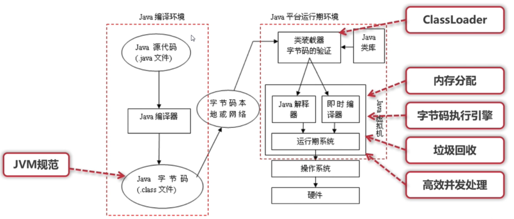

### 1.2 虚拟机是 `Java` 平台无关的保障

`Java` 程序只跟 `Java` 虚拟机相关，跟平台无关。

> 跟平台相关的是 `Java` 虚拟机本身。

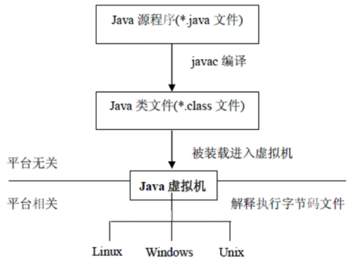

## 2. `JVM` 规范的作用

`Java` 虚拟机规范为不同的硬件平台提供了一种编译 `Java` 技术代码的规范。

> `JVM` 规范只是对编译出来的 `class` 字节码文件进行规范，而并没有对 `Java` 源文件进行规范。
>
> 也就是说 `Java` 虚拟机只认 `class` 字节码文件，不认 `Java` 源文件。
>
> `Java` 虚拟机不关心 `class` 字节码文件是怎么来的 ，只关心 `class` 字节码文件符不符合 `JVM` 规范。
>
> 即使开发语言不是 `Java`，只要能编译生成符合 `JVM` 规范的 `class` 字节码文件，那么这种开发语言也是可以使用的。
>
> 即 `Java` 虚拟机不仅实现了平台无关，也实现了开发语言无关。

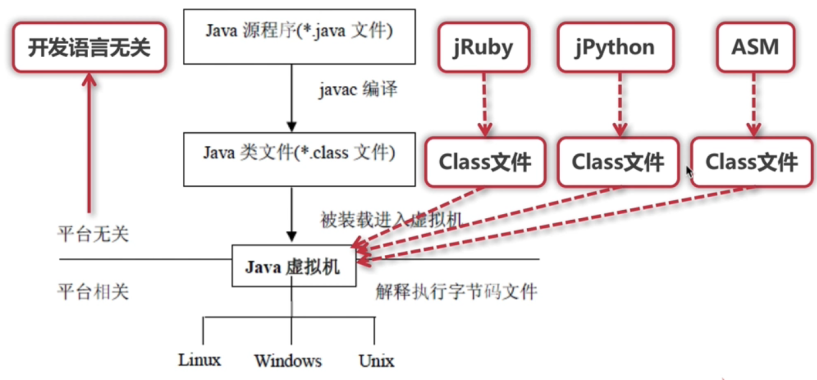

`JVM` 规范使 `Java` 软件独立于平台，因为编译是针对作为虚拟机的 “一般机器” 而做。

这个作为虚拟机的 “一般机器” 可以是用软件模拟并运行于各种现存的计算机系统；也可以是用硬件来实现。

> `JVM` 规范只是对 `Java` 虚拟机的实现提出了一些必须遵循的要求，并没有规定如何去实现 `Java` 虚拟机。因此，不同厂商实现的 `Java` 虚拟机可能是不同的。

## 3. `JVM` 规范文档的下载获取

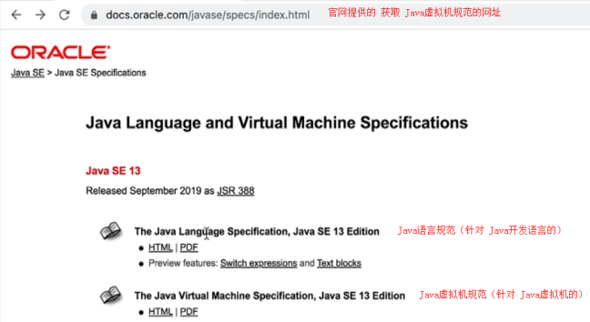

> `Java 8` 版本的虚拟机在网上有中文版的。
>
> `Java 8` 和 `Java 13` 版本的 `JVM` 规范文档基本上是一样的（在 `Java 13` 版本中的第 `5` 章多出了 `Module` 小节）。

## 4. `JVM` 规范中的主要内容

这里介绍 `Java SE8` 虚拟机规范文档（中文版）中的主要内容：
1. 字节码指令集（相当于中央处理器 `CPU`）
2. `Class` 文件的格式
3. 数据类型和值
4. 运行时数据区
5. 栈帧
6. 特殊方法
7. 类库
8. 异常
9. 虚拟机的启动、加载、链接和初始化

### 4.1 字节码指令集

`class` 字节码指令集的相关内容可参考 《`Java` 虚拟机规范 `Java SE 8` 版》 中的第 `2.11` 节、第 `6` 章、第 `7` 章。

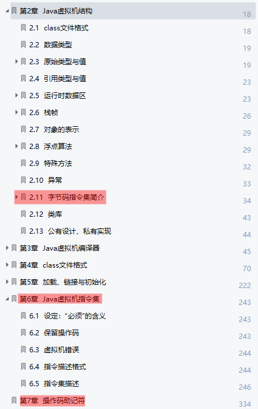

详见 [`5.` 字节码指令集](#_5-字节码指令集)

### 4.2 `Class` 文件的格式

参考 《`Java` 虚拟机规范 `Java SE 8` 版》 中第 `4` 章内容

详见 [`8. Class` 文件的格式](#_8-class-文件的格式)

### 4.3 数据类型和值

参考 《`Java` 虚拟机规范 `Java SE 8` 版》 中第 `2.2`、`2.3`、`2.4` 节内容

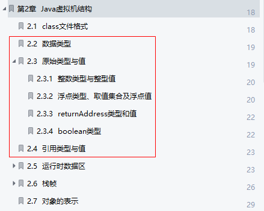

### 4.4 运行时数据区（TODO）

在后面的内存分配和字节码执行引擎中再讲解

### 4.5 栈帧（TODO）

在后面的内存分配和字节码执行引擎中再讲解

### 4.6 特殊方法

参考 《`Java` 虚拟机规范 `Java SE 8` 版》 中第 `2.9` 节内容

详见 [`6.` 特殊方法](#_6-特殊方法)

### 4.7 类库

详见 [`7.` 类库](#_7-类库)

### 4.8 异常

参考 《`Java` 虚拟机规范 `Java SE 8` 版》 中第 `2.10` 节内容

### 4.9 虚拟机的启动、加载、链接和初始化（TODO）

后面再讲解

## 5. 字节码指令集

### 5.1 字节码指令集简介

`Java` 虚拟机的指令由一个字节长度的、代表着某种特定操作含义的 **操作码**（`opcode`）以及跟随其后的 `0` 至多个代表此操作所需参数的 **操作数**（`operand`）所构成。

> 虚拟机中许多指令并不包含操作数，只有一个操作码。

> 我们常说的字节码指令其实就是这里的操作码。

### 5.2 数据类型与指令集

`JVM` 根据不同的数据类型提供不同的字节码指令。

如下表所示：

```:no-line-numbers
第 1 列的 Txxx 中的 T 相当于泛型参数，
即数据类型不同，T 的取值不同。如：对 byte 类型，Tipush 即为 bipush
```

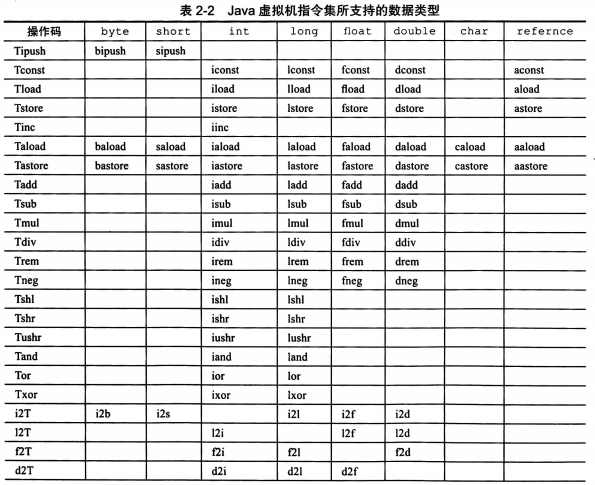

### 5.3 加载和存储指令

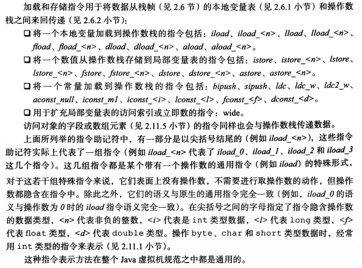

### 5.4 算术指令

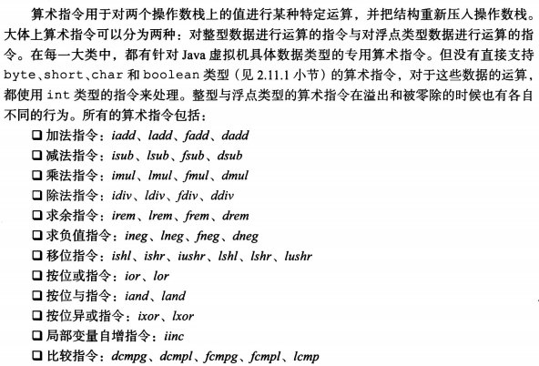

### 5.5 类型转换指令

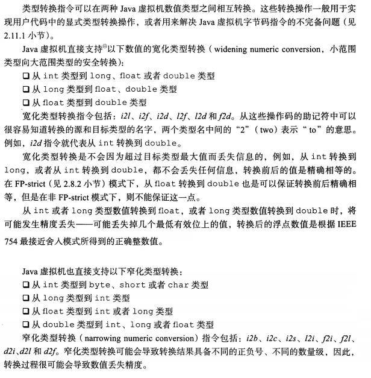

### 5.6 对象的创建与操作指令

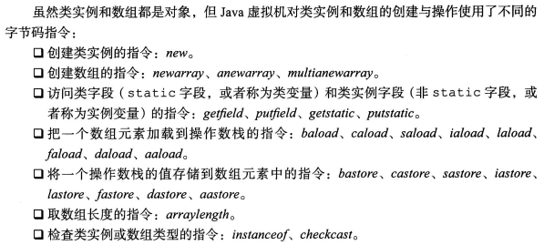

### 5.7 操作数栈管理指令

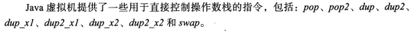

### 5.8 控制转移指令

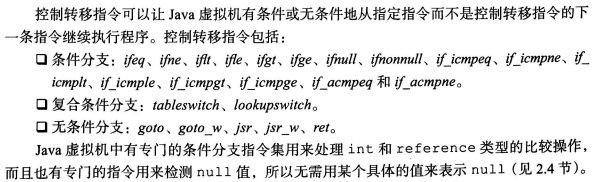

### 5.9 方法调用和返回指令

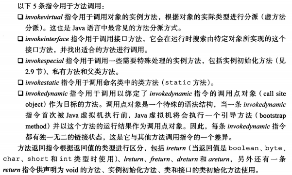

### 5.10 抛出异常相关的指令

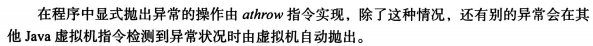

### 5.11 同步相关的指令

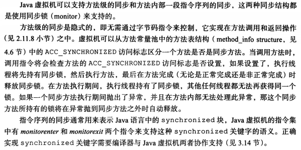

### 5.12 指令格式表（描述指令的功能，使用方式等）

通过指令格式表对指令进行描述，告诉你如何使用指令，指令格式表如下图所示：

```:no-line-numbers
指令格式表中描述了指令的功能，使用方式，注意事项等。
```

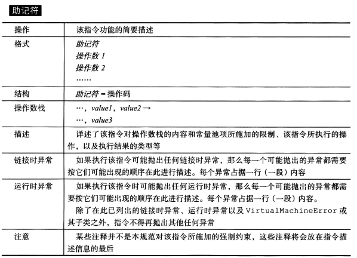

> 上表中，助记符就是字节码指令（助记符是给人看的）。操作码就是字节码指令对应的编码（给机器识别的）。
>
> 指令集中的指令都会以上表为模板进行描述。

#### 如何阅读指令格式表

下面举例说明如何阅读指令格式表中对指令的描述。

> 实际开发中，可以在 《`Java` 虚拟机规范 `Java SE 8` 版》 中第 `6.5` 节中查找具体指令的格式表

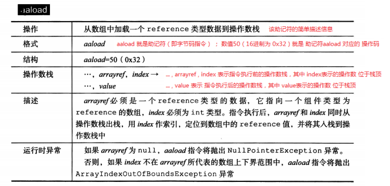

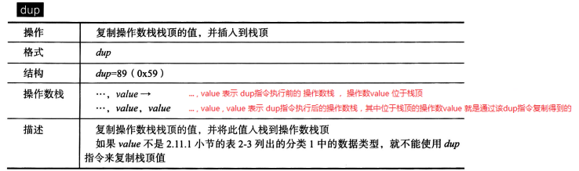

### 5.13 如何用字节码指令集表示 `Java` 代码

> 如果对某些字节码指令不知道什么时候用到，可以参数 《`Java` 虚拟机规范 `Java SE 8` 版》 中第 `3` 章的内容，查看字节码指令对应的 `Java` 代码是什么样的。

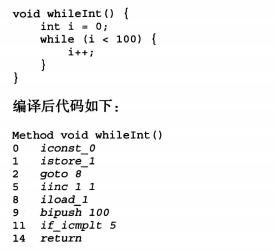

## 6. 特殊方法

### 6.1 `<init>`

实例初始化方法，通过 `JVM` 的 [`invokespecial` 指令](#_5-9-方法调用和返回指令) 来调用

> `<init>` 方法并不是指 `Java` 代码中定义的构造方法。
> 
> `Java` 代码中定义的构造方法可以理解成是 `JVM` 在执行完 `<init>` 方法，创建了实例对象之后，给程序员提供的一种回调方法。

### 6.2 `<clinit>`

类或接口的初始化方法，不包含参数，返回 `void`。

## 7. 类库

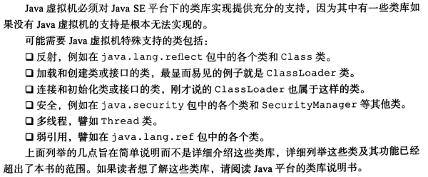

## 8. `Class` 文件的格式

### 常量池

### 类定义和属性

### 方法和方法调用

## 9. `ASM` 开发

### 9.1 编程模型和核心 `API`

### 9.2 `ClassVisitor` 开发

### 9.3 `MethodVisitor` 开发

### 9.4 实现模拟 `AOP` 功能