## 1. `JVM` 概述

`JVM`：`Java Virtual Machine`，也就是 `Java` 虚拟机

> 所谓虚拟机是指：通过软件模拟的具有完整硬件系统功能的、运行在一个完全隔离环境中的计算机系统。
>
> 即：虚拟机是一个计算机系统。这种计算机系统运行在完全隔离的环境中，且它的硬件系统功能是通过软件模拟出来的。

`JVM` 通过软件来模拟 `Java` 字节码的指令集，是 `Java` 程序的运行环境。

### 1.1 `JVM` 的主要功能

`JVM` 的主要功能包括：
1. 通过 `ClassLoader` 寻找和装载 `class` 文件；
2. 解释字节码成为指令，并执行，同时提供 `class` 文件的运行环境；
3. 进行运行期间的内存分配和垃圾回收；
4. 提供与硬件交互的平台。


### 1.2 虚拟机是 `Java` 平台无关的保障

`Java` 程序只跟 `Java` 虚拟机相关，跟平台无关。

> 跟平台相关的是 `Java` 虚拟机本身。


## 2. `JVM` 规范的作用

`Java` 虚拟机规范为不同的硬件平台提供了一种编译 `Java` 技术代码的规范。

> `JVM` 规范只是对编译出来的 `class` 字节码文件进行规范，而并没有对 `Java` 源文件进行规范。
>
> 也就是说 `Java` 虚拟机只认 `class` 字节码文件，不认 `Java` 源文件。
>
> `Java` 虚拟机不关心 `class` 字节码文件是怎么来的 ，只关心 `class` 字节码文件符不符合 `JVM` 规范。
>
> 即使开发语言不是 `Java`，只要能编译生成符合 `JVM` 规范的 `class` 字节码文件，那么这种开发语言也是可以使用的。
>
> 即 `Java` 虚拟机不仅实现了平台无关，也实现了开发语言无关。


`JVM` 规范使 `Java` 软件独立于平台，因为编译是针对作为虚拟机的 “一般机器” 而做。

这个作为虚拟机的 “一般机器” 可以是用软件模拟并运行于各种现存的计算机系统；也可以是用硬件来实现。

> `JVM` 规范只是对 `Java` 虚拟机的实现提出了一些必须遵循的要求，并没有规定如何去实现 `Java` 虚拟机。因此，不同厂商实现的 `Java` 虚拟机可能是不同的。

## 3. `JVM` 规范文档的下载获取


> `Java 8` 版本的虚拟机在网上有中文版的。
>
> `Java 8` 和 `Java 13` 版本的 `JVM` 规范文档基本上是一样的（在 `Java 13` 版本中的第 `5` 章多出了 `Module` 小节）。

## 4. `JVM` 规范中的主要内容

这里介绍 `Java SE8` 虚拟机规范文档（中文版）中的主要内容：
1. 字节码指令集（相当于中央处理器 `CPU`）
2. `Class` 文件的格式
3. 数据类型和值
4. 运行时数据区
5. 栈帧
6. 特殊方法
7. 类库
8. 异常
9. 虚拟机的启动、加载、链接和初始化

### 4.1 字节码指令集

`class` 字节码指令集的相关内容可参考 《`Java` 虚拟机规范 `Java SE 8` 版》 中的第 `2.11` 节、第 `6` 章、第 `7` 章。


详见 [`5.` 字节码指令集](#_5-字节码指令集)

### 4.2 `Class` 文件的格式

参考 《`Java` 虚拟机规范 `Java SE 8` 版》 中第 `4` 章内容

详见 [`8. Class` 文件的格式](#_8-class-文件的格式)

### 4.3 数据类型和值

参考 《`Java` 虚拟机规范 `Java SE 8` 版》 中第 `2.2`、`2.3`、`2.4` 节内容


### 4.4 运行时数据区（TODO）

在后面的内存分配和字节码执行引擎中再讲解

### 4.5 栈帧（TODO）

在后面的内存分配和字节码执行引擎中再讲解

### 4.6 特殊方法

参考 《`Java` 虚拟机规范 `Java SE 8` 版》 中第 `2.9` 节内容

详见 [`6.` 特殊方法](#_6-特殊方法)

### 4.7 类库

详见 [`7.` 类库](#_7-类库)

### 4.8 异常

参考 《`Java` 虚拟机规范 `Java SE 8` 版》 中第 `2.10` 节内容

### 4.9 虚拟机的启动、加载、链接和初始化（TODO）

后面再讲解

## 5. 字节码指令集

### 5.1 字节码指令集简介

`Java` 虚拟机的指令由一个字节长度的、代表着某种特定操作含义的 **操作码**（`opcode`）以及跟随其后的 `0` 至多个代表此操作所需参数的 **操作数**（`operand`）所构成。

> 虚拟机中许多指令并不包含操作数，只有一个操作码。

> 我们常说的字节码指令其实就是这里的操作码。

### 5.2 数据类型与指令集

`JVM` 根据不同的数据类型提供不同的字节码指令。

如下表所示：

```:no-line-numbers
第 1 列的 Txxx 中的 T 相当于泛型参数，
即数据类型不同，T 的取值不同。如：对 byte 类型，Tipush 即为 bipush
```


### 5.3 加载和存储指令


### 5.4 算术指令


### 5.5 类型转换指令


### 5.6 对象的创建与操作指令


### 5.7 操作数栈管理指令


### 5.8 控制转移指令


### 5.9 方法调用和返回指令


### 5.10 抛出异常相关的指令


### 5.11 同步相关的指令


### 5.12 指令格式表（描述指令的功能，使用方式等）

通过指令格式表对指令进行描述，告诉你如何使用指令，指令格式表如下图所示：

```:no-line-numbers
指令格式表中描述了指令的功能，使用方式，注意事项等。
```


> 上表中，助记符就是字节码指令（助记符是给人看的）。操作码就是字节码指令对应的编码（给机器识别的）。
>
> 指令集中的指令都会以上表为模板进行描述。

#### 如何阅读指令格式表

下面举例说明如何阅读指令格式表中对指令的描述。

> 实际开发中，可以在 《`Java` 虚拟机规范 `Java SE 8` 版》 中第 `6.5` 节中查找具体指令的格式表


### 5.13 如何用字节码指令集表示 `Java` 代码

> 如果对某些字节码指令不知道什么时候用到，可以参数 《`Java` 虚拟机规范 `Java SE 8` 版》 中第 `3` 章的内容，查看字节码指令对应的 `Java` 代码是什么样的。


## 6. 特殊方法

### 6.1 `<init>`

实例初始化方法，通过 `JVM` 的 [`invokespecial` 指令](#_5-9-方法调用和返回指令) 来调用

> `<init>` 方法并不是指 `Java` 代码中定义的构造方法。
> 
> `Java` 代码中定义的构造方法可以理解成是 `JVM` 在执行完 `<init>` 方法，创建了实例对象之后，给程序员提供的一种回调方法。

### 6.2 `<clinit>`

类或接口的初始化方法，不包含参数，返回 `void`。

## 7. 类库


## 8. `Class` 文件的格式

### 8.1 `Class` 文件概述

`Class` 文件是 `JVM` 的输入；是 `JVM` 实现平台无关、语言无关的基础。

> `Java` 虚拟机规范中定义了 `Class` 文件的结构（参考 《`Java` 虚拟机规范 `Java SE 8` 版》 中第 `4` 章内容）。

`Class` 文件是一组以 `8` 字节为单位的字节流。文件中的各个数据项目按指定的顺序紧凑排列。

> 对于占用空间大于 `8` 字节的数据项，按照高位在前的方式分割成多个 `8` 字节进行存储。

### 8.2 `Class` 文件中的两种类型（无符号数、表）

总的来说，`Class` 文件中只有两种类型：

1. **无符号数：** 即基本数据类型。以 `u1`、`u2`、`u4`、`u8` 来代表几个字节的无符号数。

    > `u1` 代表 `1` 字节的无符号数，...，`u8` 代表 `8` 字节的无符号数。

2. **表：** 由多个无符号数和其他表构成的复合数据类型。通常以 "`_info`" 结尾。

### 8.3 `ClassFile` 结构

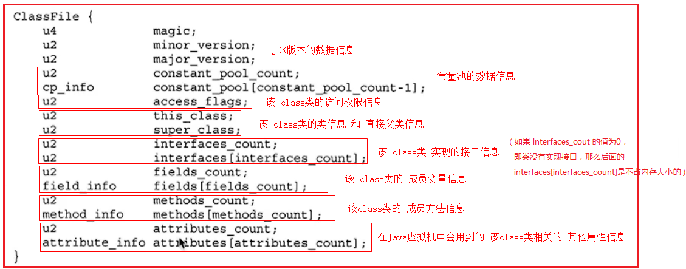

### 8.4 查看 `Java` 源码对应的 `Class` 字节码文件的三种方式

#### 8.4.1 在 `Eclipse` 中查看 `class` 文件

在 `Eclipse` 的 `Navigator` 视图中找到 `class` 文件，打开查看即可。

> 此方式查看的 `class` 文件不完整。

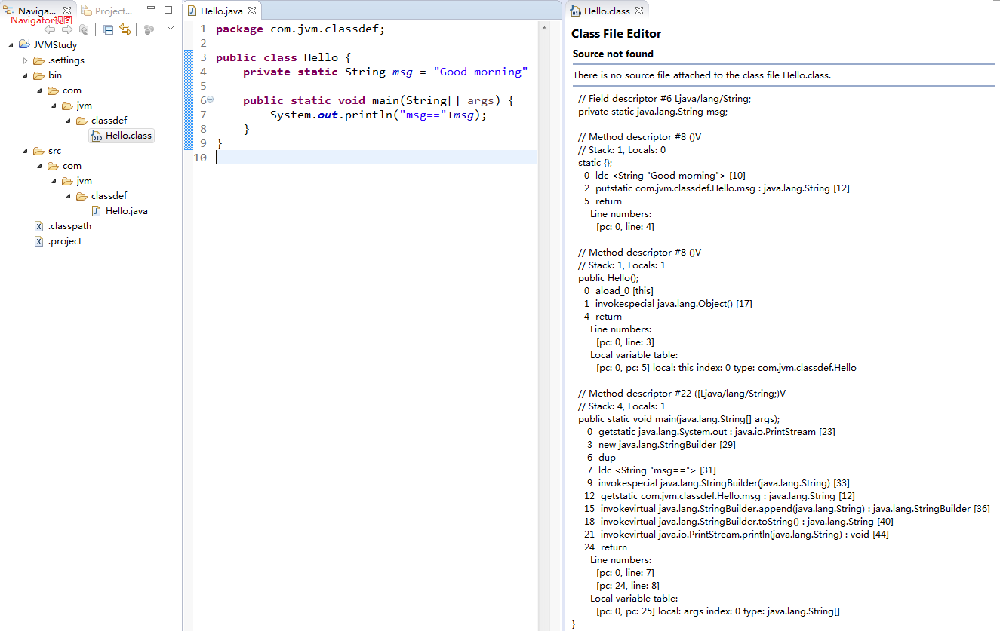

#### 8.4.2 通过 `javap` 命令查看 `class` 文件

在 `class` 文件所在的 `bin` 目录下执行 "`javap -verbose` 全路径类名" 查看 `class` 文件。

> 此方式查看的 `class` 文件是完整的。

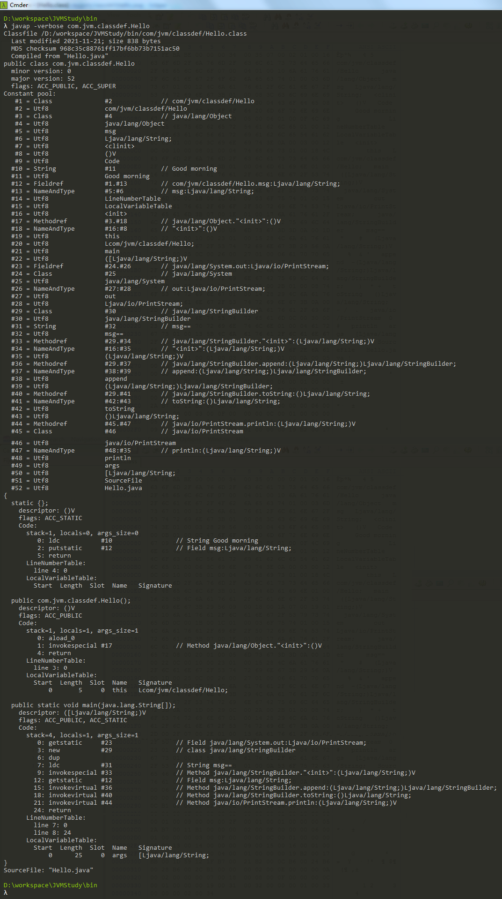

##### `javap` 生成的非正式 “虚拟机汇编语言” 的格式：

通过 `javap` 查看 `class` 文件时，对于类中成员方法的方法体代码，采用非正式 “虚拟机汇编语言” 进行描述。格式如下：

```
<index> <opcode> [<operand1> [<operand2> ...]] [<comment>]
其中：
<index> 是指令操作码在数组中的下标，该数组以字节形式来存储当前分发的 `Java` 虚拟机代码；
        也可以是相对于方法起始处的字节偏移量
<opcode> 是指令的操作码
<operand> 是操作数
<comment> 是行尾的注释
```

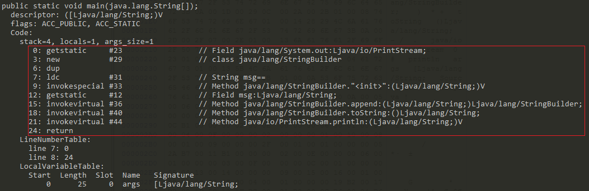

如上图中的 `main` 方法所示：

```:no-line-numbers
对于 0: getstatic   #23   // Field java/lang/System.out:Ljava/io/PrintStream; 
其中：
<index> 就是 0
<opcode> 就是助记符 getstatic（用于获取类的静态字段值）
<operand> 只有一个，就是 #23（表示 Constant Pool 常量池中的编号）
<comment> 就是 // 后面的内容
这条非正式 “虚拟机汇编语言” 的含义就是：将静态字段值 System.out 插入到操作数栈的栈顶
```

#### 8.4.3 通过 `16` 进制文件查看工具（如 `winhex`）查看 `class` 文件

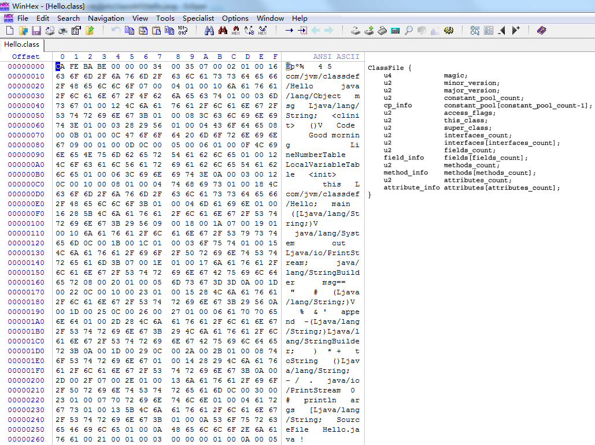

参考 《`Java` 虚拟机规范 `Java SE 8` 版》 第 `4.1` 节内容，结合 `ClassFile` 结构，对 `winhex` 中显示的 `Hello.class` 文件的 `16` 进制数据分析如下：

```:no-line-numbers
1. 最开始的 4 字节（u4）是 magic（魔数），JVM 规范要求固定为 0xCAFEBABE
2. 接下来的 2 字节（u2）是 minor_version（副版本号），即 0x0000，对应十进制 0
3. 接下来的 2 字节（u2）是 major_version（主版本号），即 0x0034，对应十进制 16*3+4 = 52
    因为 JDK 版本为 1.k（k>=2）时，对应的 class 文件版本号范围是 45.0 ~ 44+k.0，所以这里的版本号是 1.8.0（44+8 = 52）
4. 接下来的 2 字节（u2）是 constant_pool_count，表示常量池的大小，即 0x0035，对应十进制 53
    注意：常量池的大小不是指常量池所占的内存字节数，而是指常量池中的成员个数。
    常量池中的成员索引为 [0, constant_pool_count - 1]，
    常量池中的 #0 不是一个有效的常量池项，仅用来表示 “不引用任何一个常量池项”。
    也就是说，当 constant_pool_count = 53 时，常量池中有效的常量索引为 #1 ~ #52
```

### 8.5 常量池

`Java` 虚拟机指令不依赖于类、接口、类的实例对象、或数组的运行时布局，而是依赖常量池表中的符号信息。

> 即通过指令集中的指令来描述 `Java` 代码时，需要依赖 `class` 文件中常量池内保存的符号信息。

#### 8.5.1 常量池项在 `class` 文件中的通用格式

常量池表中的所有的项都具有如下通用格式：

```:no-line-numbers
cp_info {
    u1 tag;
    u2 info[];
}
```

常量池表中，一个 `cp_info` 表示一个常量池项，`ClassFile` 结构中的常量池数组就是由多个 `cp_info` 构成的。

常量池表中，存在多个不同类型的 `cp_info`（常量池项）。

> `cp_info` 中占 `1` 字节（u1）的 `tag` 表示 `cp_info` 的类型。
>
> `tag` 不同，`cp_info` 成员结构（`info[]`）也不同，`cp_info` 所占的内存大小也不同。 

> 注意：通用格式中的 "`u1 info[]`" 并不是说 `cp_info` 中 `tag` 之后 `info` 数组只占 `1` 字节。
> 
> "`u1 info[]`" 没有明确的含义，必须根据不同的 tag 值，才能确定 `info[]` 表示的成员结构和所占的内存大小。

#### 8.5.2 常量池项的类型（`tag`）

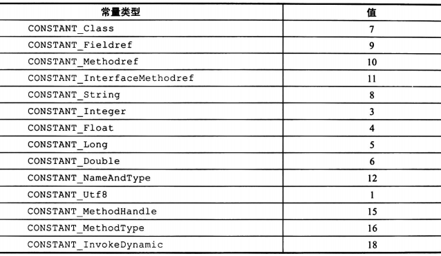

> 上图所示的表中给出了 `cp_info` 常量池项的不同 `tag` 类型，以及对应的 `tag` 数值。

##### 8.5.2.1 `CONSTANT_Class_info` 类型

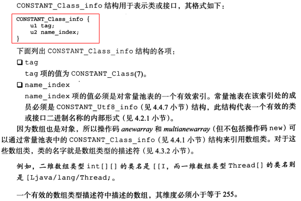

##### 8.5.2.2 `CONSTANT_Fieldref_info` 类型
##### 8.5.2.3 `CONSTANT_Methodref_info` 类型
##### 8.5.2.4 `CONSTANT_InterfaceMethodref_info` 类型

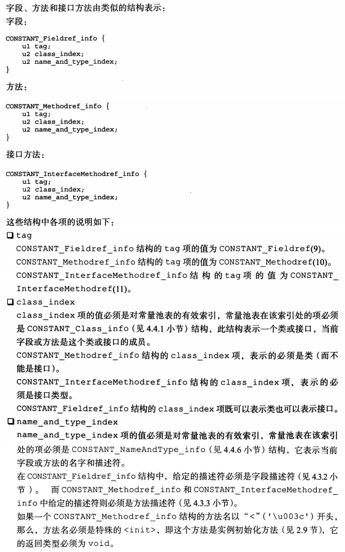

##### 8.5.2.5 `CONSTANT_String_info` 类型

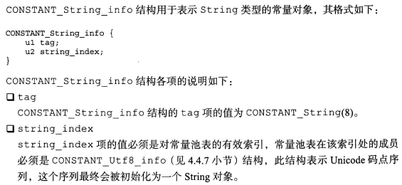

##### 8.5.2.6 `CONSTANT_Integer_info` 类型
##### 8.5.2.7 `CONSTANT_Float_info` 类型

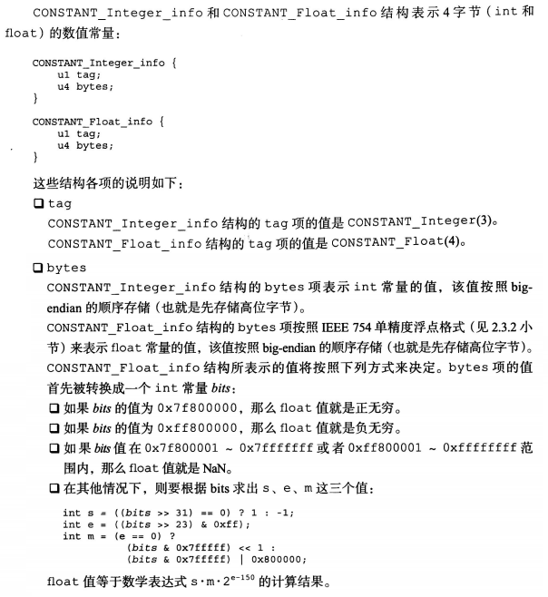

##### 8.5.2.8 `CONSTANT_Long_info` 类型
##### 8.5.2.9 `CONSTANT_Double_info` 类型

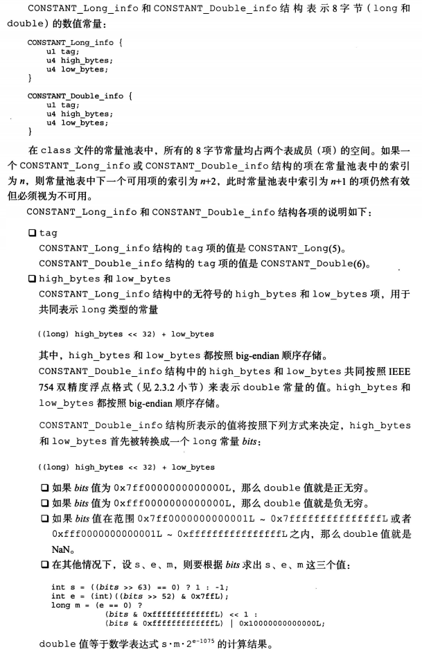

##### 8.5.2.10 `CONSTANT_NameAndType_info` 类型

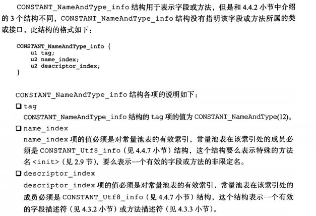

##### 8.5.2.11 `CONSTANT_Utf8_info` 类型

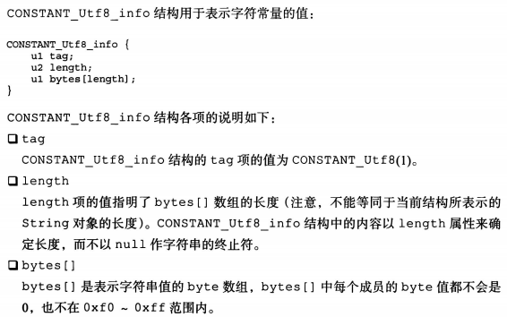

##### 8.5.2.12 `CONSTANT_MethodHandle_info` 类型

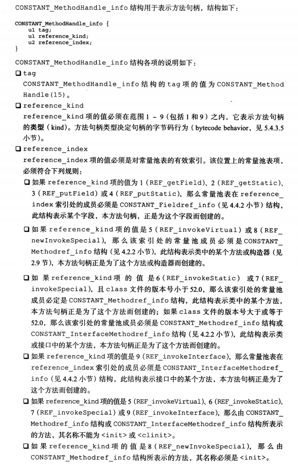

##### 8.5.2.13 `CONSTANT_MethodType_info` 类型

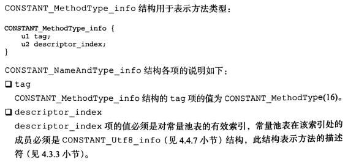

##### 8.5.2.14 `CONSTANT_InvokeDynamic_info` 类型

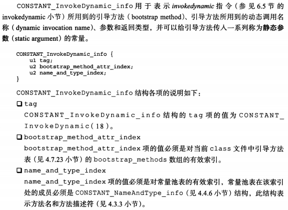

#### 8.5.3 如何确定 `class` 文件中常量池的结束位置 

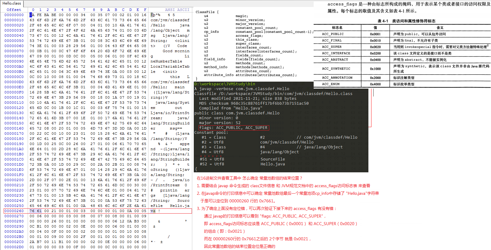

### 8.6 `access_flags`（访问权限标志）

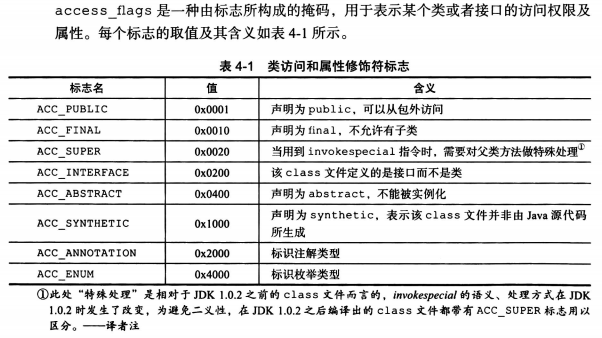

### 8.7 `this_class`、`super_class`、`interfaces`

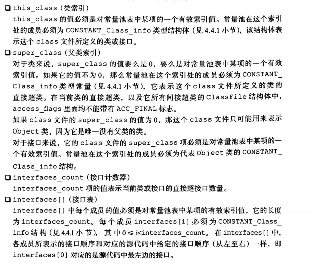

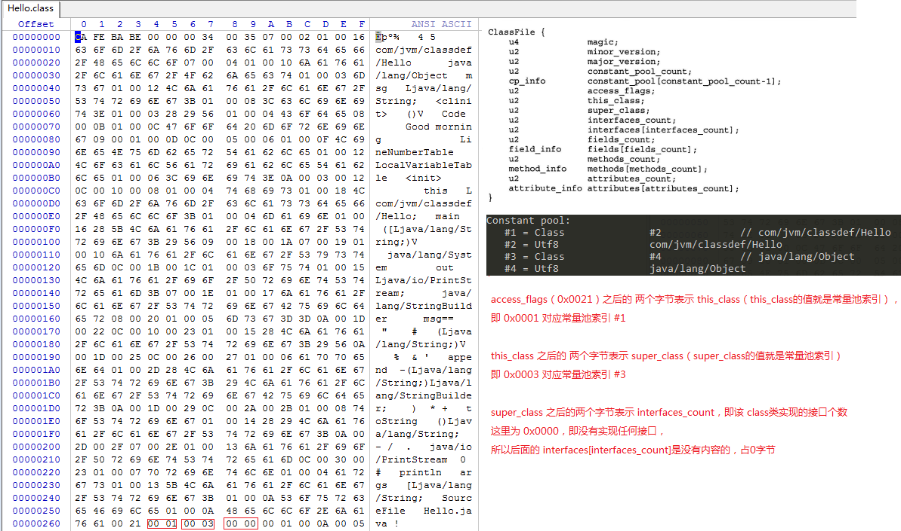

### 8.8 字段（成员变量）

每个字段（`field`）都通过 `field_info` 结构定义。

#### 8.8.1 字段在 `class` 文件中的格式

```:no-line-numbers
field_info {
    u2              access_flags;
    u2              name_index;
    u2              descriptor_index;
    u2              attributes_count;
    attribute_info  attributes[attributes_count];
}

其中：
access_flags：表示字段的访问权限和基本属性。可以是多个权限和属性的标志的组合（位或运算）。
name_index：是对常量池表的一个有效索引，该索引指向的常量池项的类型为 CONSTANT_Utf8_info，用于表示字段名。
descriptor_index：是对常量池表的一个有效索引，该索引指向的常量池项的类型为 CONSTANT_Utf8_info，用于表示字段描述符。
attributes_count：表示当前字段的附加属性的数量。
attributes[]：表示附加属性表，表中每个附加属性的结构必须是 attribute_info。
```

##### 字段描述符

字段的描述符（`descriptor`）是一个用于 **描述字段类型** 的字符串。

> 字段描述符不仅可以描述成员变量的类型，还可以描述静态变量和局部变量的类型。
> 
> 即：字段描述符就是用来描述任意变量的类型的。

> 参考 《`Java` 虚拟机规范 `Java SE 8` 版》 第 `4.3.2` 节（字段描述符）内容。

```:no-line-numbers
// 字段描述符用于描述字段类型
FieldDescriptor:
    FieldType

// 字段类型包括：基本类型、类类型、数组类型
FieldType:
    BaseType
    ObjectType
    ArrayType

// 基本类型就是 byte/char/double/float/int/long/short/boolean 其中之一。
BaseType: one of
    B C D F I J S Z

// 类类型就是 "L + 全路径类名（路径中的 "." 用 "/" 代替） + ;"
ObjectType:
    L<ClassName>;

// 数组类型就是 "[ + 元素类型"
ArrayType:
    [<ComponentType>

// 数组的元素类型就是 字段类型
ComponentType:
    FieldType
```

字段描述符解释表如下：

|`FieldType` 中的字符|类型|含义|
|:-|:-|:-|
|`B`|`byte`|字节型数|
|`C`|`char`|字符型数|
|`D`|`double`|双精度浮点数|
|`F`|`float`|单精度浮点数|
|`I`|`int`|整型数|
|`J`|`long`|长整数|
|`L<ClassName>`|`reference`|`ClassName` 类的实例|
|`S`|`short`|短整数|
|`Z`|`boolean`|布尔值 `true/false`|
|`[`|`reference`|一个一维数组|

> 特别注意：基本类型中，`long` 的描述符为 `J`，`boolean` 的描述符为 `Z`，其他基本类型的描述符即为大写的首字母。

举例：

```:no-line-numbers
int 变量的描述符是：I
Object 类型的实例变量的描述符是：Ljava/lang/Object;
三维数组 double d[][][] 类型的变量的描述符是：[[[D
```

#### 8.8.2 字段的访问权限和基本属性的标志

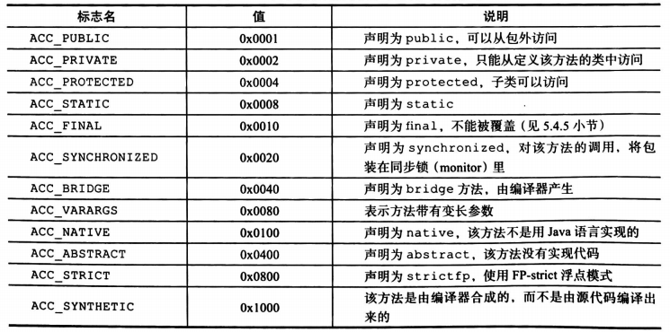

> 字段的各个访问标志是可以通过位或运算进行组合的。
> 
> 如 `private static` 修饰的字段就是 `ACC_PRIVATE` 和 `ACC_STATIC` 的组合，此时 `access_flags` 的值就是 `0x0002 | 0x0008 = 0x000A`

#### 8.8.3 字段在 `class` 文件中的解析举例

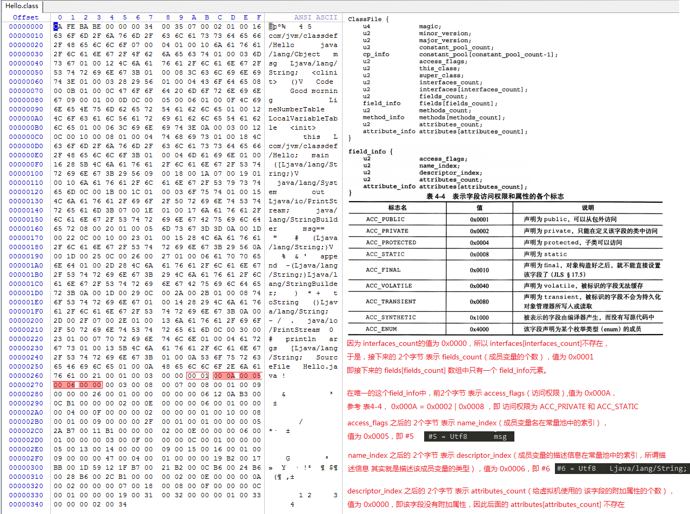

### 8.9 方法（成员方法）

包括实例初始化方法以及类或接口初始化方法在内的所有方法（`method`），都通过 `method_info` 结构来定义。

#### 8.9.1 方法在 `class` 文件中的格式

```:no-line-numbers
method_info {
    u2              access_flags;
    u2              name_index;
    u2              descriptor_index;
    u2              attributes_count;
    attribute_info  attributes[attributes_count];
}

其中：
access_flags：表示方法的访问权限和基本属性。可以是多个权限和属性的标志的组合（位或运算）。
name_index：是对常量池表的一个有效索引，该索引指向的常量池项的类型为 CONSTANT_Utf8_info，用于表示方法名。
descriptor_index：是对常量池表的一个有效索引，该索引指向的常量池项的类型为 CONSTANT_Utf8_info，用于表示方法描述符。
attributes_count：表示当前方法的附加属性的数量。
attributes[]：表示附加属性表，表中每个附加属性的结构必须是 attribute_info。
```

##### 方法描述符

方法描述符（`descriptor`）是一个用于 **描述参数类型和返回值类型** 的字符串。

> 无论某方法是静态方法还是实例方法，其方法描述符都是相同的。
> 
> 也就是说无法通过一个方法的方法描述符来判断该方法是静态的还是非静态的。
> 
> 尽管实例方法除了传递自身定义的参数外，还需要额外传递参数 `this`，但是这一点不是由方法描述符来表达的。
> 
> 参数 `this` 的传递是由 `Java` 虚拟机中调用实例方法时所使用的字节码指令来实现的。

> 参考 《`Java` 虚拟机规范 `Java SE 8` 版》 第 `4.3.3` 节（方法描述符）内容。

```:no-line-numbers
// 方法描述符由参数描述符列表和返回值描述符组成
MethodDescriptor:
    ({ParameterDescriptor})ReturnDescriptor

// 参数描述符就是 字段类型
ParameterDescriptor:
    FieldType

// 返回值描述符包括： 字段类型、void 描述符
ReturnDescriptor:
    FieldType
    VoidDescriptor

// void 描述符就是 V，表示方法不返回任何值（即方法的返回值类型是 void）
VoidDescriptor:
    V
```

举例：

```:no-line-numbers
Object foo(int i, double d, Thread t) {...} 方法的描述符是：(IDLjava/lang/Thread;)Ljava/lang/Object;
void foo() {...} 方法的描述符是：()V
```

#### 8.9.2 方法在 `class` 文件中的解析举例

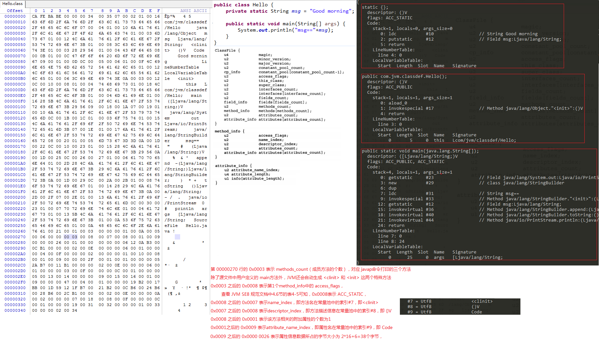

### 8.10 属性（`attribute`）

属性（`attribute`）在 `class` 文件中的 `ClassFile` 结构、`field_info` 结构、`method_info` 结构和 `Code_attribute` 结构中都有使用。

#### 8.10.1 属性在 `class` 文件中的通用格式

```:no-line-numbers
attribute_info {
    u2 attribute_name_index;
    u4 attribute_length;
    u1 info[attribute_length];
}

其中：
attribute_name_index：是对常量池表的一个有效索引，该索引指向的常量池项的类型为 CONSTANT_Utf8_info，用于表示属性名。
attribute_length：给出了 info[] 数组所占的字节大小。
info[]：不同属性的 info[] 不同，参考各个属性的具体格式。
```

#### 8.10.2 `JVM` 规范中预定义的属性（`23` 个）

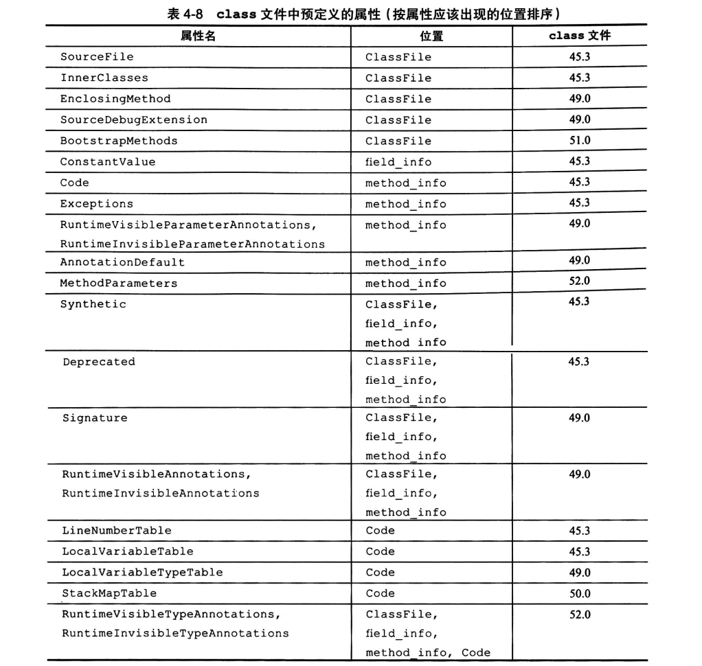

#### 8.10.3 `Code` 属性

##### 8.10.3.1 `Code` 属性的格式

##### 8.10.3.2 `Code` 属性在 `class` 文件中的解析举例

## 9. `ASM` 开发

### 9.1 编程模型和核心 `API`

### 9.2 `ClassVisitor` 开发

### 9.3 `MethodVisitor` 开发

### 9.4 实现模拟 `AOP` 功能