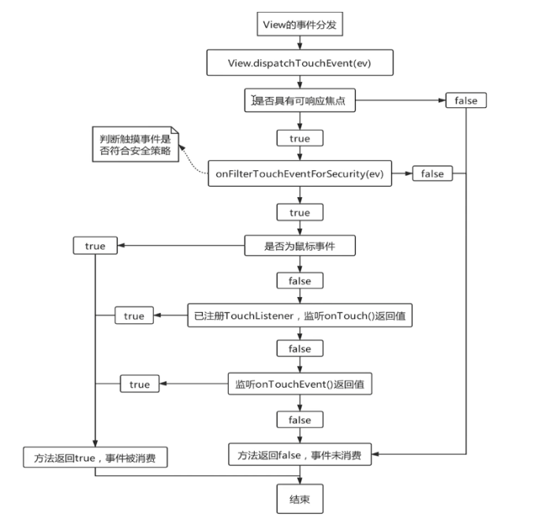

## 什么是事件

用户通过屏幕与手机交互的时候，每一次点击、长按、移动等，都是一个事件。

## 事件分发机制

某一个事件从屏幕传递到各个 `View`，由 `View` 来使用这一事件（消费事件）或者忽略这一事件（不消费事件），这整个过程的控制就称之为事件分发机制。

## 事件分发的对象是谁（即分发的是什么）

系统把事件封装为 `MotionEvent` 对象，事件分发的过程就是 `MotionEvent` 分发的过程。

## 事件的类型

```
按下：ACTION_DOWN
移动：ACTION_MOVE
抬起：ACTION_UP
取消：ACTION_CANCEL
```

> 这里只列出了单点触摸事件的类型

## 什么是事件序列

从手指按下屏幕开始，到手指离开屏幕所产生的一系列事件。

## 事件的传递层级

```
Activity -> Window -> DecorView -> ViewGroup -> View
```

## `Activity` 的事件分发流程


```
Activity 持有 PhoneWindow 对象的引用（Activity.mWindow）

PhoneWindow 持有 DecorView 对象的引用（PhoneWindow.mDecor）

DecorView 继承自 FrameLayout (extends ViewGroup)。
DecorView 就是 Activity 界面上的顶层 ViewGroup 容器。
于是，事件 MotionEvent 进入到 ViewGroup.dispatchTouchEvent 方法。
```

### `Activity` 中的事件处理

在 `Activity.dispatchTouchEvent` 方法中，如果事件没有被消费掉（即 `getWindow().superDispatchTouchEvent(ev)` 返回 `false`），那么就会执行 `Activity.onTouchEvent` 方法，由 `Activity` 来处理事件。


`Activity` 在进行事件处理时，主要就是考虑当 `Activity` 为 `Dialog` 类型时的情况。

1. 当 `Activity` 是 `Dialog` 类型，且允许点击 `Activity` 之外的地方关闭 `Activity` 时，如果触摸事件发生在 `Activity` 之外，就关闭 `Activity`。

2. 在 `Window.shouldCloseOnTouch` 方法中，
   > `mCloseOnTouchOutside` 为 `true` 表示允许点击 `Activity` 之外的地方关闭 `Activity`。
   >
   >在 `PhoneWindow` 中， `peekDecorView()` 方法返回 `Activity` 的顶层容器 `DecorView`。

3. 在 `Window.isOutOfBounds` 方法中，以 `Action_DOWN` 按下时的坐标 `(x, y)` 在距离 `DecorView` 边界 `slop` 范围之外为依据，将这样的触摸事件规定为发生在 `DecorView` 之外（即发生在 `Activity` 之外）。

## `ViewGroup` 的事件分发流程


### `ViewGroup.dispatchTouchEvent` 方法分析

`ViewGroup.dispatchTouchEvent` 方法中主要做了三件事

1. 判断是否需要拦截事件；

2. 在当前 `ViewGroup` 中找到用户真正点击的 `View`；

3. 分发事件到 `View` 上。

#### 过滤掉不安全的触摸事件

```java
/* ViewGroup.java */
@Override
public boolean dispatchTouchEvent(MotionEvent ev) {
    /*
        mInputEventConsistencyVerifier 是在调试时用到的，用来检测事件序列的一致性，
        对事件分发流程无影响，不需要关注。
    */
    if (mInputEventConsistencyVerifier != null) {
        mInputEventConsistencyVerifier.onTouchEvent(ev, 1);
    }

    /*
        在手机的辅助功能中有个无障碍的选项，通过无障碍服务 AccessibilityService 来帮助残障人士或无法与设备交互的人。
        对通过无障碍无法触发的事件，ev.isTargetAccessibilityFocus() 返回 true，
        这里不考虑无障碍服务的情况，即认为 ev.isTargetAccessibilityFocus() == false
    */
    if (ev.isTargetAccessibilityFocus() && isAccessibilityFocusedViewOrHost()) {
        ev.setTargetAccessibilityFocus(false);
    }

    /*
        handled 作为返回值，true 表示当前视图消费掉了事件，false 则没有消费掉。
    */
    boolean handled = false;

    /*
        onFilterTouchEventForSecurity 方法中制定了一种安全策略，用来对事件进行过滤，
        只有当事件符合安全策略时，该方法才返回 true，才能进入 if 语句对事件进行处理
    */
    if (onFilterTouchEventForSecurity(ev)) {...}
    
    return handled;
}
```

```java
/* View.java */

/*
    onFilterTouchEventForSecurity 制定的安全策略是：
        如果当前视图设置了属性 FILTER_TOUCHES_WHEN_OBSCURED，且当前视图所在的 window 被其他 window 遮盖了，
        那么当事件 event 是经过其他 window 才传到当前视图所在的 window 时，就返回 false，过滤掉事件。

    因为遮盖当前视图的其他 window 可能属于另一个 App 进程时，
    所以这样处理就能避免其它的 App 进程对事件的恶意篡改。
    （一个 window 被另一个 window 遮盖住，可以理解成一个 Activity 被另一个 Activity 遮盖住）
*/
public boolean onFilterTouchEventForSecurity(MotionEvent event) {
    if ((mViewFlags & FILTER_TOUCHES_WHEN_OBSCURED) != 0
            && (event.getFlags() & MotionEvent.FLAG_WINDOW_IS_OBSCURED) != 0) {
        // Window is obscured, drop this touch.
        return false;
    }
    return true;
}
```

#### 事件分发前的初始化工作

```java
/* ViewGroup.java */
@Override
public boolean dispatchTouchEvent(MotionEvent ev) {
    ......
    if (onFilterTouchEventForSecurity(ev)) {
        final int action = ev.getAction();
        final int actionMasked = action & MotionEvent.ACTION_MASK;

        /*
            事件 ACTION_DOWN 表示一个事件序列的开始，
            所以当收到 ACTION_DOWN 事件时，需要做一些重置和初始化工作，包括：
                1. 取消对上一个事件序列的分发；
                2. 清理掉在处理上一个事件序列时保留的状态信息；
                3. 重置并清空触摸目标链表（即由 TouchTarget 构成的单链表，TouchTarget 中持有能接收事件的直接子View的引用）
        */
        if (actionMasked == MotionEvent.ACTION_DOWN) {
            cancelAndClearTouchTargets(ev);
            resetTouchState();
        }
        ......
    }
    ......
}


/*
    取消对上一个事件序列的分发，重置并清空触摸目标链表，具体为：
        1. 遍历上一个事件序列中产生的触摸目标链表，获取各个TouchTarget中持有的直接子View；
        2. 调用 resetCancelNextUpFlag 方法，取消直接子View中的 PFLAG_CANCEL_NEXT_UP_EVENT 标记。
        3. 向直接子View分发 ACTION_CANCEL 事件；
        4. 调用 clearTouchTargets() 方法清空触摸目标链表。
*/
private void cancelAndClearTouchTargets(MotionEvent event) {
    if (mFirstTouchTarget != null) {
        for (TouchTarget target = mFirstTouchTarget; target != null; target = target.next) {
            resetCancelNextUpFlag(target.child);
            // 参数 cancel 传 true，会向 子View 分发 ACTION_CANCEL 事件
            dispatchTransformedTouchEvent(event, true, target.child, target.pointerIdBits);
        }
        clearTouchTargets();
    }
}


/*
    清理掉在处理上一个事件序列时保留的状态信息，具体为：
        1. 调用 clearTouchTargets() 方法清空触摸目标链表；
        2. 取消当前View中的 PFLAG_CANCEL_NEXT_UP_EVENT 标记。
        3. 取消当前View中的 FLAG_DISALLOW_INTERCEPT 标记。
            只有不存在该标记时，是否拦截事件才由 ViewGroup.onInterceptTouchEvent 方法的返回值确定。
            当存在该标记时，那么肯定不会拦截事件，intercepted 固定为 false。
*/
private void resetTouchState() {
    clearTouchTargets();
    resetCancelNextUpFlag(this);
    mGroupFlags &= ~FLAG_DISALLOW_INTERCEPT;
}

/*
    清空触摸目标链表（即由 TouchTarget 构成的单链表），具体为：
        1. 从头节点 mFirstTouchTarget 开始遍历链表；
        2. 调用 TouchTarget.recycle() 方法，在该方法中会移除 TouchTarget 对直接子View的引用。
        3. 将头节点置为 null，即 mFirstTouchTarget = null，达到清空单链表的目的。
*/
private void clearTouchTargets() {
    TouchTarget target = mFirstTouchTarget;
    if (target != null) {
        do {
            TouchTarget next = target.next;
            target.recycle();
            target = next;
        } while (target != null);
        mFirstTouchTarget = null;
    }
}

/*
    取消 参数view 中的 PFLAG_CANCEL_NEXT_UP_EVENT 标记。
    该标记的作用：
        如果 View 中设置了该标记，就会取消对事件的分发，即不会把事件分发给子View了；
        且 View 本身在进行事件处理时，会当作 ACTION_CANCLE 进行处理。
    当 参数view 存在该标记返回 true；不存在返回 false。
*/
private static boolean resetCancelNextUpFlag(@NonNull View view) {
    if ((view.mPrivateFlags & PFLAG_CANCEL_NEXT_UP_EVENT) != 0) {
        view.mPrivateFlags &= ~PFLAG_CANCEL_NEXT_UP_EVENT;
        return true;
    }
    return false;
}
```

#### 事件分发前的拦截判断

```java
/* ViewGroup.java */
@Override
public boolean dispatchTouchEvent(MotionEvent ev) {
    ......
    if (onFilterTouchEventForSecurity(ev)) {
        final int action = ev.getAction();
        final int actionMasked = action & MotionEvent.ACTION_MASK;
        ......
        final boolean intercepted;

        /*
            ACTION_DOWN 为一个事件序列的开始
            mFirstTouchTarget 是触摸目标链表的头节点，表示最后接收到并消费掉按下事件（ACTION_DOWN 或 ACTION_POINTER_DOWN）的直接子View。
                触摸目标链表用来保存接收到并消费掉按下事件的直接子View，
                    1. 当多点触摸时，会有多个按下事件触发，接收到并消费掉这些按下事件的直接子View会插入到链表的头部，
                    于是头节点 mFirstTouchTarget 表示最后接收到并消费掉按下事件的直接子View；
                    2. 当单点触摸时，只有一个按下事件触发，此时链表中只可能有一个直接子View。

            只有在分发按下事件时，才会向链表中插入TouchTarget。
            也就是说，如果 mFirstTouchTarget != null，那么当前分发的事件肯定不是 ACTION_DOWN。
            所以 if 条件成立的情况有2种：
                1. 事件序列开始时的 ACTION_DOWN 事件的分发；
                2. 当已有直接子View接收到并消费掉按下事件时，分发按下之后的事件。

            当 if 条件成立时才会考虑将当前事件分发给直接子View，此时才需要判断要不要拦截：
                1. 如果在直接子View中调用了 getParent().requestDisallowInterceptTouchEvent(true) 方法，
                那么当前View中就会设置 FLAG_DISALLOW_INTERCEPT 标记，此时 intercepted 固定为 false，表示不拦截事件；
                2. 如果当前View没有设置该标记，那么是否拦截事件由当前View的 onInterceptTouchEvent 方法的返回值确定。
            
            当 if 条件不成立时，说明没有直接子View接收过并消费掉 ACTION_DOWN 事件，
            即 ACTION_DOWN 事件被拦截了或者没有被消费掉。
            此时，同一事件序列中的后续事件就会被拦截掉。
            也就是说，如果直接子View没有接收过并消费掉 ACTION_DOWN 事件，那么就不可能接收到后续事件。
                    
        */
        if (actionMasked == MotionEvent.ACTION_DOWN || mFirstTouchTarget != null) {
            final boolean disallowIntercept = (mGroupFlags & FLAG_DISALLOW_INTERCEPT) != 0;
            if (!disallowIntercept) {
                intercepted = onInterceptTouchEvent(ev);
                ev.setAction(action); // restore action in case it was changed
            } else {
                intercepted = false;
            }
        } else {
            intercepted = true;
        }
        ......
    }
    ......
}

/*
    ViewGroup 默认提供的 onInterceptTouchEvent 方法在判断是否拦截事件的依据是：
        如果通过鼠标左键按在当前View的滚动条上，那么就拦截事件不分发给直接子View。
*/
public boolean onInterceptTouchEvent(MotionEvent ev) {
    if (ev.isFromSource(InputDevice.SOURCE_MOUSE) // 判断事件是否由鼠标触发
            && ev.getAction() == MotionEvent.ACTION_DOWN 
            && ev.isButtonPressed(MotionEvent.BUTTON_PRIMARY) // 判断是否为鼠标左键按下
            && isOnScrollbarThumb(ev.getX(), ev.getY())) { // 判断是否按在当前View的滚动条上
        return true;
    }
    return false;
}
```

#### 事件分发前的取消处理

```java
/* ViewGroup.java */
@Override
public boolean dispatchTouchEvent(MotionEvent ev) {
    ......
    if (onFilterTouchEventForSecurity(ev)) {
        final int action = ev.getAction();
        final int actionMasked = action & MotionEvent.ACTION_MASK;
        ......
        final boolean intercepted;
        ......

        /*
            如果当前View设置了 PFLAG_CANCEL_NEXT_UP_EVENT 标记，或者当前事件为 ACTION_CANCEL，
            那么就表示取消事件，即 canceled == true，此时：
                1. 不会再将 按下事件分发给直接子View；
                2. 在当前View自己在处理事件时，会当作 ACTION_CANCLE 进行处理。
                3. 当前事件分发处理完后，会调用 resetTouchState() 方法清理掉本次事件序列中所保留的状态信息。
        */
        final boolean canceled = resetCancelNextUpFlag(this) || actionMasked == MotionEvent.ACTION_CANCEL;

        final boolean split = (mGroupFlags & FLAG_SPLIT_MOTION_EVENTS) != 0;
        TouchTarget newTouchTarget = null;
        boolean alreadyDispatchedToNewTouchTarget = false;

        // 取消事件时 canceled 为 true，if 条件不成立，于是不会将按下事件分发给直接子View。
        if (!canceled && !intercepted) {...}
        
        if (mFirstTouchTarget == null) {
            // 取消事件时 canceled 为 true，当前View自己在处理事件时，会当作 ACTION_CANCLE 进行处理。
            handled = dispatchTransformedTouchEvent(ev, canceled, null, TouchTarget.ALL_POINTER_IDS);
        } else {
            TouchTarget predecessor = null;
            TouchTarget target = mFirstTouchTarget;
            while (target != null) {
                final TouchTarget next = target.next;
                if (alreadyDispatchedToNewTouchTarget && target == newTouchTarget) {
                    handled = true;
                } else {
                    /*
                        如果当前View在分发后续事件时取消事件，
                        那么当前的后续事件还是会分发给接收过并消费掉 ACTION_DOWN 事件的直接子View。
                        直接子View取消事件的条件是：
                            1. 直接子View本身设置了 PFLAG_CANCEL_NEXT_UP_EVENT 标记；
                            2. 当前View将当前的后续事件拦截了。
                        也就是说当前View取消事件并不意味着直接子View也取消事件。
                    */
                    final boolean cancelChild = resetCancelNextUpFlag(target.child) || intercepted;
                    if (dispatchTransformedTouchEvent(ev, cancelChild, target.child, target.pointerIdBits)) {
                        handled = true;
                    }

                    /*
                        如果直接子View取消事件了，那么直接子View就会从链表中移除，
                        于是，直接子View就无法再接收到后续事件了。
                    */ 
                    if (cancelChild) {
                        if (predecessor == null) {
                            mFirstTouchTarget = next;
                        } else {
                            predecessor.next = next;
                        }
                        target.recycle();
                        target = next;
                        continue;
                    }
                }
                predecessor = target;
                target = next;
            }
        }

        /*
            取消事件时，在当前事件分发处理完后，会调用 resetTouchState() 方法清理掉本次事件序列中所保留的状态信息，包括：
                1. 调用 clearTouchTargets() 方法清空触摸目标链表；
                2. 取消当前View中的 PFLAG_CANCEL_NEXT_UP_EVENT 标记。
                3. 取消当前View中的 FLAG_DISALLOW_INTERCEPT 标记 

            这就表示，虽然当前View取消事件并不意味着直接子View也取消事件，
            但是由于当前View取消事件，使得触摸目标链表被清空了，导致直接子View再也无法接收到后续事件了。
        */
        if (canceled
                || actionMasked == MotionEvent.ACTION_UP
                || actionMasked == MotionEvent.ACTION_HOVER_MOVE) {
            resetTouchState();
        }
    }
    ......
    return handled;
}
```

#### 事件分发中对多点触摸的支持

```java
/* ViewGroup.java */
@Override
public boolean dispatchTouchEvent(MotionEvent ev) {
    ......
    if (onFilterTouchEventForSecurity(ev)) {
        final int action = ev.getAction();
        final int actionMasked = action & MotionEvent.ACTION_MASK;
        ......
        final boolean intercepted;
        ......

        final boolean canceled = resetCancelNextUpFlag(this) || actionMasked == MotionEvent.ACTION_CANCEL;

        /*
            Android 3.0 以上，ViewGroup 默认设置了 FLAG_SPLIT_MOTION_EVENTS 标记。
            该标记用于支持多点触摸，当设置了该标记时，就会单独保存每个按下的 手指id，
            从而能够根据每个按下的 手指id 单独地对每个手指的触摸事件进行分发。
        */
        final boolean split = (mGroupFlags & FLAG_SPLIT_MOTION_EVENTS) != 0;

        TouchTarget newTouchTarget = null;
        boolean alreadyDispatchedToNewTouchTarget = false;
        
        if (!canceled && !intercepted) { // 只有当前View未取消事件，且未拦截事件时，才分发按下事件

            /*
                这里只会对三种类型的事件进行分发：
                    1. ACTION_DOWN ：多点触摸中表示第 1 根手指的按下事件
                    2. ACTION_POINTER_DOWN ：仅在多点触摸中产生，表示非第 1 根手指的按下事件
                    3. ACTION_HOVER_MOVE ：鼠标未按下时的移动事件（不考虑）
            */
            if (actionMasked == MotionEvent.ACTION_DOWN
                    || (split && actionMasked == MotionEvent.ACTION_POINTER_DOWN)
                    || actionMasked == MotionEvent.ACTION_HOVER_MOVE) {

                /*
                    actionIndex 表示事件 ev 是由第几根手指触发的。
                    其中，第 1 根手指触发的按下事件 ACTION_DOWN 的 actionIndex 为 0。
                    ev.getActionIndex() 方法只有在按下事件或抬起事件时才有效。
                    注意：MotionEvent 中有的方法需要传入的参数 pointerIndex 就是这里的 actionIndex。
                */
                final int actionIndex = ev.getActionIndex(); // always 0 for down

                /*
                    Android 3.0 以上，默认设置了 FLAG_SPLIT_MOTION_EVENTS 标记，所以变量 split 默认为 true，
                    ev.getPointerId(actionIndex) 方法用于获取第 actionIndex 根手指的 id。
                    1 << pointerId 的含义是将 1 左移 pointerId 位，于是，pointerId 不同，1 左移的位数也不同 ，
                    因此，左移运算的结果 idBitsToAssign 就可以用来标记 pointerId。
                    并且，通过位或运算，可以将多个 pointerId 对应的 idBitsToAssign 保存在一个 int 型变量中。
                */
                final int idBitsToAssign = split ? 1 << ev.getPointerId(actionIndex)
                        : TouchTarget.ALL_POINTER_IDS;

                /*
                    在分发 pointerId 触发的按下事件之前，如果之前已经有直接子View接收过并消费掉该 pointerId 触发的按下事件，
                    那么就通过 pointerId 找到触摸目标链表中对应的 TouchTarget，清除掉其中对该 pointerId 的标记，
                    若 TouchTarget 只保存了该 pointerId 的标记，则在清理之后，该 TouchTarget 会从链表中移除掉。
                    也就是说，在同一事件序列中：
                        1. 一根手指触发的按下事件最多只会被一个直接子View消费掉，
                        2. 一根手指触发的后续事件最多只会分发给一个直接子View（就是消费掉按下事件的直接子View）。
                    注意：但是一个直接子View可以接收并消费掉多根手指触发的事件。
                */
                removePointersFromTouchTargets(idBitsToAssign);
                ......
            }
        }
        ......
    }
    ......
    return handled;
}
```

##### 参考

[Android多点触控详解](https://blog.csdn.net/l707941510/article/details/81300333)

[MotionEvent详解](https://blog.csdn.net/vansbelove/article/details/78416791)

[Android触摸滑动全解（四）——MotionEvent详解](https://www.jianshu.com/p/1885f3ec49c0)


#### 事件分发前如何指定分发顺序

**按下事件的分发顺序**

1. 先分发给`Z`坐标最大的直接子`View`；
   
2. `Z`坐标相同时，看是否设置了 `FLAG_USE_CHILD_DRAWING_ORDER` 标记，
   
     1. 若没有设置 `FLAG_USE_CHILD_DRAWING_ORDER` 标记，
    则先分发给插入索引最大的直接子`View`；

     2. 若设置了 `FLAG_USE_CHILD_DRAWING_ORDER` 标记，
    则先分发给插入索引最大的直接子`View` 经过 `getChildDrawingOrder` 方法映射后的直接子`View`。

**后续事件的分发顺序**

- 同一事件序列中的后续事件只会分发给消费掉按下事件的直接子`View`，这些直接子`View`会保存在触摸目标链表中。
在链表中，后消费掉按下事件的直接子`View`排在链表的前面。在分发后续事件时，是通过对触摸目标链表进行遍历来分发的，所以先分发给后消费掉按下事件的直接子`View`。

**注意：**

1. 在单点触摸中，按下事件只有一个 `ACTION_DOWN`，所以最多只有一个直接子`View`消费掉按下事件。因此，不用考虑事件的分发顺序。

2. 在多点触摸中，如果一个消费掉 `ACTION_DOWN` 的直接子View 又将要接收到 `ACTION_POINTER_DOWN` 事件，那么并不会改变该直接子`View`在链表中的顺序，仅仅只是把 `ACTION_POINTER_DOWN` 事件的 `pointerId` 添加到该直接子`View`对应的 `TouchTarget` 中，将该 `ACTION_POINTER_DOWN` 事件作为后续事件处理。


```java
/* ViewGroup.java */
@Override
public boolean dispatchTouchEvent(MotionEvent ev) {
    ......
    if (onFilterTouchEventForSecurity(ev)) {
        final int action = ev.getAction();
        final int actionMasked = action & MotionEvent.ACTION_MASK;
        ......
        final boolean intercepted;
        ......

        final boolean canceled = resetCancelNextUpFlag(this) || actionMasked == MotionEvent.ACTION_CANCEL;
        
        final boolean split = (mGroupFlags & FLAG_SPLIT_MOTION_EVENTS) != 0;

        TouchTarget newTouchTarget = null;
        boolean alreadyDispatchedToNewTouchTarget = false;
        
        if (!canceled && !intercepted) { // 只有当前View未取消事件，且未拦截事件时，才分发按下事件

            View childWithAccessibilityFocus = ev.isTargetAccessibilityFocus()
                        ? findChildWithAccessibilityFocus() : null;

            if (actionMasked == MotionEvent.ACTION_DOWN
                    || (split && actionMasked == MotionEvent.ACTION_POINTER_DOWN)
                    || actionMasked == MotionEvent.ACTION_HOVER_MOVE) {

                ......
                if (newTouchTarget == null && childrenCount != 0) {
                    
                    /*
                        buildTouchDispatchChildList 方法返回的 preorderedList 的排序规则为：
                            1. 若当前View只有一个直接子View，或者所有直接子View的Z坐标都为0，
                            则 preorderedList 为 null，不进行预排序。
                            1. preorderedList 中优先按Z坐标从小到大排序；
                            2. Z坐标相同时，看当前View是否设置了 FLAG_USE_CHILD_DRAWING_ORDER 标记，
                                3.1 若没有设置了该标记，则按直接子View添加到当前View中时的插入顺序从前到后排序；
                                3.2 若设置了该标记，则 preorderedList 集合中按插入顺序从前到后排序的直接子View
                                被映射成以当前View的 getChildDrawingOrder 方法返回值为索引的直接子View。
                    */
                    final ArrayList<View> preorderedList = buildTouchDispatchChildList();
                    final boolean customOrder = preorderedList == null && isChildrenDrawingOrderEnabled();
                    final View[] children = mChildren;

                    // 这里按直接子View添加到当前View中时的插入顺序从后到前进行遍历
                    for (int i = childrenCount - 1; i >= 0; i--) {
                        /*
                            customOrder 为 true 成立的条件是同时满足以下点：
                                1. 没有进行预排序，即 preorderedList 集合为null；
                                2. 当前View设置了 FLAG_USE_CHILD_DRAWING_ORDER 标记。
                            在 customOrder 为 true 的情况下，childIndex 就是 getChildDrawingOrder 方法的返回值；
                            在 customOrder 为 false 的情况下，childIndex 就是当前遍历的直接子View在当前View中的插入索引。
                        */
                        final int childIndex = getAndVerifyPreorderedIndex(childrenCount, i, customOrder);
                        
                        /*
                            如果进行了预排序，即 preorderedList != null，那么按下事件的分发顺序是：
                                1. 先分发给Z坐标最大的直接子View；
                                2. Z坐标相同时，看是否设置了 FLAG_USE_CHILD_DRAWING_ORDER 标记，
                                    2.1 若没有设置 FLAG_USE_CHILD_DRAWING_ORDER 标记，
                                    则先分发给插入索引最大的直接子View；
                                    2.2 若设置了 FLAG_USE_CHILD_DRAWING_ORDER 标记，
                                    则先分发给插入索引最大的直接子View 经过 getChildDrawingOrder 方法映射后的直接子View。
                            如果没有预排序，即 preorderedList == null，那么按下事件的分发顺序是：
                                1. 若没有设置 FLAG_USE_CHILD_DRAWING_ORDER 标记，
                                则先分发给插入索引最大的直接子View；
                                2 若设置了 FLAG_USE_CHILD_DRAWING_ORDER 标记，
                                则先分发给插入索引最大的直接子View 经过 getChildDrawingOrder 方法映射后的直接子View。
                        */
                        final View child = getAndVerifyPreorderedView(preorderedList, children, childIndex);

                        /*
                            如果当前的按下事件是由无障碍服务触发的，
                            并且无障碍服务指定的焦点View在当前View的子View中（不一定是直接子View），
                            那么找到包含该焦点View的当前View下的直接子View，即 childWithAccessibilityFocus，
                            优先将按下事件分发给 childWithAccessibilityFocus，
                            然后重置循环因子 i = childCount - 1，在对包含焦点View的直接子View分发完按下事件后，
                            再重新向不包含焦点View的直接子View进行按下事件的分发。
                        */
                        if (childWithAccessibilityFocus != null) {
                            if (childWithAccessibilityFocus != child) {
                                continue;
                            }
                            childWithAccessibilityFocus = null;
                            i = childrenCount - 1;
                        }
                        ......
                    }
                    if (preorderedList != null) preorderedList.clear();
                }
                ......
            }
        }
        ......
    }
    ......
    return handled;
}
```

#### 事件分发前如何确定目标 `View`

```java
/* ViewGroup.java */
@Override
public boolean dispatchTouchEvent(MotionEvent ev) {
    ......
    if (onFilterTouchEventForSecurity(ev)) {
        final int action = ev.getAction();
        final int actionMasked = action & MotionEvent.ACTION_MASK;
        ......
        final boolean intercepted;
        ......

        final boolean canceled = resetCancelNextUpFlag(this) || actionMasked == MotionEvent.ACTION_CANCEL;
        
        final boolean split = (mGroupFlags & FLAG_SPLIT_MOTION_EVENTS) != 0;

        TouchTarget newTouchTarget = null;
        boolean alreadyDispatchedToNewTouchTarget = false;
        
        if (!canceled && !intercepted) { // 只有当前View未取消事件，且未拦截事件时，才分发按下事件

            View childWithAccessibilityFocus = ev.isTargetAccessibilityFocus()
                        ? findChildWithAccessibilityFocus() : null;

            if (actionMasked == MotionEvent.ACTION_DOWN
                    || (split && actionMasked == MotionEvent.ACTION_POINTER_DOWN)
                    || actionMasked == MotionEvent.ACTION_HOVER_MOVE) {

                ......
                if (newTouchTarget == null && childrenCount != 0) {
                    final float x = ev.getX(actionIndex);
                    final float y = ev.getY(actionIndex);
                    final ArrayList<View> preorderedList = buildTouchDispatchChildList();
                    final boolean customOrder = preorderedList == null && isChildrenDrawingOrderEnabled();
                    final View[] children = mChildren;

                    for (int i = childrenCount - 1; i >= 0; i--) {
                        final int childIndex = getAndVerifyPreorderedIndex(childrenCount, i, customOrder);
                        final View child = getAndVerifyPreorderedView(preorderedList, children, childIndex);
                        ......
                        /*
                            canViewReceivePointerEvents 方法用来判断直接子View是否能接收事件，满足以下条件之一即可：
                                1. 直接子View是可见的，即 child.getVisibility() == View.VISIBLE；
                                2. 直接子View设置了View动画（即补间动画）
                            isTransformedTouchPointInView 方法用来判断当前的按下事件的按下坐标点是否在直接子View的区域内。

                            综上，如果直接子View是可见的或者设置了补间动画，
                            那么当按下事件发生在直接子View的区域内时，按下事件就能分发给这个直接子View。
                        */
                        if (!canViewReceivePointerEvents(child)
                                || !isTransformedTouchPointInView(x, y, child, null)) {
                            ev.setTargetAccessibilityFocus(false);
                            continue;
                        }
                        ......
                    }
                }
                ......
            }
        }
        ......
    }
    ......
    return handled;
}
```

#### 按下事件的分发

```java
/* ViewGroup.java */
@Override
public boolean dispatchTouchEvent(MotionEvent ev) {
    ......
    if (onFilterTouchEventForSecurity(ev)) {
        final int action = ev.getAction();
        final int actionMasked = action & MotionEvent.ACTION_MASK;
        ......
        final boolean intercepted;
        ......

        final boolean canceled = resetCancelNextUpFlag(this) || actionMasked == MotionEvent.ACTION_CANCEL;
        
        final boolean split = (mGroupFlags & FLAG_SPLIT_MOTION_EVENTS) != 0;

        TouchTarget newTouchTarget = null;
        boolean alreadyDispatchedToNewTouchTarget = false;
        
        if (!canceled && !intercepted) { // 只有当前View未取消事件，且未拦截事件时，才分发按下事件

            View childWithAccessibilityFocus = ev.isTargetAccessibilityFocus()
                        ? findChildWithAccessibilityFocus() : null;

            if (actionMasked == MotionEvent.ACTION_DOWN
                    || (split && actionMasked == MotionEvent.ACTION_POINTER_DOWN)
                    || actionMasked == MotionEvent.ACTION_HOVER_MOVE) {
                final int actionIndex = ev.getActionIndex(); // always 0 for down
                final int idBitsToAssign = split ? 1 << ev.getPointerId(actionIndex) : TouchTarget.ALL_POINTER_IDS;
                ......
                if (newTouchTarget == null && childrenCount != 0) {
                    ......
                    for (int i = childrenCount - 1; i >= 0; i--) {
                        final int childIndex = getAndVerifyPreorderedIndex(childrenCount, i, customOrder);
                        final View child = getAndVerifyPreorderedView(preorderedList, children, childIndex);
                        ......
                        /*
                            如果 newTouchTarget != null，说明直接子View已经消费掉 ACTION_DOWN 事件了，
                            那么当前分发的肯定是 ACTION_POINTER_DOWN 事件，
                            也就是说，在当前直接子View消费掉 ACTION_DOWN 事件之后，又有 ACTION_POINTER_DOWN 事件分发给它了。
                            此时，仅仅把 ACTION_POINTER_DOWN 事件的 pointerId 记录在 TouchTarget 中，先不分发给这个直接子View，
                            而是在下面的分发后续事件的代码中再进行分发。
                        */
                        newTouchTarget = getTouchTarget(child);
                        if (newTouchTarget != null) {
                            /*
                                执行位或运算，将 ACTION_POINTER_DOWN 事件的 pointerId 添加到 TouchTarget 中，
                                idBitsToAssign 就是 1 << pointerId 的运算结果，是 pointerId 的位表示形式，
                                TouchTarget.pointerIdBits 中保存的数据可能是：
                                    1. ACTION_DOWN 的 pointerId；
                                    2. 1个 ACTION_DOWN 和 n个 ACTION_POINTER_DOWN 的 pointerId。（n=1,2,3,...）
                            */ 
                            newTouchTarget.pointerIdBits |= idBitsToAssign;
                            break;
                        }

                        /*
                            清除直接子View的 PFLAG_CANCEL_NEXT_UP_EVENT 标记后再分发按下事件，
                            因为直接子View在接收到按下事件时，认为是一次事件序列的开始，
                            所以一开始，直接子View中不应该存在取消事件的标记。
                        */ 
                        resetCancelNextUpFlag(child);

                        /*
                            调用 dispatchTransformedTouchEvent 方法将按下事件分发给直接子View，
                            参数 cancel 固定位false，于是这里肯定不会将 ACTION_CANCEL 分发给直接子View
                        */ 
                        if (dispatchTransformedTouchEvent(ev, false, child, idBitsToAssign)) {
                            ......
                            /*
                                如果直接子View消费掉按下事件，那么就把直接子View以及按下事件的 pointerId 封装到 TouchTarget 中，
                                然后将该 TouchTarget 插入到触摸目标链表的头节点上，
                                也就是说触摸目标链表的头节点 mFirstTouchTarget 指向消费掉最后一个按下事件的直接子View。
                                注意：
                                只有当直接子View首次消费掉按下事件时成立，
                                直接子View非首次消费掉按下事件时，不是在这里分发处理的，不会改变链表的结构。
                            */
                            newTouchTarget = addTouchTarget(child, idBitsToAssign);

                            /*
                                标记当前的按下事件已经被消费掉了，
                                避免在下面分发后续事件的代码中又分发一次。
                            */
                            alreadyDispatchedToNewTouchTarget = true;

                            /*
                                执行 break 语句退出循环，于是已消费掉的按下事件不会再分发给其他直接子View了，
                                也就是说，如果按照分发顺序，优先接收到按下事件的直接子View消费掉按下事件了，
                                那么分发顺序靠后的其他直接子View即使能接收按下事件且按下事件发生在其区域内，
                                该按下事件也不会再分发给它们了。
                            */
                            break;
                        }
                    }
                }

                /*
                    if 条件描述的情况只会在多点触摸时分发 ACTION_POINTER_DOWN 事件时发生：
                        如果已消费掉 ACTION_DOWN 事件的直接子View 无法接收 ACTION_POINTER_DOWN 事件，
                        且能接收 ACTION_POINTER_DOWN 事件的其他直接子View 也没有消费掉，
                        那么把当前的 ACTION_POINTER_DOWN 事件的 pointerId 添加到已消费掉 ACTION_DOWN 事件的直接子View的 TouchTarget 中，
                        在下面分发后续事件的代码中再分发一次该 ACTION_POINTER_DOWN 事件。
                */
                if (newTouchTarget == null && mFirstTouchTarget != null) {
                    /*
                        ACTION_DOWN 事件最先触发，所以会最先被消费掉，而消费掉按下事件的直接子View的 TouchTarget
                        总是插入到链表的头部，所以链表的尾节点就是消费掉 ACTION_DOWN 事件的直接子View对应的TouchTarget。
                        于是，这里就是将 ACTION_POINETR_DOWN 事件的 pointerId 的位表示形式 idBitsToAssign 添加到链表的尾节点上，
                        即消费掉 ACTION_DOWN 事件的直接子View对应的 TouchTarget 中。
                    */
                    newTouchTarget = mFirstTouchTarget;
                    while (newTouchTarget.next != null) {
                        newTouchTarget = newTouchTarget.next;
                    }
                    newTouchTarget.pointerIdBits |= idBitsToAssign;
                }
            }
        }
        ......
    }
    ......
    return handled;
}
```

#### 后续事件的分发

```java
/* ViewGroup.java */
@Override
public boolean dispatchTouchEvent(MotionEvent ev) {
    ......
    if (onFilterTouchEventForSecurity(ev)) {
        final int action = ev.getAction();
        final int actionMasked = action & MotionEvent.ACTION_MASK;
        ......
        final boolean intercepted;
        ......

        final boolean canceled = resetCancelNextUpFlag(this) || actionMasked == MotionEvent.ACTION_CANCEL;
        
        final boolean split = (mGroupFlags & FLAG_SPLIT_MOTION_EVENTS) != 0;

        TouchTarget newTouchTarget = null;
        boolean alreadyDispatchedToNewTouchTarget = false;
        
        if (!canceled && !intercepted) { // 只有当前View未取消事件，且未拦截事件时，才分发按下事件

            View childWithAccessibilityFocus = ev.isTargetAccessibilityFocus()
                        ? findChildWithAccessibilityFocus() : null;

            if (actionMasked == MotionEvent.ACTION_DOWN
                    || (split && actionMasked == MotionEvent.ACTION_POINTER_DOWN)
                    || actionMasked == MotionEvent.ACTION_HOVER_MOVE) {
                ......
            }
        }

        /*
            如果 mFirstTouchTarget == null 说明不存在消费掉按下事件的直接子View，
            此时按下事件由当前View自己处理，且同一事件序列中的后续事件也都由当前View自己处理，不再分发给直接子View。

            如果 mFirstTouchTarget != null 说明存在消费掉按下事件的直接子View，
            此时，当前View不会再处理被消费掉的按下事件，也不会再处理同一事件序列中的后续事件。
        */
        if (mFirstTouchTarget == null) {
            /*
                参数 child 传 null，表示由当前View自己处理事件ev。
                如果当前View设置了 PFLAG_CANCEL_NEXT_UP_EVENT 标记，或者当前事件为 ACTION_CANCEL，
                那么参数 canceled 为 true，表示取消事件
                TouchTarget.ALL_POINTER_IDS 值为 -1，即int型参数 desiredPointerIdBits 的 32 位都是 1，
                表示不单独处理各个手指的触摸事件，因为此时就一个当前View在处理事件，没必要再单独分离各个手指处理了。
            */
            handled = dispatchTransformedTouchEvent(ev, canceled, null,
                    TouchTarget.ALL_POINTER_IDS);
        } else {
            // 这里开始，进行后续事件的分发（包括 ACTION_POINTER_DOWN 事件）
            TouchTarget predecessor = null;
            TouchTarget target = mFirstTouchTarget;
            while (target != null) {
                final TouchTarget next = target.next;
                /*
                    alreadyDispatchedToNewTouchTarget 为 true，则当前事件可能是 ACTION_DOWN 或 ACTION_POINTER_DOWN，
                    且表示当前事件已经被 newTouchTarget中的直接子View消费掉了。
                    注意：
                        对于已消费掉的 ACTION_POINTER_DOWN 事件，不会再分发给消费过它的直接子View了，
                        但是还会分发给链表中的消费过其它按下事件的直接子View。
                        也就是说，在多点触摸中，不管 ACTION_POINTER_DOWN 事件有没有被消费掉，
                        都会分发给每个消费过按下事件的直接子View。

                        而对于已消费掉的 ACTION_DOWN 事件，不可能会在这里被再次分发。
                        因为分发 ACTION_DOWN 事件时，链接中除了消费掉它的直接子View外，不存在其他直接子View。
                */
                if (alreadyDispatchedToNewTouchTarget && target == newTouchTarget) {
                    handled = true;
                } else {
                    /*
                        如果消费掉按下事件的直接子View中设置了 PFLAG_CANCEL_NEXT_UP_EVENT 标记，或者当前View对事件进行了拦截，
                        那么分发给直接子View的会是 ACTION_CANCEL 事件，即在直接子View中会取消事件。
                    */
                    final boolean cancelChild = resetCancelNextUpFlag(target.child)
                            || intercepted;

                    // 这里会分发除 ACTION_DOWN 之外的其他事件。
                    if (dispatchTransformedTouchEvent(ev, cancelChild,
                            target.child, target.pointerIdBits)) {
                        handled = true;
                    }

                    /*
                        对于取消事件的直接子View，在将 ACTION_CANCEL 分发给该直接子View后，
                        就会将其对应的 TouchTarget 从触摸目标链表中移除。
                        于是，该直接子View就不会再接收到同一事件序列中的后续事件了。
                    */
                    if (cancelChild) {
                        if (predecessor == null) {
                            mFirstTouchTarget = next;
                        } else {
                            predecessor.next = next;
                        }
                        target.recycle();
                        target = next;
                        continue;
                    }
                }
                predecessor = target;
                target = next;
            }
        }
    }
    ......
    return handled;
}
```

### ViewGroup.dispatchTransformedTouchEvent 方法分析

**`dispatchTransformedTouchEvent` 方法中主要考虑以下几种场景**

1. 取消事件的分发

2. 当前`View`自己处理事件

3. 多点触摸下只有部分手指按在直接子`View`中

4. 直接子`View`的视图因补间动画而发生了改变

**注意：**

- 如果直接子`View`还是一个`ViewGroup`，那么在直接子`View`中，又会进行一次事件分发。也就是说，事件分发是一个递归的过程，直到直接子`View`是`View`为止。

```java
private boolean dispatchTransformedTouchEvent(MotionEvent event, boolean cancel,
        View child, int desiredPointerIdBits) {
    final boolean handled;
    /*
        如果参数 cancel 为 true，那么就是分发取消事件，
        此时，不管真实触发的是什么事件，都当作 ACTION_CANCEL 事件进行分发。
    */
    final int oldAction = event.getAction();
    if (cancel || oldAction == MotionEvent.ACTION_CANCEL) {
        // 当作 ACTION_CANCEL 事件进行分发
        event.setAction(MotionEvent.ACTION_CANCEL);
        if (child == null) {
            // 当前View自己处理取消事件（调用父类View的 dispatchTouchEvent 方法处理）
            handled = super.dispatchTouchEvent(event); 
        } else {
            // 将取消事件分发给直接子View处理
            handled = child.dispatchTouchEvent(event);
        }
        // 还原触发的真实事件类型
        event.setAction(oldAction);
        return handled;
    }

    // oldPointerIdBits 表示所有按下的手指的 pointerId 的位表示形式的组合
    final int oldPointerIdBits = event.getPointerIdBits();

    /*
        如果是当前View自己处理事件，那么 desiredPointerIdBits 的 32 位都是 1；
        如果一个直接子View只接收 1 个按下事件，那么 desiredPointerIdBits 只表示 1  个按下手指的 pointerId；
        如果一个直接子View可以接收多个按下事件，那么 desiredPointerIdBits 表示多个按下手指的 pointerId 的组合；
    */ 
    final int newPointerIdBits = oldPointerIdBits & desiredPointerIdBits;

    /*
        当前分发的事件的 desiredPointerIdBits 肯定不会传0，所以 newPointerIdBits == 0 的情况有 2 种：
            1. oldPointerIdBits == 0，即无法获取到本次事件序列中任何手指的 pointerId；
            2. 无法从本次事件序列的所有手指的 pointerId 中找到可以被当前直接子View接收的手指的 pointerId。
        不管是以上哪种情况，都无法正常地对事件进行分发了，所以当前事件肯定不会被消费掉，直接返回 false。
    */ 
    if (newPointerIdBits == 0) {
        return false;
    }

    final MotionEvent transformedEvent;
    /*
        newPointerIdBits == oldPointerIdBits 的情况有三种：
            1. 当前View自己处理事件时，desiredPointerIdBits 的 32 位都是 1 ，此时 newPointerIdBits == oldPointerIdBits；
            2. 单点触摸中，只存在 1 根手指，所以 newPointerIdBits == oldPointerIdBits 总是成立；
            3. 多点触摸中，所有手指的按下事件都被当前直接子View接收到了；

        newPointerIdBits != oldPointerIdBits 则表示：
            多点触摸中，当前直接子View只接收到部分手指触发的事件。
            这些部分手指的 pointerId 的位表示形式的组合就是 newPointerIdBits，
            此时，调用 event.split(newPointerIdBits) 方法将这些手指触发的事件分离出来。
    */
    if (newPointerIdBits == oldPointerIdBits) {
        /*
            child.hasIdentityMatrix() 返回 true，表示当前直接子View的视图没有因补间动画而发生改变，
            此时，可以在这里把事件分发给直接子View。
        */
        if (child == null || child.hasIdentityMatrix()) {
            if (child == null) { // 当前View自己处理事件时，执行这里的，而不是执行下面的
                handled = super.dispatchTouchEvent(event);
            } else { // 当前直接子View的视图没有因补间动画而发生改变时，在这里进行事件分发
                final float offsetX = mScrollX - child.mLeft;
                final float offsetY = mScrollY - child.mTop;
                event.offsetLocation(offsetX, offsetY);
                handled = child.dispatchTouchEvent(event);
                event.offsetLocation(-offsetX, -offsetY);
            }
            return handled;
        }
        // 如果当前直接子View的视图因补间动画而发生改变了，那么事件分发会在下面再进行。
        transformedEvent = MotionEvent.obtain(event);
    } else { // 将按在当前直接子View上的那些手指所触发的事件分离出来。
        transformedEvent = event.split(newPointerIdBits);
    }

    if (child == null) { 
        /*
            当前View自己处理事件时，newPointerIdBits == oldPointerIdBits 肯定成立，所以不会走这里。
        */
        handled = super.dispatchTouchEvent(transformedEvent);
    } else {
        /*
            在这里分发事件的情况有两种：
                1. 将分离出来的按在当前直接子View上的那些手指所触发的事件分发给当前直接子View。
                2. 按下事件都发生在当前直接子View中，但直接子View因补间动画发生了视图变换。
        */
        final float offsetX = mScrollX - child.mLeft;
        final float offsetY = mScrollY - child.mTop;
        transformedEvent.offsetLocation(offsetX, offsetY);
        if (! child.hasIdentityMatrix()) {
            // 如果直接子View因补间动画发生了视图变换，那么需要通过逆矩阵将触摸事件转换成适应视图变换后的直接子View。
            transformedEvent.transform(child.getInverseMatrix());
        }
        // 把事件分发给直接子View
        handled = child.dispatchTouchEvent(transformedEvent);
    }
    transformedEvent.recycle();
    return handled;
}
```

### `ViewGroup` 自己处理事件

`ViewGroup` 通过调用父类 `View` 的 `dispatchTouchEvent(MotionEvent event)` 方法来处理事件。

## `View` 的事件处理流程

这里的`View` 特指没有子`View`的视图，所以事件分发到了 `View` 中，就分发完成了，此时开始处理事件。



### `View.dispatchTouchEvent` 方法分析

```java
public boolean dispatchTouchEvent(MotionEvent event) {
    if (event.isTargetAccessibilityFocus()) {
        /*
            如果事件是由无障碍服务发起的，但是处理该事件的View并不是无障碍服务设置的焦点View，
            那么就不消费掉事件，返回 false。
        */
        if (!isAccessibilityFocusedViewOrHost()) {
            return false;
        }
        event.setTargetAccessibilityFocus(false);
    }
    boolean result = false;
    final int actionMasked = event.getActionMasked();
    if (actionMasked == MotionEvent.ACTION_DOWN) {
        // ACTION_DOWN 是一次事件序列的开始，在开始处理前，保证未结束的嵌套滑动先停下来。
        stopNestedScroll();
    }

    // 调用 onFilterTouchEventForSecurity 方法过滤掉不安全的触摸事件
    if (onFilterTouchEventForSecurity(event)) {

        /*
            根据View的使能状态（enabled），在View中处理事件时分两种情况：
                1. 使能状态标记为 ENABLE：
                    1.1 若当前事件表示按下鼠标左键拖动View的滚动条，则先标记为消息掉事件，
                    然后在设置了 OnTouchListener 的情况下，再执行 OnTouchListener.onTouch 方法处理事件。
                    此时，不管 OnTouchListener.onTouch 方法是否消费掉事件，View都会消费掉事件。
                    因为已经肯定View会消费掉事件了，所以不再执行 View.onTouchEvent 方法。
                    1.2 若当前事件不是按下鼠标左键拖动View的滚动条，则默认不消费掉事件，
                    然后在设置了 OnTouchListener 的情况下，再执行 OnTouchListener.onTouch 方法处理事件。
                    此时，若 OnTouchListener.onTouch 方法消费掉事件，则不再执行 View.onTouchEvent 方法；
                    若 OnTouchListener.onTouch 方法没有消费掉事件，则接着执行 View.onTouchEvent 方法，
                    此时，View是否消费掉事件，由 View.onTouchEvent 方法的返回值确定。
                2. 使能状态标记为 DISABLED：
                    此时，不管当前事件是否为按下鼠标左键拖动View的滚动条，也不管是否设置了 OnTouchListener，
                    都默认为不消费掉事件，并且也不会去执行 OnTouchListener.onTouch 方法，
                    而是通过执行 View.onTouchEvent 方法来处理事件，
                    此时，View是否消费掉事件，仅由 View.onTouchEvent 方法的返回值确定。
        */

        // 当按下鼠标左键拖动View的滚动条时，handleScrollBarDragging 方法返回 true。
        if ((mViewFlags & ENABLED_MASK) == ENABLED && handleScrollBarDragging(event)) {
            result = true;
        }

        /*
            在View中设置的 OnClickListener，OnLongClickListener，OnTouchListener，OnKeyListener，
            等事件监听器都会注册在 mListenerInfo 中。
        */
        ListenerInfo li = mListenerInfo;
        if (li != null && li.mOnTouchListener != null
                && (mViewFlags & ENABLED_MASK) == ENABLED
                && li.mOnTouchListener.onTouch(this, event)) { // 先执行 OnTouchListener.onTouch 方法
            result = true;
        }
        if (!result && onTouchEvent(event)) { // 再执行 View.onTouchEvent 方法
            result = true;
        }
    }
    
    /*
        以下三种情况会停止嵌套滑动：
            1. 接收到了同一事件序列中最后触发的抬起事件；
            2. 接收到了取消事件；
            3. 接收到按下事件，但没有消费掉。
    */
    if (actionMasked == MotionEvent.ACTION_UP ||
            actionMasked == MotionEvent.ACTION_CANCEL ||
            (actionMasked == MotionEvent.ACTION_DOWN && !result)) {
        stopNestedScroll();
    }
    return result;
}
```

### `View.onTouchEvent` 方法分析

```java
public boolean onTouchEvent(MotionEvent event) {
    final float x = event.getX();
    final float y = event.getY();
    final int viewFlags = mViewFlags;
    final int action = event.getAction();

    /*
        判断View是否可点击，只要满足以下 3 个条件之一即可：
            1. 设置了 CLICKABLE 标记，在设置 OnClickListener 监听器时，会调用 setClickable(true) 方法设置该标记；
            2. 设置了 LONG_CLICKABLE 标记，在设置 OnLongClickListener 监听器时，会调用 setLongClickable(true) 方法设置该标记；
            3. 设置了 CONTEXT_CLICKABLE 标记，在设置 OnContextClickListener 监听器时，会调用 setContextClickable(true) 方法设置该标记；
    */
    final boolean clickable = ((viewFlags & CLICKABLE) == CLICKABLE
            || (viewFlags & LONG_CLICKABLE) == LONG_CLICKABLE)
            || (viewFlags & CONTEXT_CLICKABLE) == CONTEXT_CLICKABLE;
    if ((viewFlags & ENABLED_MASK) == DISABLED) {
        if (action == MotionEvent.ACTION_UP && (mPrivateFlags & PFLAG_PRESSED) != 0) {
            setPressed(false);
        }
        mPrivateFlags3 &= ~PFLAG3_FINGER_DOWN;
        // A disabled view that is clickable still consumes the touch
        // events, it just doesn't respond to them.
        /*
            如果View是可点击的，那么即使View的使能状态为 DISABLED，View.onTouchEvent 方法也会消费掉事件，
            即：只要View是可点击的，即使没有触发点击效果，那么 View.onTouchEvent 方法也会消费掉事件。
        */
        return clickable;
    }

    /*
        如果View调用了 setTouchDelegate 方法设置了一个触摸代理对象 mTouchDelegate，
        那么在 View.onTouchEvent 方法中，先让 mTouchDelegate 来处理事件，
        若 mTouchDelegate 消费掉了事件，则直接返回 true，否则才让View自己来处理事件。
    */
    if (mTouchDelegate != null) {
        if (mTouchDelegate.onTouchEvent(event)) {
            return true;
        }
    }

    /*
        如果View调用了 setTooltipText 方法设置了 tooltip 文本，就会设置 TOOLTIP 标记。
        tooltip文件是在 Android 8.0 中添加的。这里只考虑 clickable 即可。
    */
    if (clickable || (viewFlags & TOOLTIP) == TOOLTIP) {

        switch (action) {...}

        // 只要View是可点击的，那么 View.onTouchEvent 方法一定会消费掉事件。
        return true;
    }
    return false;
}
```

**注意**

只要`View`是可点击的，那么 `View.onTouchEvent` 方法一定会消费掉事件。这句话并不意味着只要`View`是可点击的，那么`View`一定会消费掉事件。只有当`View`是否消费掉事件，由 `View.onTouchEvent` 方法的返回值确定时才成立。