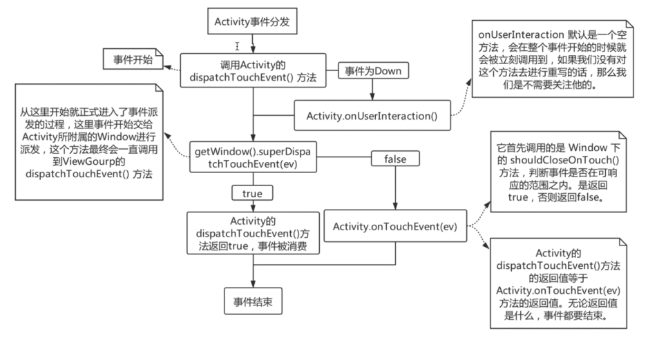
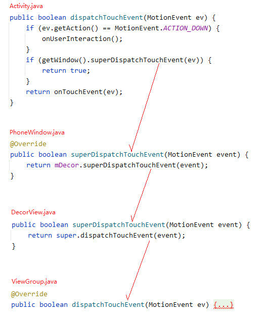
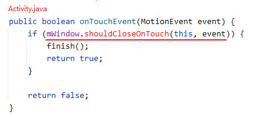
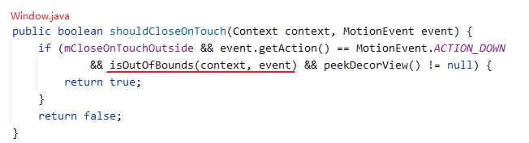
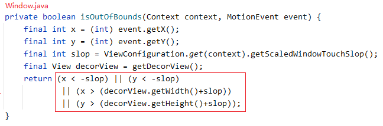
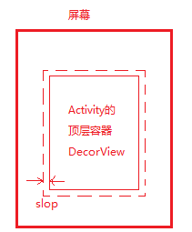
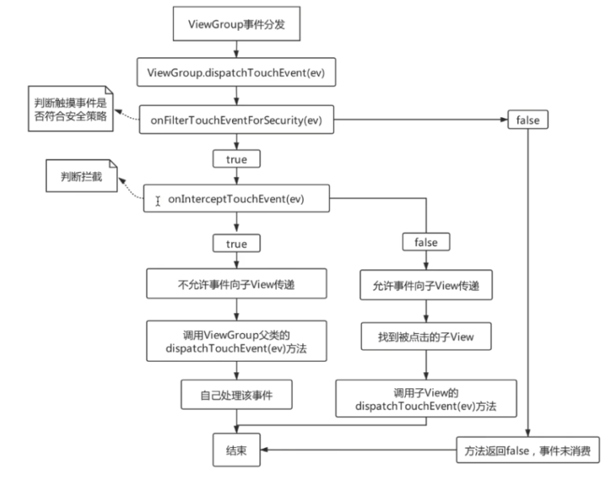

## 什么是事件

用户通过屏幕与手机交互的时候，每一次点击、长按、移动等，都是一个事件。

## 事件分发机制

某一个事件从屏幕传递到各个 `View`，由 `View` 来使用这一事件（消费事件）或者忽略这一事件（不消费事件），这整个过程的控制就称之为事件分发机制。

## 事件分发的对象是谁（即分发的是什么）

系统把事件封装为 `MotionEvent` 对象，事件分发的过程就是 `MotionEvent` 分发的过程。

## 事件的类型

```
按下：ACTION_DOWN
移动：ACTION_MOVE
抬起：ACTION_UP
取消：ACTION_CANCEL
```

> 这里只列出了单点触摸事件的类型

## 什么是事件序列

从手指按下屏幕开始，到手指离开屏幕所产生的一系列事件。

## 事件的传递层级

```
Activity -> Window -> DecorView -> ViewGroup -> View
```

## `Activity` 的事件分发流程





```
Activity 持有 PhoneWindow 对象的引用（Activity.mWindow）

PhoneWindow 持有 DecorView 对象的引用（PhoneWindow.mDecor）

DecorView 继承自 FrameLayout (extends ViewGroup)。
DecorView 就是 Activity 界面上的顶层 ViewGroup 容器。
于是，事件 MotionEvent 进入到 ViewGroup.dispatchTouchEvent 方法。
```

### `Activity` 中的事件处理

在 `Activity.dispatchTouchEvent` 方法中，如果事件没有被消费掉（即 `getWindow().superDispatchTouchEvent(ev)` 返回 `false`），那么就会执行 `Activity.onTouchEvent` 方法，由 `Activity` 来处理事件。





`Activity` 在进行事件处理时，主要就是考虑当 `Activity` 为 `Dialog` 类型时的情况。

1. 当 `Activity` 是 `Dialog` 类型，且允许点击 `Activity` 之外的地方关闭 `Activity` 时，如果触摸事件发生在 `Activity` 之外，就关闭 `Activity`。

2. 在 `Window.shouldCloseOnTouch` 方法中，
   > `mCloseOnTouchOutside` 为 `true` 表示允许点击 `Activity` 之外的地方关闭 `Activity`。
   >
   >在 `PhoneWindow` 中， `peekDecorView()` 方法返回 `Activity` 的顶层容器 `DecorView`。

3. 在 `Window.isOutOfBounds` 方法中，以 `Action_DOWN` 按下时的坐标 `(x, y)` 在距离 `DecorView` 边界 `slop` 范围之外为依据，将这样的触摸事件规定为发生在 `DecorView` 之外（即发生在 `Activity` 之外）。

## `ViewGroup` 的事件分发流程



### `ViewGroup.dispatchTouchEvent` 方法分析

`ViewGroup.dispatchTouchEvent` 方法中主要做了三件事

1. 判断是否需要拦截事件；

2. 在当前 `ViewGroup` 中找到用户真正点击的 `View`；

3. 分发事件到 `View` 上。

#### 过滤掉不安全的触摸事件

```java
/* ViewGroup.java */
@Override
public boolean dispatchTouchEvent(MotionEvent ev) {
    /*
        mInputEventConsistencyVerifier 是在调试时用到的，用来检测事件序列的一致性，
        对事件分发流程无影响，不需要关注。
    */
    if (mInputEventConsistencyVerifier != null) {
        mInputEventConsistencyVerifier.onTouchEvent(ev, 1);
    }

    /*
        在手机的辅助功能中有个无障碍的选项，通过无障碍服务 AccessibilityService 来帮助残障人士或无法与设备交互的人。
        对通过无障碍无法触发的事件，ev.isTargetAccessibilityFocus() 返回 true，
        这里不考虑无障碍服务的情况，即认为 ev.isTargetAccessibilityFocus() == false
    */
    if (ev.isTargetAccessibilityFocus() && isAccessibilityFocusedViewOrHost()) {
        ev.setTargetAccessibilityFocus(false);
    }

    /*
        handled 作为返回值，true 表示当前视图消费掉了事件，false 则没有消费掉。
    */
    boolean handled = false;

    /*
        onFilterTouchEventForSecurity 方法中制定了一种安全策略，用来对事件进行过滤，
        只有当事件符合安全策略时，该方法才返回 true，才能进入 if 语句对事件进行处理
    */
    if (onFilterTouchEventForSecurity(ev)) {...}
    
    return handled;
}
```

```java
/* View.java */

/*
    onFilterTouchEventForSecurity 制定的安全策略是：
        如果当前视图设置了属性 FILTER_TOUCHES_WHEN_OBSCURED，且当前视图所在的 window 被其他 window 遮盖了，
        那么当事件 event 是经过其他 window 才传到当前视图所在的 window 时，就返回 false，过滤掉事件。

    因为遮盖当前视图的其他 window 可能属于另一个 App 进程时，
    所以这样处理就能避免其它的 App 进程对事件的恶意篡改。
    （一个 window 被另一个 window 遮盖住，可以理解成一个 Activity 被另一个 Activity 遮盖住）
*/
public boolean onFilterTouchEventForSecurity(MotionEvent event) {
    if ((mViewFlags & FILTER_TOUCHES_WHEN_OBSCURED) != 0
            && (event.getFlags() & MotionEvent.FLAG_WINDOW_IS_OBSCURED) != 0) {
        // Window is obscured, drop this touch.
        return false;
    }
    return true;
}
```

#### 事件分发前的初始化工作

```java
/* ViewGroup.java */
@Override
public boolean dispatchTouchEvent(MotionEvent ev) {
    ......
    if (onFilterTouchEventForSecurity(ev)) {
        final int action = ev.getAction();
        final int actionMasked = action & MotionEvent.ACTION_MASK;

        /*
            事件 ACTION_DOWN 表示一个事件序列的开始，
            所以当收到 ACTION_DOWN 事件时，需要做一些重置和初始化工作，包括：
                1. 取消对上一个事件序列的分发；
                2. 清理掉在处理上一个事件序列时保留的状态信息；
                3. 重置并清空触摸目标链表（即由 TouchTarget 构成的单链表，TouchTarget 中持有能接收事件的 直接子View 的引用）
        */
        if (actionMasked == MotionEvent.ACTION_DOWN) {
            cancelAndClearTouchTargets(ev);
            resetTouchState();
        }
        ......
    }
    ......
}


/*
    取消对上一个事件序列的分发，重置并清空触摸目标链表，具体为：
        1. 遍历上一个事件序列中产生的触摸目标链表，获取各个TouchTarget中持有的 直接子View；
        2. 调用 resetCancelNextUpFlag 方法，取消 直接子View 中的 PFLAG_CANCEL_NEXT_UP_EVENT 标记。
        3. 向 直接子View 分发 ACTION_CANCEL 事件；
        4. 调用 clearTouchTargets() 方法清空触摸目标链表。
*/
private void cancelAndClearTouchTargets(MotionEvent event) {
    if (mFirstTouchTarget != null) {
        for (TouchTarget target = mFirstTouchTarget; target != null; target = target.next) {
            resetCancelNextUpFlag(target.child);
            // 参数 cancel 传 true，会向 子View 分发 ACTION_CANCEL 事件
            dispatchTransformedTouchEvent(event, true, target.child, target.pointerIdBits);
        }
        clearTouchTargets();
    }
}


/*
    清理掉在处理上一个事件序列时保留的状态信息，具体为：
        1. 调用 clearTouchTargets() 方法清空触摸目标链表；
        2. 取消 当前View 中的 PFLAG_CANCEL_NEXT_UP_EVENT 标记。
        3. 取消 当前View 中的 FLAG_DISALLOW_INTERCEPT 标记。
            只有不存在该标记时，是否拦截事件才由 ViewGroup.onInterceptTouchEvent 方法的返回值确定。
            当存在该标记时，那么肯定不会拦截事件，intercepted 固定为 false。
*/
private void resetTouchState() {
    clearTouchTargets();
    resetCancelNextUpFlag(this);
    mGroupFlags &= ~FLAG_DISALLOW_INTERCEPT;
}

/*
    清空触摸目标链表（即由 TouchTarget 构成的单链表），具体为：
        1. 从头节点 mFirstTouchTarget 开始遍历链表；
        2. 调用 TouchTarget.recycle() 方法，在该方法中会移除 TouchTarget 对 直接子View 的引用。
        3. 将头节点置为 null，即 mFirstTouchTarget = null，达到清空单链表的目的。
*/
private void clearTouchTargets() {
    TouchTarget target = mFirstTouchTarget;
    if (target != null) {
        do {
            TouchTarget next = target.next;
            target.recycle();
            target = next;
        } while (target != null);
        mFirstTouchTarget = null;
    }
}

/*
    取消 参数view 中的 PFLAG_CANCEL_NEXT_UP_EVENT 标记。
    该标记的作用：
        如果 View 中设置了该标记，就会取消对事件的分发，即不会把事件分发给子View了；
        且 View 本身在进行事件处理时，会当作 ACTION_CANCLE 进行处理。
    当 参数view 存在该标记返回 true；不存在返回 false。
*/
private static boolean resetCancelNextUpFlag(@NonNull View view) {
    if ((view.mPrivateFlags & PFLAG_CANCEL_NEXT_UP_EVENT) != 0) {
        view.mPrivateFlags &= ~PFLAG_CANCEL_NEXT_UP_EVENT;
        return true;
    }
    return false;
}
```

#### 事件分发前的拦截判断

```java
/* ViewGroup.java */
@Override
public boolean dispatchTouchEvent(MotionEvent ev) {
    ......
    if (onFilterTouchEventForSecurity(ev)) {
        final int action = ev.getAction();
        final int actionMasked = action & MotionEvent.ACTION_MASK;
        ......
        final boolean intercepted;

        /*
            ACTION_DOWN 为一个事件序列的开始
            mFirstTouchTarget 是触摸目标链表的头节点，表示最后接收到按下事件（ACTION_DOWN 或 ACTION_POINTER_DOWN）的直接子View。
                触摸目标链表用来保存接收到按下事件的直接子View，
                    1. 当多点触摸时，会有多个按下事件触发，接收到这些按下事件的直接子View会插入到链表的头部，
                    于是头节点 mFirstTouchTarget 表示最后接收到按下事件的直接子View；
                    2. 当单点触摸时，只有一个按下事件触发，此时链表中只可能有一个直接子View。

            只有在分发按下事件时，才会向链表中插入TouchTarget。
            也就是说，如果 mFirstTouchTarget != null，那么当前分发的事件肯定不是 ACTION_DOWN。
            所以 if 条件成立的情况有2种：
                1. 事件序列开始时的 ACTION_DOWN 事件的分发；
                2. 当已有直接子View接收了按下事件时，分发按下之后的事件。

            当 if 条件成立时才会考虑将当前事件分发给直接子View，此时才需要判断要不要拦截：
                1. 如果在 直接子View 中调用了 getParent().requestDisallowInterceptTouchEvent(true) 方法，
                那么 当前View 中就会设置 FLAG_DISALLOW_INTERCEPT 标记，此时 intercepted 固定为 false，表示不拦截事件；
                2. 如果 当前View 没有设置该标记，那么是否拦截事件由 当前View 的 onInterceptTouchEvent 方法的返回值确定。
            
            当 if 条件不成立时，说明没有 直接子View 接收过 ACTION_DOWN 事件，即 ACTION_DOWN 事件被拦截了。
            此时，同一事件序列中的后续事件也会被拦截掉。
            也就是说，如果 直接子View 没有接收过 ACTION_DOWN 事件，那么就不可能接收到后续事件。
                    
        */
        if (actionMasked == MotionEvent.ACTION_DOWN || mFirstTouchTarget != null) {
            final boolean disallowIntercept = (mGroupFlags & FLAG_DISALLOW_INTERCEPT) != 0;
            if (!disallowIntercept) {
                intercepted = onInterceptTouchEvent(ev);
                ev.setAction(action); // restore action in case it was changed
            } else {
                intercepted = false;
            }
        } else {
            intercepted = true;
        }
        ......
    }
    ......
}

/*
    ViewGroup 默认提供的 onInterceptTouchEvent 方法在判断是否拦截事件的依据是：
        如果通过鼠标左键按在 当前View 的滚动条上，那么就拦截事件不分发给直接子View。
*/
public boolean onInterceptTouchEvent(MotionEvent ev) {
    if (ev.isFromSource(InputDevice.SOURCE_MOUSE) // 判断事件是否由鼠标触发
            && ev.getAction() == MotionEvent.ACTION_DOWN 
            && ev.isButtonPressed(MotionEvent.BUTTON_PRIMARY) // 判断是否为鼠标左键按下
            && isOnScrollbarThumb(ev.getX(), ev.getY())) { // 判断是否按在当前View的滚动条上
        return true;
    }
    return false;
}
```

#### 事件分发前的取消处理

```java
/* ViewGroup.java */
@Override
public boolean dispatchTouchEvent(MotionEvent ev) {
    ......
    if (onFilterTouchEventForSecurity(ev)) {
        final int action = ev.getAction();
        final int actionMasked = action & MotionEvent.ACTION_MASK;
        ......
        final boolean intercepted;
        ......

        /*
            如果 当前View 设置了 PFLAG_CANCEL_NEXT_UP_EVENT 标记，或者当前事件为 ACTION_CANCEL，
            那么就表示取消事件，即 canceled == true，此时：
                1. 不会再将 按下事件分发给 直接子View；
                2. 在 当前View 自己在处理事件时，会当作 ACTION_CANCLE 进行处理。
                3. 当前事件分发处理完后，会调用 resetTouchState() 方法清理掉本次事件序列中所保留的状态信息。
        */
        final boolean canceled = resetCancelNextUpFlag(this) || actionMasked == MotionEvent.ACTION_CANCEL;

        final boolean split = (mGroupFlags & FLAG_SPLIT_MOTION_EVENTS) != 0;
        TouchTarget newTouchTarget = null;
        boolean alreadyDispatchedToNewTouchTarget = false;

        // 取消事件时 canceled 为 true，if 条件不成立，于是不会将按下事件分发给 直接子View。
        if (!canceled && !intercepted) {...}
        
        if (mFirstTouchTarget == null) {
            // 取消事件时 canceled 为 true，当前View 自己在处理事件时，会当作 ACTION_CANCLE 进行处理。
            handled = dispatchTransformedTouchEvent(ev, canceled, null, TouchTarget.ALL_POINTER_IDS);
        } else {
            TouchTarget predecessor = null;
            TouchTarget target = mFirstTouchTarget;
            while (target != null) {
                final TouchTarget next = target.next;
                if (alreadyDispatchedToNewTouchTarget && target == newTouchTarget) {
                    handled = true;
                } else {
                    /*
                        如果 当前View 在分发后续事件时取消事件，
                        那么当前的后续事件还是会分发给接收过 ACTION_DOWN 事件的直接子View。
                        直接子View 取消事件的条件是：
                            1. 直接子View 本身设置了 PFLAG_CANCEL_NEXT_UP_EVENT 标记；
                            2. 当前View 将当前的后续事件拦截了。
                        也就是说 当前View 取消事件并不意味着 直接子View 也取消事件。
                    */
                    final boolean cancelChild = resetCancelNextUpFlag(target.child) || intercepted;
                    if (dispatchTransformedTouchEvent(ev, cancelChild, target.child, target.pointerIdBits)) {
                        handled = true;
                    }

                    /*
                        如果 直接子View 取消事件了，那么 直接子View 就会从链表中移除，
                        于是，直接子View 就无法再接收到后续事件了。
                    */ 
                    if (cancelChild) {
                        if (predecessor == null) {
                            mFirstTouchTarget = next;
                        } else {
                            predecessor.next = next;
                        }
                        target.recycle();
                        target = next;
                        continue;
                    }
                }
                predecessor = target;
                target = next;
            }
        }

        /*
            取消事件时，在当前事件分发处理完后，会调用 resetTouchState() 方法清理掉本次事件序列中所保留的状态信息，包括：
                1. 调用 clearTouchTargets() 方法清空触摸目标链表；
                2. 取消 当前View 中的 PFLAG_CANCEL_NEXT_UP_EVENT 标记。
                3. 取消 当前View 中的 FLAG_DISALLOW_INTERCEPT 标记 

            这就表示，虽然 当前View 取消事件并不意味着 直接子View 也取消事件，
            但是由于 当前View 取消事件，使得触摸目标链表被清空了，导致 直接子View 再也无法接收到后续事件了。
        */
        if (canceled
                || actionMasked == MotionEvent.ACTION_UP
                || actionMasked == MotionEvent.ACTION_HOVER_MOVE) {
            resetTouchState();
        }
    }
    ......
    return handled;
}
```

#### 事件分发中对多点触摸的支持

#### 事件分发前如何指定分发顺序

#### 事件分发前如何确定目标 `View`

#### 按下事件的分发

#### 后续事件的分发

#### `ViewGroup` 自己处理事件
