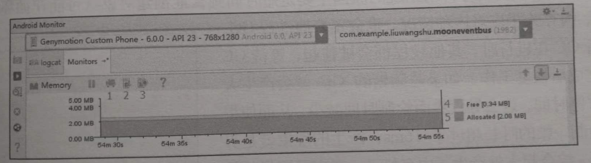
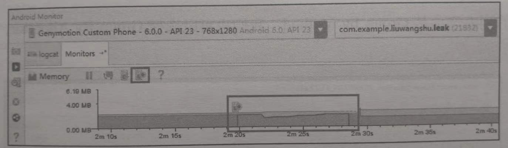

参考 《`Android` 进阶解密》 第 `17` 章（内存优化）

## 1. 避免可控的内存泄漏

内存泄漏是内存优化的重点。

如何避免、发现、解决内存泄漏是非常重要的。

### 1.1 什么是内存泄漏

当内存不足时，`Android` 系统就会触发 `GC`（垃圾回收）。`GC` 时采用根搜索算法来发现垃圾对象。
> 在根搜索算法中，如果一个对象仍然在以 `GCRoots` 为根节点的引用链上，那么该对象是不会被当做垃圾进行回收的。
>
> `GCRoots` 可以理解成像 静态成员变量、未销毁的局部变量等这些所占内存空间不在堆上的变量。

内存泄漏就是指没有用的对象仍然在以 `GCRoots` 为根节点的引用链上，导致这个没有用的对象无法被回收掉，从而一直占用着堆中的内存空间。

### 1.2 内存泄漏的场景

#### 1.2.1 非静态内部类的静态实例

非静态内部类会持有外部类实例的引用，如果非静态内部类的实例是静态的，就会间接地长期维持着外部类的引用，无法被垃圾回收。

```java
public class SecondActivity extends AppCompatActivity {
    private static InnerClass inner;
  
    @Override
    protected void onCreate(Bundle savedInstanceState) {
        super.onCreate(savedInstanceState);
        ...
        findViewById(R.id.bt_next).setOnClickListener(v -> {
            inner = new InnerClass();
            finish();
        });
    }

    class InnerClass {}
}
```

如上代码所示，点击事件发生时，会创建非静态内部类 `InnerClass` 的静态实例 `inner`。在整个应用程序的进程中，静态实例 `inner` 一直存在，所以 `SecondActivity` 一直被 `inner` 持有。从而即使执行完 `SecondActivity.onDestroy` 方法，`SecondActivity` 也无法被垃圾回收。

#### 1.2.2 多线程相关的匿名内部类/非静态内部类

和非静态内部类一样，匿名内部类也会持有外部类实例的引用。因此，对于多线程相关的 `AsyncTask`、`Thread`、`Runnable` 等类，它们的匿名内部类/非静态内部类，如果做耗时操作就可能发生内存泄漏。以 `AsyncTask` 的匿名内部类为例：

```java
public class TaskActivity extends AppCompatActivity {
    @Override
    protected void onCreate(Bundle savedInstanceState) {
        ...
         findViewById(R.id.bt_next).setOnClickListener(v -> {
             startAsyncTask();
             finish();
         });
    }

    void startAsyncTask() {
        new AsyncTask<Void, Void, Void>() {
            protected Void doInBackground(Void... params) {
                while (true);
            }
        }.execute();
    }
}
```

如上代码所示，`AsyncTask` 的实例持有 `TaskActivity` 的引用。且 `AsyncTask` 的异步任务一直在子线程中执行（`while` 死循环），因此，即使 `TaskActivity.onDestroy` 方法执行完，`TaskActivity` 也不会被垃圾回收。

> 同理，自定义的 `AsyncTask` 如果是非静态内部类，也会发生内存泄漏。

解决办法就是自定义一个静态的 `AsyncTask`，如下代码所示：

 ```java
 public class TaskActivity extends AppCompatActivity {
    @Override
    protected void onCreate(Bundle savedInstanceState) {
        ...
         findViewById(R.id.bt_next).setOnClickListener(v -> {
             startAsyncTask();
             finish();
         });
    }

    void startAsyncTask() {
        new MyAsyncTask().execute();
    }

    private static class MyAsyncTask extends AsyncTask<Void, Void, Void> {
        protected Void doInBackground(Void... params) {
            while (true);
        }
    }
}
 ```

#### 1.2.3 `Handler` 内存泄漏

`Handler` 的 `Message` 被存储在 `MessageQueue` 中，有些 `Message` 并不能马上被处理，它们在 `MesaageQueue` 中存在的时间会很长，这就会导致 `Handler` 无法被垃圾回收。如果 `Handler` 是 `Activity` 中的非静态内部类/匿名内部类，则 `Handler` 同样会持有这个 `Activity`，导致这个 `Activity` 无法被垃圾回收。（对 `Service` 也存在同样的情况）

```java
public class MyActivity extends AppCompatActivity {
    @Override
    protected void onCreate(Bundle savedInstanceState) {
        ...
        findViewById(R.id.bt_next).setOnClickListener(v -> {
            mHandler.sendMessageDelayed(Message.obtain(), 60000);
            finish();
        });
    }

    private final Handler mHandler = new Handler() {
        @Override
        public void handleMessage(Message msg) {
            ...
        }
    }
}
```

如上代码所示，`mHandler` 是匿名内部类的实例，它持有外部类 `MyActivity` 的引用。由于发送了一个延迟消息，所以引用了 `mHandler` 的消息在 `MyActivity.onDestroy` 执行完毕后还存在于 `MessageQueue` 中，从而导致被 `mHandler` 持有的 `MyActivity` 无法被垃圾回收。
> 即：由于匿名内部类的实例没有被垃圾回收，所以被匿名内部类所持有的外部类实例也无法被垃圾回收。

有两种解决方案：

1. 使用静态的 `Handler` 内部类，且 `Handler` 需要访问 `MyActivity` 时，采用弱引用的方式持有 `MyActivity` 实例。

    ```java
    public class MyActivity extends AppCompatActivity {
        @Override
        protected void onCreate(Bundle savedInstanceState) {
            ...
            findViewById(R.id.bt_next).setOnClickListener(v -> {
                mHandler.sendMessageDelayed(Message.obtain(), 60000);
                finish();
            });
        }

        private final Handler mHandler = new MyHandler(this);

        private static class MyHandler extends Handler {
            final WeakReference<MyActivity> mWRefActivity;

            MyHandler(MyActivity activity) {
                mWRefActivity = new WeakReference<>(activity);
            }

            @Override
            public void handleMessage(Message msg) {
                ...
            }
        }
    }
    ```

    > `GitHub` 上提供了一个避免内存泄漏的 `Handler` 开源库 `WeakHandler`。地址为：`https://github.com/badoo/android-weak-handler`。

2. 在 `Activity` 的 `onDestroy` 方法中移除 `MessageQueue` 中的消息。

    ```java
    @Override
    public void onDestroy() {
        if (mHandler != null) {
            // 将 Callbacks 和 Messages 全部清除掉
            mHandler.removeCallbacksAndMessages(null);
        }
        super.onDestroy();
    }
    ```

    > 采用这种解决方案，`Handler` 中的消息可能无法全部处理完，因此建议采用第 `1` 种解决方案。

#### 1.2.4 未正确使用 `Context`

对于不是必须使用 `Activity` 作为 `Context` 的情况（`Dialog` 的 `Context` 必须是 `Activity`），我们可以考虑使用 `Application` 来代替 `Activity` 作为 `Context`，这样可以避免 `Activity` 实例引起的内存泄漏，如单例模式中的 `Context`：

```java
public class MyManager {
    private static MyManager sInstance = new MyManager();
    public static MyManager getInstance() {
        return sInstance;
    }

    private Context mAppContext;

    public final void init(Context context) {
        mAppContext = context;
    }
}
```

单例类 `MyManager` 的实例被静态成员变量 sInstance 引用，所以 `MyManager` 实例在 `App` 进程中一直存在。如果通过 `init(context)` 方法传入一个 `Activity` 实例作为 `Context`，那么当 `Activity` 销毁时，`Activity` 实例是无法被垃圾回收的，从而产生内存泄漏。

解决办法是让 `mAppContext` 引用 `Application` 的实例：

```java
public final void init(Context context) {
    mAppContext = context.getApplicationContext();
}
```

#### 1.2.5 静态 `View`

使用静态 `View` 可以避免每次启动 `Activity` 都去读取并渲染 `View`，但静态 `View` 会持有 `Activity` 的引用，导致 `Activity` 无法被回收。

解决办法是在 `Activity.onDestroy` 方法中将静态 `View` 置为 `null`：

```java
public class MyActivity extends AppCompatActivity {
    private static View view;

    @Override
    protected void onCreate(Bundle savedInstancestate) {
        ...
        view = findViewById(R.id.view);
    }

    @Override
    public void onDestroy() {
        view = null;
    }
}
```

#### 1.2.6 `WebView`

不同的 `Android` 版本之间，以及不同厂商的定制 `ROM` 之间，`WebView` 存在着差异（即存在着很大的兼容性问题）。

有的 `Android` 系统中，上层的 `App` 进程中只要使用一次 `WebView`，`WebView` 实例所在的内存就不会被释放掉，即 `WebView` 会出现内存泄漏的问题。

通常的解决办法是为 `WebView` 单开一个子进程，使用 `AIDL` 与 `App` 的主进程进行通信。而 `WebView` 所在的进程可以根据业务需求，在合适的时机进行销毁。

#### 1.2.7 资源对象未关闭

资源对象比如 `Cursor`、`File` 等，往往都使用了缓冲，会造成内存泄漏。因此，在资源对象不使用时，一定要确保它们已经关闭，并将它们的引用置为 `null`。
> 通常在 `finally` 代码块中进行关闭，防止出现异常时资源未被释放的问题。

#### 1.2.8 集合中对象没清理

通常把一些对象的引用加入到了集合中，当不需要该对象时，如果没有把它的引用从集合中清理掉，这个集合就会越来越大。如果这个集合是 `static` 的话，那情况更严重。

#### 1.2.9 `Bitmap` 对象

临时创建的某个相对比较大的 `Bitmap` 对象，在经过变换得到新的 `Bitmap` 对象后，应尽快回收原始的 `Bitmap`，这样能够更快地释放原始 `Bitmap` 所占用的空间。

避免静态变量持有比较大的 `Bitmap` 对象或者其他大的数据对象。如果已经持有，要尽快置空该静态变量。

#### 1.2.10 监听器未关闭`

很多系统（如 `TelephonyManager`、`SensorManager`）需要 `register` 和 `unregister` 监听器。我们需要确保在合适的时候及时 `unregister` 那些监听器。

自己手动添加的 `Listener`，要记得在合适的时候及时移除这个 `Listener`。

## 2. `Memory Monitor`（已被 `Memory Profiler` 取代了）

在 `Android Studio` 中 `Android Monitor` 是一个主窗口，包含了 `Logcat`、`Memory Monitor`、`CPU Monitor`、`GPU Monitor` 和 `Network Monitor`。

其中 `Memory Monitor` 可以轻松地监视应用程序的性能和内存使用情况，以便于找到被分配的对象，定位内存泄漏，并跟踪连接设备中正在使用的内存数量。`Memory Monitor` 的作用如下：
1. 实时显示可用的和分配的 `Java` 内存的图表；
2. 实时显示垃圾收集（`GC`）事件；
3. 启动垃圾收集事件；
4. 快速测试应用程序的缓慢是否与过度的垃圾收集事件有关；
5. 快速测试应用程序崩溃是否与内存耗尽有关。

> 注意： `Android Studio 3.0` 及更高版本中的 [`Android Profiler`](https://developer.android.google.cn/studio/profile/android-profiler?hl=zh-cn) 取代了 `Android Monitor` 工具。

> `Memory Monitor` 也被 [`Memory Profiler`](https://developer.android.google.cn/studio/profile/memory-profiler?hl=zh-cn#overview) 取代了。

### 2.1 使用 `Memory Monitor`

在使用 `Memory Monitor` 之前要确保手机开启了开发者模式和 `USB` 调试。使用步骤如下：
1. 运行需要监控的 `App`；
2. 单击 `AS` 面板下面的 `Android` 图标，并选择 `Monitors` 选项。

如果 `Memory Monitor` 已运行，如下图所示：



上图中标注的功能如下：
1. 标识 `1`：`Initiate GC`，用来手动触发 `GC`。
2. 标识 `2`：`Dump Java Heap`，保存内存快照。
3. 标识 `3`：`Start/Stop Allocation Tracking`，打开 `Allocation Tracker` 工具。
4. 标识 `4`：`Free`，当前应用未分配的内存大小。
5. 标识 `5`：`Allocated`，当前应用已分配的内存大小。

上图中，`Y` 轴显示当前应用中已分配的内存大小和未分配的内存大小；`X` 轴表示经过的时间。

### 2.2 大内存申请与 `GC`


如上图所示，已分配的内存急剧上升，表示大内存分配的场景。此时，我们需要判断这是不是合理的内存分配情况，并分析是 `Bitmap` 还是其他的大数据对象。进而对这种大数据进行优化，减少内存开销。
> 图中已分配的内存接着出现急剧下降，表示垃圾收集事件，用来释放内存。

### 2.3 内存抖动

**什么是内存抖动？**

内存抖动一般指在很短的时间能内进行了多次的内存分配和释放。
> 也就是说，出现内存抖动的原因主要是短时间内频繁地创建对象，`JVM` 为了应对这种情况，也会频繁地对内存进行 `GC`。


如上图所示，内存抖动时就会产生锯齿状的抖动图示。

**内存抖动的影响**

非并行的 `GC` 在进行时，其他线程会被挂起，等待 `GC` 操作完成后再恢复工作。如果是频繁地 `GC` 就会产生大量的暂停时间，这会导致界面绘制时间减少，从而使得多次绘制一帧的时长超过 `16ms`，产生界面卡顿的现象。

## 3. `Allocation Tracker`

`Allocation Tracker` 是 `Memory Monitor` 模块中的一个功能。

> `Memory Profiler` 中也有 [`Allocation Tracker`](https://developer.android.google.cn/studio/profile/memory-profiler?hl=zh-cn#performance)

`Allocation Tracker` 用来跟踪内存分配，它允许你在执行某些操作时，监视在程序中的哪个位置进行了对象的分配。从而对存在不合理的内存分配的那些程序进行调整，达到内存优化的目的。

`Allocation Tracker` 的作用如下：
1. 显示程序中分配的对象类型、分配的对象所占内存大小、分配时所在的线程、堆栈跟踪的时间和程序位置；
2. 通过重复的分配/释放模式帮助识别内存变化；
3. 当与 `HPROF Viewer` 结合使用时，可以帮助你跟踪内存泄漏。
    > 如：当你在堆上看到一个 `Bitmap` 对象时，你可以使用 `Allocation Tracker` 来找到其分配的程序位置。

### 3.1 使用 `Allocation Tracker`



### 3.2 `alloc` 文件分析

## 4. `Heap Dump`

### 4.1 使用 `Heap Dump`

### 4.2 检测内存泄漏

## 5. 内存分析工具 `MAT`

### 5.1 生成 `hprof` 文件

### 5.2 `MAT` 分析 `hprof` 文件

## 6. `LeakCanary`

### 6.1 使用 `LeakCanary`

### 6.2 `LeakCanary` 应用举例

