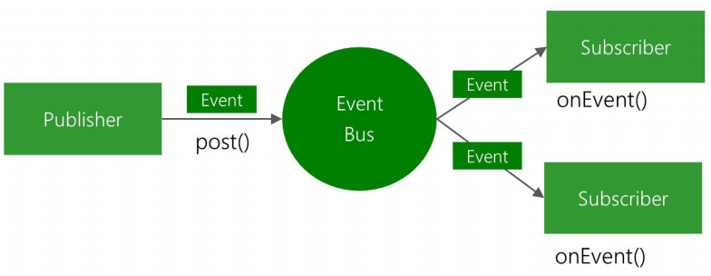

## 1. `EventBus` 概述

`GitHub` 网址：https://github.com/greenrobot/EventBus

`EventBus` 可以代替 `Android` 传统的 `Intent`、`Handler`、`Broadcast` 或接口回调函数，在 `Fragment`、`Activity`、`Service`、以及线程之间传递数据、执行方法。

> 也就是说，`EventBus` 简化了各组件间、以及组件与子线程间的通信。

> 注意：`EventBus` 不能实现跨进程通信。

### 1.1 `EventBus` 的三要素（事件、订阅者、发布者）



### 1.2  `EventBus` 中的 `4` 种线程模型（`ThreadMode`）

## 2. `EventBus` 的基本用法

### 2.1 添加依赖库

```
implementation 'org.greenrobot:eventbus:3.3.1'
```

### 2.2 `ProGuard` 混淆规则

```
-keepattributes *Annotation*
-keepclassmembers class * {
    @org.greenrobot.eventbus.Subscribe <methods>;
}
-keep enum org.greenrobot.eventbus.ThreadMode { *; }

# If using AsyncExecutord, keep required constructor of default event used.
# Adjust the class name if a custom failure event type is used.
-keepclassmembers class org.greenrobot.eventbus.util.ThrowableFailureEvent {
    <init>(java.lang.Throwable);
}

# Accessed via reflection, avoid renaming or removal
-keep class org.greenrobot.eventbus.android.AndroidComponentsImpl
```

> 注意：不同版本的混淆规则可能会存在区别。

### 2.3 自定义事件类

### 2.4 订阅（`register`）和取消订阅（`unregister`）事件

### 2.5 事件发布者发送事件

### 2.6 事件订阅者处理事件

## 3. `EventBus` 的黏性事件

### 3.1 发送黏性事件

### 3.2 处理黏性事件

## 4. `EventBus` 源码解析