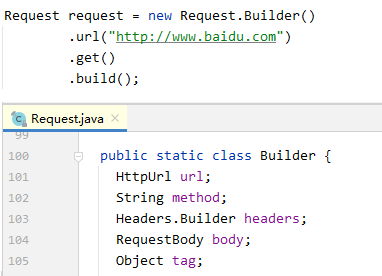

基于 `okhttp:3.9.0`

## `OkHttp` 的同步/异步请求

### 同步请求步骤

1. 通过建造者 `OkHttpClient.Builder` 创建 `OkHttpClient` 对象；
2. 通过建造者 `Request.Builder` 创建 `Request` 对象；
3. 调用  `OkHttpClient.newCall(request)` 方法创建 `Call` 对象；
4. 调用同步请求方法 `call.execute()` 返回 `Response` 对象；
5. 调用 `response.body().string()` 返回响应的 `json` 字符串数据。

> 在第 `4` 步中执行的 `call.execute()` 方法是一个**阻塞方法**，会使当前线程进入阻塞状态，直到返回 `Response` 对象。


### 异步请求步骤

1. 通过建造者 `OkHttpClient.Builder` 创建 `OkHttpClient` 对象；
2. 通过建造者 `Request.Builder` 创建 `Request` 对象；
3. 调用  `OkHttpClient.newCall(request)` 方法创建 `Call` 对象；
4. 调用异步请求方法 `call.enqueue(callback)`，在回调函数 `callback.onResponse` 中得到作为函数参数传进来的 `Response` 对象；
5. 调用 `response.body().string()` 返回响应的 `json` 字符串数据。

> 回调函数 `callback.onFailure` 和 `callback.onResponse` 都是在**子线程中调用**的。


### 同步请求和异步请求的区别

**相同点：**
1. 对于创建 `OkHttpClient` 对象，`Request` 对象，`Call` 对象的步骤，同步请求和异步请求都是一样的；
2. 在拿到 `Response` 对象，对得到的响应 `json` 字符串进行解析的流程，同步请求和异步请求也都是一样的。

**不同点：**
1. 同步请求中调用 `call.execute()` 方法发起网络请求，且该方法是阻塞的，响应数据直通过方法返回值直接返回。
2. 异步请求中调用 `call.enqueue(callback)` 方法发起网络请求，且该方法是非阻塞的，响应数据通过回调函数 `callback.onResponse` 返回。

## `OkHttp` 的配置

通过 `OkHttpClient.Builder` 中的成员变量可以看出在创建 `OkHttpClient` 对象时可配置的参数信息。

通过 `Request.Builder` 中的成员变量可以看出在创建 `Request` 对象时可配置的参数信息。

> 在创建一个对象时，如果需要初始化设置很多的参数，那么就可以使用 `Builder` 建造者模式。

### `OkHttpClient` 的配置

在 `OkHttpClient` 中可配置：
1. 连接超时的时长；
2. 读写超时的时长；
3. 缓存策略；
4. 是否允许重定向；
5. 拦截器；
6. ......


### `Request` 的配置

在 `Request` 中可配置：
1. 请求地址 `url`；
2. 请求方式；
3. 请求头信息；
4. 请求体；
5. 标识本次请求的 `tag` 标签（可以用来取消本次请求）。



## `Call` 对象的作用

`Call` 可以理解成请求 `Request` 和响应 `Response` 之间沟通的桥梁。通过 `Call` 发起同步请求和异步请求。

`Call` 是一个接口，调用 `OkHttpClient.newCall(request)` 方法创建的是它的实现类 `RealCall` 的实例对象。
> `RealCall` 对象持有 `OkHttpClient` 对象和 `Request` 对象的引用。
>
> 且在 `RealCall` 的构造方法中就创建好了重定向拦截器 `RetryAndFollowInterceptor`。


## 发起同步请求的源码分析

```sequence
participant RC as RealCall
participant D as Dispatcher
participant RIC as RealInterceptorChain

RC ->> RC : execute()

opt executed == false
RC ->> D : executed(call)
D ->> D : runningSyncCalls.add(call)

RC ->> RC : result = getResponseWithInterceptorChain()
activate RC
    RC ->> RC : new RealInterceptorChain
    RC ->> RIC : proceed(request)
    RIC ->> RC : response
deactivate RC

RC ->> D : finished(call)

RC ->> RC : return result
end
```
**注意：**
1. 在 `RealCall` 中通过布尔变量 `executed` 保证一个 `Call` 对象只能发起一次同步请求或一次异步请求；

2. 在发起同步请求前，会先将 `Call` 对象保证在调度器 `Dispatcher` 维护的同步请求队列 `runningSyncCalls` 中。在同步请求完成后，再调用 `Dispatcher.finished(call)` 方法，将 `Call` 对象从同步请求队列 `runningSyncCalls` 中移除。
    ```java
    /* Dispatcher.java */
    
    void finished(RealCall call) {
        finished(runningSyncCalls, call, false);
    }

    private <T> void finished(Deque<T> calls, T call, boolean promoteCalls) {
        ...
        synchronized (this) {
            if (!calls.remove(call)) // 从 runningSyncCalls 中移除 Call 对象
                throw new AssertionError("Call wasn't in-flight!");
            ...
        }
        ...
    }
    ```

3. 响应数据 `Response` 对象是调用 `getResponseWithInterceptorChain()` 方法，通过拦截器链获取到的。

## 发起异步请求的源码分析

```sequence
participant RC as RealCall
participant RIC as RealInterceptorChain
participant AC as RealCall.AsyncCall
participant D as Dispatcher
participant ES as ExecutorService

RC ->> RC : enqueue(callback)

opt executed == false

    RC ->> RC : new AysncCall(callback)

    RC ->> D : enqueue(asyncCall)
    alt runningAsyncCalls.size < maxRequests && runningCallsForHost(call) < maxRequestPerHost
        D ->> D : runningAsyncCalls.add(asyncCall)
        D ->> ES : execute(asyncCall)
        ES ->> AC : run()

        AC ->> AC : execute()
        activate AC
            AC ->> RC : getResponseWithInterceptorChain()
            activate RC
                RC ->> RC : new RealInterceptorChain
                RC ->> RIC : proceed(request)
                RIC ->> RC : response
            deactivate RC
            RC ->> AC : response
            AC ->> AC : callback.onResponse(realCall, response)
            AC ->> D : finished(asyncCall)
        deactivate AC
    else
        D ->> D : readyAsyncCalls.add(asyncCall)
    end

end
```

### 通过 `AsyncCall` 发起异步请求

1. `AsyncCall` 是 `RealCall` 的非静态内部类，持有 `RealCall` 的 `this` 引用。因此可以调用 `RealCall.getResponseWithInterceptorChain()` 方法获取响应数据。

2. `AsyncCall` 实现了 `Runnable` 接口，异步请求中，会把 `AsyncCall` 对象提交到线程池，在子线程中执行 `AsyncCall.run()` 方法，在 `run` 方法中调用 `AsyncCall.execute()` 方法发起异步请求。

3. 在 `AsyncCall.execute()` 方法中，也是调用 `RealCall.getResponseWithInterceptorChain()` 方法通过拦截器链来获取响应数据 `Response` 的。然后将响应数据 `Response` 对象通过回调函数 `callback.onResponse` 返回。
    ```java
    /*  RealCall.AsyncCall */
    protected void execute() {
        boolean signalledCallback = false;
        try {
            Response response = getResponseWithInterceptorChain(); // 通过拦截器链获取响应数据
            if (retryAndFollowUpInterceptor.isCanceled()) {
                signalledCallback = true;
                responseCallback.onFailure(RealCall.this, new IOException("Canceled"));
            } else {
                signalledCallback = true;
                responseCallback.onResponse(RealCall.this, response); // 将获取的响应数据回调出去
            }
        } catch (IOException e) {
            if (signalledCallback) {
                // Do not signal the callback twice!
                Platform.get().log(INFO, "Callback failure for " + toLoggableString(), e);
            } else {
                eventListener.callFailed(RealCall.this, e);
                responseCallback.onFailure(RealCall.this, e);
            }
        } finally {
            client.dispatcher().finished(this);
        }
    }
    ```

### 调度器 `Dispatcher` 中异步请求的调度策略

#### 执行异步请求的线程池

```java
/* Dispatcher.java */
public synchronized ExecutorService executorService() {
    if (executorService == null) {
        executorService = new ThreadPoolExecutor(0, Integer.MAX_VALUE, 60, TimeUnit.SECONDS,
            new SynchronousQueue<Runnable>(), Util.threadFactory("OkHttp Dispatcher", false));
    }
    return executorService;
}
```

1. `Dispatcher` 维护的线程池中没有核心线程，只有非核心线程，且非核心线程的空闲存活时间是 `60s`。

2. 虽然线程池中没有限制同时执行的线程数（`Integer.MAX_VALUE`），但在 `Dispatcher` 中已经通过 `maxRequest` 做了限制，即同时执行的异步请求个数（即线程数）不会超过 `maxRequest`。

#### 并发请求队列 `runningAsyncCalls` 和等待请求队列 `readyAsyncCalls`

```java
/* Dispatcher.java */

/** Ready async calls in the order they'll be run. */
private final Deque<AsyncCall> readyAsyncCalls = new ArrayDeque<>();

/** Running asynchronous calls. Includes canceled calls that haven't finished yet. */
private final Deque<AsyncCall> runningAsyncCalls = new ArrayDeque<>();
```

1. 还未提交到线程池中的异步请求 `AsyncCall` 会保存在等待请求队列 `readyAsyncCalls` 中。

2. 已经提交到线程池中的异步请求 `AsyncCall` 会保存在并发请求队列 `runningAsyncCalls` 中。
    > 取消一个已提交到线程池中的异步请求 `AsyncCall`，不会立即将它从 `runningAsyncCalls` 队列中移除。
    只有当异步请求执行完毕后，在 `AsyncCall.execute()` 方法的 `finally` 代码块中执行 `Dispatcher.finished(asyncCall)` 方法时，才会将异步请求 `AsyncCall` 移除。

#### 通过 `maxRequests` 和 `maxRequestsPerHost` 限制并发请求个数
```java
/* Dispatcher.java */

private int maxRequests = 64;
private int maxRequestsPerHost = 5;
```

1. `maxRequests` 表示一个 `OkHttpClient` 对象中，最大允许的所有异步请求的并发个数（即可同时执行的任意异步请求的线程个数）。默认值为 `64`。

2. `maxRequestsPerHost` 表示一个 `OkHttpClient` 对象中，最大允许的对同一个主机名 `host` 所发起的异步请求的并发个数（即可同时执行的向同一个主机名 `host` 所发起的异步请求的线程个数）。默认值为 `5`。

#### 异步请求的调度策略

##### 发起一次异步请求前的调度策略（`Dispatcher.enqueue(asyncCall)`）

```java
/* Dispatcher.java */
synchronized void enqueue(AsyncCall call) {
    if (runningAsyncCalls.size() < maxRequests && runningCallsForHost(call) < maxRequestsPerHost) {
        runningAsyncCalls.add(call);
        executorService().execute(call);
    } else {
        readyAsyncCalls.add(call);
    }
}
```

同时满足以下 `2` 个条件才可以将异步请求 `AsyncCall` 提交到线程池中执行，并加入到 `runningAsyncCalls` 队列中：
1. 已提交的总异步请求个数 < `maxRequests`（最大允许的总异步请求数）；
2. 已提交的对同一个主机 `host` 的异步请求个数 < `maxRequestsPerHost`（最大允许的对同一个主机 `host` 的异步请求个数）。

否则将异步请求 `AsyncCall` 加入到 `readyAsyncCalls` 队列中。

##### 完成一次异步请求后的调度策略（`Dispatcher.finished(asyncCall)`）

```java
/* Dispatcher.java */
void finished(AsyncCall call) {
    finished(runningAsyncCalls, call, true);
}

private <T> void finished(Deque<T> calls, T call, boolean promoteCalls) { 
    ...
    synchronized (this) {
        // 将已执行完毕的异步请求 AsyncCall 从并发请求队列 runningAsyncCalls 中移除
        if (!calls.remove(call)) throw new AssertionError("Call wasn't in-flight!");

        // 异步请求时，参数 promoteCalls 为 true，调用 promoteCalls() 开始调度等待请求队列中的异步请求
        if (promoteCalls) promoteCalls();
        ...
    }
    ...
}

private void promoteCalls() {
    /* 
        满足以下 2 个条件才能调度等待请求队列 readyAsyncCalls 中的异步请求：
            1. 已提交到线程池中的异步请求个数 < 最大允许的异步请求个数；
            2. 等待请求队列 readyAsyncCalls 中存在还未执行的异步请求。
    */
    if (runningAsyncCalls.size() >= maxRequests) return;
    if (readyAsyncCalls.isEmpty()) return;

    for (Iterator<AsyncCall> i = readyAsyncCalls.iterator(); i.hasNext(); ) {
        AsyncCall call = i.next();

        /*
            对于调度出来的还未执行的异步请求，只有满足以下条件时才能提交到线程池中执行：
                已提交到线程池中的对同一个主机 host 的异步请求个数 < 最大允许的对同一个主机 host 的异步请求个数
        */ 
        if (runningCallsForHost(call) < maxRequestsPerHost) {
            // 提交到线程池中的异步请求，会从等待队列 readyAsyncCalls 中移除，并加入到并发队列 runningAsyncCalls 中
            i.remove();
            runningAsyncCalls.add(call); 
            executorService().execute(call);
        }

        // 已提交到线程池中的总异步请求个数 超过 最大允许的异步请求个数时，结束调度。
        if (runningAsyncCalls.size() >= maxRequests) return;
    }
}
```

## `OkHttp` 拦截器

拦截器是 `OkHttp` 中提供的一种强大机制，它可以实现网络监听、请求以及响应的重写、请求失败重试等功能。

不管是同步请求还是异步请求，都是调用 `RealCall.getResponseWithInterceptorChain()` 方法通过拦截器链来进行网络请求的。
> 拦截器在工作时是没有同步或异步的说法的。同步或异步的说法其实就是指 `RealCall.getResponseWithInterceptorChain()` 方法是否是在多线程中调用的。


`OkHttp` 内部提供了 5 个核心的拦截器：
1. `RetryAndFollowUpInterceptor`：重试和失败时的重定向拦截器 

2. `BridgeInterceptor`：桥接和适配拦截器，用于补充用户在创建请求时所缺少的必要的请求头信息

3. `CacheInterceptor`：缓存拦截器，进行缓存处理

4. `ConnectInterceptor`：用于建立可靠的网络连接，是 `CallServerInterceptor` 的基础

5. `CallServerInterceptor`：用于将 `http` 请求写进网络的 `IO` 流中，并从 `IO` 流中读取服务端返回的响应数据


### 拦截器链

根据拦截器集合 `interceptors` 中拦截器的添加顺序，依次调用各个拦截器的 `intercept` 方法处理请求，并返回响应数据。

```java
Response getResponseWithInterceptorChain() throws IOException {
    // Build a full stack of interceptors.
    List<Interceptor> interceptors = new ArrayList<>();

    /*
        client.interceptors 就是上图中的 Application Interceptors，即用户自定义的应用拦截器
        通过 OkHttpClient.Builder 进行配置
    */
    interceptors.addAll(client.interceptors());

    /*
        调用 OkHttpClient.newCall(request) 方法创建 RealCall 的实例对象时，
        在 RealCall 的构造方法中就已经创建好了重定向拦截器对象 retryAndFollowUpInterceptor
    */
    interceptors.add(retryAndFollowUpInterceptor);
    interceptors.add(new BridgeInterceptor(client.cookieJar()));

    // 从这里可以看出，缓存拦截器 CacheInterceptor 中的缓存策略也是通过 OkHttpClient 配置的
    interceptors.add(new CacheInterceptor(client.internalCache()));

    interceptors.add(new ConnectInterceptor(client));

    /*
        client.networkInterceptors 就是 Network Interceptors，即用户自定义的网络拦截器
        通过 OkHttpClient.Builder 进行配置
    */
    if (!forWebSocket) {
        interceptors.addAll(client.networkInterceptors());
    }
    interceptors.add(new CallServerInterceptor(forWebSocket));

    Interceptor.Chain chain = new RealInterceptorChain(interceptors, null, null, null, 0,
        originalRequest, this, eventListener, client.connectTimeoutMillis(),
        client.readTimeoutMillis(), client.writeTimeoutMillis());

    return chain.proceed(originalRequest);
}
```

从拦截器链的 `proceed(request)` 开始，将请求交给拦截器处理，并为下一个拦截器的处理做准备，即：
1. 在 `proceed` 方法中为下一个拦截器创建一个新的拦截器链对象 `nextChain`；
2. 调用拦截器的 `intercept(nextChain)` 方法处理请求，并在处理后继续调用 `nextChain.proceed(request)` 方法，将处理后的请求继续交给下一个拦截器处理。

后处理请求的拦截器，会将其得到的响应数据 `response` 返回给上一个拦截器，上一个拦截器接收到响应数据 `response` 后可以进行二次处理。最终，经过各个拦截器处理后的响应数据 `response` 作为 `getResponseWithInterceptorChain()` 方法的返回值传给发起请求的调用者。

```sequence
participant RC as RealCall
participant RIC as RealInterceptorChain
participant RNFUI as RetryAndFollowUpInterceptor

RC ->> RC : getResponseWithInterceptorChain()
activate RC
    Note over RC : index 初始为 0，准备从 interceptors 中的第 1 个拦截器开始处理
    RC ->> RC : chain = new RealInterceptorChain(interceptors, ..., 0, request, ...)
    RC ->> RIC : proceed(request)
    activate RIC
        RIC ->> RIC : curInterceptor = interceptors.get(index)
        Note over RIC : 递增 index，当前拦截器拦截后，为下一个拦截器做准备
        RIC ->> RIC : nextChain = new RealInterceptorChain(interceptors, ..., index + 1, request, ...)
        RIC ->> RNFUI : curInterceptor.intercept(nextChain)
        RNFUI -->> RIC : return response
    deactivate RIC
    RIC -->> RC : return response
    RC ->> RC : return response
deactivate RC
```

```sequence
participant RNFUI as RetryAndFollowUpInterceptor
participant RIC as RealInterceptorChain
participant BI as BridgeInterceptor

RNFUI ->> RNFUI : intercept(nextChain)
activate RNFUI
    RNFUI ->> RNFUI : reqeust = nextChain.request()
    RNFUI ->> RIC : nextChain.proceed(reqeust)
    activate RIC
        RIC ->> RIC : curInterceptor = interceptors.get(index)
        RIC ->> RIC : nextChain = new RealInterceptorChain(interceptors, ..., index + 1, request, ...)
        RIC ->> BI : curInterceptor.intercept(nextChain)
        BI -->> RIC : return response
    deactivate RIC
    RIC -->> RNFUI : return response
    RNFUI ->> RNFUI : return response
deactivate RNFUI
```

```sequence
participant BI as BridgeInterceptor
participant RIC as RealInterceptorChain
participant CI as CacheInterceptor

BI ->> BI : intercept(nextChain)
activate BI
    BI ->> BI : reqeust = nextChain.request()
    BI ->> BI : 对 request 中的请求头信息进行补充扩展
    BI ->> RIC : nextChain.proceed(reqeust)
    activate RIC
        RIC ->> RIC : curInterceptor = interceptors.get(index)
        RIC ->> RIC : nextChain = new RealInterceptorChain(interceptors, ..., index + 1, request, ...)
        RIC ->> CI : curInterceptor.intercept(nextChain)
        CI -->> RIC : return response
    deactivate RIC
    RIC -->> BI : return response
    BI ->> BI : 对 response 进行必要的封装
    BI ->> BI : return response
deactivate BI
```

