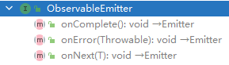
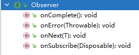
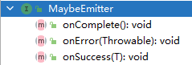
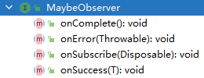
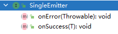
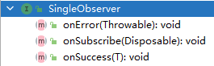
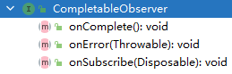
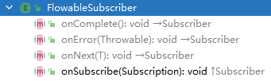
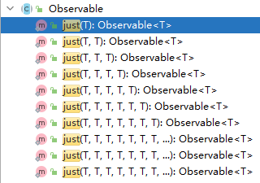

基于 `RxJava 2.0` 进行讲解。

## 1. 编程范式（`Programming paradigm`）

参考网址：`https://en.wikipedia.org/wiki/Programming_paradigm`

### 1.1 命令式编程（指令式编程，`Imperative programming`）

参考网址：`https://baike.baidu.com/item/指令式编程`

#### 1.1.1 过程式编程（程序式编程，`Procedural rogramming`）

参考网址：`https://baike.baidu.com/item/过程程序设计`

#### 1.1.2 面向对象编程（`Object Oriented Programming`）

参考网址：`https://baike.baidu.com/item/面向对象程序设计/24792`

### 1.2 声明式编程（Declarative programming）

参考网址：`https://baike.baidu.com/item/声明式编程`

#### 1.2.1 函数式编程（`Functional Programming`）

参考网址：`https://baike.baidu.com/item/函数式编程`

#### 1.2.2 逻辑式编程（`Logic programming`）

参考网址：`https://baike.baidu.com/item/逻辑编程/8281957`

#### 1.2.3 响应式编程（`Reactive Programming`）

参考网址：`https://baike.baidu.com/item/响应式编程`

## 2. 函数式编程

### 2.1 函数式编程的特性

#### 2.1.1 闭包和高阶函数

#### 2.1.2 惰性计算

#### 2.1.3 递归

#### 2.1.4 函数是 “第一等公民”

#### 2.1.5 只用 “表达式”，不用 “语句”

#### 2.1.6 没有 “副作用”

#### 2.1.7 不修改状态

#### 2.1.8 引用透明性

### 2.2 函数式编程的优点

#### 2.2.1 代码简洁，开发快速

#### 2.2.2 接近自然语言，易于理解

#### 2.2.3 更方便的代码管理

#### 2.2.4 易于 “并发编程”

#### 2.2.5 代码的热升级

## 3. `RxJava` 概述

### 3.1 `Rx` 介绍

`Rx` 即 `ReactiveX`（是 Reactive `Extensions` 的缩写）。

`Rx` 最初是 `LINQ`（`Language Integrated Queury`，语言集成查询）的一个扩展，由微软的架构师 `Erik Meijer `领导的团队开发，在2012年11月开源。

`Rx` 是一个编程模型，目标是提供一致的编程接口，帮助开发者更方便的处理异步数据流。

`Rx` 的大部分语言库由 `ReactiveX` 这个组织负责维护，比较流行的有 `RxJava`、`RxJS`、`Rx.NET`。

> 社区网站是 [reactivex.io](http://reactivex.io/)。

**`Rx` 的定义：**

```:no-line-numbers
微软给的定义是：
    Rx 是一个函数库，让开发者可以利用可观察序列和 LINQ 风格的查询操作符来编写异步和基于事件的程序。
    使用 Rx，开发者可以：
        1. 用 Observables 表示异步数据流，
        2. 用 LINQ 操作符查询异步数据流，
        3. 用 Schedulers 参数化异步数据流的并发处理。
    Rx 可以这样定义：Rx = Observables + LINQ + Schedulers。
```

```:no-line-numbers
reactivex.io 给的定义是：
    Rx 是一个使用可观察数据流进行异步编程的编程接口。
    Rx 结合了观察者模式、迭代器模式和函数式编程的精华。
```

> 简单来说：`Rx` 就是一个实现异步操作的库。

### 3.2 为什么要使用 `RxJava`

在没有 `RxJava` 之前，`Android` 开发时我们一般会使用 `AysncTask` 或 `Handler` + 线程池，来进行异步操作。但随着异步请求的数量越来越多，代码逻辑将会变得越来越复杂。

而使用 `RxJava`，即使异步请求增多，`RxJava` 也仍然能保持清晰简洁的逻辑。

### 3.3 `RxJava` 的使用场景

数据库的读写、大图片的载入、文件压缩/解压等各种需要放在后台工作的耗时操作，都可以用 `RxJava` 来实现。

### 3.5 `RxJava` 的依赖库

```:no-line-numbers
implementation 'io.reactivex.rxjava2:rxjava:2.1.14'
implementation 'io.reactivex.rxjava2:rxandroid:2.0.2'
```

> `RxAndroid` 是 `RxJava` 在 `Android` 平台上的扩展。
> 
> `RxAndroid` 包含了一些能够简化 `Android` 开发的工具，比如特殊的线程调度器（`Scheduler`）。

## 4. `RxJava` 中的观察者（`Observer`）和被观察者（`Observable`）

`RxJava` 采用观察者模式实现异步操作。

在 `Rx` 中，一个观察者（`Observer`）订阅（`subscribe`）一个可观察对象（`Observable`）。`Observer` 接收 `Observable` 发射（`emit`）的数据或事件序列，并进行处理。

> 这种模式可以极大地简化并发操作，因为它创建了一个处于待命状态的 `Observer`，在未来某个时刻响应 `Observable` 的通知，不需要阻塞等待 `Observable` 发射（`emit`）数据后的结果。

被观察者（`Observable`）通过发射器（`Emitter`）发射（`emit`）数据和事件序列，同时通过操作符函数得到符合预期的数据和事件序列。

观察者（`Observer`）则提供相关的响应方法来接收并处理发射过来的数据和事件序列。

## 5. 五种被观察者（Observable/Maybe/Single/Completable/Flowable）

每种被观察者都对应有不同的观察者，当通过创建操作符（定义在被观察者中的 `create` 方法）获取被观察者对象时，不同的被观察者对象也会通过不同的发射器将数据或事件序列发射给对应的观察者。

`RxJava` 中的五种被观察者分别为：

1. `Observable`

    

    ```:no-line-numbers
    对应的发射器为 ObservableEmitter，对应的观察者为 Observer

    数据和事件的发射及处理遵循如下规则：
        onSubscribe onNext* (onError | onComplete)?
    该规则描述了观察者 Observer 的响应流程，即：
    1. 先调用 Observer.onSubscribe(Disposable d)
    2. 再调用 Observer.onNext(T t)
        参数 T 表示发射过来的数据项
        onNext* 表示被观察者 Observable 可以发射 0 至 N 个数据项
    3. 最后调用 Observer.onError(Throwable e) 或者 Observer.onComplete()
        (onError | onComplete)? 表示被观察者 Observable：
            要么不发射事件；
            要么只发射 1 个 onError 事件；
            要么只发射 1 个 onComplete 事件。
        即：onError 和 onComplete 事件中发射了其中 1 个，另一个就不能发射出去了。
    ```
   
2. `Maybe`

    

    ```:no-line-numbers
    对应的发射器为 MaybeEmitter，对应的观察者为 MaybeObserver

    数据和事件的发射及处理遵循如下规则：
        onSubscribe (onSuccess | onError | onComplete)?
    该规则描述了观察者 MaybeObserver 的响应流程，即：
    1. 先调用 MaybeObserver.onSubscribe(Disposable d)
    2. 再调用 MaybeObserver.onSuccess(T t) 或 MaybeObserver.onError(Throwable e) 或者 MaybeObserver.onComplete()
        参数 T 表示发射过来的数据项
        (onSuccess | onError | onComplete)? 表示被观察者 Maybe
            要么不发射数据或事件序列；
            要么只发射 1 个 数据项；
            要么只发射 1 个 onError 事件；
            要么只发射 1 个 onComplete 事件。
        即：发射了数据，就不能再发射事件。且，
            发射数据时，最多发射 1 个数据项；
            发射事件时，onError 和 onComplete 事件中发射了其中 1 个，另一个就不能发射出去了
    ```

3. `Single`

    

    ```:no-line-numbers
     对应的发射器为 SingleEmitter，对应的观察者为 SingleObserver

    数据和事件的发射及处理遵循如下规则：
        onSubscribe (onSuccess | onError)?
    该规则描述了观察者 SingleObserver 的响应流程，即：
    1. 先调用 SingleObserver.onSubscribe(Disposable d)
    2. 再调用 SingleObserver.onSuccess(T t) 或 SingleObserver.onError(Throwable e)
        参数 T 表示发射过来的数据项
        (onSuccess | onError)? 表示被观察者 Single
            要么不发射数据或事件序列；
            要么只发射 1 个 数据项；
            要么只发射 1 个 onError 事件；
        即：发射了数据，就不能再发射事件。且，
            发射数据时，最多发射 1 个数据项；
            发射事件时，最多发射 1 个 onError 事件。
    ```

4. `Completable`

    

    ```:no-line-numbers
    对应的发射器为 CompletableEmitter，对应的观察者为 CompletableObserver

    数据和事件的发射及处理遵循如下规则：
        onSubscribe (onError | onComplete)?
    该规则描述了观察者 CompletableObserver 的响应流程，即：
    1. 先调用 CompletableObserver.onSubscribe(Disposable d)
    2. 再调用 CompletableObserver.onError(Throwable e) 或者 CompletableObserver.onComplete()
        (onError | onComplete)? 表示被观察者 Completable
            要么不发射事件序列；
            要么只发射 1 个 onError 事件；
            要么只发射 1 个 onComplete 事件。
        即：不能发射数据，只能发射事件。且，
            发射事件时，onError 和 onComplete 事件中发射了其中 1 个，另一个就不能发射出去了。
    ```

5. `Flowable`

    

    ```:no-line-numbers
    对应的发射器为 FlowableEmitter，对应的观察者为 FlowableSubscriber

    数据和事件的发射及处理遵循如下规则：
        onSubscribe onNext* (onError | onComplete)?
    该规则描述了观察者 FlowableSubscriber 的响应流程，即：
    1. 先调用 FlowableSubscriber.onSubscribe(Disposable d)
    2. 再调用 FlowableSubscriber.onNext(T t)
        参数 T 表示发射过来的数据项
        onNext* 表示被观察者 Flowable 可以发射 0 至 N 个数据项
    3. 最后调用 FlowableSubscriber.onError(Throwable e) 或者 FlowableSubscriber.onComplete()
        (onError | onComplete)? 表示被观察者 Flowable
            要么不发射事件；
            要么只发射 1 个 onError 事件；
            要么只发射 1 个 onComplete 事件。
        即：onError 和 onComplete 事件中发射了其中 1 个，另一个就不能发射出去了。
    ```

> 注意：
> 
> 1. `Maybe`、`Single`、`Completable` 可以看成是简化版的 `Observable`。
> 
> 2. `Observable` 和 `Flowable` 的区别是：`Observable` 不支持背压；`Flowable` 支持背压。

### 5.1 `Observable` 的基本用法
### 5.2 `Maybe` 的基本用法
### 5.3 `Single` 的基本用法
### 5.4 `Completable` 的基本用法
### 5.5 `Flowable` 的基本用法

## 6. 背压

背压的定义：

```:no-line-numbers
当上下游在不同的线程中，通过 Observable 发射，处理，响应数据流时，
如果上游发射数据的速度快于下游接收处理数据的速度，这样对于那些没来得及处理的数据就会造成积压，
这些数据既不会丢失，也不会被垃圾回收机制回收，而是存放在一个异步缓存池中，
如果缓存池中的数据一直得不到处理，越积越多，最后就会造成内存溢出，这便是响应式编程中的背压（backpressure）问题。

个人理解：
    在发射数据和处理数据处于不同线程中的条件下，当 Observable 发射了大量数据时，Observer 可能会处理不过来。
    此时，随着 Observable 不断地发射数据，数据就会因 Observer 无法及时处理而堆积在内存中，从而可能会导致 OOM 内存溢出，
    这种情况称之为背压。

注意：
    可以把发射数据的 Observable 称为 “上游”，处理数据的 Observer 称为 “下游”。
```

## 7. 操作符

对于 `Rx` 来说，`Observable` 和 `Observer` 仅仅是个开始，它们本身不过是标准观察者模式的一些轻量级扩展，目的是为了更好的处理事件序列。

`Rx` 真正强大的地方在于它的操作符，操作符让你可以变换、组合、操纵和处理 `Observable` 发射的数据。

`Rx` 的操作符让你可以用声明式的风格组合异步操作序列，它拥有回调的所有效率优势，同时又避免了典型的异步系统中嵌套回调的缺点。

`RxJava` 中，操作符作为成员方法定义在 `Observable` 中。

### 7.1 创建操作符

创建操作符用于创建被观察者对象

#### 7.1.1 `create()`

```java:no-line-numbers
/* Observable.java */
public static <T> Observable<T> create(ObservableOnSubscribe<T> source) {
    return RxJavaPlugins.onAssembly(new ObservableCreate<T>(source));
}
```

```:no-line-numbers
创建一个被观察者对象

参数 ObservableOnSubscribe 接口提供 void subscribe(ObservableEmitter<T> emitter) 方法，用于将被观察者和发射器绑定起来。
重写 ObservableOnSubscribe.subscribe(emitter) 方法，通过参数发射器 emitter 发射数据项和事件序列。

ObservableCreate 是抽象类 Observable 的具体子类，重写了 void subscribeActual(Observer<? super T> observer) 方法。
其中 Observable.subscribeActual(observer) 方法用于处理数据项和事件序列的发射和接收。
    在 ObservableCreate，subscribeActual 方法中：
        1. 数据项和事件序列的发射过程，是通过调用 ObservableOnSubscribe.subscribe(emitter) 方法实现的；
        2. 数据项和事件序列的接收过程，则是在 ObservableEmitter 的实现类中完成的（ObservableEmitter 持有 Observer 的引用）。

注意：其他的四种观察者也对应有不同的 XxxOnSubscribe 和 XxxCreate。
```

#### 7.1.2 `just()`



```:no-line-numbers
创建一个被观察者对象，同时可传入待发射的数据项 T。

如上图所示，重载了 10 个 just 操作符方法，即：待发射的数据项 T 不能超过 10 个。
```

#### 7.1.3 `fromArray()/fromCallable()/fromFuture()/fromIterable()`

1. `fromArray()`

    ```java:no-line-numbers
    /* Observable.java */
    static <T> Observable<T> fromArray(T... items)
    ```

    ```:no-line-numbers
    创建一个被观察者对象，同时可传入待发射的数据项。

    没有限制待发射的数据项。

    just() 发射多个数据项就是基于 fromArray() 实现的。
    ```

2. `fromCallable()`

    ```java:no-line-numbers
    /* Observable.java */
    static <T> Observable<T> fromCallable(Callable<? extends T> supplier)
    ```

    ```:no-line-numbers
    将参数 Callable 的 call() 方法的返回值作为数据项发射给观察者
    ```

3. `fromFuture()`

    ```java:no-line-numbers
    /* Observable.java */
    static <T> Observable<T> fromFuture(Future<? extends T> future)
    static <T> Observable<T> fromFuture(Future<? extends T> future, long timeout, TimeUnit unit)

    static <T> Observable<T> fromFuture(Future<? extends T> future, Scheduler scheduler)
    static <T> Observable<T> fromFuture(Future<? extends T> future, long timeout, TimeUnit unit, Scheduler scheduler)
    ```

    ```:no-line-numbers
    参数 Future 的作用是增加了 cancel() 等方法来操作 Callable，通过 Future.get 方法来获取 Callable 的返回值。
    即将 Future.get 方法的返回值作为数据项发射给观察者。

    参数 Scheduler 用于指定线程。
    ```

4. `fromIterable()`

    ```java:no-line-numbers
    /* Observable.java */
    static <T> Observable<T> fromIterable(Iterable<? extends T> source)
    ```

    ```:no-line-numbers
    将参数 source 集合中的元素 T 作为数据项发射给观察者。
    ```

#### 7.1.4 `defer()`

```java:no-line-numbers
/* Observable.java */
static <T> Observable<T> defer(Callable<? extends ObservableSource<? extends T>> supplier)
```

```:no-line-numbers
静态方法 defer 返回的被观察者并不是用来发射数据项和事件序列的。
真正发射数据项和事件序列的被观察者是通过参数 Callable 的泛型指定的。
defer 方法的作用就是：
    当 defer 方法返回的被观察者被订阅后，才通过参数 Callable 的 call() 方法创建并返回用于发射数据项和事件序列的被观察者。
也就是说，通过 defer 方法，推迟了用于发射数据项和事件序列的被观察者的创建时机。
```

#### 7.1.5 `timer()`

```java:no-line-numbers
/* Observable.java */
static Observable<Long> timer(long delay, TimeUnit unit)
static Observable<Long> timer(long delay, TimeUnit unit, Scheduler scheduler)
```

```:no-line-numbers
在指定时间 delay 后，发射一个 Long 类型的固定数据项 0L 给观察者。
```

#### 7.1.6 `interval()`

```java:no-line-numbers
/* Observable.java */
static Observable<Long> interval(long initialDelay, long period, TimeUnit unit)
static Observable<Long> interval(long initialDelay, long period, TimeUnit unit, Scheduler scheduler)

// 相当于 interval(period, period, unit)
static Observable<Long> interval(long period, TimeUnit unit) 
// 相当于 interval(period, period, unit, scheduler)
static Observable<Long> interval(long period, TimeUnit unit, Scheduler scheduler) 
```

```:no-line-numbers
延迟 initialDelay 时间后，开始发射数据项给观察者。之后，每间隔 period 时间都会发射一个数据项给观察者。
开始时，先发射一个 Long 类型的数据项 0L，之后每次发射的数据项都 +1
```

#### 7.1.7 `intervalRange()`

```java:no-line-numbers
/* Observable.java */
static Observable<Long> intervalRange(long start, long count, long initialDelay, long period, TimeUnit unit)
static Observable<Long> intervalRange(long start, long count, long initialDelay, long period, TimeUnit unit, Scheduler scheduler)
```

```:no-line-numbers
延迟 initialDelay 时间后，开始发射数据项给观察者。之后，每间隔 period 时间都会发射一个数据项给观察者。
开始时，先发射一个 Long 类型的数据项 start，之后每次发射的数据项都 +1，一共发射 count 个数据项。
```

#### 7.1.8 `range()`

```java:no-line-numbers
/* Observable.java */
static Observable<Integer> range(final int start, final int count)
```

```:no-line-numbers
没有延迟时间，也没有间隔时间。
先发射一个 int 类型的数据项 start，之后每次发射的数据项都 +1，一共发射 count 个数据项。
```

#### 7.1.9 `rangeLong()`

```java:no-line-numbers
/* Observable.java */
static Observable<Long> rangeLong(long start, long count)
```

```:no-line-numbers
作用与 range() 一样，只是数据项的类型为 Long。
```

#### 7.1.10 `empty()/error()/nerver()`

1. `empty()`

    ```java:no-line-numbers
    /* Observable.java */
    static <T> Observable<T> empty()
    ```

    ```:no-line-numbers
    不发射数据项，只发射一个 onComplete() 事件给观察者
    ```

2. `error()`

    ```java:no-line-numbers
    /* Observable.java */
    static <T> Observable<T> error(Callable<? extends Throwable> errorSupplier) // 订阅时才创建发射事件的被观察者
    static <T> Observable<T> error(final Throwable exception)
    ```

    ```:no-line-numbers
    不发射数据项，只发射一个 onError 事件给观察者
    ```

3. `nerver()`

    ```java:no-line-numbers
    /* Observable.java */
    static <T> Observable<T> never() 
    ```

    ```:no-line-numbers
    既不发射数据项，也不发射任何事件。
    只会触发观察者的 onSubscribe(Disposable d) 方法。
    ```

### 7.2 转换操作符

#### 7.2.1 `map()`

```java:no-line-numbers
<R> Observable<R> map(Function<? super T, ? extends R> mapper)
```

```:no-line-numbers
map 是一个非静态方法，返回一个 ObservableMap<T, R> 类型的被观察者。
接口 Function<T, R> 提供一个 "R apply(T)" 方法，用于将类型 T 转换为类型 R。
当使用了操作符 map 的被观察者 Observable<T> 发射数据项 T 时，
会先被一个中间观察者（MapObserver）接收到，并通过 Function 的 apply 方法将传入的数据项 T 转换成数据项 R，
然后再将转换后的数据项 R 发射给目标观察者。

简单地说，操作符 map 可以将发射的数据项 T 转换成其它类型的数据项 R，观察者接收到的就是转换后的数据项 R。
```

```java:no-line-numbers
// example
Observable.just(1, 2, 3)
    .map(x -> x * x)
    .subscribe(System.out::println);

// prints:
// 1
// 4
// 9
```

#### 7.2.2 `flatMap()`

```java:no-line-numbers
<R> Observable<R> flatMap(Function<? super T, ? extends ObservableSource<? extends R>> mapper)
```

```:no-line-numbers
flatMap 和 map 的作用类似，都是将 T 类型的数据项转换成 R 类型的数据项，再发射给观察者。
区别是：
    1. map 直接通过 Function.apply 方法返回转换后的 R 类型的数据项；
    2. flatmap 的 Function.apply 方法则返回一个作为中介的被观察者 Observable<R>，
        由中介被观察者 Observable<R> 生成 R 类型的数据项，再发射给目标观察者。
```

```java:no-line-numbers
// example
Observable.just("A", "B", "C")
    .flatMap(a -> {
        return Observable.intervalRange(1, 3, 0, 1, TimeUnit.SECONDS) // 从 1 开始发射 3 个数。延迟 0s，间隔 1s
                .map(b -> '(' + a + ", " + b + ')');
    })
    .blockingSubscribe(System.out::println);

// prints (not necessarily in this order):
// (A, 1)
// (C, 1)
// (B, 1)
// (A, 2)
// (C, 2)
// (B, 2)
// (A, 3)
// (C, 3)
// (B, 3)
```

#### 7.2.3 `concatMap()`

```java:no-line-numbers
<R> Observable<R> concatMap(Function<? super T, ? extends ObservableSource<? extends R>> mapper)
```

```:no-line-numbers
concatMap() 和 flatMap() 基本上是一样的，只不过 concatMap() 转发出来的事件是有序的，而 flatMap() 是无序的。
```

```java:no-line-numbers
Observable.range(0, 5)
    .concatMap(i -> {
        long delay = Math.round(Math.random() * 2);
        return Observable.timer(delay, TimeUnit.SECONDS).map(n -> i); // 尽管延迟时间随机，但总能保证依次打印 01234
    })
    .blockingSubscribe(System.out::print);

// prints 01234
```

#### 7.2.4 `buffer()`

#### 7.2.5 `groupBy()`

#### 7.2.6 `scan()`

#### 7.2.7 `window()`

### 7.3 组合操作符

#### 7.3.1 `concat()`

#### 7.3.2 `concatArray()`

#### 7.3.3 `merge()`

#### 7.3.4 `concatArrayDelayError()/mergeArrayDelayError()`

#### 7.3.5 `zip()`

#### 7.3.6 `combineLatest()/combineLatestDelayError()`

#### 7.3.7 `reduce()`

#### 7.3.8 `collect()`

#### 7.3.9 `startWith()/startWithArray()`

#### 7.3.10 `count()`

### 7.4 功能操作符

#### 7.4.1 `delay()`
#### 7.4.2 `doOnEach()`
#### 7.4.3 `doOnNext()`
#### 7.4.4 `doAfterNext()`
#### 7.4.5 `doOnComplete()`
#### 7.4.6 `doOnError()`
#### 7.4.7 `doOnSubscribe()`
#### 7.4.8 `doOnDispose()`
#### 7.4.9 `doOnLifecycle()`
#### 7.4.10 `doOnTerminate()/doAfterTerminate()`
#### 7.4.11 `doFinally()`
#### 7.4.12 `onErrorReturn()`
#### 7.4.13 `onErrorResumeNext()`
#### 7.4.14 `onExceptionResumeNext()`
#### 7.4.15 `retry()`
#### 7.4.16 `retryUnit()`
#### 7.4.17 `retryWhen()`
#### 7.4.18 `repeat()`
#### 7.4.19 `repeatWhen()`
#### 7.4.20 `subscribeOn()`
#### 7.4.21 `observeOn()`

### 7.5 过滤操作符

#### 7.5.1 `filter()`
#### 7.5.2 `ofType()`
#### 7.5.3 `skip()`
#### 7.5.4 `distinct()`
#### 7.5.5 `distinctUntilChanged()`
#### 7.5.6 `take()`
#### 7.5.7 `debounce()`
#### 7.5.8 `firstElement()/lastElement()`
#### 7.5.9 `elementAt()/elementAtOrError()`

### 7.6 条件操作符

#### 7.6.1 `all()`
#### 7.6.2 `takeWhile()`
#### 7.6.3 `skipWhile()`
#### 7.6.4 `takeUntil()`
#### 7.6.5 `skilUntil()`
#### 7.6.6 `sequenceEqual()`
#### 7.6.7 `contains()`
#### 7.6.8 `isEmpty()`
#### 7.6.9 `amb()`
#### 7.6.10 `defaultIfEmpty()`

## 8. 调度器

如果你想给 `Observable` 操作符链添加多线程功能，你可以指定操作符（或者特定的 `Observable`）在特定的调度器（`Scheduler`）上执行。

> 某些 `Rx` 的 `Observable` 操作符有一些变体，它们可以接受一个 `Scheduler` 参数。这个参数指定操作符将它们的部分或全部任务放在一个特定的调度器上执行。

使用 `observeOn` 和 `subscribeOn` 操作符，你可以让 `Observable` 在一个特定的调度器上执行。

> `observeOn` 指示一个 `Observable` 在一个特定的调度器上调用观察者的 `onNext`， `onError` 和 `onCompleted` 方法。
> 
> `subscribeOn` 更进一步，它指示 `Observable` 将全部的处理过程（包括发射数据和通知）放在特定的调度器上执行。

