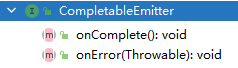

基于 `RxJava 2.0` 进行讲解。

## 1. 编程范式（`Programming paradigm`）

参考网址：`https://en.wikipedia.org/wiki/Programming_paradigm`

### 1.1 命令式编程（指令式编程，`Imperative programming`）

参考网址：`https://baike.baidu.com/item/指令式编程`

#### 1.1.1 过程式编程（程序式编程，`Procedural rogramming`）

参考网址：`https://baike.baidu.com/item/过程程序设计`

#### 1.1.2 面向对象编程（`Object Oriented Programming`）

参考网址：`https://baike.baidu.com/item/面向对象程序设计/24792`

### 1.2 声明式编程（Declarative programming）

参考网址：`https://baike.baidu.com/item/声明式编程`

#### 1.2.1 函数式编程（`Functional Programming`）

参考网址：`https://baike.baidu.com/item/函数式编程`

#### 1.2.2 逻辑式编程（`Logic programming`）

参考网址：`https://baike.baidu.com/item/逻辑编程/8281957`

#### 1.2.3 响应式编程（`Reactive Programming`）

参考网址：`https://baike.baidu.com/item/响应式编程`

## 2. 函数式编程

### 2.1 函数式编程的特性

#### 2.1.1 闭包和高阶函数

#### 2.1.2 惰性计算

#### 2.1.3 递归

#### 2.1.4 函数是 “第一等公民”

#### 2.1.5 只用 “表达式”，不用 “语句”

#### 2.1.6 没有 “副作用”

#### 2.1.7 不修改状态

#### 2.1.8 引用透明性

### 2.2 函数式编程的优点

#### 2.2.1 代码简洁，开发快速

#### 2.2.2 接近自然语言，易于理解

#### 2.2.3 更方便的代码管理

#### 2.2.4 易于 “并发编程”

#### 2.2.5 代码的热升级

## 3. `RxJava` 概述

### 3.1 `Rx` 介绍

`Rx` 即 `ReactiveX`（是 Reactive `Extensions` 的缩写）。

`Rx` 最初是 `LINQ`（`Language Integrated Queury`，语言集成查询）的一个扩展，由微软的架构师 `Erik Meijer `领导的团队开发，在2012年11月开源。

`Rx` 是一个编程模型，目标是提供一致的编程接口，帮助开发者更方便的处理异步数据流。

`Rx` 的大部分语言库由 `ReactiveX` 这个组织负责维护，比较流行的有 `RxJava`、`RxJS`、`Rx.NET`。

> 社区网站是 [reactivex.io](http://reactivex.io/)。

**`Rx` 的定义：**

```:no-line-numbers
微软给的定义是：
    Rx 是一个函数库，让开发者可以利用可观察序列和 LINQ 风格的查询操作符来编写异步和基于事件的程序。
    使用 Rx，开发者可以：
        1. 用 Observables 表示异步数据流，
        2. 用 LINQ 操作符查询异步数据流，
        3. 用 Schedulers 参数化异步数据流的并发处理。
    Rx 可以这样定义：Rx = Observables + LINQ + Schedulers。
```

```:no-line-numbers
reactivex.io 给的定义是：
    Rx 是一个使用可观察数据流进行异步编程的编程接口。
    Rx 结合了观察者模式、迭代器模式和函数式编程的精华。
```

> 简单来说：`Rx` 就是一个实现异步操作的库。

### 3.2 为什么要使用 `RxJava`

在没有 `RxJava` 之前，`Android` 开发时我们一般会使用 `AysncTask` 或 `Handler` + 线程池，来进行异步操作。但随着异步请求的数量越来越多，代码逻辑将会变得越来越复杂。

而使用 `RxJava`，即使异步请求增多，`RxJava` 也仍然能保持清晰简洁的逻辑。

### 3.3 `RxJava` 的使用场景

数据库的读写、大图片的载入、文件压缩/解压等各种需要放在后台工作的耗时操作，都可以用 `RxJava` 来实现。

### 3.5 `RxJava` 的依赖库

```groovy:no-line-numbers
implementation 'io.reactivex.rxjava2:rxjava:2.1.14'
implementation 'io.reactivex.rxjava2:rxandroid:2.0.2'
```

> `RxAndroid` 是 `RxJava` 在 `Android` 平台上的扩展。
> 
> `RxAndroid` 包含了一些能够简化 `Android` 开发的工具，比如特殊的线程调度器（`Scheduler`）。

## 4. `RxJava` 中的观察者（`Observer`）和被观察者（`Observable`）

`RxJava` 采用观察者模式实现异步操作。

在 `Rx` 中，一个观察者（`Observer`）订阅（`subscribe`）一个可观察对象（`Observable`）。`Observer` 接收 `Observable` 发射（`emit`）的数据或事件序列，并进行处理。

> 这种模式可以极大地简化并发操作，因为它创建了一个处于待命状态的 `Observer`，在未来某个时刻响应 `Observable` 的通知，不需要阻塞等待 `Observable` 发射（`emit`）数据后的结果。

被观察者（`Observable`）通过发射器（`Emitter`）发射（`emit`）数据和事件序列，同时通过操作符函数得到符合预期的数据和事件序列。

观察者（`Observer`）则提供相关的响应方法来接收并处理发射过来的数据和事件序列。

## 5. 五种被观察者（Observable/Maybe/Single/Completable/Flowable）

每种被观察者都对应有不同的观察者，当通过创建操作符（定义在被观察者中的 `create` 方法）获取被观察者对象时，不同的被观察者对象也会通过不同的发射器将数据或事件序列发射给对应的观察者。

`RxJava` 中的五种被观察者分别为：

1. `Observable`

    

    ```java:no-line-numbers
    对应的发射器为 ObservableEmitter，对应的观察者为 Observer

    数据和事件的发射及处理遵循如下规则：
        onSubscribe onNext* (onError | onComplete)?
    该规则描述了观察者 Observer 的响应流程，即：
    1. 先调用 Observer.onSubscribe(Disposable d)
    2. 再调用 Observer.onNext(T t)
        参数 T 表示发射过来的数据项
        onNext* 表示被观察者 Observable 可以发射 0 至 N 个数据项
    3. 最后调用 Observer.onError(Throwable e) 或者 Observer.onComplete()
        (onError | onComplete)? 表示被观察者 Observable：
            要么不发射事件；
            要么只发射 1 个 onError 事件；
            要么只发射 1 个 onComplete 事件。
        即：onError 和 onComplete 事件中发射了其中 1 个，另一个就不能发射出去了。
    ```
   
2. `Maybe`

    

    ```java:no-line-numbers
    对应的发射器为 MaybeEmitter，对应的观察者为 MaybeObserver

    数据和事件的发射及处理遵循如下规则：
        onSubscribe (onSuccess | onError | onComplete)?
    该规则描述了观察者 MaybeObserver 的响应流程，即：
    1. 先调用 MaybeObserver.onSubscribe(Disposable d)
    2. 再调用 MaybeObserver.onSuccess(T t) 或 MaybeObserver.onError(Throwable e) 或者 MaybeObserver.onComplete()
        参数 T 表示发射过来的数据项
        (onSuccess | onError | onComplete)? 表示被观察者 Maybe
            要么不发射数据或事件序列；
            要么只发射 1 个 数据项；
            要么只发射 1 个 onError 事件；
            要么只发射 1 个 onComplete 事件。
        即：发射了数据，就不能再发射事件。且，
            发射数据时，最多发射 1 个数据项；
            发射事件时，onError 和 onComplete 事件中发射了其中 1 个，另一个就不能发射出去了
    ```

3. `Single`

    

    ```java:no-line-numbers
     对应的发射器为 SingleEmitter，对应的观察者为 SingleObserver

    数据和事件的发射及处理遵循如下规则：
        onSubscribe (onSuccess | onError)?
    该规则描述了观察者 SingleObserver 的响应流程，即：
    1. 先调用 SingleObserver.onSubscribe(Disposable d)
    2. 再调用 SingleObserver.onSuccess(T t) 或 SingleObserver.onError(Throwable e)
        参数 T 表示发射过来的数据项
        (onSuccess | onError)? 表示被观察者 Single
            要么不发射数据或事件序列；
            要么只发射 1 个 数据项；
            要么只发射 1 个 onError 事件；
        即：发射了数据，就不能再发射事件。且，
            发射数据时，最多发射 1 个数据项；
            发射事件时，最多发射 1 个 onError 事件。
    ```

4. `Completable`

    

    ```java:no-line-numbers
    对应的发射器为 CompletableEmitter，对应的观察者为 CompletableObserver

    数据和事件的发射及处理遵循如下规则：
        onSubscribe (onError | onComplete)?
    该规则描述了观察者 CompletableObserver 的响应流程，即：
    1. 先调用 CompletableObserver.onSubscribe(Disposable d)
    2. 再调用 CompletableObserver.onError(Throwable e) 或者 CompletableObserver.onComplete()
        (onError | onComplete)? 表示被观察者 Completable
            要么不发射事件序列；
            要么只发射 1 个 onError 事件；
            要么只发射 1 个 onComplete 事件。
        即：不能发射数据，只能发射事件。且，
            发射事件时，onError 和 onComplete 事件中发射了其中 1 个，另一个就不能发射出去了。
    ```

5. `Flowable`

    

    ```java:no-line-numbers
    对应的发射器为 FlowableEmitter，对应的观察者为 FlowableSubscriber

    数据和事件的发射及处理遵循如下规则：
        onSubscribe onNext* (onError | onComplete)?
    该规则描述了观察者 FlowableSubscriber 的响应流程，即：
    1. 先调用 FlowableSubscriber.onSubscribe(Disposable d)
    2. 再调用 FlowableSubscriber.onNext(T t)
        参数 T 表示发射过来的数据项
        onNext* 表示被观察者 Flowable 可以发射 0 至 N 个数据项
    3. 最后调用 FlowableSubscriber.onError(Throwable e) 或者 FlowableSubscriber.onComplete()
        (onError | onComplete)? 表示被观察者 Flowable
            要么不发射事件；
            要么只发射 1 个 onError 事件；
            要么只发射 1 个 onComplete 事件。
        即：onError 和 onComplete 事件中发射了其中 1 个，另一个就不能发射出去了。
    ```

> 注意：
> 
> 1. `Maybe`、`Single`、`Completable` 可以看成是简化版的 `Observable`。
> 
> 2. `Observable` 和 `Flowable` 的区别是：`Observable` 不支持背压；`Flowable` 支持背压。

### 5.1 `Observable` 的基本用法
### 5.2 `Maybe` 的基本用法
### 5.3 `Single` 的基本用法
### 5.4 `Completable` 的基本用法
### 5.5 `Flowable` 的基本用法

## 6. 背压

背压的定义：

```java:no-line-numbers
当上下游在不同的线程中，通过 Observable 发射，处理，响应数据流时，
如果上游发射数据的速度快于下游接收处理数据的速度，这样对于那些没来得及处理的数据就会造成积压，
这些数据既不会丢失，也不会被垃圾回收机制回收，而是存放在一个异步缓存池中，
如果缓存池中的数据一直得不到处理，越积越多，最后就会造成内存溢出，这便是响应式编程中的背压（backpressure）问题。

个人理解：
    在发射数据和处理数据处于不同线程中的条件下，当 Observable 发射了大量数据时，Observer 可能会处理不过来。
    此时，随着 Observable 不断地发射数据，数据就会因 Observer 无法及时处理而堆积在内存中，从而可能会导致 OOM 内存溢出，
    这种情况称之为背压。

注意：
    可以把发射数据的 Observable 称为 “上游”，处理数据的 Observer 称为 “下游”。
```

## 7. 操作符

> 参考 https://github.com/ReactiveX/RxJava/wiki

对于 `Rx` 来说，`Observable` 和 `Observer` 仅仅是个开始，它们本身不过是标准观察者模式的一些轻量级扩展，目的是为了更好的处理事件序列。

`Rx` 真正强大的地方在于它的操作符，操作符让你可以变换、组合、操纵和处理 `Observable` 发射的数据。

`Rx` 的操作符让你可以用声明式的风格组合异步操作序列，它拥有回调的所有效率优势，同时又避免了典型的异步系统中嵌套回调的缺点。

`RxJava` 中，操作符作为成员方法定义在 `Observable` 中。

### 7.1 创建操作符

创建操作符用于创建被观察者对象

#### 7.1.1 `create()`

```java:no-line-numbers
/* Observable.java */
public static <T> Observable<T> create(ObservableOnSubscribe<T> source) {
    return RxJavaPlugins.onAssembly(new ObservableCreate<T>(source));
}
```

```java:no-line-numbers
创建一个被观察者对象

参数 ObservableOnSubscribe 接口提供 void subscribe(ObservableEmitter<T> emitter) 方法，用于将被观察者和发射器绑定起来。
重写 ObservableOnSubscribe.subscribe(emitter) 方法，通过参数发射器 emitter 发射数据项和事件序列。

ObservableCreate 是抽象类 Observable 的具体子类，重写了 void subscribeActual(Observer<? super T> observer) 方法。
其中 Observable.subscribeActual(observer) 方法用于处理数据项和事件序列的发射和接收。
    在 ObservableCreate，subscribeActual 方法中：
        1. 数据项和事件序列的发射过程，是通过调用 ObservableOnSubscribe.subscribe(emitter) 方法实现的；
        2. 数据项和事件序列的接收过程，则是在 ObservableEmitter 的实现类中完成的（ObservableEmitter 持有 Observer 的引用）。

注意：其他的四种观察者也对应有不同的 XxxOnSubscribe 和 XxxCreate。
```

#### 7.1.2 `just()`


```java:no-line-numbers
创建一个被观察者对象，同时可传入待发射的数据项 T。

如上图所示，重载了 10 个 just 操作符方法，即：待发射的数据项 T 不能超过 10 个。
```

#### 7.1.3 `fromArray()/fromCallable()/fromFuture()/fromIterable()`

1. `fromArray()`

    ```java:no-line-numbers
    /* Observable.java */
    static <T> Observable<T> fromArray(T... items)
    ```

    ```java:no-line-numbers
    创建一个被观察者对象，同时可传入待发射的数据项。

    没有限制待发射的数据项。

    just() 发射多个数据项就是基于 fromArray() 实现的。
    ```

2. `fromCallable()`

    ```java:no-line-numbers
    /* Observable.java */
    static <T> Observable<T> fromCallable(Callable<? extends T> supplier)
    ```

    ```java:no-line-numbers
    将参数 Callable 的 call() 方法的返回值作为数据项发射给观察者
    ```

3. `fromFuture()`

    ```java:no-line-numbers
    /* Observable.java */
    static <T> Observable<T> fromFuture(Future<? extends T> future)
    static <T> Observable<T> fromFuture(Future<? extends T> future, long timeout, TimeUnit unit)

    static <T> Observable<T> fromFuture(Future<? extends T> future, Scheduler scheduler)
    static <T> Observable<T> fromFuture(Future<? extends T> future, long timeout, TimeUnit unit, Scheduler scheduler)
    ```

    ```:no-line-numbers
    参数 Future 的作用是增加了 cancel() 等方法来操作 Callable，通过 Future.get 方法来获取 Callable 的返回值。
    即将 Future.get 方法的返回值作为数据项发射给观察者。

    参数 Scheduler 用于指定线程。
    ```

4. `fromIterable()`

    ```java:no-line-numbers
    /* Observable.java */
    static <T> Observable<T> fromIterable(Iterable<? extends T> source)
    ```

    ```java:no-line-numbers
    将参数 source 集合中的元素 T 作为数据项发射给观察者。
    ```

#### 7.1.4 `defer()`

```java:no-line-numbers
/* Observable.java */
static <T> Observable<T> defer(Callable<? extends ObservableSource<? extends T>> supplier)
```

```java:no-line-numbers
静态方法 defer 返回的被观察者并不是用来发射数据项和事件序列的。
真正发射数据项和事件序列的被观察者是通过参数 Callable 的泛型指定的。
defer 方法的作用就是：
    当 defer 方法返回的被观察者被订阅后，才通过参数 Callable 的 call() 方法创建并返回用于发射数据项和事件序列的被观察者。
也就是说，通过 defer 方法，推迟了用于发射数据项和事件序列的被观察者的创建时机。
```

#### 7.1.5 `timer()`

```java:no-line-numbers
/* Observable.java */
static Observable<Long> timer(long delay, TimeUnit unit)
static Observable<Long> timer(long delay, TimeUnit unit, Scheduler scheduler)
```

```java:no-line-numbers
在指定时间 delay 后，发射一个 Long 类型的固定数据项 0L 给观察者。
```

#### 7.1.6 `interval()`

```java:no-line-numbers
/* Observable.java */
static Observable<Long> interval(long initialDelay, long period, TimeUnit unit)
static Observable<Long> interval(long initialDelay, long period, TimeUnit unit, Scheduler scheduler)

// 相当于 interval(period, period, unit)
static Observable<Long> interval(long period, TimeUnit unit) 
// 相当于 interval(period, period, unit, scheduler)
static Observable<Long> interval(long period, TimeUnit unit, Scheduler scheduler) 
```

```java:no-line-numbers
延迟 initialDelay 时间后，开始发射数据项给观察者。之后，每间隔 period 时间都会发射一个数据项给观察者。
开始时，先发射一个 Long 类型的数据项 0L，之后每次发射的数据项都 +1
```

#### 7.1.7 `intervalRange()`

```java:no-line-numbers
/* Observable.java */
static Observable<Long> intervalRange(long start, long count, long initialDelay, long period, TimeUnit unit)
static Observable<Long> intervalRange(long start, long count, long initialDelay, long period, TimeUnit unit, Scheduler scheduler)
```

```java:no-line-numbers
延迟 initialDelay 时间后，开始发射数据项给观察者。之后，每间隔 period 时间都会发射一个数据项给观察者。
开始时，先发射一个 Long 类型的数据项 start，之后每次发射的数据项都 +1，一共发射 count 个数据项。
```

#### 7.1.8 `range()`

```java:no-line-numbers
/* Observable.java */
static Observable<Integer> range(final int start, final int count)
```

```:no-line-numbers
没有延迟时间，也没有间隔时间。
先发射一个 int 类型的数据项 start，之后每次发射的数据项都 +1，一共发射 count 个数据项。
```

#### 7.1.9 `rangeLong()`

```java:no-line-numbers
/* Observable.java */
static Observable<Long> rangeLong(long start, long count)
```

```java:no-line-numbers
作用与 range() 一样，只是数据项的类型为 Long。
```

#### 7.1.10 `empty()/error()/nerver()`

1. `empty()`

    ```java:no-line-numbers
    /* Observable.java */
    static <T> Observable<T> empty()
    ```

    ```:no-line-numbers
    不发射数据项，只发射一个 onComplete() 事件给观察者
    ```

2. `error()`

    ```java:no-line-numbers
    /* Observable.java */
    static <T> Observable<T> error(Callable<? extends Throwable> errorSupplier) // 订阅时才创建发射事件的被观察者
    static <T> Observable<T> error(final Throwable exception)
    ```

    ```java:no-line-numbers
    不发射数据项，只发射一个 onError 事件给观察者
    ```

3. `nerver()`

    ```java:no-line-numbers
    /* Observable.java */
    static <T> Observable<T> never() 
    ```

    ```java:no-line-numbers
    既不发射数据项，也不发射任何事件。
    只会触发观察者的 onSubscribe(Disposable d) 方法。
    ```

### 7.2 转换操作符

#### 7.2.1 `map()`

```java:no-line-numbers
<R> Observable<R> map(Function<? super T, ? extends R> mapper)
```

```java:no-line-numbers
map 是一个非静态方法，返回一个 ObservableMap<T, R> 类型的被观察者。
接口 Function<T, R> 提供一个 "R apply(T)" 方法，用于将类型 T 转换为类型 R。
当使用了操作符 map 的被观察者 Observable<T> 发射数据项 T 时，
会先被一个中间观察者（MapObserver）接收到，并通过 Function 的 apply 方法将传入的数据项 T 转换成数据项 R，
然后再将转换后的数据项 R 发射给目标观察者。

简单地说，操作符 map 可以将发射的数据项 T 转换成其它类型的数据项 R，观察者接收到的就是转换后的数据项 R。
```

```java:no-line-numbers
// example
Observable.just(1, 2, 3)
    .map(x -> x * x)
    .subscribe(System.out::println);

// prints:
// 1
// 4
// 9
```

#### 7.2.2 `flatMap()`

```java:no-line-numbers
<R> Observable<R> flatMap(Function<? super T, ? extends ObservableSource<? extends R>> mapper)
```

```java:no-line-numbers
flatMap 和 map 的作用类似，都是将 T 类型的数据项转换成 R 类型的数据项，再发射给观察者。
区别是：
    1. map 直接通过 Function.apply 方法返回转换后的 R 类型的数据项；
    2. flatmap 的 Function.apply 方法则返回一个作为中介的被观察者 Observable<R>，
        由中介被观察者 Observable<R> 生成 R 类型的数据项，再发射给目标观察者。
```

```java:no-line-numbers
// example
Observable.just("A", "B", "C")
    .flatMap(a -> {
        return Observable.intervalRange(1, 3, 0, 1, TimeUnit.SECONDS) // 从 1 开始发射 3 个数。延迟 0s，间隔 1s
                .map(b -> '(' + a + ", " + b + ')');
    })
    .blockingSubscribe(System.out::println);

// prints (not necessarily in this order):
// (A, 1)
// (C, 1)
// (B, 1)
// (A, 2)
// (C, 2)
// (B, 2)
// (A, 3)
// (C, 3)
// (B, 3)
```

#### 7.2.3 `concatMap()`

```java:no-line-numbers
<R> Observable<R> concatMap(Function<? super T, ? extends ObservableSource<? extends R>> mapper)
```

```java:no-line-numbers
concatMap() 和 flatMap() 基本上是一样的，只不过 concatMap() 转发出来的事件是有序的，而 flatMap() 是无序的。
```

```java:no-line-numbers
// example
Observable.range(0, 5)
    .concatMap(i -> {
        long delay = Math.round(Math.random() * 2);
        return Observable.timer(delay, TimeUnit.SECONDS).map(n -> i); // 尽管延迟时间随机，但总能保证依次打印 01234
    })
    .blockingSubscribe(System.out::print);

// prints 01234
```

#### 7.2.4 `buffer()`

```java:no-line-numbers
Observable<List<T>> buffer(int count)
```

```java:no-line-numbers
将源被观察者 Observable<T> 发射的数据项 T 缓冲到 List<T> 集合中，当 List<T> 集合中缓冲了 count 个数据项 T 时，
再将 List<T> 集合作为数据项发射给目标观察者 Observer<List<T>>。
```

```java:no-line-numbers
// example
Observable.range(0, 10)
    .buffer(4)
    .subscribe((List<Integer> buffer) -> System.out.println(buffer));

// prints:
// [0, 1, 2, 3]
// [4, 5, 6, 7]
// [8, 9]
```

#### 7.2.5 `groupBy()`

```java:no-line-numbers
<K> Observable<GroupedObservable<K, T>> groupBy(
            Function<? super T, ? extends K> keySelector)

<K, V> Observable<GroupedObservable<K, V>> groupBy(
            Function<? super T, ? extends K> keySelector,
            Function<? super T, ? extends V> valueSelector)
```

```java:no-line-numbers
将发送的数据进行分组，每个分组都会返回一个被观察者，具体就是：

将源被观察者 Observable<T> 发射的数据项 T 转换成数据项 GroupedObservable<K, V>，即将一个被观察者作为数据项发射出去。
这个作为数据项的被观察者 GroupedObservable<K, V> 用来对源数据项 T 进行分组，其中：
1. 通过 "K keySetlector.apply(T)" 方法，确定根据数据项 T 进行分组时所采用的组键为 K 类型的返回值
2. 通过 "V valueSelector.apply(T)" 方法，确定根据数据项 T 进行分组时所保存的组元素为 V 类型的返回值
同一组中的所有组元素使用同一个 GroupedObservable<K, V> 发射
```

```java:no-line-numbers
// example
Observable<String> animals = Observable.just(
    "Tiger", "Elephant", "Cat", "Chameleon", "Frog", "Fish", "Turtle", "Flamingo");

// 以发射的字符串数据的首字母为组键，字符串的大写为组元素
// 即 groupBy 将数据项 String 转换成了数据项 GroupedObservable<Char, String>
animals.groupBy(animal -> animal.charAt(0), String::toUpperCase) 
    // concatMapSingle(Observable::toList) 将数据项 GroupedObservable<Char, String> 转换成了数据项 Single<List<String>>
    .concatMapSingle(Observable::toList) 
    .subscribe(System.out::println); // 分别打印每组中的组元素集合 List<String>

// prints:
// [TIGER, TURTLE]
// [ELEPHANT]
// [CAT, CHAMELEON]
// [FROG, FISH, FLAMINGO]
```

#### 7.2.6 `scan()`

```java:no-line-numbers
<R> Observable<R> scan(final R initialValue, BiFunction<R, ? super T, R> accumulator)
```

```java:no-line-numbers
BiFunction<T1, T2, R> 函数接口的作用就是提供 "R apply(T1 t1, T2 t2)" 方法，将 T1 和 T2 转换成 R

scan 操作符的作用就是通过 BiFunction<R, T, R> 提供的 apply 方法，
将源被观察者 Observable<T> 发射的 T 类型的数据项和 R 类型的初始值 initialValue，
转换成一个 R 类型的返回值发射给目标观察者 Observer<R>。
具体的流程是：
1. 先把 R 类型的初始值 initialValue 发射给 Observer<R>
2. 接着把 R 类型的初始值 initialValue 和 T 类型的数据项经过 apply 方法转换后的 R 类型的返回值发射给 Observer<R>
3. 之后每次发射的 T 类型的数据项都会和上一次发射的 R 类型的返回值再经过 apply 方法进行转换，
   然后再将转换后的 R 类型的返回值发射给 Observer<R>

简单地说，scan 操作符的作用就是将源数据以一定的逻辑聚合起来，将聚合得到新数据发射出去
```

```java:no-line-numbers
Observable.just(5, 3, 8, 1, 7)
    .scan(0, (partialSum, x) -> partialSum + x)
    .subscribe(System.out::println);

// prints:
// 0
// 5
// 8
// 16
// 17
// 24
```

#### 7.2.7 `window()`

```java:no-line-numbers
Observable<Observable<T>> window(long count, long skip)
```

```java:no-line-numbers
将源被观察者 Observable<T> 发射的数据项 T 转换成数据项 Observable<T>，即将一个被观察者作为数据项发射出去。
这个作为数据项的被观察者 Observable<T> 用来对源数据项 T 进行分组，其中：
1. 每连续发射的 count 个数据项 T 分为同一组，
2. 从第二次分组开始，每次分组时都相对于上一次分组时的起始位置跳过 skip 个数据项 T
同一组中的所有数据项 T 使用同一个 Observable<T> 发射。
（用于发射一组数据项 T 的 Observable<T> 就称为 window）
```

```java:no-line-numbers
Observable.range(1, 10)
    // Create windows containing at most 2 items, and skip 3 items before starting a new window.
    .window(2, 3)
    .flatMapSingle(window -> {
        return window.map(String::valueOf)
                .reduce(new StringJoiner(", ", "[", "]"), StringJoiner::add);
    })
    .subscribe(System.out::println);

// prints:
// [1, 2]
// [4, 5]
// [7, 8]
// [10]
```

### 7.3 组合操作符

#### 7.3.1 `concatWith()`/`concat()`/`concatArray()`

```java:no-line-numbers
Observable<T> concatWith(ObservableSource<? extends T> other) // concat(this, other)

static <T> Observable<T> concat(
            ObservableSource<? extends T> source1, 
            ObservableSource<? extends T> source2) // concatArray(source1, source2)

static <T> Observable<T> concat(
            ObservableSource<? extends T> source1, 
            ObservableSource<? extends T> source2,
            ObservableSource<? extends T> source3) // concatArray(source1, source2, source3)

static <T> Observable<T> concat(
            ObservableSource<? extends T> source1, 
            ObservableSource<? extends T> source2,
            ObservableSource<? extends T> source3,
            ObservableSource<? extends T> source4) // concatArray(source1, source2, source3, source4)

static <T> Observable<T> concatArray(ObservableSource<? extends T>... sources) 
```

```java:no-line-numbers
concatWith(other) 通过调用静态方法 concat(s1, s2) 实现
concat(s1, s2)/concat(s1, s2, s3)/concat(s1, s2, s3, s4) 通过调用静态方法 concatArray(sources) 实现

concatArray 可以将多个被观察者 Observable<T> 组合在一起，然后按照被观察者在参数列表中的组合顺序发射数据项。
即前一个被观察者中的数据项没全部发射完成之前，不会发射后一个被观察者中的数据项。
注意：concat() 最多只可以发送 4 个事件。
```

```java:no-line-numbers
// example
Observable.just(1, 2, 3)
    .concatWith(Observable.just(4, 5, 6))
    .subscribe(item -> System.out.println(item));

// prints 1, 2, 3, 4, 5, 6
```

#### 7.3.2 `mergeWith()`/`merge()`/`mergeArray()`

```java:no-line-numbers
Observable<T> mergeWith(ObservableSource<? extends T> other) // merge(this, other)

static <T> Observable<T> merge(
            ObservableSource<? extends T> source1, 
            ObservableSource<? extends T> source2)

static <T> Observable<T> merge(
            ObservableSource<? extends T> source1, 
            ObservableSource<? extends T> source2, 
            ObservableSource<? extends T> source3)   

static <T> Observable<T> merge(
            ObservableSource<? extends T> source1, 
            ObservableSource<? extends T> source2,
            ObservableSource<? extends T> source3, 
            ObservableSource<? extends T> source4)
            
static <T> Observable<T> mergeArray(ObservableSource<? extends T>... sources)
```

```java:no-line-numbers
merge 和 concat 的作用基本一样，都是将多个被观察者进行合并。
区别是：merge 并行发射数据项，concat 串行发射数据项。
即 merge 不保证参数列表前面的被观察者的数据项全部发射完后，再发射后面的被观察者中的数据项。
```

```java:no-line-numbers
// example
Observable.just(1, 2, 3)
    .mergeWith(Observable.just(4, 5, 6))
    .subscribe(item -> System.out.println(item));
```

#### 7.3.3 `concatArrayDelayError()`/`mergeArrayDelayError()`

```java:no-line-numbers
static <T> Observable<T> concatArrayDelayError(ObservableSource<? extends T>... sources)

static <T> Observable<T> mergeArrayDelayError(ObservableSource<? extends T>... sources)
```

```java:no-line-numbers
对于 concatArray（串行）或 mergeArray（并行），
在合并的多个被观察者中，如果其中有一个被观察者发射了一个 onError 事件，那么就会停止发射数据项，
如果想让 onError 事件延迟到所有被观察者都发射完数据项后再执行，
就可以使用 concatArrayDelayError（串行） 或 mergeArrayDelayError（并行）
```

```java:no-line-numbers
// example
Observable<String> observable1 = Observable.error(new IllegalArgumentException(""));
Observable<String> observable2 = Observable.just(4, 5, 6);
Observable.mergeDelayError(observable1, observable2)
        .subscribe(item -> System.out.println(item));

// emits 4, 5, 6 and then the IllegalArgumentException
```

#### 7.3.4 `zip()`

```java:no-line-numbers
<U, R> Observable<R> zipWith(
            ObservableSource<? extends U> other,
            BiFunction<? super T, ? super U, ? extends R> zipper) // zip(this, other, zipper)

static <T1, T2, R> Observable<R> zip(
            ObservableSource<? extends T1> source1, 
            ObservableSource<? extends T2> source2,
            BiFunction<? super T1, ? super T2, ? extends R> zipper) 

static <T1, T2, T3, R> Observable<R> zip(
            ObservableSource<? extends T1> source1, 
            ObservableSource<? extends T2> source2, 
            ObservableSource<? extends T3> source3,
            Function3<? super T1, ? super T2, ? super T3, ? extends R> zipper)

static <T1, T2, T3, T4, T5, T6, T7, T8, T9, R> Observable<R> zip(
            ObservableSource<? extends T1> source1, 
            ObservableSource<? extends T2> source2, 
            ..., 
            ObservableSource<? extends T9> source9,
            Function9<? super T1, ? super T2, ..., ? super T9, ? extends R> zipper)
```

```java:no-line-numbers
将多个被观察者各自发射的数据项通过 Function<N> 函数接口提供的 apply 方法转换成一个新的数据项发射出去。
如果每个被观察者各自发射的数据项数量不同，则转换的新数据项数量以最少数量为准。即每次转换时，各个被观察者都需要提供有效的数据项。

根据源码实现进行理解：
1. 准备一个数组（数组大小 = 被观察者的个数）
2. 再为每个被观察者准备一个队列容器
3. 每个被观察者发射的数据项都先存入到队列中，然后判断：
    如果数组中已经放了一个该被观察者发射的数据项，那么先不做处理；
    如果还没放，那么从队列中取出一个数据项放入到数组中。
4. 直到每个被观察者都放了一个数据项到数组中，再将数组中的所有数据项作为 apply 方法的参数，转换出一个新的数据项。
5. 将转换后的新数据项发射给观察者 Observer<R> 。
6. 清空数组。
如上，按照 3、4、5、6 的步骤处理数据项。
（如果每个被观察者各自发射的数据项数量不同，那么当数量最少的那个被观察者把数据项都发射完后，容器就无法填满了。
此时，就不会转换出新的数据项，观察者 Observer<R> 也就不会再接收到数据了。）
```

```java:no-line-numbers
// example
Observable<String> firstNames = Observable.just("James", "Jean-Luc", "Benjamin");
Observable<String> lastNames = Observable.just("Kirk", "Picard", "Sisko");
firstNames.zipWith(lastNames, (first, last) -> first + " " + last)
    .subscribe(item -> System.out.println(item));

// prints James Kirk, Jean-Luc Picard, Benjamin Sisko
```

#### 7.3.5 `combineLatest()`

```java:no-line-numbers
static <T1, T2, R> Observable<R> combineLatest(
            ObservableSource<? extends T1> source1, 
            ObservableSource<? extends T2> source2,
            BiFunction<? super T1, ? super T2, ? extends R> combiner)

static <T1, T2, T3, R> Observable<R> combineLatest(
            ObservableSource<? extends T1> source1, 
            ObservableSource<? extends T2> source2,
            ObservableSource<? extends T3> source3,
            Function3<? super T1, ? super T2, ? super T3, ? extends R> combiner) 

static <T1, T2, T3, T4, T5, T6, T7, T8, T9, R> Observable<R> combineLatest(
            ObservableSource<? extends T1> source1, 
            ObservableSource<? extends T2> source2,
            ...,
            ObservableSource<? extends T9> source9,
            Function9<? super T1, ? super T2, ..., ? super T9, ? extends R> combiner)
```

```java:no-line-numbers
combineLatest() 的作用与 zip() 类似。
都是将多个被观察者各自发射的数据项通过 Function<N> 函数接口提供的 apply 方法转换成一个新的数据项发射出去。
但是 combineLatest() 中参与转换的各个数据项与发射的时间线有关：
    当 combineLatest() 中所有的被观察者都发射了事件之后，
    只要其中有一个被观察者再发射数据项，这个数据项就会和其它的被观察者最后发射的数据项一起进行转换。

根据源码实现进行理解：
1. 准备一个数组（数组大小 = 被观察者的个数）
2. 每个被观察者发射的数据项直接放入到数组中对应的位置，如果已放入了之前发射的数据项，覆盖掉即可。
3. 直到每个被观察者都放了一个数据项到数组中，再将数组中的所有数据项作为 apply 方法的参数，转换出一个新的数据项。
4. 将转换后的新数据项发射给观察者 Observer<R> 。
5. 不清空数组，每个被观察者新发射的数据项都覆盖掉数组中之前的数据项。即数组中保存有每个被观察者最后发射的数据项。
从第 5 点开始，只要有被观察者发射了数据项，更新了数组，都会将数组中的所有数据项作为 apply 方法的参数，
转换出一个新的数据项，然后发射给观察者 Observer<R> 。
```

```java:no-line-numbers
// example
Observable<Long> newsRefreshes = Observable.interval(100, TimeUnit.MILLISECONDS);
Observable<Long> weatherRefreshes = Observable.interval(50, TimeUnit.MILLISECONDS);
Observable.combineLatest(newsRefreshes, weatherRefreshes,
    (newsRefreshTimes, weatherRefreshTimes) ->
        "Refreshed news " + newsRefreshTimes + " times and weather " + weatherRefreshTimes)
    .subscribe(item -> System.out.println(item));

// prints:          // 第 50 s 时，weatherRefreshes 发射 0，但 newsRefreshes 还没发射过数据，无法进行转换
// Refreshed news 0 times and weather 0  // 第 100 s 时，newsRefreshes 发射 0
// Refreshed news 0 times and weather 1  // 第 100 s 时，weatherRefreshes 发射 1
// Refreshed news 0 times and weather 2  // 第 150 s 时，weatherRefreshes 发射 2
// Refreshed news 1 times and weather 2  // 第 200 s 时，newsRefreshes 发射 1
// Refreshed news 1 times and weather 3  // 第 200 s 时，weatherRefreshes 发射 3
// Refreshed news 1 times and weather 4  // 第 250 s 时，weatherRefreshes 发射 4
// Refreshed news 2 times and weather 4  // 第 300 s 时，newsRefreshes 发射 2
// Refreshed news 2 times and weather 5  // 第 300 s 时，weatherRefreshes 发射 5
// ...
```

#### 7.3.6 `reduce()`

```java:no-line-numbers
Maybe<T> reduce(BiFunction<T, T, T> reducer)

<R> Single<R> reduce(R seed, BiFunction<R, ? super T, R> reducer)
```

```java:no-line-numbers
与 scan() 的作用类似，都是将发射的数据项以一定逻辑聚合起来。
区别在于：
1. scan() 每发射一次数据项，聚合一次，再将每次聚合后的新数据项发射给观察者；
2. reduce() 每发射一次数据项，聚合一次，待所有数据项都聚合完后，将最终聚合后的新数据项发射给观察者。

在聚合时传入的参数是当前发射的数据项和上一次聚合的结果值。首次聚合时需要注意：
1. 对于 reduce(reducer)，发射第 2 个数据项时，才开始和之前发射的第 1 个数据项进行首次聚合。
2. 对于 reduce(seed, reducer)，发射第 1 个数据项时，和种子数据 seed 进行首次聚合。
```

```java:no-line-numbers
// example
Observable.range(1, 5)
    .reduce((product, x) -> product * x)
    .subscribe(System.out::println);

// prints 120  // 1*2*3*4*5 = 120
```

#### 7.3.7 `collect()`

```java:no-line-numbers
<U> Single<U> collect(
            Callable<? extends U> initialValueSupplier, 
            BiConsumer<? super U, ? super T> collector) 
```

```java:no-line-numbers
将数据收集到数据结构当中，具体的就是：
1. 通过 initialValueSupplier.call() 方法返回一个 U 类型的数据结构；
2. 通过 collector.apply(U, T) 方法将数据项 T 保存到数据结构 U 中；
3. 最后将数据结构 U 作为数据项发射给观察者 SingleObserver<U>
```

```java:no-line-numbers
// example
Observable.just("Kirk", "Spock", "Chekov", "Sulu")
        .collect(() -> new StringJoiner(" \uD83D\uDD96 "), StringJoiner::add)
        .map(StringJoiner::toString)
        .subscribe(System.out::println);

// prints Kirk 🖖 Spock 🖖 Chekov 🖖 Sulu
```

#### 7.3.8 `startWith()`/`startWithArray()`

```java:no-line-numbers
Observable<T> startWith(T item)

Observable<T> startWithArray(T... items)
```

```java:no-line-numbers
在发射数据项之前插入数据项：
1. startWith() 插入一个数据项；
2. startWithArray() 插入多个数据项。
插入的数据项先发射出去。
```

```java:no-line-numbers
// example
Observable<String> names = Observable.just("Spock", "McCoy");
names.startWith("Kirk").subscribe(item -> System.out.println(item));

// prints Kirk, Spock, McCoy
```

#### 7.3.9 `count()`

```java:no-line-numbers
Single<Long> count()
```

```java:no-line-numbers
对被观察者发射的数据项的个数进行统计，并将统计后的总个数发射给观察者 SingleObserver<Long>。
```

```java:no-line-numbers
// example
Observable.just(1, 2, 3).count().subscribe(System.out::println);

// prints 3
```

### 7.4 功能操作符

#### 7.4.1 `delay()`

```java:no-line-numbers
Observable<T> delay(long delay, TimeUnit unit)
```

```java:no-line-numbers
被观察者每次发射的数据项都会延迟 delay 时间后才被观察者接收到。
```

#### 7.4.2 `doOnEach()`

```java:no-line-numbers
Observable<T> doOnEach(final Consumer<? super Notification<T>> onNotification)

Observable<T> doOnEach(final Observer<? super T> observer)
```

```java:no-line-numbers
在观察者每次接收到数据项或事件之前，都会回调参数对象提供的某个方法。

对于 doOnEach(Consumer)：
1. 在观察者每次接收到数据项 T 之前，都会回调 Consumer.accept(Notification) 方法，参数 Notification 中封装了数据项 T
2. 在观察者接收到 onError 事件之前，回调 Consumer.accept(Notification) 方法，参数 Notification 中封装了异常对象
3. 在观察者接收到 onComplete 事件之前，回调 Consumer.accept(Notification) 方法

对于 doOnEach(Observer)：
1. 在观察者每次接收到数据项 T 之前，都会回调 Observer.onNext(T) 方法
2. 在观察者接收到 onError 事件之前，回调 Observer.onError(Throwable) 方法
3. 在观察者接收到 onComplete 事件之前，回调 Observer.onComplete() 方法
```

#### 7.4.3 `doOnNext()`

```java:no-line-numbers
Observable<T> doOnNext(Consumer<? super T> onNext)
```

```java:no-line-numbers
在观察者每次接收到数据项 T 之前，都会回调 Consumer.accept(T) 方法
```

#### 7.4.4 `doAfterNext()`

```java:no-line-numbers
Observable<T> doAfterNext(Consumer<? super T> onAfterNext)
```

```java:no-line-numbers
在观察者每次接收到数据项 T 之后，都会回调 Consumer.accept(T) 方法
```

#### 7.4.5 `doOnComplete()`

```java:no-line-numbers
 Observable<T> doOnComplete(Action onComplete)
```

```java:no-line-numbers
在观察者接收到 onComplete 事件之前，回调 Action.run() 方法
```

#### 7.4.6 `doOnError()`

```java:no-line-numbers
Observable<T> doOnError(Consumer<? super Throwable> onError)
```

```java:no-line-numbers
在观察者接收到 onError 事件之前，回调 Consumer.accept(Throwable) 方法
```

#### 7.4.7 `doOnSubscribe()`

```java:no-line-numbers
Observable<T> doOnSubscribe(Consumer<? super Disposable> onSubscribe) 
```

```java:no-line-numbers
在观察者接收到 onSubscribe 事件之前，回调 Consumer.accept(Disposable) 方法
```

#### 7.4.8 `doOnDispose()`

```java:no-line-numbers
Observable<T> doOnDispose(Action onDispose)
```

```java:no-line-numbers
被观察者会把一个 Disposable 对象通过回调方法 Observer.onSubscribe(Disposable) 传给观察者。
在调用这个 Disposable 对象的 dispose() 方法之前，会回调 Action.run() 方法。
```

#### 7.4.9 `doOnLifecycle()`

```java:no-line-numbers
Observable<T> doOnLifecycle(
            final Consumer<? super Disposable> onSubscribe, 
            final Action onDispose)
```

```java:no-line-numbers
doOnSubscribe(onSubscribe) 是通过调用 doOnLifecycle(onSubscribe, Functions.EMPTY_ACTION) 实现的；
doOnDispose(onDispose) 是通过调用 doOnLifecycle(Functions.emptyConsumer(), onDispose) 实现的。

也就是说，当需要同时用到操作符 doOnSubscribe 和 doOnDispose 的情况下，可以使用操作符 doOnLifecycle
```

#### 7.4.10 `doOnTerminate()`/`doAfterTerminate()`

```java:no-line-numbers
Observable<T> doOnTerminate(final Action onTerminate)

Observable<T> doAfterTerminate(Action onFinally)
```

```java:no-line-numbers
doOnTerminate(Action) 是在观察者接收到 onError 或 onComplete 事件之前，回调 Action.run() 方法
doAfterTerminate(Action) 是在观察者接收到 onError 或 onComplete 事件之后，回调 Action.run() 方法
```

#### 7.4.11 `doFinally()`

```java:no-line-numbers
Observable<T> doFinally(Action onFinally)
```

```java:no-line-numbers
在观察者接收到 onError 或 onComplete 事件之后，或者是在调用了 Disposable 对象的 dispose() 方法之后，回调 Action.run() 方法
```

#### 7.4.12 `onErrorReturn()`

```java:no-line-numbers
Observable<T> onErrorReturn(Function<? super Throwable, ? extends T> valueSupplier)
```

```java:no-line-numbers
当被观察者发射了 onError 事件时，调用 valueSupplier 提供的 "T apply(Throwable) throws Exception" 方法：
    1. 如果 apply 方法返回了一个非空的数据项 T，则把该数据项 T 发射给观察者，然后再发射 onComplete 事件。
    2. 如果 apply 方法返回的数据项 T 为 null，则把 apply 方法接收的异常封装在 NullPointerException 异常中，
       然后重新发射 onError 事件，将 NullPointerException 异常传给观察者。
    3. 如果 apply 方法中抛出了一个异常，则把 apply 方法抛出的异常和 apply 方法接收的异常，
       封装到 CompositeException 异常中，然后重新发射 onError 事件，将 CompositeException 异常传给观察者。
```

```java:no-line-numbers
// example
Single.just("2A")
    .map(v -> Integer.parseInt(v, 10)) // 将字符串 "2A" 按十进制解析
    .onErrorReturn(error -> {
        if (error instanceof NumberFormatException) return 0; // "2A" 按十进制解析会报 NumberFormatException
        else throw new IllegalArgumentException();
    })
    .subscribe( // subscribe(Consumer<? super T> onNext, Consumer<? super Throwable> onError) 
        System.out::println,
        error -> System.err.println("onError should not be printed!"));

// prints 0
```

#### 7.4.13 `onErrorResumeNext()`

```java:no-line-numbers
Observable<T> onErrorResumeNext(final ObservableSource<? extends T> next) // onErrorResumeNext(Functions.justFunction(next))

Observable<T> onErrorResumeNext(Function<? super Throwable, ? extends ObservableSource<? extends T>> resumeFunction)
```

```java:no-line-numbers
对于 onErrorResumeNext(resumeFunction) 方法：
当被观察者发射了 onError 事件时，会调用 resumeFunction 提供的 apply 方法返回一个新的被观察者，
接着发射这个新的被观察者中的数据项和事件，而不会再把源被观察者的 onError 事件发射给观察者。

对于 onErrorResumeNext(next) 方法：
新的被观察者直接通过参数 next 传进来，而不是通过 Function.apply 方法返回。
```

```java:no-line-numbers
// example
/*
    <T, S> Observable<T> generate(Callable<S> initialState, BiFunction<S, Emitter<T>, S> generator)
    其中，initialState.call() 方法返回的 S 作为第一次调用 generator.apply(S, Emitter) 方法时的参数 S，
    apply 方法返回的 S 作为下一次调用 apply 方法时的参数 S
    generate 操作符会不断地调用 apply 方法，在 apply 方法中通过 Emitter 发射数据项和事件
*/
Observable<Integer> numbers = Observable.generate(() -> 1, (state, emitter) -> {
    emitter.onNext(state);

    return state + 1;
});

numbers.scan(Math::multiplyExact) // multiplyExact(x, y) 的返回值是 x*y
    .onErrorResumeNext(Observable.empty())
    .subscribe(
        System.out::println,
        error -> System.err.println("onError should not be printed!"));

// prints:
// 1
// 2
// 6
// 24
// 120
// 720
// 5040
// 40320
// 362880
// 3628800
// 39916800
// 479001600
```

#### 7.4.14 `onExceptionResumeNext()`

```java:no-line-numbers
Observable<T> onExceptionResumeNext(final ObservableSource<? extends T> next)
```

```java:no-line-numbers
与 onErrorResumeNext(next) 作用类似，区别是：
1. 对于 onErrorResumeNext(next) 当被观察者发射 onError 事件时，不管传递的异常是 Error 还是 Exception，
   都会取代 onError 事件，转而发射新的被观察者 next 中的数据项和事件。
2. 对于 onExceptionResumeNext(next) 当被观察者发射 onError 事件时，只有当传递的异常是 Exception 时，
   才会取代 onError 事件，转而发射新的被观察者 next 中的数据项和事件。

（Error 和 Exception 是 Throwable 的两个平级的子类）
```

```java:no-line-numbers
// example
Observable<String> exception = Observable.<String>error(IOException::new)
    .onExceptionResumeNext(Observable.just("This value will be used to recover from the IOException"));

Observable<String> error = Observable.<String>error(Error::new)
    .onExceptionResumeNext(Observable.just("This value will not be used"));

Observable.concat(exception, error)
    .subscribe(
        message -> System.out.println("onNext: " + message),
        err -> System.err.println("onError: " + err));

// prints:
// onNext: This value will be used to recover from the IOException
// onError: java.lang.Error
```

#### 7.4.15 `retry()`

```java:no-line-numbers
Observable<T> retry() // retry(Long.MAX_VALUE, Functions.alwaysTrue())

Observable<T> retry(long times) // retry(times, Functions.alwaysTrue())

Observable<T> retry(Predicate<? super Throwable> predicate) // retry(Long.MAX_VALUE, predicate)

Observable<T> retry(long times, Predicate<? super Throwable> predicate)

Observable<T> retry(BiPredicate<? super Integer, ? super Throwable> predicate)
```

```java:no-line-numbers
当被观察者发射了 onError 事件时：
1. 对于 retry(times, predicate)，
   若 predicate.test(Throwable) 返回 true，则重头开始发射数据项，反复尝试 times 次。
   且每次尝试重头发射数据项之前，都会先判断 predicate.test(Throwable) 是否返回 true。
   若 predicate.test(Throwable) 返回 false，则继续将 onError 事件发射给观察者。

2. 对于 retry(bipredicate)，
   若 bipredicate.test(Integer, Throwable) 返回 true，则重头开始发射数据项，
   若 bipredicate.test(Integer, Throwable) 返回 false，则继续将 onError 事件发射给观察者。
   参数 Integer 表示反复尝试的次数，第一次调用 test 方法时参数 Integer 传入 1，之后每次调用时 +1
```

```java:no-line-numbers
// example
Observable<Long> source = Observable.interval(0, 1, TimeUnit.SECONDS)
    .flatMap(x -> { // 当发射的数据项 x >= 2 时，发射 onError 事件
        if (x >= 2) return Observable.error(new IOException("Something went wrong!"));
        else return Observable.just(x);
    });

source.retry((retryCount, error) -> retryCount < 3) // retryCount < 3 表示发射 onError 事件后，尝试重发 2 次
    .blockingSubscribe(
        x -> System.out.println("onNext: " + x),
        error -> System.err.println("onError: " + error.getMessage()));

// prints:
// onNext: 0
// onNext: 1
// onNext: 0 // 第 1 次重发
// onNext: 1 // 第 1 次重发
// onNext: 0 // 第 2 次重发
// onNext: 1 // 第 2 次重发
// onError: Something went wrong! // 第 3 次调用 bipredicate.test(retryCount, error) 时返回 false
```

#### 7.4.16 `retryUntil()`

```java:no-line-numbers
Observable<T> retryUntil(final BooleanSupplier stop) 
```

```java:no-line-numbers
retryUntil(BooleanSupplier) 是通过调用 retry(times, predicate) 方法实现的，其中：
1. times = Long.MAX_VALUE
2. predicate.test(Throwable) 的返回值 = !BooleanSupplier.getAsBoolean()
也就是说：
1. 若 stop 返回 false，即不停止重发，此时 predicate.test 方法返回 true，即重头开始发射数据项，不限制尝试次数。
   且每次尝试重头发射数据项之前，都会先判断 stop 是否返回 false。
2. 若 stop 返回 true，即停止重发，此时 predicate.test 方法返回 false，则继续将 onError 事件发射给观察者。
```

```java:no-line-numbers
// example
LongAdder errorCounter = new LongAdder();
Observable<Long> source = Observable.interval(0, 1, TimeUnit.SECONDS)
    .flatMap(x -> {
        if (x >= 2) return Observable.error(new IOException("Something went wrong!"));
        else return Observable.just(x);
    })
    .doOnError((error) -> errorCounter.increment());

source.retryUntil(() -> errorCounter.intValue() >= 3)
    .blockingSubscribe(
        x -> System.out.println("onNext: " + x),
        error -> System.err.println("onError: " + error.getMessage()));

// prints:
// onNext: 0
// onNext: 1
// onNext: 0
// onNext: 1
// onNext: 0
// onNext: 1
// onError: Something went wrong!
```

#### 7.4.17 `retryWhen()`

```java:no-line-numbers
Observable<T> retryWhen(final Function<? super Observable<Throwable>, ? extends ObservableSource<?>> handler)
```

```java:no-line-numbers
当源被观察者 Observable<T> 发射了 onError 事件时，
会将传递的 Throwable 作为数据项由被观察者 Observable<Throwable> 发射出去，
参数 Function 提供 apply 方法，根据传入的被观察者 Observable<Throwable> 返回另一个被观察者 Observable<?>，
Observable<Throwable> 发射数据项时，就会触发 Observable<?> 发射数据项或事件。

被观察者 Observable<?> 的作用只是用来判断是否让源被观察者 Observable<T> 重头发射数据项：
1. 当 Observable<?> 发射数据项时，则源被观察者 Observable<T> 重头发射数据项。
2. 当 Observable<?> 发射 onError 事件时，则将该 onError 事件发射给目标观察者。
3. 当 Observable<?> 发射 onComplete 事件时，则将该 onComplete 事件发射给目标观察者。

注意：
Observable<?> 发射数据项的作用只是用来触发源被观察者 Observable<T> 重头发射数据项。
而不会把 Observable<?> 发射的数据项传给目标观察者。
```

```java:no-line-numbers
// example
Observable<Long> source = Observable.interval(0, 1, TimeUnit.SECONDS)
    .flatMap(x -> {
        if (x >= 2) return Observable.error(new IOException("Something went wrong!"));
        else return Observable.just(x);
    });

source.retryWhen(errors -> {
    return errors.map(error -> 1)

    // Count the number of errors.
    .scan(Math::addExact) // Math.addExact(x, y) 的返回值是 x+y

    .doOnNext(errorCount -> System.out.println("No. of errors: " + errorCount))

    // Limit the maximum number of retries.
    /*
        当 takeWhile(Predicate<T>) 中的 Predicate.test(t)
            1. 返回 false 时，结束发射数据项，并发射一个 onComplete 事件给观察者
            2. 返回 true 时，继续发射数据项。
    */
    .takeWhile(errorCount -> errorCount < 3) 

    // Signal resubscribe event after some delay.
    .flatMapSingle(errorCount -> Single.timer(errorCount, TimeUnit.SECONDS));
}).blockingSubscribe(
    x -> System.out.println("onNext: " + x), // onNext
    Throwable::printStackTrace, // onError
    () -> System.out.println("onComplete")); // onComplete

// prints:
// onNext: 0
// onNext: 1
// No. of errors: 1
// onNext: 0
// onNext: 1
// No. of errors: 2
// onNext: 0
// onNext: 1
// No. of errors: 3
// onComplete
```

#### 7.4.18 `repeat()`

```java:no-line-numbers
Observable<T> repeat() // repeat(Long.MAX_VALUE)

Observable<T> repeat(long times)
```

```java:no-line-numbers
当被观察者中所有的数据项发射完毕后，会再将所有的数据项重头再发射一遍，
重发 times 次之后才会发射 onCompelte 事件给观察者。
```

#### 7.4.19 `repeatWhen()`

```java:no-line-numbers
Observable<T> repeatWhen(final Function<? super Observable<Object>, ? extends ObservableSource<?>> handler)
```

```java:no-line-numbers
当源被观察者 Observable<T> 发射了 onComplete 事件时，
会先生成一个信号数据项由被观察者 Observable<Object> 发射出去，
参数 Function 提供 apply 方法，根据传入的被观察者 Observable<Object> 返回另一个被观察者 Observable<?>，
Observable<Object> 发射数据项时，就会触发 Observable<?> 发射数据项或事件。

被观察者 Observable<?> 的作用只是用来判断是否让源被观察者 Observable<T> 重头发射数据项：
1. 当 Observable<?> 发射数据项时，则源被观察者 Observable<T> 重头发射数据项。
2. 当 Observable<?> 发射 onError 事件时，则将该 onError 事件发射给目标观察者。
3. 当 Observable<?> 发射 onComplete 事件时，则将该 onComplete 事件发射给目标观察者。

注意：
Observable<?> 发射数据项的作用只是用来触发源被观察者 Observable<T> 重头发射数据项。
而不会把 Observable<?> 发射的数据项传给目标观察者。
```

#### 7.4.20 `subscribeOn()`

```java:no-line-numbers
Observable<T> subscribeOn(Scheduler scheduler)
```

```java:no-line-numbers
指定被观察者的线程。即：发射数据项和事件所在的线程。

需要注意的是：如果多次调用此方法，只有第一次有效。
```

#### 7.4.21 `observeOn()`

```java:no-line-numbers
Observable<T> observeOn(Scheduler scheduler)
```

```java:no-line-numbers
指定观察者的线程。即：接收数据项和事件所在的线程。

每指定一次就会生效一次。

注意：（待验证）
调用 subscribeOn() 指定被观察者的线程后，如果没有调用 observeOn() 指定观察者的线程，
那么被观察者在哪个线程，观察者也就在哪个线程。
```

### 7.5 过滤操作符

#### 7.5.1 `filter()`

```java:no-line-numbers
Observable<T> filter(Predicate<? super T> predicate)
```

```java:no-line-numbers
将被观察者发射的数据项 T 先传给 Predicate.test(T) 方法，
若 test 方法返回 true，则将数据项 T 发射给观察者，否则就过滤掉不发射给观察者。
```

```java:no-line-numbers
// example
Observable.just(1, 2, 3, 4, 5, 6)
        .filter(x -> x % 2 == 0)
        .subscribe(System.out::println);

// prints:
// 2
// 4
// 6
```

#### 7.5.2 `ofType()`

```java:no-line-numbers
<U> Observable<U> ofType(final Class<U> clazz) // filter(Functions.isInstanceOf(clazz)).cast(clazz)
```

```java:no-line-numbers
当被观察者发射的数据项 T 是 U 类型或 U 的子类类型时，将数据项 T 强转为 U 类型，然后再发射给观察者 Observer<U>。
如果数据项 T 不是 U 类型或 U 的子类类型，那么就过滤掉不发射。

操作符 ofType 内部使用到了 filter 操作符和 cast 操作符，其中：
1. filter 操作符用于判断数据项 T 是否为  U 类型或 U 的子类类型；
2. cast 操作符用于将 filter 操作符过滤后的数据项 T 强转为 U 类型。
```

```java:no-line-numbers
// example
Observable<Number> numbers = Observable.just(1, 4.0, 3, 2.71, 2f, 7);
Observable<Integer> integers = numbers.ofType(Integer.class);

integers.subscribe((Integer x) -> System.out.println(x));

// prints:
// 1
// 3
// 7
```

#### 7.5.3 `skip()`

```java:no-line-numbers
Observable<T> skip(long count)
```

```java:no-line-numbers
将被观察者发射的前 count 个数据项过滤掉，不发射给观察者。
即：跳过前 count 个数据项，从第 count+1 个数据项开始，才将数据项发射给观察者。
```

```java:no-line-numbers
// example
Observable<Integer> source = Observable.just(1, 2, 3, 4, 5, 6, 7, 8, 9, 10);

source.skip(4)
    .subscribe(System.out::println);

// prints:
// 5
// 6
// 7
// 8
// 9
// 10
```

#### 7.5.4 `distinct()`

```java:no-line-numbers
Observable<T> distinct() // distinct(Functions.identity(), Functions.createHashSet())

<K> Observable<T> distinct(Function<? super T, K> keySelector) // distinct(keySelector, Functions.createHashSet());

<K> Observable<T> distinct(
            Function<? super T, K> keySelector, 
            Callable<? extends Collection<? super K>> collectionSupplier)
```

```java:no-line-numbers
对于 distinct(keySelector, collectionSupplier) 方法：
1. keySelector 提供 "K apply(T)" 方法，用于将被观察者发射的数据项 T 转换成元素 K。
2. collectionSupplier 提供 "Collection<K> call()" 方法，用于返回一个存放元素 K 的容器 Collection<K>。
如果被观察者发射的数据项 T 所转换成的元素 K 能够保存到容器 Collection<K> 中，那么就将这个数据项 T 发射给观察者。
（容器 Collection<K> 会在被观察者发射 onError 或 onComplete 事件时清空）

对于 distinct() 方法：
1. keySelector 不会对数据项 T 进行转换，即元素 K 还是数据项 T。
2. collectionSupplier 的 call() 方法返回的容器是 HashSet<T>。
因此，如果被观察者发射的数据项 T 能够保存到 HashSet<T> 容器中，那么就将该数据项 T 发射给观察者。
而 HashSet<T> 容器的特点是不能保存相同的元素。
也就是说：对于后发射的数据项，如果与先发射的数据项相同，那么就过滤掉，不发射给观察者。
简单地说：distinct() 方法用于过滤掉重复的数据项。
```

```java:no-line-numbers
// example
Observable.just(2, 3, 4, 4, 2, 1)
        .distinct()
        .subscribe(System.out::println);

// prints:
// 2
// 3
// 4
// 1
```

#### 7.5.5 `distinctUntilChanged()`

```java:no-line-numbers
Observable<T> distinctUntilChanged() // distinctUntilChanged(Functions.identity())

<K> Observable<T> distinctUntilChanged(Function<? super T, K> keySelector)

Observable<T> distinctUntilChanged(BiPredicate<? super T, ? super T> comparer)
```

```java:no-line-numbers
对于 distinctUntilChanged(keySelector) 方法：
1. keySelector 提供 "K apply(T)" 方法，用于将被观察者发射的数据项 T 转换成元素 K。
如果两个前后相邻发射的数据项 t1、t2 各自转换后的元素 k1、k2 相同，那么就将后发射的数据项 t2 过滤掉，不发射给观察者。

对于 distinctUntilChanged() 方法：
1. keySelector 不会对数据项 T 进行转换，即元素 K 还是数据项 T。
如果两个前后相邻发射的数据项 t1、t2 相同，那么就将后发射的数据项 t2 过滤掉，不发射给观察者。

对于 distinctUntilChanged(comparer) 方法：
1. comparer 提供 "boolean test(T t1, T t2)" 方法，用于判断 T 类型的两个参数 t1、t2 是否相同。
通过 comparer 提供的 test 方法判断两个前后相邻发射数据项 t1、t2 是否相同，
若 test 方法返回 true，则相同，此时过滤掉后发射的数据项 t2，不发射给观察者。
若 test 方法返回 false，则不相同，此时将 t1、t2 都发射给观察者。

简单地说：三个重载的 distinctUntilChanged 方法都是用于过滤掉连续重复的数据项。（只是判断数据项是否重复的条件不同）
```

```java:no-line-numbers
// example
Observable.just(1, 1, 2, 1, 2, 3, 3, 4)
        .distinctUntilChanged()
        .subscribe(System.out::println);

// prints:
// 1
// 2
// 1
// 2
// 3
// 4
```

#### 7.5.6 `take()`

```java:no-line-numbers
Observable<T> take(long count)
```

```java:no-line-numbers
只将被观察者中的前 count 个数据项发射给观察者。对于后面的所有数据项都过滤掉，不发射给观察者。
（与 skip(count) 相反）
```

```java:no-line-numbers
// example 
Observable<Integer> source = Observable.just(1, 2, 3, 4, 5, 6, 7, 8, 9, 10);

source.take(4)
    .subscribe(System.out::println);

// prints:
// 1
// 2
// 3
// 4
```

#### 7.5.7 `debounce()`

```java:no-line-numbers
Observable<T> debounce(long timeout, TimeUnit unit)
```

```java:no-line-numbers
如果前后相邻的两个数据项发射的时间间隔小于设定的时间间隔 timeout ，那么前面的数据项就不会发射给观察者。

也就是说，一个数据项是否发射给观察者，要看后面相邻的那个数据项的发射时间。

注意：最后一个的数据项一定会发射给观察者。
```

```java:no-line-numbers
// example

// Diagram:
// -A--------------B----C-D-------------------E-|---->
//  a---------1s
//                 b---------1s
//                      c---------1s
//                        d---------1s
//                                            e-|---->
// -----------A---------------------D-----------E-|-->

Observable<String> source = Observable.create(emitter -> {
    emitter.onNext("A");

    Thread.sleep(1_500);
    emitter.onNext("B");

    Thread.sleep(500);
    emitter.onNext("C");

    Thread.sleep(250);
    emitter.onNext("D");

    Thread.sleep(2_000);
    emitter.onNext("E");
    emitter.onComplete();
});

source.subscribeOn(Schedulers.io())
        .debounce(1, TimeUnit.SECONDS)
        .blockingSubscribe(
                item -> System.out.println("onNext: " + item),
                Throwable::printStackTrace,
                () -> System.out.println("onComplete"));

// prints:
// onNext: A
// onNext: D
// onNext: E
// onComplete
```

#### 7.5.8 `firstElement()`/`lastElement()`

1. `firstElement()`：

    ```java:no-line-numbers
    Maybe<T> firstElement()
    ```

    ```java:no-line-numbers
    只将被观察者中的第一个数据项发射给观察者。
    ```

    ```java:no-line-numbers
    // example 
    Observable<String> source = Observable.just("A", "B", "C");
    Maybe<String> first = source.firstElement();

    first.subscribe(System.out::println);

    // prints A
    ```

2. `lastElement()`：

    ```java:no-line-numbers
    Maybe<T> lastElement()
    ```

    ```java:no-line-numbers
    只将被观察者中的最后一个数据项发射给观察者。
    ```
    
    ```java:no-line-numbers
    // example 
    Observable<String> source = Observable.just("A", "B", "C");
    Maybe<String> last = source.lastElement();

    last.subscribe(System.out::println);

    // prints C
    ```

#### 7.5.9 `elementAt()`/`elementAtOrError()`

1. `elementAt()`：

    ```java:no-line-numbers
    Maybe<T> elementAt(long index)
    ```

    ```java:no-line-numbers
    只将被观察者的数据项序列中索引 index 处的数据项发射给观察者。
    如果索引 index 越界，那么发射一个 onComplete 事件给观察者，而不会发射 onError 事件给观察者。

    注意：Maybe 类型的被观察者要么发射 onSuccess(T) 数据项；要么发射 onComplete 事件；要么发射 onError 事件。
    ```
    
    ```java:no-line-numbers
    // example
    Observable<Long> source = Observable.<Long, Long>generate(() -> 1L, (state, emitter) -> {
        emitter.onNext(state);

        return state + 1L;
    }).scan((product, x) -> product * x); // 1*2=2, 2*3=6, 6*4=24, 24*5=120, 120*6=720, ...

    Maybe<Long> element = source.elementAt(5);
    element.subscribe(System.out::println);

    // prints 720
    ```

2. `elementAtOrError()`：

    ```java:no-line-numbers
    Single<T> elementAtOrError(long index)
    ```

    ```java:no-line-numbers
    只将被观察者的数据项序列中索引 index 处的数据项发射给观察者。
    如果索引 index 越界，那么发射一个 onError 事件给观察者。

    注意：Single 类型的被观察者要么发射 onSuccess(T) 数据项；要么发射 onError 事件。
    ```

    ```java:no-line-numbers
    // example
    Observable<String> source = Observable.just("Kirk", "Spock", "Chekov", "Sulu");
    Single<String> element = source.elementAtOrError(4);

    element.subscribe(
        name -> System.out.println("onSuccess will not be printed!"),
        error -> System.out.println("onError: " + error));

    // prints:
    // onError: java.util.NoSuchElementException
    ```

### 7.6 条件操作符

#### 7.6.1 `all()`

```java:no-line-numbers
Single<Boolean> all(Predicate<? super T> predicate)
```

```java:no-line-numbers
将被观察者发射的数据项 T 都传给 predicate.test(T) 方法，
若对于每个数据项 T 使得 test 方法都返回 true，则将布尔值 true 发射给观察者。
若只要有一个数据项 T 使得 test 方法返回 false，则将布尔值 false 发射给观察者。

简单地说：all() 方法用于判断数据项序列是否全部满足某个条件。
```

```java:no-line-numbers
// example
Flowable.range(0,10).doOnNext(next -> System.out.println(next)).all(integer -> integer<10).
    blockingSubscribe(success->System.out.println("Success: "+success));
```

#### 7.6.2 `takeWhile()`

```java:no-line-numbers
Observable<T> takeWhile(Predicate<? super T> predicate)
```

```java:no-line-numbers
将被观察者发射的数据项 T 传给 predicate.test(T) 方法，
若对于数据项 T 使得 test 方法返回 true，则将该数据项 T 发射给观察者。
若当某个发射的数据项 T 使得 test 方法返回 false 时，
则将该数据项以及后面的所有数据项都丢弃掉，不发射给观察者了，而是发射一个 onComplete 事件给观察者。
```

```java:no-line-numbers
// example 
Observable.range(1, 10).takeWhile(value -> value <= 5)
           .subscribe(next -> System.out.printf("next: %s\n", next), // onNext
                   throwable -> System.out.printf("error: %s", throwable), //onError
                   () -> System.out.println("Completed") //onComplete
           );
```

#### 7.6.3 `takeUntil()`

```java:no-line-numbers
Observable<T> takeUntil(Predicate<? super T> stopPredicate)
```

```java:no-line-numbers
先将被观察者发射的数据项 T 直接发射给观察者，
然后再将该数据项 T 传给 stopPredicate.test(T) 方法，
若对于数据项 T 使得 test 方法返回 true，则停止发射后面的所有数据项，而是发射一个 onComplete 事件给观察者。
若对于数据项 T 使得 test 方法返回 false，则继续发射后面的数据项。
```

```java:no-line-numbers
// example
Observable.range(1, 10).takeUntil(value -> value >= 5)
    .subscribe(next -> System.out.printf("next: %s\n", next), // onNext
        throwable -> System.out.printf("error: %s", throwable), //onError
        () -> System.out.println("Completed") //onComplete
    );
```

#### 7.6.4 `skipWhile()`

```java:no-line-numbers
Observable<T> skipWhile(Predicate<? super T> predicate)
```

```java:no-line-numbers
将被观察者发射的数据项 T 传给 predicate.test(T) 方法，
若对于数据项 T 使得 test 方法返回 true，则将该数据项 T 丢弃掉，不发射给观察者。
若对于数据项 T 使得 test 方法返回 false，则将该数据项 T 发射给观察者。
```

```java:no-line-numbers
// example
Observable.range(1, 10).skipWhile(next -> next < 5)
    .subscribe(next -> System.out.printf("next: %s\n", next), // onNext
        throwable -> System.out.printf("error: %s", throwable), //onError
        () -> System.out.println("Completed") //onComplete
    );
```

#### 7.6.5 `skilUntil()`

```java:no-line-numbers
<U> Observable<T> skipUntil(ObservableSource<U> other)
```

```java:no-line-numbers
当参数被观察者 other 没有发射数据项之前，源被观察者 Observable<T> 发射的数据项都被丢弃掉，不会发射给观察者。
直到参数被观察者 other 发射了数据项之后，源被观察者 Observable<T> 发射的数据项才会发射给观察者。

注意：目标观察者不会接收到参数被观察者 other 发射的数据项。参数被观察者 other 发射数据项的目的仅仅是作为触发信号。
```

```java:no-line-numbers
// example
Observable observable1 = Observable.range(1, 10).doOnNext(next -> Thread.sleep(1000));
        
observable1.skipUntil(Observable.timer(3, TimeUnit.SECONDS))
    .subscribe(next -> System.out.printf("next: %s\n", next), // onNext
        throwable -> System.out.printf("error: %s", throwable), //onError
        () -> System.out.println("Completed") //onComplete
    );
```

#### 7.6.6 `sequenceEqual()`

```java:no-line-numbers
static <T> Single<Boolean> sequenceEqual(
            ObservableSource<? extends T> source1, 
            ObservableSource<? extends T> source2) // sequenceEqual(source1, source2, ObjectHelper.equalsPredicate(), bufferSize);

static <T> Single<Boolean> sequenceEqual(
            ObservableSource<? extends T> source1, 
            ObservableSource<? extends T> source2,
            BiPredicate<? super T, ? super T> isEqual)
```

```java:no-line-numbers
通过 BiPredicate.test(T t1, T t2) 方法判断被观察者 source1 和 source2 的数据项序列是否相同，
若相同，则发射一个数据项 true 给观察者；
若不相同，则发射一个数据项 false 给观察者。

其中 test 方法的参数 t1 传入被观察者 source1 中的数据项；
其中 test 方法的参数 t2 传入被观察者 source2 中的数据项；

ObjectHelper.equalsPredicate() 方法返回的 BiPredicate 实例用于比较 t1 和 t2 是否为同一个对象。
```

```java:no-line-numbers
// example
Flowable<Integer> flowable1 = Flowable.range(1,3).doOnNext(next-> System.out.print("flowable1: "+next + " "));

Flowable<Integer> flowable2 = Flowable.range(1,3).doOnNext(next-> System.out.println("flowable2: "+next));

Flowable.sequenceEqual(Flowable.fromPublisher(flowable1),Flowable.fromPublisher(flowable2))
    .blockingSubscribe(sequenceEqual->System.out.println("sequenceEqual: "+sequenceEqual));
```

#### 7.6.7 `contains()`

```java:no-line-numbers
Single<Boolean> contains(final Object element)
```

```java:no-line-numbers
判断被观察者 Observable<T> 的数据项序列中是否存在数据项 element，
若存在，则发射一个布尔数据项 true 给观察者；
若不存在，则发射一个布尔数据项 false 给观察者。
```

```java:no-line-numbers
// example
Flowable.range(1,10).doOnNext(next->System.out.println(next))
    .contains(4).blockingSubscribe(contains->System.out.println("contains: "+contains));
```

#### 7.6.8 `isEmpty()`

```java:no-line-numbers
Single<Boolean> isEmpty()
```

```java:no-line-numbers
判断被观察者 Observable<T> 的数据项序列是否为空，
若为空，则发射一个布尔数据项 true 给观察者；
若不为空，则发射一个布尔数据项 false 给观察者。
```

```java:no-line-numbers
// example
Flowable.empty().isEmpty().subscribe(isEmpty -> System.out.printf("isEmpty: %s", isEmpty));
```

#### 7.6.9 `amb()`

```java:no-line-numbers
static <T> Observable<T> amb(Iterable<? extends ObservableSource<? extends T>> sources)
```

```java:no-line-numbers
将保存了多个被观察者 Observable<T> 的集合传给参数 sources，
对于集合 sources 中的某个被观察者，如果最先发射了第一个数据项，那么集合中的其他被观察者都会被丢弃掉。
于是，只将最先发射第一个数据项的被观察者中的数据项序列发射给观察者。
```

```java:no-line-numbers
// example
Observable source1 = Observable.range(1, 5);
Observable source2 = Observable.range(6, 5);
Observable.amb(new ArrayList(Arrays.asList(source1, source2)))
    .subscribe(next -> System.out.printf("next: %s\n", next), // onNext
        throwable -> System.out.printf("error: %s\n", throwable), //onError
        () -> System.out.println("Completed") //onComplete
    );
```

#### 7.6.10 `defaultIfEmpty()`

```java:no-line-numbers
Observable<T> defaultIfEmpty(T defaultItem)
```

```java:no-line-numbers
如果源被观察者在发射 onComplete 事件之前没有发射过任何数据项给观察者，
那么就会先将参数 defaultItem 表示的默认数据项发射给观察者，然后再发射 onComplete 事件给观察者。
```

```java:no-line-numbers
// example
 Observable.empty().defaultIfEmpty(1).blockingSubscribe(next -> System.out.printf("next: %s\n", next), // onNext
                throwable -> System.out.printf("error: %s", throwable), //onError
                () -> System.out.println("Completed") //onComplete
        );
```

## 8. 调度器

如果你想给 `Observable` 操作符链添加多线程功能，你可以指定操作符（或者特定的 `Observable`）在特定的调度器（`Scheduler`）上执行。

> 某些 `Rx` 的 `Observable` 操作符有一些变体，它们可以接受一个 `Scheduler` 参数。这个参数指定操作符将它们的部分或全部任务放在一个特定的调度器上执行。

使用 `observeOn` 和 `subscribeOn` 操作符，你可以让 `Observable` 在一个特定的调度器上执行。

> `observeOn` 指示一个 `Observable` 在一个特定的调度器上调用观察者的 `onNext`， `onError` 和 `onCompleted` 方法。
> 
> `subscribeOn` 更进一步，它指示 `Observable` 将全部的处理过程（包括发射数据和通知）放在特定的调度器上执行。

