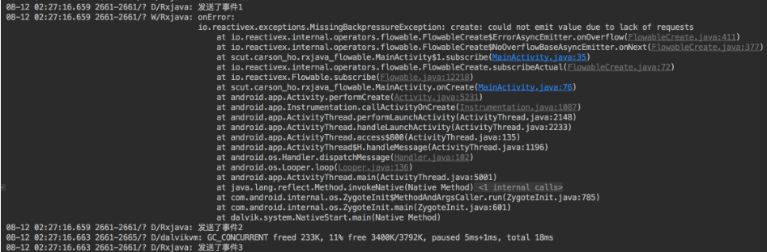

> 注意：
> 
> 1. 发射数据项就是指发射 `onNext` 事件。
> 
> 2. 观察者接收数据项、观察者响应数据项、观察者拉取数据项是一个意思。

## 6. 出现背压的原因：上下游的数据流速不匹配

> 参考 [Carson带你学Android：图文详解RxJava背压策略](https://carsonho.blog.csdn.net/article/details/79081407)

当上下游在不同线程中时，如果上游发射数据项的速度快于下游响应数据项的速度，那么对于来不及响应的数据项就会造成积压，这些积压的数据项既不会丢失，也不会被垃圾回收机制回收，而是存放在一个异步缓存池中，如果缓存池中的数据项一直得不到处理，越积越多，最后就会造成内存溢出，这便是响应式编程中的背压（`backpressure`）问题。

简单地说，背压问题就是：被观察者发射数据项的速度太快，使得观察者无法及时响应所有发射过来数据项，最终导致缓存区的内存溢出。

更简单地说，背压问题就是：上游的数据流速与下游的数据流速不匹配，导致缓存区的内存溢出。（上游数据流速 > 下游数据流程）

注意：

1. “上游” 指的是发射数据项的被观察者，“下游” 指的是响应数据项的观察者。

2. 背压问题主要出现在异步操作中（即发射数据项与响应数据项在不同的线程中），但同步操作中也有可能出现背压问题。


## 7. 背压策略 & `Flowable`

背压策略就是用来解决：被观察者发射数据项的速度太快，使得观察者无法及时响应所有发射过来的数据项而产生的问题的。

背压策略从以下两个方面给出了不同的解决方案：

1. 避免出现发射数据项的速度与响应数据项的速度不匹配的情况的解决方案：

    1. 控制观察者响应数据项的速度

    2. 控制被观察者发射数据项的速度

2. 当出现出现发射数据项的速度与响应数据项的速度不匹配的情况时的解决方案：

    1. 通过采用不同的背压策略模式（`BackpressureStrategy`）对超出缓存区的数据项进行丢弃、保留、报错等处理

`Flowable` 是 `RxJava 2.0` 中新增的被观察者。`Flowable` 是背压策略的具体实现，即采用 `Flowable` 可解决背压相关的问题。

### 7.1 被观察者 `Flowable` 的特点

#### 7.1.1 对应的观察者为 `Subscriber`

#### 7.1.2 所有的操作符强制支持背压

#### 7.1.3 缓存区存放策略（先进先出）

异步操作中，被观察者 `Flowable` 发射的数据项总是先保存在缓存区中，观察者 `Subscriber` 接收的数据项总是从缓存区中取出。（且先发射的先取出）

#### 7.1.4 缓存区的默认大小 `bufferSize = 128`

```java:no-line-numbers
/* Flowable.java */
public abstract class Flowable<T> implements Publisher<T> {

    /** The default buffer size. */
    static final int BUFFER_SIZE;

    static {
        BUFFER_SIZE = Math.max(1, Integer.getInteger("rx2.buffer-size", 128));
    }

    public static int bufferSize() {
        return BUFFER_SIZE;
    }

    ...
}
```

#### 7.1.5 同步操作中不存在缓存区

### 7.2 背压策略 —— 控制观察者响应数据项的速度（响应式拉取）

#### 7.2.1 原理：观察者按需接收（拉取）指定个数的数据项

```:no-line-numbers
异步操作中，观察者按需接收数据项，且：
1. 被观察者发射的数据项都先保存到缓存区中；
2. 观察者按需从缓存区中接收指定个数的数据项

同步操作中，观察者按需接收数据项，且：
1. 被观察者每发射一个数据项，必须等到观察者响应这个数据项之后，才能继续发射下一个数据项。
```

> 响应式拉取指的就是：观察者按需接收指定个数的数据项。

#### 7.2.2 实现方式：`Subscription.request(n)`

```:no-line-numbers
不管是同步操作，还是异步操作，我们只需要指定观察者需要接收的数据项个数即可，其它的 Flowable 内部已实现。
在观察者 Subscriber 的回调方法 onSubscribe(Subscription) 中，通过调用参数 Subscription 的 request(n) 方法，
即可指定观察者所需接收的数据项个数 n。
```

```java:no-line-numbers
/* Subscription.java */
/*
    该方法的作用为：指定观察者能够接收多少个数据项。
    如：调用 subscription.request(3) 表示观察者能够接收从缓存区中取出的 3 个数据项。
    注意：
        1. 观察者能够接收多少个数据项，就从缓存区取出多少个数据项，
           未取出的数据项仍然保留在缓存区中等待下次观察者再调用 request(n) 方法接着取。
        2. 官方默认推荐使用 Long.MAX_VALUE，即 subscription.request(Long.MAX_VALUE);
           也就是说，推荐尽可能地将缓存区中的数据项全部取出，以避免缓存区溢出。
*/
public void request(long n);
```

#### 7.2.3 示例 1：异步操作中的响应式拉取

```java:no-line-numbers
// 1. 创建被观察者 Flowable
Flowable.create(new FlowableOnSubscribe<Integer>() {

    @Override
    public void subscribe(FlowableEmitter<Integer> emitter) throws Exception {
        // 一共发送 4 个事件

        Log.d(TAG, "发送事件 1");
        emitter.onNext(1);

        Log.d(TAG, "发送事件 2");
        emitter.onNext(2);

        Log.d(TAG, "发送事件 3");
        emitter.onNext(3);

        Log.d(TAG, "发送事件 4");
        emitter.onNext(4);

        Log.d(TAG, "发送完成");
        emitter.onComplete();
    }

}, BackpressureStrategy.ERROR)
        .subscribeOn(Schedulers.io()) // 先设置发射、响应数据项的过程都在 IOScheduler 调度器维护的子线程中执行
        .observeOn(AndroidSchedulers.mainThread()) // 再单独设置响应数据项的过程在主线程中执行
        .subscribe(new Subscriber<Integer>() {

            @Override
            public void onSubscribe(Subscription s) {
                /*
                    Subscription 参数具备 Disposable 参数的作用，即：
                        1. Disposable 中调用 dispose() 切断连接
                        2. Subscription 中调用 cancel() 切断连接

                    此外，Subscription 增加了 request(long n) 方法。
                */
                s.request(3); // 观察者能够接收从缓存区中取出的 3 个数据项。
            }

            @Override
            public void onNext(Integer integer) {
                Log.d(TAG, "接收到了事件" + integer);
            }

            @Override
            public void onError(Throwable t) {
                Log.w(TAG, "onError: ", t);
            }

            @Override
            public void onComplete() {
                Log.d(TAG, "onComplete");
            }
        });
```

打印日志：


> 从打印日志可以看出，异步操作中：
> 
> 1. 发射数据项与响应数据项的过程在不同的线程中执行（发射数据项的线程 `id` 为 `2121`，响应数据项的线程 `id` 为 `2105`）；
> 
> 2. 在发射下一个数据项之前，不需要考虑观察者有没有接收到上一个数据项。（因为发射的数据项总是先保存在缓存区中）

#### 7.2.4 示例 2：同步操作中的响应式拉取

```java:no-line-numbers
/**
 * 步骤 1：创建被观察者 Flowable
 */
Flowable<Integer> upstream = Flowable.create(new FlowableOnSubscribe<Integer>() {

    @Override
    public void subscribe(FlowableEmitter<Integer> emitter) throws Exception {
        // 发送 3 个事件
        Log.d(TAG, "发送了事件1");
        emitter.onNext(1);

        Log.d(TAG, "发送了事件2");
        emitter.onNext(2);

        Log.d(TAG, "发送了事件3");
        emitter.onNext(3);

        emitter.onComplete();
    }

}, BackpressureStrategy.ERROR);

/**
 * 步骤 2：创建观察者 Subscriber
 */
Subscriber<Integer> downstream = new Subscriber<Integer>() {

    @Override
    public void onSubscribe(Subscription s) {
        Log.d(TAG, "onSubscribe");
         s.request(3); // 观察者目前只能接收 3 个数据项。
    }

    @Override
    public void onNext(Integer integer) {
        Log.d(TAG, "接收到了事件 " + integer);
    }

    @Override
    public void onError(Throwable t) {
        Log.w(TAG, "onError: ", t);
    }

    @Override
    public void onComplete() {
        Log.d(TAG, "onComplete");
    }
};

/**
 * 步骤3：建立订阅关系
 */
upstream.subscribe(downstream);
```

打印日志：


> 从打印日志可以看出，同步操作中：
> 
> 1. 发射数据项与响应数据项的过程都在 `id` 为 `5752` 的线程中执行。
> 
> 2. 被观察者每发射一个数据项，必须等到观察者响应这个数据项之后，才能继续发射下一个数据项。（因为同步操作中不存在缓存区，发射的数据项无法保存在缓存区中）

#### 7.2.5 异步操作中响应式拉取时的注意事项

##### 7.2.5.1 即使观察者不拉取数据项，被观察者发射的数据项总会存入缓存区

在异步操作中，如果观察者没有通过回调方法 `onSubscribe(Subscription)` 中参数 `Subscription` 的 `request(n)` 方法设置可接收的数据项个数，那么表示观察者不会接收数据项。

此时，被观察者仍然能够继续发射数据项，并保存进缓存区中。

直到观察者什么时候需要接收数据项了，再调用参数 `Subscription` 的 `request(n)` 方法从缓存区中拉取数据项。

> 先保存进缓存区（即先发射）的数据项先被拉取，数据项从缓存区拉取出来后就从缓存区中移除了。

示例：

```java:no-line-numbers

private static final String TAG = "Rxjava";

private Subscription mSubscription;
    
/**
 * 点击按钮时，观察者才开始调用 Subscription.request(n) 方法去拉取缓存区中的数据项
 */
btn = (Button) findViewById(R.id.btn);
findViewById(R.id.btn).setOnClickListener(new View.OnClickListener() {
    @Override
    public void onClick(View view) {
        mSubscription.request(2); // 每点击一次按钮，观察者从缓存区中拉取 2 个数据项
    }
});

/**
 * 异步操作
 */
Flowable.create(new FlowableOnSubscribe<Integer>() {

    @Override
    public void subscribe(FlowableEmitter<Integer> emitter) throws Exception {
    
        Log.d(TAG, "发送事件 1");
        emitter.onNext(1);

        Log.d(TAG, "发送事件 2");
        emitter.onNext(2);

        Log.d(TAG, "发送事件 3");
        emitter.onNext(3);

        Log.d(TAG, "发送事件 4");
        emitter.onNext(4);

        Log.d(TAG, "发送完成");
        emitter.onComplete();
    }

}, BackpressureStrategy.ERROR)
        .subscribeOn(Schedulers.io()) // 先设置发射、响应数据项的过程都在 IOScheduler 调度器维护的子线程中执行
        .observeOn(AndroidSchedulers.mainThread()) // 再单独设置响应数据项的过程在主线程中执行
        .subscribe(new Subscriber<Integer>() {

            @Override
            public void onSubscribe(Subscription s) {
                Log.d(TAG, "onSubscribe");
                // 将参数 Subscription 赋值成员变量 mSubscription，以便在点击按钮时再拉取数据项
                mSubscription = s; 
            }

            @Override
            public void onNext(Integer integer) {
                Log.d(TAG, "接收到了事件" + integer);
            }

            @Override
            public void onError(Throwable t) {
                Log.w(TAG, "onError: ", t);
            }

            @Override
            public void onComplete() {
                Log.d(TAG, "onComplete");
            }
        });
```

打印日志：


##### 7.2.5.2 若一直不拉取数据项，则发射的数据项最终会使缓存区溢出报错

如果观察者一直不调用 `Subscription.request(n)` 方法从缓存区拉取数据项，那么由于缓存区大小默认只能存入 `128` 个数据项，于是当被观察者发射第 `129` 个数据项时，导致缓存区溢出报错。

> 缓存区溢出时是否报错是由 [背压策略模式（BackpressureStrategy）](#_7-4-背压策略-——-采用不同的背压策略模式-backpressurestrategy) 决定的，比如：
> 
> 1. 当设置了 `BackpressureStrategy.ERROR` 时，缓存区溢出时会报错；
> 
> 2. 当设置了 `BackpressureStrategy.BUFFER` 时，缓存区溢出时会扩容，保证能存放下所有发射的数据项。（但大量数据项的积压最终会导致 `OOM`）

示例：

```java:no-line-numbers
Flowable.create(new FlowableOnSubscribe<Integer>() {

    @Override
    public void subscribe(FlowableEmitter<Integer> emitter) throws Exception {
        /*
            被观察者一共发射 129 个数据项。（超出了缓存区的默认大小 128）
        */
        for (int i = 0; i< 129; i++) {
            Log.d(TAG, "发送了事件" + i);
            emitter.onNext(i);
        }

        emitter.onComplete();
    }

}, BackpressureStrategy.ERROR) // 设置背压策略模式为 ERROR，即：当缓存区溢出时报错
        .subscribeOn(Schedulers.io()) // 先设置发射、响应数据项的过程都在 IOScheduler 调度器维护的子线程中执行
        .observeOn(AndroidSchedulers.mainThread()) // 再单独设置响应数据项的过程在主线程中执行
        .subscribe(new Subscriber<Integer>() {

            @Override
            public void onSubscribe(Subscription s) {
                Log.d(TAG, "onSubscribe");
                /* 观察者一直不调用 s.request(n) 方法从缓存区拉取数据项 */
            }

            @Override
            public void onNext(Integer integer) {
                Log.d(TAG, "接收到了事件" + integer);
            }

            @Override
            public void onError(Throwable t) {
                Log.w(TAG, "onError: ", t);
            }

            @Override
            public void onComplete() {
                Log.d(TAG, "onComplete");
            }
        });
```

打印日志：


#### 7.2.6 同步操作中响应式拉取时的注意事项

##### 7.2.6.1 发射的数据项个数 > 拉取的数据项个数会出现背压问题

由于同步操作中被观察者每发射一个数据项，必须等到观察者响应这个数据项之后，才能继续发射下一个数据项，所以同步操作中，不会出现发射数据项的速度 > 接收数据项的速度的情况。

但是同步操作中，却可能会出现发射的数据项个数 > 拉取的数据项个数的情况。同数据项流速不匹配一样，数据项个数不匹配同样会出现背压问题，即通过发射 `onError` 事件触发 `MissingBackpressureException` 异常。

##### 7.2.6.2 发射了数据项但不拉取也会出现背压问题

由于同步操作中不存在缓存区，所以被观察者发射的数据项需要直接传递给观察者，但如果观察者没有设置 `Subscription.request(n)`，那么被观察者就会认为观察者没有接收并处理事件的能力。

于是，被观察者就会在发射一个数据项未被接收之后，通过发射 onError 事件触发 `MissingBackpressureException` 异常，来提醒观察者接收事件。

示例：

```java:no-line-numbers
/**
 * 创建被观察者 Flowable
 */
Flowable<Integer> upstream = Flowable.create(new FlowableOnSubscribe<Integer>() {

    @Override
    public void subscribe(FlowableEmitter<Integer> emitter) throws Exception {

        Log.d(TAG, "发送了事件1");
        emitter.onNext(1);

        Log.d(TAG, "发送了事件2");
        emitter.onNext(2);

        Log.d(TAG, "发送了事件3");
        emitter.onNext(3);

        emitter.onComplete();
    }

}, BackpressureStrategy.ERROR);

/**
 * 创建观察者 Subscriber
 */
Subscriber<Integer> downstream = new Subscriber<Integer>() {

    @Override
    public void onSubscribe(Subscription s) {
        Log.d(TAG, "onSubscribe");
        /* 不调用 s.request(n)，即：观察者不接收数据项 */
    }

    @Override
    public void onNext(Integer integer) {
        Log.d(TAG, "onNext: " + integer);
    }

    @Override
    public void onError(Throwable t) {
        Log.w(TAG, "onError: ", t);
    }

    @Override
    public void onComplete() {
        Log.d(TAG, "onComplete");
    }
};

/**
 * 建立订阅关系
 */
upstream.subscribe(downstream);
```

打印日志：



> 从打印日志可以看出：在发射了 onError 事件触发 `MissingBackpressureException` 异常后，还会接着将剩余的数据项发射完。

### 7.3 背压策略 —— 控制被观察者发射数据项的速度（反馈控制）

### 7.4 背压策略 —— 采用不同的背压策略模式（`BackpressureStrategy`）