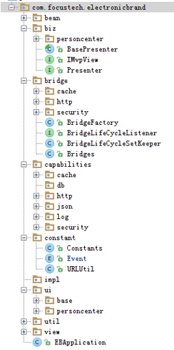
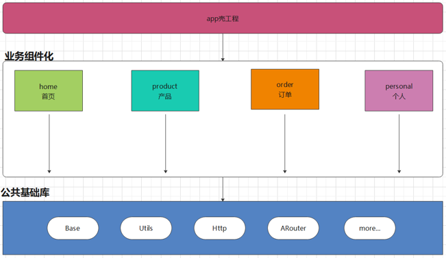

## 1. 早期的单一分层模式

所有的代码都写在 `app` 模块中不同的包里面：

随着项目的迭代更新，会出现如下问题：

1. 问题一：无论分包怎么做，随着项目增大，项目失去层次感，后面接手的人难以维护

2. 问题二：包名约束太弱，稍有不注意，就会不同业务包直接互相调用，代码高耦合

3. 问题三：多人开发在版本管理中，容易出现代码覆盖冲突等问题

简单地说，单一分层模式存在低内聚、高耦合 、无重用、层次混乱的问题。

## 2. 组件化

组件化的意义：不相互依赖，可以相互交互，任意组合，高度解耦，自由拆卸，自由组装，重复利用，分层独立化

组件化后，`app` 模块不在是老大，子模块也都不在是小弟。

即：组件化后，所有的 `module` 都平起平坐。有人说 `app` 的 `module` 在组件化中是个壳子，这也是为什么成为 `app` 壳工程的原因。

### 2.1 组件化的开发规范

1. 我们在项目的开发过程中，一定要去优化我们的 `gradle` 文件，例如：把公用的内容抽取

2. 我们在项目的开发过程中，关于一切与 “正式环境”，“测试环境” 相关的内容，应该用 `gradle` 进行配置

