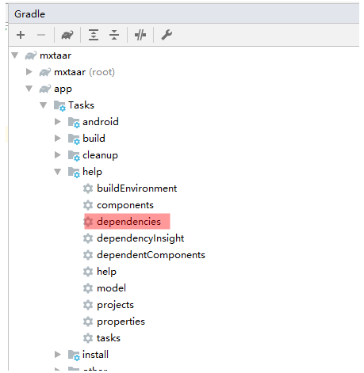

## 1. 迁移步骤

### 1.1 `Step1`：将支持库（`Support Library`）更新到 `28.0.0` 版本

`28.0.0` 版本的支持库与 `1.0` 版本的 `AndroidX` 除了类的包名外，其他基本都一样。所以迁移时最好先将支持库的版本更新到 `28.0.0`，然后再迁移到 `AndroidX` `1.0` 版本。

### 1.2 `Step2`：使能 `Jetifier`

`Jetifier` 的作用就是改变依赖的第三方字节码文件，使这些字节码能够兼容 `AndroidX`。

但是，`Jetifier` 不能让源代码和自动生成的代码（如通过 `APT` 技术生成的代码）兼容 `AndroidX`。

在 `gradle.properties` 文件中添加如下配置即可开启 `Jetifier`：

```:no-line-numbers
android.useAndroidX=true
android.enableJetifier=true
```

> 经过如上配置后，就会自动导入 `AndroidX` 的依赖库，而不是 `Support Library` 依赖库。

### 1.3 `Step3`：将依赖的第三方开源项目迁移至 `AndroidX`

在将我们自己写的源代码迁移到 `AndroidX` 之前，应该先将依赖的一些第三方开源项目（如：`ButterKnife`、`Glide` 等）更新到 `AndroidX` 版本。否则就会在编译时出现各种难以解释的兼容问题。

> 注意：步骤 `1.2` 中使能的 `Jetifier` 是无法让将项目中依赖的第三方开源项目的库文件（如 `jar`、`aar` 文件）兼容 `AndroidX` 的。

#### 1.3.1 跳过 `Step2`、`Step3` 可能导致的问题

编译失败时可能会打印如下日志：

> 即依赖的一些第三方代码中还在使用支持库提供的 `API`。

```:no-line-numbers
...
Error : Program type already present: android.support.v4.appINotificationSideChannel$Stub$Proxy |
Reason: Program type already present: android.support.v4.appINotificationSideChannel$Stub$Proxy
...
```

编译失败时也可能会打印如下日志：

> 即项目中 `AndroidX` 库和支持库同时存在时，它们中同名的类会出现有两个不同的包名的情况。（一个包名来自 `AndroidX`，一个包名来自支持库）

```:no-line-numbers
...
Duplicate class android.support.v4.app.INotificationSideChannel found in modules classes.jar (androidx.core:core:1.0.0) 
    and classes.jar (com.android.support:support-compat:28.0.0)
...
```

### 1.4 `Step4`：将项目源代码迁移至 `AndroidX`

有三种方式将我们自己编写的源代码 迁移到 `Androix`

#### 1.4.1 方式 `1`：通过 `Android Studio` 提供的菜单项实现自动迁移

在 `Android Studio 3.2` 以上的版本中，可以通过在菜单栏中点击 `Refactor` -> `Migrate to AndroidX...`，让 `Android Studio` 自动将项目中的源代码迁移到 `AndroidX`。

> 推荐使用该方式，因为 `Android Studio` 能检测出迁移时存在的部分问题。

当项目中存在多模块时，自动迁移时建议一个一个模块的进行，即：

1. 迁移前先修改 `settings.gralde` 文件，只保留一个准备迁移的 `Module`，注释掉其他还未迁移的 `Module`，保证 `Module` 逐个地迁移到 `Androidx`；

2. `AS` 中执行 `Refactor` -> `Migrate AndroidX ...` 时，将当前处理的 `Module` 之外的其他 `Module` 的处理项右键 `Exclude` 排除掉，再执行 `Do Refactor`

#### 1.4.2 方式 `2`：编写脚本，在脚本中写入迁移的脚本代码

如果你构建了一个架构复杂的 `App`，导致通过 `AS` 的设置项无法将代码全部迁移到 `Androidx`，那么可以下载支持库和 `Androidx` 类文件的对照关系表文件 [androidx-class-mapping.csv](https://developer.android.com/static/topic/libraries/support-library/downloads/androidx-class-mapping.csv)，通过编写脚本的方式，将支持库的类替换为对应的 `Androidx` 的类。

> 脚本文件中主要通过 `grep` 命令和 `sed` 命令实现支持库类和 `Androidx` 类之间的替换。

#### 1.4.3 方式 `3`：手动迁移到 `AndroidX`

由于通过脚本迁移只是是暴力地将支持库类替换为 `Androidx` 类，所以这种替换方式可能是不正确的。此时，应该考虑通过手动地方式迁移。

当通过手动迁移时，需要下载支持库的依赖和 `Androidx` 的依赖的对照关系表文件 [androidx-artifact-mapping.csv](https://developer.android.com/static/topic/libraries/support-library/downloads/androidx-artifact-mapping.csv)。通过依赖对照表，将 `Module` 下的 `build.gradle` 中的支持库依赖手动替换为 `Androidx` 依赖。再通过类对照表 [androidx-class-mapping.csv](https://developer.android.com/static/topic/libraries/support-library/downloads/androidx-class-mapping.csv)，将源码文件中支持库类替换为 `Androidx` 类。

## 2. 迁移时必须手动修改的地方

### 2.1 通过扩展属性配置的支持库的版本需要手动修改

如果 `build.gradle` 中通过如下方式配置依赖版本：

```groovy:no-line-numbers
ext.versions = [
    'drawer' : '28.0.0',
    'rview' : '28.0.0'
]

implementation "com.android.support:drawerlayout:${versions.drawer}"
implementation "com.android.support:recyclerview-v7:${versions.rview}"
```

那么通过 `AS` 的设置项自动迁移后，得到的是：

```groovy:no-line-numbers
ext.versions = [
    'drawer' : '28.0.0',
    'rview' : '28.0.0'
]

implementation "androidx.drawerlayout:drawerlayout:1.0.0"
implementation "androidx.recyclerview:recyclerview:1.0.0"
```

此时，应该手动改为：

```groovy:no-line-numbers
ext.versions = [
    'drawer' : '1.0.0',
    'rview' : '1.0.0'
]

implementation "androidx.drawerlayout:drawerlayout:${versions.drawer}"
implementation "androidx.recyclerview:recyclerview:${versions.rview}"
```

### 2.2 混淆文件和相关的构建脚本文件需要手动修改

通过 `AS` 的设置项自动迁移时，不会修改混淆文件和相关的构建脚本文件。此时，应该手动修改这些文件。

### 2.3 通过 `AS` 自动迁移时默认依赖 `AndroidX` 的最新版本

通过 `AS` 的设置项自动迁移时，自动依赖的 `Androidx` 库是最新版本的。如果需要使用低版本的，则需要在自动依赖之后手动修改版本。

## 3. 参考资料

### 3.1 支持库中的类和 `AndroidX` 中的类的对照关系表

官网地址：`https://developer.android.com/jetpack/androidx/migrate/class-mappings`

官网地址中提供了一个 [androidx-class-mapping.csv](https://developer.android.com/static/topic/libraries/support-library/downloads/androidx-class-mapping.csv) 文件，该文件中给出了二者中类的对照关系表。

### 3.2 支持库的依赖和 `AndroidX` 的依赖的对照关系表

即添加依赖库时用到的 `GroupId` 和 `ArtifactId` 的对照表

官网地址：`https://developer.android.com/jetpack/androidx/migrate/artifact-mappings`

官网地址中提供了一个 [androidx-artifact-mapping.csv](https://developer.android.com/static/topic/libraries/support-library/downloads/androidx-artifact-mapping.csv) 文件，该文件中给出了二者的依赖的对照关系表。

## 4. `Gradle` 查看依赖关系图

### 4.1 方式 `1`：通过命令查看（在项目根目录下执行）

通过命令查看（在项目根目录下执行）：

```:no-line-numbers
//会列出 app 模块中所有的直接依赖和间接依赖
gradlew -q :app:dependencies

// 将输出的依赖关系保存在文件中查看
gradlew -q :app:dependencies > log.txt

// 仅查看 app 的直接依赖
gradlew -q :app:dependencies --configuration implementation
```


注意：

1. 命令 `gradlew -q :app:dependencies` 的结果中会包含命令 `gradlew -q :app:dependencies --configuration implementation` 的结果
        
2. 从 `gradlew -q :app:dependencies` 的结果中可以发现，像 `implementation` 这样的还有：

    ```:no-line-numbers
    debugComplileClasspath 
    debugRuntimeClasspath
    releaseCompileClasspath
    releaseRuntimeClasspath
    ```

    不同的参数，打印的依赖结构是不同的。但是从这四个参数的结果，基本就包含了我们想要知道的依赖关系图，如执行：

    ```:no-line-numbers
    gradlew -q :app:dependencies --configuration debugComplileClasspath
    gradlew -q :app:dependencies --configuration debugRuntimeClasspath
    gradlew -q :app:dependencies --configuration releaseCompileClasspath
    gradlew -q :app:dependencies --configuration releaseRuntimeClasspath（建议使用这个）
    ```

### 4.2 方式 `2`：在 `AS` 中查看依赖结构图

在 `AS` 中查看依赖结构图（相当于执行 `gradlew -q :app:dependencies`）



## 5. 使用 `jetifier` 将 `RN` 迁移到 `androidx`

如果在 `package.json` 中依赖的 `react-native` 模块的版本是 `0.59.8`，那么而这个版本中使用了支持库。

需要将 `react-native` 的版本修改为 `0.60` 以上版本，才支持 `AndroidX`。

> 参考：`https://reactnative.dev/blog/2019/07/03/version-60`
> 
> 参考：`https://github.com/react-native-community/discussions-and-proposals/issues/129`

如果不想修改 `RN` 的版本，那么可以通过 `jetifier` 让 `RN` 兼容 `AndroidX`。步骤如下：

1. `step1`：根目录下的 `gradle.properties` 文件中配置：

    ```:no-line-numbers
    android.useAndroidX=true
    android.enableJetifier=true
    ```

2. `step2`：使用 `AS` 的 `Refactor` -> `Migrate to Androidx..` 完成源码迁移

3. `step3`：执行如下步骤使用 `jetifier` 将 `rn` 迁移到 `androidx`：

    ```:no-line-numbers
    npm install --save-dev jetifier

    npx jetify

    npx react-native run-android

    在pack.json文件中配置：

        "scripts":{
          ...
          "postinstall":"jetify"
        }
    ```

相关参考：

```:no-line-numbers
https://reactnative.dev/docs/integration-with-existing-apps 
https://github.com/mikehardy/jetifier
https://dev.to/chakrihacker/migrating-react-native-app-to-androidx-1o5i
https://blog.csdn.net/danpincheng0204/article/details/106778757
```

        

        

        

        

        
        
        
        
