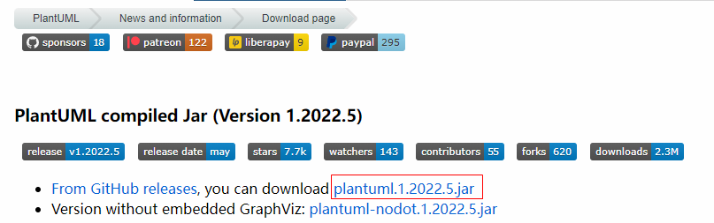
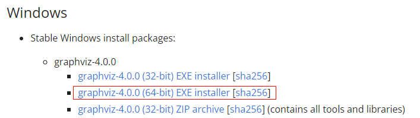
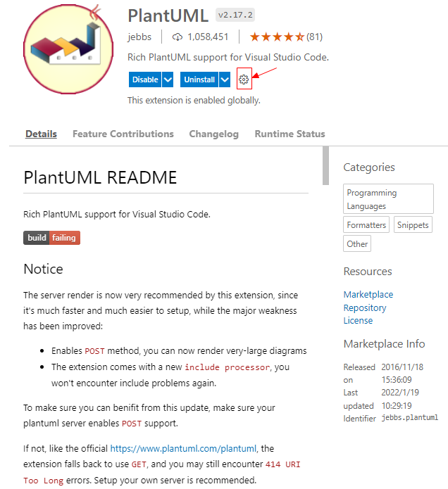
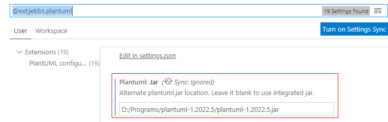
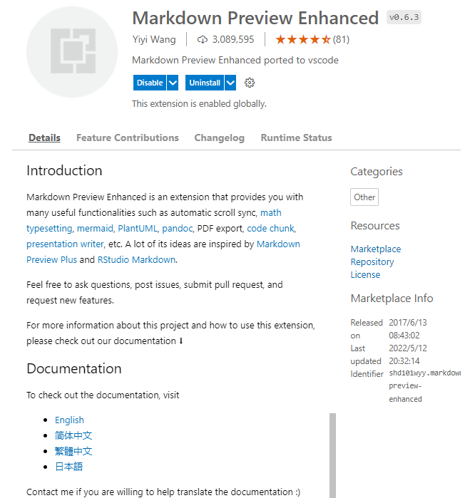
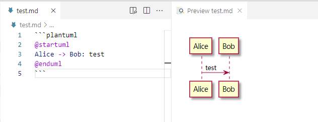
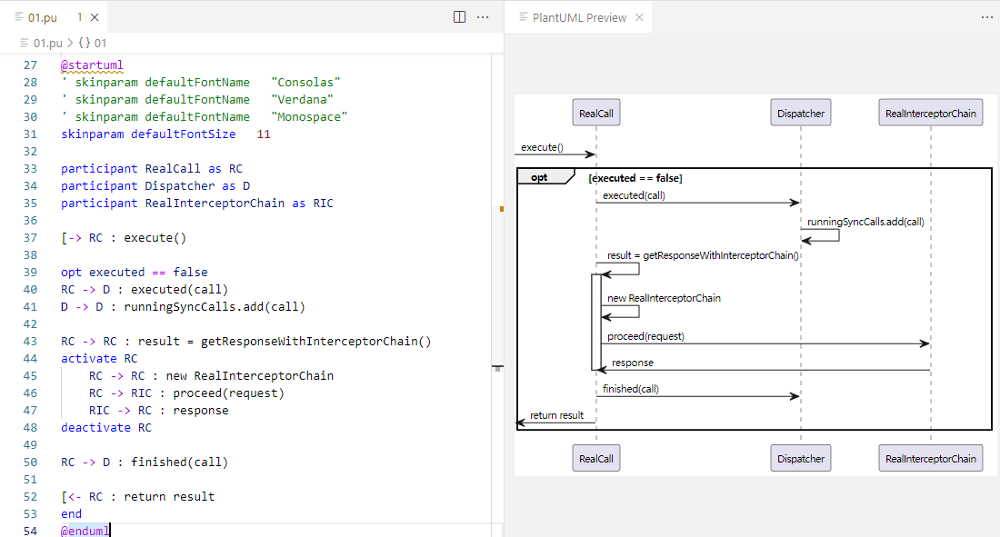
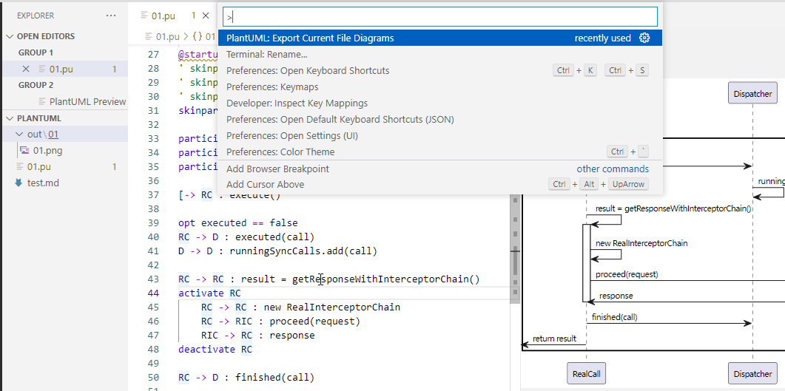

> 参考：[`PlantUML` 的 `GitHub` 地址](https://github.com/plantuml/plantuml)
> 
> 参考：[`PlantUML` 官网](https://plantuml.com/zh/)

## 1. 下载安装

### 1.1 下载 `plantuml.jar`

下载地址：`https://plantuml.com/zh/download`

选择 `plantuml.1.2022.5.jar`。



> 下载后会在安装 `VS Code` 插件时用到。

### 1.2 下载 `Graphviz`

> `PlantUML` 的图形预览依赖于 `Graphviz` 软件。

下载地址：`https://www.graphviz.org/download/`



下载后得到 `windows_10_cmake_Release_graphviz-install-4.0.0-win64.exe` 文件，双击该文件进入安装向导。在向导中选择添加到系统环境变量，于是 `D:\Programs\Graphviz\bin` 路径就会添加到系统环境变量中。

### 1.3 安装 `VS Code` 插件：`PlantUML`



插件安装完成后，点击上图所示的设置图标，进入 `Extension Settings`，配置之前下载的 `plantuml.jar`



### 1.4 安装 `VS Code` 插件：`Markdown Preview Enhanced`

插件 `Markdown Preview Enhanced` 的作用就是可以在 `Markdown` 中使用 `PlantUML`，并提供预览功能。



示例：



> 注意：在 `vuepress-theme-hope` 中的 `Markdown Enhanced` 插件并不支持在 `Markdown` 中使用 `PlantUML`。

## 2. 使用教程

### 2.1 插件 PlantUML 支持的文件后缀

`VS Code` 插件 `PlantUML` 支持在如下后缀的文件中使用 `PlantUML` 语法生成 `UML` 图。

```:no-line-numbers
*.wsd, *.pu, *.puml, *.plantuml, *.iuml
```

### 2.2 在 `VS Code` 中预览 `PlantUML` 生成的 `UML` 图

在 `01.pu` 文件中通过快捷键 "`Alt + D`" 即可打开右侧的 `PlantUML Preview` 预览视图。如下图所示：



### 2.3 在 `VS Code` 中将 `PlantUML` 文件导出为 `PNG` 图片

在 `01.pu` 文件中通过快捷键 "`Ctrl + Shift + P`" 查找并选中 "`PlantUML: Export Current File Diagrams`" 即可在当前目录下的 `out` 文件夹中生成对应的 `UML` 图。



### 2.4 配置主题

> 参考：`https://plantuml.com/zh/theme`

```:no-line-numbers
@startuml
!theme [themeName]
@enduml
```

在编写 `PlantUML` 代码时，通过语法：`!theme [themeName]` 可指定使用已存在的主题。

> 如使用主题 `spacelab`，即：`!theme spacelab`

> 可使用的主题的预览地址：`https://bschwarz.github.io/puml-themes/gallery.html`
> 
> 对应的源码地址为：`https://github.com/plantuml/plantuml/tree/master/themes`

### 2.5 配置字体样式 & 字体大小

> 参考： 《`PlantUML_Language_Reference_Guide_zh`》 中的 `Skinparam 命令` 章节。
> 
> 参考 [主题源码](https://github.com/plantuml/plantuml/tree/master/themes) 中的 `Skinparam` 命令的使用>

示例：配置字体样式和字体大小

```:no-line-numbers
@startuml
skinparam defaultFontName   "Consolas"
skinparam defaultFontSize   11
@enduml
```

> 通过 `Skinparam` 命令还可以进行很多其它的配置。