> 参考： [《`PlantUML_Language_Reference_Guide_zh`》](https://plantuml.com/zh/guide) 中的 `时序图` 章节。

## 1. 开始 & 结束：`@startuml` & `@enduml`

一段表示一张 `UML` 图的 `PlantUML` 代码已 `@startuml` 开始，已 `@enduml` 结束

```:no-line-numbers
@startuml
...
@enduml
```

## 2. 显示地声明参与者对象

注意：也可以不显示地声明参与者对象，箭头的两端默认就是参与者对象的名称

### 2.1 使用关键字 `participant` 声明参与者对象

### 2.2 使用其它关键字声明不同图标表示的参与者对象

#### 2.2.1 `actor`（角色）

#### 2.2.2 `boundary`（边界）

#### 2.2.3 `control`（控制）

#### 2.2.4 `entity`（实体）

#### 2.2.5 `database`（数据库）

#### 2.2.6 `collections`（集合）

#### 2.2.7 `queue`（队列）

### 2.3 在声明参与者对象时起别名：`participant` <原名> `as` <别名>

### 2.4 示例：声明不同图标的参与者对象 & 起别名

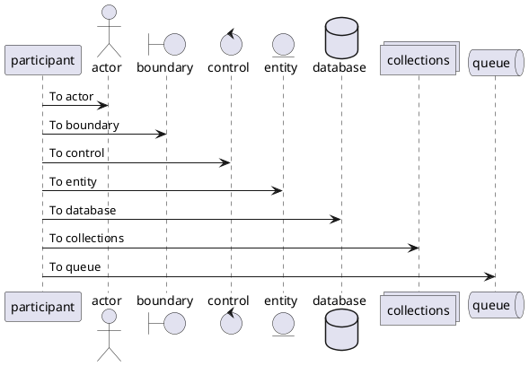

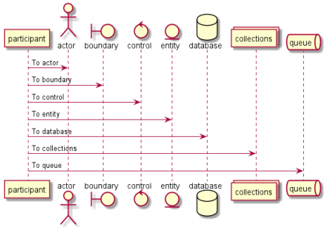

### 2.5 为参与者对象的背景框设置颜色 & 对参与者对象的名字分行显示

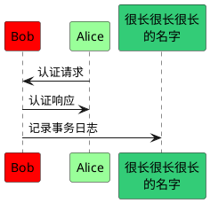

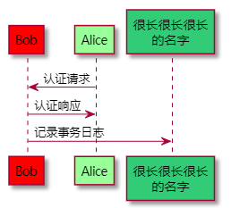

### 2.6 使用关键字 `order` 设置参与者对象的显示顺序优先级

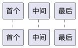

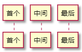

## 3. 使用箭头

### 3.1 设置箭头的样式

```plantuml
@startuml
' Bob -> Alice 与 Alice <- Bob 一样，即：箭头的指向可以反过来
' 后面的所有类型的箭头的指向都可以这样反过来
Bob -> Alice
Alice <- Bob

Bob ->> Alice
Bob ->x Alice
Bob -\ Alice

Bob \\- Alice
Bob //-- Alice

Bob ->o Alice
Bob o\\-- Alice

Bob <-> Alice
Bob <->o Alice
@enduml
```

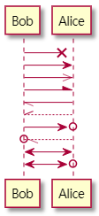

### 3.2 设置箭头的颜色

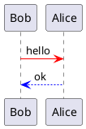

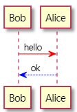

## 4. 给自己发消息：`A -> A`

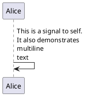

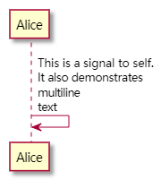

## 5. 让响应信息显示在箭头下面

可以使用 `skinparam responseMessageBelowArrow true` 命令，让响应信息显示在箭头下面：

> `skinparam` 命令的作用域是全局的，即 `skinparam responseMessageBelowArrow true` 命令会将所有的响应信息都显示在箭头下面

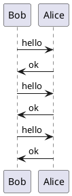

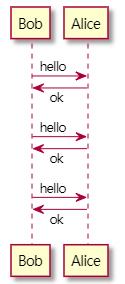

## 6. 为发送的消息设置序号

### 6.1 使用关键字 `autonumber` 自动设置序号（从 `1` 开始，递增 `1`）

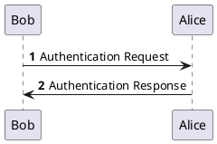

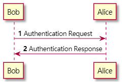

### 6.2 指定序号的初始值：`autonumber <start>`

### 6.3 指定序号的初始值和递增值：`autonumber <start> <increment>`

注意：`autonumber` 命令只对命令后面的消息起作用。

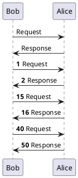

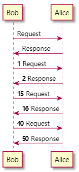

### 6.4 指定序号的格式

可以使用双引号字符串来指定序号的格式，其中可以使用 `HTML` 标签来设置格式样式。

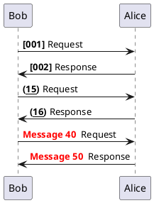

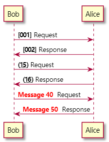

### 6.5 暂停设置序号 & 继续设置序号

可以使用 `autonumber stop` 暂停设置序号。

可以使用 `autonumber resume <increment> <format>` 继续设置序号

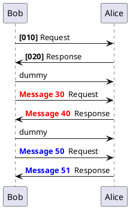

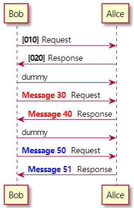

## 7. 对消息进行分组：`alt/else`、`opt`、`loop`、`par`、`break`、`critical`、`group`

`alt/else`、`opt`、`loop`、`par`、`break`、`critical`、`group` 这些不同类型的分组都是以关键字 `end` 结束的。

示例 `1`：多种类型的分组嵌套使用

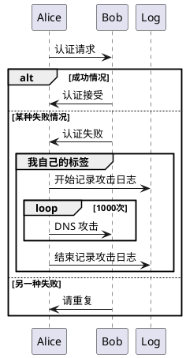

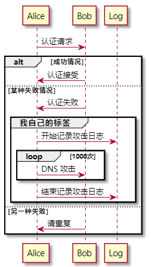

示例 `2`：在 `group` 分组中显示次级分组条件

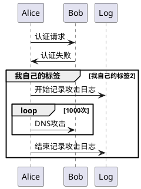

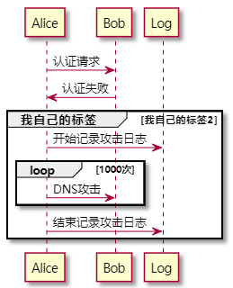

## 8. 在 `UML` 图中添加注释文本

### 8.1 设置注释文本的相对位置：`note left of`、`note right of`、`note over`

### 8.2 设置注释文件框的背景颜色

### 8.3 对注释文件进行换行：使用 `end note` 命令 或 `'\n'` 转义字符

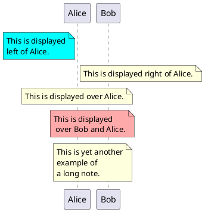

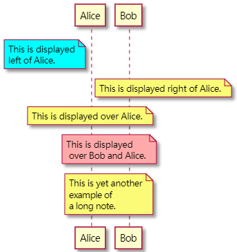

### 8.4 设置注释文本框的形状：`hnote` & `rnote`

`hnote` 表示六边形（`hexagonal`）的注释文本框。

`rnote` 代表正方形（`rectangle`）的注释文本框。

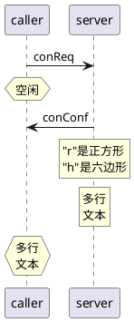

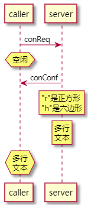

### 8.5 注释横跨多个参与者对象：`note over <first>,<last>` & `note across`

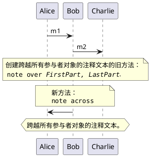

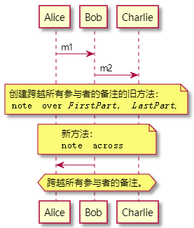

### 8.6 同一行的多个注释文本水平对齐：`/ note ...`

默认情况下，多个注释文本不是对齐的。而使用 "`/`" 开头的 `note` 命令可以与之前的同一行注释水平对齐 。

未对齐时：

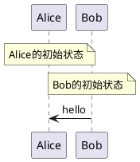

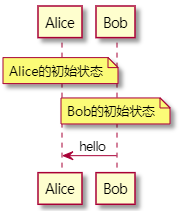

水平对齐时：

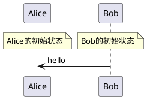

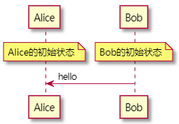

## 9. 使用分隔符 `==` 将 `UML` 图分隔成多个逻辑步骤

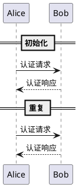

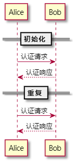

## 10. 使用 `...` 表示延迟 & 在延迟中添加注释

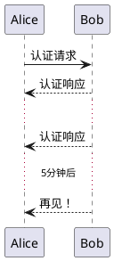

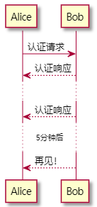

## 11. 消息文本换行：`'\n'` 或 `skinparam maxMessageSize <size>` 命令

你可以通过手动在文本中添加转义字符 `'\n'` 使长文本换行。

或者使用 `skinparam maxMessageSize <size>` 命令设置一行的宽度（此方式暂不支持中文换行）

```plantuml
@startuml
skinparam maxMessageSize 50
participant a
participant b
a -> b :这\n一条\n是\n手动换行
a -> b :this is a very long message on several words
@enduml
```

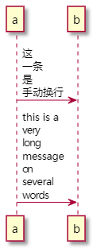

## 12. 使用 `|||` 增加消息与消息之间的垂直高度

注意：使用 `|||` 时可以指定增加的高度像素值。

```plantuml
@startuml
Alice -> Bob: message 1
Bob --> Alice: ok
|||
Alice -> Bob: message 2
Bob --> Alice: ok
||45||
Alice -> Bob: message 3
Bob --> Alice: ok
@enduml
```

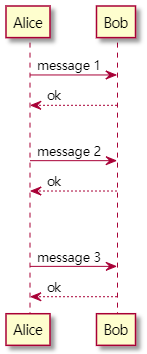

## 13. 设置参与者对象的生命周期

### 13.1 激活 & 取消 & 终结生命周期：`activate` & `deactivate` & `destroy`

激活参与者对象的生命周期：`activate <name>`

取消激活参与者对象的生命周期：`deactivate <name>`

终结参与者对象的生命周期：`destroy <name>`

```plantuml
@startuml
participant User

User -> A: DoWork
activate A
    A -> B: << createRequest >>
    activate B
        B -> C: DoWork
        activate C
            C --> B: WorkDone
        destroy C
        B --> A: RequestCreated
    deactivate B
    A -> User: Done
deactivate A
@enduml
```

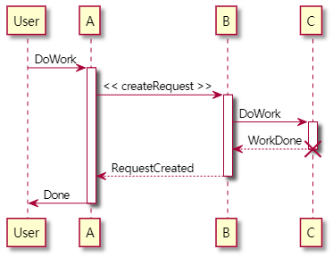

### 13.2  生命线框的嵌套 & 设置生命线框的颜色

```plantuml
@startuml
participant User

User -> A: DoWork
activate A #FFBBBB
    A -> A: Internal call
    activate A #DarkSalmon
        A -> B: << createRequest >>
        activate B
            B --> A: RequestCreated
        deactivate B
    deactivate A
    A -> User: Done
deactivate A
@enduml
```

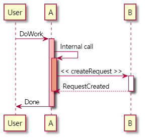

### 13.3 自动激活 & 取消上一次激活并返回消息：`autoactivate on` & `return`

执行 `autoactivate on` 命令后，每次发送消息时，都会激活接收消息的参与者对象的生命周期，且可以嵌套激活。

执行 `return` 命令时，取消上一次激活（即最近一次的激活）并返回消息。

> 如果取消激活时不需要返回消息，则使用 `deactivate` 命令，不要使用 `return`。

```plantuml
@startuml
participant User

autoactivate on 
User -> A #FFBBBB: DoWork
    A -> A #DarkSalmon: Internal call
        A -> B: << createRequest >>
        return RequestCreated
    ' 如果取消激活后不返回消息，则使用 deactivate，只有返回消息的情况下才使用 return
    deactivate A
return Done
@enduml
```

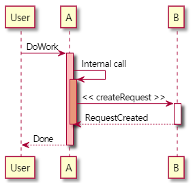

## 14. 发送消息时创建参与者对象

通过 `create <name>` 命令创建参与者对象。

在创建时可以声明不同图标的参与者对象，也可以在创建时起别名：`create [participant|actor|...] <name> as <别名>`

> 不指定参与者对象的图标类型时，默认使用 `participant` 类型。

`create` 命令会作用于下一条发送消息的语句，创建接收消息的参与者对象

```plantuml
@startuml
Bob -> Alice : hello

create Other
Alice -> Other : new

' 可以创建不同图标的参与者对象，也可以在创建时起别名
create database Users as U
Alice -> U

note right : You can also put notes!

Alice --> Bob : ok
@enduml
```

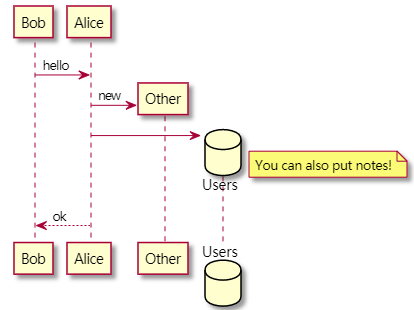

## 15. 激活/取消激活生命周期 & 创建参与者对象的快捷方式（使用操作符）

在发送消息的同时可以通过指定的操作符来声明激活/取消激活参与者对象的生命周期，以及声明创建参与者对象。

操作符如下：

1. 激活接收消息的参与者对象的生命周期：`++`

2. 取消激活 **发送消息的参与者对象** 的生命周期：`--`

3. 创建接收消息的参与者对象：`**`

4. 销毁接收消息的参与者对象：`!!`

示例：

```plantuml
@startuml
/'
    操作符 ++ 调用了三次，表示激活了三次生命周期（即 UML 图中存在三条生命周期线框），
    于是，应该调用三次操作符 --，或者调用三次 return 命令。
'/
alice -> bob ++ : hello
bob -> bob ++ : self call
bob -> bib ++ #005500 : hello
bob -> george ** : create
return done
return rc
bob -> george !! : delete
return success
@enduml
```

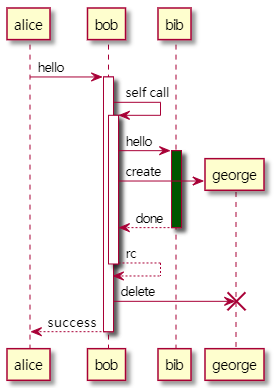

### 15.1 在一条发送消息的语句上同时进行激活和取消激活的操作

示例 `1`：

```plantuml
/'
    A -> B --++ : Message
    其中："--" 表示取消激活 A 的生命周期
          "++" 表示激活 B 的生命周期
'/
@startuml
alice -> bob ++ : hello1
bob -> charlie --++ : hello2
charlie --> alice -- : ok
@enduml
```

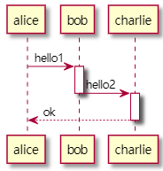

示例 `2`：

```plantuml
@startuml
/'
    在操作符之后可设置生命周期线框的背景颜色值
'/
alice -> bob --++ #gold: hello
bob -> alice --++ #gold: you too
alice -> bob --: step1
alice -> bob : step2
@enduml
```

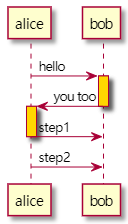

## 16. 不指定发送方的消息（输入消息） & 不指定接收方的消息（输出消息）

可以使用 "`[`" 代替非箭头端的发送方，表示不指定发送方的情况下发送消息。

可以使用 "`]`" 代替箭头端的接收方，表示不指定接收方的情况下发送消息。

示例 `1`：

```plantuml
@startuml
[-> A: DoWork
activate A
    A -> A: Internal call
    activate A
        A ->] : << createRequest >>
        A<--] : RequestCreated
    deactivate A
    [<- A: Done
deactivate A
@enduml
```

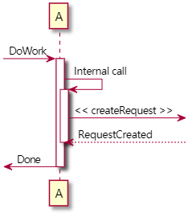

示例 `2`：不同类型的箭头中使用 "`[`" 和 "`]`"

```plantuml
@startuml
participant Alice
participant Bob #lightblue
Alice -> Bob
Bob -> Carol
...
[-> Bob
[o-> Bob
[o->o Bob
[x-> Bob
...
[<- Bob
[x<- Bob
...
Bob ->]
Bob ->o]
Bob o->o]
Bob ->x]
...
Bob <-]
Bob x<-]
@enduml
```


### 16.1 缩短输入/输出消息的箭头长度

使用 "`?`" 代替 "`[`" 和 "`]`" 可以让箭头长度缩短：

```plantuml
@startuml
participant Alice
participant Bob
[-> Bob : message
?-> Bob : message

Alice -> Bob : 维持 Alice 与 Bob 之间的水平间距\n让 "?" 的效果更明显

Alice ->] : message
Alice ->? : message
@enduml
```


## 17. 通过设置锚点消息来指定多条消息的持续时间

一开始，需要添加 `!pragma teoz true` 命令开启此功能。

通过 "`{<anchorName>} A -> B : message`" 设置锚点消息，同时指定锚点名称。

通过 "`{<anchorName1>} <-> {<anchorName2>} : duration time`" 指定锚点与锚点之间的多条消息的持续时间。

```plantuml
@startuml
!pragma teoz true

{start} Alice -> Bob : start doing things during duration

Bob -> Max : something
Max -> Bob : something else

{end} Bob -> Alice : finish

{start} <-> {end} : some time
@enduml
```


## 18. 声明参与者对象时指定参与者对象的类型

使用 "`<<Type>>`" 声明参与者对象的类型。

同时可以使用 "`(X, color)`" 声明对象的类型是类（`C`）、或接口（`I`）、或枚举（`E`）。

示例 `1`：

```plantuml
@startuml
participant "Little Bob" as Bob <<Student>>
participant Alice <<(C,#ADD1B2) Teacher>>

Bob->Alice: First message
@enduml
```


示例 `2`：

```plantuml
@startuml
participant Bob <<(C,#ADD1B2)>>
participant Alice <<(C,#ADD1B2)>>

Bob->Alice: First message
@enduml
```


## 19. 将多个参与者包裹在一个区域中

可以使用 `box` 和 `end box` 画一个盒子将参与者包裹起来。

同时可以在 `box` 关键字之后添加包裹区域的标题或者背景颜色。

```plantuml
@startuml
box "Internal Service" #LightBlue
participant Bob
participant Alice
end box

participant Other

Bob -> Alice : hello
Alice -> Other : hello
@enduml
```


## 20. 将参与者的底部脚注移除掉

使用 `hide footbox` 关键字移除脚注。

```plantuml
@startuml
hide footbox

Alice -> Bob: Authentication Request
Bob --> Alice: Authentication Response
@enduml
```


## 21. 设置 UML 图的标题 & 页眉 & 页脚

使用 `title` 关键词增加标题

使用 `header` 关键词增加页眉

使用 `footer` 关键词增加页脚

```plantuml
@startuml
header Page Header
footer Page %page% of %lastpage%
title Example Title

Alice -> Bob : message 1
Alice -> Bob : message 2
@enduml
```


## 22. 隐藏未使用到的参与者对象

默认情况下会显示所有参与者。

可以使用 `hide unlinked` 命令来隐藏未被链接到的参与者。

示例 `1`：未隐藏时

```plantuml
@startuml
participant Alice
participant Bob
participant Carol

Alice -> Bob : hello
@enduml
```


示例 `2`：隐藏时

```plantuml
@startuml
hide unlinked

participant Alice
participant Bob
participant Carol

Alice -> Bob : hello
@enduml
```

