## 1. 概述

我们平时画图需要两个工具：纸和笔。在 `Android` 中，`Paint` 类就是画笔，而 `Canvas` 类就是纸，在这里叫作画布。所以：

1. 凡是跟画笔设置相关的，比如画笔大小、粗细、画笔颜色、透明度、字体的样式等，都在 `Paint` 类里设置；
   
2. 凡是要画出成品的东西，比如圆形、矩形、文字等，都调用 `Canvas` 类里的函数生成。

## 2. 画笔的基本设置

### 2.1 `setAntiAlias`：是否打开抗锯齿功能

```java:no-line-numbers
/* Paint.java */
public void setAntiAlias(boolean aa)
```

```:no-line-numbers
表示是否打开抗锯齿功能。true 为打开
抗锯齿是依赖算法的，一般在绘制不规则的图形时使用，比如圆形、文字等。当打开抗锯齿功能时，所绘图像可以产生平滑的边缘。
在绘制棱角分明的图像时，比如一个矩形、一张位图，是不需要打开抗锯齿功能的。
```

**示例代码：**

```java:no-line-numbers
@Override 
protected void onDraw(Canvas canvas) { 
    super.onDraw(canvas); 

    Paint paint=new Paint(); 

    paint.setColor(Color.RED); // 设置画笔颜色
    paint.setStyle(Paint.Style.FILL); // 设置填充样式
    paint.setAntiAlias(true); // 打开抗锯齿功能
    paint.setStrokeWidth(50); // 设置画笔宽度

    // 画圆
    canvas.drawCircle(190, 200, 150, paint); 
}
```

### 2.2 `setColor`：设置画笔颜色

```java:no-line-numbers
/* Paint.java */
public void setColor(@ColorInt int color)
```

```:no-line-numbers
该函数的作用是设置画笔颜色。
参数 color 取十六进制颜值（0xAARRGGBB，其中 AA：透明度，RR：红色分量，GG：绿色分量，BB：蓝色分量）。

注意：除手动组合颜色的方法以外，系统还提供了一个专门用来解析颜色的类：Color.java
```

**示例代码：**

```java:no-line-numbers
Paint paint=new Paint(); 

paint.setColor(0xFFFF0000); 
paint.setStyle(Paint.Style.FILL); 
paint.setStrokeWidth(50); 
canvas.drawCircle(190, 200, 150, paint); // 不透明的红色，半径取 150px

paint.setColor(0x7EFFFF00); 
canvas.drawCircle(190, 200, 100, paint); // 半透明的黄色，半径取 100px
```

**效果图：**

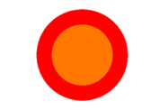

### 2.3 `setStyle`：设置填充样式

```java:no-line-numbers
/* Paint.java */
public void setStyle(Style style)
```

```:no-line-numbers
该函数用于设置填充样式，对于文字和几何图形都有效。
```

参数 `Style` 的取值如下：

```java:no-line-numbers
/* Paint.java */
public enum Style {
    FILL            (0), // 仅填充内部
    STROKE          (1), // 填充内部和描边
    FILL_AND_STROKE (2); // 仅描边
    ...
}
```

**示例代码：**

```java:no-line-numbers
Paint paint=new Paint(); 
paint.setColor(0xFFFF0000); 

// paint.setStyle(Paint.Style.FILL); 
// paint.setStyle(Paint.Style.STROKE); 
paint.setStyle(Paint.Style.FILL_AND_STROKE); 

paint.setStrokeWidth(50); 
canvas.drawCircle(190, 200, 150, paint);
```

**效果图：**

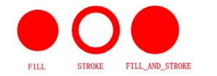

> 明显可见，`FILL_AND_STROKE` 是 `FILL` 和 `STROKE` 叠加在一起显示的结果。
> 
> `FILL_AND_STROKE` 比 `FILL` 多了一个描边的宽度。

### 2.4 `setStrokeWidth`：设置描边宽度值

```java:no-line-numbers
/* Paint.java */
public void setStrokeWidth(float width)
```

```:no-line-numbers
用于设置描边宽度值，单位是 px。
当画笔的 Style 样式是 STROKE 或 FILL_AND_STROKE 时有效。
```

## 3. `Canvas` 使用基础

### 3.1 设置画布背景

```java:no-line-numbers
/* Canvas.java */
public void drawColor(@ColorInt int color)
public void drawARGB(int a, int r, int g, int b)
public void drawRGB(int r, int g, int b) // 透明度 Alpha 的值默认取 255
```

**示例代码：**

```java:no-line-numbers
protected void onDraw(Canvas canvas) { 
    super.onDraw(canvas); 
    // 将画布默认填充为紫色
    canvas.drawColor(0xFFFF00FF); 
    // canvas.drawARGB(0xFF, 0xFF, 0, 0xFF);
    // canvas.drawRGB(255,0,255); // 可以是十进制的数值
    // canvas.drawRGB(0xFF,0x00,0xFF); // 也可以是十六进制的数值
}
```

### 3.2 画直线

```java:no-line-numbers
/* Canvas.java */
public void drawLine(float startX, float startY, float stopX, float stopY, Paint paint)
```

```:no-line-numbers
startX：起始点 X 坐标。
startY：起始点 Y 坐标。
stopX ：终点 X 坐标。
stopY ：终点 Y 坐标。
```

**示例代码：**

```java:no-line-numbers
Paint paint=new Paint(); 
paint.setColor(Color.RED); 
// paint.setStyle(Paint.Style.FILL); 
// paint.setStyle(Paint.Style.STROKE); 
paint.setStyle(Paint.Style.FILL_AND_STROKE); 
paint.setStrokeWidth(50); 
 
canvas.drawLine(100, 100, 200, 200, paint);
```

**效果图：**

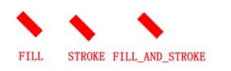

> 从效果图中可以明显看出，直线的粗细与画笔 `Style` 是没有关系的。

当设置不同的 `strokeWidth` 时，效果图如下：

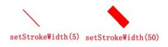

> 可见，直线的粗细与 `paint.setStrokeWidth` 有直接关系的。所以，一般而言:
> 
> 1. `paint.setStrokeWidth` 用于设置描边宽度时，`Style` 起作用；
> 
> 2. `paint.setStrokeWidth` 用于设置画笔宽度时，`Style` 不起作用。

### 3.3 画多条直线

#### 3.3.1 方法一

```java:no-line-numbers
/* Canvas.java */
public void drawLines(float[] pts, Paint paint)
```

```:no-line-numbers
pts：点的集合。每两个点形成一条直线，pts 的组织方式为 {x1, y1, x2, y2, x3, y3, ...}，
     其中 (x1, y1) 表示一个点，(x2, y2) 表示另一个点。
     两点确定一条直线，所以 pts 数组中的元素个数必须为 4 的整数倍
```

**示例代码：**

```java:no-line-numbers
Paint paint = new Paint(); 
paint.setColor(Color.RED); 
paint.setStrokeWidth(5); 

// 有 4 个点，分别是 (10,10)、(100,100)、(200,200) 和 (400,400)，两两连成一条直线。
float[] pts = {10, 10, 100, 100, 200, 200, 400, 400}; 
canvas.drawLines(pts, paint);
```

**效果图：**

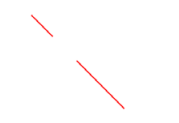

#### 3.3.2 方法二

```java:no-line-numbers
/* Canvas.java */
public void drawLines(float[] pts, int offset, int count, Paint paint)
```

```:no-line-numbers
相比上面的构造函数，这里多了两个参数：
1. int offset：集合中跳过的数值个数。注意不是点的个数！一个点有两个数值。
2. int count：参与绘制的数值个数，指 pts 数组中数值的个数，而不是点的个数，因为一个点有两个数值。
```

**示例代码：**

```java:no-line-numbers
Paint paint = new Paint(); 
paint.setColor(Color.RED); 
paint.setStrokeWidth(5); 

float[] pts = {10, 10, 100, 100, 200, 200, 400, 400}; 

// 从 pts 数组中索引为 2 的数字开始绘图，有 4 个数值参与绘图，
// 也就是点 (100,100) 和 (200,200)，所以效果图就是这两个点的连线。
canvas.drawLines(pts, 2, 4, paint);
```

**效果图：**

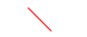

### 3.4 画点

```java:no-line-numbers
/* Canvas.java */
public void drawPoint(float x, float y, Paint paint)
```

**示例代码：**

```java:no-line-numbers
Paint paint=new Paint(); 
paint.setColor(Color.RED); 
paint.setStrokeWidth(15); 
canvas.drawPoint(100, 100, paint);
```

> 在 `(100, 100)` 位置画一个点。
> 
> 注意：点的大小只与 `paint.setStrokeWidth(width)` 有关，而与 `paint.setStyle(style)` 无关。

### 3.5 画多个点

```java:no-line-numbers
/* Canvas.java */
public void drawPoints(float[] pts, Paint paint)
public void drawPoints(float[] pts, int offset, int count, Paint paint)
```

```:no-line-numbers
pts：点的集合，集合中每两个数值表示一个点，集合数值个数必须是 2 的整数倍，形如： {x1, y1, x2, y2, x3, y3, ...}
offset：集合中跳过的数值个数。注意不是点的个数！一个点有两个数值。
count：参与绘制的数值个数，指 pts 数组中数值的个数，而不是点的个数。
```

**示例代码：**

```java:no-line-numbers
Paint paint=new Paint(); 
paint.setColor(Color.RED); 
paint.setStrokeWidth(25); 

// 4 个点：(10,10)、(100,100)、(200,200) 和 (400,400)
float[] pts={10,10,100,100,200,200,400,400}; 

// 跳过前两个数值，即第一个点的横、纵坐标，画出后面 4 个数值代表的点，即第二、三个点，第四个点没画。
canvas.drawPoints(pts, 2, 4, paint);
```

**效果图：**


### 3.6 矩形工具类 `RectF`、`Rect` & 画矩形

这两个类都是矩形工具类，根据 `4` 个点构造出一个矩形结构。`RectF` 与 `Rect` 中的方法、成员变量完全一样，唯一不同的是：

1. `RectF` 是用来保存 `float` 类型数值的矩形结构的；
   
2. `Rect` 是用来保存 `int` 类型数值的矩形结构的。

**`RectF` 的构造函数如下：**

```java:no-line-numbers
public RectF() 
public RectF(float left, float top, float right, float bottom) // 最常用
public RectF(RectF r) 
public RectF(Rect r)
```

**`Rect` 的构造函数如下：**

```java:no-line-numbers
public Rect() 
public Rect(int left, int top, int right, int bottom) // 最常用
public Rect(Rect r)
```

构造一个矩形结构有如下两种方式：

1. 直接构造：

    ```java:no-line-numbers
    Rect rect = new Rect(10,10,100,100);
    ```

2. 间接构造：

    ```java:no-line-numbers
    Rect rect = new Rect(); 
    rect.set(10,10,100,100);
    ```

**`Canvas` 提供如下方法用来绘制矩形：**

```java:no-line-numbers
/* Canvas.java */
public void drawRect(float left, float top, float right, float bottom, Paint paint) 
public void drawRect(RectF rect, Paint paint)
public void drawRect(Rect r, Paint paint)
```

**示例代码：**

```java:no-line-numbers
Paint paint=new Paint(); 
paint.setColor(Color.RED); 
paint.setStyle(Paint.Style.STROKE); 
paint.setStrokeWidth(15); 

canvas.drawRect(10, 10, 100, 100, paint); 

paint.setStyle(Paint.Style.FILL); 
RectF rect = new RectF(210f, 10f, 300f, 100f); 
canvas.drawRect(rect, paint);
```

**效果图：**


### 3.7 画圆角矩形

```java:no-line-numbers
/* Canvas.java */
public void drawRoundRect(RectF rect, float rx, float ry, Paint paint)
```

```:no-line-numbers
RectF rect：要绘制的矩形。
float rx：生成圆角的椭圆的 X 轴半径。
float ry：生成圆角的椭圆的 Y 轴半径。
```

使用过 `<shape>` 标签的读者应该知道：`Android` 在生成矩形的圆角时，其实利用的是椭圆。

`<shape>` 标签 `4` 个角都可以设置生成圆角的椭圆，它生成圆角矩形的原理如下图所示：

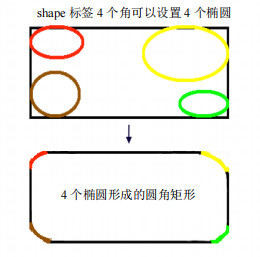

可见，**圆角矩形的圆角其实是由椭圆的一角形成的**。

与 `<shape>` 标签不同的是，`drawRoundRect()` 函数不能针对每个角设置对应的椭圆，而只能统一设置 `4` 个角对应的椭圆。

**示例代码：**

```java:no-line-numbers
Paint paint=new Paint(); 
paint.setColor(Color.RED); 
paint.setStyle(Style.FILL); 
paint.setStrokeWidth(15); 
 
RectF rect = new RectF(100, 10, 300, 100); 
canvas.drawRoundRect(rect, 20, 10, paint);
```

**效果图：**


### 3.8 画圆

```java:no-line-numbers
/* Canvas.java */
void drawCircle(float cx, float cy, float radius, Paint paint)
```

```:no-line-numbers
float cx：圆心点的 X 轴坐标。 
float cy：圆心点的 Y 轴坐标。
float radius：圆的半径。
```

**效果图：**

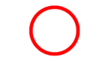

### 3.9 画椭圆

椭圆是根据矩形生成的，以矩形的长为椭圆的 `X` 轴，以矩形的宽为椭圆的 `Y` 轴。

```java:no-line-numbers
/* Canvas.java */
void drawOval(RectF oval, Paint paint)
```

```:no-line-numbers
RectF oval：用来生成椭圆的矩形。
```

**示例代码：**

```java:no-line-numbers
Paint paint=new Paint(); 
paint.setColor(Color.RED); 
paint.setStyle(Paint.Style.STROKE); 
paint.setStrokeWidth(5); 

RectF rect = new RectF(100, 10, 300, 100); 
canvas.drawRect(rect, paint); 

paint.setColor(Color.GREEN);//更改画笔颜色 
canvas.drawOval(rect, paint);//根据同一个矩形画椭圆
```

> 针对同一个矩形，先把它的矩形区域画出来，然后再把根据这个矩形生成的椭圆画出来，就可以很好地理解根据矩形所生成的椭圆与矩形的关系了。

**效果图：**

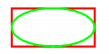

### 3.10 画弧

弧是椭圆的一部分，而椭圆是根据矩形来生成的，所以弧也是根据矩形来生成的。

```java:no-line-numbers
/* Canvas.java */
void drawArc(RectF oval, float startAngle, float sweepAngle, boolean useCenter, Paint paint)
```

```:no-line-numbers
RectF oval：生成椭圆的矩形。
float startAngle：弧开始的角度，以 X 轴正方向为 0°。 
float sweepAngle：弧持续的角度。
boolean useCenter：是否有弧的两边。为 true 时，表示带有两边；为 false 时，只有一条弧。
```

**示例代码：**

1. 将画笔设置为描边：

    ```java:no-line-numbers
    Paint paint=new Paint(); 
    paint.setColor(Color.RED); 
    paint.setStyle(Paint.Style.STROKE); 
    paint.setStrokeWidth(5); 

    //带两边
    RectF rect1 = new RectF(10, 10, 100, 100); 
    canvas.drawArc(rect1, 0, 90, true, paint); 

    //不带两边
    RectF rect2 = new RectF(110, 10, 200, 100); 
    canvas.drawArc(rect2, 0, 90, false, paint);
    ```

    

2. 将画笔设置为填充：

    ```java:no-line-numbers
    // 1 中代码不变，只需要将 paint 的样式设置为 FILL 即可。
    paint.setStyle(Style.FILL);
    ```

    

> 从效果图中可以看出：当画笔设为填充模式时，填充区域只限于圆弧的起始点和终点所形成的区域，并且：
> 
> 1. 如果带有两边时，会将两边及圆弧内部全部填充；
> 
> 2. 如果没有两边，则只填充圆弧部分。

## 4. `Rect` 与 `RectF`

由于 `Rect`、`RectF` 所具有的函数是相同的，只是保存的数值类型不同，所以下面就以 `Rect` 为例来进行讲解。

### 4.1 判断是否包含点、矩形

#### 4.1.1 判断是否包含点

```java:no-line-numbers
/* Rect.java */
boolean contains(int x, int y)
```

```:no-line-numbers
该函数用于判断某个点是否在当前矩形中。如果在，则返回 true；如果不在，则返回 false。
参数 (x,y) 就是当前要判断的点的坐标。
```

> 利用这个函数，可以定义一个很简单的控件：
> 
> 绘制一个矩形，当手指在这个矩形区域内时，矩形变为绿色；否则是红色的。

#### 4.1.2 判断是否包含某个矩形

```java:no-line-numbers
/* Rect.java */
Boolean contains(int left, int top, int right, int bottom) 
boolean contains(Rect r)
```

```:no-line-numbers
根据矩形的 4 个点或者一个 Rect 矩形对象来判断这个矩形是否在当前的矩形区域内。
```

### 4.2 判断两个矩形是否相交

#### 4.2.1 静态方法判断是否相交

```java:no-line-numbers
/* Rect.java */
static boolean intersects(Rect a, Rect b)
```

```:no-line-numbers
这是 Rect 类的一个静态方法，用来判断参数中所传入的两个 Rect 矩形是否相交。
如果相交则返回 true，否则返回 false。
```

#### 4.2.2 成员方法判断是否相交

```java:no-line-numbers
/* Rect.java */
boolean intersects(int left, int top, int right, int bottom)
```

#### 4.2.3 判断相交并返回结果

```java:no-line-numbers
/* Rect.java */
boolean intersect(int left, int top, int right, int bottom) 
boolean intersect(Rect r)
```

```:no-line-numbers
这两个成员方法与 intersects() 方法的区别是：
不仅会返回是否相交的结果，而且会把相交部分的矩形赋给当前 Rect 对象。
如果两个矩形不相交，则当前 Rect 对象的值不变。
```

**示例代码：**

```java:no-line-numbers
Rect rect_1 = new Rect(10, 10, 200, 200); 

Boolean result_1 = rect_1.intersects(190, 10, 250, 200); 
printResult(result_1,rect_1); 

Boolean result_2 = rect_1.intersect(210, 10, 250, 200); 
printResult(result_2, rect_1); 

Boolean result_3 = rect_1.intersect(190, 10, 250, 200); 
printResult(result_3,rect_1);


private void printResult(Boolean result, Rect rect) { 
    Log.d("qijian", rect.toShortString() + " result:" + result); 
}
```

在上面的示例中，分别使用 `intersects()` 和 `intersect()` 函数来判断是否与指定矩形相交，并将判断相交的对象 `rect_1` 的边角打印出来。

日志如下：

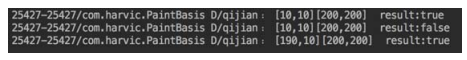

很明显：

```:no-line-numbers
1. intersects() 函数只是判断是否相交，并不会改变原矩形 rect_1 的值；
2. 当 intersect() 函数判断的两个矩形不相交时，也不会改变 rect_1 的值；
3. 只有当两个矩形相交时，intersect() 函数才会把结果赋给 rect_1。
```


### 4.3 合并

#### 4.3.1 合并两个矩形

合并两个矩形的意思就是将两个矩形合并成一个矩形，即：

```:no-line-numbers
无论这两个矩形是否相交，取两个矩形最小左上角点作为结果矩形的左上角点，取两个矩形最大右下角点作为结果矩形的右下角点。
如果要合并的两个矩形有一方为空，则将有值的一方作为最终结果。
```

```java:no-line-numbers
/* Rect.java */
public void union(int left, int top, int right, int bottom) 
public void union(Rect r)
```

```:no-line-numbers
同样根据参数是矩形的 4 个点还是一个 Rect 对象分为两个构造函数。
合并的结果将会被赋给当前的 rect 变量。
```

**示例代码：**

```java:no-line-numbers
Paint paint = new Paint(); 
paint.setStyle(Paint.Style.STROKE); 
Rect rect_1 = new Rect(10,10,20,20); 
Rect rect_2 = new Rect(100,100,110,110); 

//分别画出源矩形 rect_1、rect_2 
paint.setColor(Color.RED); 
canvas.drawRect(rect_1,paint); 
paint.setColor(Color.GREEN); 
canvas.drawRect(rect_2,paint);

//画出合并之后的结果 rect_1 
paint.setColor(Color.YELLOW); 
rect_1.union(rect_2); 
canvas.drawRect(rect_1,paint);
```

上述代码构造了两个不相交的矩形，先分别画出它们各自所在的位置，然后通过 `union()` 函数合并，并将合并结果画出来。

**效果如下图所示：**

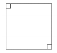

> 从结果图中可以看出，两个小矩形在合并以后，取两个矩形的最小左上角点作为结果矩形的左上角点，取两个矩形的最大右下角点作为结果矩形的右下角点。

#### 4.3.2 合并矩形与某个点

```java:no-line-numbers
/* Rect.java */
public void union(int x, int y)
```

```:no-line-numbers
先判断当前矩形与目标合并点的关系，
如果不相交，则根据目标点 (x,y) 的位置，将目标点设置为当前矩形的左上角点或者右下角点。
如果当前矩形是一个空矩形，则最后的结果矩形为 ([0,0],[x,y])，即结果矩形的左上角点为 [0,0]，右下角点为 [x,y]。
```

**示例代码：**

```java:no-line-numbers
Rect rect_1 = new Rect(10, 10, 20, 20); 
rect_1.union(100,100); 
printResult(rect_1); 

rect_1 = new Rect(); 
rect_1.union(100,100); 
printResult(rect_1);

private void printResult(Rect rect) { 
    Log.d("qijian", rect.toShortString()); 
}
```

在上述代码中，先将与指定矩形不相交的点与矩形合并，然后将矩形置空，再与同一个点相交。

日志如下：

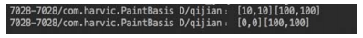

结果很容易理解，当与指定矩形合并时，根据当前点的位置，将该点设为矩形的右下角点；当点与空矩形相交时，结果为 `([0,0],[x,y])`。

## 5. `Color`

`Color` 是 `Android` 中与颜色处理有关的类。

### 5.1 常量颜色

`Color` 定义了很多常量的颜色值，我们可以直接使用。

```java:no-line-numbers
/* Color.java */
int BLACK 
int BLUE 
int CYAN 
int DKGRAY 
int GRAY 
int GREEN 
int LTGRAY 
int MAGENTA 
int RED 
int TRANSPARENT 
int WHITE 
int YELLOW
```

```
可以通过 Color.XXX 来直接使用这些颜色，比如红色，在代码中可以直接使用 Color.RED。
```

### 5.2 构造颜色

#### 5.2.1 带有透明度的颜色

```java:no-line-numbers
/* Color.java */
static int argb(int alpha, int red, int green, int blue)
```

```:no-line-numbers
这个函数允许我们分别传入 A、R、G、B 4 个色彩分量，然后合并成一个色彩。
其中，alpha、red、green、blue 4 个色彩分量的取值范围都是 0～255。
```

`Color.argb()` 函数的具体实现源码如下：

```java:no-line-numbers
/* Color.java */
public static int argb(int alpha, int red, int green, int blue) { 
    return (alpha << 24) | (red << 16) | (green << 8) | blue; 
}
```

> 在读代码时，有时会看到直接利用 `(alpha << 24) | (red << 16) | (green << 8) | blue` 来合成对应颜色值的情况，
> 
> 其实跟我们使用 `Color.argb()` 函数来合成的结果是一样的。

#### 5.2.2 不带透明度的颜色

```java:no-line-numbers
/* Color.java */
static int rgb(int red, int green, int blue)
```

```:no-line-numbers
其实跟上面的构造函数是一样的，只是不允许指定 alpha 值，alpha 值取 255（完全不透明）。
```

### 5.3 提取颜色分量

我们不仅能通过 `Color` 类来合并颜色分量，而且能从一个颜色中提取出指定的颜色分量。

```java:no-line-numbers
/* Color.java */
static int alpha(int color) 
static int red(int color) 
static int green(int color) 
static int blue(int color)
```

```:no-line-numbers
通过上面的 4 个函数提取出对应的 A、R、G、B 颜色分量。
```

## 6. 注意事项

在示例中创建 `Paint` 对象和其他对象时都是在 `onDraw()` 函数中实现的，其实这在现实代码中是不被允许的。

因为当需要重绘时就会调用 `onDraw()` 函数，所以在 `onDraw()` 函数中创建的变量会一直被重复创建，这样会引起频繁的程序 `GC`（回收内存），进而引起程序卡顿。这里之所以这样做，是因为可以提高代码的可读性。

大家一定要记住，**在 `onDraw()` 函数中不能创建变量！** 一般在自定义控件的构造函数中创建变量，即在初始化时一次性创建。