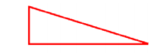
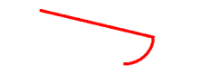
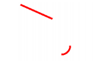

## 1. 概述

画笔所画出来的一段不间断的曲线就是路径。在 `Android` 中，`Path` 类就代表路径。

在 `Canvas` 中绘制路径的方法如下：

```java:no-line-numbers
/* Canvas.java */
void drawPath(Path path, Paint paint)
```

## 2. 直线路径

画一条直线路径，一般涉及下面三个函数：

```java:no-line-numbers
/* Path.java */

// (x1,y1) 是直线的起始点，即将直线路径的绘制点定在 (x1,y1) 位置。
void moveTo(float x1, float y1)

// (x2,y2) 是直线的终点，又是下一次绘制直线路径的起始点；lineTo() 函数可以一直使用。
void lineTo(float x2, float y2)

// 如果连续画了几条直线，但没有形成闭环，那么调用 close() 函数会将路径首尾点连接起来，形成闭环。
void close()
```

**示例：画一个三角形**

```java:no-line-numbers
Paint paint=new Paint(); 
paint.setColor(Color.RED); // 设置画笔颜色
paint.setStyle(Paint.Style.STROKE); // 填充样式改为描边
paint.setStrokeWidth(5); // 设置画笔宽度

Path path = new Path(); 

path.moveTo(10, 10); // 设定起始点
path.lineTo(10, 100); // 第一条直线的终点，也是第二条直线的起始点
path.lineTo(300, 100); // 画第二条直线
path.close(); // 闭环

canvas.drawPath(path, paint);
```

> 先沿逆时针方向画了两条直线，分别是从 `(10, 10)` 到 `(10, 100)` 和从 `(10, 100)` 到 (`300, 100)`，
> 
> 然后利用 `path.close()` 函数将路径闭合，路径的终点 `(300,100)` 就会自行向路径的起始点 `(10,10)` 画一条闭合线，
> 
> 所以最终我们看到的是一个路径闭合的三角形。

效果如下图所示：



## 3. 弧线路径

```java:no-line-numbers
/* Path.java */
void arcTo(RectF oval, float startAngle, float sweepAngle)
```

```:no-line-numbers
RectF oval：生成椭圆的矩形。
float startAngle：弧开始的角度，以 X 轴正方向为 0°。 
float sweepAngle：弧持续的角度。
```

> 这是一个画弧线路径的方法，弧线是从椭圆上截取的一部分。

**示例代码：**

```java:no-line-numbers
Path path = new Path(); 
path.moveTo(10,10); 
RectF rectF = new RectF(100,10,200,100); 
path.arcTo(rectF,0,90); 

canvas.drawPath(path,paint);
```

**效果图：**



从效果图中发现一个问题：我们只画了一条弧，为什么弧最终还是会和起始点 `(10,10)` 连接起来？

因为在默认情况下路径都是连贯的，除非以下两种情况：

1. 调用 [`addXXX` 系列函数](#_4-addxxx-系列函数)，将直接添加固定形状的路径。
   
2. 调用 `moveTo()` 函数改变绘制起始位置

如果我们不想连接怎么办？ `Path` 类也提供了另外两个重载方法：

```java:no-line-numbers
/* Path.java */
void arcTo(float left, float top, float right, float bottom, float startAngle, float sweepAngle, boolean forceMoveTo) 
void arcTo(RectF oval, float startAngle, float sweepAngle, boolean forceMoveTo)
```

```:no-line-numbers
参数 boolean forceMoveTo 的含义是：是否强制将弧的起始点作为绘制起始位置。
```

**示例代码：**

```java:no-line-numbers
Path path = new Path(); 
path.moveTo(10,10); 
RectF rectF = new RectF(100,10,200,100); 
path.arcTo(rectF,0,90,true); 

canvas.drawPath(path,paint);
```

**效果图：**


## 4. `addXXX` 系列函数

前面我们讲过，路径一般都是连贯的，而 `addXXX` 系列函数可以让我们直接往 `Path` 中 **添加** 一些曲线，而不必考虑连贯性。

**示例代码：**

```java:no-line-numbers
Path path = new Path(); 
path.moveTo(10,10); 
path.lineTo(100,50); 
RectF rectF = new RectF(100,100,150,150); 
path.addArc(rectF,0,90); 
canvas.drawPath(path, paint);
```

**效果图：**



> 虽然我们先绘制了从 `(10,10)` 到 `(100,50)` 的线段，但是在我们往路径中添加了一条弧线之后，弧线并没有与线段连接。

除了 `addArc()` 函数，`Path` 类还提供了一系列的 `add` 函数，下面我们就一一来讲解。

### 4.1 添加矩形路径：`addRect`

### 4.2 添加圆角矩形路径：`addRoundRect`

### 4.3 添加圆形路径：`addCircle`

### 4.4 添加椭圆路径：`addOval`

### 4.5 添加弧形路径：`addArc`

## 5. 填充模式：`FillType`

## 6. 重置路径

### 6.1 概述

### 6.2 `reset()` 与 `FillType`

### 6.3 `rewind()` 与 `FillType`

## 7. 示例：蜘蛛网状图

### 7.1 初始化

### 7.2 获得布局中心

### 7.3 绘制蜘蛛网格

### 7.4 画网格中线

### 7.5 画数据图
