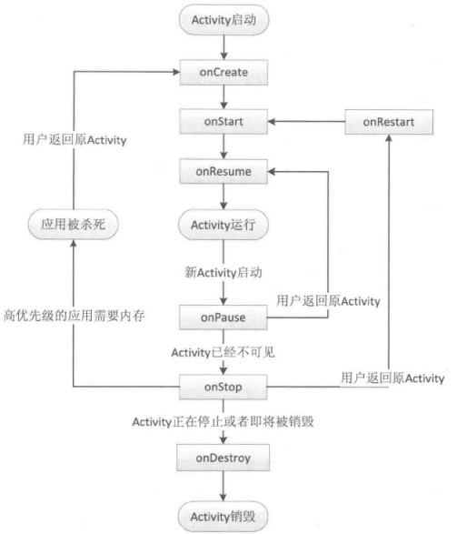
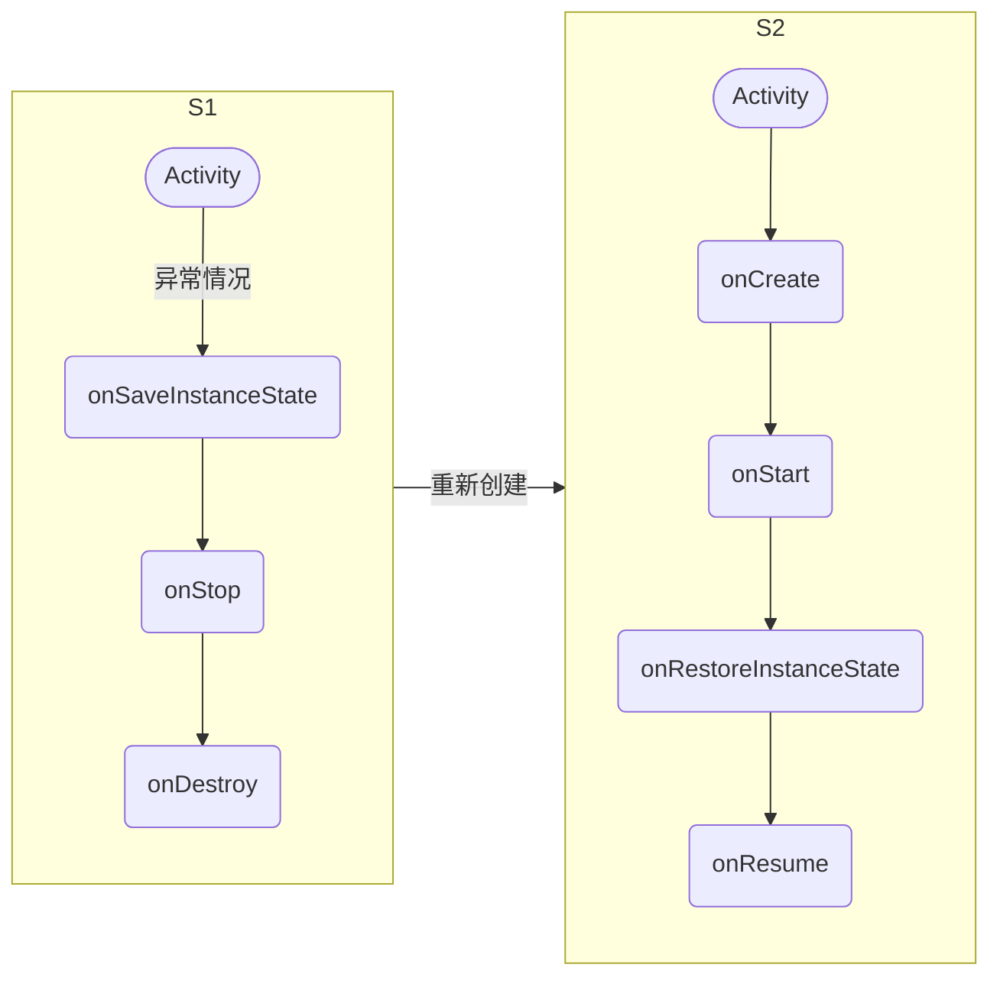
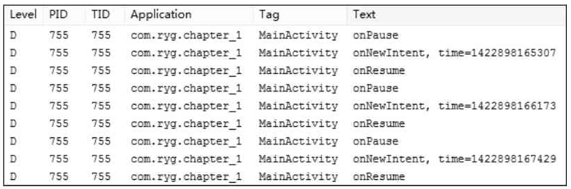
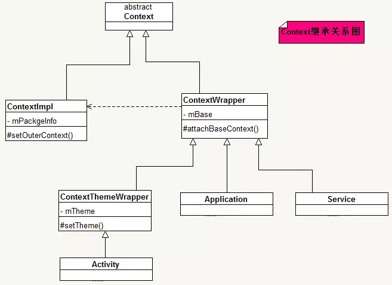

参考：[Activity 的 36 大难点，你会几个？「建议收藏」](https://blog.csdn.net/qq_43377749/article/details/102728995)

参考：《`Android` 开发艺术探索》 第 `1` 章（`Activity` 的生命周期和启动模式）

## 1. 生命周期

### 1.1 生命周期切换过程



### 1.2 正常生命周期

#### 1.2.1 `onCreate`

表示 `Activity` 正在被创建，这是生命周期的第一个方法。

在这个方法中，我们可以做一些初始化工作，比如：

1. 调用 `setContentView` 去加载界面布局资源；
2. 初始化 `Activity` 所需数据等。

#### 1.2.2 `onRestart`

表示 `Activity` 正在重新启动。

一般情况下，当 `Activity` 从不可见重新变为可见状态时，`onRestart` 就会被调用。

> 这种情况一般是用户行为所导致的，比如：当用户按 `Home` 键切换到桌面，或者用户打开了一个新的 `Activity` 时，原来的 `Activity` 会暂停，于是原来的 `Activity` 执行 `onPause` 和 `onStop`。接着，当用户又回到原来的 `Activity` 时，原来的 `Activity` 就会执行 `onRestart`。

#### 1.2.3 `onStart`

表示 `Activity` 正在被启动。此时，`Activity` 已经可见了，但是 `Activity` 还没有出现在前台，无法与用户交互。

#### 1.2.4 `onResume`

表示 `Activity` 已经可见了，并出现在前台，且可以和与用户交互了。

> 注意与 `onStart` 的对比：
> 
> `onStart` 和 `onResume` 都表示 `Activity` 已经可见，但是 `onStart` 时 `Activity` 还在后台；`onResume` 时才显示到前台。

#### 1.2.5 `onPause`

表示 `Activity` 正在停止。

此时可以做一些存储数据、停止动画等操作。但不能太耗时，因为这会影响到新的 `Activity` 的显示。

注意：**`onPause` 必须先执行完，新 `Activity` 的 `onResume` 才会执行**。

#### 1.2.6 `onStop`

表示 `Activity` 即将停止，可以做一些稍微重量级的回收工作，同样不能太耗时。

#### 1.2.7 `onDestroy`

表示 `Activity` 即将被销毁，这是 `Activity` 生命周期中的最后一个回调。

在这里，可以做一些回收工作和最终的资源释放。

#### 1.2.8 具体场景分析

##### 1.2.8.1 `Activity` 第一次启动时

```:no-line-numbers
onCreate -> onStart -> onResume
```

##### 1.2.8.2 `Activity` 退到后台（切换到桌面 or 跳转到其它 `Activity`）

```:no-line-numbers
onPause -> onStop
```

##### 1.2.8.3 跳转到采用了透明主题的其它 `Activity`

```:no-line-numbers
onPause
```

> `A` 跳转到 `B` 时，若 `B` 采用了透明主题，则 `A` 仅回调 `onPause`，不回调 `onStop`。

##### 1.2.8.4 `Activity` 回到前台（用户再次回到原 `Activity`）

```:no-line-numbers
onRestart -> onStart -> onResume
```

##### 1.2.8.5 锁屏 & 开屏

锁屏时：

```:no-line-numbers
onPause -> onStop
```

开屏时：

```:no-line-numbers
onStart -> onResume
```

##### 1.2.8.6 用户按 `back` 按键回退时

```:no-line-numbers
onPause -> onStop -> onDestroy
```

### 1.3 异常生命周期

#### 1.3.1 资源相关的系统配置改变导致 `Activity` 销毁重建（如横竖屏切换）

##### 1.3.1.1 `onSaveInstanceState` & `onRestoreInstanceState`

当 `Activity` 从竖屏切换到横屏时，系统配置发生了改变，此时需要去加载适配横屏的资源目录中的图片。默认情况下，`Activity` 就会被销毁并且重新创建，其生命周期如下：



如上图所示：

1. 当系统配置发生改变后，`Activity` 会被销毁，其 `onPause`、`onStop`、`onDestroy` 均会被调用，同时由于 `Activity` 是在异常情况下终止的，系统会调用 `onSaveInstanceState` 来保存当前 `Activity` 的状态。

    > 只有在 `Activity` 被异常终止的情况下才会回调 `onSaveInstanceState` 方法，正常情况下系统不会回调这个方法。
    >
    > 系统只会在 `Activity` 即将被销毁并且有机会重新显示的情况下才会去调用 `onSaveInstanceState`。当 `Activity` 正常销毁的时候，系统不会调用 `onSaveInstanceState`，因为被销毁的 `Activity` 不可能再次被显示。

2. `onSaveInstanceState` 方法的调用时机是在 `onStop` 之前，但它和 `onPause` 没有既定的时序关系，即：它既可能在 `onPause` 之前调用，也可能在 `onPause` 之后调用。

3. 当 `Activity` 被重新创建后，系统会调用 `onRestoreInstanceState`，并且把 `Activity` 销毁时 `onSaveInstanceState` 方法所保存的 `Bundle` 对象作为参数同时传递给 `onRestoreInstanceState` 和 `onCreate` 方法。

4. `onRestoreInstanceState` 的调用时机在 `onStart` 之后，`onResume` 之前。

#####  1.3.1.2 `View` 层次结构的保存与恢复 & 委托思想

在 `onSaveInstanceState` 和 `onRestoreInstanceState` 方法中，系统自动为我们做了一定的恢复工作。

比如：当 `Activity` 在异常情况下需要重新创建时，系统会默认为我们保存当前 `Activity` 的视图结构，并且在 `Activity` 重启后为我们恢复这些数据，包括：文本框中用户输入的数据、`ListView` 滚动的位置等。

> 和 `Activity` 一样，每个 View 都有 `onSaveInstanceState` 和 `onRestoreInstanceState` 这两个方法，看一下它们的具体实现，就能知道系统能够自动为每个View恢复哪些数据。

关于保存和恢复 `View` 层次结构，系统的工作流程是这样的：

1. 首先 `Activity` 被意外终止时，`Activity` 会调用 `onSaveInstanceState` 去保存数据；
   
2. 然后 `Activity` 会委托 `Window` 去保存数据；
   
3. 接着 `Window` 再委托它上面的顶级容器去保存数据。
   
    > 顶层容器是一个 `ViewGroup`，一般来说它很可能是 `DecorView`。

4. 最后顶层容器再去一一通知它的子元素来保存数据。

这样整个数据保存过程就完成了（数据恢复过程也是类似的）。可以发现，这是一种典型的委托思想，上层委托下层、父容器委托子元素去处理一件事情。

> 这种思想在 `Android` 中有很多应用，比如 `View` 的绘制过程、事件分发等都是采用类似的思想。

#####  1.3.1.3 横竖屏切换时阻止 `Activity` 的销毁重建 & `configChanges` 属性

当资源相关的系统配置发生改变时，系统默认的处理方式是将 `Activity` 销毁重建。

但是，可以在 `AndroidManifest.xml` 文件中通过为 `<activity>` 标签设置属性 `android:configChanges` 来指定需要在变更时自行处理的系统配置。对于自行处理的系统配置，在变更时将阻止 `Activity` 销毁重建，而是让 `Activity` 保持运行状态，并回调此 `Activity` 的 `onConfigurationChanged` 方法。

`android:configChanges` 属性中可指定的系统配置如下：

|系统配置|说明|
|:-|:-|
|`density`|显示密度发生变更 - 用户可能已指定不同的显示比例，或者有不同的显示现处于活跃状态。|
|`fontScale`|字体缩放系数发生变更 - 用户已选择新的全局字号。|
|`keyboard`|键盘类型发生变更 - 例如，用户插入外置键盘。|
|`keyboardHidden`|键盘无障碍功能发生变更 - 例如，用户显示硬键盘。|
|`layoutDirection`|布局方向发生变更 - 例如，自从左至右 (`LTR`) 更改为从右至左 (`RTL`)。|
|`locale`|语言区域发生变更 - 用户已为文本选择新的显示语言。|
|`mcc`|`IMSI` 移动设备国家/地区代码 (`MCC`) 发生变更 - 检测到 `SIM` 并更新 `MCC`。|
|`mnc`|`IMSI` 移动设备网络代码 (`MNC`) 发生变更 - 检测到 `SIM` 并更新 `MNC`。|
|`navigation`|导航类型（轨迹球/方向键）发生变更。（这种情况通常不会发生。）|
|`orientation`|屏幕方向发生变更 - 用户旋转设备。|
|`screenLayout`|屏幕布局发生变更 - 现处于活跃状态的可能是其他显示模式。|
|`screenSize`|当前可用屏幕尺寸发生变更。该值表示目前可用尺寸相对于当前宽高比的变更，当用户在横向模式与纵向模式之间切换时，它便会发生变更。在 `API` 级别 `13` 中引入。|
|`smallestScreenSize`|物理屏幕尺寸发生变更。该值表示与方向无关的尺寸变更，因此它只有在实际物理屏幕尺寸发生变更（如切换到外部显示器）时才会变化。|
|`touchscreen`|触摸屏发生变更。（这种情况通常不会发生。）|
|`uiMode`|界面模式发生变更 - 用户已将设备置于桌面或车载基座，或者夜间模式发生变更。|

为了阻止横竖屏切换时导致 `Activity` 销毁重建，我们可以设置 `android:configChanges` 属性为：

```xml:no-line-numbers
android:configChanges="orientation|keyboardHidden|screenSize"
```

#### 1.3.2 系统内存不足导致低优先级的 `Activity` 所在进程被杀死

这种情况我们不好模拟，但是其数据存储和恢复过程和 [`1.3.1`](#_1-3-1-资源相关的系统配置改变导致-activity-销毁重建-如横竖屏切换) 完全一致。

这里我们描述一下 `Activity` 的优先级情况。`Activity` 按照优先级从高到低，可以分为如下 `3` 种：

1. 前台 `Activity`：正在和用户交互的 `Activity`，优先级最高。
   
2. 可见但非前台 `Activity`：比如 `Activity` 中弹出了一个对话框，导致 `Activity` 可见但是位于后台无法和用户直接交互。
   
3. 后台 `Activity`：已经被暂停的 `Activity`，比如执行了 `onStop`，优先级最低。

当系统内存不足时，系统就会按照上述优先级去杀死目标 `Activity` 所在的 **进程**，并在后续通过 `onSaveInstanceState` 和 `onRestoreInstanceState` 来存储和恢复数数据。

如果一个进程中没有四大组件在执行，那么这个进程将很快被系统杀死，因此，一些后台工作不适合脱离四大组件而独自运行在后台中，这样进程很容易被杀死。

比较好的方法是将后台工作放入 `Service` 中从而保证进程有一定的优先级，这样就不会轻易地被系统杀死。

### 1.4 将一个 `Activity` 设置成窗口的样式

只需要在 `AndroidManifest.xml` 文件中将 `Activity` 设置成 `Dialog` 主题即可：

```xml:no-line-numbers
android:theme="@android:style/Theme.Dialog"
```

### 1.5 退出已调用多个 `Activity` 的 `Application`

有如下 `4` 种方式：

1. 发送特定广播：在需要结束应用时，发送一个特定的广播，每个 `Activity` 收到广播后关闭即可。

2. 递归退出：在打开新的 `Activity` 时都使用 `startActivityForResult` 加上标志。关闭新的 `Activity` 时，在上一个 `Activity` 的 `onActivityResult` 方法中处理标志，递归关闭。

3. 通过 `Intent` 的 `flag` 实现：在跳转 `Activity` 时，设置 `intent.setFlags(Intent.FLAG_ACTIVITY_CLEAR_TOP)`。此时如果当前任务栈中已经有该 `Activity`，那么系统会把这个 `Activity` 上面的所有 `Activity` 干掉。

    > 其实相当于给 `Activity` 配置的启动模式为 `singleTask` 。

4. 记录打开的 `Activity`：每打开一个 `Activity`，就记录下来。在需要退出时，关闭每一个记录了的 `Activity`。

### 1.6 修改 `Activity` 进入和退出动画

有两种方式：

1. 在 `style.xml` 中设置过渡动画

    ```xml:no-line-numbers
    <style name="AppTheme" parent="Theme.AppCompat.Light.NoActionBar">
        <!-- 启用窗口内容过渡 -->
        <item name="android:windowActivityTransitions">true</item>
        <!-- 指定进入和退出过渡 -->
        <item name="android:windowEnterTransition">@transition/explode</item>
        <item name="android:windowExitTransition">@transition/explode</item>
    </style>
    ```

2. 调用 `overridePendingTransition` 方法设置过渡动画

    ```java:no-line-numbers
    /* Activity.java */
    /*
        overridePendingTransition 方法的调用场景可分为两种：

            1. 在 finish 方法后调用，此时：
               1. 参数 enterAnim 表示当前 Activity 退出后将要显示出来的 Activity 的进场动画
               2. 参数 exitAnim 表示当前 Activity 退出时的动画
               
            2. 在 startActivity 方法后调用，此时：
               1. 参数 enterAnim 表示跳转的 Activity 的进场动画
               2. 参数 exitAnim 表示当前 Activity 退出时的动画
    */
    public void overridePendingTransition(int enterAnim, int exitAnim)
    ```

    ```java:no-line-numbers
    /* 示例：在 finish 方法后调用 */
    finish();
    overridePendingTransition(R.anim.activity_enter, R.anim.activity_exit);
    ```

    ```java:no-line-numbers
    /* 示例：在 startActivity 方法后调用 */
    if (Build.VERSION.SDK_INT < Build.VERSION_CODES.JELLY_BEAN) { // API LEVEL < 16
        startActivity(new Intent(this, XxxActivity.class));
        overridePendingTransition(R.anim.activity_enter, R.anim.activity_exit);
    }else{
        Bundle optionsBundle = ActivityOptionsCompat.makeCustomAnimation(
            this,
            R.anim.activity_enter,
            R.anim.activity_exit
        ).toBundle();

        startActivity(new Intent(this, XxxActivity.class), optionsBundle);
    }
    ```

## 2. 启动模式

### 2.1 为什么需要启动模式

在默认的启动模式下，当我们多次启动同一个 `Activity` 时，系统会创建多个实例并把它们一一放入任务栈中。

> 任务栈是一种后进先出的栈结构，每按一下 `back` 键就会有一个 `Activity` 出栈，直到栈空为止，当栈中无任何 `Activity` 的时候，系统就会回收这个任务栈。

但有时候，在多次启动同一个 `Activity` 时，我们并不想让系统在每次启动时都创建一个新的 `Activity` 实例，而是可以根据情况选择复用已启动的 `Activity` 实例。为了满足这种需求，Android 系统提供了四种启动模式来改变系统的默认行为。

### 2.2 四种启动模式

#### 2.2.1 `standard`（标准模式）

系统的默认模式。

不管被启动的 `Activity` 实例是否已存在，每次启动 `Activity` 时都会重新创建一个新的实例。

被创建的 `Activity` 实例的生命周期方法回调流程为：`onCreate -> onStart -> onResume`。

`standard` 模式是一种典型的多实例实现，即：

1. 一个任务栈中可以有多个实例；
   
2. 多个实例也可以属于不同的任务栈。

#### 2.2.1.1 `standard` 模式启动的 `Activity` 默认进入当前 `Context` 的任务栈中

`standard` 模式下启动的 `Activity`，默认存放在当前 `Context` 的任务栈。

`Activity` 是一种具有任务栈的 `Context`，在 `Activity` 中采用 `standard` 模式启动另一个 `Activity` 时，被启动的 `Activity` 默认和启动它的当前 `Activity` 存放在同一个任务栈中。

#### 2.2.1.2 `standard` 模式启动时 `Context` 无任务栈的解决方案

除了 `Activity` 之外的其他 `Context` 都不具备任务栈（如：`Service`，`Application` 都不具备任务栈）。

因此，当在 `Service` 或 `Application` 中采用 `standard` 模式启动 `Activity` 时，会抛出异常。

此时，就不能采用 `standard` 模式来启动 `Activity` 了，而是通过给 `Intent` 指定 `FLAG_ACTIVITY_NEW_TASK` 标记位，采用 `singleTask` 模式来启动 `Activity`。

#### 2.2.2 `singleTop`（栈顶复用模式）

在这种模式下启动的 `Activity`：

1. 如果 `Activity` 实例已位于任务栈的栈顶，那么此 `Activity` 不会被重新创建，不会回调 `onCreate -> onStart`。而是回调 `onNewIntent -> onResume`。其中，通过 `onNewIntent(Intent)` 方法的参数 `Intent` 我们可以取出启动时传递的参数。

    ```:no-line-numbers
    假设任务栈为： A-B-C-D，其中 D 位于栈顶，此时：
    1. 如果以 singleTop 模式启动 D，则栈内情况为：A-B-C-D
    2. 如果以 standard 模式启动 D，则栈内情况为： A-B-C-D-D
    ```
   
2. 如果 `Activity` 实例已位于任务栈，但不在栈顶，那么为这个 `Activity` 重新创建一个实例并放入到栈顶。而之前已位于任务栈中的 `Activity` 实例原封不动。（此情况下，相当于 `standard` 模式）

    ```:no-line-numbers
    假设任务栈为： A-B-C-D，其中 D 位于栈顶，此时：
    1. 如果以 singleTop 模式启动 A，则栈内情况为：A-B-C-D-A
    2. 如果以 standard 模式启动 A，则栈内情况为： A-B-C-D-A
    ```

#### 2.2.3 `singleTask`（栈内复用模式）

是一种单实例模式。

在这种模式下启动的 `Activity`，只要 `Activity` 实例已位于任务栈中，不管在不在栈顶，此 `Activity` 都不会被重新创建，不会回调 `onCreate -> onStart`。而是回调 `onNewIntent -> onResume`。

具体地说，当采用  `singleTask`  模式启动 `Activity` `D` 时，先查询 `D` 所需的任务栈是否存在：

1. 如果不存在，那么创建一个 `D` 所需的任务栈，同时创建 `D` 的实例并放入到该任务栈中。

    ```:no-line-numbers
    假设任务栈 S1 为： A-B-C，其中 C 位于栈顶，
    此时采用 singleTask 模式启动 D，且 D 所需的任务栈为 S2，
    由于 S2 和 D 的实例都不存在，所以会先创建任务栈 S2，再创建 D 的实例并放入到任务栈 S2 中
    最终任务栈的情况为：
        S1：A-B-C
        S2：D
    ```
   
2. 如果存在，那么判断已存在的任务栈中是否保存有 `D` 的实例：
   
   1. 若已存在的任务栈中没有保存 `D` 的实例，则创建 `D` 的实例并放入到任务栈中；

        ```:no-line-numbers
        假设任务栈 S1 为： A-B-C，其中 C 位于栈顶，
        此时采用 singleTask 模式启动 D，且 D 所需的任务栈为 S1，
        由于 S1 存在，但 D 的实例不存在，所以创建 D 的实例并放入到任务栈 S1 中
        最终任务栈的情况为：
            S1：A-B-C-D
        ```
   
   2. 若已存在的任务栈中保存有 `D` 的实例，则不会再创建 `D` 的实例，而是将 `D` 移到栈顶（为了将 `D` 移到栈顶，会将 `D` 上面的其他 `Activity` 都移出任务栈，即 `clearTop`），并回调 `D` 的 `onNewIntent -> onResume` 方法。

        ```:no-line-numbers
        假设任务栈 S1 为： A-B-C-D-E-F，其中 F 位于栈顶，
        此时采用 singleTask 模式启动 D，且 D 所需的任务栈为 S1，
        由于 S1 存在，且 D 的实例也存在，所以将 D 移到 S1 的栈顶，同时将 D 上面的其他 Activity 从 S1 中移除
        最终任务栈的情况为：
            S1：A-B-C-D
        ```

#### 2.2.4 `singleInstance`（单实例模式）

采用 `singleInstance` 模式启动的 `Activity` 独自位于一个任务栈中，即：

1. 若 `Activity` 所需的任务栈不存在，则先创建任务栈，再创建 `Activity` 实例并放入到栈中；
   
2. 若 `Activity` 所需的任务栈存在，由于该任务栈只能用来存放此 `Activity` 的实例，所以任务栈存在，则说明 `Activity` 实例存在，因此不会创建 `Activity` 实例，而是回调此 `Activity` 的 `onNewIntent -> onResume` 方法。

注意：当在 `singleInstance` 模式启动的 `Activity` `A` 中，以 `standard` 模式去启动 `Activity` `B` 时，虽然 `standard` 模式下 `B` 默认应该与 `A` 在同一个任务栈中，但由于 `A` 所在的任务栈只能存放一个 `A` 实例，所以此时会将 `B` 放入到一个新创建的任务栈中。

### 2.3 给 Activity 指定启动模式的两种方式

#### 2.3.1 在 `AndroidManifest.xml` 中通过 `android:launchMode` 属性指定

```xml:no-line-numbers
<activity
    ...
    android:launchMode=["standard" | "singleTop" | "singleTask" | "singleInstance"]
    .../>
```

#### 2.3.2 在代码中通过给 `Intent` 设置的标志位指定

```java:no-line-numbers
Intent intent = new Intent();
intent.setClass(MainActivity.this, SecondActivity.class);
/*
    FLAG_ACTIVITY_SINGLE_TOP：singleTop 模式
    FLAG_ACTIVITY_NEW_TASK：singleTask 模式

    注意：此方式无法指定为 singleInstance 模式
*/
intent.addFlags(Intent.FLAG_ACTIVITY_NEW_TASK);
startActivity(intent);
```

### 2.4 `Activity` 的任务栈 & `taskAffinity` 属性

任务栈分为前台任务栈和后台任务栈，后台任务栈中的 `Activity` 位于暂停状态，用户可以通过切换将后台任务栈再次调到前台。如：

```:no-line-numbers
假设任务栈 S1：A-B-C，C 位于栈顶。
当屏幕上显示 C 时，S1 是前台任务栈。
当在 C 中采用 singleTask 模式启动 D 时，假设 D 所需的任务栈为 S2。
于是先创建 S2，再创建 D 实例并放入到 S2 中。
D 启动并显示时，任务栈 S2 成为 前台任务栈，任务栈 S1 则切换成后台任务栈。
```

`taskAffinity` 可以翻译为任务相关性。`taskAffinity` 属性用于指定 `Activity` 所需任务栈的名字。

默认情况下，所有 `Activity` 所需任务栈的名字都为应用的包名。

> 也就是说，在没有使用 `taskAffinity` 属性为 `Activity` 指定任务栈时，除了 `singleInstance` 模式之外，`standard`、`singleTop`、`singleTask` 这三种模式下启动的 `Activity` 都只可能位于同一个任务栈中，且任务栈名 = 包名。

注意：

1. `taskAffinity` 属性的值为字符串，且中间必须含有包名分隔符 "`.`"

2. 当通过 `taskAffinity` 属性为 `Activity` 单独指定包名时，属性值不能和包名相同，否则就相当于没有指定。

3. `taskAffinity` 属性主要和 `singleTask` 启动模式或者 `allowTaskReparenting` 属性配对使用，在其他情况下没有意义。

#### 2.4.1 `taskAffinity` 属性 & `singleTask` 模式结合使用

指定采用 `singleTask` 模式启动的 `Activity` 所需的任务栈的名字。从而可以让 `Activity` 运行在一个名称不同于包名的任务栈中。

#### 2.4.2 `taskAffinity` 属性 & `allowTaskReparenting` 属性结合使用

在 `Activity` `A` 中使用 `standard` 或 `singleTop` 模式启动 `Activity` `B` 时，`B` 会放入 `A` 所在的任务栈 `S1` 中，且在 `B` 的生命周期内一直存在于这个任务栈 `S1` 中。

但是，如果通过 `taskAffinity` 属性为 `B` 指定了一个不同于 `A` 的任务栈 `S2`，那么根据 `allowTaskReparenting` 属性，在 `B` 的生命周期内，`B` 所在的任务栈会有如下变化：

1. 如果 `allowTaskReparenting` 属性为 `false`（默认值），那么 `B` 的生命周期内一直存在于任务栈 `S1` 中，不会发生变化。

2. 如果 `allowTaskReparenting` 属性为 `true`，那么启动 `B` 时，`B` 仍然位于 `S1` 中。但是，当把 `S1` 切换成后台任务栈，把 `S2` 切换成前台任务栈时，`B` 所在的任务栈会从 `S1` 转移至 `S2`，此时在 `S2` 作为前台任务栈时显示的就是 B。而当 `S1` 再次切换成前台任务栈时，就不会再显示 `B` 了。

    ```:no-line-numbers
    比如，电子邮件 App 中显示邮件内容的 Activity A 中包含网页链接，点击该链接会启动可显示该网页的 Activity B。
    而 B 应该是在浏览器 App 中定义的，即 A 和 B 属于不同的 App。
    于是，A 和 B 所需的任务栈不同（任务栈名为各自所在 App 的包名，设 A 所需任务栈为 S1，B 所需任务栈为 S2）。
    假设为 B 设置了 allowTaskReparenting 属性为 true，那么 B 所在的任务栈的变化过程为：
    1. 在 A 中点击网页链接显示 B 时，B 位于 A 所在的任务栈 S1 的栈顶
    2. 按 HOME 键回到桌面，S1 切换成后台任务栈
    3. 点击浏览器 App 的桌面图标，于是创建了任务栈 S2，且任务栈 S2 切换成前台任务栈，
       此时 S1 中的 B 就会转移至 S2 的栈顶，从而将 B 显示出来。（注意：此时就不会启动浏览器 App 的主 Activity 了）
    4. 当再次进入电子邮件 App 时，S1 切换成前台任务栈，但此时 B 已从 S1 中移除，所以不会再显示 B 了。
    ```

### 2.5 示例

#### 2.5.1 示例 1：查看 `Activity` 任务栈 & `dumpsys` 命令

```xml:no-line-numbers
<activity
    android:name="com.ryg.chapter_1.MainActivity"
    android:configChanges="orientation|screenSize"
    android:label="@string/app_name"
    android:launchMode="standard" >
    <intent-filter>
        <action android:name="android.intent.action.MAIN" />
        <category android:name="android.intent.category.LAUNCHER" />
    </intent-filter>
</activity>
```

```java:no-line-numbers
public class MainActivity extends Activity {

    @Override
    protected void onCreate(Bundle savedInstanceState) {
        findViewById(R.id.button1).setOnClickListener(v -> {
            Intent intent = new Intent();
            intent.setClass(MainActivity.this, MainActivity.class);
            intent.putExtra("time", System.currentTimeMillis());
            startActivity(intent);
        });
    }

    @Override
    protected void onNewIntent(Intent intent) {
        super.onNewIntent(intent);
        Log.d(TAG,"onNewIntent, time=" + intent.getLongExtra("time", 0));
    }
}
```

`MainActivity` 指定为 `standard` 模式，此时，连续点击三次按钮启动 `3` 次 `MainActivity`。算上原本的 `MainActvity` 实例，任务栈中应该有 `4` 个 `MainActivity` 的实例，执行 `adb shell dumpsys activity` 命令的日志如下：

```log:no-line-numbers
...
Running activities (most recent first):
     TaskRecord{41325370 #17 A com.ryg.chapter_1} # 包名为 com.ryg.chapter_1 的 App 的主任务栈
       Run #4: ActivityRecord{41236968 com.ryg.chapter_1/.MainActivity}
       Run #3: ActivityRecord{411f4b30 com.ryg.chapter_1/.MainActivity}
       Run #2: ActivityRecord{411edcb8 com.ryg.chapter_1/.MainActivity}
       Run #1: ActivityRecord{411e7588 com.ryg.chapter_1/.MainActivity}
     TaskRecord{4125abc8 #2 A com.android.launcher} # 包名为 com.android.launcher 的桌面 App 的主任务栈
       Run #0: ActivityRecord{412381f8 com.android.launcher/com.android.
       launcher2.Launcher}
...
```

> 可以看出，在名称为 `com.ryg.chapter_1` 的任务栈中，一共有 `4` 个 `MainActivity` 实例。

将 `MainActivity` 指定为 `singleTask` 模式，此时，连续点击三次按钮启动 `3` 次 `MainActivity`。执行 `adb shell dumpsys activity` 命令的日志如下：

```log:no-line-numbers
Running activities (most recent first):
     TaskRecord{41350dc8 #9 A com.ryg.chapter_1}
       Run #1: ActivityRecord{412cc188 com.ryg.chapter_1/.MainActivity}
     TaskRecord{4125abc8 #2 A com.android.launcher}
       Run #0: ActivityRecord{412381f8 com.android.launcher/com.android.
       launcher2.Launcher}
```

> 可以看出，采用 `singleTask` 时，在名称为 `com.ryg.chapter_1` 的任务栈中，一共只有 `1` 个 `MainActivity` 实例。
> 
> 查看 `logcat` 日志发现，`3` 次点击按钮启动 `MainActivity` 时，都回调了 `onNewIntent` 方法。
> 
> 


#### 2.5.2 示例 2：`singleTop` 模式具有 `clearTop` 的效果

```xml:no-line-numbers
<activity
    android:name="com.ryg.chapter_1.MainActivity"
    android:configChanges="orientation|screenSize"
    android:label="@string/app_name"
    android:launchMode="standard" >
    <intent-filter>
        <action android:name="android.intent.action.MAIN" />
        <category android:name="android.intent.category.LAUNCHER" />
    </intent-filter>
</activity>

<activity
    android:name="com.ryg.chapter_1.SecondActivity"
    android:configChanges="screenLayout"
    android:label="@string/app_name"
    android:taskAffinity="com.ryg.task1"
    android:launchMode="singleTask" />

<activity
    android:name="com.ryg.chapter_1.ThirdActivity"
    android:configChanges="screenLayout"
    android:taskAffinity="com.ryg.task1"
    android:label="@string/app_name"
    android:launchMode="singleTask" />
```

操作步骤为：

1. 在 `MainActivity` 中单击按钮启动 `SecondActivity`
   
2. 在 `SecondActivity` 中单击按钮启动 `ThirdActivity`
   
3. 在 `ThirdActivity` 中单击按钮又启动 `MainActivity`
   
4. 再在 `MainActivity` 中单击按钮启动 `SecondActivity`
   
5. 按返回键
   
6. 再按返回键

执行完第 `3` 步时，通过 `adb shell dumpsys activity` 命令打印日志如下：

```log::no-line-numbers
Running activities (most recent first):
    TaskRecord{4132bd90 #12 A com.ryg.task1}
       Run #4: ActivityRecord{4133fd18 com.ryg.chapter_1/.MainActivity}
       Run #3: ActivityRecord{41349c58 com.ryg.chapter_1/.ThirdActivity}
       Run #2: ActivityRecord{4132bab0 com.ryg.chapter_1/.SecondActivity}
    TaskRecord{4125a008 #11 A com.ryg.chapter_1}
       Run #1: ActivityRecord{41328c60 com.ryg.chapter_1/.MainActivity}
    TaskRecord{41256440 #2 A com.android.launcher}
       Run #0: ActivityRecord{41231d30 com.android.launcher/com.android.launcher2.Launcher}
```

> 分析：
> 
> 1. `MainActivity` 作为主 `Activity`，且没有通过 `taskAffinity` 属性指定任务栈，所以 `App` 启动时，先启动 `MainActivity`，并放入到任务栈 `com.ryg.chapter_1` 中；
> 
> 2. `MainActivity` 中启动 `SecondActivity` 时，由于 `SecondActivity` 的启动模式为 `singleTask`，且通过 `taskAffinity` 属性指定任务栈为 `com.ryg.task1`，所以先创建任务栈 `com.ryg.task1`，再创建 `SecondActivity` 实例，并将 `SecondActivity` 实例放入任务栈 `com.ryg.task1` 中；
> 
> 3. `SecondActivity` 中启动 `ThirdActivity` 时，由于 `ThirdActivity` 的启动模式为 `singleTask`，且通过 `taskAffinity` 属性指定任务栈为 `com.ryg.task1`，即和 `SecondActivity` 在同一个任务栈中，此时任务栈 `com.ryg.task1` 中不存在 `ThirdActivity` 实例，所以创建 `ThirdActivity` 实例并放入任务栈 `com.ryg.task1` 中；
> 
> 4. `ThirdActivity` 中启动 `MainActivity` 时，由于 `MainActivity` 的启动模式为 `standard`，所以新创建 `MainActivity` 实例并放入到任务栈 `com.ryg.task1` 中。（注意：此时存在了两个位于不同任务栈的 `MainActivity` 实例了）>

执行完第 `4` 步时，通过 `adb shell dumpsys activity` 命令打印日志如下：

```log::no-line-numbers
Running activities (most recent first):
    TaskRecord{4132bd90 #12 A com.ryg.task1}
       Run #2: ActivityRecord{4132bab0 com.ryg.chapter_1/.SecondActivity}
    TaskRecord{4125a008 #11 A com.ryg.chapter_1}
       Run #1: ActivityRecord{41328c60 com.ryg.chapter_1/.MainActivity}
    TaskRecord{41256440 #2 A com.android.launcher}
       Run #0: ActivityRecord{41231d30 com.android.launcher/com.android.launcher2.Launcher}
```

> 分析：
> 
> 1. 在位于任务栈 `com.ryg.task1` 中的 `MainActivity` 中启动 `SecondActivity` 时，由于任务栈 `com.ryg.task1` 中已经存在了 `SecondActivity` 实例，所以不会再创建 `SecondActivity` 实例了，而是将已存在于此任务栈中的 `SecondActivity` 实例移动到栈顶，同时将 `SecondActivity` 实例之上的其他 `Activity` 全部从此任务栈中移出。

执行第 `5` 步时，前台任务栈为 `com.ryg.task1`，且此任务栈中只有一个 `SecondActivity` 实例了，所以按下返回键后，`SecondActivity` 从任务栈 `com.ryg.task1` 中移除，任务栈 `com.ryg.task1` 变成空栈。于是，将任务栈 `com.ryg.chapter_1` 切换成前台任务栈，显示出该任务栈中的 `MainActivity`。

执行第 `6` 步时，`App` 中只存在一个任务栈 `com.ryg.chapter_1` 了，且该任务栈中只存在一个 `MainActivity` 实例，所以按下返回键后，`MainActivity` 实例从该任务栈中移除，任务栈 `com.ryg.chapter_1` 变成空栈。于是，`App` 没有可以显示的 `Activity` 了，从而退出到桌面。

### 2.6 启动模式的使用场景

`standard` 模式是最普通的一种，没有什么特别注意。

`singleInstance` 模式是整个系统的单例模式，在我们的应用中一般不会应用到。

`singleTask` 最典型的使用场景就是 App 的主页 `Activity`。

> 在同一个 `App` 中，不考虑使用 `taskAffinity` 属性指定其他任务栈的情况下，所有的 `Activity` 都存放在同一个任务栈中（即 `App` 的主任务栈，栈名 = 包名）。此时，采用 `singleTask` 模式启动的 `Activity` 在整个 `App` 中就只有唯一的实例。
> 
> 采用 `singleTask` 模式启动主页 `Activity` 的好处除了使主页 `Activity` 实例全局唯一之外，还可以通过 `singleTask` 模式自带的 `clearTop` 效果，使得当再次回到主页 `Activity` 时，同一栈内的其它 `Activity` 都被移除掉。于是，只要回到主页 `Activity`，那么按下 `back` 键时就会退出 `App`。
> 
> 注意：主页 `Activity` 是第一个显示的 `Activity`，当采用 `singleTask` 模式，且 `App` 中只有一个任务栈时，主页 `Activity` 要么在栈顶，要么在栈底。

`singleTop` 模式可用于在当前 `Activity` 中再次启动当前的 `Activity`。此场景下使用 `singleTop` 模式可以避免 `Activity` 的重复创建。

> 如点击按钮启动 `Activity` 时，如果多次快速地重复点击此按钮，就会多次重复地启动 `Activity`，此时若采用 `standard` 模式启动，任务栈中就会存在多个连续重复的 `Activity` 实例，那么当按返回键时，会重复显示这个 `Activity`。
> 
> 此时，采用 `singleTop` 模式可解决此情况下重复创建 `Activity` 的问题。（这里只是说明 `singleTop` 模式的使用场景，实际开发中应该尽量避免多次点击按钮的情况）

### 2.7 `Activity` 的 `Flags`

#### 2.7.1  设置 `Activity` 启动模式的 `Flags`

##### 2.7.1.1 `FLAG_ACTIVITY_NEW_TASK`

为Activity指定“singleTask”启动模式，其效果和在XML中指定该启动模式相同

##### 2.7.1.2 `FLAG_ACTIVITY_SINGLE_TOP`

为Activity指定“singleTop”启动模式，其效果和在XML中指定该启动模式相同。

#### 2.7.2  影响 `Activity` 运行状态的 `Flags`

##### 2.7.2.1 `FLAG_ACTIVITY_CLEAR_TOP`

具有此标记位的 `Activity` 启动时，若任务栈中已存在此 `Activity` 实例，那么任务栈中此 `Activity` 实例之上的所有 `Activity` 都要出栈，即：清除此 `Activity` 顶部的所有 `Activity`。

注意：

1. `singleTask` 模式默认具有此标记位的效果。

2. 当 `standard` 模式启动的 `Activity` 设置此标记位时，若任务栈中已存在此 `Activity` 实例，那么连同这个已存在的 `Activity` 实例以及其顶部的所有 `Activity` 实例都要出栈，然后新创建此 `Activity` 实例并放入栈中。

##### 2.7.2.2 `FLAG_ACTIVITY_EXCLUDE_FROM_RECENTS`

具有这个标记的 `Activity` 不会出现在历史 `Activity` 的列表中。

> 当某些情况下我们不希望用户通过历史列表回到我们的 `Activity` 时使用此标记。
> 
> 此标记位等同于在 `XML` 中指定 `Activity` 的属性 `android:excludeFromRecents="true"`。

### 2.8 `onNewIntent` 方法什么时候执行 

只有当以 `singleTop`、`singleTask`、或 `singleInstance` 这三种模式启动 `Activity` 时， `onNewIntent` 方法才会被调用。具体为：

1. 当以 `singleTop` 模式启动 `Activity` 时，若 `Activity` 所需任务栈的栈顶已存在此 `Activity` 实例，则执行 `onNewIntent`；

2. 当以 `singleTask` 模式启动 `Activity` 时，若 `Activity` 所需任务栈中已存在此 `Activity` 实例，则执行 onNewIntent；

3. 当以 `singleInstance` 模式启动 `Activity` 时，若 `Activity` 所需任务栈存在，则执行 `onNewIntent`；

## 3. 数据

### 3.1 `Intent` 传递数据太大，报 `TransactionTooLargeException` 异常

`Intent` 在传递数据时是有大小限制的：数据应该被限制在 `1MB` 之内（`1024KB`）

## 4. `Context`

### 4.1 `Context` 的继承关系



## 5. 进程

### 5.1 进程优先级

```:no-line-numbers
前台进程 > 可见进程 > 服务进程 > 后台进程 > 空进程
```

### 5.2 进程分类

#### 5.2.1 前台进程（`Foreground Process`）

以下任一条件成立，则进程会被认为位于前台：

1. 进程中运行的 `Activity` 正在与用户进行交互（此时，`Activity` 的 `onResume` 方法已被调用）。

2. 组件正在执行生命周期的回调（如：`onCreate`、`onStart`、`onDestory`）

3. 被主动调用为前台 `Service`（`startForeground()`）

4. `BroadcastReceiver` 正在执行 `onReceive()`

#### 5.2.2 可见进程（`Visible Process`）

可见进程指部分程序界面能够被用户看见，却不在前台与用户交互的进程。

例如，我们在一个 `App` 的界面上弹出另一个 `App` 的对话框主题的 `Activity`，那么在对话框后面的原 `App` 的界面是可见的，但是并没有与用户进行交互，那么原 `App` 进程就是可见进程。

#### 5.2.3 服务进程（`Service Process`）

如果 `App` 界面对用户不可见，但存在一个通过 `startService` 方法启动的 `Service` 组件在后台运行，那么该 `App` 进程就是服务进程。

例如，在后台播放音乐或者在后台下载就是服务进程。

#### 5.2.4 后台进程（`Background Process`）

当 `App` 中运行的 `Activity` 对用户不可见（已调用了 `Activity` 的 `onStop` 方法）时，App 所在的进程就是后台进程。

后台进程不会直接影响用户体验，所以当内存不足时，会优先杀死后台进程以空出内存给前台、可见、服务进程使用。

一般地，会有很多后台进程同时运行着，因此，系统将所有的后台进程保存在一个实现了 `LRU`（`least recently used`）算法的容器中，以确保最近最少使用的后台进程先被杀死。

#### 5.2.5 空进程（`Empty Process`）

若 `App` 中没有组件正在运行，则 `App` 进程是一个空进程。

空进程存在的意思在于：作为一个 `cache` 以提高下次启动组件的速度。