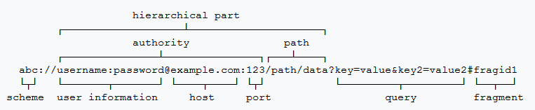

> 参考：[Android 这 13 道 ContentProvider 面试题，你都会了吗？](https://hornhuang.blog.csdn.net/article/details/102979418)
> 
> 参考：《`Android` 开发艺术探索》 第 `9.5` 节（`ContentProvider` 的工作过程）
> 
> 参考：[内容提供者程序](https://developer.android.google.cn/guide/topics/providers/content-providers)
> 
> 参考：[`<provider>`](https://developer.android.google.cn/guide/topics/manifest/provider-element)>

## 1. `ContentProvider` 概述

`ContentProvider` 是一种内容共享型组件，实现了不同 `App` 进程之间的数据共享。

和 `Messenger` 一样，基于 `ContentProvider` 的进程间通信的底层实现同样也是 `Binder`。

当 `ContentProvider` 所在的进程启动时，`ContentProvider` 组件会同时启动并被发布到 `AMS` 进程中。

### 1.1 `ContentProvider` 组件的优势

相比于直接访问数据库，`ContentProvider` 具有如下优势：

1. `ContentProvider` 对外提供统一的 `CRUD` 接口，使得外界可以按照统一的方式访问不同来源提供的数据，而不用关心这些数据是怎么来的。（数据可以来源于数据库、`xml` 文件、网络请求等）

2. `ContentProvider` 提供一种可跨进程的数据共享方式。

3. `ContentProvider` 提供了数据更新时的通知机制。即：当 `ContentProvider` 所在进程中的数据更新时，访问这些数据的其他进程可以通过 `ContentProvider` 收到相关的通知。

### 1.2 `ContentProvider` & `ContentResolver`

`ContentProvider` 组件主要是用于进程间的数据共享的。其中：

1. 提供数据的 `App` 进程中通过 `ContentProvider` 向其他 `App` 进程提供访问数据的 `API` 方法；

2. 访问数据的 `App` 进程中通过 `ContentResolver` 访问提供数据的 `App` 进程中的 `ContentProvider`。

### 1.3 `ContentProvider` 对外提供的数据形式 & 内部的数据存储方式

#### 1.3.1 `ContentProvider` 以表格的形式对外提供数据

`ContentProvider` 主要以表格的形式来组织数据，并且可以包含多个表，这点和数据库很类似。

`ContentProvider` 可以对外提供文件数据，通过将文件的句柄保存在表格中提供给外界。从而让外界可以根据查询到的文件句柄来访问 `ContentProvider` 所提供的文件。

> `Android` 系统所提供的 `MediaStore` 功能就是包含文件类型数据的 `ContentProvider`，详细实现可以参考 `MediaStore`。

#### 1.3.2 `ContentProvider` 对内部的数据存储方式没有任何要求

虽然 `ContentProvider` 对外提供的数据看起来像是来自数据库中的数据，但是 `ContentProvider` 对内部的数据存储方式没有任何要求：我们既可以使用 `SQLite` 数据库；也可以使用普通的文件；甚至可以采用内存中的一个对象来进行数据的存储。

> 也就是说，`ContentProvider` 对外提供的数据，可以是数据库数据、文件数据、内存数据等。

## 2. `ContentProvider` 的使用方式

### 2.1 自定义 `ContentProvider` 的子类

```java:no-line-numbers
/* ContentProvider.java */
/*
    onCreate 代表 ContentProvider 的创建，
    一般来说我们需要在 onCreate 中做一些初始化工作，如获取数据库实例。
    注意：
        1. onCreate 方法在主线程中执行，不允许执行耗时操作，否则会导致 App 进程的启动时间延长。
        2. ContentProvider 的 onCreate 方法的调用时机先于 Application 的 onCreate 方法。
*/
public abstract boolean onCreate();

// 返回一个 Uri 请求所对应的 MIME 类型（媒体类型）。比如：图片（"image/png"）、视频（"video/mp4"）等。
// 如果 ContentProvider 提供的数据不需要配置 MIME 类型，那么可以返回 null 或者 "*/*" 
public abstract String getType(Uri uri);

public abstract Uri insert(Uri uri, ContentValues values);

public abstract int delete(Uri uri, String selection, String[] selectionArgs);

public abstract int update(Uri uri, ContentValues values, String selection, String[] selectionArgs);

public abstract Cursor query(Uri uri, String[] projection,
            String selection, String[] selectionArgs,
            String sortOrder);
```

自定义 `ContentProvider` 子类时需要重写如上的抽象方法，其中 `insert`/`delete`/`update`/`query` 方法对应于 `CRUD` 操作，即实现对数据表的增删改查功能。

### 2.2 注册 `ContentProvider` 子类 & 相关属性解读

```xml:no-line-numbers
<provider android:authorities="list"
          android:directBootAware="true|false"
          android:enabled="true|false"
          android:exported="true|false"
          android:grantUriPermissions="true|false"
          android:icon="drawable resource"
          android:initOrder="integer"
          android:label="string resource"
          android:multiprocess="true|false"
          android:name="string"
          android:permission="string"
          android:process="string"
          android:readPermission="string"
          android:syncable="true|false"
          android:writePermission="string">

    <grant-uri-permission android:path="string"
                      android:pathPattern="string"
                      android:pathPrefix="string" />

</provider>
```

其中：

1. `<provider>`

    ```:no-line-numbers
    包含于 <application> 标签中，用来注册自定义的 ContentProvider。
    ```

2. `android:authorities`

    ```:no-line-numbers
    是 ContentProvider 的唯一标识，提供给外界用来访问当前注册的 ContentProvider。
    建议命名时加上包名前缀。
    当声明了多个唯一标识时，用分号 ";" 分隔开
    ```

3. `android:directBootAware`

    ```:no-line-numbers
    ContentProvider 是否可感知直接启动（direct-boot）；即，它是否可以在用户解锁设备之前运行。
    ```

4. `android:enabled`

    ```:no-line-numbers
    系统是否可以实例化 ContentProvider。true 可以；false 不可以。默认 true。
    ```

5. `android:permission`

    ```:no-line-numbers
    其他 App 需要申请该属性指定的权限后才能读写 ContentProvider 提供的数据
    ```

6. `android:readPermission`

    ```:no-line-numbers
    其他 App 需要申请该属性指定的权限后才能读 ContentProvider 提供的数据
    当 permission 和 readPermission 同时存在时，读权限取决于 readPermission；写权限取决于 permission
    ```

7. `android:writePermission`

    ```:no-line-numbers
    其他 App 需要申请该属性指定的权限后才能写 ContentProvider 提供的数据
    当 permission 和 writePermission 同时存在时，写权限取决于 writePermission；读权限取决于 permission
    ```

8. `android:exported`

    ```:no-line-numbers
    true 表示允许其他 App 在申请了 permission/readPermission/writePermission 指定权限的情况下访问 ContentProvider

    false 表示不允许其他 App 访问 ContentProvider。只能在如下情况下访问 ContentProvider：
        1. 同一个 App 进程中；
        2. 其他具有相同 userId 的进程中；
        3. 注册 ContentProvider 时设置了属性 android:grantUriPermissions = true，
            使得其他 App 进程可以获取一次性访问 ContentProvider 的临时权限。
    ```

9.  `android:grantUriPermissions`

    ```:no-line-numbers
    true 表示允许其他 App 获取一次性访问此 ContentProvider 所提供的所有数据的临时权限。
        所谓临时权限，就如打开刚安装的 App 时，会弹框向用户询问是否允许某个权限，并为用户提供了几种选项：
                     1. 始终允许；2. 使用期间允许；3. 仅本次使用时允许；3. 禁止。（不同手机可能存在区别）
            而临时权限就相当于选择了 "2. 仅本次使用时允许"，即在本次访问 ContentProvider 之后，就不再拥有权限了，
            当下次再访问时，仍然会询问用户是否允许权限。即：临时权限就是允许用户一次性地访问。

    false 不允许其他 App  获取一次性访问此 ContentProvider 所提供的所有数据的临时权限。（默认值）
        但是，此情况下，我们还可以通过 <provider> 下的子标签 <grant-uri-permission> 声明
        指定路径下的数据是可以让其他 App 在临时权限下一次性访问的。
    ```

10. `<grant-uri-permission>`

    ```xml:no-line-numbers
    在 android:grantUriPermissions = false 的情况下，
    可以通过此标签来声明指定路径下的某些或某一数据仍然可以让其他 App 在临时权限下一次性访问的。
    此标签下的三个属性都是用来指定数据的路径的，但一个 <grant-uri-permission> 标签只能指定一个路径，
    也就是说，一个标签中只能使用以下三个属性中的一个：
    1. android:path：某一数据的完整路径
    2. android:pathPrefix：某些数据的公共路径
    3. pathPattern：包含通配符的完整路径
    ```

### 2.3 其他进程中通过 `ContentResolver` 来访问 `ContentProvider`

```java:no-line-numbers
/* Context.java */
public abstract ContentResolver getContentResolver();
```

`ContentResolver` 提供的用于访问 `ContentProvider` 的方法，与 `ContentProvider` 子类重写的方法基本一样。事实上，`ContentResolver` 内部就是通过基于 `binder` 机制的跨进程通信来调用 `ContentProvider` 对应的方法的。

```java:no-line-numbers
/* ContentResolver.java */
String getType(Uri url)

Uri insert(Uri url, ContentValues values)

int delete(Uri url, String where, String[] selectionArgs)

int update(Uri uri, ContentValues values, String where, String[] selectionArgs)

Cursor query( // query(uri, projection, selection, selectionArgs, sortOrder, null);
        Uri uri, 
        String[] projection, 
        String selection, String[] selectionArgs, 
        String sortOrder)

Cursor query(
        Uri uri, 
        String[] projection, 
        String selection, String[] selectionArgs, 
        String sortOrder, 
        CancellationSignal cancellationSignal) {

    Bundle queryArgs = createSqlQueryBundle(selection, selectionArgs, sortOrder);
    return query(uri, projection, queryArgs, cancellationSignal);
}

Cursor query(
        Uri uri, 
        String[] projection, 
        Bundle queryArgs, 
        CancellationSignal cancellationSignal)
```

### 2.4 `ContentProvider` 的数据更新通知机制

#### 2.4.1 在其他 App 中通过 ContentResolver 监听数据的更新

```java:no-line-numbers
/* ContentResolver.java */
/*
    当参数 Uri 标识的 ContentProvider 中的与 Uri 的 path 部分匹配的数据更新时，
    参数 observer 的 onChange 方法就会回调。

    参数 notifyForDescendants 为 false 表示监听与 Uri 的 path 路径完全匹配的数据的更新，
        或者与 path 路径的父路径匹配的数据的更新。
    参数 notifyForDescendants 为 true 表示还会监听与 Uri 的 path 下的子路径匹配的数据的更新。
*/
void registerContentObserver(Uri uri, boolean notifyForDescendants, ContentObserver observer)

void unregisterContentObserver(ContentObserver observer)
```

当 `ContentProvider` 中的数据发生变更时（如调用了 `ContentProvider` 的 `insert`/`delete`/`update`），需要在 `ContentProvider` 中调用 `ContentResolver` 的 `notifyChange` 方法。于是，其他 `App` 中通过 `ContentResolver` 的 `registerContentObserver` 方法注册的 `ContentObserver` 才会收到通知（即才会回调 `onChange` 方法）。

```java:no-line-numbers
/* ContentObserver.java */
/*
    回调方法 onChange 会在 Handler 线程中执行，
    如果传入 null，不指定 Handler，那么回调方法 onChange 会在 Binder 线程中执行。
*/
public ContentObserver(Handler handler)

/*
    当在 ContentProvider 中调用 ContentResolver.nofityChange(Uri, null) 方法后，
    其他 App 中的注册了的对 Uri 进行监听的 ContentObserver 的 onChange 方法就会回调。

    ContentObserver 提供了如下三个重载的 onChange 方法：
    1. 首先回调的是 onChange(selfChange, uri, userId) 
    2. 在 onChange(selfChange, uri, userId) 中只是调用了 onChange(selfChange, uri) 
    3. 在 onChange(selfChange, uri) 中只是调用了 onChange(selfChange) 
    需要用到哪些参数，就重写带哪些参数的 onChange 方法。
*/

public void onChange(boolean selfChange, Uri uri, int userId)

public void onChange(boolean selfChange, Uri uri)

public void onChange(boolean selfChange)
```

#### 2.4.2 在 `ContentProvider` 中通过 `ContentResolver` 发送数据更新的通知

在调用 `ContentProvider` 的 `update`、`insert`、`delete` 方法后，一般会引起数据源的改变。
此时，可以在 `ContentProvider` 中调用 `ContentResolver` 的 `notifyChange` 方法向其他 `App` 进程发出数据更新的通知。

> 可以通过 `ContentProvider` 组件中的上下文 `Context` 对象获取 `ContentResolver` 实例。
> 
> 即在  `ContentProvider` 中调用 `getContext().getContentResolver()` 方法获取 `ContentResolver` 实例。

```java:no-line-numbers
/* ContentResolver.java */
/*
    此方法一般在 ContentProvider 中的 insert、update、delete 方法内操作完数据后调用，
    用于向其他 App 进程发出数据更新的通知。
	
    参数 observer 一般传 null，表示其他 App 进程中只要调用 ContentResolver.registerContentObserver 方法，
    注册了的监听此 Uri 的 ContentObserver 都会收到通知，即都会回调 onChange 方法。
*/
public void notifyChange(Uri uri, ContentObserver observer)
```

## 3. `ContentProvider` 的 `Uri` 结构 & 通过 `UriMatcher` 管理多个 `path`

### 3.1 `Uri` 结构 & 操作 `Uri` 的 `API` 方法

通常的 `Uri` 的结构如下所示：



对于唯一标识 `ContentProvider` 的 `Uri`，由上图中的三部分组成：

1. `scheme`：
   
    ```:no-line-numbers
    ContentProvider 的 Uri 的 scheme 固定为 content。即：ContentProvider 的 Uri 的开头部分固定为 "content://"
    ```

2. `authority`：

    ```:no-line-numbers
    ContentProvider 的 Uri 的 authority 在注册 ContentProvider 时通过属性 android:authorities 声明
    ```

3. `path`：

    ```:no-line-numbers
    ContentProvider 的 Uri 的 path 部分，用来指定所要访问的数据具体是哪些数据。

    path 部分可以指定访问一张表中的所有数据，如访问 user 表的 Uri 为：
        "content://authority/user" 

    path 部分也可以指定访问一张表中的一条数据，如访问 user 表中 id 为 1 的那条数据的 Uri 为：
        "content://authority/user/1" 

    总之，path 部分是完全自定义的，从 ContentResolver 传过来的 Uri 中将 path 解析出来后，
    与我们在 ContentProvider 中已自定义好的 path 常量进行匹配，即可知道外界需要访问的是什么数据。
    ```

`Uri.java` 提供了如下的 `API` 来对 `Uri` 进行操作：

```java:no-line-numbers
/* Uri.java */
/*
    将符合 Uri 结构的字符串转换成 Uri 对象
*/
public static Uri parse(String uriString)

/*
    返回表示一个文件的 Uri 对象
*/
public static Uri fromFile(File file)

/* 
    获取 Uri 中的 scheme 部分
*/
public abstract String getScheme();

/* 
    获取 Uri 中的 authority 部分
*/
public abstract String getAuthority();

/* 
    获取 Uri 中的 path 部分
*/
public abstract String getPath();
```

### 3.2 通过 `UriMatcher` 管理多个 `path`

`UriMatcher` 的作用就是对 `Uri` 中的 `path` 部分进行标识，用标识码（`code`）来表示不同的 `path`。

使用 `UriMatcher` 可以简化对 `Uri` 的解析，直接将 `Uri` 传给 `UriMatcher` 就能获取到对应不同 `path` 的标识码（`code`）。

于是，根据自定义的标识码（`code`）在 `ContentProvider` 内部查询对应的数据即可。

`UriMatcher.java` 提供的 `API` 方法如下：

```java:no-line-numbers
/* UriMatcher.java */
/*
    传入 UriMatcher.NO_MATCH 即可。（NO_MATCH = -1）
    参数 code 表示当调用 match(Uri) 方法时，如果 Uri 中不存在 authority 和 path 部分，则返回此 code
*/
public UriMatcher(int code)

/*
    将参数 authority 和 path 注册到 UriMatcher 对象中，并用参数 code 标记这条注册记录。

    当调用 match(Uri) 方法时，
        如果传入的 Uri 的 authority 和 path 与已注册的 authority 和 path 匹配，则返回匹配的注册记录的标记 code
        如果传入的 Uri 的 authority 和 path 不与任何一条注册记录匹配，则返回 -1（即返回 NO_MATCH）
*/
public void addURI(String authority, String path, int code)

public int match(Uri uri)
```

## 4. `ContentProvider` 的生命周期方法：`onCreate`

`ContentProvider` 只有一个 `onCreate()` 生命周期方法。

`ContentProvider.onCreate` 方法会在 `ContentProvider` 所在的进程启动时调用一次。且调用时机优先于 `Application.onCreate` 方法。

> 注意：`ContentProvider` 的 `onCreate` 方法在整个进程的生命周期中只会被回调一次。

## 5. `ContentProvider` 的工作线程

### 5.1 `onCreate` 方法在主线程中执行

`ContentProvider` 的 `onCreate` 在主线程中执行，且优先于 `Application` 的 `onCreate` 方法执行，所以在 `ContentProvider` 的 `onCreate` 方法中不能做耗时操作，否则会使 `App` 的启动变慢。

### 5.2 `query`/`update`/`insert`/`delete`/`getType` 在 `Binder` 线程中执行

由于 `query`/`update`/`insert`/`delete`/`getType` 是在 `Binder` 线程中执行的，所以调用这些方法并不会阻塞 `ContentProvider` 所在进程的主线程。

但是，如果其他 `App` 进程中通过 `ContentResolver` 的 `query`/`update`/`insert`/`delete`/`getType` 方法访问 `ContentProvider` 时，是在主线程中执行的，那么其他 `App` 进程的主线程就可能会阻塞。

因此，其他 `App` 进程中通过 `ContentResolver` 访问 `ContentProvider` 时仍然需要在子线程中进行访问。

> 也就是说，使用 `ContentResolver` 发起的 `query`/`update`/`insert`/`delete`/`getType` 这些 `binder` 调用，是会阻塞线程的。

### 5.3 `ContentProvider` 的线程安全问题

`query`、`update`、`insert`、`delete` 这些方法是在 `Binder` 线程池中提供的 `Binder` 线程中执行的，因此会存在多线程并发访问的情况，所以这些方法内部需要做好线程同步。

当 `ContentProvider` 中的数据都保存在一个 `SQLiteDatabase` 中时，因为 `SQLiteDatabase` 内部对数据库的操作是有同步处理的，所以可以正确应对多线程的情况。

> 但是如果通过多个 `SQLiteDatabase` 对象来操作数据库就无法保证线程同步，因为 `SQLiteDatabase` 对象之间无法进行线程同步。

如果 `ContentProvider` 中的数据是保存在内存中的，如保存在同一个 `List` 容器中，那么这种情况下对 `List` 容器的遍历、插入、删除操作就需要进行线程同步，否则就会引起多线程并发问题。

## 6. 其他 `API`

### 6.1 `ContentValues`

### 6.2 `Cursor`

## 7. 示例


