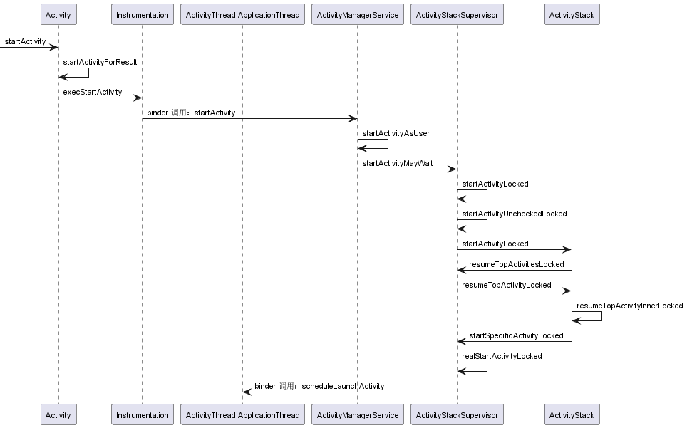
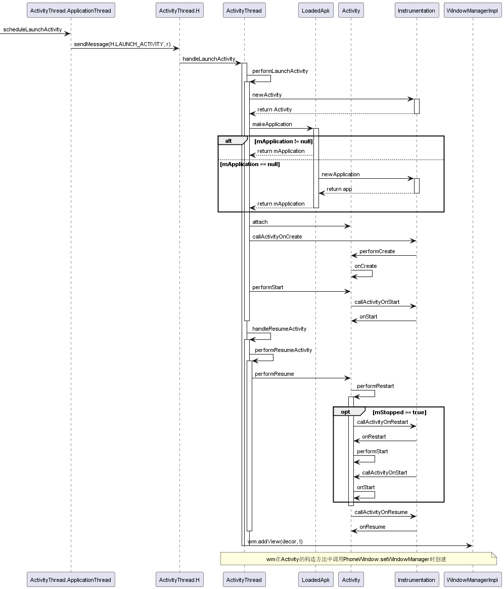
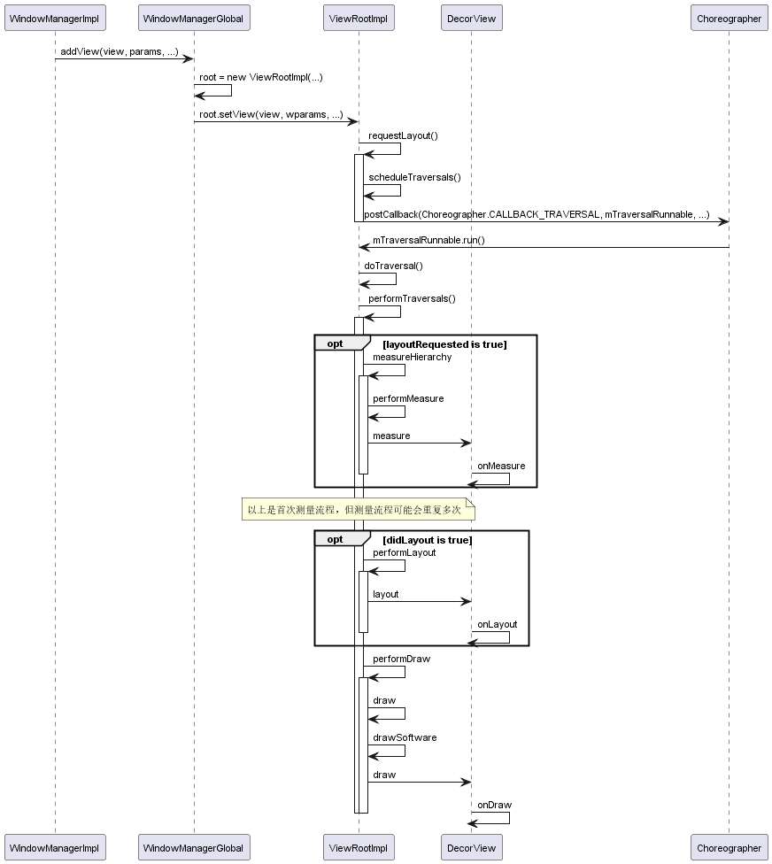

**基于Android 6.0**

## 从启动 `Activity` 到 `UI` 绘制的时序图

从 `startActivity` 到 `scheduleLaunchActivity`

从 `scheduleLaunchActivity` 到 `addView`

> 执行 `wm.addView(decor, l)` 时，开始进入 `UI` 的绘制流程，也就是说，`UI` 的绘制是在执行完 `Activity.onResume` 方法之后才开始的。

> `Android 6.0` 中，`DecorView` 还是 `PhoneWindow` 的内部类

## `Window`，`ViewRootImpl`，`DecorView` 三者的关系

## `VSync` 信号 和 `Choreographer` 编舞者

### 屏幕刷新机制

## `UI`绘制中的测量过程

### `MeasureSpec`

### 多次测量的原因

## `UI`绘制中的布局过程

## `UI`绘制中的绘画过程

## `Surface` 和 `Canvas` 的作用