## 1. 蓝牙 `4.0`（`BLE`）概述

1. 蓝牙 `4.0` 就是 `BLE`（低功耗蓝牙）；

2. 低功耗、低成本（蓝牙芯片成本低）、低延迟；

3. 兼容不同厂商的设备交互；

    > 经典蓝牙中，安卓和苹果设备无法进行交互，不同品牌手机直接的交互存在兼容问题。

4. 完全向下兼容（即兼容经典蓝牙）；

5. `BLE` 的主打功能是快速搜索、快速连接、超低功耗保持连接和传输数据；

6. 弱点是数据传输速率低；

7. 由于 `BLE` 的低功耗特点，因此普遍用于穿戴设备。

## 2. 应用场景

### 2.1 `iBeacon` 技术

`2013` 年 `9` 月苹果公司发布了 `iBeacon` 技术。

`ShellBeacon`、`BrightBeacon` 在基于 `iBeacon` 技术和运用蓝牙 `4.0` 标准为通信方式的前提下，提供了一整套基于 `iBeacon` 的技术解决方案和便于开发的 `SDK`。


### 2.2 蓝牙防丢器

蓝牙 `4.0` 防丢器即：智能蓝牙（`Smart Bluetooth`）防丢器。

采用最新蓝牙 `4.0` 技术，专门为 `iPhone`/`iPad` 设计的防丢器。

简单轻巧的设计，方便携带。

工作原理主要是通过距离变化来判断物品是否还控制在你的安全范围。


## 3. `SensorTag` 开发套件

`SensorTag` 是德州仪器（`TI`）为其公司生产的蓝牙芯片所提供的开发套件。

即 `SensorTag` 作为开发套件，集成了蓝牙芯片和一些传感器元件。

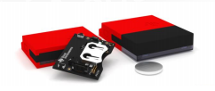

手机通过蓝牙连接到 `SensorTag` 后，就可以读写 `SensorTag` 中的传感器数据。

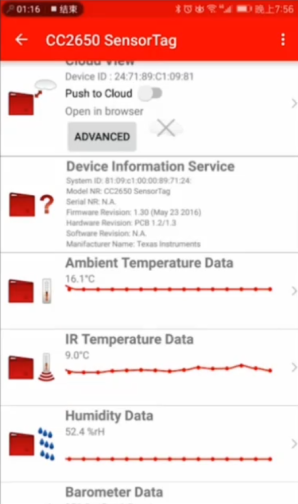

上图所示就是 `TI` 为 `SensorTag` 开发套件提供的 `App`，手机上运行 `SensorTag App`，开启蓝牙并连接 `SensorTag`，就可以通过蓝牙 `4.0` 读取 `SensorTag` 中的服务（即每个列表 `item` 项）。

## 4. `GAP`（`Generic Access Profile` 通用访问配置文件）

### 4.1 `GAP` 作用

1. 控制设备的连接和广播；

2. 控制设备是否被其他设备可见；

3. 决定设备是否可以与其他设备进行交互，以及怎样与其他设备进行交互。

    > 例如：`Beacon` 设备只能向外广播，不支持连接。小米手环就可以与作为中心设备的其他设备连接。

### 4.2 设备角色：外围设备（`Peripheral`） & 中心设备（`Central`）

`GAP` 给设备定义了若干角色，其中主要的两个是：

1. 外围设备（`Peripheral`）：一般是非常小或简单的低功耗设备，用来提供数据，并连接到一个相对更强大的中心设备。

    > 如：小米手环、`SensorTag` 等就是作为外围设备。

2. 中心设备（`Central`）：相对比较强大，用来连接其它外围设备。

    > 如：手机就是作为中心设备。
    >
    > 对于外围设备 `SensorTag`，运行了 `SensorTag App` 的手机就是作为中心设备。

### 4.3 广播

#### 4.3.1 外围设备向外广播数据的两种方式

`GAP` 为外围设备定义了两种向外广播数据的方式：

1. 广播数据（`Advertising Data Payload`）：广播数据是必需的。外围设备必需不停地向外广播，以便让中心设备知道它的存在。

2. 扫描回复数据（`Scan Response Data Payload`）：扫描回复是可选的。中心设备可以向外围设备请求扫描回复。扫描回复数据中包含一些设备额外的信息（如设备的名字）。

> 外围设备在广播数据或扫描回复数据时，数据最长可以包含 `31` 字节（`byte`）

#### 4.3.2 广播的工作流程

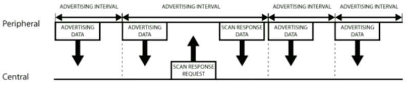

如上图所示的 `GAP` 的广播工作流程中，可以清晰地看出广播数据和扫描回复数据是怎样工作的。其中，外围设备会设定一个广播间隔，每个广播间隔中，外围设备会重新发送自己的广播数据。

> 广播间隔越长，越省电，但同时也不太容易扫描到。

#### 4.3.3 广播的网络拓扑结构

外围设备向外广播数据的使用场景有两种：

1. 通过广播数据让中心设备发现自己，然后建立 `GATT` 连接，从而在连接的基础上进行更多的数据交互。

    > 一个外围设备同时只能与一个中心设备建立 `GATT` 连接，即连接后的数据交互是一对一的。

2. 仅仅只是将数据向外广播出去，**不需要与中心设备建立连接**。

    > 对于外围设备广播出去的数据，是可以被多个中心设备接收到的，即广播数据的交互是一对多的。
    >
    > 基于广播数据的交互方式最典型的应用就是苹果的 `iBeacon`。

广播数据的工作模式下的网络拓扑图如下所示：

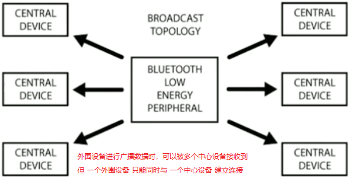

## 5. `GATT`（`Generic Attribute Profile` 通用属性配置文件）

### 5.1 `GATT` 概述

低功耗蓝牙（`BLE`）连接都是建立在 `GATT` 协议之上的。

`GATT` 是一个在蓝牙连接之上的发送和接收很短的数据段的通用规范。这些很短的数据段被称为属性（`Attribute`）。

在两个建立了连接的 `BLE` 设备之间进行通信时，`GATT` 定义 `Service` 和 `Characteristic` 这两种数据结构进行数据交互。

`GATT` 使用了 `ATT` 协议（`Attribute Protocol`），`ATT` 协议将 `Service` 和 `Characteristic` 以及对应的数据保存在一个查找表中。

> 查找表使用占 `16 bit` 的 `ID` 作为每一项的索引。

### 5.2 `GATT` & `GAP` 的关系

只有在两个设备建立起连接之后，`GATT` 才开始起作用。这意味着必需先完成 `GAP` 协议。

> `GAP` 协议的内容包括：发现（扫描）设备、连接设备等。

实际上，在 `Android` 开发中，可以直接使用设备的 `mac` 地址发起连接，而不需要经过扫描的步骤。但是，这并不意味着不需要经过 `GAP`，因为在芯片级别上已经完成了扫描。也就是说：蓝牙芯片发起连接之前，总是得先扫描设备，只有扫描到了设备后才会发起连接。

### 5.3 `GATT` 连接是独占的 & `GATT` 连接的网络拓扑图 

`GATT` 连接是独占的，这意味着一个 `BLE` 外围设备只能同时被一个中心设备连接。

**一旦外围设备被连接，该外围设备就会马上停止广播**。于是，被连接了的外围设备对其他设备就不可见了。当连接断开后，该外围设备又可以开始广播了。

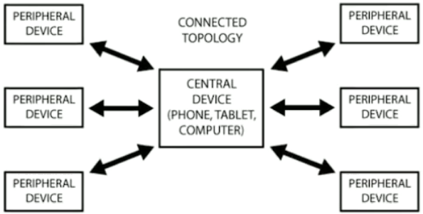

从如上图所示的 `GATT` 连接的网络拓扑结构中可以看出：**一个外围设备只能连接一个中心设备，而一个中心设备可以连接多个外围设备**。

一旦建立起了连接，通信就是双向的了，对比 `GAP` 中广播的网络拓扑结构可以看出：**`GAP` 通信是单向的**。

**注意**：

1. 中心设备和外围设备需要双向通信时，唯一的方式就是建立 `GATT` 连接；

2. 如果要让两个外围设备能相互通信，只能通过中心设备进行中转。

### 5.4 `GATT` 通信事务 & 数据交互流程

`GATT` 通信的双方是 `C/S` 关系：

1. 外围设备（`Peripheral`）作为 `GATT` 服务端（`Server`）：维持了 `ATT` 的查找表，以及 `Service` 和 `Characteristic` 数据结构的定义。

2. 中心设备（`Central`）作为 `GATT` 客户端（`Client`）：向 `Server` 发起请求。

**所有的通信事务，都是由 `GATT` 客户端发起的**，因此 `GATT` 客户端也称为主设备（`Master`）；`GATT` 服务端用于接收并处理主设备发起的通信事务，因此 `GATT` 服务端也称为从设备（`Slave`）。即：

1. 主设备发起通信事务，并接收从设备响应的事务处理结果；
2. 从设备接收并处理事务，然后将事务处理结果发送给主设备。

> 注意：
>
> 1. 外围设备 <=> `GATT` 服务端 <=> 从设备，即：`Peripheral` <=> `Server` <=> `Slave`
> 
> 2. 中心设备 <=> `GATT` 客户端 <=> 主设备，即：`Central` <=> `Client` <=> `Master`
> 
> 其中，外围设备/中心设备是 `GAP` 中的称呼。
> 
> `GATT` 服务端/`GATT` 客户端，或从设备/主设备是 `GATT` 中的称呼。

一旦连接建立，外围设备将会给中心设备建议一个连接间隔（`Connection Interval`）。这样，中心设备就会在每个连接间隔尝试去重新连接，检测是否有新的数据。

> 注意：这个连接间隔只是一个建议，你的中心设备可能并不会严格按照这个间隔来执行，例如：中心设备正忙于连接其它的外围设备；或中心设备资源太忙。

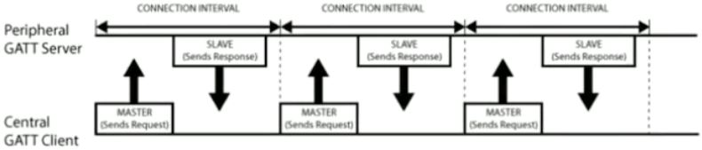

从如上图所示的外围设备（`GATT` 服务端）和中心设备（`GATT` 客户端）之间的数据交互流程中可以看出：每次都是主设备（中心设备）发起请求的。

### 5.5 `GATT` 结构

`GATT` 事务是建立在嵌套的 `Profile`、`Service`、`Characteristic` 之上的，如下图所示：

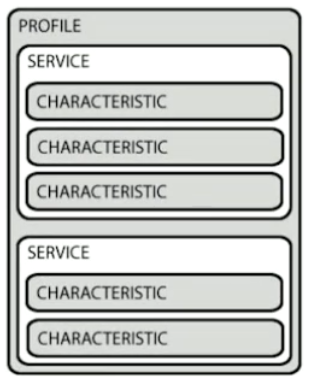

其中，更详细的 `Characteristic` 结构如下图所示：

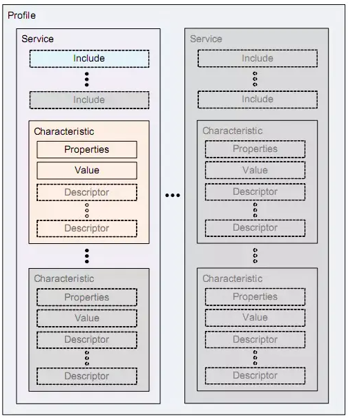

#### 5.5.1 `Profile`

`Profile` 并不是实际存在于 `BLE` 外围设备上的。

`Profile` 只是一个被 `Bluetooth SIG` 或者外围设备的设计者所预先定义的 **`Service` 集合**。

> 如：心率 `Profile`（`Heart Rate Profile`）就是 `Heart Rate Service` 和 `Device Information Service` 的集合。

> `Bluetooth SIG` 即：`Bluetooth Special Interest Group` 蓝牙技术联盟。

#### 5.5.2 `Service`

`Service` 是把数据分成一个个的独立逻辑项。`Service` 中包含一个或多个 `Characteristic`。

每个 `Service` 都有一个 `UUID` 唯一标识。

> `UUID` 可包括 `16 bit` 的和 `128 bit` 的。其中：
> 
> 1. `16 bit` 的 `UUID` 是官方通过认证的，需要花钱购买；
> 
> 2. `128 bit` 的 `UUID` 是自定义的，可以自己随便设置。

> 另外，官方还定义了一些标准的 `Service`，如 `Heart Rate Service`。

#### 5.5.3 `Characteristic`

`Characteristic` 是 `GATT` 事务中的最小逻辑单元。

与 `Service` 类似，每个 `Characteristic` 都有一个 `UUID` 唯一标识（可以是 `16 bit` 或 `128 bit`）。

`Bluetooth SIG`（蓝牙技术联盟）定义了一些标准的 `Characteristic`（免费使用），使用这些标准的 `Characteristic` 可以保证软件和硬件能相互兼容。

> 当然，可以自定义 `Characteristic`。这样的话，就只有你自己开发的软件和外设能够识别 `Characteristic`，进行通信。

中心设备（`GATT` 客户端）和外围设备（`GATT` 服务端）主要是通过 `Characteristic` 进行数据交互。即：你可以从 `Characteristic` 中读取数据，也可以向 `Characteristic` 中写入数据，从而实现双向通信。

## 6. `BLE` 的开发流程

### 6.1 申请蓝牙相关的权限

需要申请三个静态权限：

```xml:no-line-numbers
<uses-permission android:name="android.permission.BLUETOOTH"/>
<uses-permission android:name="android.permission.BLUETOOTH_ADMIN"/>
<uses-permission android:name="android.permission.ACCESS_COARSE_LOCATION" />
```

需要向应用市场告知：该 `App` 需要用到 `BLE`。（如果手机设备不支持 `BLE`，那么无法在应用市场下载该 `App`）

> `uses-feature` 仅仅只是描述 `App` 会用到什么功能，并不会去申请相关的权限。

```xml:no-line-numbers
<uses-feature android:name="android.hardware.bluetooth.le"
    android:required="true" />
```

需要动态申请 `ACCESS_COARSE_LOCATION` 定位权限：

```java:no-line-numbers
private void requestPermission() {
    if (PackageManager.PERMISSION_GRANTED == ContextCompat.checkSelfPermission(this, Manifest.permission.ACCESS_COARSE_LOCATION)) {
        //has permission, do operation directly
    } else {
        //do not have permission
        // Should we show an explanation?
        if (ActivityCompat.shouldShowRequestPermissionRationale(this, Manifest.permission.ACCESS_COARSE_LOCATION)) {
            // Show an explanation to the user *asynchronously* -- don't block
            // this thread waiting for the user's response! After the user
            // sees the explanation, try again to request the permission.
        } else {
            // No explanation needed, we can request the permission.
            ActivityCompat.requestPermissions(this, new String[]{Manifest.permission.ACCESS_COARSE_LOCATION}, 0);
            // MY_PERMISSIONS_REQUEST_READ_CONTACTS is an
            // app-defined int constant. The callback method gets the
            // result of the request.
        }
    }
}
```

### 6.2 检查手机是否支持蓝牙设备 & 以及是否支持蓝牙 `4.0`（`BLE`）功能

```java:no-line-numbers
/* BleActivity.java */
@Override
protected void onCreate(Bundle savedInstanceState) {
    ...
    requestPermission();
    
    final BluetoothManager bluetoothManager = (BluetoothManager) getSystemService(Context.BLUETOOTH_SERVICE);

    // bluetoothManager.getAdapter() 返回的 adapter 就是 BluetoothAdapter.getDefaultAdapter() 返回的。
    mBluetoothAdapter = bluetoothManager.getAdapter();

    /*
        BLE（低功耗蓝牙）也是蓝牙的一种，所以也得先判断手机是否具有蓝牙功能：
            如果拿不到 BluetoothAdapter 对象，那么说明手机不支持蓝牙功能。从而更别说支持 BLE 了。
    */
    if (mBluetoothAdapter != null) {
        showToast("手机支持蓝牙功能");
    } else {
        finish();
    }

    /*
        如果手机支持蓝牙功能，那么还需要进一步判断是否具有 BLE 特性（即是否支持 BLE）。
    */
    if (!getPackageManager().hasSystemFeature(PackageManager.FEATURE_BLUETOOTH_LE)) {
        showToast("手机不支持蓝牙BLE功能");
        finish();
    } else {
        showToast("手机支持蓝牙BLE功能!");
    }
}
```

### 6.3 打开蓝牙功能

```java:no-line-numbers
/* BleActivity.java */
@Override
protected void onResume() {
    super.onResume();
    /*
        如果手机支持蓝牙功能，那么在使用蓝牙前，需要先判断有没有打开蓝牙功能。
        没有的话，则跳转到系统设置中将蓝牙功能打开。
    */
    if (mBluetoothAdapter != null && !mBluetoothAdapter.isEnabled()) {
        //申请打开蓝牙功能
        Intent enableBtIntent = new Intent(BluetoothAdapter.ACTION_REQUEST_ENABLE);
        startActivity(enableBtIntent);
    }
}
```

### 6.4 扫描附近的设备

获取扫描器 `BluetoothLeScanner` 对象 & 设置扫描相关的配置参数：

```java:no-line-numbers
/* BleActivity.java */
private BluetoothLeScanner mLeScanner;
private ScanSettings mScanSettings;

@Override
protected void onCreate(Bundle savedInstanceState) {
    ...
    if (Build.VERSION.SDK_INT >= Build.VERSION_CODES.LOLLIPOP) {
        /*
            1. 扫描模式 SCAN_MODE_LOW_LATENCY 表示低延迟的扫描方式，也就是占空比最大的扫描方式。其中：
               占空比就是在一个扫描周期中，扫描持续的工作时长占整个周期时长的比例。
               占空比越高，说明一个扫描周期中，扫描的持续工作时间越长。因此，扫描速度越快。
            2. setReportDelay(3000) 表示在扫描到设备后，延迟 3s 上报（即触发回调函数）
            3. ScanSettings 对象在调用 BluetoothLeScanner.startScan 方法开始扫描时，作为实参传入。
        */
        mLeScanner = mBluetoothAdapter.getBluetoothLeScanner();
        mScanSettings = new ScanSettings.Builder()
                .setScanMode(ScanSettings.SCAN_MODE_LOW_LATENCY)
                .setReportDelay(3000).build();
    }
    ...
}
```

开始扫描 & 停止扫描：

```java:no-line-numbers
/* BleActivity.java */
@Override
protected void onCreate(Bundle savedInstanceState) {
    ...
    mBtScan = (Button) findViewById(R.id.bt_scan);
    mBtScan.setOnClickListener(new View.OnClickListener() {
        @Override
        public void onClick(View view) {
            if (!mIsScanStart) { // 点击按钮开始扫描，并在下一次点击按钮之前将按钮文本改为 “停止扫描”
                mBtScan.setText("停止扫描");
                mIsScanStart = true;
                scan(true);
            } else {             // 点击按钮停止扫描，并在下一次点击按钮之前将按钮文本改为 “开始扫描”
                mBtScan.setText("开始扫描");
                mIsScanStart = false;
                scan(false);
            }
        }
    });
    ...
}

@TargetApi(23)
private void scan(boolean enable) {
    final ScanCallback scanCallback = new ScanCallback() {
        /*
            当扫描到蓝牙设备时，触发回调方法 ScanCallback.onScanResult(int, ScanResult)
            注意：
                1. 每扫描到一个蓝牙设备触发一次回调
                2. 参数 ScanResult 中封装了扫描到的蓝牙设备 BluetoothDevice 对象
        */
        @Override
        public void onScanResult(int callbackType, ScanResult result) {
            super.onScanResult(callbackType, result);
            BluetoothDevice device = result.getDevice();
            Log.d(TAG, "name = " + device.getName() + ", address = " + device.getAddress());
            mBleTextView.setText(device.getName() + " - " + device.getAddress());
            mBleAddress = device.getAddress();
        }
    };

    if (enable) {
        mLeScanner.startScan(null, mScanSettings, scanCallback); // 开始扫描
    } else {
        mLeScanner.stopScan(scanCallback); // 停止扫描
    }
}
```

> 从 `BluetoothLeScanner.startScan` 方法源码中的文档注释可以看出：调用 `startScan` 方法需要 `BLUETOOTH_ADMIN` 和 `ACCESS_FINE_LOCATION` 权限。

### 6.5 连接 & 断开 `BLE` 设备

`step1`：先获取扫描到的蓝牙设备的 `mac` 地址 `address`

```java:no-line-numbers
/* BleActivity.java */
private String mBleAddress = "";

@TargetApi(23)
private void scan(boolean enable) {
    final ScanCallback scanCallback = new ScanCallback() {
        @Override
        public void onScanResult(int callbackType, ScanResult result) {
            BluetoothDevice device = result.getDevice();
            // 获取扫描到的蓝牙设备的 mac 地址
            mBleAddress = device.getAddress();
        }
    };
    if (enable) {
        mLeScanner.startScan(null, mScanSettings, scanCallback);
    } else {
        mLeScanner.stopScan(scanCallback);
    }
}
```

`step2`：调用 `BluetoothAdapter.getRemoteDevice(address)` 方法，根据 `mac` 地址得到远程蓝牙设备的 `BluetoothDevice` 对象

`step3`：调用 `BluetoothDevice.connectGatt(context, autoConnect, callback)` 方法请求连接远程蓝牙设备

`step4`：当远程蓝牙设备连接或断开时，会触发 `connectGatt` 方法中参数 `callback` 的回调方法 `onConnectionStateChange`

```java:no-line-numbers
/* BleActivity.java */
@Override
protected void onCreate(Bundle savedInstanceState) {
    ...
    mConnectButton = (Button) findViewById(R.id.bt_connect);
    mConnectButton.setOnClickListener(new View.OnClickListener() {
        @Override
        public void onClick(View view) {
            if (!mIsConnected) {
                connect();
            } else {
                disconnect();
            }
        }
    });
    ...
}

private BluetoothGatt mGatt;
private boolean connect() {
    // step2. 根据 mac 地址得到远程蓝牙设备（即外围设备）的 BluetoothDevice 对象
    final BluetoothDevice device = mBluetoothAdapter.getRemoteDevice(mBleAddress);
    // step3. 请求连接远程蓝牙设备
    mGatt = device.connectGatt(this, false, mCallback);
    if (mGatt != null) {
        return true;
    } else {
        return false;
    }
}
```

```java:no-line-numbers
/* BleActivity.java */
private void disconnect() { // 断开与远程蓝牙设备的连接
    if (mGatt != null) {
        mGatt.disconnect();
    }
}
```

```java:no-line-numbers
/* BleActivity.java */
private final BluetoothGattCallback mCallback = new BluetoothGattCallback() {
    @Override
    public void onConnectionStateChange(BluetoothGatt gatt, int status, int newState) {
        // step4. 当远程蓝牙设备连接或断开时，会触发回调方法 onConnectionStateChange
        mMainUIHandler.sendEmptyMessage(newState);
    }

    @Override
    public void onServicesDiscovered(BluetoothGatt gatt, int status) {}

    @Override
    public void onCharacteristicRead(BluetoothGatt gatt, BluetoothGattCharacteristic characteristic, int status) {}

    @Override
    public void onCharacteristicWrite(BluetoothGatt gatt, BluetoothGattCharacteristic characteristic, int status) {}

    @Override
    public void onCharacteristicChanged(BluetoothGatt gatt, BluetoothGattCharacteristic characteristic) {}

    ...
};

private final Handler mMainUIHandler = new Handler(Looper.getMainLooper()) {
    @Override
    public void handleMessage(Message msg) {
        super.handleMessage(msg);
        int newState = msg.what;
        if (newState == BluetoothProfile.STATE_CONNECTED) { // 远程蓝牙设备已连接
            ...
        } else if (newState == BluetoothProfile.STATE_DISCONNECTED) { // 远程蓝牙设备已断开
            ...
        }
    }
};
```

注意：

1. 调用 `BluetoothDevice.connectGatt(context, autoConnect, callback)` 方法连接远程蓝牙设备时，`BluetoothGattCallback` 类型的参数 `callback` 提供了一系列回调方法，用于监听蓝牙设备的连接状态、数据读写等操作；

2. `BluetoothGattCallback` 中的回调方法是在 `binder` 线程中调用的，因此不能直接在回调方法中更新 `UI`；

3. `connectGatt` 方法的返回值为 `BluetoothGatt` 对象，可用于操作已连接上的远程蓝牙设备（如：断开连接、读写数据等）。

### 6.6 发现（查询）蓝牙设备的 `Service` 和 `Characteristic`（特征值）

当中心设备（即 `GATT` 客户端，如运行 `SensorTag App` 的手机）与外围设备（即 `GATT` 服务端，如 `SensorTag`）建立起 `GATT` 连接后，可调用 `BluetoothGatt.discoverServices()` 方法查询外围设备提供的服务列表（[`Profile`](#_5-5-1-profile) 是 `Service` 的集合，即查询外围设备的 `Profile`）。

当查询到服务列表时，会执行 `BluetoothGattCallback` 的回调函数 `onServiceDiscoverd`。

```java:no-line-numbers
/* BleActivity.java */
@Override
protected void onCreate(Bundle savedInstanceState) {
    ...
    mDiscoveryButton.setOnClickListener(new View.OnClickListener() {
        @Override
        public void onClick(View view) {
            if (mGatt != null) {
                /*
                    mGatt 是在连接外围设备时调用 `BluetoothDevice.connectGatt` 方法返回的。
                    调用 mGatt.discoverServices() 方法获取外围设备中的 Profile（即 Service 集合）
                */
                mGatt.discoverServices();
            }
        }
    });
    ...
}
```

```java:no-line-numbers
/* BleActivity.java */
private final BluetoothGattCallback mCallback = new BluetoothGattCallback() {
    ...
    @Override
    public void onServicesDiscovered(BluetoothGatt gatt, int status) {
        /*
            1. 当中心设备查询到外围设备中的 Profile 时，会通过该回调方法接收一个封装了 Profile 的参数 gatt
            2. 自定义 discoverGattService(services) 方法，遍历外围设备的 Profile 中的 Service 集合。
        */
        discoverGattService(gatt.getServices());
    }
    ...
};

private void discoverGattService(List<BluetoothGattService> services) {
    if (services == null)
        return;

    for (BluetoothGattService service : services) {

        /*
            遍历 Profile 中 Service 集合内的每个 Service，并打印 Service 的 UUID
        */
        String uuid = service.getUuid().toString();
        Log.d(TAG, "Service uuid = " + uuid);

        /*
            每个 Service 中包含一个或多个 Characteristic（特征值），
            遍历 Service 中包含的所有 Characteristic，并打印每个 Characteristic 的 UUID
        */
        List<BluetoothGattCharacteristic> characteristics = service.getCharacteristics();
        for (BluetoothGattCharacteristic characteristic : characteristics) {
            String char_uuid = characteristic.getUuid().toString();
            Log.d(TAG, "Characteristic uuid = " + char_uuid);
        }
    }
}
```

### 6.7 示例 1：特征值中的描述符（`BluetoothGattDescriptor`）

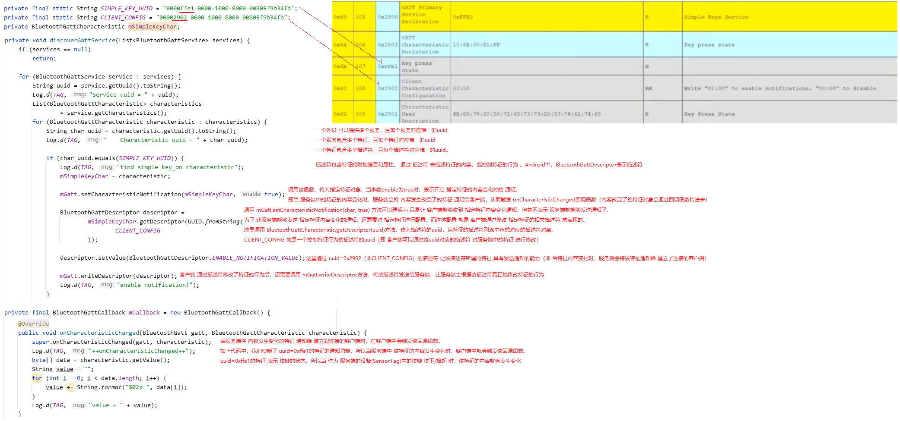

### 6.8 示例 2：与红外温度传感器（外围设备）的数据交互

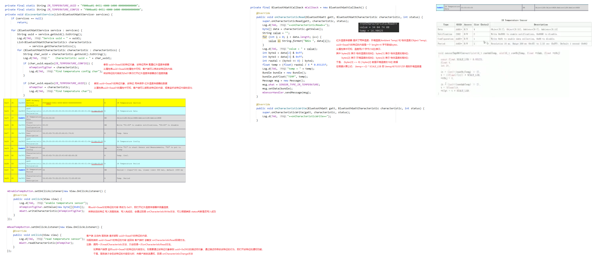

### 6.9 示例 3：`SensorTag` 属性表（基于 `ATT` 协议的查找表）

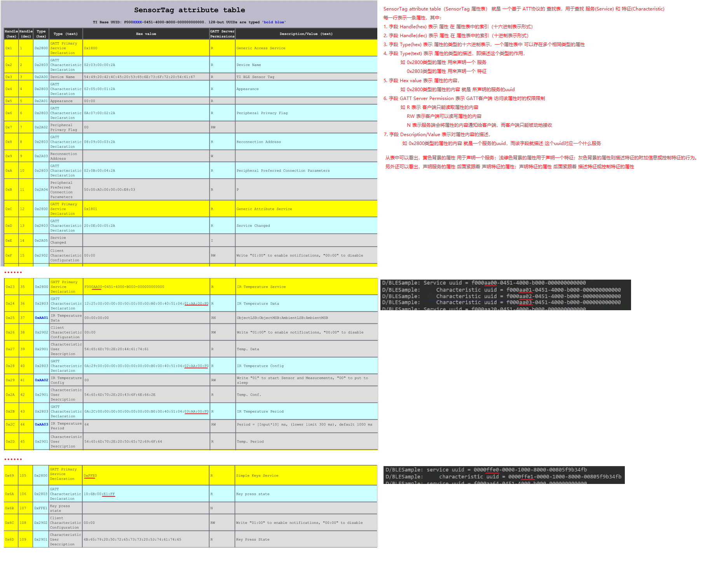