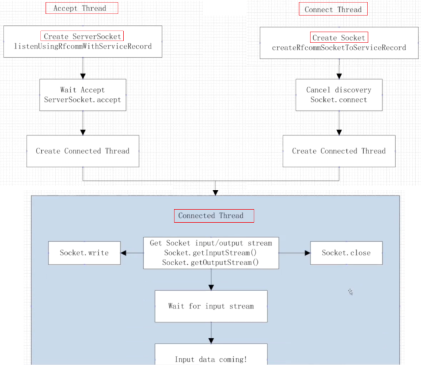

> 参考：`Android相关【公众号：启舰杂谈】\14、Android强化：服务与通信\步骤二：Android App通信\第4课：经典蓝牙`

## 1. 概述

以蓝牙聊天室案例为基础，介绍如何在 `Android` 中使用经典蓝牙。

> 参考：`https://github.com/android/connectivity-samples`

## 2. 经典蓝牙的开发步骤

### 2.1 设置蓝牙权限：BLUETOOTH & BLUETOOTH_ADMIN

```xml:no-line-numbers
<uses-permission android:name="android.permission.BLUETOOTH"/>
<uses-permission android:name="android.permission.BLUETOOTH_ADMIN"/>
```

在执行如下操作时，需要 `BLUETOOTH` 和 `BLUETOOTH_ADMIN` 权限：

1. 请求连接；
2. 接受连接；
3. 传输数据；
4. 启动设备发现；
5. 操作蓝牙设置
6. ...

### 2.2 获取 `BluetoothAdapter`

使用经典蓝牙时，需要用到 `BluetoothAdapter`，表示当前设备自身的蓝牙适配器。

`BluetoothAdapter` 是一个单例类，提供静态方法 `getDefaultAdapter()` 返回一个 `BluetoothAdapter` 实例。

```java:no-line-numbers
public static synchronized BluetoothAdapter getDefaultAdapter() {
    if (sAdapter == null) {
        IBinder b = ServiceManager.getService(BLUETOOTH_MANAGER_SERVICE);
        if (b != null) {
            IBluetoothManager managerService = IBluetoothManager.Stub.asInterface(b);
            sAdapter = new BluetoothAdapter(managerService);
        } else {
            Log.e(TAG, "Bluetooth binder is null");
        }
    }
    return sAdapter;
}
```

注意：如果 `BluetoothAdapter.getDefaultAdapter()` 返回 `null`，那么表示当前设备不支持蓝牙（**既不支持经典蓝牙也不支持低功耗蓝牙**）。

```java:no-line-numbers
/* BluetoothAdapter.java */
BluetoothAdapter adapter = BluetoothAdapter.getDefaultAdapter();

// If the adapter is null, then Bluetooth is not supported
if (adapter == null) {
    // 此时可以退出蓝牙相关的界面
}
```

### 2.3 请求启动蓝牙

#### 2.3.1 检查是否已启动蓝牙：`BluetoothAdapter.isEnabled()`

```java:no-line-numbers
/* BluetoothAdapter.java */
boolean isEnabled()
```

调用 `BluetoothAdapter` 对象的 `isEnabled()` 方法来检查是否启动了蓝牙：
1. `isEnabled()` 方法返回 `false` 表示未启动蓝牙，蓝牙处于停用状态；
2. `isEnabled()` 方法返回 `true` 表示启动了蓝牙。

#### 2.3.2 请求跳转至系统设置中启动蓝牙：`ACTION_REQUEST_ENABLE`

当 `BluetoothAdapter` 对象的 `isEnabled()` 方法返回 `false` 时，可以通过 `BluetoothAdapter.ACTION_REQUEST_ENABLE` 请求跳转至系统设置中启动蓝牙：

```java:no-line-numbers
/* BluetoothChatFragment.java */
private static final int REQUEST_ENABLE_BT = 3;

if (!adapter.isEnabled()) {
    Intent enableIntent = new Intent(BluetoothAdapter.ACTION_REQUEST_ENABLE);
    startActivityForResult(enableIntent, REQUEST_ENABLE_BT);
}
```

### 2.4 查找配对的设备

```java:no-line-numbers
/* BluetoothAdapter.java */
Set<BluetoothDevice> getBondedDevices()
```

调用 `BluetoothAdapter` 对象的 `getBondedDevices()` 方法返回已配对的蓝牙设备集合。

### 2.5 发现（扫描）设备

#### 2.5.1 扫描设备 & 停止扫描 & 判断是否正在扫描

```java:no-line-numbers
/* BluetoothAdapter.java */
// 发现过程通常包括大约 12 秒的查询扫描，然后对每个新设备进行页面扫描，以检索其蓝牙名称。 
boolean startDiscovery()
```

调用 `BluetoothAdapter` 对象的 `startDiscovery()` 方法开始扫描附近的蓝牙设备。

示例：

```java:no-line-numbers
/* DeviceListActivity */

// If we're already discovering, stop it
if (adapter.isDiscovering()) {
    adapter.cancelDiscovery();
}

// Request discover from BluetoothAdapter
adapter.startDiscovery();
```

> **注意**：在调用 `startDiscovery()` 方法开始扫描设备之前，需要先调用 `isDiscovering()` 方法来判断当前是否正在扫描。如果当前正在扫描，那么应该先调用 `cancelDiscovery()` 方法停止当前的扫描，然后才能调用 `startDiscovery()` 方法重新开始扫描。

#### 2.5.2 通过监听广播的方式获取扫描时的状态信息

调用 `startDiscovery()` 方法开始扫描设备后，通过监听广播的方式进行回调：

```java:no-line-numbers
/* BluetoothAdapter.java */

// 开始扫描设备时的回调
public static final String ACTION_DISCOVERY_STARTED = "android.bluetooth.adapter.action.DISCOVERY_STARTED";

// 结束扫描设备时的回调
public static final String ACTION_DISCOVERY_FINISHED = "android.bluetooth.adapter.action.DISCOVERY_FINISHED";
```

```java:no-line-numbers
/* BluetoothDevice.java */

// 扫描到（发现）设备时的回调
public static final String ACTION_FOUND = "android.bluetooth.device.action.FOUND";
```

示例：

```java:no-line-numbers
/* DeviceListActivity */
// 监听扫描到（发现）设备时的广播
IntentFilter filter = new IntentFilter(BluetoothDevice.ACTION_FOUND);
this.registerReceiver(mReceiver, filter);

// 监听结束扫描设备时的广播
filter = new IntentFilter(BluetoothAdapter.ACTION_DISCOVERY_FINISHED);
this.registerReceiver(mReceiver, filter);
```

```java:no-line-numbers
/* DeviceListActivity */
private final BroadcastReceiver mReceiver = new BroadcastReceiver() {
    @Override
    public void onReceive(Context context, Intent intent) {
        String action = intent.getAction();

        if (BluetoothDevice.ACTION_FOUND.equals(action)) {
            
            BluetoothDevice device = intent.getParcelableExtra(BluetoothDevice.EXTRA_DEVICE); // 获取扫描到的蓝牙设备
            
            if (device.getBondState() != BluetoothDevice.BOND_BONDED) { // 判断扫描到的蓝牙设备是否已配对
                /*
                    TODO 记录未配对设备的相关信息，将其显示在列表中
                */
            }
        } else if (BluetoothAdapter.ACTION_DISCOVERY_FINISHED.equals(action)) {
            /*
                TODO：
                    1. 结束扫描后，如果没发现任何未配对设备，应该给出提示信息
                    2. 结束扫描后，如果发现了未配对设备，提示用户从列表中选择一个进行连接
            */
        }
    }
};
```

#### 2.5.3 让设备处于可被发现的状态 & `ScanMode`

如果设备 `A` 在调用了 `startDiscovery()` 方法后开始扫描附近的设备时未发现任何设备，但实际上附加确实有一个设备 `B` 存在，那么设备 `B` 很可能处于不可发现的状态。

因此在扫描附近的设备 `B` 之前，需要先在设备 `B` 上进行设置，让设备 `B` 自身处于可被发现的状态：

```java:no-line-numbers
/* BluetoothChatFragment */

/*
    注意：
    设备 A 和 设备 B 运行同一个 App 程序，
    当设备 A 调用 `startDiscovery()` 发起扫描时，ensureDiscoverable() 方法应该是在设备 B 中执行的，
    即让设备 B 处于可被发现的状态。
*/
private void ensureDiscoverable() {
    /*
        SCAN_MODE 分三类：
        1. SCAN_MODE_NONE：当前设备既不会被远程设备发现；又不能和远程设备连接。
        2. SCAN_MODE_CONNECTABLE：当前设备不会被远程设备发现；但能和远程设备连接。（适用于当前设备已配对的情况）
        3. SCAN_MODE_CONNECTABLE_DISCOVERABLE：当前设备既会被远程设备发现；又能和远程设备连接。
    */
    if (mBluetoothAdapter.getScanMode() != BluetoothAdapter.SCAN_MODE_CONNECTABLE_DISCOVERABLE) {
        Intent discoverableIntent = new Intent(BluetoothAdapter.ACTION_REQUEST_DISCOVERABLE);
        /*
            设置设备在 300s 的时间内是可被发现的（默认是 120s，设置的值不能超过 300s）。
        */
        discoverableIntent.putExtra(BluetoothAdapter.EXTRA_DISCOVERABLE_DURATION, 300);
        startActivity(discoverableIntent);
    }
}
```

> 注意：在设备 `A` 与设备 `B` 之间通过蓝牙相互发送聊天消息时，设备 `A` 与设备 `B` 中是同时在运行同一个 `App` 程序的。

### 2.6 连接设备

#### 2.6.1 将设备设置为服务器设备

以蓝牙聊天为例：

1. 设备 `A` 发送消息给设备 `B` 时，设备 `A` 作为客户端设备，设备 `B` 作为服务器设备；

2. 设备 `B` 发送消息给设备 `A` 时，设备 `B` 作为客户端设备，设备 `A` 作为服务器设备。

也就是说，设备 `A` 与设备 `B` 相互发送消息时，要将这两个设备都设置为服务器设备（`SDP` 服务端）。

将蓝牙设备作为 `SDP` 服务端时（`SDP` 服务发现协议）：

1. 需要向本地 `SDP` 服务器（`local SDP server`）注册一个服务记录（`Service Record`），即调用 `BluetoothAdapter.listenUsingRfcommWithServiceRecord(name, uuid)` 方法向本地 `SDP` 服务器注册一个服务记录，其中：

    ```:no-line-numbers
    1. 参数 name 是自定义的服务记录的名称；
    2. 参数 uuid 是自定义的服务记录的唯一标识；
    3. listenUsingRfcommWithServiceRecord 方法返回一个 BluetoothServerSocket 对象。
    ```

2. 调用 `BluetoothServerSocket` 对象的 `accept()` 方法监听 `SDP` 客户端的连接请求。

#### 2.6.2 客户端设备（本地设备）连接到服务器设备（远程设备）

接收消息的设备作为服务器端（`SDP` 服务端，即远程设备），发送消息的设备作为客户端设备（`SDP` 客户端，即本地设备）。

当作为 `SDP` 客户端的蓝牙设备想与作为 `SDP` 服务端的蓝牙设备通信时：

1. 首先在作为 `SDP` 客户端的蓝牙设备上发现（扫描）附近的作为 `SDP` 服务端的蓝牙设备，从而拿到作为 `SDP` 服务端的蓝牙设备的 `mac` 地址；

2. 在作为 `SDP` 客户端的蓝牙设备上，调用 `BluetoothAdapter.getRemoveDevice(address)` 方法，传入作为 `SDP` 服务端的蓝牙设备的 `mac` 地址，从而在作为 `SDP` 客户端的蓝牙设备上得到作为 `SDP` 服务端的蓝牙设备的 `BluetoothDevice` 对象；

3. 在作为 `SDP` 客户端的蓝牙设备上调用作为 `SDP` 服务端的蓝牙设备的 `BluetoothDevice` 对象的 `BluetoothDevice.createRfcommSocketToServiceRecord(uuid)` 方法，传入在作为 `SDP` 服务端的蓝牙设备中的已经注册了的服务记录的 `uuid` 值。该方法会返回一个 `BluetoothSocket` 对象，调用返回的 `BluetoothSocket` 对象的 `connect` 方法，从而建立起连接。

#### 2.6.3 总结 & 注意事项

总结：



注意事项：

1. 经典蓝牙的通信是建立在 `Socket`上的；

2. `SDP` 服务端需要将注册的服务记录的 `uuid` 提供给 `SDP` 客户端；

3. `SDP` 客户端需要知道 `SDP` 服务端的 `mac` 地址以及注册的某个服务记录的 `uuid`，才能连接到 `SDP` 服务端。
