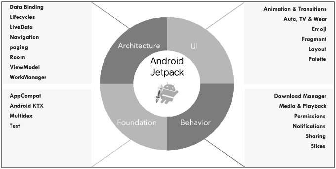

## 1. `Android` 应用程序架构设计标准的缺失概论

当我们要开发一个小型 `Android` 应用程序时，通常会将大部分的代码写在 `Activity`/`Fragment` 中。

> 这些代码包括业务逻辑、数据 `Model`、`UI` 控件等。

针对一个小型项目，将大部分代码写在 `Activity`/`Fragment` 中并没有什么问题，但对于中大型项目而言，随着时间的推移和业务复杂度的增加，`Activity`/`Fragment` 中的代码会变得复杂且难以维护。

因此，我们需要将代码按照功能或类型的不同进行分类，并放到不同的包或类文件中，但又不破坏彼此正常的功能和通信。这在软件开发中叫作 **解耦**。

为了将代码解耦以应对日益膨胀的代码量，工程师在应用程序中引入了 **架构** 的概念。使之在不影响应用程序各模块组件间通信的同时，还能够保持模块的相对独立。这样不仅有利于后期维护，也有利于代码测试。

> 常见的架构有：`MVC`（`Model View Controller`）、`MVP`（`Model View Presenter`）和 `MVVM`（`Model View ViewModel`）。

在 `Android` 应用程序开发中，将 `Activity`/`Fragment` 与布局文件分开就是一种最简单、最基本的 `MVC` 思想。只是它没有很好地解决代码解耦的问题，所以才有了 `MVP` 和 `MVVM`。

`Google` 官方并没有推出关于 `Android` 应用程序架构设计的标准，因此，世界各地的工程师只能自己创造各种解决方案，但这些方案都面临着以下问题：

1. 由于不是 `Google` 官方解决方案，所以可能引入未知问题，更重要的是担心这些解决方案后期是否有开发者持续跟进维护。

2. 不确定所使用的架构是否真的是最佳方案。因此在选择架构方案时，不仅增加了学习成本，还可能最终导致他们开发出的应用程序质量参差不齐。

## 2. 什么是 `Jetpack`

`Jetpack` 是 `Google` 为了解决 `Android` 架构问题而引入的，但实际上 `Jetpack` 能做的不止这些。

> 按照 Google 官方的说法：`Jetpack` 是一套库、工具和指南，可以帮助开发者更轻松地编写应用程序。`Jetpack` 中的组件可以帮助开发者遵循最佳做法、摆脱编写样板代码的工作并简化复杂的任务，以便他们能将精力集中放在业务所需的代码上。

`Jetpack` 主要包括 `4` 个方面，分别是:

1. 架构（`Architecture`）
2. 界面（`UI`）
3. 行为（`Behavior`）
4. 基础（`Foundation`）

