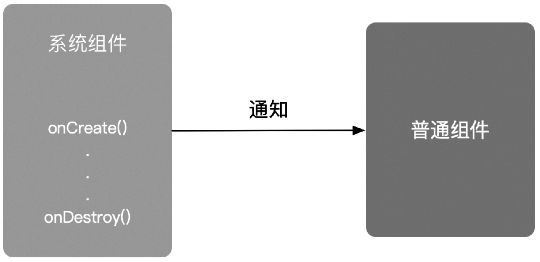

## 1. 生命周期对解耦的影响

解耦是软件开发中永恒的话题。在 `Android` 应用程序开发中，解耦很大程度上表现为：系统组件的生命周期与普通组件之间的解耦。

> 这里的系统组件指的是：`Activity`/`Fragment`、`Service` 和 `Application`。
> 
> 这里的普通组件指的是：为了让代码更容易管理和维护，我们通常会将代码按照功能或作用封装成组件。在本章中，将此类非系统组件称为普通组件（或自定义组件，或简称为组件）。

普通组件无法主动获知系统组件的生命周期事件，但是普通组件在使用过程中通常需要依赖于系统组件的生命周期，因此，不得不在系统组件的生命周期回调方法中，主动对普通组件进行调用或控制。

> 比如：我们经常需要在页面的 `onCreate()` 方法中对组件进行初始化，在 `onPause()` 方法中停止组件，而在页面的 `onDestroy()` 方法中对组件进行资源回收工作。这样的工作非常烦琐，会让页面与组件之间的耦合度变高。但这些工作又不得不做，因为这可能会引发内存泄漏。

## 2. `Lifecycle` 的引入

我们希望我们对自定义组件的管理，不依赖于页面生命周期的回调方法。同时，在页面生命周期发生变化时，也能够及时收到通知。（这在组件化和架构设计中显得尤为重要）

为此，`Google` 提供了 `Lifecycle` 作为解决方案。`Lifecycle` 可以帮助开发者创建可感知生命周期的组件。这样，组件便能够在其内部管理自己的生命周期，从而降低模块间的耦合度，并降低内存泄漏发生的可能性。

> 注意：`Lifecycle` 不仅可以作用于 `Activity`/`Fragment`，还可以在 `Service` 和 `Application` 中起作用。



## 3. 使用 `Lifecycle` 监听 `Activity`/`Fragment` 的生命周期

### 3.1 `Lifecycle` 的原理（基于观察者模式）

`Lifecycle` 通过观察者模式实现对页面生命周期的监听。

`Jetpack` 为我们提供了两个类：`LifecycleOwner`（被观察者）和 `LifecycleObserver`（观察者）。

```java:no-line-numbers
/* LifecycleOwner.java */
public interface LifecycleOwner {
    Lifecycle getLifecycle();
}
```

```java:no-line-numbers
/* LifecycleObserver.java */
public interface LifecycleObserver {}
```

`Activity` 作为被观察者，默认实现了 `LifecycleOwner` 接口。重写了 `getLifecycle()` 方法，返回 `Lifecycle` 的子类 `LifecycleRegistry` 对象。

```java:no-line-numbers
/*
    AppCompatActivity extends FragmentActivity extends ComponentActivity
*/
public class ComponentActivity extends Activity implements LifecycleOwner, KeyEventDispatcher.Component {

    private LifecycleRegistry mLifecycleRegistry = new LifecycleRegistry(this);

    @Override
    public Lifecycle getLifecycle() {
        return mLifecycleRegistry;
    }
}
```

`Lifecycle` 类提供 `addObserver(LifecycleObserver)` 将观察者 `LifecycleObserver` 绑定到被观察者 `LifecycleOwner`（即 `Activity`）上。

观察者 `LifecycleObserver` 只是一个标记接口，不提供任何对生命周期的监听方法。`Lifecycle` 会在被观察者 `LifecycleOwner` 的生命周期方法调用时，发送对应的事件（即 `Lifecycle.Event` 的枚举值），观察者 `LifecycleObserver` 的实现类通过定义被注解 `@OnLifecycleEvent(Lifecycle.Event.XXX)` 修饰的方法来接收生命周期方法对应的事件，从而实现对生命周期的监听。

```java:no-line-numbers
/* Lifecycle.java */
/*
    androidx.lifecycle.LifecycleRegistry 继承了 Lifecycle
*/
public abstract class Lifecycle {
    @MainThread
    public abstract void addObserver(@NonNull LifecycleObserver observer);

    @MainThread
    public abstract void removeObserver(@NonNull LifecycleObserver observer);

    public abstract State getCurrentState();

    public enum State {
        DESTROYED,   // 在 onDestroy 方法执行前（即将要执行时）设置为此状态
        INITIALIZED, // 在构造方法执行后，onCreate 方法执行前设置为此状态
        CREATED,     // 在 onCreate 方法执行后，onStop 方法执行前设置为此状态
        STARTED,     // 在 onStart 方法执行后，onPause 方法执行前设置为此状态
        RESUMED;     // 在 onResume 方法执行后设置为此状态

        /*
            若当前 State（this）>= 参数 State，则返回 true，否则返回 false
            （DESTROYED < INITIALIZED < CREATED < STARTED < RESUMED）
        */
        public boolean isAtLeast(@NonNull State state) {
            return compareTo(state) >= 0;
        }
    }

    public enum Event {
        ON_CREATE,  // 执行生命周期方法 onCreate 时发送该事件
        ON_START,   // 执行生命周期方法 onStart 时发送该事件
        ON_RESUME,  // 执行生命周期方法 onResume 时发送该事件
        ON_PAUSE,   // 执行生命周期方法 onPause 时发送该事件
        ON_STOP,    // 执行生命周期方法 onStop 时发送该事件
        ON_DESTROY, // 执行生命周期方法 onDestroy 时发送该事件
        ON_ANY      // 执行任何生命周期方法时发送该事件
    }
}
```

### 3.2  示例：使用 `Lifecycle` 监听 `Activity` 的生命周期

未使用 `Lifecycle` 的写法：

```java:no-line-numbers
public class MainActivity extends AppCompatActivity {
    @Override
    protected void onCreate(Bundle savedInstanceState) {
        // 初始化位置管理器
        initLocationManager();
    }

    @Override
    protected void onResume() {
        // 开始获取用户的地理位置
        startGetLocation();
    }

    @Override
    protected void onPause() {
        // 停止获取用户的地理位置
        stopGetLocation();
    }
}
```

使用 `Lifecycle` 的写法：

```java:no-line-numbers
/*
    实现 LifecycleObserver 接口，定义观察者类 MyLocationListener
*/
public class MyLocationListener implements LifecycleObserver {
    public MyLocationListener(Activity context) {
        // 初始化位置管理器
        initLocationManager(); 
    }

    // 当 Activity 中回调 onResume() 方法时，执行该方法
    @OnLifecycleEvent(Lifecycle.Event.ON_RESUME)
    private void startGetLocation() {
        ...
    }

    // 当 Activity 中回调 onPause() 方法时，执行该方法
    @OnLifecycleEvent(Lifecycle.Event.ON_PAUSE)
    private void stopGetLocation() {
        ...
    }
}
```

```java:no-line-numbers
public class MainActivity extends AppCompatActivity {

    private MyLocationListener myLocationListener;

    @Override
    protected void onCreate(Bundle savedInstanceState) {
        ...
        myLocationListener = new MyLocationListener(this);
        
        // 通过 Lifecycle 将观察者 myLocationListener 与被观察者 MainActivity 绑定
        getLifecycle().addObserver(myLocationListener);
    }
}
```

### 3.3 使用 `Lifecycle` 监听 `Fragment` 生命周期

`Fragment` 同样也默认实现了 `LifecycleOwner` 接口，因此，可以像监听 `Activity` 的生命周期那样，对 `Fragment` 的生命周期进行监听。

```java:no-line-numbers
/* Fragment.java */
public class Fragment implements ComponentCallbacks, OnCreateContextMenuListener, LifecycleOwner, ViewModelStoreOwner {

    LifecycleRegistry mLifecycleRegistry = new LifecycleRegistry(this);

    @Override
    public Lifecycle getLifecycle() {
        return mLifecycleRegistry;
    }
}
```

## 4. 使用 `LifecycleService` 监听 `Service` 的生命周期

`Android` 提供了一个名为 `LifecycleService` 的类，对 `Service` 生命周期进行监听，从而达到 `Service` 与组件解耦的目的。

`LifecycleService` 继承自 `Service`，并实现了 `LifecycleOwner` 接口：

```java:no-line-numbers
/* LifecycleService.java */
public class LifecycleService extends Service implements LifecycleOwner {

    private final ServiceLifecycleDispatcher mDispatcher = new ServiceLifecycleDispatcher(this);

    @Override
    public Lifecycle getLifecycle() {
        return mDispatcher.getLifecycle();
    }
}
```

```java:no-line-numbers
/* ServiceLifecycleDispatcher.java */
public class ServiceLifecycleDispatcher {
    private final LifecycleRegistry mRegistry;

    public ServiceLifecycleDispatcher(@NonNull LifecycleOwner provider) {
        mRegistry = new LifecycleRegistry(provider);
    }

    public Lifecycle getLifecycle() {
        return mRegistry;
    }
}
```

查看 `LifecycleService` 和 `ServiceLifecycleDispatcher` 的源码可知：

1. `LifecycleService.onCreate()` 方法执行时会通过 `Lifecycle` 发送 `ON_CREATE` 事件；
   
2. `LifecycleService.onBind()` 方法执行时会通过 `Lifecycle` 发送 `ON_START` 事件；
   
3. `LifecycleService.onStart()` 方法执行时会通过 `Lifecycle` 发送 `ON_START` 事件；

    > 在父类 `Service` 中，`onStartCommand()` 方法中默认调用了 `onStart()` 方法。
    > 
    > 所以在 `LifecycleService` 中，在 `onStart()` 方法中发送 `ON_START` 事件即可，不需要在 `onStartCommand()` 方法中再发送一次。

4. `LifecycleService.onDestroy()` 方法执行时会通过 `Lifecycle` 先后发送 `ON_STOP` 和 `ON_DESTROY` 事件。

也就是说，在 `Lifecycle` 监听 `Service` 的生命周期时，观察者 `LifecycleObserver` 只会接收到 `ON_CREATE`、`ON_START`、`ON_DESTROY` 这三个事件。

示例：

```java:no-line-numbers
public class MyService extends LifecycleService {
    private MyServiceObserver myServiceObserver;

    public MyService() {
        myServiceObserver = new MyServiceObserver();

        // 将观察者 myServiceObserver 与被观察者 MyService 绑定
        getLifecycle().addObserver(myServiceObserver);
    }
}
```

```java:no-line-numbers
public class MyServiceObserver implements LifecycleObserver {
    // 当 Service 中回调 onCreate() 方法时，执行该方法
    @OnLifecycleEvent(Lifecycle.Event.ON_CREATE)
    private void startGetLocation() {
        ...
    }

    // 当 Service 中回调 onDestroy() 方法时，执行该方法
    @OnLifecycleEvent(Lifecycle.Event.ON_DESTROY)
    private void stopGetLocation() {
        ...
    }
}
```

## 5. 使用 `ProcessLifecycleOwner` 监听 `Application` 的生命周期

`Application` 不像 `Activity`、`Fragment`、`Service` 那样，通过实现 `LifecycleOwner` 接口将自身作为被观察者。

`Android` 提供一个实现了 `LifecycleOwner` 接口的单例类 `ProcessLifecycleOwner`。将 `ProcessLifecycleOwner` 作为被观察者，向绑定的观察者 `LifecycleObserver` 发送 `Application` 的生命周期事件。

```java:no-line-numbers
public class ProcessLifecycleOwner implements LifecycleOwner {

    private static final ProcessLifecycleOwner sInstance = new ProcessLifecycleOwner();

    private ProcessLifecycleOwner() {}

    public static LifecycleOwner get() {
        return sInstance;
    }

    private final LifecycleRegistry mRegistry = new LifecycleRegistry(this);

    @Override
    public Lifecycle getLifecycle() {
        return mRegistry;
    }
}
```

查看 `ProcessLifecycleOwner` 的源码可知：

1. `ProcessLifecycleOwner` 是通过 `ContentProvider.onCreate()` 方法来触发 `ON_CREATE` 事件的；

    > `ContentProvider.onCreate()` 方法只会在 `App` 启动时调用一次，即 `ON_CREATE` 事件只会触发一次。

    ```sequence
    participant PLOI as ProcessLifecycleOwnerInitializer
    Note over PLOI: ProcessLifecycleOwnerInitializer extends ContentProvider
    participant PLO as ProcessLifecycleOwner

    PLOI ->> PLOI : onCreate
    PLOI ->> PLO : ProcessLifecycleOwner.init(context)
    PLO ->> PLO : attach(context)
    activate PLO
        PLO ->> PLO : mRegistry.handleLifecycleEvent(Lifecycle.Event.ON_CREATE);
    deactivate PLO
    ```

2. 当 `App` 中第一个 `Activity` 的 `onStart()` 方法调用时，触发 `ON_START` 事件，表示 `App` 进入到前台，可见但不可交互；

3. 当 `App` 中第一个 `Activity` 的 `onResume()` 方法调用时，触发 `ON_RESUME` 事件，表示 `App` 进入到前台，可见且可交互；

4. 当 `App` 中最后一个 `Activity` 的 `onPause()` 方法调用时，触发 `ON_PAUSE` 事件，表示 `App` 退出到后台，但仍然可见；

5. 当 `App` 中最后一个 `Activity` 的 `onStop()` 方法调用时，触发 `ON_STOP` 事件，表示 `App` 退出到后台，且不可见；

6. 特别注意：当 `App` 中最后一个 `Activity` 的 `onDestroy()` 方法调用时，**不会触发** `ON_DESTROY` 事件。

    > `ProcessLifecycleOwner` 中不会发送 `ON_DESTROY` 事件，即无法通过 `ProcessLifecycleOwner` 监听 `App` 是否被杀掉。

注意，在 `ProcessLifecycleOwner` 中：

1. `ON_PAUSE`、`ON_STOP` 事件的触发是通过 `Application.registerActivityLifecycleCallbacks(ActivityLifecycleCallbacks)` 方法对所有的 `Activity` 的生命周期进行监听实现的；

2. `ON_START`、`ON_RESUME` 事件的触发是通过在监听到 `Activity` 的 `onCreate()` 方法时，为 `Activity` 绑定一个 `ReportFragment`，然后通过监听 `ReportFragment` 的生命周期实现的。

示例：

```java:no-line-numbers
public class MyApplication extends Application {
    @Override
    public void onCreate() {
        super.onCreate();
        ProcessLifecycleOwner.get.getLifecycle().addObserver(new ApplicationObserver);
    }
}
```

```java:no-line-numbers
public class ApplicationObserver implements LifecycleObserver {

    @OnLifecycleEvent(Lifecycle.Event.ON_CREATE)
    public void onCreate() {...}

    @OnLifecycleEvent(Lifecycle.Event.ON_START)
    public void onStart() {...}

    @OnLifecycleEvent(Lifecycle.Event.ON_RESUME)
    public void onResume() {...}

    @OnLifecycleEvent(Lifecycle.Event.ON_PAUSE)
    public void onPause() {...}

    @OnLifecycleEvent(Lifecycle.Event.ON_STOP)
    public void onStop() {...}
}
```

总结：

1. `ProcessLifecycleOwner` 主要用来监听 `App` 什么时候进入前台，什么时候退出到后台；

2. `ProcessLifecycleOwner` 不会触发 `ON_DESTROY` 事件，无法监听 `App` 什么时候被杀掉。


