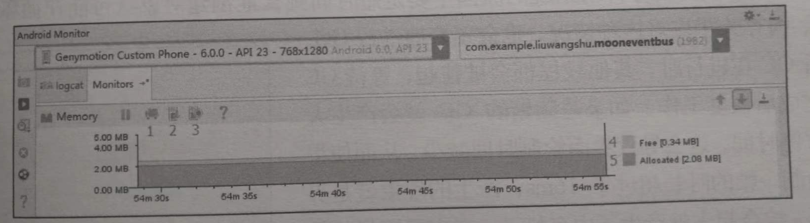
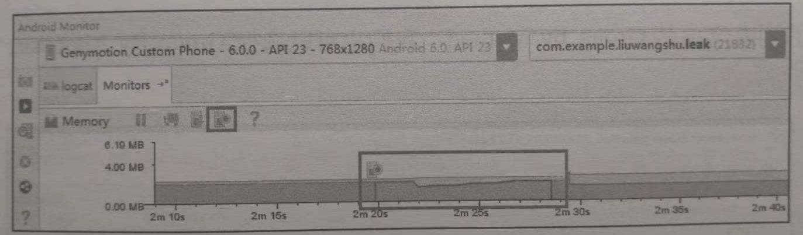

参考 《`Android` 进阶解密》 第 `17` 章（内存优化）

## 1. 避免可控的内存泄漏

内存泄漏是内存优化的重点。

如何避免、发现、解决内存泄漏是非常重要的。

### 1.1 什么是内存泄漏

当内存不足时，`Android` 系统就会触发 `GC`（垃圾回收）。`GC` 时采用根搜索算法来发现垃圾对象。
> 在根搜索算法中，如果一个对象仍然在以 `GCRoots` 为根节点的引用链上，那么该对象是不会被当做垃圾进行回收的。
>
> `GCRoots` 可以理解成像 静态成员变量、未销毁的局部变量等这些所占内存空间不在堆上的变量。

内存泄漏就是指没有用的对象仍然在以 `GCRoots` 为根节点的引用链上，导致这个没有用的对象无法被回收掉，从而一直占用着堆中的内存空间。

### 1.2 内存泄漏的场景

#### 1.2.1 非静态内部类的静态实例

非静态内部类会持有外部类实例的引用，如果非静态内部类的实例是静态的，就会间接地长期维持着外部类的引用，无法被垃圾回收。

```java
public class SecondActivity extends AppCompatActivity {
    private static InnerClass inner;
  
    @Override
    protected void onCreate(Bundle savedInstanceState) {
        super.onCreate(savedInstanceState);
        ...
        findViewById(R.id.bt_next).setOnClickListener(v -> {
            inner = new InnerClass();
            finish();
        });
    }

    class InnerClass {}
}
```

如上代码所示，点击事件发生时，会创建非静态内部类 `InnerClass` 的静态实例 `inner`。在整个应用程序的进程中，静态实例 `inner` 一直存在，所以 `SecondActivity` 一直被 `inner` 持有。从而即使执行完 `SecondActivity.onDestroy` 方法，`SecondActivity` 也无法被垃圾回收。

#### 1.2.2 多线程相关的匿名内部类/非静态内部类

和非静态内部类一样，匿名内部类也会持有外部类实例的引用。因此，对于多线程相关的 `AsyncTask`、`Thread`、`Runnable` 等类，它们的匿名内部类/非静态内部类，如果做耗时操作就可能发生内存泄漏。以 `AsyncTask` 的匿名内部类为例：

```java
public class TaskActivity extends AppCompatActivity {
    @Override
    protected void onCreate(Bundle savedInstanceState) {
        ...
         findViewById(R.id.bt_next).setOnClickListener(v -> {
             startAsyncTask();
             finish();
         });
    }

    void startAsyncTask() {
        new AsyncTask<Void, Void, Void>() {
            protected Void doInBackground(Void... params) {
                while (true);
            }
        }.execute();
    }
}
```

如上代码所示，`AsyncTask` 的实例持有 `TaskActivity` 的引用。且 `AsyncTask` 的异步任务一直在子线程中执行（`while` 死循环），因此，即使 `TaskActivity.onDestroy` 方法执行完，`TaskActivity` 也不会被垃圾回收。

> 同理，自定义的 `AsyncTask` 如果是非静态内部类，也会发生内存泄漏。

解决办法就是自定义一个静态的 `AsyncTask`，如下代码所示：

 ```java
 public class TaskActivity extends AppCompatActivity {
    @Override
    protected void onCreate(Bundle savedInstanceState) {
        ...
         findViewById(R.id.bt_next).setOnClickListener(v -> {
             startAsyncTask();
             finish();
         });
    }

    void startAsyncTask() {
        new MyAsyncTask().execute();
    }

    private static class MyAsyncTask extends AsyncTask<Void, Void, Void> {
        protected Void doInBackground(Void... params) {
            while (true);
        }
    }
}
 ```

#### 1.2.3 `Handler` 内存泄漏

`Handler` 的 `Message` 被存储在 `MessageQueue` 中，有些 `Message` 并不能马上被处理，它们在 `MesaageQueue` 中存在的时间会很长，这就会导致 `Handler` 无法被垃圾回收。如果 `Handler` 是 `Activity` 中的非静态内部类/匿名内部类，则 `Handler` 同样会持有这个 `Activity`，导致这个 `Activity` 无法被垃圾回收。（对 `Service` 也存在同样的情况）

```java
public class MyActivity extends AppCompatActivity {
    @Override
    protected void onCreate(Bundle savedInstanceState) {
        ...
        findViewById(R.id.bt_next).setOnClickListener(v -> {
            mHandler.sendMessageDelayed(Message.obtain(), 60000);
            finish();
        });
    }

    private final Handler mHandler = new Handler() {
        @Override
        public void handleMessage(Message msg) {
            ...
        }
    }
}
```

如上代码所示，`mHandler` 是匿名内部类的实例，它持有外部类 `MyActivity` 的引用。由于发送了一个延迟消息，所以引用了 `mHandler` 的消息在 `MyActivity.onDestroy` 执行完毕后还存在于 `MessageQueue` 中，从而导致被 `mHandler` 持有的 `MyActivity` 无法被垃圾回收。
> 即：由于匿名内部类的实例没有被垃圾回收，所以被匿名内部类所持有的外部类实例也无法被垃圾回收。

有两种解决方案：

1. 使用静态的 `Handler` 内部类，且 `Handler` 需要访问 `MyActivity` 时，采用弱引用的方式持有 `MyActivity` 实例。

    ```java
    public class MyActivity extends AppCompatActivity {
        @Override
        protected void onCreate(Bundle savedInstanceState) {
            ...
            findViewById(R.id.bt_next).setOnClickListener(v -> {
                mHandler.sendMessageDelayed(Message.obtain(), 60000);
                finish();
            });
        }

        private final Handler mHandler = new MyHandler(this);

        private static class MyHandler extends Handler {
            final WeakReference<MyActivity> mWRefActivity;

            MyHandler(MyActivity activity) {
                mWRefActivity = new WeakReference<>(activity);
            }

            @Override
            public void handleMessage(Message msg) {
                ...
            }
        }
    }
    ```

    > `GitHub` 上提供了一个避免内存泄漏的 `Handler` 开源库 `WeakHandler`。地址为：`https://github.com/badoo/android-weak-handler`。

2. 在 `Activity` 的 `onDestroy` 方法中移除 `MessageQueue` 中的消息。

    ```java
    @Override
    public void onDestroy() {
        if (mHandler != null) {
            // 将 Callbacks 和 Messages 全部清除掉
            mHandler.removeCallbacksAndMessages(null);
        }
        super.onDestroy();
    }
    ```

    > 采用这种解决方案，`Handler` 中的消息可能无法全部处理完，因此建议采用第 `1` 种解决方案。

#### 1.2.4 未正确使用 `Context`

对于不是必须使用 `Activity` 作为 `Context` 的情况（`Dialog` 的 `Context` 必须是 `Activity`），我们可以考虑使用 `Application` 来代替 `Activity` 作为 `Context`，这样可以避免 `Activity` 实例引起的内存泄漏，如单例模式中的 `Context`：

```java
public class MyManager {
    private static MyManager sInstance = new MyManager();
    public static MyManager getInstance() {
        return sInstance;
    }

    private Context mAppContext;

    public final void init(Context context) {
        mAppContext = context;
    }
}
```

单例类 `MyManager` 的实例被静态成员变量 sInstance 引用，所以 `MyManager` 实例在 `App` 进程中一直存在。如果通过 `init(context)` 方法传入一个 `Activity` 实例作为 `Context`，那么当 `Activity` 销毁时，`Activity` 实例是无法被垃圾回收的，从而产生内存泄漏。

解决办法是让 `mAppContext` 引用 `Application` 的实例：

```java
public final void init(Context context) {
    mAppContext = context.getApplicationContext();
}
```

#### 1.2.5 静态 `View`

使用静态 `View` 可以避免每次启动 `Activity` 都去读取并渲染 `View`，但静态 `View` 会持有 `Activity` 的引用，导致 `Activity` 无法被回收。

解决办法是在 `Activity.onDestroy` 方法中将静态 `View` 置为 `null`：

```java
public class MyActivity extends AppCompatActivity {
    private static View view;

    @Override
    protected void onCreate(Bundle savedInstancestate) {
        ...
        view = findViewById(R.id.view);
    }

    @Override
    public void onDestroy() {
        view = null;
    }
}
```

#### 1.2.6 `WebView`

不同的 `Android` 版本之间，以及不同厂商的定制 `ROM` 之间，`WebView` 存在着差异（即存在着很大的兼容性问题）。

有的 `Android` 系统中，上层的 `App` 进程中只要使用一次 `WebView`，`WebView` 实例所在的内存就不会被释放掉，即 `WebView` 会出现内存泄漏的问题。

通常的解决办法是为 `WebView` 单开一个子进程，使用 `AIDL` 与 `App` 的主进程进行通信。而 `WebView` 所在的进程可以根据业务需求，在合适的时机进行销毁。

#### 1.2.7 资源对象未关闭

资源对象比如 `Cursor`、`File` 等，往往都使用了缓冲，会造成内存泄漏。因此，在资源对象不使用时，一定要确保它们已经关闭，并将它们的引用置为 `null`。
> 通常在 `finally` 代码块中进行关闭，防止出现异常时资源未被释放的问题。

#### 1.2.8 集合中对象没清理

通常把一些对象的引用加入到了集合中，当不需要该对象时，如果没有把它的引用从集合中清理掉，这个集合就会越来越大。如果这个集合是 `static` 的话，那情况更严重。

#### 1.2.9 `Bitmap` 对象

临时创建的某个相对比较大的 `Bitmap` 对象，在经过变换得到新的 `Bitmap` 对象后，应尽快回收原始的 `Bitmap`，这样能够更快地释放原始 `Bitmap` 所占用的空间。

避免静态变量持有比较大的 `Bitmap` 对象或者其他大的数据对象。如果已经持有，要尽快置空该静态变量。

#### 1.2.10 监听器未关闭`

很多系统（如 `TelephonyManager`、`SensorManager`）需要 `register` 和 `unregister` 监听器。我们需要确保在合适的时候及时 `unregister` 那些监听器。

自己手动添加的 `Listener`，要记得在合适的时候及时移除这个 `Listener`。

## 2. `Memory Monitor`（已被 `Memory Profiler` 取代了）

在 `Android Studio` 中 `Android Monitor` 是一个主窗口，包含了 `Logcat`、`Memory Monitor`、`CPU Monitor`、`GPU Monitor` 和 `Network Monitor`。

其中 `Memory Monitor` 可以轻松地监视应用程序的性能和内存使用情况，以便于找到被分配的对象，定位内存泄漏，并跟踪连接设备中正在使用的内存数量。`Memory Monitor` 的作用如下：
1. 实时显示可用的和分配的 `Java` 内存的图表；
2. 实时显示垃圾收集（`GC`）事件；
3. 启动垃圾收集事件；
4. 快速测试应用程序的缓慢是否与过度的垃圾收集事件有关；
5. 快速测试应用程序崩溃是否与内存耗尽有关。

> 注意： `Android Studio 3.0` 及更高版本中的 [`Android Profiler`](https://developer.android.google.cn/studio/profile/android-profiler?hl=zh-cn) 取代了 `Android Monitor` 工具。

> `Memory Monitor` 也被 [`Memory Profiler`](https://developer.android.google.cn/studio/profile/memory-profiler?hl=zh-cn#overview) 取代了。

### 2.1 使用 `Memory Monitor`

在使用 `Memory Monitor` 之前要确保手机开启了开发者模式和 `USB` 调试。使用步骤如下：
1. 运行需要监控的 `App`；
2. 单击 `AS` 面板下面的 `Android` 图标，并选择 `Monitors` 选项。

如果 `Memory Monitor` 已运行，如下图所示：



上图中标注的功能如下：
1. 标识 `1`：`Initiate GC`，用来手动触发 `GC`。
2. 标识 `2`：`Dump Java Heap`，保存内存快照。
3. 标识 `3`：`Start/Stop Allocation Tracking`，打开 `Allocation Tracker` 工具。
4. 标识 `4`：`Free`，当前应用未分配的内存大小。
5. 标识 `5`：`Allocated`，当前应用已分配的内存大小。

上图中，`Y` 轴显示当前应用中已分配的内存大小和未分配的内存大小；`X` 轴表示经过的时间。

### 2.2 大内存申请与 `GC`


如上图所示，已分配的内存急剧上升，表示大内存分配的场景。此时，我们需要判断这是不是合理的内存分配情况，并分析是 `Bitmap` 还是其他的大数据对象。进而对这种大数据进行优化，减少内存开销。
> 图中已分配的内存接着出现急剧下降，表示垃圾收集事件，用来释放内存。

### 2.3 内存抖动

**什么是内存抖动？**

内存抖动一般指在很短的时间能内进行了多次的内存分配和释放。
> 也就是说，出现内存抖动的原因主要是短时间内频繁地创建对象，`JVM` 为了应对这种情况，也会频繁地对内存进行 `GC`。


如上图所示，内存抖动时就会产生锯齿状的抖动图示。

**内存抖动的影响**

非并行的 `GC` 在进行时，其他线程会被挂起，等待 `GC` 操作完成后再恢复工作。如果是频繁地 `GC` 就会产生大量的暂停时间，这会导致界面绘制时间减少，从而使得多次绘制一帧的时长超过 `16ms`，产生界面卡顿的现象。

## 3. `Allocation Tracker`

`Allocation Tracker` 是 `Memory Monitor` 模块中的一个功能。

> `Memory Profiler` 中也有 [`Allocation Tracker`](https://developer.android.google.cn/studio/profile/memory-profiler?hl=zh-cn#performance)

`Allocation Tracker` 用来跟踪内存分配，它允许你在执行某些操作时，监视在程序中的哪个位置进行了对象的分配。从而对存在不合理的内存分配的那些程序进行调整，达到内存优化的目的。

`Allocation Tracker` 的作用如下：
1. 显示程序中分配的对象类型、分配的对象所占内存大小、分配时所在的线程、堆栈跟踪的时间和程序位置；
2. 通过重复的分配/释放模式帮助识别内存变化；
3. 当与 `HPROF Viewer` 结合使用时，可以帮助你跟踪内存泄漏。
    > 如：当你在堆上看到一个 `Bitmap` 对象时，你可以使用 `Allocation Tracker` 来找到其分配的程序位置。

### 3.1 使用 `Allocation Tracker`

首先确保手机开启了开发者模式，并开启了 `USB` 调试。

使用步骤如下：
1. 运行需要监控的应用程序；
2. 单击 `AS` 面板下的 `Android` 图标，并选择 `Monitors` 选项；
3. 单击 `Start Allocation Tracking` 按钮，这时 `Start Allocation Tracking` 按钮变为 `Stop Allocation Tracking`；
4. 操作应用程序；
5. 单击 `Stop Allocation Tracking` 按钮，结束快照。这时 `Memory Monitor` 会显示出捕获快照的期间，如下图所示：

    

6. 过几秒后就会自动打开一个窗口，显示当前生成的 `alloc` 文件的内存数据。

### 3.2 `alloc` 文件分析


上图为自动打开的 `alloc` 文件窗口。窗口中的信息如下表所示：

|列|说明|
|:-|:-|
|`Method`|负责分配的 `Java` 方法|
|`Count`|分配的实例总数|
|`Total Size`|分配内存的总字节数|

以上图中的 `ActivityThread.performLaunchActivity` 方法为例，该方法中的分配情况如下：

```:no-line-numbers
该方法的内存分配序列号为 2369
该方法所属的类为 ActivityThread
在该方法中分配的实例总个数为 300 个
在该方法中为 300 个实例对象总共分配了 10512 Bytes 大小的内存空间。
```

上图的列表视图选择为 `Group by Method`，也可以选择 `Group by Allocator`，如下图所示：


为了更好的解释 `Group by Allocator` 列表视图中的信息，给出上图对应的测试代码：

```java
/*  MainActivity.java */
public class MainActivity extends AppCompatActivity {
    private Button button;
    protected void onCreate(Bundle savedInstanceState) {
        ...
        button = findViewById(R.id.bt_next);
        button.setOnClickListener(v->{
            startActivity(new Intent(MainActivity.this, SecondActivity.class));
        });
    }
}

/*  SecondActivity.java */
public class SecondActivity extends AppCompatActivity {
    private Button button;
    protected void onCreate(Bundle savedInstanceState) {
        ...
        button = findViewById(R.id.bt_next);
        button.setOnClickListener(v->{
            createInnerClass();
            finish();
        });
    }

    private static Object inner;

    void createInnerClass() {
        inner = new InnerClass();
    }

    class InnerClass {}
}
```

其中 `SecondActivity` 是存在内存泄漏的。生成快照期间，对应用程序的操作是在 `MainActivity` 和 `SecondActivity` 之间跳转了 `3` 次（即点击了 `Button` 共 `6` 次）。结合测试代码和上图所示，分析如下：

```:no-line-numbers
MainActivity 总共分配了 3 个Intent 实例，它们占用的内存为 192 字节；
SecondActivity 总共分配了 6 个实例，它们占用的内存为 96 字节。
    这 6 个实例包括：3 个实现了 OnClickListener 接口的匿名内部类实例（Lambda 表达式）；和 3 个 InnerClass 实例。

注意：一个类中分配了多少个实例，是看在这个类中 new 了多少个对象，跟类中成员变量的个数无关。
```

## 4. `Heap Dump`

`Heap Dump` 的主要功能就是查看不同的数据类型在内存中的使用情况。从而：
1. 帮你找到大对象，
2. 通过数据的变化发现内存泄漏。

### 4.1 使用 `Heap Dump`

`Heap Dump` 是 `Android Device Monitor` 工具中的一个功能模块。

使用步骤：
1. 打开 `Android Device Monitor` 工具；

    > 双击 `Sdk/tools/monitor.bat` 打开 `Android Device Monitor` 工具。

2. 在左边 `Devices` 列表中选择要查看的应用程序进程；
   
3. 单击 `Update Heap` 按钮（一半是绿色的圆柱体）；
   
4. 在右边选择 `Heap` 选项，并单击 `Cause GC` 按钮，就开始显示数据。
   
    > 每次单击 `Cause GC` 按钮都会强制应用程序进行垃圾回收，并将清理后的数据显示在 `Heap` 窗口中。


如上图所示，`Heap Dump` 共有三个区域：
1. 总览视图（标识 `1` 所示）；
2. 详情视图（标识 `2` 所示）；
3. 内存分配柱状图（标识 `3` 所示）。

#### 4.1.1 总览视图

总览视图中可以查看整体的内存情况，列表字段说明如下：

|列|说明|
|:-|:-|
|`Heap Size`|堆栈分配给该应用程序的内存大小|
|`Allocated`|已分配使用的内存大小|
|`Free`|空闲的内存大小|
|`% Used`|当前 `Heap` 的使用率（`Allocated/Heap Size`）|
|`# Objects`|对象的数量|

于是，上图中的总览视图展示的信息是：

```:no-line-numbers
堆栈分配给当前的应用程序的内存大小为 2.345MB
已分配的内存为 1.346MB
空闲的内存为 1MB
当前 Heap 的使用率为 57.37%
对象的数量为 24058个
```

#### 4.1.2 详情视图（可以查看内存碎片、图片内存）

详情视图展示了所有的数据类型的内存情况，列表字段说明如下：

|列|说明|
|:-|:-|
|`Type`|数据类型|
|`Total Size`|总共占用的内存大小|
|`Smallest`|将该数据类型的对象从小到大排列，排在第一个的对象所占用的内存|
|`Largest`|将该数据类型的对象从小到大排列，排在最后一个的对象所占用的内存|
|`Median`|将该数据类型的对象从小到大排列，排在中间的对象所占用的内存|
|`Average`|该数据类型的对象所占用内存的平均值|

每行中的数据类型说明如下：

|行|说明|
|:-|:-|
|`free`|内存碎片|
|`data object`|对象|
|`class object`|类|
|`1-byte array (byte[], boolean[])`|`1` 字节的数组对象|
|`2-byte array (short[], char[])`|`2` 字节的数组对象|
|`4-byte array (object[], int[], float[])`|`4` 字节的数组对象|
|`8-byte array (long[], double[])`|`8` 字节的数组对象|
|`non-Java object`|非 `Java` 对象|

详情视图中的 `free` 这一行的信息，与总览视图中的 `free` 的含义不同。详情视图中的 `free` 表示内存碎片。

> 当新创建一个对象时，如果碎片内存能容下该对象，则复用碎片内存，否则就会从 `free` 空间（总览视图中的 `free`）重新划分内存给这个新对象。
>
> **详情视图中的 `free` 是判断内存碎片化程度的一个重要指标**

另外，`1-byte array` 这一行的信息也很重要，因为**图片是以 `byte[]` 的形式存储在内存中的，如果 `1-byte array` 这行的数据过大，则需要检查图片的内存管理了**。

### 4.2 检测内存泄漏

`Heap Dump` 也可以检测内存泄漏。步骤如下：

1. 在 `Android Device Monitor` 工具的左边 `Devices` 列表中选择要查看的应用程序进程；

2. 单击 `Update Heap` 按钮（一半是绿色的圆柱体）；

3. 在右边选择 `Heap` 选项，并单击 `Cause GC` 按钮，开始显示数据。如下图所示：

    

    > 此时 `data object` 的 `Total Size` 为 `270.266KB`。

4. 接下来操作应用程序，应用程序中的内存泄漏代码如 [`3.2 alloc` 文件分析](#_3-2-alloc-文件分析) 中的代码所示。反复地在 `MainActivity` 和 `SecondActivity` 之间跳转 `10` 次（单击 `Button` 共 `20` 次），数据显示如下图：

    

    > 此时 `data object` 的 `Total Size` 变为了 `768.172KB`。

5. 此时，单击 `Cause GC` 按钮，数据显示如下图：

    

    > 此时 `data object` 的 `Total Size` 变为了 `444.516KB`。

6. 再单击一次 `Cause GC` 按钮，数据显示如下图：

    

    > 此时 `data object` 的 `Total Size` 变为了 `323.312KB`。

综上，经过两次 `Cause GC` 操作后，`data object` 的 `Total Size` 从 `768.172KB` 变为了 `323.312KB`，这是一个比较大的变化，说明如果不进行 `Cause GC` 操作，那么就会有 `768.172 - 323.312 = 462.86KB` 的内存无法被回收，也就是说可能发生了内存泄漏（泄漏了 `462.86KB` 的内存）。

> `Cause GC` 操作表示 **强制** 应用程序进行垃圾回收，也就是说被强制回收的内存就可能是泄漏了的内存（因为没有泄漏的垃圾内存不需要点击 `Cause GC` 按钮就回收掉了）。

## 5. 内存分析工具 `MAT`（用来分析 `hprof` 文件，即堆存储文件）

在进行内存分析时，可以通过 `Memory Monitor` 和 `Heap Dump` 观察内存的使用情况；通过 `Allocation Tracker` 跟踪内存分配的情况。通过这些工具也可以找到疑似发生内存泄漏的位置。

但是，如果想要深入地进行分析并确定内存泄漏，就要分析疑似发生内存泄漏时所生成的**堆存储文件（`hprof` 文件）**。

> 堆存储文件可以使用 `DDMS` 或者 `Memory Monitor` 来生成。所生成的堆存储文件的格式为 `hprof`。

**`MAT` 就是用来分析堆存储文件（`hprof` 文件）的。**

> `MAT` 全称为 `Memory Analysis Tool`（内存分析工具）。是对内存进行详细分析的工具。
> 
> `MAT` 是 `Eclipse` 的插件。如果使用 `Android Studio` 进行开发，则需要单独下载 `MAT`。
> 
> 下载地址为 `http://eclipse.org/mat`。
> 
> 以下讲解的 `MAT` 版本为 `1.6.1`。

### 5.1 准备一段待分析的内存泄漏的代码

```java
public class MainActivity extends AppCompatActivity {
    protected void onCreate(Bundle savedInstanceState) {
        ...
        LeakThread leakThread = new LeakThread();
        leakThread.start();
    }

    class LeakThread extends Thread {
        public void run() {
            try {
                Thread.sleep(60*60*1000);
            } catch (Exception e) {...}
        }
    }
}
```

> 如上代码所示：非静态内存类 `LeakThread` 持有外部类 `MainActivity` 的引用，且 `LeakThread` 中做了耗时操作，导致 `MainActivity` 无法被释放，从而产生内存泄漏。

### 5.2 生成 `hprof` 文件

生成 `hprof` 文件有两种方式：

1. 通过 `DDMS` 生成 `hprof` 文件；

    > `DDMS` 是 `Android Device Monitor` 工具中的一个功能模块。（双击 `Sdk/tools/monitor.bat` 打开 `Android Device Monitor` 工具）

2. 通过 `Memory Monitor` 生成 `hprof` 文件。

    > `Memory Monitor` 是 `Android Studio` 中的一个功能模块。（现已被 `Memory Profiler` 取代）

#### 5.2.1 `DDMS` 生成 `hprof` 文件

步骤如下：
1. 在 `Android Device Monitor` 中打开 `DDMS`；
   
2. 在 `Devices` 中选择要分析的应用程序进行，单击 `Update Heap` 按钮（一半是绿色的圆柱体）开始进行追踪。
   
3. 进行可能发生内存泄漏的操作（即在 [泄漏代码](#_5-1-准备一段待分析的内存泄漏的代码) 中的 `MainActivity` 中不断地切换横竖屏）。

    > 默认情况下切换横竖屏会导致 `Activity` 的销毁重建，除非在配置文件中对 `configChanges` 属性进行了专门配置。

4. 单击 `Dump HPROP File` 按钮结束追踪，生成并保存 `hprof` 文件。如下图所示：

    

##### 转换为标准的 `hprof` 文件（使用 `hprof-conv` 进行转换）

`DDMS` 生成的 `hprof` 文件并不是标准的，还需要将它转换为标准的 `hprof` 文件，这样才能被 `MAT` 识别。

可以使用 `SDK` 自带的 `hprof-conv` 命令工具（在 `sdk/plat-form-tools` 目录中）进行转换：

```:no-line-numbers
进入所在目录，执行：`hprof-conv D:\before.hropf D:\after.hprof` 即可。
其中：
D:\before.hprof 表示转换前的 hprof 文件路径（即 DDMS 生成的 hprof 文件的所在路径）
D:\after.hprof 表示转换后的 hprof 文件的保存路径（即标准的 hprof 文件的保存路径）
```

#### 5.2.2 `Memory Monitor` 生成 `hprof` 文件

步骤如下：
1. 在 `Android Studio` 的 `Android Monitor` 中选择要分析的应用程序进程。

    > `Android Studio 3.0` 及更高版本中的 `Android Profiler` 取代了 `Android Monitor` 工具。

2. 进行可能发生内存泄漏的操作（即在 [泄漏代码](#_5-1-准备一段待分析的内存泄漏的代码) 中的 `MainActivity` 中不断地切换横竖屏）。

    > 默认情况下切换横竖屏会导致 `Activity` 的销毁重建，除非在配置文件中对 `configChanges` 属性进行了专门配置。

3. 单击 `Dump Java Heap` 按钮，生成 `hprof` 文件，如下图所示：

    

##### 转换为标准的 `hprof` 文件（直接在 `Android Studio` 中转换）

`Memory Monitor` 生成的 `hprof` 文件也不是标准的，在 `Android Studio` 中提供了便捷的转换方式：

```:no-line-numbers
Memory Monitor 生成的 hropf 文件都会显示在 AS 左侧的 Captures 标签中，
在 Captures 标签中选择要转换的 hprof 文件，单击鼠标右键，
在 弹出的右键菜单中选择 Export to standard.hropf 选项，即可导出标准的 hprof 文件。
```

如下图所示：


### 5.3 `MAT` 分析 `hprof` 文件

步骤：

1. 用 `MAT` 打开标准的 `hprof` 文件；

2. 选择 `Leak Suspects Report` 选项，此时 `MAT` 就会生成报告，报告界面中分为两个标签页：

    1. `Leak Suspects`（内存泄漏猜想）标签页；

        > `Leak Suspects` 标签页中给出了 `MAT` 认为可能出现内存泄漏问题的地方，如下图所示，给出了 [泄漏代码](#_5-1-准备一段待分析的内存泄漏的代码) 中可能出现内存泄漏的 `3` 个猜想（`Problem Suspect`）。
        > 
        > 通过单击每个内存泄漏猜想的 `Details`，可以看到更深入的分析情况。
        >
        > 如果内存泄漏不是特别明显，通过 `Leak Suspects` 标签页中的内容也很难发现内存泄漏的位置。

        

    2. `Overview` 标签页。

        > 打开 `Overview` 标签页，首先看到的是一个饼状图，它主要用来显示内存的消耗。
        > 
        > 饼状图中的彩色区域代表被分配的内存，灰色区域代表空闲内存。
        >
        > 单击每个彩色区域可以看到这块区域的详细信息。 

        

在 `Overview` 标签页中，`Actions` 栏目下列出了 `MAT` 提供的 `4` 种 `Action`。其中分析内存泄漏最常用的就是 `Histogram` 和 `Dominator Tree`。

可以通过单击 `Actions` 中给出的链接打开 `Histogram` 和 `Dominator Tree`。

也可以通过在 `MAT` 工具栏中单击相应的选项打开 `Histogram` 和 `Dominator Tree`。`MAT` 工具栏如下图所示：


> `MAT` 工具栏中，左边第二个选项是 `Histogram`，第三个选项是 `Dominator Tree`，第四个选项是 `OQL`。

#### 5.3.1 `Dominator Tree`（支配树）

`Dominator Tree` 译为支配树，用来分析对象的引用关系。界面如下图所示：


其中：

```:no-line-numbers
Shallow Heap：表示对象自身占用的内存大小，不包括它引用的对象。
              如果是数组类型的对象，它的大小由数组元素的类型和数组长度决定。
              如果是非数组类型的对象，它的大小由其成员变量的数量和类型决定。

Retained Heap：表示一个对象的 Retained Set 集合中包含的所有对象的总内存大小。
               换句话说，Retained Heap 就是当前对象被 GC 后，从 Heap 上能释放出的总内存大小。
```

##### 5.3.1.1 `Retained Heap` & `Retained Set` 

从上面对 `Retained Heap` 的解释可以知道，`Retained Heap` 的大小其实就是一个对象的 `Retained Set` 集合中的所有对象的总内存大小。那么一个对象 `Retained Set` 中包含哪些对象呢？答：

```:no-line-numbers
一个对象的 Retained Set 集合中包含：
    1. 这个对象本身，
    2. 这个对象所持有的对象（更确切地说是能够被这个对象直接支配的对象），
    3. 被持有的对象的 Retained Set 集合。
```

一个对象的 `Retained Set` 集合中的所有对象就是这个对象的支配树上的所有对象。也就是说，**`Retained Set` 就是支配树。**

> 从对 `Retained Heap` 解释可知，当一个对象被 `GC` 后，该对象的支配树上的所有对象都会被 `GC`。

##### 5.3.1.2 `GC Roots` & `引用树`（引用链） & 支配树（`Retained Set`）

`GC Roots` 和引用链，以及支配树（`Retained Set`）的关系如下图所示：


> 可以看出：
> 
> `E` 的支配树（`Retained Set`）为：`E`、`G`。
> 
> `C` 的支配树（`Retained Set`）为：`C` 、`D`、`E`、`F`、`G`、`H`。

思考：为什么 `H` 不在 `E` 的支配树上？

回答这个问题之前，先对支配关系定义如下：

```:no-line-numbers
在引用树（引用链）中，如果一条到对象 Y 的路径必然会经过对象 X，那么称： 对象 X 支配对象 Y。

特别地，如果在所有支配 Y 的对象中，对象 X 距离对象 Y 最近，那么称：对象 X 直接支配对象 Y。
```

`MAT` 所定义的支配树就是从引用树转换过来的，如下图所示：


> 支配树反映的就是对象之间的支配关系。
> 
> **支配树中的父节点对象不 GC，则子节点对象也无法 `GC`。**

现在回答 “为什么 `H` 不在 `E` 的支配树上？” 这个问题：

```:no-line-numbers
要想到达 H，除了选择 C->E->G 这条路径外，还可以选择 C->D->F 这条路径，
也就是说，到达 H 不一定要经过 E（同理，到达 H 不一定要经过 E、G、D、F），
根据支配关系的定义可知，E 没有支配 H，所以 H 不在 E 的支配树上（同理，H 不在 E、G、D、F 的支配树上）。

而到达 H 必须经过 C，所以 C 支配 H，H 在 C 的支配树上。
并且从引用树中还可以发现，在支配 H 的所有对象中（只有 C 支配 H），C 距离 H 最近，所以 C 直接支配 H。
```

##### 5.3.1.3 内存泄漏分析举例

在 `Dominator Tree` 窗口的顶部 `Regex` 中可以输入过滤条件（支持正则表达式）。

> 如果是查找 `Activity` 内存泄漏，可以在 `Regex` 中输入 `Activity` 的名称。

以 [泄漏代码](#_5-1-准备一段待分析的内存泄漏的代码) 为例，这里在 `Regex` 中输入 `MainActivity`，`Dominator Tree` 窗口中的信息如下图所示：


如上图，在 `Dominator Tree` 中列出了很多的 `MainActivity` 实例。而 `MainActivity` 是不该有这么多实例的，除非 `MainActivity` 销毁后没有 `GC` 掉，因此可以断定 `MainActivity` 发生了内存泄漏。

接下里，为了找出 `MainActivity` 发生内存泄漏的原因，可以通过 `Dominator Tree` 查看 `MainActivity` 的 `GC` 引用链。步骤如下：

1. 右键列表中的某个 `MainActivity` 项，在右键菜单中选择 `Path To GC Roots` 选项（表示从选中的 `MainActivity` 对象到 `GC Roots` 的路径）；

2. 选中 `Path To GC Roots` 选项后，根据引用类型会有多种子选项。比如 `with all references` 就是包含所有的引用。这里我们选择 `exclude all phantom/weak/soft etc. references`，该选项排除了虚引用、弱引用、软引用（这些引用一般是可以被回收的）。

    

此时，`MAT` 就会给出选中的 `MainActivity` 对象的 `GC` 引用链，如下图所示：


如上图，`com.xxx.MainActivity$LeakThread` 引用了 `com.xxx.MainActivity`，且是通过 `LeakThread` 中的 `this$0` 属性来引用的 `MainActivity`。

> `this$0` 的含义就是内部类自动保留的一个指向所在外部类的引用。

也就是说，通过 `MainActivity` 的 `GC` 引用链，可以发现 `MainActivity` 被它的内部类 `LeakThread` 引用了。

在 [内存泄漏场景](#_1-2-2-多线程相关的匿名内部类-非静态内部类) 中我们分析知道，内存类会持有外部类的引用，当内部类中做了耗时操作时，就可能引发外部类的内存泄漏。从 [泄漏代码](#_5-1-准备一段待分析的内存泄漏的代码) 中，我们可以看到 `LeakThread` 确实做了耗时操作，从而导致了 `MainActivity` 的内存泄漏。

> 在通过 `Dominator Tree` 分析内存泄漏时，`Dominator Tree` 只是为我们提供了查看堆内存中的对象以及对象的 `GC` 引用链的途径，如何根据这些对象及其 `GC` 引用链找到内存泄漏的原因，还得结合具体的代码做具体分析。

#### 5.3.2 `Histogram`

`Dominator Tree` 是从对象实例的角度进行分析；而 `Histogram` 则是从类的角度进行分析。

> `Dominator Tree` 注重对象的引用关系的分析；`Histogram` 注重对象的数量的分析。

`Histogram` 的窗口界面如下图所示：


其中：

```:no-line-numbers
Class Name：表示类名
Objects：表示 Class Name 对应的实例的个数
Shallow Heap：表示对象自身占用的内存大小，不包括它引用的对象。（同 Dominator Tree 中的一样）
Retained Heap：表示一个对象的 Retained Set 集合中包含的所有对象的总内存大小。（同 Dominator Tree 中的一样）
```

##### 5.3.2.1 内存泄漏分析举例

步骤：

1. 在 `Histogram` 窗口顶部的 `Regex` 中输入过滤条件，同 `Dominator Tree` 中的例子一样，这里输入 `MainActivity`，如下图所示：

    

    > 如上图，`MainActivity` 和 `LeakThread` 的实例各为 `11` 个，从而可以断定发生了内存泄漏。
    >
    > 接下来查看 `GC` 引用链，分析内存泄漏的原因。

2. 右键列表中的 `MainActivity` 项，在弹出的右键菜单中选择 `Merge Shortest Paths to GC Roots`，再选中 `exclue all phantom/weak/soft etc. references`，结果如下图所示：

    

    > `Dominator Tree` 中选中 `Path To GC Roots`，是用来分析单个对象的。
    >
    > 而 `Histogram` 是从类的角度分析的，所以在 `Histogram` 中无法通过 `Path To GC Roots` 查询 `GC` 引用链。
    >
    > 在 `Histogram` 中可以使用 `Merge Shortest Paths to GC Roots` 来查询从 `GC Roots` 到一个或一组对象的公共路径。

通过 `Histogram` 对 [泄漏代码](#_5-1-准备一段待分析的内存泄漏的代码) 进行内存分析，得到的结论同 `Dominator Tree` 中分析的一样：

```:no-line-numbers
内部类 LeakThread 引用了外部类 MainActivity，且内部类 LeakThread 中做了耗时操作，
导致外部类 MainActivity 无法被 GC，从而引发 MainActivity 的内存泄漏。
```

#### 5.3.3 `OQL (Object Query Language)`

`OQL` 用来查询当前内存中满足指定条件的所有对象。类似于 `SQL` 语句的查询语言。

`OQL` 的基本格式如下：

```:no-line-numbers
SELECT * FROM [INSTANCEOF] <class_name> [WHREE <filter-expression>]
```

当输入 `select * from instanceof android.app.Activity`，然后按下 `F5` 键（或单击工具栏中的红色叹号）时，会将当前内存中的所有 `Activity` 都显示出来，如下图所示：


如果想查找具体的类，可以直接输入具体类的完整名称：

```:no-line-numbers
select * from com.xxx.MainActivity
```

在 `OQL` 窗口下的查询结果列表中，右键某个 `MainActivity` 实例，可以像 `Dominator Tree` 中那样查看其 `GC` 引用链，从而分析内存泄漏的原因。

> `OQL` 语句的更多用法参考官方文档：http://help.eclipse.org/luna/index.jsp?topic=/org.eclipse.mat.ui.help/reference/oqlsyntax.html

#### 5.3.4 对比 `hprof` 文件

对于像 [泄漏代码](#_5-1-准备一段待分析的内存泄漏的代码) 这样的比较简单的内存泄漏场景，通过上面介绍的方法就可以找到内存泄漏的原因。

但是，对于复杂情况中的内存泄漏，就需要通过对比 `hprof` 文件分析其原因了。对比步骤如下：

1. 操作应用，生成第一个 `hprof` 文件；

2. 接着再操作一段时间，生成第二个 `hprof` 文件；

3. 用 `MAT` 打开这两个 `hprof` 文件转换后的标准 `hprof` 文件；

4. 将两个 `hprof` 文件的 `Histogram`（或 `Dominator Tree`） 添加到 `Compare Basket` 中，如下图所示：

    

5. 在 `Compare Basket` 中单击红色叹号按钮生成 `Compared Tables`，`Compared Tables` 如下图所示：

    

6. 在 `Compared Tables` 窗口下的顶部 `Regex` 中输入 `MainActivity` 进行筛选，如下图所示：

    

    > 可以看到，`MainActivity` 的实例增加了 `6` 个。但 `MainActivity` 的实例是不应该增加的，这说明发生了内存泄漏。
    >
    > 此时，可以像在 `Histogram` 中那样，右键列表中的 `MainActivity` 项查看其 `GC` 引用链，从而分析内存泄漏的原因。

除了可以通过 `Compare Basket` 对比两个 `hprof` 文件的 `Histogram` 外，还可以直接在某个 `hprof` 文件的 `Histogram` 窗口下，通过工具栏中的对比按钮选择其他 `hprof` 文件进行对比，如下图所示：


> 此对比方式生成的结果和 `Compared Tables` 中的类似。

同样地，在生成的结果窗口的顶部 `Regex` 中输入 `MainActivity` 进行筛选，如下图所示：


同样地，可以看到，`MainActivity` 的实例增加了 `6` 个。但 `MainActivity` 的实例是不应该增加的，这说明发生了内存泄漏。

## 6. `LeakCanary`

使用 `MAT` 分析内存问题，有一些难度，且效率也不高，这是因为对于一个内存泄漏的问题，可能要进行多次的排查和对比。

为了能够迅速地发现内存泄漏，`Square` 公司基于 `MAT` 开源了 `LeakCanary`。

> `LeakCanary` 的 `GitHub` 地址为：`https://github.com/square/leakcanary`

### 6.1 `LeakCanary` 的基本用法

> 参考 `https://square.github.io/leakcanary/upgrading-to-leakcanary-2.0/`

首先，添加依赖：

```:no-line-numbers
dependencies {
    debugImplementation 'com.squareup.leakcanary:leakcanary-android:1.5.2'
    releaseImplementation 'com.squareup.leakcanary:leakcanary-android-no-op:1.5.2'
}

```

接下来在 `Application` 中加入如下代码：

```java
public class MyApplication extends Application {
    public void onCreate() {
        ...
        if (LeakCanary.isInAnalyzerProcess(this)) {
            /*
                LeakCanary.isInAnalyzerProcess(this) 返回 true，
                表示当前进程是 LeakCanary 自己创建出来的，用来进行堆内存分析的。
                不能在 LeakCanary 自己创建出来的进程中执行 App 的初始化操作，所以直接 return。
            */
            return;
        }

        /*
            执行到这里，说明当前是 App 的主进程，
            在 App 的主进程中，需要初始化 LeakCanary
        */
        LeakCanary.install(this);
    }
}
```

经过上面的配置后，就可以使用 `LeakCanary` 检测 `Activity` 中的内存泄漏了。

如果想使用 `LeakCanary` 检测其他类的内存泄漏，则还需用到 `RefWatcher`。具体在下面的示例中进行介绍。

### 6.2 `LeakCanary` 应用举例（使用 `RefWatcher` 监控任意类）

使用 `LeakCanary` 提供的 `RefWatcher` 检测其他类的内存泄漏，首先需要在上面的 `MyApplication` 中额外配置下：

```
public class MyApplication extends Application {

    private RefWatcher refWatcher;

    public void onCreate() {
        ...
        if (LeakCanary.isInAnalyzerProcess(this)) {
            refWatcher = RefWatcher.DISABLED;
            return;
        }
        
        refWatcher = LeakCanary.install(this);
    }

    public static RefWatcher getRefWatcher(Context context) {
        MyApplication myApplication = (MyApplication) context.getApplicationContext();
        return myApplication.refWatcher;
    }
}
```

接下来，再需要检测内存泄漏的类中使用 `RefWatcher` 进行监控。

```java
public class MainActivity extends AppCompatActivity {
    protected void onCreate(Bundle savedInstanceState) {
        ...
        LeakThread leakThread = new LeakThread();
        leakThread.start();
    }

    class LeakThread extends Thread {
        public void run() {
            try {
                Thread.sleep(60*60*1000);
            } catch (Exception e) {...}
        }
    }

    protected void onDestroy() {
        ...
        RefWatcher refWatcher = MyApplication.getRefWatcher(this);
        // watch 方法的参数传入要监控的可能发生内存泄漏的对象。
        refWatcher.watch(this);
    }
}
```

> 在 `MyApplication` 中调用 `LeakCanary.install` 方法时，默认会启动一个 `ActivityRefWatcher`，用来监控 `Activity` 执行 `onDestroy` 方法之后是否会发生内存泄漏。
> 
> 所以，这里的 `MainActivity.onDestroy` 方法中完全没必要手动地添加 `RefWatcher.watch` 方法进行监控。
> 
> 这里仅仅只是举例说明如何监控任意类的内存泄漏问题，如对于监控 `Fragment` 类的内存泄漏，可以将 `RefWatcher.watch` 添加到 `Fragment.onDestroy` 中。

最后，运行应用程序，在 `MainActivity` 界面中不断地切换横竖屏（此时会产生内存泄漏）。于是，会闪出一个提示框，提示 "`Dumping memory app will freeze.Brrrr.`"。

再稍等片刻，内存泄漏信息就会通过 `Notification` 展示处理，如三星 `S8` 手机的通知栏所示：


> 在 `Notification` 中提示 `MainActivity` 发生了内存泄漏，泄漏的内存为 `787B`。

点击 `Notification` 就可以进入内存泄漏详情页。如下图所示：

> 也可以通过 `LeakCanary` 提供的 `Leaks` 应用程序中的列表界面，进入内存泄漏详情页。


> 点击上图中的加号可以查看具体类所在的包名称。

内存泄漏详情页中的内容就是一个引用链，即：

```:no-line-numbers
内部类 MainActivity$LeakThread 通过 com.xxx.MainActivity$LeakThread.this$0 引用了外部类 com.xxx.MainActivity，

从而导致了外部类 com.xxx.MainActivity 无法被 GC，产生内存泄漏。

其中，this$0 的含义就是内部类自动保留的一个指向所在外部类的引用。
```

在内存泄漏详情页中，还可以将 `heap dump`（即 `hprof` 文件）和 `info` 信息分享出去，如下图所示：


> 分享出去的 `hprof` 文件并不是标准的 `hprof` 文件，不能直接被 `MAT` 识别，需要通过 [`hprof-conv` 命令工具](#转换为标准的-hprof-文件-使用-hprof-conv-进行转换) 进行转换。

最后说一下 [泄漏代码](#_5-1-准备一段待分析的内存泄漏的代码) 中的解决办法就是将 `LeakThread` 改为静态内部类。 

