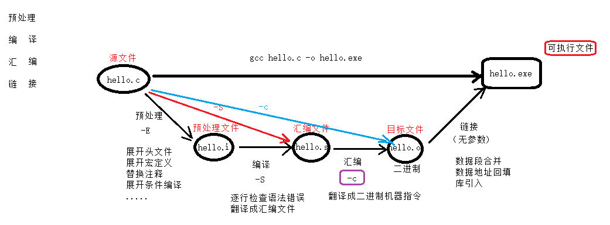
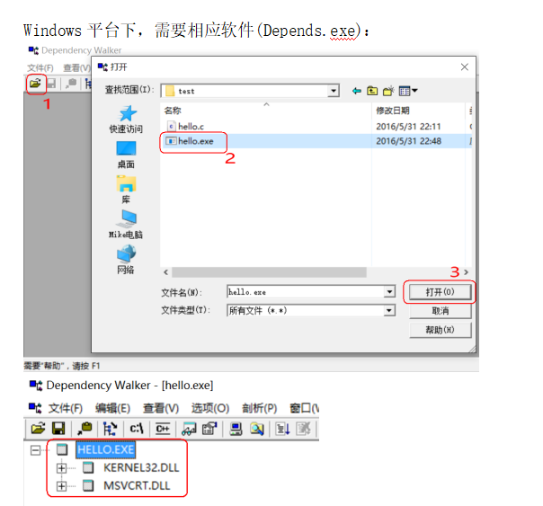
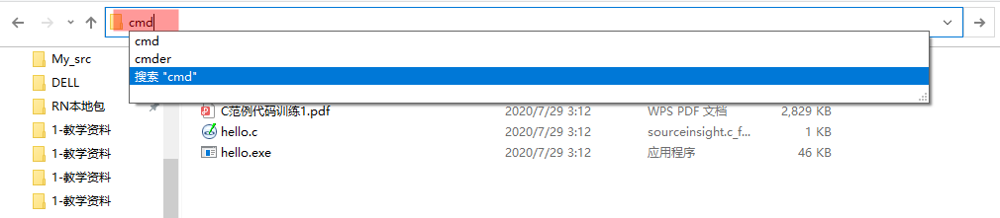

## 1. `system` 函数

**作用：** 执行系统命令。如：`pause`、`cmd`、`calc`、`mspaint`、`notepad` ...

**示例：**

```c:no-line-numbers
system("cmd");  
system("calc");
system("cls"); // 清屏命令：cls;
```

## 2. `gcc` 编译步骤（预处理-编译-汇编-链接）



```:no-line-numbers
（-o 选项仅用于指定输出文件名, 不使用 -o, 仅执行 gcc hello.c , 则默认生成 a.exe）
gcc -E hello.c -o hello.i
gcc -S hello.i -o hello.s
gcc -c hello.s -o hello.o
gcc hello.o -o hello.exe
```

**1. 预处理**

|命名选项|输出文件|
|:-|:-|
|`-E`|`xxx.i` 预处理文件（纯文本文件）|

```:no-line-numbers
gcc -E xxx.c -o xxx.i

1）头文件展开（即 生成的预处理文件 xxx.i 中会包括头文件的所有内容）。 
    --- 不检查语法错误（但会将语法错误提示出来，仍能成预处理文件）。可以展开任意文件。
2）宏定义替换。
    --- 将宏名替换为宏值。
3）替换注释。
    --- 变成空行
4）展开条件编译。
    --- 根据条件来展开指令。
```

**2. 编译**

|命名选项|输出文件|
|:-|:-|
|`-S`|`xxx.s` 汇编文件（纯文本文件，即汇编代码文件）|

```:no-line-numbers
gcc -S hello.i -o hello.s

1）逐行检查语法错误。【重点】    
    --- 整个编译4步骤中最耗时的过程。
2）将 C 程序翻译成汇编指令，得到 .s 汇编文件。
```

**3. 汇编**

|命名选项|输出文件|
|:-|:-|
|`-c`|`xxx.o` 目标文件（二进制文件）|

```:no-line-numbers
gcc -c hello.s -o hello.o

1）翻译：将汇编指令翻译成对应的二进制编码。
```

**4. 链接**

|命名选项|输出文件|
|:-|:-|
|无|`xxx.exe` 可执行文件（二进制文件）|

```:no-line-numbers
gcc  hello.o -o hello.exe

1）数据段合并
2）数据地址回填
3）库引入
```

## 3. 查找程序所依赖的动态库



> `windows` 中 `.dll` 文件就是库文件。

## 4. 调试程序

**`VS` 中添加行号：**

```:no-line-numbers
工具 -> 选项 -> 文本编辑器 -> C/C++ -> 行号 选中。
```

**调试步骤：**

```:no-line-numbers
1. 设置断点。F5 启动调试
2. 停止的位置，是尚未执行的指令。
3. 逐语句执行一下条（F11）：进入函数内部，逐条执行跟踪。
3. 逐过程执行一下条（F10）：不进入函数内部，逐条执行程序。
4. 添加监视：调试 -> 窗口 -> 监视：输入监视变量名。自动监视变量值的变化。
```

**`VS` 调试过程中查看对应的汇编指令：**

```:no-line-numbers
调用 -> 窗口 -> 反汇编
```

## 5. 在指定路径下打开 `cmd` 命令行



> 如上图，在路径框内输入 `cmd` ，按回车即可打开 `cmd`，并定位到当前目录