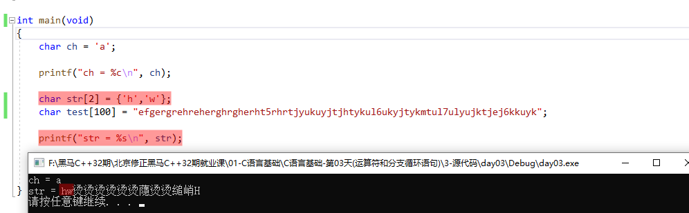
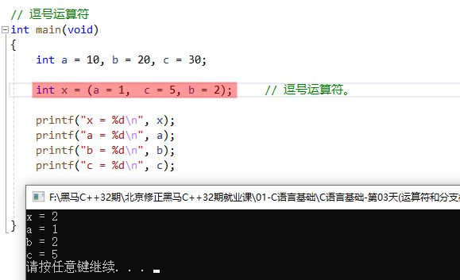
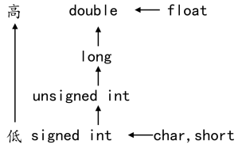
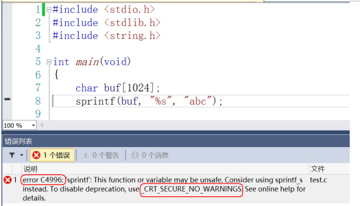

## 1. 类型限定符

### 1.1 `extern`

```:no-line-numbers
表示声明；
extern 声明的变量没有建立存储空间；
不能提升。
```

### 1.2 `const`

```:no-line-numbers
限定一个变量为只读变量
```

### 1.3 `volatile`

```:no-line-numbers
防止编译器优化代码。
使用：volatile int flg = 0;
```

### 1.4 `register`

```:no-line-numbers
定义一个寄存器变量。没有内存地址，所以不能对寄存器变量使用指针。
register 是建议型的指令，而不是命令型的指令，如果 CPU 有空闲寄存器，那么 register 就生效，如果没有空闲寄存器，那么 register 无效。
使用：register int a = 10;
```

## 2. 字符串

C语言中，用双引号引着的一串字符，称之为字符串。一定有一个结束标记 `'\0'`

```:no-line-numbers
char ch = 'A';  占一个字节
字符串 "abc" 包含 4 个字符：'a'、'b'、'c'、'\0'
'a' 不等价 "a"（字符串 "a" 包括 2 个字符：'a'、'\0'）
```

### 2.1 打印字符串时，遇到结束标记 `'\0'` 才会停止打印

如果字符串变量 `str` 没有以 `'\0'` 结束，那么 `printf` 函数打印时，就会继续打印 `str` 变量之后的内存地址中的值，直到遇到 `'\0'` 为止。



## 3. `printf` 函数

### 3.1 `printf` 函数支持的格式匹配符

|**格式符**|**作用**|
|:-|:-|
|`%s`|打印字符串，从字符串的第一个字符开始挨个打印，打印到 `'\0'` 结束|
|`%d`|打印整数|
|`%c`|打印字符|
|`%x`|打印十六进制数|
|`%u`|打印无符号|
|`%m.n`|打印浮点数时用到，一共有 `m` 位（整数、小数、小数点），`n` 位小数|
|`%0m.nf`|其中 `f` 表示打印浮点数，一共有 `m` 位（整数、小数、小数点），`n` 位小数。`0` 表示不足 `m` 位时用 `0` 凑够 `m` 位|
|`%%`|显示一个 `%`。 转义字符 `'\'` 对 `%` 转义无效。|
|`%Ns`|显示 `N` 个字符的字符串。不足 `N` 用空格向左填充|
|`%0Ns`|显示 `N` 个字符的字符串。不足 `N` 用 `0` 向左填充|
|`%-Ns`|显示 `N` 个字符的字符串。不足 `N` 用空格向右填充|

## 4. `putchar` 函数

```:no-line-numbers
输出一个字符到屏幕。
可以直接传入字符的 ASCII 码。
不能输出字符串。
'abc' 既不是一个有效字符，也不是一个有效字符串。
常用 putchar('\n'); 来打印换行。使用 printf("\n"); 也可以打印换行
```

## 5. `scanf` 函数

从键盘接收用户输入。

**1. 接收整数 `%d`**

```c:no-line-numbers
int a, b, c;  // 创建变量空间，等待接收用户输入。
scanf("%d %d %d", &a, &b, &c);
```

**2. 接收字符 `%c`**

```c:no-line-numbers
char a, b, c;
scanf("%c %c %c", &a, &b, &c);
```

**3. 接收字符串 `%s`**

```c:no-line-numbers
char str[10]; // 定义一个数组，用来接收用户输入的字符串。
scanf("%s", str); // 变量名要取地址传递给 scanf，数组名本身表示地址，不用 & 符。
```

### 5.1 接收字符串时的注意项

```:no-line-numbers
1. scanf 具有安全隐患。如果存储空间不足，数据能存储到内存中，但不被保护（即存储到参数变量内存范围之外的地址中去了）。
  【因此，空间不足不要使用】
2. scanf 函数接收字符串时，碰到 空格 和 换行 会自动终止。不能使用 scanf 的 %s 接收带有空格的字符串。
```

### 5.2 解决 `scanf` `4996` 错误

```:no-line-numbers
将 #define _CRT_SECURE_NO_WARNINGS  添加到程序第一行。
```

## 6. `getchar` 函数

```:no-line-numbers
从键盘获取用户输入的一个字符。
返回该获取的字符的 ASCII 码。
```

## 7. 运算符

### 7.1 运算符优先级

```:no-line-numbers
[] () > ++ -- (强转) sizeof > 算数运算（先乘除取余，后加减）> 比较运算 > 逻辑运算 > 三目运算（条件运算）> 赋值运算 > 逗号运算 
```

<table>
    <tr>
        <th>优先级</th>
        <th>运算符</th>
        <th>名称或含义</th>
        <th>使用形式</th>
        <th>结合方向</th>
        <th>说明</th>
    </tr>
    <tr>
        <td rowspan="4">1</td>
        <td>[]</td>
        <td>数组下标</td>
        <td>数组名[常量表达式]</td>
        <td rowspan="4">左到右</td>
        <td>--</td>
    </tr>
    <tr>
        <td>()</td>
        <td>圆括号</td>
        <td>(表达式）/函数名(形参表)</td>
        <td>--</td>
    </tr>
    <tr>
        <td>.</td>
        <td>成员选择（对象）</td>
        <td>对象.成员名</td>
        <td>--</td>
    </tr>
    <tr>
        <td>-></td>
        <td>成员选择（指针）</td>
        <td>对象指针->成员名</td>
        <td>--</td>
    </tr>
    <tr>
        <td rowspan="9">2</td>
        <td>-</td>
        <td>负号运算符</td>
        <td>-表达式</td>
        <td rowspan="9">右到左</td>
        <td rowspan="7">单目运算符</td>
    </tr>
    <tr>
        <td>~</td>
        <td>按位取反运算符</td>
        <td>~表达式</td>
    </tr>
    <tr>
        <td>++</td>
        <td>自增运算符</td>
        <td>++变量名/变量名++</td>
    </tr>
    <tr>
        <td>--</td>
        <td>自减运算符</td>
        <td>--变量名/变量名--</td>
    </tr>
    <tr>
        <td>*</td>
        <td>取值运算符</td>
        <td>*指针变量</td>
    </tr>
    <tr>
        <td>&</td>
        <td>取地址运算符</td>
        <td>&变量名</td>
    </tr>
    <tr>
        <td>!</td>
        <td>逻辑非运算符</td>
        <td>!表达式</td>
    </tr>
    <tr>
        <td>(类型)</td>
        <td>强制类型转换</td>
        <td>(数据类型)表达式</td>
        <td>--</td>
    </tr>
    <tr>
        <td>sizeof</td>
        <td>长度运算符</td>
        <td>sizeof(表达式)</td>
        <td>--</td>
    </tr>
    <tr>
        <td rowspan="3">3</td>
        <td>/</td>
        <td>除</td>
        <td>表达式/表达式</td>
        <td rowspan="3">左到右</td>
        <td rowspan="3">双目运算符</td>
    </tr>
    <tr>
        <td>*</td>
        <td>乘</td>
        <td>表达式*表达式</td>
    </tr>
    <tr>
        <td>%</td>
        <td>余数（取模）</td>
        <td>整型表达式%整型表达式</td>
    </tr>
    <tr>
        <td rowspan="2">4</td>
        <td>+</td>
        <td>加</td>
        <td>表达式+表达式</td>
        <td rowspan="2">左到右</td>
        <td rowspan="2">双目运算符</td>
    </tr>
    <tr>
        <td>-</td>
        <td>减</td>
        <td>表达式-表达式</td>
    </tr>
    <tr>
        <td rowspan="2">5</td>
        <td>&lt;&lt;</td>
        <td>左移</td>
        <td>变量&lt;&lt;表达式</td>
        <td rowspan="2">左到右</td>
        <td rowspan="2">双目运算符</td>
    </tr>
    <tr>
        <td>&gt;&gt;</td>
        <td>右移</td>
        <td>变量&gt;&gt;表达式</td>
    </tr>
    <tr>
        <td rowspan="4">6</td>
        <td>&gt;</td>
        <td>大于</td>
        <td>表达式&gt;表达式</td>
        <td rowspan="4">左到右</td>
        <td rowspan="4">双目运算符</td>
    </tr>
    <tr>
        <td>&gt;=</td>
        <td>大于等于</td>
        <td>表达式&gt;=表达式</td>
    </tr>
    <tr>
        <td>&lt;</td>
        <td>小于</td>
        <td>表达式&lt;表达式</td>
    </tr>
    <tr>
        <td>&lt;=</td>
        <td>小于等于</td>
        <td>表达式&lt;=表达式</td>
    </tr>
    <tr>
        <td rowspan="2">7</td>
        <td>==</td>
        <td>等于</td>
        <td>表达式==表达式</td>
        <td rowspan="2">左到右</td>
        <td rowspan="2">双目运算符</td>
    </tr>
    <tr>
        <td>!=</td>
        <td>不等于</td>
        <td>表达式!=表达式</td>
    </tr>
    <tr>
        <td>8</td>
        <td>&</td>
        <td>按位与</td>
        <td>表达式&表达式</td>
        <td>左到右</td>
        <td>双目运算符</td>
    </tr>
    <tr>
        <td>9</td>
        <td>^</td>
        <td>按位异或</td>
        <td>表达式^表达式</td>
        <td>左到右</td>
        <td>双目运算符</td>
    </tr>
    <tr>
        <td>10</td>
        <td>|</td>
        <td>按位或</td>
        <td>表达式|表达式</td>
        <td>左到右</td>
        <td>双目运算符</td>
    </tr>
    <tr>
        <td>11</td>
        <td>&&</td>
        <td>逻辑与</td>
        <td>表达式&&表达式</td>
        <td>左到右</td>
        <td>双目运算符</td>
    </tr>
    <tr>
        <td>12</td>
        <td>||</td>
        <td>逻辑或</td>
        <td>表达式||表达式</td>
        <td>左到右</td>
        <td>双目运算符</td>
    </tr>
    <tr>
        <td>13</td>
        <td>?:</td>
        <td>条件运算符</td>
        <td>表达式1 ? 表达式2 : 表达式3</td>
        <td>右到左</td>
        <td>三目运算符</td>
    </tr>
    <tr>
        <td rowspan="11">14</td>
        <td>=</td>
        <td>赋值运算符</td>
        <td>变量=表达式</td>
        <td rowspan="11">右到左</td>
        <td>--</td>
    </tr>
    <tr>
        <td>/=</td>
        <td>除后赋值</td>
        <td>变量/=表达式</td>
        <td>--</td>
    </tr>
    <tr>
        <td>*=</td>
        <td>乘后赋值</td>
        <td>变量*/=表达式</td>
        <td>--</td>
    </tr>
    <tr>
        <td>%=</td>
        <td>取模后赋值</td>
        <td>变量%=表达式</td>
        <td>--</td>
    </tr>
    <tr>
        <td>+=</td>
        <td>加后赋值</td>
        <td>变量+=表达式</td>
        <td>--</td>
    </tr>
    <tr>
        <td>-=</td>
        <td>减后赋值</td>
        <td>变量-=表达式</td>
        <td>--</td>
    </tr>
    <tr>
        <td>&lt;&lt;=</td>
        <td>左移后赋值</td>
        <td>变量&lt;&lt;=表达式</td>
        <td>--</td>
    </tr>
    <tr>
        <td>&gt;&gt;=</td>
        <td>右移后赋值</td>
        <td>变量&gt;&gt;=表达式</td>
        <td>--</td>
    </tr>
    <tr>
        <td>&=</td>
        <td>按位与后赋值</td>
        <td>变量&=表达式</td>
        <td>--</td>
    </tr>
    <tr>
        <td>^=</td>
        <td>按位异或后赋值</td>
        <td>变量^=表达式</td>
        <td>--</td>
    </tr>
    <tr>
        <td>|=</td>
        <td>按位或后赋值</td>
        <td>变量|=表达式</td>
        <td>--</td>
    </tr>
    <tr>
        <td>15</td>
        <td>,</td>
        <td>逗号运算符</td>
        <td>表达式,表达式,...</td>
        <td>左到右</td>
        <td>--</td>
    </tr>
</table>

### 7.2 算数运算符

```:no-line-numbers
不允许对小数取余，即余数不能是小数。 错误示例：35 % 3.4;
对负数取余，结果为余数的绝对值。示例：10 % -3; // 结果为 1
```

### 7.3 逗号运算符

> 从左到右，取最后一次运算的结果。

**示例：**



## 8 类型转换

### 8.1 隐式类型转换



隐式类型转换分两种情况：

```:no-line-numbers
1. 由编译器自动完成
    由上图可知，若 float 型数据和 int 型数据进行运算，会分别先转换成 double 型数据后再进行运算。

2. 由赋值产生的类型转换
    小 -> 大 没问题。 
        int r = 3;
        float s = 3.14 * r * r; // 右侧表达式结果为 double 型，赋值转换为 float 型
    大 -> 小 有可能发生数据丢失。
        321:    256 128 64 32 16 8 4 2 1
                1   0   1  0  0  0 0 0 1 // 高位 1 转 char 型时会丢失
        char ch  = 0   1  0  0  0 0 0 1  // int 型 321 转 char 型，会发生数据丢失
```

### 8.2 强制类型转换

**语法：**

```:no-line-numbers
（目标类型）带转换变量
（目标类型）带转换表达式
```

## 9. `VS2013` 的 `C4996` 错误

由于微软在 `VS2013` 中不建议再使用 `C` 的传统库函数 `scanf`、`strcpy`、`sprintf` 等，所以直接使用这些库函数会提示 `C4996` 错误：



`VS` 建议采用带 `_s` 的函数，如 `scanf_s`、`strcpy_s`，但这些并不是标准 `C` 函数。要想继续使用此函数，需要在源文件中添加以下指令就可以避免这个错误提示：

```c:no-line-numbers
#define _CRT_SECURE_NO_WARNINGS   // 这个宏定义最好要放到 .c 文件的第一行

#pragma warning(disable:4996)    // 或者使用这个
```

## 10. `switch` 分支语句

```:no-line-numbers
switch(判别表达式)
{
    case 1：
        执行语句1；
        break; // 防止 case 穿透
    case 2:
        执行语句2;
        break;
    case 3:
        执行语句3;
        break;
    ...
    case N:
        执行语句N;
        break;
    default:
        其他情况的统一处理;
        break;
}
```

### 10.1 什么是 `case` 穿透

```:no-line-numbers
在一个 case 分支中如果，没有 break; 那么它会向下继续执行下一个 case 分支。
```