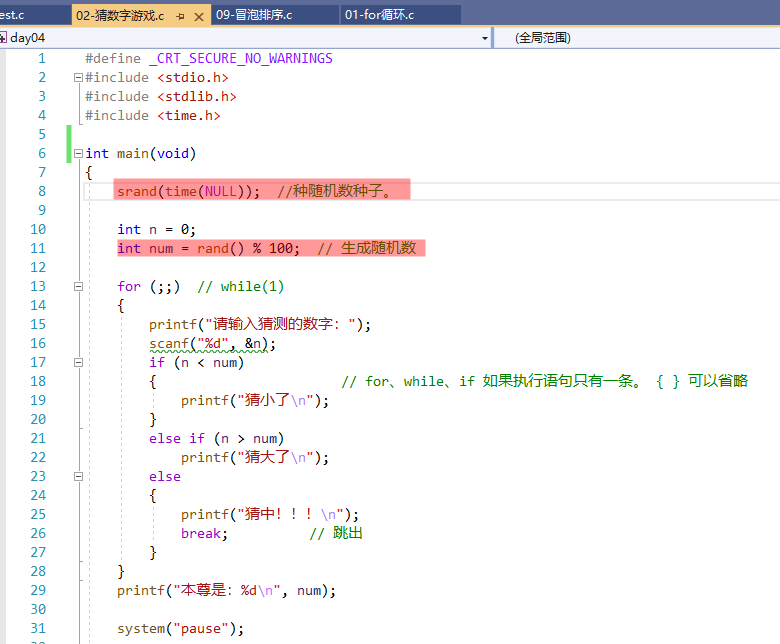
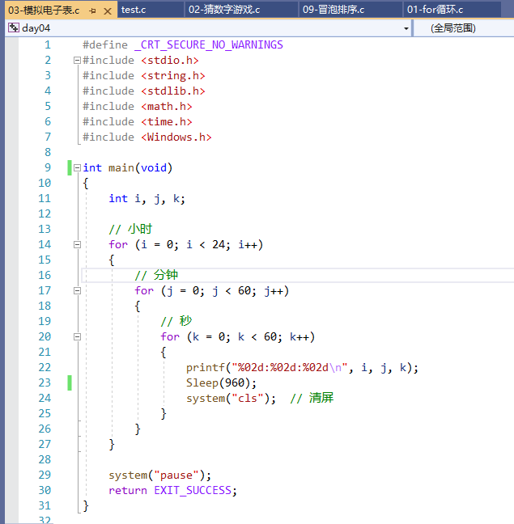
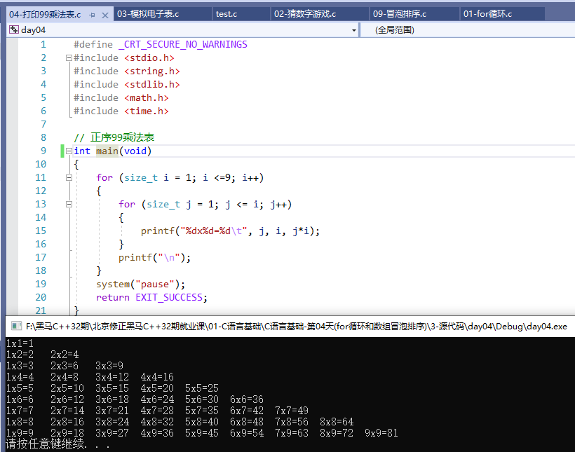
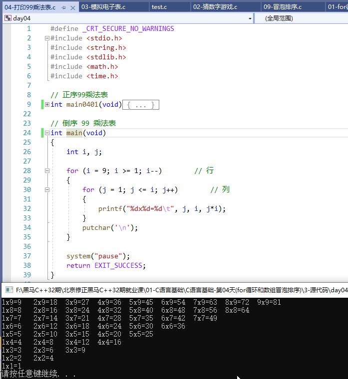
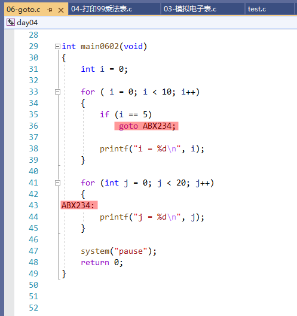
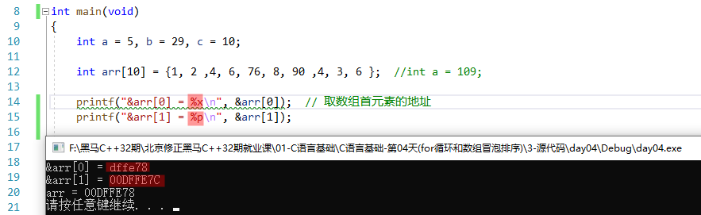
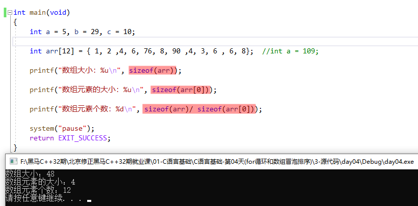
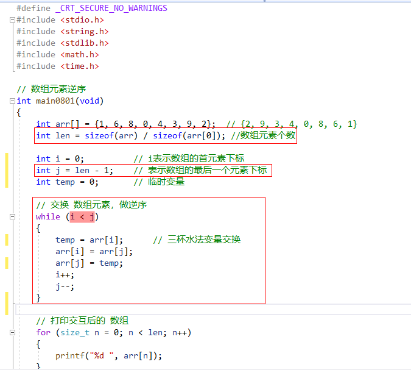
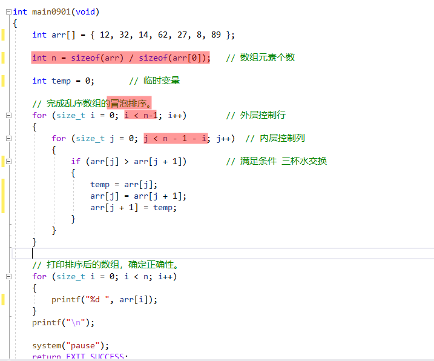

## 1. `for` 循环

### 1.1 案例

#### 1.1.1 案例1：猜数字游戏（`rand` 随机数函数）



```:no-line-numbers
1. time 函数在 time.h 中声明；返回时间戳
2. srand 函数在 stdlib.h 中声明；用于产生随机数种子
3. rand 函数在 stdlib.h 中声明；用于产生随机数

注意：
如果不执行 srand(time(NULL)); 生成一个随时间变化的随机数种子，
那么每次编译运行后，第一次执行 rand() 函数得到的随机数都是相同的。
```

#### 1.1.2 案例2：模拟电子表（`Sleep` 休眠函数）



```:no-line-numbers
Sleep 函数在 Windows.h 中声明
```

#### 1.1.3 案例3：正序99乘法表



```:no-line-numbers
typedef unsigned int    size_t;
```

#### 1.1.4 案例4：倒序99乘法表



### 1.2 跳转语句：`break` & `continue` & `goto`

**`break`**

```:no-line-numbers
作用1：跳出一重循环。 for、while、do while
作用2：防止 case 穿透。 switch   
```

**`continue`**

```:no-line-numbers
作用：结束【本次】循环 continue 关键字之后的循环体，让其在本次循环中不执行。
```

**`goto`**

```:no-line-numbers
1. 设定一个标签
2. 使用 "goto 标签名" 跳转到标签的位置。（只在函数内部生效）
```



> 如上代码，由于 `goto` 语句直接跳转到了第二个 `for` 循环的循环体中，略过了循环因子 `j` 赋初值的步骤，所以打印变量 `j` 时的输出数据是不确定的。

## 2. 格式符 `%p`（打印内存地址）



```:no-line-numbers
如上代码，格式符 %p 专门用来打印内存地址
```

## 3. 数组

### 3.1 初识数组

```:no-line-numbers
- 相同数据类型的有序连续存储。
- 各个元素的内存地址连续。
- 数组名为地址，是数组首元素的地址。即：arr == &arr[0];
```

### 3.2 数组长度：`sizeof(arr) / sizeof(arr[0])`

```:no-line-numbers
取数组长度的方式： sizeof(arr) / sizeof(arr[0]) 
(没有 arr.length 这种 java 中的方式)
```



### 3.3 数组初始化

```:no-line-numbers
int arr[12] = { 1, 2 ,4, 6, 76, 8, 90 ,4, 3, 6, 6, 8 }; 【重点】

int arr[10] = { 1, 2 ,4, 6, 76, 8, 9 };  剩余未初始化的元素，默认 0 值。【重点】

int arr[10] = {0};  初始化一个全为 0 的数组。【重点】

int arr[] = {1, 2, 4, 6, 8};  编译器自动求取元素个数。【重点】

int arr[] = {0};  只有一个元素，值为 0

int arr[10];
arr[0] = 5;
arr[1] = 6;
arr[2] = 7;    
其余元素未被初始化，默认值 不确定数。
```

### 3.4 数组倒序



### 3.5 冒泡排序

