## 1. 二维数组

### 1.1 获取：数组的大小、数组行的大小、元素的大小、行数、列数

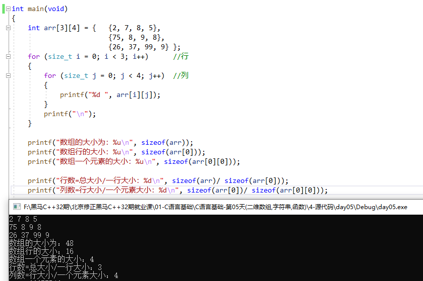

> 如上代码中，打印的大小单位是字节 `Byte`

### 1.2 二维数组的地址合一：数组首地址 = 首行地址 = 首元素地址 

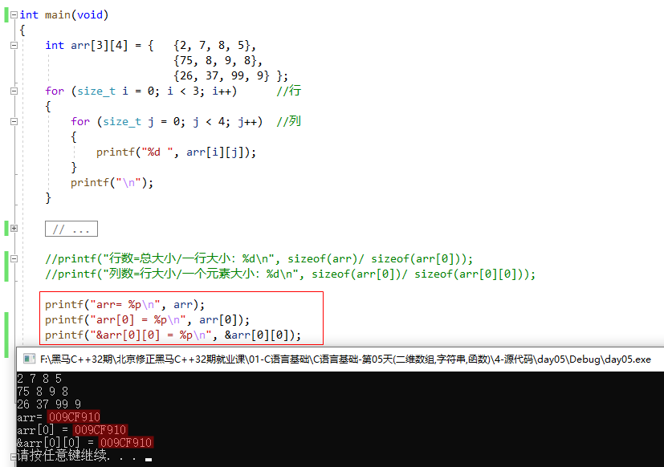

### 1.3 二维数组初始化

**1. 常规初始化：**

```c:no-line-numbers
int arr[3][5] = {{2, 3, 54, 56, 7 }, {2, 67, 4, 35, 9}, {1, 4, 16, 3, 78}};
```

**2. 不完全初始化：**

```c:no-line-numbers
int arr[3][5] = {{2, 3}, {2, 67, 4, }, {1, 4, 16, 78}};  // 未被初始化的数值为 0

int arr[3][5] = {0};    // 初始化一个初值全为 0 的二维数组

int arr[3][5] = {2, 3, 2, 67, 4, 1, 4, 16, 78};   // 【少见】系统自动分配行列。
```

**3. 不完全指定行列初始化：**

```c:no-line-numbers
int arr[][] = {1, 3, 4, 6, 7};  // 错误：二维数组定义必须指定列值。

int arr[][2] = { 1, 3, 4, 6, 7 };  // 正确：可以不指定行值。
```

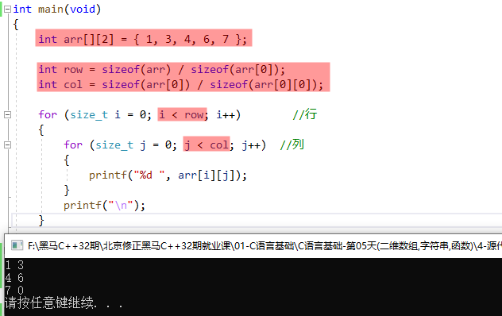

## 2. `VS` 代码片段模板的导入

```:no-line-numbers
操作步骤：VS -> 工具 -> 代码片段管理器 -> Visual C++
```

## 3. 多维数组

**定义语法：**

```:no-line-numbers
三维数组：[层][行][列]

数组类型 数组名[层][行][列];
```

**示例：**

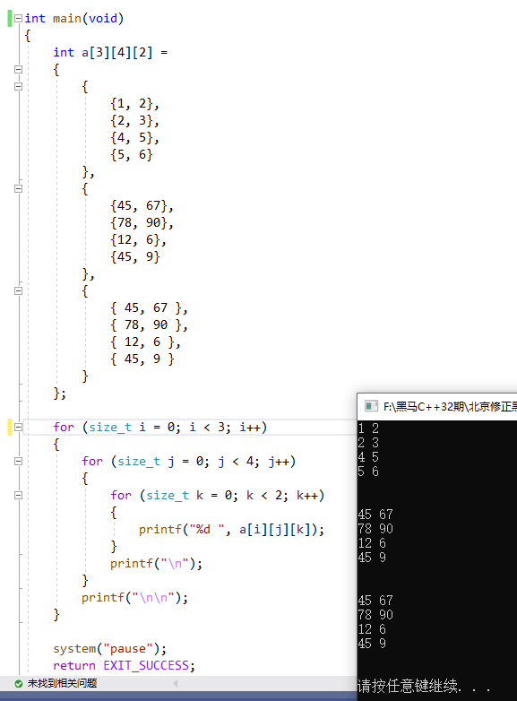

## 4. 字符串

### 4.1 字符数组和字符串的区别

```:no-line-numbers
字符数组：
    char str[5] = {'h', 'e', 'l', 'l', 'o'};    
字符串：
    char str[6] = {'h', 'e', 'l', 'l', 'o', '\0'};   <=>  char str[6] = "hello";
        
printf("%s"); // 使用 printf 打印字符串的时候，必须碰到 '\0' 结束。
```

### 4.2 案例：统计字符串中每个字母的出现次数

键盘输入字符串，存至 `str[]` 中，统计每个字母出现的次数。

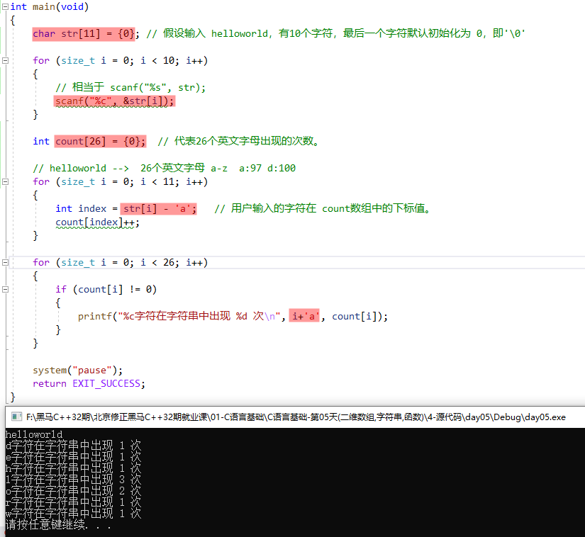

### 4.3 字符串获取函数 `scanf` 

#### 4.3.1 注意事项（预留足够空间；遇空格或换行终止）

```:no-line-numbers
1. 用于存储字符串的空间必须足够大，防止溢出。
2. 获取字符串 %s ，遇到 空格 和 \n 终止。
```

#### 4.3.2 获取带有空格的字符串：`scanf("%[^\n]s", str)`

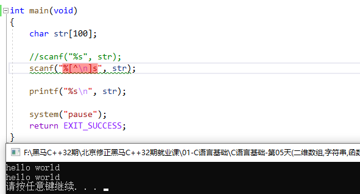

### 4.4 字符串操作函数 

#### 4.4.1 从键盘获取一个字符串：`gets`

**作用：**

```:no-line-numbers
从键盘获取一个字符串，返回字符串的首地址。可以获取带有空格的字符串。【不安全】
```

**说明：**

```c:no-line-numbers
#include <stdio.h>
char *gets(char *s);
    参数：用来存储字符串的空间地址。
    返回值：返回实际获取到的字符串首地址，失败返回 NULL。
```

`gets(str)` 与` scanf("%s",str)` 的区别：

```:no-line-numbers
gets(str) 允许输入的字符串含有空格
scanf("%s",str) 不允许含有空格
```

**注意：**

```:no-line-numbers
由于 scanf() 和 gets() 无法知道字符串 s 大小，必须遇到换行符或读到文件结尾为止才接收输入，
因此容易导致字符数组越界（缓冲区溢出）的情况，即 scanf 和 gets 都是【不安全】的。
```

**示例：**

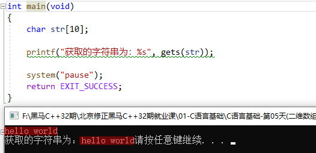

```:no-line-numbers
"hello world" 算上 '\0' 有 12 个字符，数组 str 只能存储 10 个字符，
所以用数组 str 存储 "hello world" 会发出缓冲区溢出，最后两个字符 'd' 和 '\0' 不在 str 内存范围内，可能会被其他数据覆盖，不安全。
```

#### 4.4.2 从指定输入流中获取一个字符串：`fgets`

**作用：**

```:no-line-numbers
从指定输入流中获取一个字符串，预留 '\0' 的存储空间。空间足够读 '\n'，空间不足舍弃 '\n'。【安全】
```

**说明：**

```c:no-line-numbers
#include <stdio.h>
char *fgets(char *s, int size, FILE *stream);
    参1：用来存储字符串的空间地址。
    参2：描述空间的大小。
    参3：读取字符串的位置。可以从文件中读取，也可以从标准输入中读取。标准输入：stdin -> 即：键盘
    返回值：返回实际获取到的字符串首地址，失败返回 NULL。
```

**示例：**

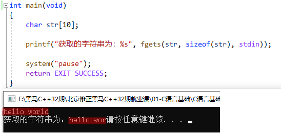

```:no-line-numbers
因为 fgets 的参数中指定了存储空间大小，所有不会出现缓冲区溢出的情况；只会出现输入字符串过长时被截断的情况。
```

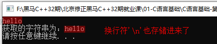

```:no-line-numbers
因为 fgets 函数的参数中传入的存储空间足够大，所以会把输入的换行符 '\n' 也存储到数组 str 中，作为输入字符串的一部分。
```

#### 4.4.3 将一个字符串写出到屏幕：`puts`

**作用：**

```:no-line-numbers
将一个字符串写出到屏幕。
printf("%s", "hello");  <=>  printf("hello\n");  <=>  puts("hello");   
```

**说明：**

```c:no-line-numbers
#include <stdio.h>
int puts(const char *s);    
    参数1：待写出到屏幕的字符串。
    返回值：成功：非负数（通常是 0）；失败：-1.  
```

**示例：**

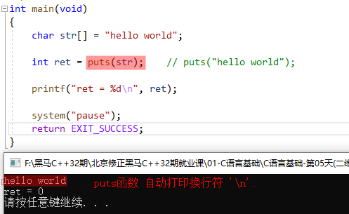

#### 4.4.4 将一个字符串写出到指定输出流：`fputs`

**作用：**

```:no-line-numbers
将一个字符串写出到指定输出流，输出字符串后不添加 '\n' 换行符。
```

**说明：**

```c:no-line-numbers
#include <stdio.h>
int fputs(const char * str, FILE * stream);    
    参数1：待写出到屏幕的字符串。        
    参数2：写出位置，可以输出到指定的文件，也可以输出到标准输出上。标准输出：stdout -> 即：显示器
    返回值：成功：非负数（通常是 0）；失败：-1.
```

**示例：**

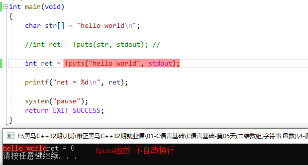

```:no-line-numbers
因为 puts 函数仅面向标准输出（即显示器），所以 puts 函数默认打印换行符；
而 fputs 函数可以面向任意指定的输出位置，所以 fgets 函数默认不打印换行符。
```

#### 4.4.5 获取字符串长度：`strlen`

**作用：**

```:no-line-numbers
获取字符串长度，碰到 '\0' 结束。（长度不包括 '\0'）
```

**说明：**

```c:no-line-numbers
#include <string.h>
size_t strlen(const char *s);
    参数1：待求长度的字符串首地址
    返回：有效的字符个数，size_t 为 unsigned int 类型
```

**示例：**

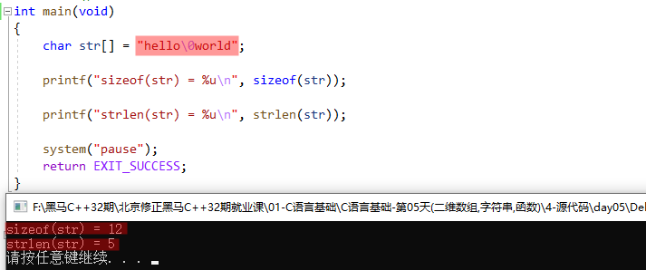

##### 4.4.5.1 `sizeof(str)` 和 `strlen(str)` 的区别

```:no-line-numbers
sizeof(str) 求的数组的长度，不管数组中的元素是什么。
strlen(str) 求的是字符串的长度，遇字符串结束标记 '\0' 为止。
```

##### 4.4.5.2 自己实现 `strlen` 函数

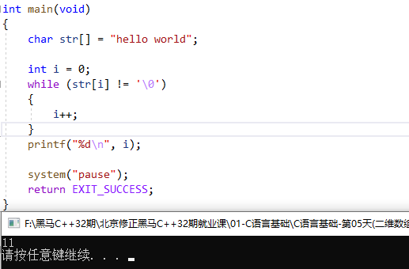

```:no-line-numbers
等价于 printf("%d\n", strlen(str));
```

### 4.5 案例：字符串拼接

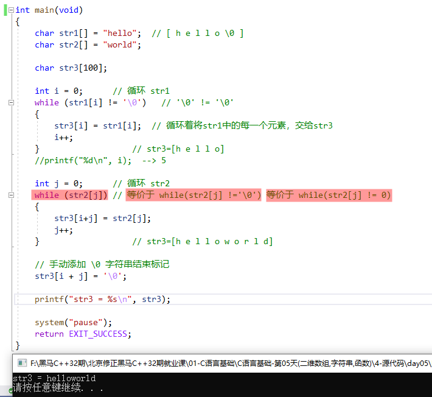

## 5. 函数

### 5.1 函数的作用

```:no-line-numbers
1. 提高代码的复用率；
2. 提高程序模块化组织性。
```

### 5.2 函数的分类（系统库函数 & 用户自定义函数）

```:no-line-numbers
系统库函数： 
    如：标准C库（libc）
    使用方式：
        1. 引入头文件 -- 即：声明函数
        2. 根据函数原型调用。

用户自定义:
    使用方式：除了需要提供函数原型之外，还需要提供函数实现。
```

### 5.3 函数定义

函数定义包含：

```:no-line-numbers
1. 函数原型（返回值类型、函数名、形参列表）
2. 函数体（花括号一对，具体代码实现）
```

> 形参列表即形式参数列表，一定包含：类型名 形参名

**定义语法：**

```:no-line-numbers
返回值类型 函数名(类型名 形参名, 类型名 形参名, ...)
{
    具体代码实现
}
```

**示例：**

```c:no-line-numbers
int add（int a, int b, int c）
{
    return a+b+c;
}
```

### 5.4 函数调用

函数调用包含：

```:no-line-numbers
函数名(实参列表);
```

> 实参(实际参数)：在调用时，传参必须严格按照形参填充（参数的个数、类型、顺序）

**示例：**

```c:no-line-numbers
int ret = add(10, 4, 28);
```

### 5.5 函数声明

函数声明包含：

```:no-line-numbers
函数原型（返回值类型、函数名、形参列表）+ ";"
```

**注意：**

```:no-line-numbers
1. 在函数调用之前，编译必须见过函数定义。否则，需要函数声明。

2. 函数声明时，形参列表中可以省略形参名，只保留形参类型即可。
    int add(int a, int b, int c);   <=>   int add(int, int, int);

3. #include <xxx.h>  中包含函数的声明
```

#### 5.5.1 隐式声明（不要依赖这种方式）

```:no-line-numbers
编译器默认做隐式声明函数时，返回都为 int ，根据调用语句 补全 函数名和形参列表。
```

**示例1：编译器默认做隐式声明函数时的异常情况**

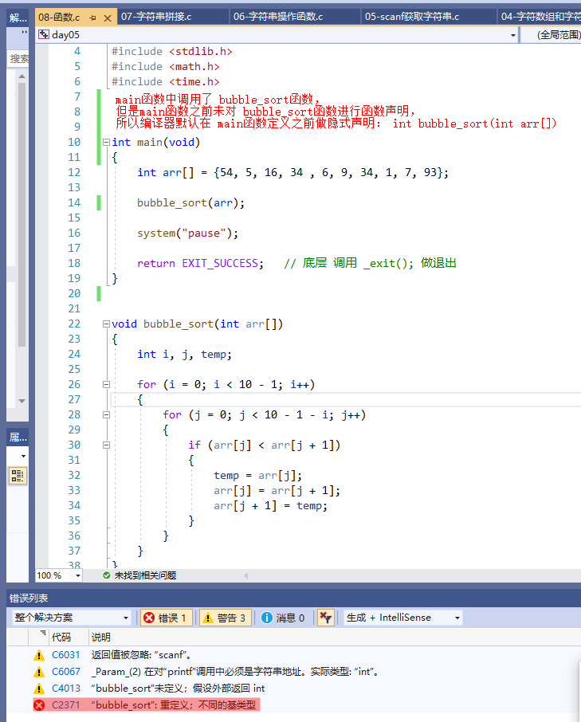

```:no-line-numbers
如上图，报错 bubble_sort 函数重定义， 是由于编译器的隐式声明导致的。
因为 main 函数定义之前未对 bubble_sort 函数做函数声明，而 main 函数中又调用了 bubble_sort 函数，
所以，此时编译器会在 main 函数定义之前对 bubble_sort 函数做隐式声明：int bubble_sort(int arr[])
从而导致了 bubble_sort 函数声明与其函数定义不同，报出了重定义的错误。
```

**示例2：手动做函数声明的情况**

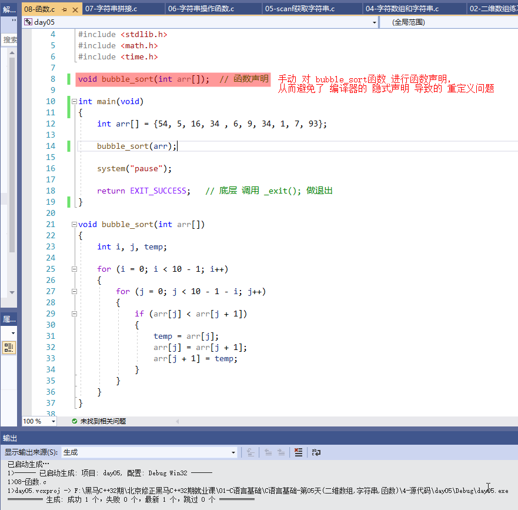

**示例3：编译器默认做隐式声明函数时的正常情况**

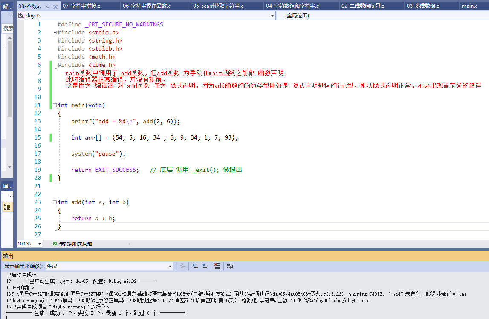

```:no-line-numbers
如上图，若函数的函数类型是 int 型，则可以使用编译器默认的隐式声明，但不建议采用隐式声明。
```

### 5.6 `exit` 函数（退出当前程序）

**说明：**

```:no-line-numbers
#include <stdlib.h>

return 关键字：返回当前函数调用，将返回值返回给调用者。

exit() 函数：退出当前程序。
```

**示例：**

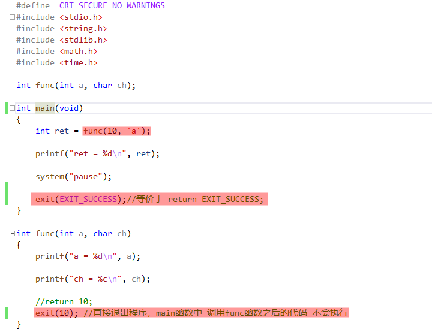

## 6. `VS` 的使用

### 6.1 `VS` 解决方案中新建项目

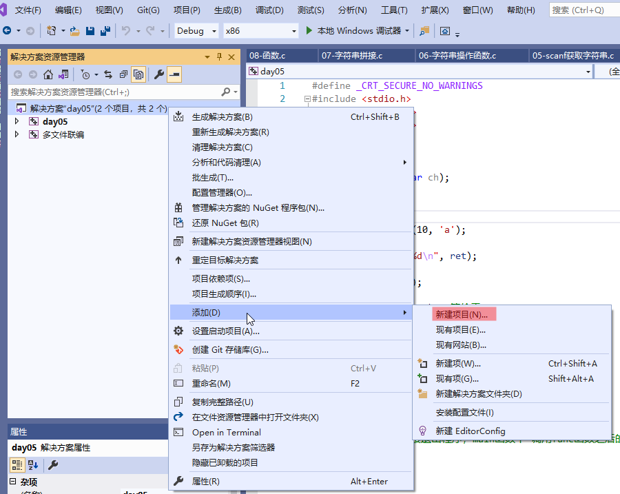

```:no-line-numbers
如上图所示，“多文件联编” 是当前解决方案中的一个新的项目。
通过【右键解决方案 -> 添加 —> 新建项目】可以创建一个类似 “多文件联编” 这样的项目。
```

### 6.2 `VS` 解决方案中设置启动项目

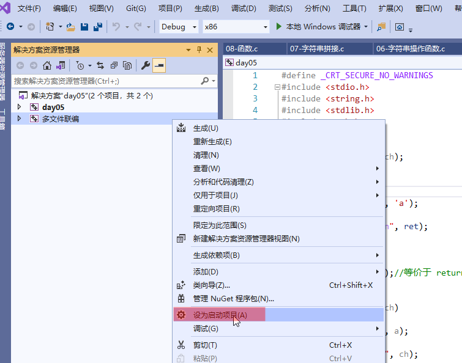

```:no-line-numbers
如上图，若解决方案中包含多个项目，可以通过【右键某个项目 —> 设为启动项目】将项目设置为启动项目。
启动项目中的 main 函数才是入口函数。
```

## 7. 多文件联编

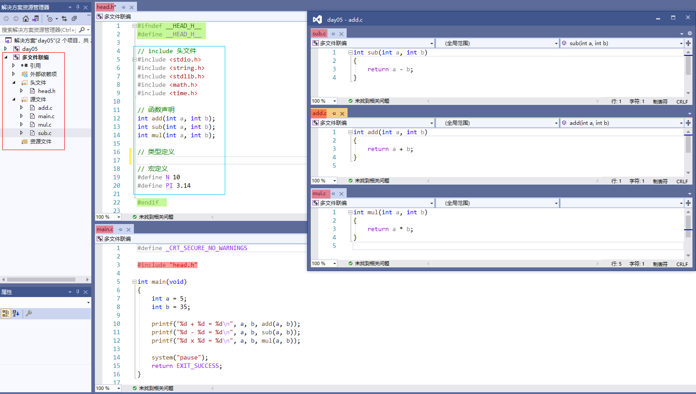

```:no-line-numbers
多文件联编就是指：将多个含有不同函数功能 .c 文件模块，编译到一起，生成一个 .exe 文件。
```

**注意：**

```:no-line-numbers
使用 VS 生成的 exe 文件 在  "...\day05\Debug" 路径下，（其中 day05 文件夹表示解决方案）
```

**使用 `gcc` 命令实现多文件联编**

```shell:no-line-numbers
gcc main.c add.c mul.c sub.c -o xxx.exe
```

## 8. `#include` 指令

```:no-line-numbers
<> 包裹的头文件为系统库头文件。
"" 包裹的头文件为用户自定义头文件。
```

## 9. 防止头文件重复包含（即：头文件守卫）

**方式1：**

```c:no-line-numbers
#pragma once  // 仅 windows 中适用
```

**方式2：**

```c:no-line-numbers
#ifndef __HEAD_H__   // __HEAD_H__ 是通过 头文件名 head.h 来定义的，应该跟头文件名一一对应
#define __HEAD_H__

// ... 头文件内容

#endif
```