## 1. 指针和内存单元

```:no-line-numbers
指针：
    即地址。

内存单元： 
    计算机中内存最小的存储单位。
    1 个内存单元的大小是 1 个字节。 
    每一个内存单元都有一个唯一的编号（数），称这个内存单元的编号为 “地址”。

指针变量：
    存地址的变量。
```

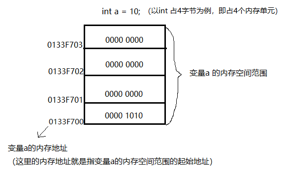

## 2. 指针定义和使用

### 2.1 指针的定义

```c:no-line-numbers
int a = 10;

// 写法1： int* p; (windows)
// 写法2： int *p; (Linux)
// 写法3： int * p; 
int *p = &a;        

int a, *p, *q, b;
```

### 2.2 指针的解引用（间接引用）

```:no-line-numbers
对于 *p = 250;  其中 *p 称为指针的解引用，或间接引用。即：将 p 变量的内容取出，当成地址看待，找到该地址对应的内存空间。

*p 如果做左值：存入数据到空间中。
*p 如果做右值：取出空间中的数据。
```

## 3. 任意指针类型所占的内存大小（与指向的数据类型无关）

```:no-line-numbers
指针的大小与所指向地址中的数据类型无关。只与当前使用的平台架构有关：
- 32 位系统：4 字节。     
- 64 位系统：8 字节。
```

**示例1：32 位系统中指针类型所占的内存大小**

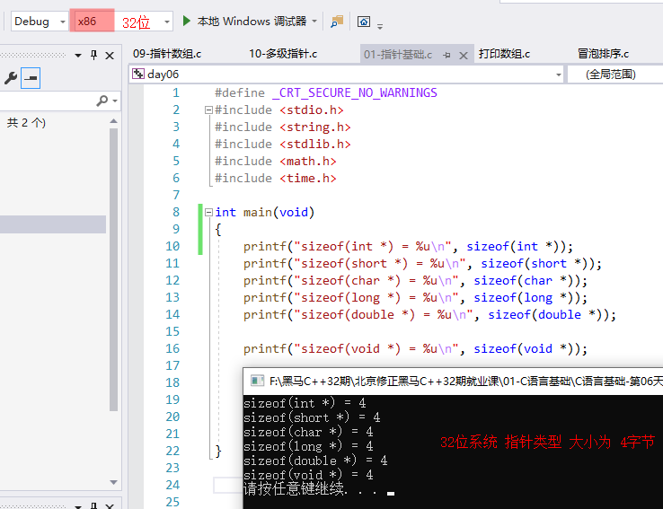

**示例2：64 位系统中指针类型所占的内存大小**

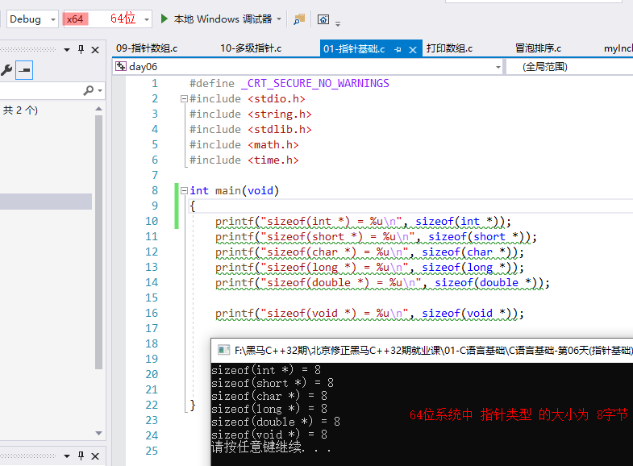

## 4. 野指针（注意：杜绝野指针）

**情形1：没有一个有效的地址空间的指针**

```c:no-line-numbers
int *p;
*p = 1000;
```

**情形2：`p` 变量有一个值，但该值不是可访问的内存区域**

```c:no-line-numbers
int *p = 10;
*p = 2000;
```

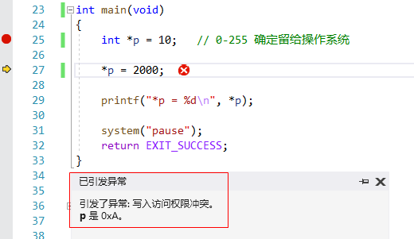

> 如上图，调式模式下可看到，给指针 `p` 赋以地址编号 `10`，会产生访问权限的异常。

## 5. 空指针（`NULL`）

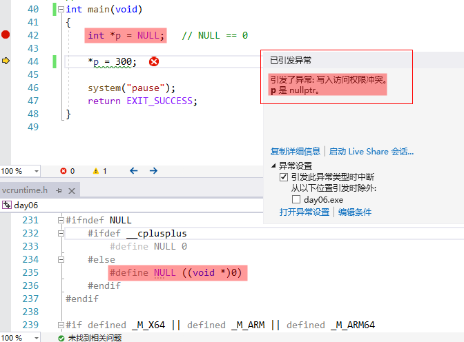

```:no-line-numbers
如上图，vcruntime.h 文件中，NULL 是一个指针类型（void *）的数据 0，地址编号 0 是系统使用的，无访问权限。
所以 int *p = NULL; 执行后，p 所对应的存储空间一定是一个无效的访问区域。
```

### 5.1 判断指针是否有效

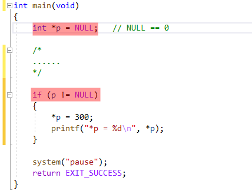

```:no-line-numbers
如上图，常用 if(p != NULL) 判断指针 p 是否有效
```

## 6. 万能指针（又称泛型指针，`void*`）

**说明：**

```:no-line-numbers
可以接收任意一种变量地址。但是在使用时，【必须】借助 “强转” 具体化数据类型。
```

**示例：**

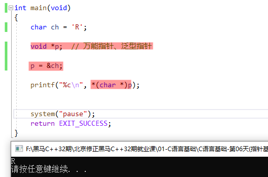

```:no-line-numbers
如上图：
1. p = &ch; 表示泛型指针 p 可以接收任意一种变量地址

2. *(char *)p 表示泛型指针 p 在使用时，必须借助强转，具体化为特定的数据类型，

3. *(char *)p 还可以写成 *((char *)p)，
   因为运算符 * 和 (类型) 优先级都为 2，按照从右到左的结合方向，所以写成 *(char *)p 也没问题
```

## 7. `const` 关键字

### 7.1 修饰变量（常变量）

```c:no-line-numbers
const int a = 20;
int *p = &a;
*p = 650;
printf("%d\n", a);
```

```:no-line-numbers
如上，const 关键字修饰的变量称为常变量，不能通过常变量 a 修改对应内存空间中的数据，
但是，可以通过指针的方式来访问并修改对应内存空间中的数据。
```

### 7.2 修饰指针

**说明：**

```:no-line-numbers
const 向右修饰，被修饰的部分即为只读。
```

**常用于：**

```:no-line-numbers
在函数形参内，用来限制指针所指向的内存空间为只读。
```

#### 7.2.1 指针常量（`const` 修饰 指针本身）：`int * const p`

指针的指向不可以修改，但指针所指向的内容可以修改。

```:no-line-numbers
int * const p;

可以修改 *p
不可以修改 p。
```

#### 7.2.2 常量指针（`const` 修饰 所指向的内容）：`const int *p`

指针的指向可以修改，但指针所指向的内容不可以修改。

```:no-line-numbers
const int *p;  <=>  int const *p;

可以修改 p
不可以修改 *p。
```

#### 7.2.3 `const int * const p`

```:no-line-numbers
const int *const p;

不可以修改 p。
不可以修改 *p。
```

## 8. 指针和数组

### 8.1 数组名是指针常量

```:no-line-numbers
数组名是指针常量，所以不可以被赋值。  

指针是变量，可以用数组名给指针赋值。 
```

#### 8.1.1 带有副作用的运算符不能作用在数组名

带有副作用的运算符是指：参与运算的操作数会受到运算结果的影响。

```:no-line-numbers
"++"、"--"、"+="、"-="、"%="、"/=" 这些带有副作用的运算符不能作用在数组名上，但可以作用在指针上。
```

### 8.2 取数组元素：`*(arr+i)`

```c:no-line-numbers
int arr[] = {1,3, 5, 7, 8};
int *p = arr;  
arr[i]  <=>  *(arr+i)  <=>  p[i]  <=>  *(p+i)   // 汇编从采用的是 *(arr+i)、 *(p+i) 这种写法，所以这样写更高效
*(p+0) <=> *p
```

### 8.3 指针和数组的区别

```:no-line-numbers
区别一：
    指针是变量；数组名为常量（即指针常量）。

区别二：
    sizeof(指针) => 4字节 or 8字节 (指针类型的变量所占内存大小只跟操作系统（32、64位）有关，跟所指向的地址中存储的数据类型无关)
    sizeof(数组) => 数组的实际字节数。
```

### 8.4 "指针++" 操作数组

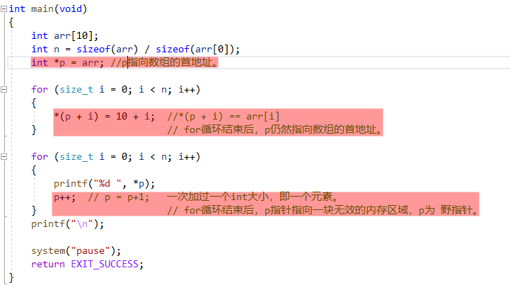

## 9. 数据类型对指针的作用

**作用1：**

```:no-line-numbers
从间接引用的方面来说：决定了从指针存储的地址开始，向后读取的字节数。
```

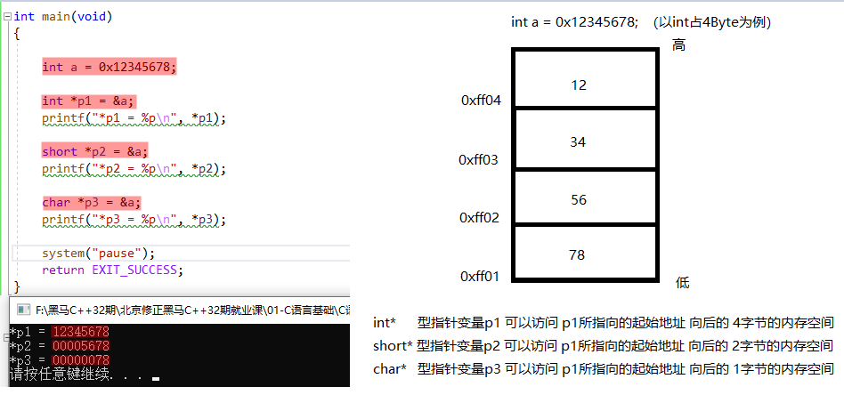

**作用2：**

```:no-line-numbers
从加减运算的方面来说：决定了指针进行 +1/-1 操作后，向后/向前偏移的字节数。
```

## 10. 指针加减运算

### 10.1 指针变量不支持 `*`、`/`、`%` 运算

```:no-line-numbers
不能对指针变量进行 * 、 / 、 % 的运算
```

### 10.2 指针 `+-` 整数

**1. 普通指针变量 `+-` 整数**

```:no-line-numbers
char  *p; 打印  p+1  偏过 1 字节。
short *p; 打印  p+1  偏过 2 字节。
int   *p; 打印  p+1  偏过 4 字节。 
```

**2. 在数组中 `+-` 整数**

```c:no-line-numbers
int arr[] = {1, 3, 5, 8};
int *p = arr;
p+3;  // 向后（右）偏过 3 个元素，即 3x4=12 个字节
p-2;  // 向前（左）偏过 2 个元素，即 3x2=6  个字节
```

**3. `&数组名 + 1`**

```:no-line-numbers
加过一个数组的大小：数组元素个数 x sizeof(数组元素类型)
```

**示例：**

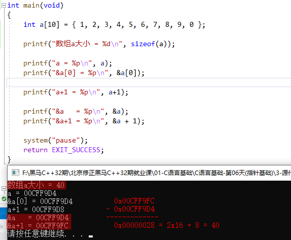

> 如上图，`&a+1` 表示向后偏移一个数组 `a` 的大小

### 10.3 指针 `+-` 指针

```:no-line-numbers
指针 + 指针：不支持，报错。
指针 - 指针：
    1. 对普通变量来说，语法允许，但无实际意义。【了解】
    2. 对数组来说，偏移过的元素个数。
```

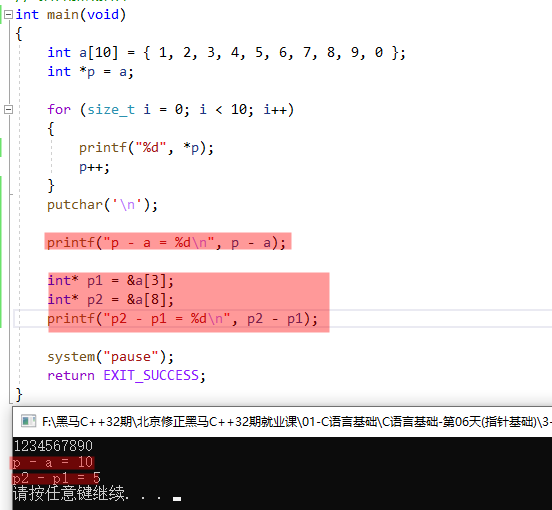

> 上图说明了，在数组中，指针 - 指针 表示偏移过的元素个数。

## 11. 指针实现 `strlen` 函数

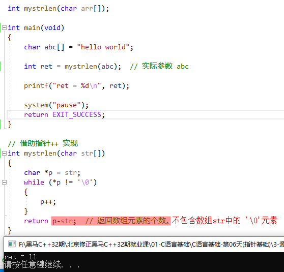

## 12. 指针比较运算

```:no-line-numbers
1. 对普通变量来说，语法允许，但无实际意义。
2. 对数组来说：地址之间可以进行比较大小。可以得到元素存储的先后顺序。
3. 与空指针 NULL 进行比较【常用】
```

**示例：与空指针 `NULL` 进行比较**

```c:no-line-numbers
int *p;
p = NULL;  // 这两行等价于：int *p = NULL;

if (p != NULL)
    printf("p is not NULL");
else
    printf("p is NULL");
```

## 13. 指针数组（存储地址的数组）

指针数组就是一个存储地址的数组。数组内部所有元素都是地址。

## 14. 指针数组和二维数组本质上都是二级指针

**示例1：指针数组的本质是一个二级指针**

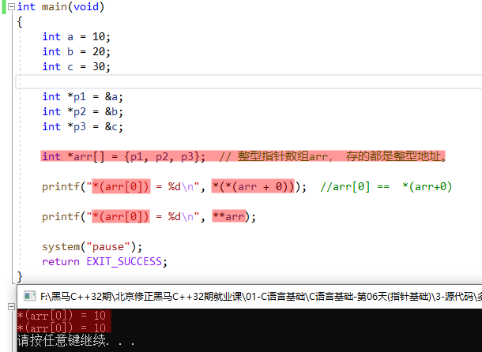

**示例2：二维数组的本质也是一个二级指针**

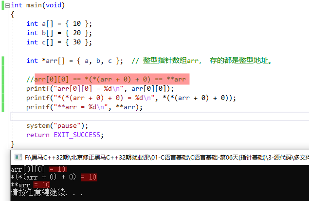

## 15. 多级指针

```:no-line-numbers
int a = 0;

int *p = &a;            一级指针是 变量的地址。

int **pp = &p;          二级指针是 一级指针的地址。

int ***ppp = &pp;       三级指针是 二级指针的地址。（int **p[] 二级指针数组，其本质是一个三级指针）   

int ****pppp = &ppp;    四级指针是 三级指针的地址。【了解】

...
```

**注意：**

```:no-line-numbers
多级指针，不能跳跃定义！
```

**示例：**

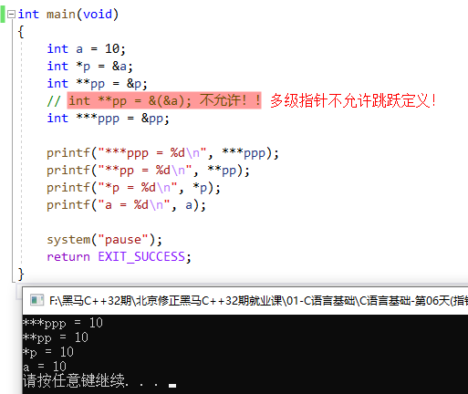

```:no-line-numbers
对应关系：
ppp == &pp;            三级指针

*ppp == pp == &p;             二级指针

**ppp == *pp == p == &a            一级指针

***ppp == **pp == *p == a                普通整型变量
```