## 1. 栈帧

```:no-line-numbers
当函数调用时，系统会在 stack 空间上申请一块内存区域（即：栈帧），
栈帧用来供函数调用，主要存放形参和局部变量（定义在函数内部）。
当函数调用结束，这块内存区域（即：栈帧）自动被释放（消失）。
```

## 2. 传值 & 传址

**传值：** 函数调用期间，实参将自己的值拷贝一份给形参。

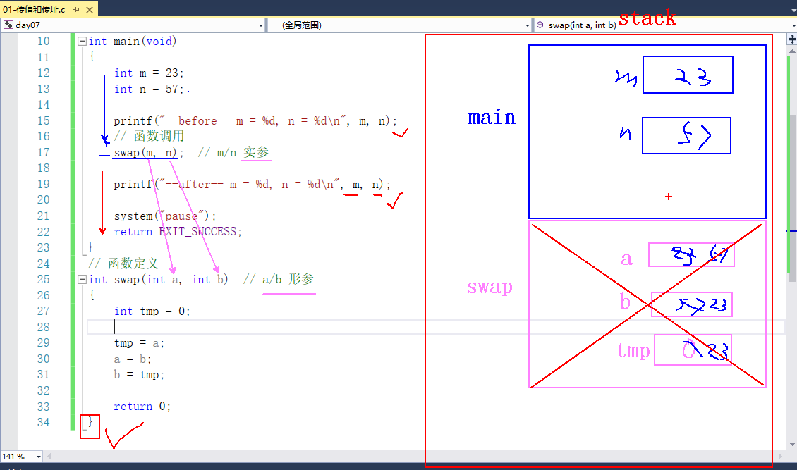

**传址：** 函数调用期间，实参将地址值拷贝一份给形参。

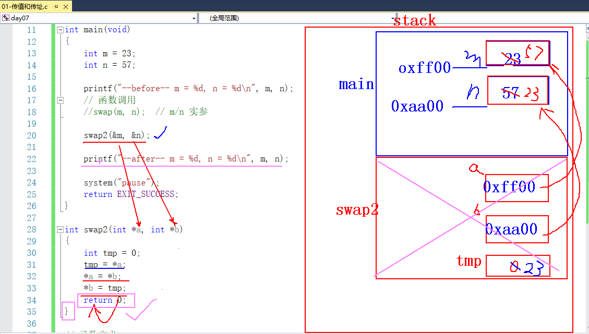

> 传址即：传递地址值。通过地址在 `swap` 函数栈帧内部，修改了 `main` 函数栈帧内部的局部变量值。

## 3. 指针做函数参数

```:no-line-numbers
int swap2(int *a, int *b);
int swap2(char *a, char *b);

调用时，传有效的地址值。
```

## 4. 数组做函数参数

```:no-line-numbers
void BubbleSort(int arr[10])  <=>  void BubbleSort(int arr[])  <=>  void BubbleSort(int *arr)

数组做函数时，传递不再是整个数组，而是数组的首地址（一个指针）。
所以，当整型数组做函数参数时，我们通常在函数定义中，封装2个参数。一个表示数组首地址，一个表示元素个数。
```

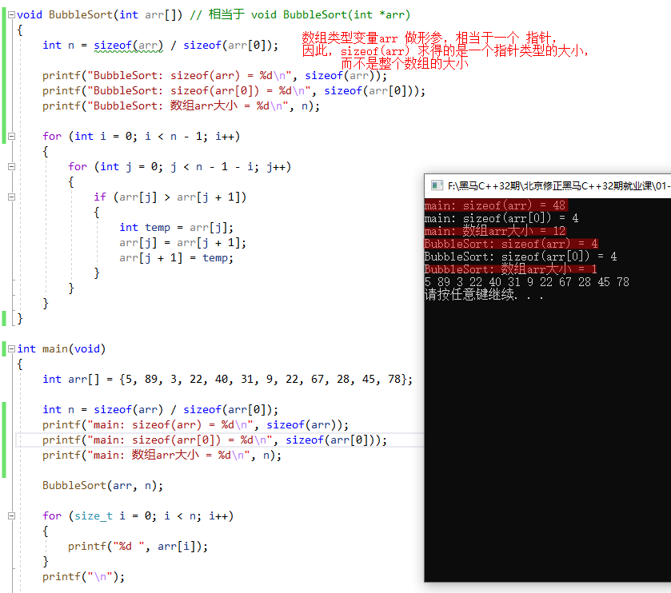

## 5. 指针做函数返回值（注意：不能返回局部变量的地址值）

```:no-line-numbers
int *test_func(int a, int b);

指针做函数返回值，不能返回【局部变量的地址值】，因为被调函数执行完毕后，会销毁对应的栈帧，从而栈帧中保留的局部变量无效。
```

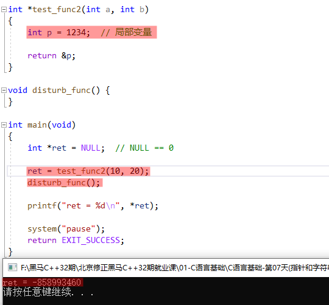

```:no-line-numbers
如上图，当指针做函数 test_func2 的返回值，返回局部变量地址值时，
由于 test_func2 函数调用结束后，其对应的栈帧销毁，从而局部变量 p 无效，无法得到预期的数据 1234。

注意：函数 disturb_func 的作用是保证 test_func2 函数的调用栈帧销毁后，其栈帧空间被 disturb_func 函数复用，
从而使得局部变量 p 中的数据被覆盖成一个不确定的数据。
```

## 6. 数组做函数返回值（C语言不允许）

```:no-line-numbers
C语言，不允许！！！只能写成指针形式。
```

## 7. 指针和字符串

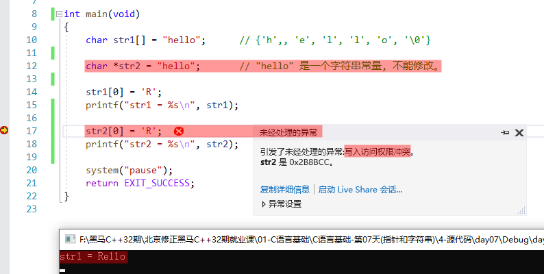

```:no-line-numbers
如上图：
char str1[] = "hello"; 是把字符串常量 "hello" 复制到数组 str1 的内存空间
char *str2 = "hello";  是将指针 str2 指向字符串常量 "hello" 所在的内存地址

因此，可以修改数组 str1 中存储的字符串常量的拷贝，但不能通过指针去直接修改字符串常量本身。
```

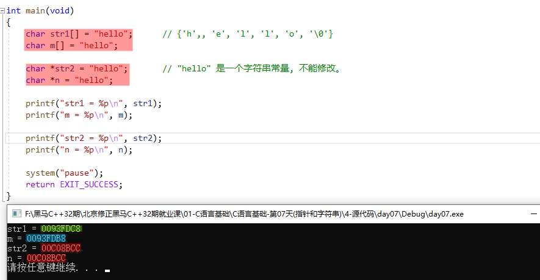

```:no-line-numbers
如上图：
str1 和 m 是两个不同的数组，各自存储着一份对字符串常量 "hello" 的拷贝
str2 和 n 是两个不同的指针，但是都指向同一个字符串常量 "hello" 的内存地址
```

## 8. 字符串初始化的方式

```c:no-line-numbers
// 方式1
char str1[] = {'h', 'i', '\0'};

// 方式2
char str2[] = "hi";

// 方式3
char *str3 = "hi"; 

// 错误方式
char *str4 = {'h', 'i', '\0'};
```

## 9. 字符串（字符数组/字符指针）做函数实参

```:no-line-numbers
当字符串（字符数组），做函数参数时，不需要提供 2 个参数（1 个表示字符串首地址，1个表示字符串有效元素个数）。 
因为每个字符串都有 '\0'，可以借此判断是否遍历到了字符串的结尾
```

## 10. 字符串比较函数（`strcmp`）的实现

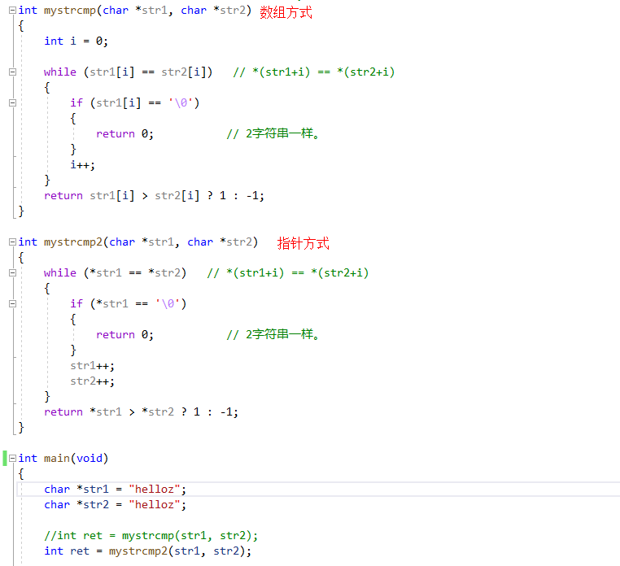

## 11. 字符串拷贝函数（`strcpy`）的实现

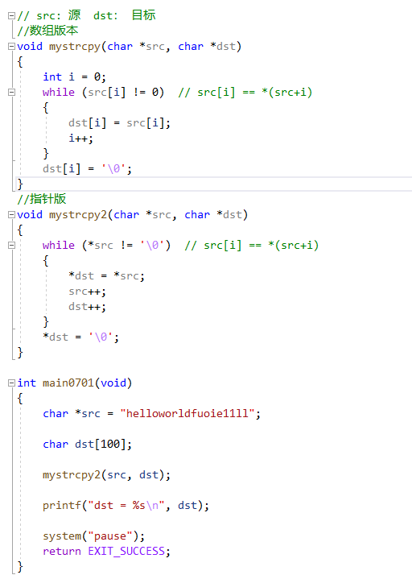

## 12. 字符串去空格

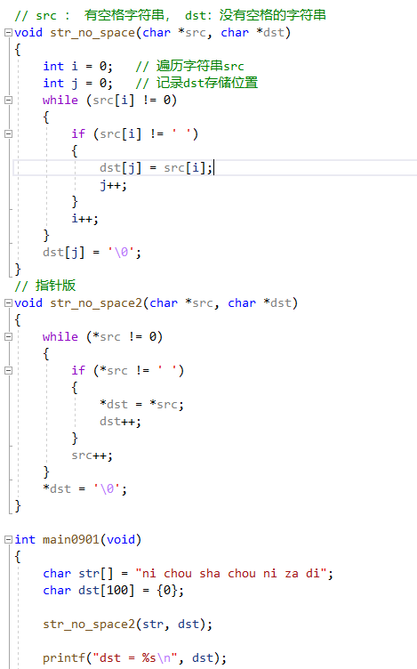

## 13. 带参数的 `main` 函数：`int main(int argc, char *argv[])`

**无参 `main` 函数：**

```:no-line-numbers
int main(void)  <=>  int main()
```

**带参数的 `main` 函数：**

```:no-line-numbers
int main(int argc, char *argv[])   <=>   int main(int argc, char **argv)

参1：表示给 main 函数传递的参数的总个数。
参2：是一个数组。数组的每一个元素都是字符串 char *
```

**示例：**

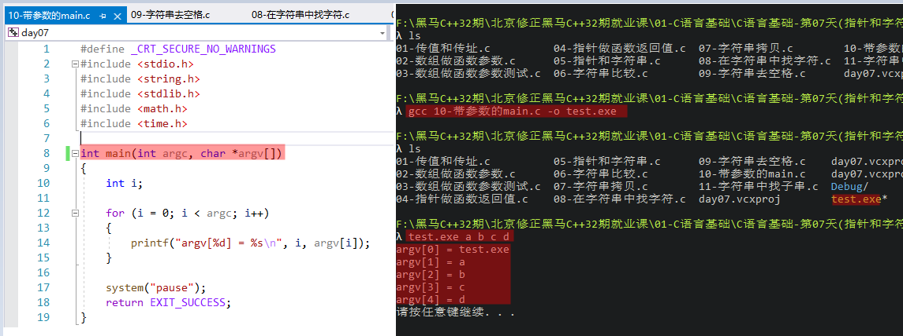

> 如上图，参数 `argv` 数组中的第一个元素是 **命令名称**， 第二个元素开始才是 **命令参数**。

**`VS` 中设置命名参数的步骤：**

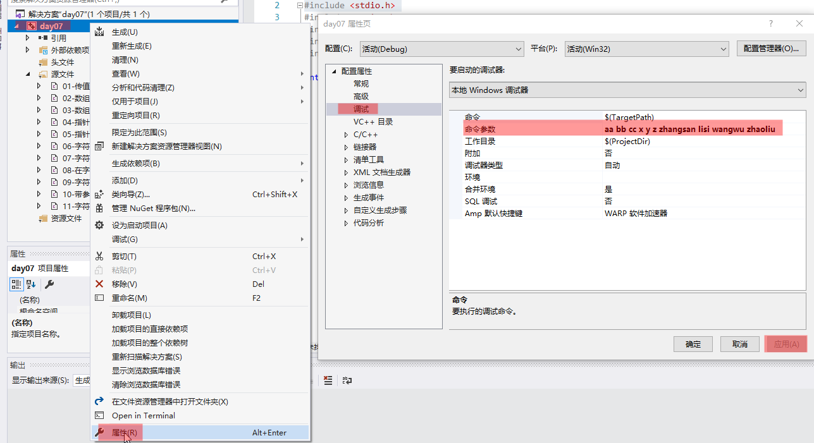

## 14. 字符串操作函数：`strstr`（查找子串位置）

**作用：**

```:no-line-numbers
在 str 中，找 substr 出现的位置。
```

**说明：**

```c:no-line-numbers
#include <string.h>
char *strstr(char *str, char *substr)
    参数1：原串
    参数2：子串
    返回值：子串在原串中的位置。如果有，返回第 1 个子串的首地址值；如果没有，返回 NULL
```

## 15. 字符串中统计子串出现的次数

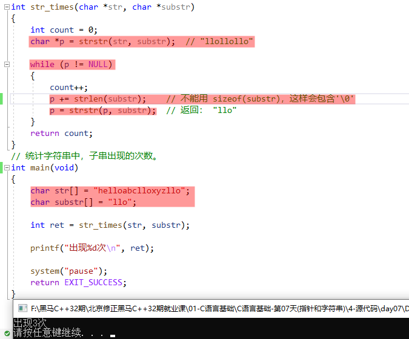