## 1. 求非空字符串元素个数

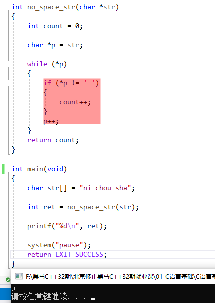

## 2. 字符串逆置

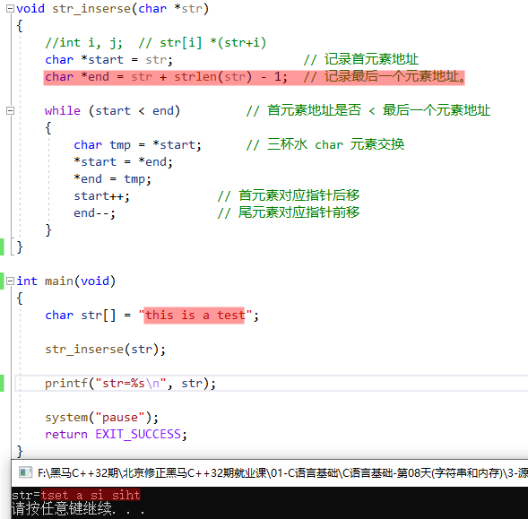

## 3. 回文字符串判断

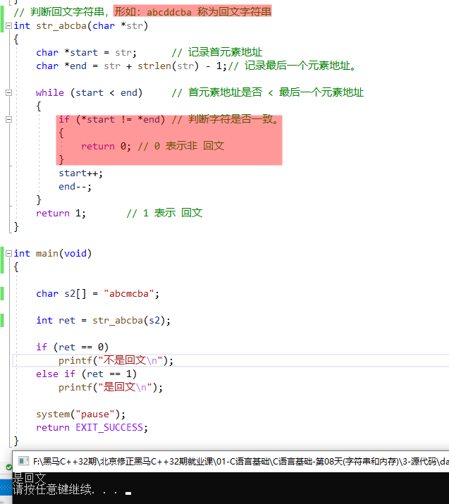

## 4. 字符串处理函数

### 4.1 字符串拷贝：`strcpy` & `strncpy`

**`strcpy`**

```c:no-line-numbers
#include <string.h>
char *strcpy(char *dest, const char *src);

将 src 的内容，拷贝给 dest。返回 dest。 保证 dest 空间足够大。【不安全】，会发生缓冲区溢出。
函数调用结束，返回值和 dest 参数结果一致。
拷贝失败返回 NULL。
```

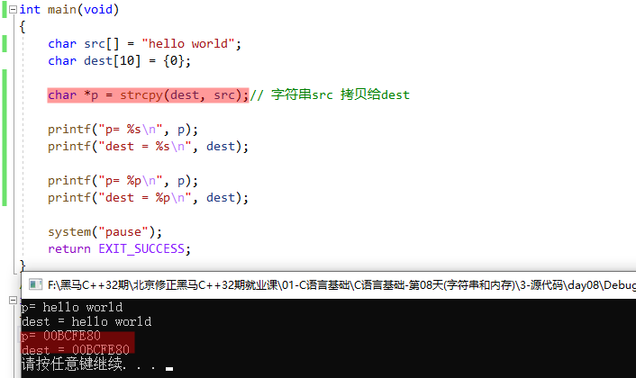

```:no-line-numbers
如上代码：
1. 拷贝成功时，strcpy 返回的地址值和参数数组 dest 的地址值是一样的。
2. 数组 dest 的大小 小于 被拷贝数组 src 的大小，此时会发生缓冲区溢出，
   即 dest 数组内存范围之后的内存空间上也会存储着没拷贝完的 src 数组中的元素。
   由于 printf 函数打印字符串时，遇 '\0' 才结束，所以打印 dest 数组时，
   dest 数组中没有 '\0'，会继续打印 dest 数组内存范围之后的内容，从而把溢出的元素打印出来了。
```

**`strncpy`**

```c:no-line-numbers
#include <string.h>
char *strncpy(char *dest, const char *src, size_t n); 

将 src 的内容，拷贝给 dest。只拷贝 n 个字节。 通常 n 与 dest 对应的空间一致。默认不添加 '\0'

特性：  
1. n > src：只拷贝 src 的大小
2. n < src：只拷贝 n 字节大小。不添加 '\0'
```

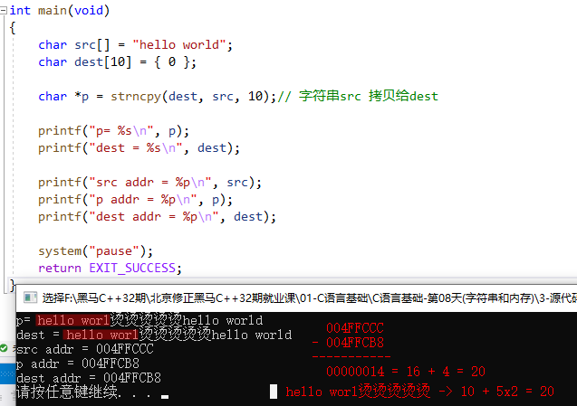

```:no-line-numbers
如上代码：
strncpy(dest, src, 10) 只拷贝 10 个字符，即 "hello worl"，所以 dest 数组中也只有这 10 个字符，缺少 'd' 和 '\0'
printf 函数将 dest 数组做字符串打印时，因为 dest 数组中没有 '\0'，所以一直向后打印，
从源数组 src 和 dest 数组的内存地址可以看出，printf 向后打印时，遇到 src 数组结尾处的 '\0' 才停止。
```

### 4.2 字符串拼接：`strcat` & `strncat`

**`strcat`**

```c:no-line-numbers
#include <string.h>
char *strcat(char *dest, const char *src);

将 src 的内容，拼接到 dest 后。返回拼接后的字符串。保证 dest 空间足够大。
```

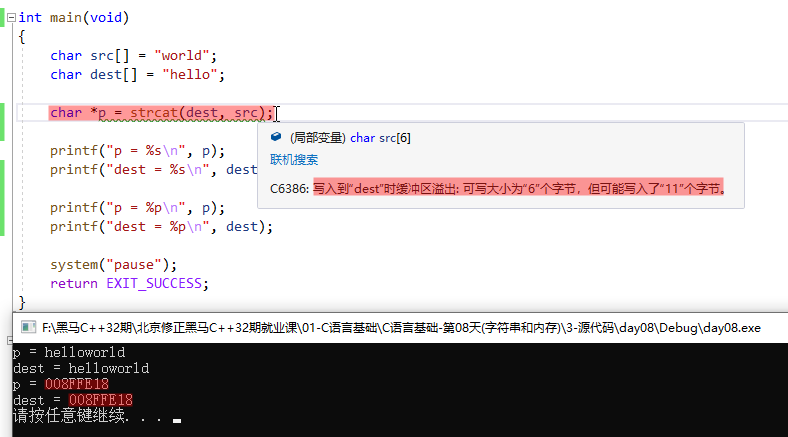

```:no-line-numbers
如上代码：
1. strcat 函数的返回的地址值就是参数数组 dest 的首地址；
2. strcat 函数拼接字符串时，是直接往 dest 数组中追加字符，所以要保证 dest 数组的内存空间足够大，否则会导致缓冲区溢出。
```

**`strncat`**

```c:no-line-numbers
#include <string.h>
char *strncat(char *dest, const char *src, size_t n);

将 src 的前 n 个字符，拼接到 dest 后。返回拼接后的字符串。保证 dest 空间足够大。默认添加 '\0'

函数调用结束，返回值和 dest 参数结果一致。
```

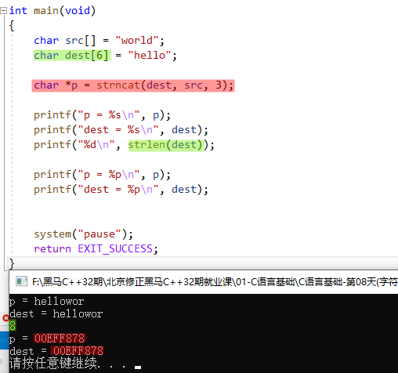

```:no-line-numbers
如上代码：
1. strncat 函数的返回的地址值就是参数数组 dest 的首地址；
2. strncat 函数拼接字符串时，是直接往 dest 数组中追加字符，所以要保证 dest 数组的内存空间足够大，否则会导致缓冲区溢出；
3. strlen 函数计算字符串长度时，不考虑存储字符串的数组的空间大小，以字符串结束标记 '\0' 为准。
```

### 4.3 字符串比较：`strcmp` & `strncmp`

> 注意：不能使用 `>`、`<`、`>=`、`<=`、`==`、`!=` 比较字符串。

**`strcmp`**

```c:no-line-numbers
#include <string.h>
int strcmp(const char *s1, const char *s2);

比较 s1 和 s2 两个字符串，如果相等返回 0；如果不相等，进一步比较 s1 和 s2 对应位的字符的 ASCII 码值。
s1 == s2 返回  0
s1 > s2  返回  1
s1 < s2  返回 -1
```

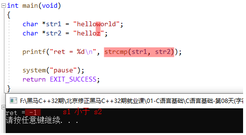

```:no-line-numbers
如上代码：
1. strcmp 函数比较时，不考虑字符串的长短，仅以对应位字符的 ASCII 码作比较。
```

**`strncmp`**

```c:no-line-numbers
#include <string.h>
int strncmp(const char *s1, const char *s2, size_t n);

比较 s1 和 s2 两个字符串的前 n 个字符，
如果相等，返回 0。如果不相等，进一步比较 s1 和 s2 对应位的字符的 ASCII 码值。
s1 > s2 返回  1
s1 < s2 返回 -1
```

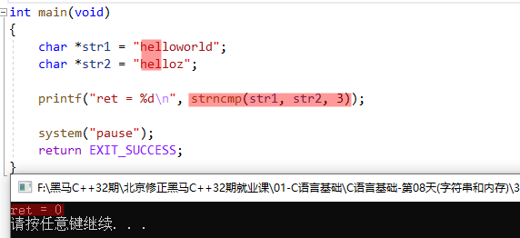

### 4.4 字符串格式化输入输出：`sprintf` & `sscanf`

**`sprintf`**

```c:no-line-numbers
#include <stdio.h>
int sprintf(char *str, const char *format, ...);

对应 printf，将原来写到屏幕的 “格式化字符串”，写到参数1 str 中。
返回 str 所指向的字符串的长度，不包含 '\0'
```

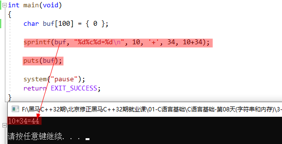

**`sscanf`**

```c:no-line-numbers
#include <stdio.h>
int sscanf(const char *str, const char *format, ...);

对应 scanf，将原来从屏幕获取的 “格式化字符串”， 从参数1 str 中获取。
```

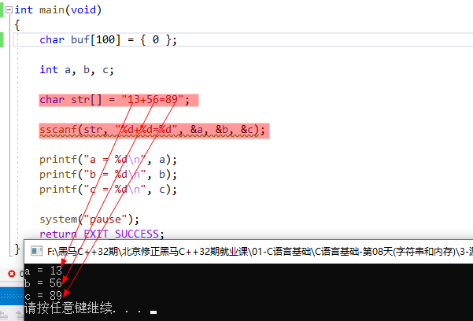

### 4.5 字符串查找字符：`strchr` & `strrchr`

**`strchr`**

```c:no-line-numbers
#include <string.h>
char *strchr(const char *s, int c);

自左向右，在字符串 str 中找一个字符出现的位置。返回字符在字符串中的地址。
```

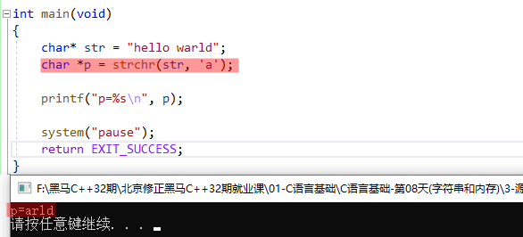

**`strrchr`**

```c:no-line-numbers
#include <string.h>
char *strrchr(const char *s, int c);

自右向左，在字符串 str 中找一个字符出现的位置。返回字符在字符串中的地址。
```

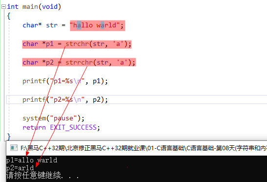

### 4.6 字符串查找子串：`strstr`

```c:no-line-numbers
#include <string.h>
char *strstr(const char *str, const char *substr);

在字符串 str 中，找子串 substr 第一次出现的位置。返回地址。
```

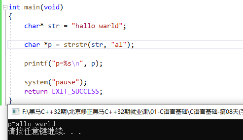

### 4.7 字符串分割：`strtok`

```c:no-line-numbers
#include <string.h>
char *strtok(char *str, const char *delim);
    参数1：待拆分字符串
    参数2：分割符组成的 “分割串”
    返回：字符串拆分后的第 1 个拆分字符串首地址。拆分失败返回 NULL（如被拆分字符串为空字符串 "" 时返回 NULL）

按照既定的分割符，来拆分字符串。
“拆分” 就是：将分割字符用 '\0' 替换。【重要】
每调用一次，只拆分一次："www.baidu.com" -> "www\0baidu.com"【重要】

特性：
1. strtok 拆分字符串是直接在原串上操作，所以要求参数1必须可读可写（char *str = "www.baidu.com" 不行！！！）
2. 第一次拆分，参数1传入待拆分的原串。第 1+i 次拆分时 [i=1,2,3...]，参数1传入 NULL。
```

**示例1：**

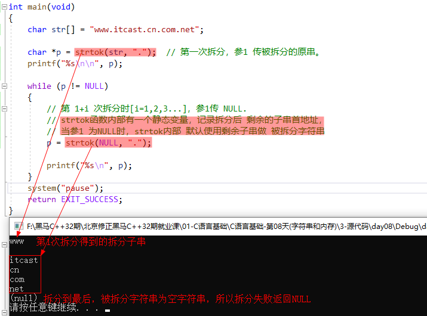

**示例2：**

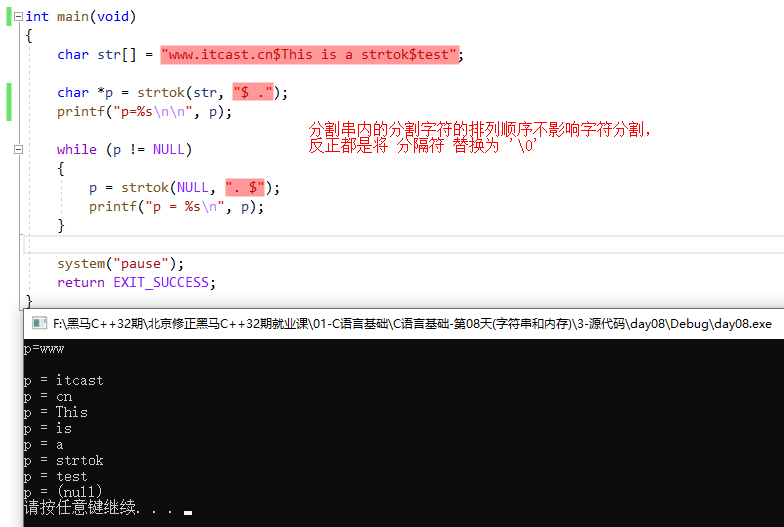

### 4.8 字符串转整数或浮点数

## 5. 局部变量

## 6. 全局变量

## 7. `static` 全局变量

## 8. `static` 局部变量

## 9. 全局函数

## 10. `static` 函数

## 11. 生命周期

## 12. 内存四区模型：代码段 & 数据段 & `stack` & `heap`

## 13. 申请 & 释放堆空间（`heap` 空间）

### 13.1 申请堆空间：`void *malloc(size_t size)`

### 13.2 释放堆空间：`void free(void *ptr)`

### 13.3 使用堆空间的注意事项

### 13.4 二级指针对应的堆空间

## 14. 内存常见问题