## 1. 求非空字符串元素个数


## 2. 字符串逆置


## 3. 回文字符串判断


## 4. 字符串处理函数

### 4.1 字符串拷贝：`strcpy` & `strncpy`

**`strcpy`**

```c:no-line-numbers
#include <string.h>
char *strcpy(char *dest, const char *src);

将 src 的内容，拷贝给 dest。返回 dest。 保证 dest 空间足够大。【不安全】，会发生缓冲区溢出。
函数调用结束，返回值和 dest 参数结果一致。
拷贝失败返回 NULL。
```


```:no-line-numbers
如上代码：
1. 拷贝成功时，strcpy 返回的地址值和参数数组 dest 的地址值是一样的。
2. 数组 dest 的大小 小于 被拷贝数组 src 的大小，此时会发生缓冲区溢出，
   即 dest 数组内存范围之后的内存空间上也会存储着没拷贝完的 src 数组中的元素。
   由于 printf 函数打印字符串时，遇 '\0' 才结束，所以打印 dest 数组时，
   dest 数组中没有 '\0'，会继续打印 dest 数组内存范围之后的内容，从而把溢出的元素打印出来了。
```

**`strncpy`**

```c:no-line-numbers
#include <string.h>
char *strncpy(char *dest, const char *src, size_t n); 

将 src 的内容，拷贝给 dest。只拷贝 n 个字节。 通常 n 与 dest 对应的空间一致。默认不添加 '\0'

特性：  
1. n > src：只拷贝 src 的大小
2. n < src：只拷贝 n 字节大小。不添加 '\0'
```


```:no-line-numbers
如上代码：
strncpy(dest, src, 10) 只拷贝 10 个字符，即 "hello worl"，所以 dest 数组中也只有这 10 个字符，缺少 'd' 和 '\0'
printf 函数将 dest 数组做字符串打印时，因为 dest 数组中没有 '\0'，所以一直向后打印，
从源数组 src 和 dest 数组的内存地址可以看出，printf 向后打印时，遇到 src 数组结尾处的 '\0' 才停止。
```

### 4.2 字符串拼接：`strcat` & `strncat`

**`strcat`**

```c:no-line-numbers
#include <string.h>
char *strcat(char *dest, const char *src);

将 src 的内容，拼接到 dest 后。返回拼接后的字符串。保证 dest 空间足够大。
```


```:no-line-numbers
如上代码：
1. strcat 函数的返回的地址值就是参数数组 dest 的首地址；
2. strcat 函数拼接字符串时，是直接往 dest 数组中追加字符，所以要保证 dest 数组的内存空间足够大，否则会导致缓冲区溢出。
```

**`strncat`**

```c:no-line-numbers
#include <string.h>
char *strncat(char *dest, const char *src, size_t n);

将 src 的前 n 个字符，拼接到 dest 后。返回拼接后的字符串。保证 dest 空间足够大。默认添加 '\0'

函数调用结束，返回值和 dest 参数结果一致。
```


```:no-line-numbers
如上代码：
1. strncat 函数的返回的地址值就是参数数组 dest 的首地址；
2. strncat 函数拼接字符串时，是直接往 dest 数组中追加字符，所以要保证 dest 数组的内存空间足够大，否则会导致缓冲区溢出；
3. strlen 函数计算字符串长度时，不考虑存储字符串的数组的空间大小，以字符串结束标记 '\0' 为准。
```

### 4.3 字符串比较：`strcmp` & `strncmp`

> 注意：不能使用 `>`、`<`、`>=`、`<=`、`==`、`!=` 比较字符串。

**`strcmp`**

```c:no-line-numbers
#include <string.h>
int strcmp(const char *s1, const char *s2);

比较 s1 和 s2 两个字符串，如果相等返回 0；如果不相等，进一步比较 s1 和 s2 对应位的字符的 ASCII 码值。
s1 == s2 返回  0
s1 > s2  返回  1
s1 < s2  返回 -1
```


```:no-line-numbers
如上代码：
1. strcmp 函数比较时，不考虑字符串的长短，仅以对应位字符的 ASCII 码作比较。
```

**`strncmp`**

```c:no-line-numbers
#include <string.h>
int strncmp(const char *s1, const char *s2, size_t n);

比较 s1 和 s2 两个字符串的前 n 个字符，
如果相等，返回 0。如果不相等，进一步比较 s1 和 s2 对应位的字符的 ASCII 码值。
s1 > s2 返回  1
s1 < s2 返回 -1
```


### 4.4 字符串格式化输入输出：`sprintf` & `sscanf`

**`sprintf`**

```c:no-line-numbers
#include <stdio.h>
int sprintf(char *str, const char *format, ...);

对应 printf，将原来写到屏幕的 “格式化字符串”，写到参数1 str 中。
返回 str 所指向的字符串的长度，不包含 '\0'
```


**`sscanf`**

```c:no-line-numbers
#include <stdio.h>
int sscanf(const char *str, const char *format, ...);

对应 scanf，将原来从屏幕获取的 “格式化字符串”， 从参数1 str 中获取。
```


### 4.5 字符串查找字符：`strchr` & `strrchr`

**`strchr`**

```c:no-line-numbers
#include <string.h>
char *strchr(const char *s, int c);

自左向右，在字符串 str 中找一个字符出现的位置。返回字符在字符串中的地址。
```


**`strrchr`**

```c:no-line-numbers
#include <string.h>
char *strrchr(const char *s, int c);

自右向左，在字符串 str 中找一个字符出现的位置。返回字符在字符串中的地址。
```


### 4.6 字符串查找子串：`strstr`

```c:no-line-numbers
#include <string.h>
char *strstr(const char *str, const char *substr);

在字符串 str 中，找子串 substr 第一次出现的位置。返回地址。
```


### 4.7 字符串分割：`strtok`

```c:no-line-numbers
#include <string.h>
char *strtok(char *str, const char *delim);
    参数1：待拆分字符串
    参数2：分割符组成的 “分割串”
    返回：字符串拆分后的第 1 个拆分字符串首地址。拆分失败返回 NULL（如被拆分字符串为空字符串 "" 时返回 NULL）

按照既定的分割符，来拆分字符串。
“拆分” 就是：将分割字符用 '\0' 替换。【重要】
每调用一次，只拆分一次："www.baidu.com" -> "www\0baidu.com"【重要】

特性：
1. strtok 拆分字符串是直接在原串上操作，所以要求参数1必须可读可写（char *str = "www.baidu.com" 不行！！！）
2. 第一次拆分，参数1传入待拆分的原串。第 1+i 次拆分时 [i=1,2,3...]，参数1传入 NULL。
```

**示例1：**


**示例2：**


### 4.8 字符串转整数或浮点数：`atoi`/`atof`/`atol`

```:no-line-numbers
atoi/atof/atol：a（字符串）  to（转） i（int整数）/ f（浮点数）/ l（long整数）
使用这类函数进行转换时要求：原串必须是可转换的字符串。
错误使用："abc123" -> 0;    "12abc345" -> 12;  "123xyz" -> 123
```

**`atoi` 字符串转整数**

```c:no-line-numbers
#include <stdlib.h>
int atoi(const char *nptr);
```

**`atof` 字符串转浮点数**

```c:no-line-numbers
#include <stdlib.h>
double atof(const char *nptr);
```

**`atol` 字符串转长整数**

```c:no-line-numbers
#include <stdlib.h>
long atol(const char *nptr);
```

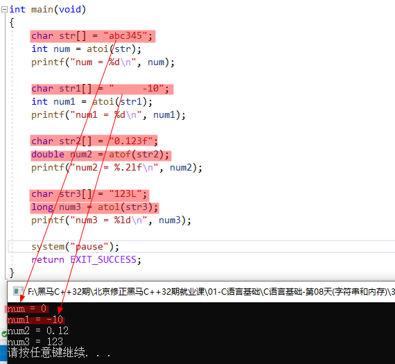

## 5. 局部变量（及其作用域）

```:no-line-numbers
概念：定义在函数内部的变量。
作用域：从定义位置开始，到包裹该变量的第一个右大括号结束。
```

## 6. 全局变量（及其作用域）

```:no-line-numbers
概念：定义在函数外部的变量。
作用域：从定义位置开始，默认到本文件内部。其他文件如果想使用，可以通过声明方式（extern）将作用域导出。
```

## 7. `static` 全局变量（及其作用域）

```:no-line-numbers
定义语法：在全局变量定义之前添加 static 关键字。如：static int a = 10；
作用域：被限制在本文件内部，不允许通过声明导出到其他文件。
```

## 8. `static` 局部变量（及其作用域）

```:no-line-numbers
定义语法：在局部变量定义之前添加 static 关键字。
特性：静态局部变量只在全局位置上定义一次。 通常用来做计数器。
作用域：从定义位置开始，到包裹该变量的第一个右大括号结束。（作用域跟非 static 局部变量一致，但生命周期不同）
```

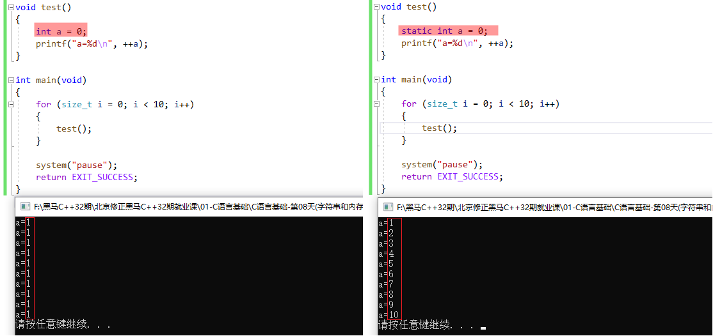

> 如上图，对比可看出，右侧的静态局部变量 `a` 只定义了一次，即重复调用 `test` 函数时，不会再重复定义静态局部变量 `a`，从而达到了递增的目的。

## 9. 全局函数

```:no-line-numbers
定义语法： 函数原型 + 函数体
```

## 10. `static` 函数

```:no-line-numbers
定义语法：static + 函数原型 + 函数体
static 函数只能在本文件内部使用。其他文件即使声明也无效。
```

## 11. 生命周期（生命周期和作用域之间没有关系）

```:no-line-numbers
局部变量：       从变量定义开始，函数调用完成。 --- 函数内部。

全局变量：       程序启动开始，程序终止结束。  --- 程序执行期间。

static局部变量： 程序启动开始，程序终止结束。  --- 程序执行期间。

static全局变量： 程序启动开始，程序终止结束。  --- 程序执行期间。

全局函数：       程序启动开始，程序终止结束。  --- 程序执行期间。

static函数：     程序启动开始，程序终止结束。  --- 程序执行期间。
```

## 12. 内存四区模型：代码段 & 数据段 & `stack` & `heap`

```:no-line-numbers
代码段：
    .text段。 程序源代码（二进制形式）。

数据段：
    只读数据段 .rodata 段。（常量）
    初始化数据段 .data 段。（初始化为非 0 的全局变量和静态变量【包括静态局部变量和静态全局变量】）
    未初始化数据段 .bss 段。（初始化为 0 or 未初始化的全局变量和静态变量。程序加载执行前，会将该段整体赋值为 0）

stack：
    栈。 在其之上开辟栈帧。    
    windows 1M --- 10M    Linux： 8M --- 16M

heap：
    堆。 给用户自定义数据提供空间。 约 1.3G+
```

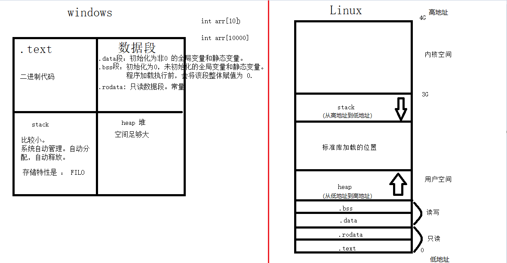

> `windows` 底层源码未开源，所以 `windows` 的内存4区模型只是大致的；
> 
> `Linux` 底层源码是开源的，所以上图 `Linux` 的内存4区模型就是实际的。

## 13. 申请 & 释放堆空间（`heap` 空间）

### 13.1 申请堆空间：`void *malloc(size_t size)`

```c:no-line-numbers
void *malloc(size_t size);  

申请 size 大小的空间。
返回实际申请到的内存空间首地址。【我们通常拿来当数组用】
```

### 13.2 释放堆空间：`void free(void *ptr)`

```c:no-line-numbers
void free(void *ptr);   

参数 ptr：malloc 申请函数返回的地址值。
```

**示例：**

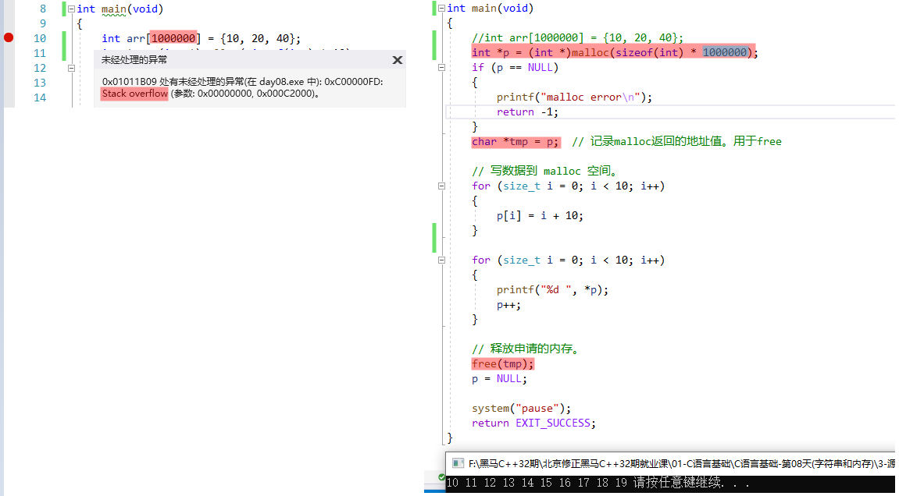

```:no-line-numbers
如上代码：
1. 形如 int arr[1000000] = {10, 20, 40}; 是在栈（stack）上申请内存空间，因为栈空间较小，所以当申请空间过大时，会发生栈溢出。  
   而调用 malloc 函数，则是在堆（heap）上申请内存空间，因为堆空间远大于栈空间，所以并不会发生内存溢出。

2. malloc 函数的返回值类型为 void * ，是可以隐式转换为 int * 的。 但是，为了使代码更明确，一般通过 (类型) 显示转换为指定类型。
```

### 13.3 使用堆空间的注意事项

```:no-line-numbers
1. 空间是连续。当成数组使用。
2. free 后的空间，不会立即失效。通常将 free 后的地址置为 NULL。
3. free 地址必须是 malloc 申请地址。否则出错。（如果 malloc 之后的地址一定会变化，那么使用临时变量 tmp 保存）
```

**示例1：**

```:no-line-numbers
如下代码，虽然调用 free 函数后，指针 p 所指向的地址空间中的数据被清除了，
但是指针 p 所指向的地址空间还是可以访问的，即该地址空间仍然有效，可以使用。
因此，为了避免使用 free 后的地址空间，应该将指针 p 置为 NULL。
```

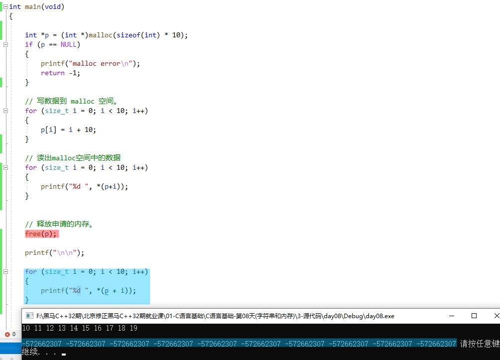

**示例2：**

```:no-line-numbers
如下代码，原本指向 malloc 所申请空间首地址的指针 p 的指向发生了改变（p++;）
此时，再调用 free(p); 所释放的地址就不是 malloc 所申请空间的首地址了，从而程序报错。
解决方案：使用临时变量 tmp 保存 malloc 申请到的空间首地址。即：

    char *tmp = p;
    ...
    p++;
    ...
    free(tmp);
    p = NULL;
    tmp = NULL;
```

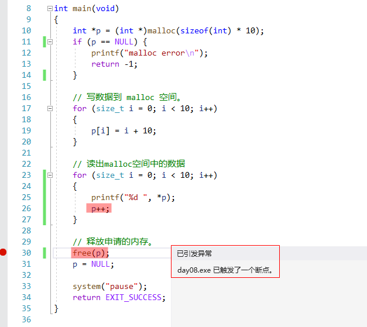

### 13.4 二级指针对应的堆空间

```:no-line-numbers
申请外层指针： 
    char **p = (char **)malloc(sizeof(char *) * 5);

申请内层指针： 
    for(i = 0; i < 5; i++)
    {
        p[i] = (char *)malloc(sizeof(char) *10);
    }

使用：不能修改 p 的值。
    for(i = 0; i < 5; i++)
    {
        strcpy(p[i], "helloheap");
    }

释放内层：
    for(i = 0; i < 5; i++)
    {
        free(p[i]);
    }

释放外层：
    free(p);
```

**示例：**

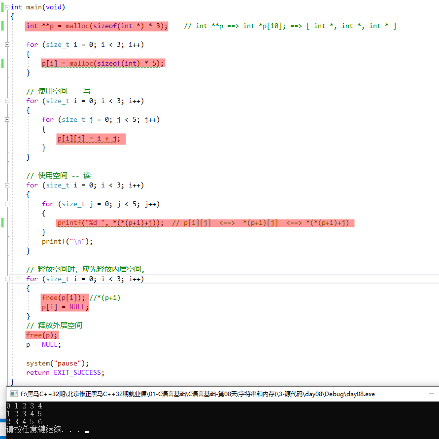

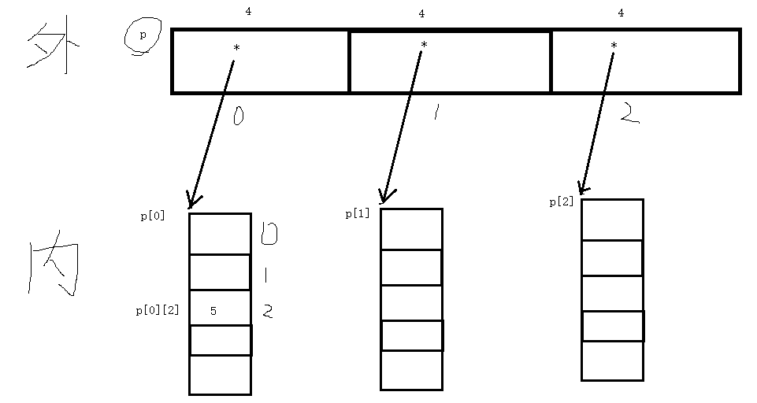

## 14. 内存常见问题

### 14.1 问题1：申请 `0` 字节空间

```c:no-line-numbers
int *p = (int *)malloc(0); // 此时指针 p 其实就是野指针
```

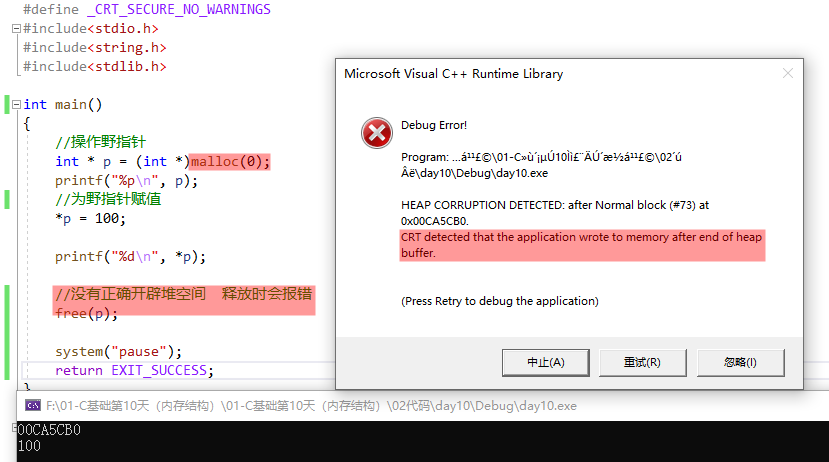

### 14.2 问题2：多次 `free` 同一个指针

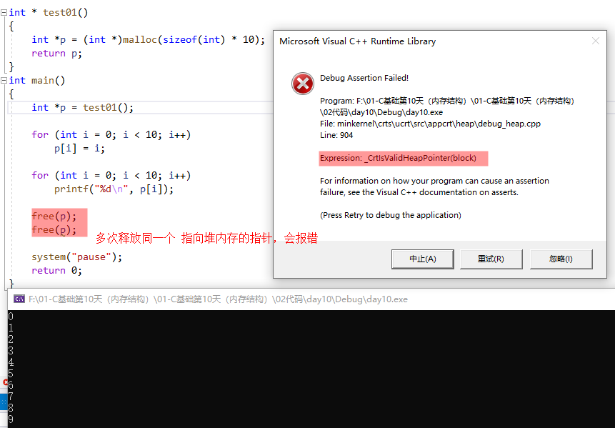

### 14.3 问题3：`free` 空指针

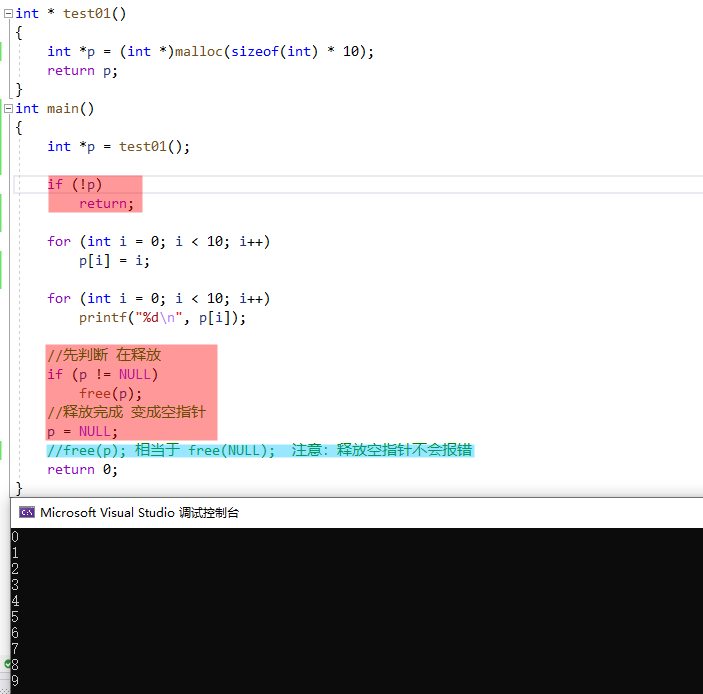

### 14.4 问题4：越界访问

### 14.5 问题5：`free` ++后的地址

### 14.6 问题6：子函数 `malloc` 空间，`main` 中用

## 15. 内存操作函数

### 15.1 内存填充：`memset`

```c:no-line-numbers
#include <string.h>
void *memset(void *s, int c, size_t n);
    功能：将 s 指向的内存区域的前 n 个字节以参数 c 填入
    参数：
        s：需要操作内存 s 的首地址
        c：填充的字符，c 虽然参数为i nt，但必须是 unsigned char , 范围为 0~255
        n：指定需要设置的大小，单位：字节
    返回值：s 的首地址
```

**示例1：**

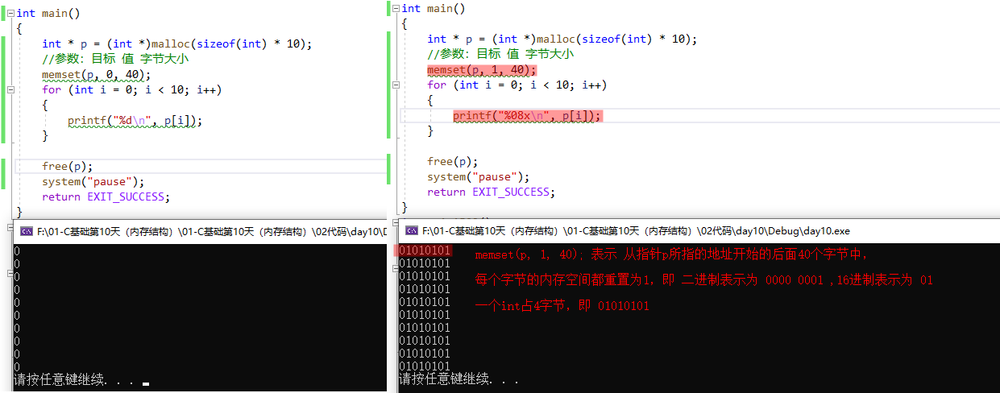

**示例2：通常使用 `memset` 函数将内存空间重置为 `0`**

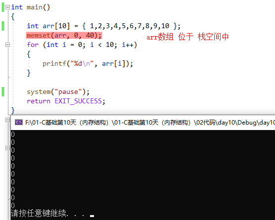

> **注意：** 如上代码所示，`memset` 函数还可以用来重置栈上的内存空间。

### 15.2 内存拷贝：`memcpy`

```c:no-line-numbers
#include <string.h>
void *memcpy(void *dest, const void *src, size_t n);
    功能：拷贝 src 所指的内存内容的前 n 个字节到 dest 所值的内存地址上。
    参数：
        dest：目的内存首地址
        src：源内存首地址，注意：des t和 src 所指的内存空间不可重叠，可能会导致程序报错。
        n：需要拷贝的字节数
    返回值：dest 的首地址

    memcpy 的错误用法（内存重叠）：
    int a[10] = { 1, 2, 3, 4, 5, 6, 7, 8, 9, 10 };
    memcpy(&a[3], a, 5 * sizeof(int)); // err, 内存重叠，即：可能导致对同一个内存单元同时进行读和写的操作
```

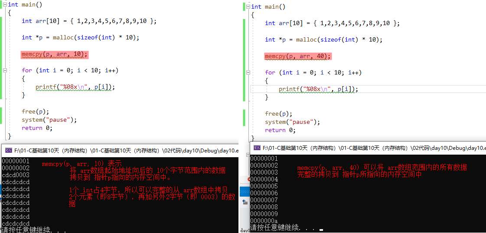

### 15.3 内存移动：`memmove`

```c:no-line-numbers
#include <string.h>
void *memcpy(void *dest, const void *src, size_t n);
    功能：拷贝 src 所指的内存内容的前 n 个字节到 dest 所值的内存地址上。
    参数：
        dest：目的内存首地址
        src：源内存首地址，注意：dest 和 src 所指的内存空间不可重叠，可能会导致程序报错
        n：需要拷贝的字节数
    返回值：dest 的首地址

    memmove() 功能用法和 memcpy() 一样，区别在于：
        dest 和 src 所指的内存空间重叠时，memmove()仍然能处理，不过执行效率比 memcpy() 低些。
        如果 dest 和 src 所指的内存空间没有重叠，两个函数效率一样
```

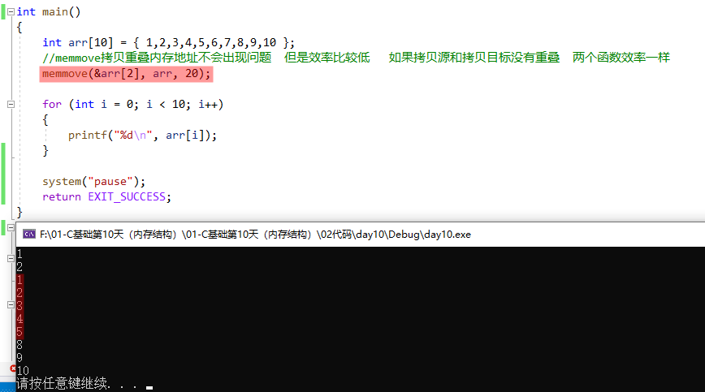

### 15.4 内存比较：`memcmp`

```c:no-line-numbers
#include <string.h>
int memcmp(const void *s1, const void *s2, size_t n);
    功能：比较 s1 和 s2 所指向内存区域的前 n 个字节
    参数：
        s1：内存首地址1
        s2：内存首地址2
        n：需比较的前 n 个字节
    返回值：
        相等：=0
        大于：>0
        小于：<0
```

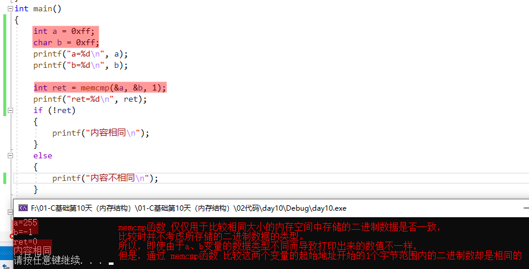