## 1. `printf`/`scanf`/`perror` 函数与其对应的系统文件

`printf`（标准输入）、`scanf`（标准输出）、`perror`（标准错误） 这三个函数分别用于向不同的系统文件（`stdin` 文件、`stdout` 文件、`stderr` 文件）中读写数据，然后再通过操作系统，将系统文件和物理设备关联起来。

```:no-line-numbers
scanf函数  -- 标准输入 -- stdin文件（编号0）  -- 键盘

printf函数 -- 标准输出 -- stdout文件（编号1） -- 屏幕

perror函数 -- 标准错误 -- stderr文件（编号2） -- 屏幕
```

### 1.1 系统文件的隐式回收

应用程序启动时，自动被打开；程序执行结束时，自动被关闭。

## 2. 文件指针和普通指针的区别

与普通指针不同的是，文件指针的初始化、赋值等操作基本都是借助文件操作函数来实现的，如：

1. 借助文件操作函数来改变 `fp` 为空、野指针的状况

    ```c:no-line-numbers
    FILE *fp = NULL;
    fp = fopen("test2.txt", "w"); // fopen() 函数相当于 fp = malloc();
    ``` 

2. 操作文件，使用文件读写函数来完成。如：

    ```:no-line-numbers
    fputc/fgetc
    fputs/fgets
    fwrite/fread
    ```

### 2.1 `FILE` 结构体

`FILE` 是系统使用 `typedef` 定义出来的有关文件信息的一种结构体类型，结构中含有文件名、文件状态和文件当前位置等信息:

```c:no-line-numbers
typedef struct
{
    short           level;     // 缓冲区"满"或者"空"的程度
    unsigned        flags;     // 文件状态标志
    char            fd;        // 文件描述符
    unsigned char   hold;      // 如无缓冲区不读取字符
    short           bsize;     // 缓冲区的大小
    unsigned char   *buffer;   // 数据缓冲区的位置
    unsigned        ar;        // 指针，当前的指向
    unsigned        istemp;    // 临时文件，指示器
    short           token;     // 用于有效性的检查
}FILE;
```

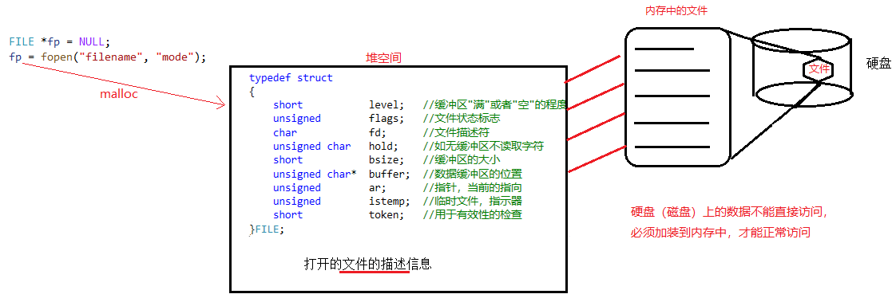

## 3. 文件分类：设备文件 & 磁盘文件

**设备文件**

```:no-line-numbers
屏幕、键盘、磁盘、网卡、声卡、显卡、扬声器 ...
```

**磁盘文件**

```:no-line-numbers
文本文件：
    ASCII

二进制文件： 
    0101 二进制编码
```

## 4. 文件操作一般步骤

```:no-line-numbers
1. 打开文件 fopen() => 返回 FILE *fp 指针;

2. 读写文件 fputc、fgetc、fputs、fgets、fread、fwrite

3. 关闭文件 fclose()  
```

## 5. 打开、关闭文件函数：`fopen` & `fclose`

**打开文件**

```c:no-line-numbers
#include <stdio.h>
FILE * fopen(const char * filename, const char * mode);
    参1：待打开文件的文件名（访问路径）
    参2：文件打开权限：
        "r"：只读方式打开文件，文件不存在，报错。存在，以只读方式打开。
        "w"：只写方式打开文件，文件不存在，创建一个空文件。文件如果存在，清空并打开。
        "w+"：读、写方式打开文件，文件不存在，创建一个空文件。文件如果存在，清空并打开。
        "r+"：读、写方式打开文件, 文件不存在，报错。存在，以读写方式打开。
        "a"：以追加的方式打开文件。
        "b"：操作的文件是一个二进制文件
             b 只是在 Windows 有效，在 Linux 用 r 和 rb 的结果是一样的，
             这是因为文本方式和二进制方式在打开文件时的区别，仅仅体现在换行符的处理上，
             而 Linux 下的换行符就是 \n，所以文本文件方式和二进制方式无区别；
             对于 Window 系统：
                当对文件使用文本方式打开的时候，读写的 windows 文件中的换行符 \r\n 会被替换成 \n 读到内存中，
                当在 windows 下写入文件的时候，\n 被替换成 \r\n 再写入文件。
                如果使用二进制方式打开文件，则不进行 \r\n 和 \n 之间的转换。
                也就是说，"b" 的作用就在于：不进行 \r\n 和 \n 之间的转换。 
    返回值：
        成功：返回打开文件的文件指针
        失败：NULL
```

**关闭文件**

```c:no-line-numbers
#include <stdio.h>
int fclose(FILE * stream);
    参1：打开文件的 fp（fopen 的返回值）
    返回值：
        成功： 0， 
        失败：-1;
```

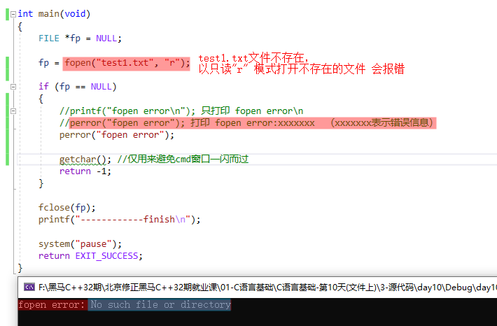

## 6. 文件访问路径：绝对路径 & 相对路径

**绝对路径**

```:no-line-numbers
从系统磁盘的根盘符开始，找到待访问的文件路径。
Windows 书写方法：
    1. C:\\Users\\afei\\Desktop\\06-文件分类.avi
    2. C:/Users/afei/Desktop/06-文件分类.avi  (也适用于 Linux)
```

**相对路径**

```:no-line-numbers
1. 如果在 VS 环境下编译执行（Ctrl+F5），文件相对路径是指相对于 day10.vcxproj 所在目录位置。
2. 如果是双击 xxx.exe 文件执行，文件的相对路径是相对于 xxx.exe 所在目录位置。
```

## 7. 按字符写文件：`fputc`

```c:no-line-numbers
#include <stdio.h>
int fputc(int ch, FILE * stream);
    参1：待写入的字符
    参2：打开文件的 fp（fopen 的返回值）
    返回值：
        成功：写入文件中的字符对应的 ASCII 码
        失败：-1
```

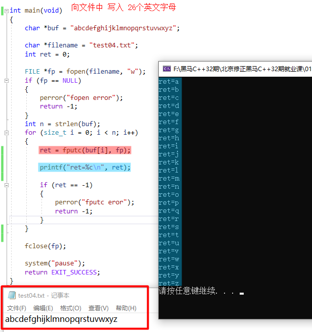

## 8. 按字符读文件：`fgetc`

```c:no-line-numbers
#include <stdio.h>
int fgetc(FILE * stream);
    参1：待读取的文件 fp（fopen 的返回值）
    返回值： 
        成功：读到的字符对应的 ASCII 码
        失败：-1
```

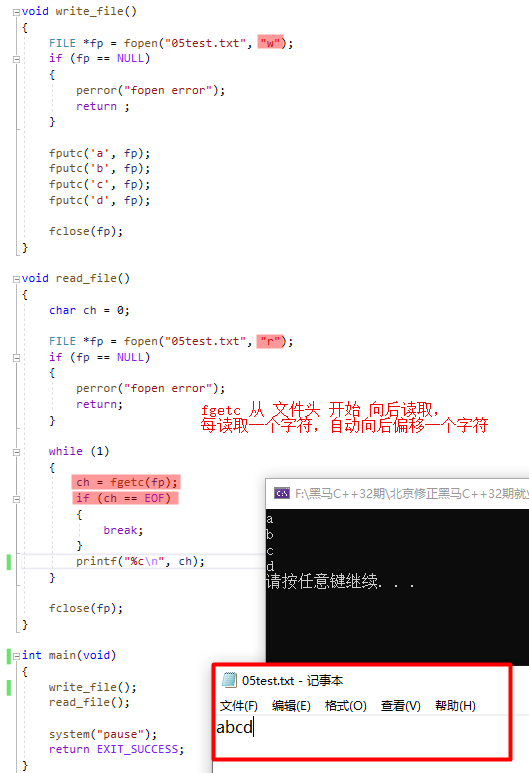

> 文本文件的结束标记：`EOF`
> 
> ```c:no-line-numbers
> #define EOF  (-1)
> ```

## 9. 判断是否到达文件结尾：`feof`

```c:no-line-numbers
#include <stdio.h>
int feof(FILE * stream);
    参1： fopen 的返回值
    返回值： 
        到达文件结尾：非0【真】
        没到达文件结尾：0【假】
    作用：    
        用来判断到达文件结尾。既可以判断文本文件；也可以判断二进制文件。
    特性：
        要想使用 feof() 检测文件结束标记，必须在该函数调用之前，使用读文件函数。
        即：feof() 调用之前，必须有读文件函数调用。
```

**示例1：使用 `if (ch == EOF)` 判断是否到达文件结尾的问题**

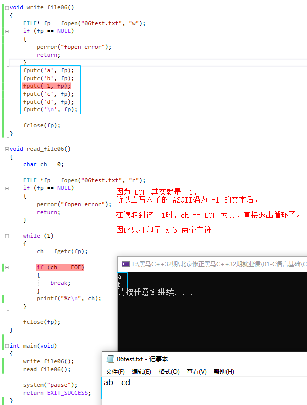

> 如上图，使用 `ch == EOF` 判断是否到达文件结尾是存在 `bug` 的。

**示例2：使用 `if (feof(fp))` 判断是否到达文件结尾**

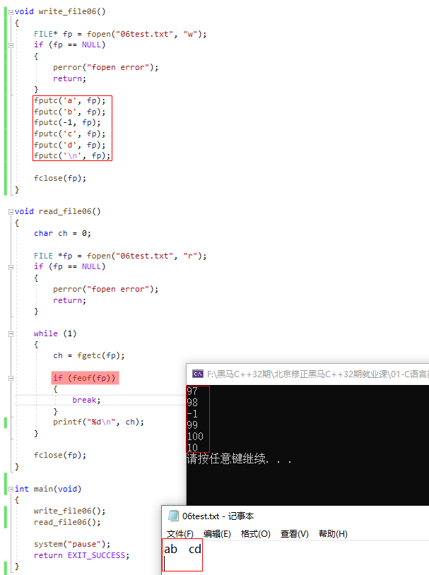

> 如上图，通过 `feof` 函数判断是否读到文件结尾，可以避免当写入了 `ASCII` 码为 `-1` 的文本后，所造成的读取时 `if(ch == EOF)` 引起误判的 `bug`。

**示例3：调用 `feof` 函数前需要进行文件的读操作**

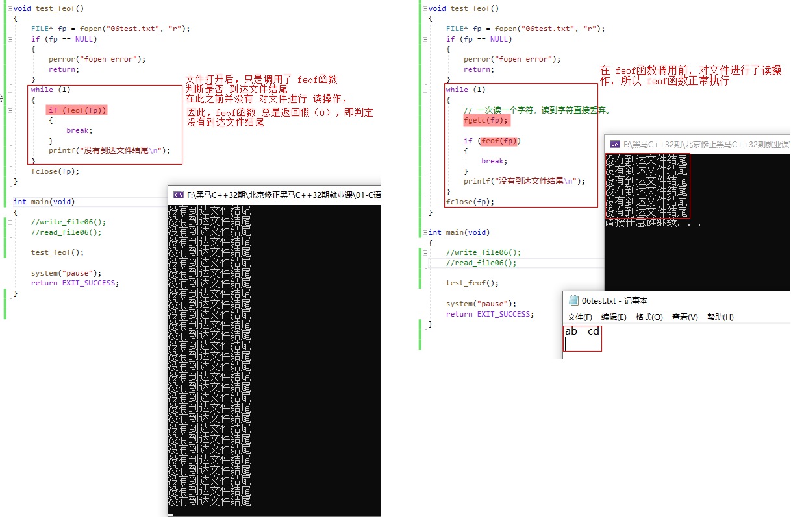

> 如上图，在 `feof` 函数调用前，需要进行文件的读操作，否则 `feof` 函数总是返回假，即总是判定没有到达文件结尾。

**示例4：避免将 `EOF` 打印出来**

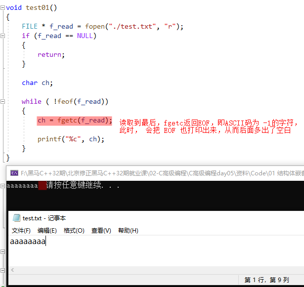

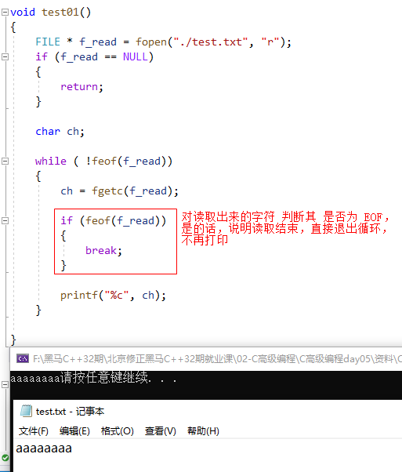

## 10. 从指定输入流中获取一个字符串：`fgets`

> 参考：[day05-从指定输入流中获取一个字符串：fgets](/zkq/c_and_cpp/_1_c-basic/day05.html#_4-4-2-从指定输入流中获取一个字符串-fgets)

## 11. 将一个字符串写出到指定输出流：`fputs`

> 参考：[day05-将一个字符串写出到指定输出流：fputs](/zkq/c_and_cpp/_1_c-basic/day05.html#_4-4-4-将一个字符串写出到指定输出流-fputs)

## 12. 案例

### 12.1 案例1：获取用户键盘输入保存到文件

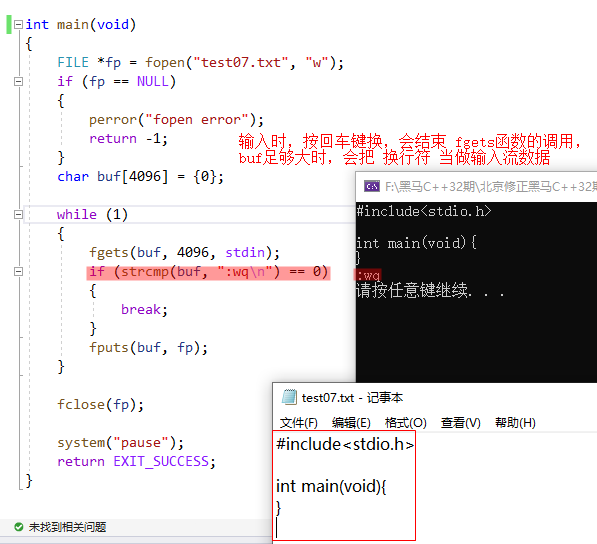

### 12.2 案例2：文件版四则运算

**需求：**

```:no-line-numbers
将文件内容：
    10/2=
    10*3=
    4+3=
    8-6=

读取出来，进行四则运算，再将结果写入到文件中：
    10/2=5
    10*3=30
    4+3=7
    8-6=2
```

**思路：**

```:no-line-numbers
1. 调用 fgets 函数按行读取文件（fgets 函数遇换行符终止读取）
    fgets(buf, 4096, 文件fp)  =>  "10/2=\n" 

2. 对读取到的一行字符串进行分解 
    "10/2=\n"  =>  sscanf(buf, "%d%c%d=\n", &a, &c, &b);  =>  a=10, b=2, c='/'

3. 根据分解得到的运算符进行不同的运算
    switch (c) {
        case '/':
            a / b;
            break;
        case '+':
            a + b;
            break;
        ....
    }

4. 将运算结果拼接到表达式上，再将多个带有结果的运算表达式拼接成一个字符串，最后再写入到原文件中
    char result[];  sprintf()/strcat()  =>  "10/2=5\n10*3=30\n4+3=7\n8-6=2\n"  =>  fputs(result, fp)
```

**代码实现：**

```:no-line-numbers
step1：
    准备一份未写入运算结果的文件 test08.txt
```

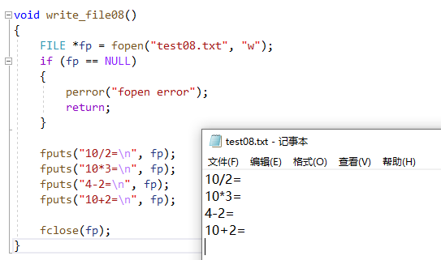

```:no-line-numbers
step2:
    a. 按行读取 test08.txt 中的运算表达式；
    b. 解析运算表达式，并计算结果；
    c. 将计算结果拼接到运算表达式上 
    d. 将多个带有结果的运算表达式拼接成一个字符串
    e. 再将拼接得到的字符串写入到 test08.txt 文件
```

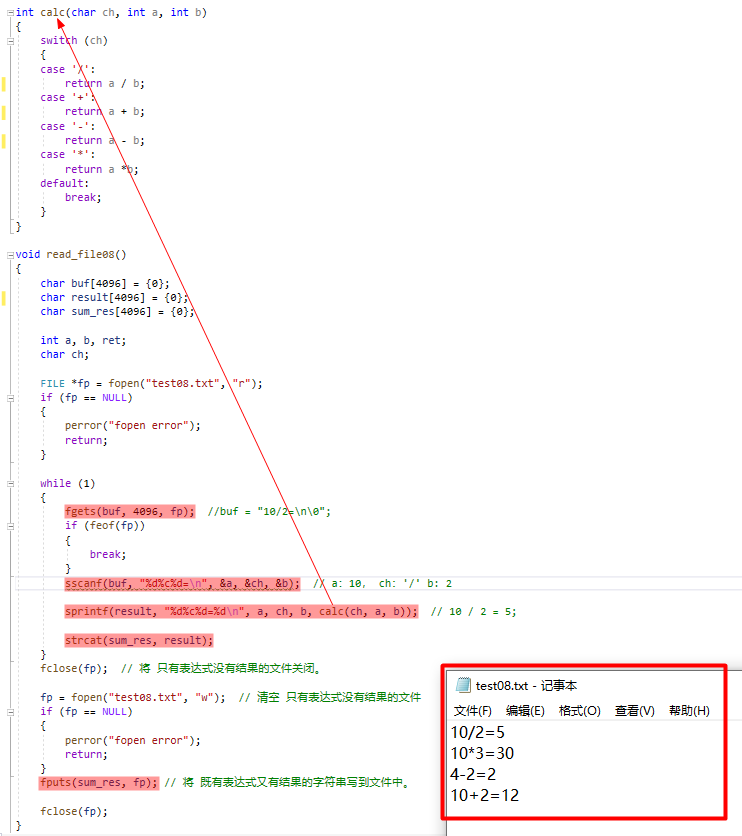

```:no-line-numbers
step3:
    main 函数
```

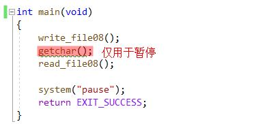